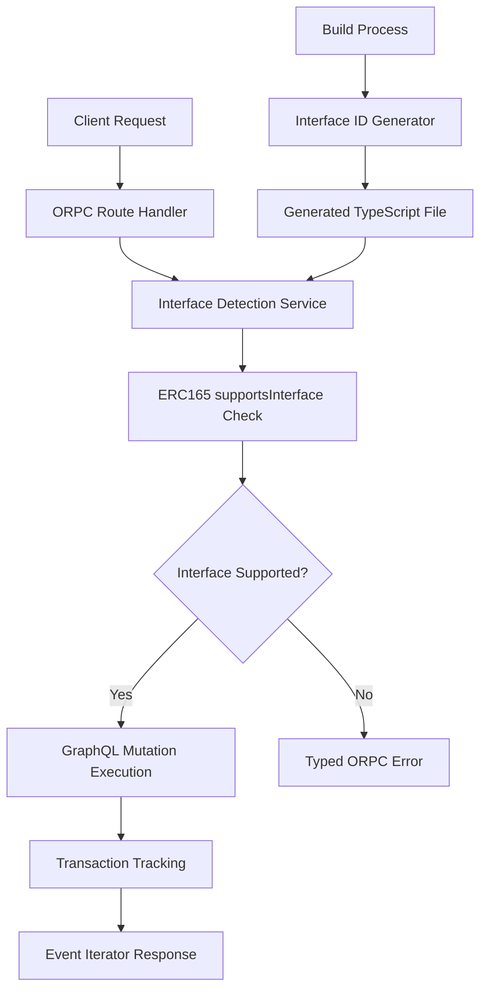
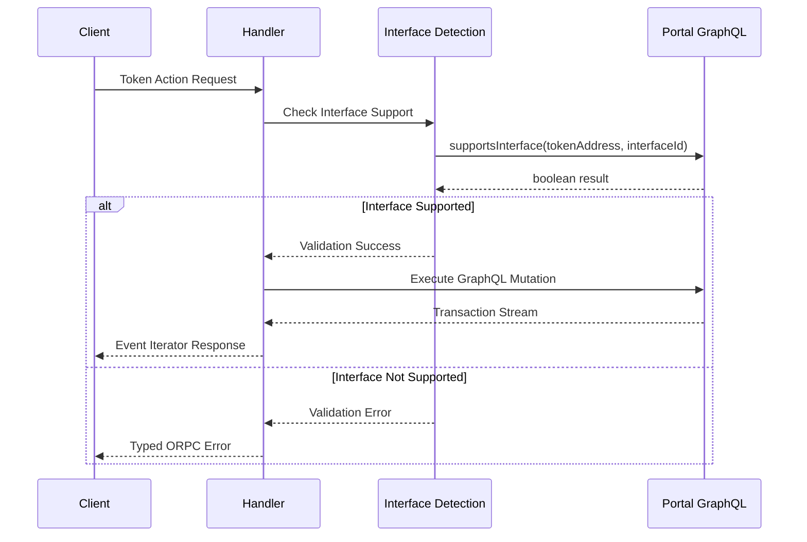

# Design Document

## Overview

This design outlines the implementation of orpc routes for token actions across all asset types in the ATK system. The solution will create a unified API for token operations while leveraging ERC165 interface detection to determine available capabilities for each token type. The design follows the existing pause/unpause mutation patterns and integrates interface ID generation into the build process.

## Architecture

### High-Level Architecture



### Directory Structure

```
kit/dapp/src/orpc/routes/token/routes/mutations/
├── mint/
│   ├── token.mint.ts
│   ├── token.mint.schema.ts
│   ├── token.batch-mint.ts
│   └── token.batch-mint.schema.ts
├── burn/
│   ├── token.burn.ts
│   ├── token.burn.schema.ts
│   ├── token.batch-burn.ts
│   └── token.batch-burn.schema.ts
├── transfer/
│   ├── token.transfer.ts
│   ├── token.transfer.schema.ts
│   ├── token.transfer-from.ts
│   ├── token.transfer-from.schema.ts
│   ├── token.forced-transfer.ts
│   ├── token.forced-transfer.schema.ts
│   ├── token.batch-transfer.ts
│   └── token.batch-transfer.schema.ts
├── freeze/
│   ├── token.freeze-address.ts
│   ├── token.freeze-address.schema.ts
│   ├── token.freeze-partial.ts
│   ├── token.freeze-partial.schema.ts
│   ├── token.unfreeze-partial.ts
│   ├── token.unfreeze-partial.schema.ts
│   ├── token.batch-freeze-address.ts
│   ├── token.batch-freeze-address.schema.ts
│   ├── token.batch-freeze-partial.ts
│   ├── token.batch-freeze-partial.schema.ts
│   ├── token.batch-unfreeze-partial.ts
│   └── token.batch-unfreeze-partial.schema.ts
├── approve/
│   ├── token.approve.ts
│   └── token.approve.schema.ts
├── redeem/
│   ├── token.redeem.ts
│   ├── token.redeem.schema.ts
│   ├── token.redeem-all.ts
│   └── token.redeem-all.schema.ts
├── recover/
│   ├── token.recover-tokens.ts
│   ├── token.recover-tokens.schema.ts
│   ├── token.recover-erc20.ts
│   ├── token.recover-erc20.schema.ts
│   ├── token.forced-recover.ts
│   └── token.forced-recover.schema.ts
├── cap/
│   ├── token.set-cap.ts
│   └── token.set-cap.schema.ts
├── yield/
│   ├── token.set-yield-schedule.ts
│   └── token.set-yield-schedule.schema.ts
└── compliance/
    ├── token.add-compliance-module.ts
    ├── token.add-compliance-module.schema.ts
    ├── token.remove-compliance-module.ts
    └── token.remove-compliance-module.schema.ts
```

## Components and Interfaces

### Interface ID Generator

**Location:** `kit/dapp/src/lib/interface-ids.ts`

```typescript
// Similar to kit/subgraph/tools/interfaceid.ts but for dapp
export interface InterfaceIds {
  IERC20: string;
  IERC165: string;
  ISMARTBurnable: string;
  ISMARTCustodian: string;
  ISMARTRedeemable: string;
  ISMARTCapped: string;
  ISMARTCollateral: string;
  ISMARTYield: string;
  ISMARTPausable: string;
  // ... other interfaces
}

export const INTERFACE_IDS: InterfaceIds = {
  // Generated interface IDs
};
```

### Interface Detection Function

**Location:** `kit/dapp/src/orpc/helpers/interface-detection.ts`

```typescript
import { INTERFACE_IDS } from '@/lib/interface-ids';
import { ORPCError } from '@orpc/server';

export async function supportsInterface(
  tokenAddress: string,
  interfaceId: string
): Promise<boolean> {
  // Implementation using portal GraphQL to check supportsInterface
}

export async function validateTokenCapability(
  tokenAddress: string,
  requiredInterface: string,
  action: string
): Promise<void> {
  const supported = await supportsInterface(tokenAddress, requiredInterface);
  if (!supported) {
    throw new ORPCError("BAD_REQUEST", {
      message: `Token does not support ${action}`,
      data: {
        tokenAddress,
        action,
        requiredInterface,
      },
    });
  }
}

export interface TokenCapabilities {
  burnable: boolean;
  custodian: boolean;
  redeemable: boolean;
  capped: boolean;
  collateral: boolean;
  yield: boolean;
  pausable: boolean;
}

export async function getTokenCapabilities(
  tokenAddress: string
): Promise<TokenCapabilities> {
  // Check multiple interfaces and return capabilities
}
```
```

## Data Models

### Schema Examples

Each action will have its own schema following the existing pattern:

```typescript
// Example: token.mint.schema.ts
import { MutationInputSchemaWithContract, MutationOutputSchema } from "@/orpc/routes/common/schemas/mutation.schema";
import { TransactionTrackingMessagesSchema } from "@/orpc/routes/common/schemas/transaction-messages.schema";
import { z } from "zod";

export const TokenMintMessagesSchema = TransactionTrackingMessagesSchema.extend({
  preparingMint: z.string().optional().default("Preparing to mint tokens..."),
  submittingMint: z.string().optional().default("Submitting mint transaction..."),
  tokensMinted: z.string().optional().default("Tokens minted successfully"),
  mintFailed: z.string().optional().default("Failed to mint tokens"),
});

export const TokenMintInputSchema = MutationInputSchemaWithContract.extend({
  to: z.string().min(1, "Recipient address must be provided"),
  amount: z.string().min(1, "Amount must be provided"),
  messages: TokenMintMessagesSchema.optional(),
});

export const TokenBatchMintInputSchema = MutationInputSchemaWithContract.extend({
  toList: z.array(z.string().min(1)).min(1, "At least one recipient required"),
  amounts: z.array(z.string().min(1)).min(1, "At least one amount required"),
  messages: TokenMintMessagesSchema.optional(),
});

// Freeze-specific schema example
export const TokenFreezeInputSchema = MutationInputSchemaWithContract.extend({
  userAddress: z.string().min(1, "User address must be provided"),
  freeze: z.boolean(),
  messages: TokenFreezeMessagesSchema.optional(),
});
```

### Asset Type Detection

Asset type detection will use the existing utilities from `kit/dapp/src/lib/zod/validators/asset-types.ts`:

```typescript
import { AssetType, getAssetTypeFromFactoryTypeId } from "@/lib/zod/validators/asset-types";

// Asset types: "bond", "equity", "fund", "stablecoin", "deposit"
// Factory types: "ATKBondFactory", "ATKEquityFactory", etc.
```

## Error Handling

### Interface Validation Flow




## Implementation Phases

### Phase 1: Foundation
1. Create interface ID generation tool
2. Implement interface detection service
3. Create base token action handler
4. Set up error types and schemas

### Phase 2: Core Actions
1. Implement mint operations (single + batch)
2. Implement burn operations (single + batch)
3. Implement transfer operations (transfer, transferFrom, forced, batch)
4. Add comprehensive testing

### Phase 3: Advanced Actions
1. Implement freeze/unfreeze operations
2. Implement approve operations
3. Implement redeem operations (where applicable)
4. Add recovery operations

### Phase 4: Administrative Actions
1. Implement cap management
2. Implement compliance management
3. Implement identity management
4. Implement yield management

### Phase 5: Integration & Optimization
1. Integrate all routes into token router
2. Add comprehensive error handling
3. Performance optimization
4. Documentation and examples

## Security Considerations

1. **Interface Validation**: Always validate interface support before attempting operations
2. **Input Sanitization**: Validate all addresses and amounts
3. **Permission Checks**: Leverage existing middleware for role-based access
4. **Transaction Safety**: Use existing transaction tracking and error handling patterns

## Performance Considerations

1. **Interface Caching**: Cache interface detection results to avoid repeated calls
2. **Batch Optimization**: Optimize batch operations for gas efficiency
3. **Lazy Loading**: Load interface IDs only when needed
4. **Connection Pooling**: Reuse GraphQL connections where possible

## Monitoring and Observability

1. **Action Metrics**: Track usage of each token action
2. **Error Tracking**: Monitor interface validation failures
3. **Performance Metrics**: Track response times for each action type
4. **Success Rates**: Monitor transaction success rates by action and asset type