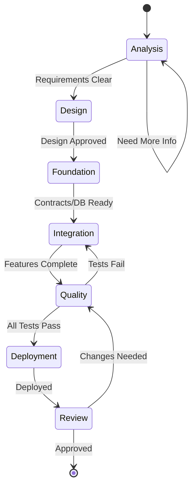

# Asset Tokenization Kit

**SettleMint Asset Tokenization Kit** - Full-stack blockchain tokenization
platform.

## Quick Reference

```bash
# Setup
bun install && bunx settlemint connect --instance local && bun run artifacts

# Development
bun run dev:up && bun run dev

# Quality (REQUIRED before PR)
bun run ci

# Branch check (CRITICAL)
[[ "$(git branch --show-current)" =~ ^(main|master)$ ]] && git checkout -b feature/name
```

## Project Structure

- `kit/contracts/` - Solidity (ERC-3643, UUPS) → Use **solidity-expert**
- `kit/dapp/` - React 19, TanStack, ORPC → Use **react-dev**
- `kit/subgraph/` - TheGraph indexing → Use **subgraph-dev**
- `kit/dapp/src/orpc/` - API endpoints → Use **orpc-expert**

## Enhanced Agent Orchestration System

### Orchestration Architecture

**Dependency Matrix**: See `.claude/orchestration/agent-dependencies.yaml`
**Context Management**: See `.claude/orchestration/context-management.ts`
**Workflows**: See `.claude/orchestration/workflows/`

### CRITICAL: Agent Communication Protocol

**Sub-agents CANNOT invoke other agents** - Only main Claude orchestrates:

- Agents return structured `AgentOutput` format (see context-management.ts)
- Main Claude manages shared context and caching
- Smart dependency resolution enables optimal parallelization

### Enhanced Agent Routing

**For any implementation task:**

1. **ALWAYS start with planner** for multi-step features
2. **CHECK dependency matrix** for parallelization opportunities
3. **USE workflow patterns** for common scenarios (bug-fix, feature-dev)
4. **MAINTAIN shared context** across agent invocations
5. **CACHE strategically** to reduce token usage
6. **SELECT appropriate model** based on task complexity

### Structured Agent Return Format

```typescript
// See .claude/orchestration/context-management.ts for full interface
interface AgentOutput {
  taskCompletion: { status: 'completed' | 'blocked' | 'partial' }
  summary: { primaryOutcome: string; confidenceLevel: 'high' | 'medium' | 'low' }
  deliverables: { filesModified: [...], artifactsCreated: [...] }
  contextHandoff: { readyForAgents: [...], sharedResources: [...] }
  qualityGates: { tests: {...}, security: {...}, performance: {...} }
  cacheKeys: { geminiAnalysis?: string, context7Docs?: string }
}
```

### Compressed Format (30% token reduction)

```yaml
s: ✓  # status
f: ["/path/file.ts:+45-12"]  # files modified
n: ["orpc-expert:api_endpoints"]  # next agents
c: ["gemini:abc123"]  # cache keys
```

### Available Specialized Agents

**Core Development:**

- **planner** (Opus): Tech lead, analyzes requirements, orchestrates teams
- **solidity-expert** (Opus): Smart contract development and security
- **react-dev** (Sonnet): React components with TanStack suite
- **orpc-expert** (Sonnet): ORPC API endpoints and OpenAPI
- **subgraph-dev** (Sonnet): TheGraph indexing and mappings
- **database-expert** (Sonnet): PostgreSQL/Drizzle ORM optimization ⚡ NEW
- **typescript-expert** (Sonnet): Advanced type system patterns ⚡ NEW

**Quality & Testing:**

- **test-dev** (Sonnet): Vitest and Forge test creation
- **integration-tester** (Sonnet): E2E testing with Playwright
- **security-auditor** (Opus): Comprehensive security reviews
- **code-reviewer** (Sonnet): Post-implementation review

**Infrastructure & Optimization:**

- **devops**: Helm charts and Kubernetes configs
- **ci-cd-expert**: GitHub Actions and deployment pipelines
- **performance-optimizer**: Full-stack performance tuning
- **observability-expert**: Monitoring, logging, Sentry ⚡ NEW
- **config-expert**: Environment and secret management ⚡ NEW

**Specialized Support:**

- **tailwind-css-expert**: Styling with Tailwind/shadcn
- **documentation-expert**: All documentation needs - README, CLAUDE.md,
  content, translations (MUST write to README.md files in relevant folders,
  NEVER create separate docs/ folders)
- **code-archaeologist**: Legacy code analysis
- **team-configurator**: Multi-agent coordination

### Smart Parallel Execution

**Dependency-Based Parallelization:**

The system now uses dependency matrices to automatically determine optimal parallelization:

```yaml
# Example from agent-dependencies.yaml
solidity-expert:
  parallel_with: [typescript-expert, database-expert, documentation-expert]
  required_for: [subgraph-dev, orpc-expert]
```

**Execution Phases:**

1. **Analysis Phase** (Parallel): planner, code-archaeologist, security-auditor
2. **Foundation Phase** (Parallel): solidity-expert, database-expert, typescript-expert
3. **Integration Phase** (Sequential Groups): subgraph → orpc → react/tests
4. **Quality Phase** (Parallel): testing, optimization, documentation
5. **Review Phase** (Sequential): code-reviewer

**Micro-Parallelization:**

Within each phase, maximize parallelization:
- Batch file operations
- Concurrent API calls
- Parallel test execution
- Simultaneous documentation updates

### Workflow Examples

#### Feature Development (see workflows/feature-development.yaml)

```yaml
User: "Add token transfer functionality with approval"

# Automatic workflow selection based on task type
Workflow: feature_development_workflow

Phases:
  1. Analysis (Parallel):
     - planner (opus): Requirements analysis
     - code-archaeologist (opus): Existing patterns
     - security-auditor (opus): Threat model
     - performance-optimizer (opus): Baseline metrics
     
  2. Design (Parallel):
     - typescript-expert (sonnet): Type interfaces
     - database-expert (sonnet): Schema if needed
     - config-expert (sonnet): Feature flags
     
  3. Foundation → Integration → Quality → Review
     - Smart contracts: opus (security critical)
     - APIs/UI: sonnet (established patterns)
     - Tests: sonnet (repetitive patterns)
```

#### Bug Fix (see workflows/bug-fix.yaml)

```yaml
User: "Fix null pointer in auth module"

Workflow: bug_fix_workflow

Phases:
  1. Triage: root cause + security impact
  2. Planning: fix strategy
  3. Implementation: targeted fix
  4. Testing: regression prevention
  5. Review: quality gate
```

### Workflow State Machine



### Context Handoff Pattern

```typescript
// Phase 1 completes
const phase1Context = {
  contractAddresses: { token: '0x...', factory: '0x...' },
  decisions: { gasOptimization: 'moderate', securityLevel: 'high' },
  caches: { gemini: 'analysis_123', context7: 'react_hooks_v19' }
};

// Phase 2 receives context
INVOKE subgraph-dev WITH:
  "Index events for contracts at ${phase1Context.contractAddresses}"
  "Apply security level: ${phase1Context.decisions.securityLevel}"
  "Use cached analysis: ${phase1Context.caches.gemini}"
```

### Caching Strategy

```yaml
Cache Lifetimes:
  context7_docs: 1 hour     # Library documentation
  gemini_analysis: 10 min   # Code analysis results
  grep_examples: 1 day      # Real-world examples
  agent_outputs: task       # Within workflow only
```

## Intelligent Model Selection

**Model Strategy**: See `.claude/orchestration/model-selection.yaml`

### Quick Reference

**Use Opus (Deep Reasoning) for:**
- Security-critical code (smart contracts, auth)
- Architecture design and planning
- Complex problem solving
- Performance optimization
- Cross-system integration

**Use Sonnet (Fast Patterns) for:**
- Standard implementations
- Well-defined patterns
- Documentation and tests
- Configuration changes
- Parallel execution tasks

### Agent Model Defaults

| Agent Type | Default Model | Override Conditions |
|------------|---------------|--------------------|
| Strategic (planner, security) | Opus | Simple CRUD → Sonnet |
| Implementation (react, orpc) | Sonnet | Complex logic → Opus |
| Testing & Docs | Sonnet | Architecture review → Opus |
| Infrastructure | Sonnet | Complex setup → Opus |

### Model Selection in Commands

```bash
# Specify model when invoking agents
INVOKE planner WITH model:opus FOR "complex architecture design"
INVOKE react-dev WITH model:sonnet FOR "add loading spinner"

# Parallel execution optimization
PARALLEL EXECUTION:
  - solidity-expert WITH model:opus    # Critical path
  - react-dev WITH model:sonnet        # Can wait
  - test-dev WITH model:sonnet         # Pattern-based
```

### Cost-Performance Optimization

1. **Critical Path Analysis**: Use Opus only for blocking tasks
2. **Parallel Preference**: Sonnet for parallel tasks (faster)
3. **Security Override**: Always Opus for security analysis
4. **Budget Mode**: Prefer Sonnet unless complexity demands Opus

### Dynamic Model Selection Rules

```yaml
# Automatic model selection based on task
if task.contains(["security", "auth", "financial"]):
  model = opus  # Security first
elif task.is_urgent and task.is_simple:
  model = sonnet  # Speed for simple tasks
elif task.requires_analysis:
  model = opus  # Deep reasoning needed
else:
  model = agent.default  # Use agent's default
```

## Essential Commands

See `package.json` scripts. Key ones:

- `bun run artifacts` - After contract changes
- `bun run dev:reset` - Reset Docker environment
- `bun run db:generate && bun run db:migrate` - Database changes

## MCP Tools (Strategic Usage)

### MANDATORY: Gemini-CLI Usage Protocol

**ALWAYS use Gemini-CLI for:**

1. **Context Gathering** (REQUIRED before implementation):
   - `@file.ts explain the architecture` - Understand before modifying
   - `@module/ what patterns are used here` - Learn conventions first
   - Use before making architectural decisions
2. **Code Review** (REQUIRED after changes):
   - `@changed-file.ts review for bugs and edge cases`
   - `changeMode: true` for structured edit suggestions
   - Validate security implications of changes

3. **Complex Problem Solving**:
   - Architecture validation and alternatives
   - Performance optimization strategies
   - Cross-module impact analysis

**Usage Pattern:**

```bash
# Before implementation - gather context
mcp__gemini-cli__ask-gemini(prompt="@kit/contracts/ explain the upgrade pattern", model="gemini-2.5-pro")

# After implementation - review changes
mcp__gemini-cli__ask-gemini(prompt="@file.ts review my changes for security issues", changeMode=true)

# For complex analysis - use flash for speed
mcp__gemini-cli__ask-gemini(prompt="analyze performance bottlenecks", model="gemini-2.5-pro")
```

### MCP Tool Caching & Optimization

2. **Context7** - Latest library docs
   ```typescript
   // Cache docs for session duration
   const reactDocs = await mcp__context7__get_library_docs({
     libraryId: '/facebook/react',
     topic: 'hooks',
     tokens: 5000
   });
   // Store in context.caches.context7['react_hooks'] = reactDocs;
   ```

3. **Grep** - Real-world examples
   ```typescript
   // Cache examples for 24 hours
   const examples = await mcp__grep__searchGitHub({
     query: 'useState\\(',
     language: ['TypeScript']
   });
   // Store in context.caches.realWorldExamples['useState'] = examples;
   ```

4. **Linear/Sentry** - Issue tracking (no caching needed)

5. **OpenZeppelin Contracts** - Smart contract generation
   - Quick prototyping with audited base contracts
   - ERC-20/721/1155 tokens, DAOs, stablecoins
   - Use with `solidity-expert` to extend for ATK patterns

## CLAUDE.md Creation Rules

Module CLAUDE.md files MUST be minimal (< 50 lines):

```markdown
# [Module] - AI Guidelines

[One-line description]. See [README.md](./README.md) for documentation.

**Agent**: Use `[agent-name]` for this module.

[Only critical AI-specific notes if needed]
```

## Documentation Rules

1. **ALWAYS write documentation in README.md files** in the relevant module
   folders
2. **NEVER create separate docs/ folders** - documentation belongs with the code
3. **Module structure for documentation**:
   - `kit/contracts/README.md` - Smart contract documentation
   - `kit/dapp/README.md` - Frontend documentation
   - `kit/dapp/src/orpc/README.md` - API documentation
   - `kit/subgraph/README.md` - Subgraph documentation
4. **Documentation content**:
   - User guides go in module README.md files
   - API references go in relevant folder README.md files
   - Architecture docs go in root or module README.md files

## Critical Rules

1. **NEVER commit to main branch**
2. **ALWAYS run `bun run ci` before PR**
3. **Trust Opus first, validate with Gemini-CLI only when needed**
4. **NEVER modify shadcn components in ui/ folder**
5. **Subgraph .ts files are AssemblyScript, not TypeScript**
6. **React hooks**: Avoid unnecessary useCallback/useMemo - see react-dev agent
   guidelines
7. **React Query with ORPC**:

   ```typescript
   // ✅ CORRECT - Direct usage preserves type safety
   useMutation(orpc.token.create.mutationOptions());
   useQuery(orpc.token.read.queryOptions({ input: { id } }));

   // ✅ CORRECT - Custom hooks for reusability
   function useUserTokens(userId?: string) {
     return useQuery(
       orpc.token.listByUser.queryOptions({
         input: { userId },
         enabled: !!userId, // Dependent query pattern
       })
     );
   }

   // ❌ WRONG - Don't destructure or copy to state
   useMutation({ ...orpc.token.create.mutationOptions() });
   const [tokens, setTokens] = useState(data?.tokens); // Never copy query data
   ```

   - Use `select` for transformations, not render-time filtering
   - Handle loading/error states before checking data
   - Create custom hooks for complex queries
   - Test with MSW and fresh QueryClient per test

## Memories

- Shadcn components are never the problem

## Context Optimization

- Reference README.md files instead of duplicating content
- Keep agent-specific details in agent files
- Use concise command examples
- Avoid redundant explanations
- Link to external docs rather than copying

## Granular Task Planning

**CRITICAL**: All tasks must be broken down into specific, measurable actions
with concrete values. This transparency ensures all implementation decisions are
visible and approved before execution.

### ❌ WRONG - Vague Tasks:

- "Style the navbar"
- "Optimize the API"
- "Update the database schema"
- "Improve the algorithm"

### ✅ CORRECT - Granular Tasks:

- "Change navbar height from 60px to 80px"
- "Reduce padding-top from 16px to 12px"
- "Adjust background from #ffffff to rgba(255,255,255,0.95)"
- "Add index on user_id column in tokens table"
- "Change API timeout from 30s to 10s"
- "Replace O(n²) nested loop with O(n log n) sort-then-process"
- "Increase cache TTL from 5 minutes to 15 minutes"

### Domain-Specific Examples:

**Frontend Tasks:**

- "Change button border-radius from 4px to 8px"
- "Update font-size from 14px to 16px for .heading-secondary"
- "Add 200ms ease-in-out transition to hover states"
- "Change grid from 3 columns to 4 columns on desktop (>1024px)"

**Backend Tasks:**

- "Add rate limiting: 100 requests per minute per IP"
- "Change batch size from 100 to 500 records"
- "Add retry logic: 3 attempts with exponential backoff (1s, 2s, 4s)"
- "Update validation: require email to match /^[^\s@]+@[^\s@]+\.[^\s@]+$/"

**Database Tasks:**

- "Add compound index on (user_id, created_at DESC)"
- "Change column type from VARCHAR(255) to TEXT"
- "Add CHECK constraint: price >= 0"
- "Set default value for status column to 'pending'"

**Algorithm Tasks:**

- "Replace linear search with binary search for sorted array"
- "Change hash function from MD5 to SHA-256"
- "Update threshold from 0.7 to 0.85 for matching algorithm"
- "Add memoization for recursive calls with cache size 1000"

## Agent Context7 MCP Documentation Requirements

**CRITICAL**: All specialized agents MUST fetch latest documentation using
Context7 MCP for their area of responsibility before implementation. This
ensures agents use current APIs and best practices.

Each agent has specific Context7 documentation requirements defined in their
individual agent files in `.claude/agents/`. Agents must:

1. **Fetch documentation at task start** - Before any implementation
2. **Use library-specific topics** - Target relevant documentation sections
3. **Apply latest patterns** - Use current best practices from docs
4. **Cache results** - Avoid redundant fetches in same session

### Documentation Fetching Pattern

All agents should follow this pattern:

1. **Identify required libraries** from package.json and imports
2. **Resolve library IDs** using `resolve-library-id`
3. **Fetch specific docs** with relevant topics using `get-library-docs`
4. **Cache results** to avoid repeated fetches in same session
5. **Apply latest patterns** from fetched documentation

### Example Agent Implementation

```typescript
// At the start of any agent task
async function fetchRequiredDocs() {
  // Resolve library ID first
  const { libraryId } =
    (await mcp__context7__resolve) -
    library -
    id({
      libraryName: "react",
    });

  // Then fetch documentation with specific topic
  const docs =
    (await mcp__context7__get) -
    library -
    docs({
      context7CompatibleLibraryID: libraryId,
      topic: "hooks",
      tokens: 5000,
    });

  return docs;
}
```

## Agent Best Practices

1. **Agent File Guidelines**
   - Keep under 500 lines for token efficiency
   - Use bullet points over paragraphs
   - Include only essential examples
   - Reference docs instead of embedding

2. **Agent Selection**
   - Use `planner` for any multi-step implementation
   - Invoke `security-auditor` before production deployments
   - Run `integration-tester` for user-facing features
   - Apply `performance-optimizer` when metrics degrade

3. **Workflow Patterns**
   - **Parallel**: Frontend + Backend development
   - **Sequential**: Contract → Subgraph → API → UI
   - **Continuous**: Security + Performance reviews
   - **Final**: Code review before completion

4. **Task Transparency**
   - Break down ALL tasks into specific, measurable actions
   - Include exact values (pixels, percentages, timeouts, etc.)
   - Expose algorithmic choices and thresholds
   - Make design decisions explicit before implementation

5. **Documentation First**
   - ALWAYS fetch latest docs before implementation
   - Use Context7 MCP for all library documentation
   - Apply current best practices from fetched docs
   - Update approach based on latest API changes
