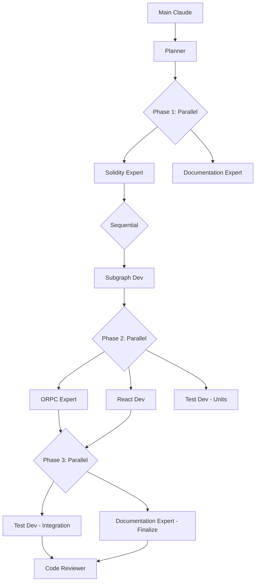

# Asset Tokenization Kit

**SettleMint Asset Tokenization Kit** - Full-stack blockchain tokenization
platform.

## Quick Reference

```bash
# Setup
bun install && bunx settlemint connect --instance local && bun run artifacts

# Development
bun run dev:up && bun run dev

# Quality (REQUIRED before PR)
bun run ci

# Branch check (CRITICAL)
[[ "$(git branch --show-current)" =~ ^(main|master)$ ]] && git checkout -b feature/name
```

## Project Structure

- `kit/contracts/` - Solidity (ERC-3643, UUPS) → Use **solidity-expert**
- `kit/dapp/` - React 19, TanStack, ORPC → Use **react-dev**
- `kit/subgraph/` - TheGraph indexing → Use **subgraph-dev**
- `kit/dapp/src/orpc/` - API endpoints → Use **orpc-expert**

## Agent Orchestration Pattern

### CRITICAL: Agent Communication Limitations

**Sub-agents CANNOT invoke other agents** - Only main Claude orchestrates:

- Agents return structured outputs with handoff information
- Main Claude extracts findings and passes context between agents
- Each agent must specify what the next agent needs

### Agent Routing Protocol

**For any implementation task:**

1. **ALWAYS start with planner** agent for multi-step features
2. **FOLLOW the agent routing** specified by planner EXACTLY
3. **USE ONLY the agents** explicitly recommended
4. **EXTRACT and PASS context** between agent invocations
5. **EXECUTE agents in PARALLEL** when tasks are independent

### Agent Return Format

Agents must return structured information:

```markdown
## Task Completed: [Task Name]

- Key findings: [What was discovered/implemented]
- Output location: [Files created/modified]
- Next agent needs: [Context for next specialist]
- Blockers: [Any issues preventing completion]
```

### Available Specialized Agents

**Core Development:**

- **planner**: Tech lead, analyzes requirements, orchestrates teams
- **solidity-expert**: Smart contract development and security
- **react-dev**: React components with TanStack suite
- **orpc-expert**: ORPC API endpoints and OpenAPI
- **subgraph-dev**: TheGraph indexing and mappings

**Quality & Testing:**

- **test-dev**: Vitest and Forge test creation
- **integration-tester**: E2E testing with Playwright
- **security-auditor**: Comprehensive security reviews
- **code-reviewer**: Post-implementation review

**Infrastructure & Optimization:**

- **devops**: Helm charts and Kubernetes configs
- **ci-cd-expert**: GitHub Actions and deployment pipelines
- **performance-optimizer**: Full-stack performance tuning

**Specialized Support:**

- **tailwind-css-expert**: Styling with Tailwind/shadcn
- **documentation-expert**: All documentation needs - README, CLAUDE.md,
  content, translations
- **code-archaeologist**: Legacy code analysis
- **team-configurator**: Multi-agent coordination

### Parallel Execution Guidelines

**When to Execute in Parallel:**
- Independent file operations (reads, writes, analysis)
- Separate module implementations (frontend + backend)
- Multiple test file creations
- Documentation across different modules
- Style and type definitions

**When to Execute Sequentially:**
- Dependencies exist between tasks
- Output from one agent feeds another
- Contract → Subgraph → API → UI flow
- Security reviews require complete code

### Example: Multi-Agent Feature Implementation

```
User: "Add token transfer functionality with approval"

Optimized Parallel Flow:
1. Invoke planner agent → Returns implementation roadmap
2. Extract planner's findings and routing map
3. PARALLEL EXECUTION - Phase 1:
   - solidity-expert: "Implement transfer methods per planner's spec"
   - documentation-expert: "Prepare transfer feature documentation structure"
4. SEQUENTIAL - Phase 2 (needs contract output):
   - subgraph-dev: "Index transfer events from contract at [address]"
5. PARALLEL EXECUTION - Phase 3:
   - orpc-expert: "Create transfer API endpoints"
   - react-dev: "Build transfer UI components"
   - test-dev: "Write unit tests for utilities"
6. PARALLEL EXECUTION - Phase 4:
   - test-dev: "Integration tests for complete feature"
   - documentation-expert: "Finalize docs with examples"
7. SEQUENTIAL - Final Phase:
   - code-reviewer: "Review all changes"
```

### Orchestration Workflow



### Parallel Execution Syntax

When invoking agents in parallel, use clear phase grouping:

```markdown
## PARALLEL EXECUTION - [Phase Name]
Invoke the following agents simultaneously:
- agent-1: "Task description with specific context"
- agent-2: "Task description with specific context"
- agent-3: "Task description with specific context"

## SEQUENTIAL EXECUTION - [Phase Name]
After parallel tasks complete, invoke:
- agent-4: "Task using outputs from previous phase"
```

## Essential Commands

See `package.json` scripts. Key ones:

- `bun run artifacts` - After contract changes
- `bun run dev:reset` - Reset Docker environment
- `bun run db:generate && bun run db:migrate` - Database changes

## MCP Tools (Strategic Usage)

### MANDATORY: Gemini-CLI Usage Protocol

**ALWAYS use Gemini-CLI for:**

1. **Context Gathering** (REQUIRED before implementation):
   - `@file.ts explain the architecture` - Understand before modifying
   - `@module/ what patterns are used here` - Learn conventions first
   - Use before making architectural decisions
2. **Code Review** (REQUIRED after changes):
   - `@changed-file.ts review for bugs and edge cases`
   - `changeMode: true` for structured edit suggestions
   - Validate security implications of changes

3. **Complex Problem Solving**:
   - Architecture validation and alternatives
   - Performance optimization strategies
   - Cross-module impact analysis

**Usage Pattern:**

```bash
# Before implementation - gather context
mcp__gemini-cli__ask-gemini(prompt="@kit/contracts/ explain the upgrade pattern", model="gemini-2.5-pro")

# After implementation - review changes
mcp__gemini-cli__ask-gemini(prompt="@file.ts review my changes for security issues", changeMode=true)

# For complex analysis - use flash for speed
mcp__gemini-cli__ask-gemini(prompt="analyze performance bottlenecks", model="gemini-2.5-pro")
```

### Other MCP Tools:

2. **Context7** - Latest library docs
3. **Grep** - Real-world examples
4. **Linear/Sentry** - Issue tracking
5. **OpenZeppelin Contracts** - Smart contract generation:
   - Quick prototyping with audited base contracts
   - ERC-20/721/1155 tokens, DAOs, stablecoins
   - Use with `solidity-expert` to extend for ATK patterns

## CLAUDE.md Creation Rules

Module CLAUDE.md files MUST be minimal (< 50 lines):

```markdown
# [Module] - AI Guidelines

[One-line description]. See [README.md](./README.md) for documentation.

**Agent**: Use `[agent-name]` for this module.

[Only critical AI-specific notes if needed]
```

## Critical Rules

1. **NEVER commit to main branch**
2. **ALWAYS run `bun run ci` before PR**
3. **Trust Opus first, validate with Gemini-CLI only when needed**
4. **NEVER modify shadcn components in ui/ folder**
5. **Subgraph .ts files are AssemblyScript, not TypeScript**
6. **React hooks**: Avoid unnecessary useCallback/useMemo - see react-dev agent
   guidelines
7. **React Query with ORPC**:

   ```typescript
   // ✅ CORRECT - Direct usage preserves type safety
   useMutation(orpc.token.create.mutationOptions());
   useQuery(orpc.token.read.queryOptions({ input: { id } }));

   // ✅ CORRECT - Custom hooks for reusability
   function useUserTokens(userId?: string) {
     return useQuery(
       orpc.token.listByUser.queryOptions({
         input: { userId },
         enabled: !!userId, // Dependent query pattern
       })
     );
   }

   // ❌ WRONG - Don't destructure or copy to state
   useMutation({ ...orpc.token.create.mutationOptions() });
   const [tokens, setTokens] = useState(data?.tokens); // Never copy query data
   ```

   - Use `select` for transformations, not render-time filtering
   - Handle loading/error states before checking data
   - Create custom hooks for complex queries
   - Test with MSW and fresh QueryClient per test

## Memories

- Shadcn components are never the problem

## Context Optimization

- Reference README.md files instead of duplicating content
- Keep agent-specific details in agent files
- Use concise command examples
- Avoid redundant explanations
- Link to external docs rather than copying

## Granular Task Planning

**CRITICAL**: All tasks must be broken down into specific, measurable actions with concrete values. This transparency ensures all implementation decisions are visible and approved before execution.

### ❌ WRONG - Vague Tasks:
- "Style the navbar"
- "Optimize the API"
- "Update the database schema"
- "Improve the algorithm"

### ✅ CORRECT - Granular Tasks:
- "Change navbar height from 60px to 80px"
- "Reduce padding-top from 16px to 12px"
- "Adjust background from #ffffff to rgba(255,255,255,0.95)"
- "Add index on user_id column in tokens table"
- "Change API timeout from 30s to 10s"
- "Replace O(n²) nested loop with O(n log n) sort-then-process"
- "Increase cache TTL from 5 minutes to 15 minutes"

### Domain-Specific Examples:

**Frontend Tasks:**
- "Change button border-radius from 4px to 8px"
- "Update font-size from 14px to 16px for .heading-secondary"
- "Add 200ms ease-in-out transition to hover states"
- "Change grid from 3 columns to 4 columns on desktop (>1024px)"

**Backend Tasks:**
- "Add rate limiting: 100 requests per minute per IP"
- "Change batch size from 100 to 500 records"
- "Add retry logic: 3 attempts with exponential backoff (1s, 2s, 4s)"
- "Update validation: require email to match /^[^\s@]+@[^\s@]+\.[^\s@]+$/"

**Database Tasks:**
- "Add compound index on (user_id, created_at DESC)"
- "Change column type from VARCHAR(255) to TEXT"
- "Add CHECK constraint: price >= 0"
- "Set default value for status column to 'pending'"

**Algorithm Tasks:**
- "Replace linear search with binary search for sorted array"
- "Change hash function from MD5 to SHA-256"
- "Update threshold from 0.7 to 0.85 for matching algorithm"
- "Add memoization for recursive calls with cache size 1000"

## Agent Best Practices

1. **Agent File Guidelines**
   - Keep under 500 lines for token efficiency
   - Use bullet points over paragraphs
   - Include only essential examples
   - Reference docs instead of embedding

2. **Agent Selection**
   - Use `planner` for any multi-step implementation
   - Invoke `security-auditor` before production deployments
   - Run `integration-tester` for user-facing features
   - Apply `performance-optimizer` when metrics degrade

3. **Workflow Patterns**
   - **Parallel**: Frontend + Backend development
   - **Sequential**: Contract → Subgraph → API → UI
   - **Continuous**: Security + Performance reviews
   - **Final**: Code review before completion

4. **Task Transparency**
   - Break down ALL tasks into specific, measurable actions
   - Include exact values (pixels, percentages, timeouts, etc.)
   - Expose algorithmic choices and thresholds
   - Make design decisions explicit before implementation
