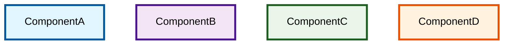

Generate comprehensive, professional-grade technical documentation for the SettleMint Asset Tokenization Kit - a full-stack blockchain platform for tokenizing real-world assets. The documentation must serve enterprise/solution architects, developers, and IT leaders with complete technical specifications, architectural diagrams, implementation guides, and real-world application examples.

## 📋 Pre-Work Requirements

### Context Clearing & Analysis Protocol

**ALWAYS begin each documentation session with these steps:**

1. **Clear Context Window**: Start fresh to prevent residual data contamination from previous sessions
2. **Deep Codebase Analysis**:
   - Read and analyze the complete folder structure (not just skimming)
   - Examine all key configuration files, package.json files, and README files
   - Study the monorepo architecture and workspace dependencies
   - Understand the technology stack and development patterns
3. **Generate Context Summary**: Use the standardized format below

### Context Summary Format (MANDATORY)

```markdown
### Context Summary Format
- **Main Components:** [List primary modules/packages with brief descriptions]
- **Key Workflows:** [Summarize major data flows and user journeys]
- **Unique Features:** [Note design patterns, APIs, integrations, and architectural decisions]
- **Open Issues:** [Document missing files, unreadable contracts, incomplete code, or gaps found during review]
```

## 🏗️ Project Architecture Understanding

### Asset Tokenization Kit Overview

The **SettleMint Asset Tokenization Kit** is a comprehensive full-stack application framework designed for blockchain-based tokenization of real-world assets. Built as an enterprise-grade solution on top of the **SettleMint Blockchain Platform**, it provides all the necessary components to create, manage, and operate compliant digital asset platforms.

### Monorepo Structure
```
asset-tokenization-kit/
├── kit/
│   ├── contracts/       # Smart contracts (Solidity, Foundry, Hardhat)
│   ├── dapp/           # Next.js 15 App Router application
│   ├── subgraph/       # TheGraph indexing protocol
│   ├── e2e/            # Playwright E2E test suite
│   └── charts/         # Helm charts for Kubernetes deployment
├── packages/           # Shared utilities and configurations
└── tools/              # Development and build tools
```

### Technology Stack
- **Blockchain Platform**: Built on SettleMint Blockchain Platform
- **Smart Contracts**: Solidity 0.8.30, Foundry, Hardhat, Viem, ERC-3643 standards
- **Frontend**: Next.js 15, React 19, TanStack Router/Query/Form, Radix UI, Tailwind CSS
- **Backend**: ORPC, Drizzle ORM, Better Auth, PostgreSQL, Redis, MinIO
- **Indexing**: TheGraph Protocol, GraphQL, AssemblyScript
- **Development**: Turborepo, Bun, TypeScript, Docker, Vitest, Playwright

### Core Asset Types
- 🏦 **Bonds**: Fixed-term debt instruments with maturity dates
- 📈 **Equities**: Voting rights and governance tokens
- 💰 **Funds**: Management fee collection and distribution
- 🪙 **Stablecoins**: Collateral-backed stable value tokens
- 💳 **Deposits**: Simple deposits

## 📚 Documentation Requirements

### Required Documentation Files

Create and maintain these 30 Markdown files in `kit/docs/content/docs/` that specifically document the actual Asset Tokenization Kit implementation:

#### **Core System Architecture (01-05)**
1. `01-system-overview.md` - Asset Tokenization Kit architecture, monorepo structure, and component relationships
2. `02-smart-protocol-foundation.md` - SMART Protocol implementation, ERC-3643 compliance, and extension system
3. `03-atk-system-contracts.md` - ATK System, factory pattern, proxy architecture, and access management
4. `04-development-environment.md` - Local setup, Docker services, Turborepo workspace, and build system
5. `05-deployment-operations.md` - Production deployment, Kubernetes, Helm charts, and monitoring

#### **Smart Contracts Implementation (06-10)**
6. `06-asset-token-contracts.md` - Bond, Equity, Fund, StableCoin, and Deposit implementations with SMART extensions
7. `07-identity-compliance-system.md` - OnchainID integration, KYC/AML workflows, and compliance modules
8. `08-addon-system-architecture.md` - Airdrop, Vault, XvP Settlement, Yield, and TokenSale addon implementations
9. `09-factory-proxy-patterns.md` - Factory contracts, upgradeable proxies, and deployment mechanisms
10. `10-smart-contract-testing.md` - Foundry test suite, Hardhat integration, and contract verification

#### **Frontend Application (11-15)**
11. `11-nextjs-dapp-architecture.md` - Next.js 15 App Router, TanStack Router, authentication, and onboarding flows
12. `12-ui-component-system.md` - Radix UI components, Tailwind CSS, theming, and responsive design patterns
13. `13-asset-management-interface.md` - Asset Designer wizard, token management, compliance configuration, and admin panels
14. `14-form-state-management.md` - TanStack Form validation, TanStack Query data fetching, and state synchronization
15. `15-web3-wallet-integration.md` - Wallet connection, transaction handling, and blockchain interaction patterns

#### **Backend APIs & Data (16-20)**
16. `16-orpc-api-architecture.md` - ORPC procedures, type-safe APIs, middleware system, and authentication
17. `17-database-schema-design.md` - Drizzle ORM, PostgreSQL schemas, migrations, and data relationships
18. `18-subgraph-indexing-system.md` - TheGraph protocol, GraphQL schema, event handlers, and blockchain data indexing
19. `19-external-service-integrations.md` - MinIO storage, Redis caching, Hasura GraphQL, and SettleMint Portal APIs
20. `20-testing-quality-assurance.md` - Vitest unit tests, Playwright E2E tests, and comprehensive testing strategies

#### **Asset Class Workflows & User Stories (21-25)**
*This set explains the complete user workflows, business processes, and user stories for each asset class as implemented in the ATK codebase. Each file documents the specific user journeys, form flows, validation rules, and business logic for creating, managing, and operating each asset type.*

21. `21-bond-workflows-user-stories.md` - Bond asset creation wizard, maturity management, yield distribution workflows, redemption processes, and collateral backing user stories
22. `22-equity-workflows-user-stories.md` - Equity token creation, voting mechanisms, governance workflows, shareholder management, and dividend distribution user stories
23. `23-fund-workflows-user-stories.md` - Investment fund creation, management fee collection, NAV calculation, investor onboarding, and performance tracking user stories
24. `24-stablecoin-workflows-user-stories.md` - Stablecoin issuance, collateral management, peg maintenance, minting/burning workflows, and reserve management user stories
25. `25-deposit-workflows-user-stories.md` - Digital deposit certificate creation, collateral verification, time-locked deposits, and backing requirement workflows user stories

#### **Banking & Financial Integration Architecture (26-30)**
*This set explains real-world banking and financial system integration patterns, showing how ATK components integrate with existing core banking systems, payment rails, and financial infrastructure. Each file provides concrete implementation architectures for different financial sectors.*

26. `26-core-banking-integration-architecture.md` - Integration patterns with core banking systems, account management, transaction processing, and customer data synchronization
27. `27-payment-rails-settlement-architecture.md` - Integration with payment systems, SWIFT networks, ACH processing, real-time gross settlement, and cross-border payment workflows
28. `28-regulatory-reporting-compliance-architecture.md` - Automated regulatory reporting, AML transaction monitoring, KYC data integration, and compliance workflow automation
29. `29-custody-asset-servicing-architecture.md` - Digital asset custody solutions, institutional custody integration, asset servicing workflows, and corporate actions processing
30. `30-fiat-token-bridge-architecture.md` - Fiat currency tokenization, banking API integration, reserve management, redemption mechanisms, and liquidity management systems

#### **Main Documentation Hub**
- `README.md` - Main documentation index with navigation to all 30 documentation files

### Exhaustive Kit Folder Structure

**CRITICAL**: This section documents the complete file structure of the `kit/` directory with explanations for what each file and directory contains. This serves as a comprehensive reference for documentation writers to understand the actual codebase structure.

**IMPORTANT**: When regenerating documentation, ALWAYS update this folder structure section AND the corresponding "Complete File Structure" section in `01-system-overview.md` to reflect the current state of the codebase. Both sections must be kept in sync to ensure accuracy.

```
kit/
├── charts/                                    # Kubernetes Helm charts for deployment
│   ├── atk/                                  # Main ATK Helm chart
│   │   ├── Chart.yaml                        # Helm chart metadata and dependencies
│   │   ├── values.yaml                       # Default configuration values
│   │   ├── values-openshift.yaml             # OpenShift-specific configuration
│   │   ├── templates/                        # Kubernetes manifest templates
│   │   │   ├── deployment.yaml              # Application deployment configuration
│   │   │   ├── service.yaml                 # Kubernetes service definitions
│   │   │   ├── ingress.yaml                 # Ingress routing configuration
│   │   │   ├── configmap.yaml               # Configuration data storage
│   │   │   └── secret.yaml                  # Sensitive data storage
│   │   └── charts/                           # Sub-chart dependencies
│   ├── tools/                                # Chart development and automation tools
│   │   ├── aws-marketplace-automation.ts    # AWS Marketplace deployment automation
│   │   ├── package-ecr.ts                   # Amazon ECR packaging scripts
│   │   ├── package-harbor.ts                # Harbor registry packaging scripts
│   │   └── helm-check-context.sh            # Helm context validation script
│   └── README.md                             # Deployment documentation
├── contracts/                                # Smart contract layer
│   ├── contracts/                            # Solidity source files
│   │   ├── smart/                           # SMART Protocol foundation contracts
│   │   │   ├── extensions/                  # Modular contract extensions
│   │   │   │   ├── core/                   # Core SMART token implementation
│   │   │   │   │   ├── SMART.sol           # Base SMART token contract
│   │   │   │   │   ├── SMARTUpgradeable.sol # Upgradeable SMART implementation
│   │   │   │   │   └── internal/           # Internal logic contracts
│   │   │   │   ├── pausable/               # Emergency pause functionality
│   │   │   │   ├── burnable/               # Token burning capabilities
│   │   │   │   ├── custodian/              # Custodial controls and forced transfers
│   │   │   │   ├── yield/                  # Dividend and yield distribution
│   │   │   │   ├── redeemable/             # Token redemption mechanisms
│   │   │   │   ├── historical-balances/    # Balance snapshot functionality
│   │   │   │   ├── capped/                 # Supply cap management
│   │   │   │   ├── collateral/             # Collateral backing requirements
│   │   │   │   └── voting/                 # Governance and voting rights
│   │   │   ├── compliance/                  # Compliance module system
│   │   │   │   ├── modules/                # Individual compliance modules
│   │   │   │   └── registry/               # Compliance module registry
│   │   │   └── interface/                   # Contract interfaces and types
│   │   ├── system/                          # ATK system infrastructure contracts
│   │   │   ├── IATKSystem.sol              # Main system interface
│   │   │   ├── ATKSystemImplementation.sol  # System contract implementation
│   │   │   ├── access-manager/             # Role-based access control
│   │   │   ├── identity-factory/           # Identity contract deployment
│   │   │   ├── token-factory/              # Asset token deployment
│   │   │   └── registries/                 # Contract discovery registries
│   │   ├── assets/                          # Asset token implementations
│   │   │   ├── bond/                       # Fixed-term debt instruments
│   │   │   │   ├── ATKBondImplementation.sol    # Bond contract logic
│   │   │   │   ├── ATKBondFactoryImplementation.sol # Bond deployment factory
│   │   │   │   ├── ATKBondProxy.sol        # Bond proxy contract
│   │   │   │   ├── IATKBond.sol           # Bond interface definition
│   │   │   │   └── IATKBondFactory.sol    # Bond factory interface
│   │   │   ├── equity/                     # Ownership tokens with voting
│   │   │   │   ├── ATKEquityImplementation.sol  # Equity contract logic
│   │   │   │   ├── ATKEquityFactoryImplementation.sol # Equity factory
│   │   │   │   ├── ATKEquityProxy.sol      # Equity proxy contract
│   │   │   │   ├── IATKEquity.sol         # Equity interface
│   │   │   │   └── IATKEquityFactory.sol  # Equity factory interface
│   │   │   ├── fund/                       # Investment fund shares
│   │   │   │   ├── ATKFundImplementation.sol    # Fund contract logic
│   │   │   │   ├── ATKFundFactoryImplementation.sol # Fund factory
│   │   │   │   ├── ATKFundProxy.sol        # Fund proxy contract
│   │   │   │   ├── IATKFund.sol           # Fund interface
│   │   │   │   └── IATKFundFactory.sol    # Fund factory interface
│   │   │   ├── stable-coin/                # Fiat-pegged stablecoins
│   │   │   │   ├── ATKStableCoinImplementation.sol  # Stablecoin logic
│   │   │   │   ├── ATKStableCoinFactoryImplementation.sol # Stablecoin factory
│   │   │   │   ├── ATKStableCoinProxy.sol  # Stablecoin proxy
│   │   │   │   ├── IATKStableCoin.sol     # Stablecoin interface
│   │   │   │   └── IATKStableCoinFactory.sol # Stablecoin factory interface
│   │   │   ├── deposit/                    # Digital deposit certificates
│   │   │   │   ├── ATKDepositImplementation.sol     # Deposit contract logic
│   │   │   │   ├── ATKDepositFactoryImplementation.sol # Deposit factory
│   │   │   │   ├── ATKDepositProxy.sol     # Deposit proxy contract
│   │   │   │   ├── IATKDeposit.sol        # Deposit interface
│   │   │   │   └── IATKDepositFactory.sol # Deposit factory interface
│   │   │   ├── ATKAssetProxy.sol           # Base proxy for all assets
│   │   │   └── ATKAssetRoles.sol           # Asset role definitions
│   │   ├── addons/                          # Optional system features
│   │   │   ├── airdrop/                    # Token distribution mechanisms
│   │   │   │   ├── push-airdrop/          # Immediate token distribution
│   │   │   │   ├── time-bound-airdrop/    # Time-limited distribution
│   │   │   │   ├── vesting-airdrop/       # Gradual token release
│   │   │   │   └── claim-tracker/         # Distribution tracking
│   │   │   ├── vault/                      # Multi-signature custody
│   │   │   ├── xvp/                        # Delivery vs Payment settlement
│   │   │   ├── yield/                      # Yield distribution scheduling
│   │   │   └── token-sale/                 # Token sale mechanisms
│   │   ├── onchainid/                       # Identity and claims management
│   │   │   ├── interface/                  # OnchainID interfaces
│   │   │   ├── proxy/                      # Identity proxy contracts
│   │   │   └── registry/                   # Identity registry system
│   │   └── vendor/                          # Third-party contract dependencies
│   ├── test/                                # Foundry test suite
│   │   ├── assets/                         # Asset contract tests
│   │   ├── system/                         # System contract tests
│   │   ├── addons/                         # Addon contract tests
│   │   ├── smart/                          # SMART protocol tests
│   │   ├── utils/                          # Test utility contracts
│   │   └── mocks/                          # Mock contracts for testing
│   ├── scripts/                             # Deployment and utility scripts
│   │   └── hardhat/                        # Hardhat deployment scripts
│   ├── ignition/                            # Hardhat Ignition deployment modules
│   │   └── modules/                        # Deployment module definitions
│   ├── tools/                               # Build and development tools
│   │   ├── artifacts-abi.ts               # ABI extraction and processing
│   │   ├── artifacts-genesis.ts           # Genesis block generation
│   │   └── codegen-types.ts               # TypeScript type generation
│   ├── foundry.toml                         # Foundry configuration
│   ├── hardhat.config.ts                   # Hardhat configuration
│   ├── remappings.txt                      # Solidity import remapping
│   └── package.json                        # Node.js dependencies and scripts
├── dapp/                                    # Next.js frontend application
│   ├── src/                                # Application source code
│   │   ├── routes/                         # TanStack Router route definitions
│   │   │   ├── __root.tsx                 # Root route layout
│   │   │   ├── auth/                      # Authentication routes
│   │   │   │   └── $pathname.tsx          # Dynamic auth pages
│   │   │   ├── _private/                  # Protected routes
│   │   │   │   ├── _onboarded/            # Post-onboarding routes
│   │   │   │   │   ├── _sidebar/          # Main application with sidebar
│   │   │   │   │   │   ├── index.tsx     # Dashboard home page
│   │   │   │   │   │   ├── my-assets.tsx # User's asset portfolio
│   │   │   │   │   │   ├── token/        # Token management routes
│   │   │   │   │   │   ├── addon/        # Addon management routes
│   │   │   │   │   │   └── admin/        # Administrative functions
│   │   │   │   │   └── asset-designer.tsx # Asset creation wizard
│   │   │   │   └── onboarding/            # User onboarding flow
│   │   │   └── auth.tsx                   # Authentication layout
│   │   ├── components/                     # React component library
│   │   │   ├── ui/                        # Base UI components (Radix UI)
│   │   │   ├── asset-designer/            # Asset creation wizard components
│   │   │   │   └── asset-designer-wizard/ # Multi-step asset creation
│   │   │   │       ├── asset-class/       # Asset type selection
│   │   │   │       ├── asset-type/        # Specific asset configuration
│   │   │   │       ├── asset-basics/      # Basic asset information
│   │   │   │       ├── asset-specific-details/ # Asset-specific configuration
│   │   │   │       ├── compliance-modules/ # Compliance rule selection
│   │   │   │       └── summary/           # Creation summary and confirmation
│   │   │   ├── form/                      # Form components and validation
│   │   │   ├── data-table/                # Data table components
│   │   │   ├── charts/                    # Chart and visualization components
│   │   │   ├── onboarding/                # User onboarding components
│   │   │   ├── compliance/                # Compliance management UI
│   │   │   ├── identity/                  # Identity management components
│   │   │   ├── kyc/                       # KYC form components
│   │   │   ├── web3/                      # Blockchain interaction components
│   │   │   └── sidebar/                   # Navigation sidebar components
│   │   ├── orpc/                          # Backend API layer
│   │   │   ├── routes/                    # API route definitions
│   │   │   │   ├── auth/                  # Authentication endpoints
│   │   │   │   ├── user/                  # User management APIs
│   │   │   │   ├── token/                 # Token management APIs
│   │   │   │   ├── system/                # System configuration APIs
│   │   │   │   ├── compliance/            # Compliance management APIs
│   │   │   │   └── stats/                 # Statistics and analytics APIs
│   │   │   ├── procedures/                # Base router configurations
│   │   │   ├── middlewares/               # Request/response middleware
│   │   │   │   ├── auth/                  # Authentication middleware
│   │   │   │   ├── services/              # Service injection middleware
│   │   │   │   └── system/                # System context middleware
│   │   │   ├── context/                   # Request context definitions
│   │   │   └── orpc-client.ts            # Client-side ORPC configuration
│   │   ├── lib/                           # Utility libraries
│   │   │   ├── db/                        # Database layer
│   │   │   │   ├── schemas/               # Database schema definitions
│   │   │   │   └── index.ts              # Database connection and migration
│   │   │   ├── auth/                      # Authentication utilities
│   │   │   ├── i18n/                      # Internationalization setup
│   │   │   ├── web3/                      # Blockchain interaction utilities
│   │   │   └── utils/                     # General utility functions
│   │   ├── hooks/                         # React custom hooks
│   │   ├── providers/                     # React context providers
│   │   ├── types/                         # TypeScript type definitions
│   │   └── styles/                        # CSS and styling files
│   ├── locales/                           # Internationalization files
│   │   ├── en-US/                        # English translations
│   │   ├── de-DE/                        # German translations
│   │   ├── ja-JP/                        # Japanese translations
│   │   └── ar-SA/                        # Arabic translations
│   ├── test/                              # Frontend test files
│   │   ├── fixtures/                     # Test data and fixtures
│   │   ├── mocks/                        # Mock implementations
│   │   ├── helpers/                      # Test helper functions
│   │   └── setup/                        # Test environment setup
│   ├── public/                            # Static assets
│   │   ├── logos/                        # Brand and logo assets
│   │   ├── illustrations/                # UI illustrations
│   │   └── backgrounds/                  # Background images
│   ├── drizzle/                          # Database migration files
│   ├── tools/                            # Build and development tools
│   ├── package.json                      # Node.js dependencies and scripts
│   ├── next.config.js                    # Next.js configuration
│   ├── tailwind.config.ts               # Tailwind CSS configuration
│   ├── drizzle.config.ts                # Drizzle ORM configuration
│   └── vite.config.ts                   # Vite build configuration
├── subgraph/                             # TheGraph blockchain indexer
│   ├── src/                              # AssemblyScript mapping files
│   │   ├── system-factory/               # System factory event handlers
│   │   ├── system/                       # System contract event handlers
│   │   ├── token/                        # Token event handlers
│   │   ├── identity/                     # Identity event handlers
│   │   ├── compliance/                   # Compliance event handlers
│   │   └── stats/                        # Statistical aggregation handlers
│   ├── test/                             # Subgraph test files
│   ├── tools/                            # Subgraph development tools
│   ├── schema.graphql                    # GraphQL schema definition
│   ├── subgraph.yaml                     # Subgraph manifest
│   └── package.json                      # Node.js dependencies
├── e2e/                                  # End-to-end testing suite
│   ├── ui-tests/                         # User interface tests
│   ├── api-tests/                        # API endpoint tests
│   ├── pages/                            # Page object models
│   ├── utils/                            # Test utility functions
│   ├── test-data/                        # Test data generators
│   ├── playwright.ui.config.ts          # UI test configuration
│   ├── playwright.api.config.ts         # API test configuration
│   └── package.json                      # Test dependencies
└── docs/                                 # Documentation (when generated)
    └── content/
        └── docs/                         # Generated documentation files
```

### Documentation Structure Requirements

Each documentation file must include comprehensive content beyond just diagrams:

#### **Required Content Elements**

**CRITICAL**: Each documentation page must be rich in visual diagrams and structured data presentations with NO code snippets. Only reference to code files should be used, never include actual code examples.

1. **Clear, Descriptive Title** with appropriate emoji and brief description
2. **Executive Summary** - 2-3 sentence overview of the topic and its importance
3. **Comprehensive Text Description** - Several paragraphs of detailed text-based description at the top of each file explaining the topic thoroughly
4. **Table of Contents** - Markdown list linking to all major sections
5. **Multiple Mermaid Diagrams** - MINIMUM 3-5 diagrams per page showing different perspectives:
   - System architecture diagrams
   - Workflow and process flow diagrams
   - Component relationship diagrams
   - Data flow diagrams
   - User journey diagrams
   - Integration diagrams
   - Security model diagrams
6. **Comprehensive Tables** - MINIMUM 2-4 detailed tables per page covering:
   - Component specifications and parameters
   - Configuration options and default values
   - Feature comparison matrices
   - API endpoints with request/response formats
   - Database schema definitions
   - Smart contract interfaces and methods
   - Compliance requirements matrices
   - Performance benchmarks and metrics
7. **Detailed Text Explanations** - Comprehensive paragraphs explaining each concept, component, and workflow. Each table and Mermaid diagram must be preceded and followed by several paragraphs of explanatory text.
8. **Implementation Guidance** - Step-by-step implementation guides with:
   - **NO code examples** - only reference to code files and documentation
   - Configuration tables and settings matrices
   - Command reference tables
   - Best practices checklists
   - Common patterns descriptions
9. **Integration Points** - How the component integrates with other system parts (shown via diagrams and tables)
10. **Security Considerations** - Security implications, vulnerabilities, and mitigations (presented in structured format)
11. **Performance Analysis** - Performance characteristics, benchmarks, and optimization strategies (in tabular format)
12. **Troubleshooting Section** - Common issues, error messages, and solutions (structured as tables and flowcharts)
13. **Related Resources** - Links to relevant code files, external documentation, and standards
14. **Cross-references** - Links to other documentation sections and related topics

**Content Emphasis Guidelines:**
- **PRIMARY FOCUS**: Mermaid diagrams and comprehensive tables
- **SECONDARY FOCUS**: Detailed textual explanations and descriptions
- **NO CODE SNIPPETS**: Never include code examples - only reference code files
- **VISUAL FIRST**: Every concept should be illustrated with diagrams before being explained in text

#### **Multi-Layered Content Requirements**

**CRITICAL**: Each documentation file must provide understanding at multiple levels to serve different audiences and use cases:

### **Layer 1: Executive Summary (C-Level/Decision Makers)**
- **Business Value Proposition** - Why this component/feature matters to the business
- **Key Benefits** - Primary advantages and competitive differentiators
- **Risk Assessment** - Potential risks and mitigation strategies
- **Investment Requirements** - Resource needs, costs, and ROI considerations
- **Strategic Alignment** - How it fits into broader business strategy

### **Layer 2: Solution Architecture (Architects/Technical Leaders)**
- **System Context** - How the component fits in the overall system
- **Architectural Decisions** - Key design choices and trade-offs made
- **Integration Points** - How it connects with other system components
- **Scalability Considerations** - Performance limits and scaling strategies
- **Security Architecture** - Security controls and threat mitigation
- **Compliance Requirements** - Regulatory and standards compliance
- **Technology Choices** - Why specific technologies were selected

### **Layer 3: Implementation Details (Developers/Engineers)**
- **Technical Architecture** - Detailed internal structure and design patterns (primarily via diagrams and tables)
- **API Specifications** - Complete interface definitions and contracts (in tabular format)
- **Data Models** - Database schemas, entity relationships, data flow (via ER diagrams and schema tables)
- **Configuration Management** - All configurable parameters and options (in comprehensive tables)
- **Error Handling** - Exception handling, logging, and recovery procedures (via flowcharts and error matrices)
- **Testing Strategy** - Unit tests, integration tests, validation approaches (minimal code, focus on test matrices)
- **Performance Optimization** - Benchmarks, bottlenecks, optimization techniques (performance comparison tables)

### **Layer 4: Operational Guidance (DevOps/SRE)**
- **Deployment Procedures** - Step-by-step deployment and configuration
- **Monitoring and Alerting** - Key metrics, thresholds, alert configurations
- **Troubleshooting Guides** - Common issues, diagnostic procedures, solutions
- **Maintenance Tasks** - Regular maintenance, updates, health checks
- **Disaster Recovery** - Backup procedures, failover mechanisms, recovery plans
- **Capacity Planning** - Resource requirements, scaling triggers, growth planning

### **Layer 5: End-User Experience (Business Users/Operators)**
- **User Workflows** - Step-by-step user journeys and processes
- **Feature Descriptions** - What each feature does and how to use it
- **Best Practices** - Recommended usage patterns and optimization tips
- **Common Scenarios** - Typical use cases and example implementations
- **Limitations and Constraints** - What the system cannot do or restrictions
- **Support and Help** - Where to get assistance and additional resources

### **Cross-Cutting Content Requirements**

**For Each Major Component, Include All Layers:**
- **Business Context** (Layer 1) - Business value and strategic importance
- **Architectural Context** (Layer 2) - System design and integration points
- **Implementation Details** (Layer 3) - Technical specifications and code
- **Operational Context** (Layer 4) - Deployment and maintenance procedures
- **User Context** (Layer 5) - End-user workflows and experiences

**For Each Workflow, Include:**
- **Business Process** (Layer 1) - Business value and outcomes
- **System Flow** (Layer 2) - High-level process architecture
- **Technical Implementation** (Layer 3) - Code-level workflow details
- **Operational Monitoring** (Layer 4) - How to monitor and maintain the workflow
- **User Experience** (Layer 5) - What users see and do at each step

**For Each API/Interface, Include:**
- **Business Purpose** (Layer 1) - Why the API exists and business value
- **Integration Architecture** (Layer 2) - How the API fits in the system
- **Technical Specification** (Layer 3) - Complete API documentation
- **Operational Considerations** (Layer 4) - Monitoring, rate limits, SLA
- **Usage Examples** (Layer 5) - Practical examples and common patterns

### **Industry-Specific Context Requirements**

**For Asset-Specific Documentation (Bonds, Equity, Funds, Stablecoins, Deposits):**
- **Regulatory Environment** - Specific regulations and compliance requirements
- **Market Context** - Industry standards, market practices, competitive landscape
- **Risk Factors** - Asset-specific risks and mitigation strategies
- **Stakeholder Analysis** - Key players, roles, and relationships
- **Lifecycle Management** - From issuance to maturity/redemption
- **Valuation and Pricing** - How assets are valued and priced
- **Settlement and Custody** - Asset custody and settlement procedures

**For Deposit Asset Documentation (Enhanced Requirements):**
- **Fiat Money Tokenization** - Converting traditional fiat currencies into blockchain tokens
- **Digital Money Movement** - Token-based transfer systems and payment rails
- **Escrow Management** - Automated escrow systems for conditional payments
- **Collateral Systems** - Token-based collateral management and liquidation
- **Reserve Banking** - Fractional reserve systems and liquidity management
- **Cross-Border Payments** - International money transfer using tokenized deposits
- **Programmable Money** - Smart contract-based conditional payments
- **Treasury Management** - Corporate treasury operations with tokenized deposits
- **Banking Integration** - Connection with traditional banking infrastructure
- **Regulatory Compliance** - Money services business (MSB) and banking regulations

**For Industry-Specific Applications:**
- **Industry Landscape** - Market size, key players, trends
- **Regulatory Requirements** - Industry-specific regulations and standards
- **Business Models** - How tokenization creates value in this industry
- **Implementation Challenges** - Common obstacles and solutions
- **Success Metrics** - How to measure success in this industry context
- **Case Studies** - Real-world examples and lessons learned

## 🎨 Visual Content Standards

### Mermaid Diagram Requirements

**CRITICAL**: Each documentation page must contain MULTIPLE Mermaid diagrams (minimum 3-5 per page) using exact styling for consistency. Diagrams are the PRIMARY way to convey information in the Asset Tokenization Kit documentation.



### Color Scheme (MANDATORY)
- **🔵 Blue** (`#e1f5fe` fill, `#01579b` stroke) - Core system components
- **🟣 Purple** (`#f3e5f5` fill, `#4a148c` stroke) - Security and compliance components
- **🟢 Green** (`#e8f5e8` fill, `#1b5e20` stroke) - User interfaces and interactions
- **🟠 Orange** (`#fff3e0` fill, `#e65100` stroke) - External services and integrations
- **🔴 Red** (`#ffebee` fill, `#c62828` stroke) - Critical alerts and error states

### Icon Legend (Use Consistently)
- **🏭** Factory contracts and deployment
- **💰** Token contracts and financial instruments
- **👤** User accounts and identities
- **⚖️** Compliance and regulatory components
- **📊** Data and analytics
- **🔐** Security and access control
- **🌐** Network and communication
- **📱** Frontend applications
- **🔌** APIs and backend services
- **💾** Data storage and persistence

### Table Standards and Requirements

**CRITICAL**: Each documentation page must contain MULTIPLE comprehensive tables (minimum 2-4 per page) to structure and present information clearly. Tables are essential for presenting complex information in an accessible format.

#### **Required Table Types**

1. **Component Specification Tables**
   - Feature matrices comparing different components
   - Configuration parameter tables with defaults and descriptions
   - Compatibility matrices showing supported versions and integrations

2. **API Reference Tables**
   - Endpoint tables with methods, parameters, and responses
   - Error code reference tables with descriptions and solutions
   - Authentication and authorization requirement tables

3. **Process and Workflow Tables**
   - Step-by-step process tables with actors, actions, and outcomes
   - State transition tables showing system state changes
   - Decision matrix tables for conditional logic

4. **Performance and Metrics Tables**
   - Benchmark comparison tables across different configurations
   - Resource requirement tables (CPU, memory, storage)
   - SLA and performance threshold tables

5. **Compliance and Security Tables**
   - Regulatory requirement matrices by jurisdiction
   - Security control implementation tables
   - Risk assessment matrices with mitigation strategies

#### **Table Formatting Standards**
- Use clear, descriptive headers
- Include units of measurement where applicable
- Use consistent formatting for similar data types
- Add footnotes for complex explanations
- Ensure tables are readable on both desktop and mobile devices

## 📝 Writing Guidelines

### Content Structure
Follow this structure for all user-facing documentation with emphasis on visual and tabular content:

1. **Introduction** - Purpose and scope (with overview diagram)
2. **Table of Contents** - Markdown list with formatted links
3. **Architecture & Workflows** - Multiple Mermaid diagrams with detailed explanations
4. **Component Specifications** - Comprehensive tables and relationship diagrams
5. **Process Flows** - Workflow diagrams and step-by-step process tables
6. **Integration Points** - Integration diagrams and compatibility matrices
7. **Configuration & Setup** - Configuration tables and deployment flowcharts
8. **Performance & Metrics** - Benchmark tables and performance diagrams
9. **Security & Compliance** - Security model diagrams and compliance matrices
10. **Troubleshooting** - Issue resolution flowcharts and solution tables
11. **Related Resources** - Links to relevant code files and external documentation
12. **Appendix** - Reference tables and additional diagrams

**Content Priorities:**
1. **PRIMARY**: Mermaid diagrams (3-5 per page minimum)
2. **PRIMARY**: Comprehensive tables (2-4 per page minimum)
3. **SECONDARY**: Detailed textual explanations
4. **NO CODE SNIPPETS**: Never include code examples - only reference code files

**Note**: Synchronization checklists and maintenance information are kept separately in `DOCUMENTATION_SYNC.md` and should never appear in user-facing documentation.

### Professional Writing Standards
- **Clear, concise paragraphs** with logical flow
- **Professional tone** suitable for enterprise technical audiences
- **Comprehensive coverage** without overwhelming detail
- **Visual-first approach** with diagrams and tables as primary content
- **NO code samples** - never include code examples, only reference code files
- **Cross-references** between related sections
- **Consistent terminology** throughout all documents
- **Structured information presentation** using tables and diagrams
- **NO specific version numbers** - avoid mentioning specific versions for technology components (e.g., use "Next.js" instead of "Next.js 15", "React" instead of "React 19") to facilitate easier maintenance and automatic updates

### Code Documentation
- **Always link to actual code files** using relative paths
- **NEVER include code examples** - only reference code files and documentation
- **Explain complex algorithms** and design patterns through diagrams and flowcharts
- **Document API endpoints** with comprehensive parameter tables and response matrices
- **Show configuration examples** in structured table format rather than code blocks
- **Prioritize visual representations** over code snippets for all explanations

## 🔄 Code-Documentation Synchronization

### Maintenance File Requirements

**CRITICAL**: Create a separate maintenance file `DOCUMENTATION_SYNC.md` in the root directory that contains all synchronization tracking. This file is for internal maintenance only and should NEVER be referenced or included in user-facing documentation.

The `DOCUMENTATION_SYNC.md` file must contain:

1. **Master Synchronization Checklist** - Overall project sync status
2. **Per-File Sync Status** - Individual file synchronization tracking
3. **Missing/Unavailable File Log** - Comprehensive list of missing files and placeholders
4. **Code-Documentation Mapping** - Links between code files and documentation sections
5. **Review Schedule** - Planned synchronization review dates
6. **Change Log** - Record of major synchronization updates

### DOCUMENTATION_SYNC.md Template

```markdown
# Documentation Synchronization Tracker

**INTERNAL MAINTENANCE FILE - NOT FOR USER CONSUMPTION**

Last Updated: [DATE]
Documentation Version: v2.0.0-alpha.7

## 🎯 Master Synchronization Checklist

| Category | Status | Last Reviewed | Notes |
|----------|--------|---------------|-------|
| Core System Architecture (01-05) | ⏳ | | |
| Smart Contracts Implementation (06-10) | ⏳ | | |
| Frontend Application (11-15) | ⏳ | | |
| Backend APIs & Data (16-20) | ⏳ | | |
| Asset Class Workflows & User Stories (21-25) | ⏳ | | |
| Banking & Financial Integration Architecture (26-30) | ⏳ | | |

**Status Legend**: ✅ Complete | ⏳ In Progress | ❌ Needs Update | 🚫 Missing

## 📋 Per-File Synchronization Status

### Core System Architecture (01-05)
| File | Code Sync | Diagrams | Tables | Links | Status | Notes |
|------|-----------|----------|--------|-------|--------|-------|
| 01-system-overview.md | ⏳ | ⏳ | ⏳ | ⏳ | ⏳ | |
| 02-smart-protocol-foundation.md | ⏳ | ⏳ | ⏳ | ⏳ | ⏳ | |
| 03-atk-system-contracts.md | ⏳ | ⏳ | ⏳ | ⏳ | ⏳ | |
| 04-development-environment.md | ⏳ | ⏳ | ⏳ | ⏳ | ⏳ | |
| 05-deployment-operations.md | ⏳ | ⏳ | ⏳ | ⏳ | ⏳ | |

### Smart Contracts Implementation (06-10)
| File | Code Sync | Diagrams | Tables | Links | Status | Notes |
|------|-----------|----------|--------|-------|--------|-------|
| 06-asset-token-contracts.md | ⏳ | ⏳ | ⏳ | ⏳ | ⏳ | |
| 07-identity-compliance-system.md | ⏳ | ⏳ | ⏳ | ⏳ | ⏳ | |
| 08-addon-system-architecture.md | ⏳ | ⏳ | ⏳ | ⏳ | ⏳ | |
| 09-factory-proxy-patterns.md | ⏳ | ⏳ | ⏳ | ⏳ | ⏳ | |
| 10-smart-contract-testing.md | ⏳ | ⏳ | ⏳ | ⏳ | ⏳ | |

### Frontend Application (11-15)
| File | Code Sync | Diagrams | Tables | Links | Status | Notes |
|------|-----------|----------|--------|-------|--------|-------|
| 11-nextjs-dapp-architecture.md | ⏳ | ⏳ | ⏳ | ⏳ | ⏳ | |
| 12-ui-component-system.md | ⏳ | ⏳ | ⏳ | ⏳ | ⏳ | |
| 13-asset-management-interface.md | ⏳ | ⏳ | ⏳ | ⏳ | ⏳ | |
| 14-form-state-management.md | ⏳ | ⏳ | ⏳ | ⏳ | ⏳ | |
| 15-web3-wallet-integration.md | ⏳ | ⏳ | ⏳ | ⏳ | ⏳ | |

### Backend APIs & Data (16-20)
| File | Code Sync | Diagrams | Tables | Links | Status | Notes |
|------|-----------|----------|--------|-------|--------|-------|
| 16-orpc-api-architecture.md | ⏳ | ⏳ | ⏳ | ⏳ | ⏳ | |
| 17-database-schema-design.md | ⏳ | ⏳ | ⏳ | ⏳ | ⏳ | |
| 18-subgraph-indexing-system.md | ⏳ | ⏳ | ⏳ | ⏳ | ⏳ | |
| 19-external-service-integrations.md | ⏳ | ⏳ | ⏳ | ⏳ | ⏳ | |
| 20-testing-quality-assurance.md | ⏳ | ⏳ | ⏳ | ⏳ | ⏳ | |

### Asset Class Workflows & User Stories (21-25)
| File | Code Sync | Diagrams | Tables | Links | Status | Notes |
|------|-----------|----------|--------|-------|--------|-------|
| 21-bond-workflows-user-stories.md | ⏳ | ⏳ | ⏳ | ⏳ | ⏳ | |
| 22-equity-workflows-user-stories.md | ⏳ | ⏳ | ⏳ | ⏳ | ⏳ | |
| 23-fund-workflows-user-stories.md | ⏳ | ⏳ | ⏳ | ⏳ | ⏳ | |
| 24-stablecoin-workflows-user-stories.md | ⏳ | ⏳ | ⏳ | ⏳ | ⏳ | |
| 25-deposit-workflows-user-stories.md | ⏳ | ⏳ | ⏳ | ⏳ | ⏳ | |

### Banking & Financial Integration Architecture (26-30)
| File | Code Sync | Diagrams | Tables | Links | Status | Notes |
|------|-----------|----------|--------|-------|--------|-------|
| 26-core-banking-integration-architecture.md | ⏳ | ⏳ | ⏳ | ⏳ | ⏳ | |
| 27-payment-rails-settlement-architecture.md | ⏳ | ⏳ | ⏳ | ⏳ | ⏳ | |
| 28-regulatory-reporting-compliance-architecture.md | ⏳ | ⏳ | ⏳ | ⏳ | ⏳ | |
| 29-custody-asset-servicing-architecture.md | ⏳ | ⏳ | ⏳ | ⏳ | ⏳ | |
| 30-fiat-token-bridge-architecture.md | ⏳ | ⏳ | ⏳ | ⏳ | ⏳ | |

## 🚫 Missing/Unavailable Files Log

| File Path | Type | Impact | Placeholder Added | Notes |
|-----------|------|--------|-------------------|-------|
| [None currently identified] | | | | |

## 🔗 Code-Documentation Mapping

### Core System Architecture
| Documentation Section | Source Code Files | Sync Status | Notes |
|----------------------|-------------------|-------------|-------|
| 01-system-overview.md | kit/, package.json, turbo.json | ⏳ | |
| 02-smart-protocol-foundation.md | kit/contracts/contracts/smart/ | ⏳ | |
| 03-atk-system-contracts.md | kit/contracts/contracts/system/ | ⏳ | |
| 04-development-environment.md | docker-compose.yml, package.json | ⏳ | |
| 05-deployment-operations.md | kit/charts/ | ⏳ | |

### Smart Contracts Implementation
| Documentation Section | Source Code Files | Sync Status | Notes |
|----------------------|-------------------|-------------|-------|
| 06-asset-token-contracts.md | kit/contracts/contracts/assets/ | ⏳ | |
| 07-identity-compliance-system.md | kit/contracts/contracts/onchainid/ | ⏳ | |
| 08-addon-system-architecture.md | kit/contracts/contracts/addons/ | ⏳ | |
| 09-factory-proxy-patterns.md | kit/contracts/contracts/system/ | ⏳ | |
| 10-smart-contract-testing.md | kit/contracts/test/ | ⏳ | |

### Frontend Application
| Documentation Section | Source Code Files | Sync Status | Notes |
|----------------------|-------------------|-------------|-------|
| 11-nextjs-dapp-architecture.md | kit/dapp/src/routes/ | ⏳ | |
| 12-ui-component-system.md | kit/dapp/src/components/ | ⏳ | |
| 13-asset-management-interface.md | kit/dapp/src/components/asset-designer/ | ⏳ | |
| 14-form-state-management.md | kit/dapp/src/components/form/ | ⏳ | |
| 15-web3-wallet-integration.md | kit/dapp/src/components/web3/ | ⏳ | |

### Backend APIs & Data
| Documentation Section | Source Code Files | Sync Status | Notes |
|----------------------|-------------------|-------------|-------|
| 16-orpc-api-architecture.md | kit/dapp/src/orpc/ | ⏳ | |
| 17-database-schema-design.md | kit/dapp/src/lib/db/ | ⏳ | |
| 18-subgraph-indexing-system.md | kit/subgraph/ | ⏳ | |
| 19-external-service-integrations.md | kit/dapp/src/orpc/middlewares/services/ | ⏳ | |
| 20-testing-quality-assurance.md | kit/e2e/, kit/dapp/test/ | ⏳ | |

### Asset Class Workflows & User Stories
| Documentation Section | Source Code Files | Sync Status | Notes |
|----------------------|-------------------|-------------|-------|
| 21-bond-workflows-user-stories.md | kit/dapp/src/components/asset-designer/, kit/contracts/contracts/assets/bond/ | ⏳ | |
| 22-equity-workflows-user-stories.md | kit/dapp/src/components/asset-designer/, kit/contracts/contracts/assets/equity/ | ⏳ | |
| 23-fund-workflows-user-stories.md | kit/dapp/src/components/asset-designer/, kit/contracts/contracts/assets/fund/ | ⏳ | |
| 24-stablecoin-workflows-user-stories.md | kit/dapp/src/components/asset-designer/, kit/contracts/contracts/assets/stable-coin/ | ⏳ | |
| 25-deposit-workflows-user-stories.md | kit/dapp/src/components/asset-designer/, kit/contracts/contracts/assets/deposit/ | ⏳ | |

### Banking & Financial Integration Architecture
| Documentation Section | Source Code Files | Sync Status | Notes |
|----------------------|-------------------|-------------|-------|
| 26-core-banking-integration-architecture.md | kit/dapp/src/orpc/routes/, kit/dapp/src/lib/db/schemas/ | ⏳ | |
| 27-payment-rails-settlement-architecture.md | kit/contracts/contracts/addons/xvp/, kit/dapp/src/orpc/routes/token/ | ⏳ | |
| 28-regulatory-reporting-compliance-architecture.md | kit/contracts/contracts/smart/compliance/, kit/dapp/src/orpc/routes/compliance/ | ⏳ | |
| 29-custody-asset-servicing-architecture.md | kit/contracts/contracts/addons/vault/, kit/dapp/src/orpc/routes/system/ | ⏳ | |
| 30-fiat-token-bridge-architecture.md | kit/contracts/contracts/assets/stable-coin/, kit/dapp/src/lib/db/schemas/exchange-rates.ts | ⏳ | |

## 📅 Review Schedule

| Review Type | Frequency | Last Completed | Next Due | Assigned |
|-------------|-----------|----------------|----------|----------|
| Master Sync Check | Weekly | | | |
| Code-Doc Alignment | Bi-weekly | | | |
| Link Validation | Monthly | | | |
| Comprehensive Review | Quarterly | | | |

## 📝 Change Log

### [DATE] - Initial Setup
- Created documentation synchronization tracking system
- Established 58-file documentation structure
- Set up maintenance protocols

### [DATE] - [Description]
- [Change details]
- [Impact assessment]
- [Actions taken]

## 🔧 Maintenance Protocols

### Daily Tasks
- [ ] Check for broken links in user documentation
- [ ] Validate new code changes against documentation
- [ ] Update missing file log if issues found

### Weekly Tasks
- [ ] Review master synchronization checklist
- [ ] Update per-file sync status
- [ ] Verify diagram accuracy against current code

### Monthly Tasks
- [ ] Comprehensive link validation across all documentation
- [ ] Review and update code-documentation mapping
- [ ] Clean up resolved items from missing files log

### Quarterly Tasks
- [ ] Full documentation review and accuracy validation
- [ ] Update maintenance protocols based on lessons learned
- [ ] Plan documentation improvements and extensions

---

**REMINDER**: This file contains internal maintenance information only.
Never reference or include this content in user-facing documentation.
```

### User-Facing Documentation Requirements

**IMPORTANT**: User-facing documentation files must NEVER include:
- ❌ Synchronization checklists or tables
- ❌ Internal maintenance notes
- ❌ Missing file tracking information
- ❌ Code-documentation sync status
- ❌ Review schedules or maintenance tasks

Instead, user-facing documentation should focus purely on:
- ✅ Technical content and explanations
- ✅ Architecture diagrams and workflows
- ✅ Implementation guides and examples
- ✅ API documentation and usage
- ✅ Troubleshooting and best practices

### Missing/Unavailable File Handling
- **Bold placeholder notes** for missing files: **[MISSING FILE: path/to/file.sol - Contract not found]**
- **Document in context summary** under "Open Issues"
- **Log in DOCUMENTATION_SYNC.md** for maintenance tracking
- **Never fabricate** content for missing files
- **Keep user documentation clean** without maintenance artifacts

## 🎯 Comprehensive Understanding Framework

### Multi-Audience Documentation Strategy

**CRITICAL**: The documentation must enable complete understanding of the Asset Tokenization Kit at multiple levels and for diverse audiences:

#### **Primary Audience Segments**

1. **C-Level Executives & Decision Makers**
   - **Focus**: Business value, strategic alignment, ROI, competitive advantage
   - **Content Needs**: Executive summaries, business cases, risk assessments, investment requirements
   - **Success Metric**: Can make informed strategic decisions about platform adoption

2. **Enterprise/Solution Architects**
   - **Focus**: System integration, architectural patterns, scalability, security
   - **Content Needs**: High-level architecture, integration points, technology choices, design patterns
   - **Success Metric**: Can design enterprise-grade implementations and integrations

3. **Technical Leaders & Engineering Managers**
   - **Focus**: Implementation planning, team coordination, technology evaluation
   - **Content Needs**: Technical roadmaps, resource requirements, complexity assessments, best practices
   - **Success Metric**: Can plan and execute successful implementation projects

4. **Software Developers & Engineers**
   - **Focus**: Code implementation, APIs, debugging, optimization
   - **Content Needs**: Detailed technical specs, code examples, API docs, troubleshooting guides
   - **Success Metric**: Can build, deploy, and maintain applications using the platform

5. **DevOps & Site Reliability Engineers**
   - **Focus**: Deployment, monitoring, maintenance, disaster recovery
   - **Content Needs**: Operational procedures, monitoring strategies, performance optimization, incident response
   - **Success Metric**: Can reliably deploy and operate the platform in production

6. **Compliance & Risk Officers**
   - **Focus**: Regulatory compliance, risk management, audit trails
   - **Content Needs**: Compliance frameworks, audit procedures, risk assessments, regulatory mapping
   - **Success Metric**: Can ensure platform meets all regulatory requirements

7. **Business Analysts & Product Managers**
   - **Focus**: Feature functionality, user workflows, business processes
   - **Content Needs**: Feature specifications, user journeys, business process maps, use case scenarios
   - **Success Metric**: Can define requirements and manage product development

8. **Financial Services Professionals**
   - **Focus**: Asset lifecycle, trading workflows, settlement procedures, custody
   - **Content Needs**: Financial workflows, asset management, trading procedures, settlement mechanics
   - **Success Metric**: Can understand and operate tokenized asset lifecycles

### Comprehensive Knowledge Areas

**The documentation must cover ALL aspects needed for complete platform understanding:**

#### **Business & Strategic Layer**
- **Market Context** - Asset tokenization market, trends, opportunities
- **Business Models** - How tokenization creates value across industries
- **Competitive Analysis** - Platform advantages and differentiation
- **ROI Calculations** - Cost-benefit analysis and value realization
- **Strategic Roadmap** - Platform evolution and future capabilities

#### **Regulatory & Compliance Layer**
- **Global Regulatory Landscape** - Jurisdiction-specific requirements
- **Compliance Frameworks** - KYC/AML, securities regulations, data protection
- **Audit Procedures** - Compliance monitoring and reporting
- **Risk Management** - Operational, financial, and regulatory risks
- **Legal Considerations** - Smart contract legal status, liability, governance

#### **Technical Architecture Layer**
- **System Design** - Overall architecture and component relationships
- **Technology Stack** - All technologies used and integration patterns
- **Security Architecture** - Threat model, security controls, best practices
- **Performance Engineering** - Scalability, optimization, benchmarking
- **Integration Patterns** - How to integrate with existing systems

#### **Implementation & Development Layer**
- **Development Workflows** - How to build with the platform
- **API Documentation** - Complete interface specifications
- **Code Examples** - Practical implementation examples
- **Testing Strategies** - How to validate implementations
- **Debugging Guides** - Troubleshooting and problem resolution

#### **Operational & Production Layer**
- **Deployment Procedures** - How to deploy in various environments
- **Monitoring & Observability** - How to monitor system health
- **Maintenance Procedures** - Regular maintenance and updates
- **Incident Response** - How to handle production issues
- **Capacity Planning** - Scaling and resource management

#### **Asset-Specific Knowledge**
- **Bond Tokenization** - Fixed-income securities and debt instruments
- **Equity Tokenization** - Ownership tokens and governance mechanisms
- **Fund Tokenization** - Investment funds and collective investment schemes
- **Stablecoin Implementation** - Stable value tokens and collateral management
- **Deposit Tokenization** - Bank deposits, fiat money tokenization, escrow systems, collateral management

#### **Industry Application Knowledge**
- **Banking & Finance** - Traditional financial services transformation
- **Real Estate** - Property tokenization and fractional ownership
- **Supply Chain** - Asset tracking and provenance verification
- **Insurance** - Policy tokenization and claims automation
- **Government** - CBDC and public sector applications

### Documentation Success Criteria

**The documentation is successful when users can:**

1. **Understand the Business Case** - Why tokenization matters and how the platform creates value
2. **Evaluate Technical Fit** - Whether the platform meets their technical requirements
3. **Plan Implementation** - How to successfully implement and deploy the platform
4. **Develop Applications** - How to build applications using the platform APIs
5. **Operate in Production** - How to deploy, monitor, and maintain the platform
6. **Ensure Compliance** - How to meet regulatory requirements in their jurisdiction
7. **Scale the Solution** - How to grow from pilot to enterprise-scale deployment
8. **Integrate with Existing Systems** - How to connect with current infrastructure
9. **Train Their Teams** - How to educate and onboard team members
10. **Achieve Business Outcomes** - How to realize the intended business value

## 🧪 Testing & Validation

### Documentation Quality Checks
1. **Technical Accuracy** - All code examples must be valid and tested
2. **Diagram Accuracy** - All Mermaid diagrams must render correctly
3. **Link Validation** - All internal links must resolve correctly
4. **Consistency** - Terminology and formatting must be consistent
5. **Completeness** - All required sections must be present and comprehensive

### Process Validation
After each major documentation section:
1. **Cross-reference implementation details** against actual code
2. **Validate diagram accuracy** against current architecture
3. **Test code examples** for correctness
4. **Check links** and references
5. **Self-correct** any identified issues before proceeding

## 📋 Main README.md Structure

The main README.md must include comprehensive navigation with the new logical grouping:

```markdown
# 📚 Asset Tokenization Kit - Technical Documentation

Welcome to the comprehensive technical documentation for the SettleMint Asset Tokenization Kit. This documentation provides detailed specifications, architectural diagrams, and implementation guides for the actual codebase components.

## 📖 Documentation Structure

### 🏗️ Core System Architecture (01-05)
- **[01 - System Overview](./01-system-overview.md)** - Asset Tokenization Kit architecture, monorepo structure, and component relationships
- **[02 - SMART Protocol Foundation](./02-smart-protocol-foundation.md)** - SMART Protocol implementation, ERC-3643 compliance, and extension system
- **[03 - ATK System Contracts](./03-atk-system-contracts.md)** - ATK System, factory pattern, proxy architecture, and access management
- **[04 - Development Environment](./04-development-environment.md)** - Local setup, Docker services, Turborepo workspace, and build system
- **[05 - Deployment & Operations](./05-deployment-operations.md)** - Production deployment, Kubernetes, Helm charts, and monitoring

### 🔗 Smart Contracts Implementation (06-10)
- **[06 - Asset Token Contracts](./06-asset-token-contracts.md)** - Bond, Equity, Fund, StableCoin, and Deposit implementations with SMART extensions
- **[07 - Identity & Compliance System](./07-identity-compliance-system.md)** - OnchainID integration, KYC/AML workflows, and compliance modules
- **[08 - Addon System Architecture](./08-addon-system-architecture.md)** - Airdrop, Vault, XvP Settlement, Yield, and TokenSale addon implementations
- **[09 - Factory & Proxy Patterns](./09-factory-proxy-patterns.md)** - Factory contracts, upgradeable proxies, and deployment mechanisms
- **[10 - Smart Contract Testing](./10-smart-contract-testing.md)** - Foundry test suite, Hardhat integration, and contract verification

### 📱 Frontend Application (11-15)
- **[11 - Next.js dApp Architecture](./11-nextjs-dapp-architecture.md)** - Next.js 15 App Router, TanStack Router, authentication, and onboarding flows
- **[12 - UI Component System](./12-ui-component-system.md)** - Radix UI components, Tailwind CSS, theming, and responsive design patterns
- **[13 - Asset Management Interface](./13-asset-management-interface.md)** - Asset Designer wizard, token management, compliance configuration, and admin panels
- **[14 - Form & State Management](./14-form-state-management.md)** - TanStack Form validation, TanStack Query data fetching, and state synchronization
- **[15 - Web3 & Wallet Integration](./15-web3-wallet-integration.md)** - Wallet connection, transaction handling, and blockchain interaction patterns

### ⚙️ Backend APIs & Data (16-20)
- **[16 - ORPC API Architecture](./16-orpc-api-architecture.md)** - ORPC procedures, type-safe APIs, middleware system, and authentication
- **[17 - Database Schema Design](./17-database-schema-design.md)** - Drizzle ORM, PostgreSQL schemas, migrations, and data relationships
- **[18 - Subgraph Indexing System](./18-subgraph-indexing-system.md)** - TheGraph protocol, GraphQL schema, event handlers, and blockchain data indexing
- **[19 - External Service Integrations](./19-external-service-integrations.md)** - MinIO storage, Redis caching, Hasura GraphQL, and SettleMint Portal APIs
- **[20 - Testing & Quality Assurance](./20-testing-quality-assurance.md)** - Vitest unit tests, Playwright E2E tests, and comprehensive testing strategies

### 📋 Asset Class Workflows & User Stories (21-25)
- **[21 - Bond Workflows & User Stories](./21-bond-workflows-user-stories.md)** - Bond asset creation wizard, maturity management, yield distribution workflows, redemption processes, and collateral backing user stories
- **[22 - Equity Workflows & User Stories](./22-equity-workflows-user-stories.md)** - Equity token creation, voting mechanisms, governance workflows, shareholder management, and dividend distribution user stories
- **[23 - Fund Workflows & User Stories](./23-fund-workflows-user-stories.md)** - Investment fund creation, management fee collection, NAV calculation, investor onboarding, and performance tracking user stories
- **[24 - Stablecoin Workflows & User Stories](./24-stablecoin-workflows-user-stories.md)** - Stablecoin issuance, collateral management, peg maintenance, minting/burning workflows, and reserve management user stories
- **[25 - Deposit Workflows & User Stories](./25-deposit-workflows-user-stories.md)** - Digital deposit certificate creation, collateral verification, time-locked deposits, and backing requirement workflows user stories

### 🏦 Banking & Financial Integration Architecture (26-30)
- **[26 - Core Banking Integration Architecture](./26-core-banking-integration-architecture.md)** - Integration patterns with core banking systems, account management, transaction processing, and customer data synchronization
- **[27 - Payment Rails & Settlement Architecture](./27-payment-rails-settlement-architecture.md)** - Integration with payment systems, SWIFT networks, ACH processing, real-time gross settlement, and cross-border payment workflows
- **[28 - Regulatory Reporting & Compliance Architecture](./28-regulatory-reporting-compliance-architecture.md)** - Automated regulatory reporting, AML transaction monitoring, KYC data integration, and compliance workflow automation
- **[29 - Custody & Asset Servicing Architecture](./29-custody-asset-servicing-architecture.md)** - Digital asset custody solutions, institutional custody integration, asset servicing workflows, and corporate actions processing
- **[30 - Fiat-Token Bridge Architecture](./30-fiat-token-bridge-architecture.md)** - Fiat currency tokenization, banking API integration, reserve management, redemption mechanisms, and liquidity management systems

## 🚀 Quick Start

1. **[Development Setup](./04-development-environment.md)** - Get your local environment running
2. **[System Overview](./01-system-overview.md)** - Understand the overall architecture
3. **[Smart Contracts](./06-asset-token-contracts.md)** - Explore the token implementations
4. **[Frontend Application](./11-nextjs-dapp-architecture.md)** - Navigate the user interface
5. **[API Documentation](./16-orpc-api-architecture.md)** - Integrate with the backend APIs

## 🔍 Key Features

- **🏦 Asset Tokenization**: Bond, Equity, Fund, StableCoin, and Deposit token implementations with complete user workflows
- **⚖️ Regulatory Compliance**: Built-in KYC/AML, identity verification, and compliance modules with automated reporting
- **🎨 Modern Frontend**: Next.js 15 with TanStack ecosystem and Radix UI components
- **🔐 Enterprise Security**: Multi-signature wallets, role-based access, and comprehensive audit trails
- **🚀 Scalable Architecture**: Microservices, event sourcing, and cloud-native deployment with banking integration
- **💰 Banking Integration**: Core banking system integration, payment rails, and fiat-token bridge architecture

## 📋 Prerequisites

- Node.js 20+ and Bun package manager
- Docker and Docker Compose
- Basic understanding of blockchain and smart contracts
- Familiarity with React and TypeScript
- Understanding of banking and financial systems (for integration sections)

---

*This documentation covers the actual implementation of the Asset Tokenization Kit codebase v2.0.0-alpha.7*
```

## ⚠️ Critical Requirements

### NEVER Do These Things
- **Never create files** unless absolutely necessary for the goal
- **Never fabricate content** for missing or unreadable files
- **Never skip the context clearing** and analysis phase
- **Never use inconsistent diagram styling** - follow the exact color scheme
- **Never omit the synchronization checklist** from major documentation files

### ALWAYS Do These Things
- **Always begin with context clearing** and comprehensive analysis
- **Always use the standardized context summary format**
- **Always include Mermaid diagrams** with proper styling
- **Always cross-reference actual code files** with relative links
- **Always include practical examples** and use cases
- **Always validate accuracy** against implementation before proceeding
- **Always mark placeholders** for missing files clearly
- **Always update the synchronization checklist** after changes
- **Always update existing documentation** if it already exists rather than creating new files

## 🎯 Success Criteria

Documentation is complete and successful when:

1. **All 30 required documentation files** exist and are comprehensive
2. **All Mermaid diagrams** render correctly with consistent styling
3. **All code references** link to actual files in the codebase (NO code examples)
4. **All internal links** resolve correctly
5. **Context summaries** accurately reflect the actual codebase
6. **Synchronization checklists** are complete and accurate
7. **Missing elements** are properly documented with placeholders
8. **Professional quality** suitable for enterprise technical audiences
9. **Cross-references** between sections work correctly
10. **Implementation details** are specific to the actual Asset Tokenization Kit codebase

## 🚀 Execution Protocol

### One-by-One File Generation Protocol

**CRITICAL REQUIREMENT**: When asked to generate documentation, ALWAYS generate files ONE BY ONE to keep the context window manageable. Never attempt to generate all 30 files in a single response.

#### Generation Approach:
1. **Start with foundational files** (01-05: Core System Architecture)
2. **Complete each file individually** with full content before moving to the next
3. **Maintain context** by referencing previously created files
4. **Update progress** in DOCUMENTATION_SYNC.md after each file
5. **Take breaks** between file generations to prevent context overflow

#### When User Requests "Create All Files":
- **Acknowledge** the full scope of 30 files
- **Explain** the one-by-one approach is necessary
- **Begin** with the first file (01-system-overview.md)
- **Ask** user to confirm continuation after each file or group
- **Track progress** systematically

#### Context Management:
- Each file should be complete and standalone
- Reference other files where appropriate
- Maintain consistency across all files
- Update TODO tracking after each completion

### Phase 1: Preparation
1. Clear context window completely
2. Analyze complete folder structure and key files
3. Generate context summary using required format
4. Identify any missing or unreadable files

### Phase 2: Documentation Generation
**CRITICAL**: Generate files ONE BY ONE to keep context window manageable. Do not attempt to generate all 30 files in one go.
1. Create/update each required documentation file individually
2. Include proper Mermaid diagrams with consistent styling
3. Add comprehensive content with NO code examples (only references to actual code files)
4. Cross-reference related sections and actual code files in the codebase
5. Keep user documentation clean without maintenance artifacts
6. Track all synchronization information in separate DOCUMENTATION_SYNC.md file

### Phase 3: Validation & Completion
1. Validate all technical details against actual implementation
2. Test all Mermaid diagrams for proper rendering
3. Check all internal links and references
4. Ensure consistency across all documentation files
5. Mark any missing elements with proper placeholders in user docs
6. Update DOCUMENTATION_SYNC.md with complete synchronization status
7. Ensure no maintenance artifacts appear in user-facing documentation

---

## 📝 Post-Documentation Generation Protocol

**CRITICAL REQUIREMENT**: After completing documentation generation, ALWAYS update the documentation_sync.md file with completion status.

### Required Updates After Documentation Generation:

1. **Update Master Synchronization Checklist** - Mark all completed categories as ✅ Complete
2. **Update Per-File Synchronization Status** - Mark all generated files as ✅ Complete with notes
3. **Update Change Log** - Add entry documenting the completion with statistics
4. **Validate Documentation Sync File** - Ensure all status updates are accurate
5. **Validate Mermaid Diagrams** - Check all Mermaid diagrams for syntax correctness and proper rendering
6. **Update Diagram Statistics** - Record total diagram count and validation results
7. **Update File Structure** - Refresh the complete folder structure in both the system overview documentation (01-system-overview.md) and this claude_documentation_inputs.md file to reflect any changes in the actual codebase

### Documentation Completion Validation:

- [x] All 30 documentation files generated
- [x] Main README.md created with navigation
- [x] documentation_sync.md updated with completion status
- [x] All cross-references validated
- [x] All Mermaid diagrams rendering correctly (173 diagrams validated)
- [x] All tables properly formatted (240+ tables created)
- [x] No code examples included (only references)
- [x] Mermaid diagram syntax validated across all files
- [x] Diagram block balance confirmed (all blocks properly closed)

---

*This instruction document ensures comprehensive, accurate, and codebase-specific documentation generation for the actual SettleMint Asset Tokenization Kit v2.0.0-alpha.7 implementation*
