# Smart Contracts Architecture

## 📋 Overview

The Asset Tokenization Kit implements a sophisticated smart contract architecture based on ERC-3643 standards, providing compliant security token functionality with modular extensions and comprehensive access control.

## 🏗️ Contract Hierarchy

```mermaid
graph TD
    subgraph "🏛️ System Layer"
        A[🏭 ATKSystemFactory]
        B[⚙️ ATKSystemImplementation]
        C[🔐 ATKSystemAccessManager]
    end
    
    subgraph "🆔 Identity Layer"
        D[🏭 IdentityFactory]
        E[👤 Identity Contracts]
        F[📋 IdentityRegistry]
        G[💾 IdentityRegistryStorage]
    end
    
    subgraph "⚖️ Compliance Layer"
        H[📜 Compliance]
        I[📝 ComplianceModuleRegistry]
        J[🔍 ComplianceModules]
    end
    
    subgraph "🪙 Token Layer"
        K[🏭 TokenFactoryRegistry]
        L[🏭 AssetFactories]
        M[💰 Token Contracts]
    end
    
    subgraph "🔧 Addon Layer"
        N[📦 SystemAddonRegistry]
        O[🏭 AddonFactories]
        P[⚡ Addon Contracts]
    end
    
    A --> B
    B --> C
    B --> D
    B --> F
    B --> H
    B --> K
    B --> N
    
    D --> E
    F --> G
    H --> I
    I --> J
    K --> L
    L --> M
    N --> O
    O --> P
    
    style A fill:#ffebee,stroke:#c62828,stroke-width:3px
    style B fill:#e8f5e8,stroke:#2e7d32,stroke-width:3px
    style M fill:#e3f2fd,stroke:#1565c0,stroke-width:3px
    style J fill:#fff3e0,stroke:#ef6c00,color:#000000,stroke-width:3px,color:#000000
```



## 🏭 System Contracts

### ATKSystemFactory
**Purpose**: Entry point for deploying new ATK systems
**Location**: `contracts/system/ATKSystemFactory.sol`

```mermaid
flowchart LR
    A[👤 Admin] -->|🚀 Deploy| B[🏭 SystemFactory]
    B -->|📋 Create| C[⚙️ System Contract]
    C -->|🔗 Initialize| D[🔐 AccessManager]
    C -->|🔗 Bootstrap| E[📦 Core Modules]
    
    style A fill:#e1f5fe
    style B fill:#ffebee,stroke:#c62828
    style C fill:#e8f5e8,stroke:#2e7d32
    style D fill:#f3e5f5,stroke:#7b1fa2
    style E fill:#fff8e1,stroke:#f57f17,color:#000000
```



### ATKSystemImplementation
**Purpose**: Core system logic and module management
**Key Features**:
- 🔄 Proxy pattern for upgradeability
- 🔐 Role-based access control
- 📦 Module registry management
- 🆔 Organization identity management

```solidity
contract ATKSystemImplementation {
    // Core registries
    address private _complianceProxy;
    address private _identityRegistryProxy;
    address private _tokenFactoryRegistryProxy;
    address private _systemAddonRegistryProxy;
    
    // Organization identity for asset issuance
    address private _organisationIdentity;
    
    // Bootstrap system components
    function bootstrap() external;
    
    // Issue claims on behalf of organization
    function issueClaimByOrganisation(
        address targetIdentity,
        uint256 topicId,
        bytes calldata claimData
    ) external;
}
```

## 🆔 Identity System

### Identity Architecture


### OnChain Identity Features
- **🔑 Key Management**: ERC-734 cryptographic key storage
- **📜 Claims**: ERC-735 verifiable claims and attestations
- **🔍 Verification**: Automated claim verification workflows
- **🏛️ Trust Network**: Hierarchical trusted issuer system

## 💰 Asset Token Contracts

### Token Types and Extensions

```mermaid
graph LR
    subgraph "💰 Asset Types"
        A[🏦 Bond]
        B[📈 Equity]
        C[💰 Fund]
        D[🪙 StableCoin]
        E[💳 Deposit]
    end
    
    subgraph "🔧 Extensions"
        F[⏸️ Pausable]
        G[🔥 Burnable]
        H[📊 Capped]
        I[🏦 Custodian]
        J[💎 Redeemable]
        K[📈 Yield]
        L[📜 Collateral]
        M[📊 Historical]
    end
    
    A --> F
    A --> G
    A --> H
    A --> J
    A --> K
    
    B --> F
    B --> G
    B --> I
    
    C --> F
    C --> G
    C --> I
    C --> K
    
    D --> F
    D --> G
    D --> L
    D --> J
    
    E --> F
    E --> G
    E --> I
    
    style A fill:#ffcdd2,stroke:#d32f2f
    style B fill:#c8e6c9,stroke:#388e3c
    style C fill:#bbdefb,stroke:#1976d2
    style D fill:#fff9c4,stroke:#f57f17,color:#000000,color:#000000
    style E fill:#f8bbd9,stroke:#c2185b
```



### Bond Contract Deep Dive

```mermaid
sequenceDiagram
    participant I as 🏭 Issuer
    participant B as 🏦 Bond Contract
    participant H as 👤 Holder
    participant D as 💰 Denomination Asset
    
    I->>B: 🚀 Deploy Bond
    Note over B: Set maturity date, face value
    
    I->>B: 💰 Mint Tokens
    B->>H: 📋 Transfer Tokens
    
    I->>D: 💳 Deposit Collateral
    D->>B: ✅ Confirm Deposit
    
    Note over B: ⏰ Wait for Maturity
    
    I->>B: 🔄 Mature Bond
    B->>B: ✅ Mark as Matured
    
    H->>B: 🔄 Redeem Tokens
    B->>D: 💸 Transfer Assets
    D->>H: 💰 Receive Payment
    B->>B: 🔥 Burn Tokens
```



### SMART Token Extensions

#### Pausable Extension
```solidity
contract SMARTPausableUpgradeable {
    bool private _paused;
    
    modifier whenNotPaused() {
        require(!_paused, "Token operations are paused");
        _;
    }
    
    function pause() external onlyRole(EMERGENCY_ROLE) {
        _paused = true;
        emit Paused(_msgSender());
    }
}
```

#### Yield Extension
```solidity
contract SMARTYieldUpgradeable {
    address private _yieldSchedule;
    
    function setYieldSchedule(address schedule) external {
        _yieldSchedule = schedule;
        emit YieldScheduleSet(address(this), schedule);
    }
    
    function yieldBasisPerUnit(address holder) 
        external view returns (uint256);
}
```

## ⚖️ Compliance System

### Compliance Module Architecture

```mermaid
graph TB
    subgraph "📜 Global Compliance"
        A[🌍 System-wide Rules]
        B[🔍 Identity Verification]
        C[🌏 Country Restrictions]
    end
    
    subgraph "💰 Token-specific Compliance"
        D[👥 Investor Count Limits]
        E[💰 Supply Limits]
        F[⏰ Time Lock Rules]
        G[✅ Transfer Approval]
    end
    
    subgraph "🔧 Module Framework"
        H[📝 Module Registry]
        I[⚙️ Parameter Encoding]
        J[🔍 Verification Logic]
    end
    
    A --> H
    B --> H
    C --> H
    D --> H
    E --> H
    F --> H
    G --> H
    
    H --> I
    I --> J
    
    style A fill:#e8f5e8,stroke:#2e7d32
    style D fill:#ffecb3,stroke:#f57c00
    style H fill:#e1f5fe,stroke:#0277bd
```



### Compliance Modules

#### Identity Verification Module
```solidity
contract IdentityVerificationComplianceModule {
    function canTransfer(
        address token,
        address from,
        address to,
        uint256 amount
    ) external view returns (bool) {
        // Check if both parties have verified identities
        return _hasValidIdentity(from) && _hasValidIdentity(to);
    }
}
```

#### Investor Count Module
```solidity
contract InvestorCountComplianceModule {
    struct CountryLimit {
        uint16 countryCode;
        uint256 maxInvestors;
    }
    
    mapping(address => CountryLimit[]) public countryLimits;
    
    function canTransfer(
        address token,
        address from,
        address to,
        uint256 amount
    ) external view returns (bool) {
        return _checkInvestorLimits(token, to);
    }
}
```

## 🔧 System Addons

### Addon Architecture

```mermaid
graph LR
    subgraph "🎁 Airdrop System"
        A[📤 Push Airdrop]
        B[⏰ Time-bound Airdrop]
        C[📈 Vesting Airdrop]
    end
    
    subgraph "🏦 Vault System"
        D[🔐 Multi-sig Vault]
        E[⚖️ Weighted Signatures]
        F[📋 Transaction Queue]
    end
    
    subgraph "💱 XvP Settlement"
        G[📋 Settlement Contract]
        H[✅ Approval System]
        I[⚡ Atomic Execution]
    end
    
    subgraph "📈 Yield Schedules"
        J[📊 Fixed Schedule]
        K[📈 Variable Schedule]
        L[💰 Distribution Logic]
    end
    
    A --> D
    B --> D
    C --> D
    G --> D
    J --> G
    
    style A fill:#ffcdd2,stroke:#d32f2f
    style D fill:#c8e6c9,stroke:#388e3c
    style G fill:#bbdefb,stroke:#1976d2
    style J fill:#fff9c4,stroke:#f57f17,color:#000000,color:#000000
```



### Multi-sig Vault Features

```mermaid
sequenceDiagram
    participant S1 as 🔑 Signer 1
    participant S2 as 🔑 Signer 2
    participant S3 as 🔑 Signer 3
    participant V as 🏦 Vault
    participant T as 🎯 Target
    
    S1->>V: 📝 Submit Transaction
    V->>V: 📋 Queue Transaction
    
    S1->>V: ✅ Confirm Transaction
    Note over V: 1/2 confirmations
    
    S2->>V: ✅ Confirm Transaction
    Note over V: 2/2 confirmations ✅
    
    V->>T: ⚡ Execute Transaction
    T-->>V: ✅ Success Response
    
    Note over S3: 🚫 Not needed (2/3 threshold)
```



## 🔐 Access Control System

### Role Hierarchy

```mermaid
graph TB
    subgraph "👑 System Roles"
        A[🏛️ SYSTEM_MANAGER]
        B[🆔 IDENTITY_MANAGER]
        C[💰 TOKEN_MANAGER]
        D[⚖️ COMPLIANCE_MANAGER]
        E[📦 ADDON_MANAGER]
    end
    
    subgraph "💰 Asset Roles"
        F[🏛️ GOVERNANCE]
        G[📊 SUPPLY_MANAGEMENT]
        H[🏦 CUSTODIAN]
        I[🚨 EMERGENCY]
    end
    
    subgraph "🔧 Extension Roles"
        J[🔥 BURNER]
        K[💎 MINTER]
        L[⏸️ PAUSER]
        M[🔄 RECOVERY]
    end
    
    A --> F
    B --> G
    C --> H
    D --> I
    
    F --> J
    G --> K
    H --> L
    I --> M
    
    style A fill:#ffebee,stroke:#c62828
    style F fill:#e8f5e8,stroke:#2e7d32
    style J fill:#e3f2fd,stroke:#1565c0
```



## 📊 Events and Monitoring

### Critical Events

```mermaid
graph LR
    subgraph "💰 Token Events"
        A[🔄 Transfer]
        B[💎 Mint]
        C[🔥 Burn]
        D[✅ Approval]
    end
    
    subgraph "⚖️ Compliance Events"
        E[📝 Module Added]
        F[🔧 Parameters Updated]
        G[🚫 Transfer Blocked]
    end
    
    subgraph "🆔 Identity Events"
        H[👤 Identity Created]
        I[📜 Claim Added]
        J[🔑 Key Added]
    end
    
    subgraph "🏛️ System Events"
        K[🚀 System Bootstrapped]
        L[🔄 Implementation Updated]
        M[👑 Role Granted]
    end
    
    A --> E
    B --> F
    C --> G
    H --> K
    I --> L
    J --> M
    
    style A fill:#e8f5e8,stroke:#2e7d32
    style E fill:#fff3e0,stroke:#ef6c00,color:#000000,color:#000000
    style H fill:#e3f2fd,stroke:#1565c0
    style K fill:#ffebee,stroke:#c62828
```



## 🔄 Upgrade Patterns

### Proxy Implementation

```mermaid
sequenceDiagram
    participant U as 👤 User
    participant P as 🔄 Proxy
    participant I1 as 📋 Implementation v1
    participant I2 as 📋 Implementation v2
    participant A as 👑 Admin
    
    U->>P: 📞 Function Call
    P->>I1: 🔄 Delegate Call
    I1-->>P: ✅ Return Result
    P-->>U: 📤 Response
    
    Note over A: 🔄 Upgrade Decision
    A->>P: 🔄 Update Implementation
    P->>P: 📝 Set New Address
    
    U->>P: 📞 Function Call
    P->>I2: 🔄 Delegate Call
    I2-->>P: ✅ Return Result
    P-->>U: 📤 Response
```



This comprehensive smart contract architecture provides the foundation for secure, compliant, and extensible asset tokenization with robust access control and modular design patterns.
