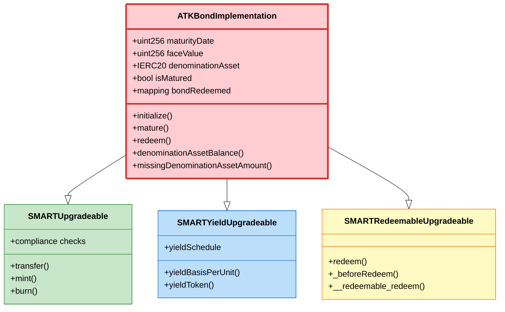

# Bond Asset Workflow & Implementation

## 🏦 Bond Overview

Bonds in the Asset Tokenization Kit represent fixed-term debt instruments with specific maturity dates, face values, and denomination assets. They implement comprehensive lifecycle management from issuance through maturity and redemption.

## 📋 Bond Contract Structure



## 🚀 Bond Creation Workflow

```mermaid
sequenceDiagram
    participant I as 🏭 Issuer
    participant F as 🏭 BondFactory
    participant B as 🏦 Bond Contract
    participant D as 💰 Denomination Asset
    participant S as 📊 Subgraph
    
    I->>F: 🚀 Create Bond Request
    Note over F: Validate parameters
    
    F->>B: 📋 Deploy Bond Contract
    B->>B: 🔧 Initialize Extensions
    Note over B: Set maturity, face value
    
    F->>S: 📡 Emit BondCreated Event
    S->>S: 📊 Index New Bond
    
    I->>D: 💳 Prepare Collateral
    D->>B: 💰 Transfer Assets
    
    I->>B: 💎 Mint Initial Tokens
    B->>B: ✅ Update Supply
    
    B->>S: 📡 Emit MintCompleted
    S->>S: 📊 Update Statistics
    
    Note over B: 🏦 Bond Ready for Trading
```



## 🏭 Bond Factory Implementation

### Factory Contract Features
- **🔧 Proxy Deployment**: Uses minimal proxy pattern for gas efficiency
- **⚙️ Parameter Validation**: Comprehensive input validation
- **📊 Event Emission**: Complete audit trail
- **🔐 Access Control**: Role-based factory permissions

```solidity
contract ATKBondFactoryImplementation {
    event BondCreated(
        indexed address creator,
        indexed address bondProxy,
        indexed address accessManager,
        string name,
        string symbol,
        uint8 decimals,
        uint256 cap,
        uint256 maturityDate,
        uint256 faceValue,
        address denominationAsset,
        uint16 managementFeeBps
    );
    
    function createBond(
        string calldata name,
        string calldata symbol,
        uint8 decimals,
        uint256 cap,
        IATKBond.BondInitParams calldata bondParams,
        SMARTComplianceModuleParamPair[] calldata initialModulePairs
    ) external returns (address bondProxy) {
        // Deploy minimal proxy
        bondProxy = Clones.clone(_bondImplementation);
        
        // Initialize bond with parameters
        IATKBond(bondProxy).initialize(
            name, symbol, decimals, cap,
            bondParams, initialModulePairs,
            _identityRegistry, _compliance, accessManager
        );
        
        // Emit creation event
        emit BondCreated(/*...parameters...*/);
        
        return bondProxy;
    }
}
```

## 💰 Bond Lifecycle Management

### Phase 1: Issuance Period

```mermaid
stateDiagram-v2
    [*] --> Created: 🚀 Factory Deploy
    Created --> Collateralized: 💰 Add Denomination Assets
    Collateralized --> Minted: 💎 Mint Bond Tokens
    Minted --> Trading: 📈 Enable Transfers
    
    state Trading {
        [*] --> Active
        Active --> Paused: ⏸️ Emergency Pause
        Paused --> Active: ▶️ Unpause
        Active --> Frozen: 🧊 Compliance Freeze
        Frozen --> Active: 🔓 Unfreeze
    }
    
    Trading --> PreMaturity: ⏰ Approaching Maturity
    PreMaturity --> Matured: 🔄 Mature() Called
    Matured --> Redeemed: 💸 Token Redemption
    Redeemed --> [*]: 🏁 Lifecycle Complete
```



### Phase 2: Trading Period

During the trading period, bonds can be transferred between verified holders:

```mermaid
flowchart TD
    A[👤 Holder A] -->|🔄 Transfer Request| B{⚖️ Compliance Check}
    B -->|✅ Pass| C[👤 Holder B]
    B -->|❌ Fail| D[🚫 Transaction Reverted]
    
    subgraph "🔍 Compliance Checks"
        E[🆔 Identity Verification]
        F[🌍 Country Restrictions]
        G[👥 Investor Limits]
        H[⏰ Time Lock Rules]
    end
    
    B --> E
    B --> F
    B --> G
    B --> H
    
    style A fill:#e8f5e8,stroke:#2e7d32,color:#000000
    style C fill:#e8f5e8,stroke:#2e7d32,color:#000000
    style D fill:#ffcdd2,stroke:#d32f2f,color:#000000
    style E fill:#fff3e0,stroke:#ef6c00,color:#000000
```



### Phase 3: Maturity Process

```mermaid
sequenceDiagram
    participant G as 🏛️ Governance
    participant B as 🏦 Bond Contract
    participant D as 💰 Denomination Asset
    participant H as 👤 Holders
    
    Note over B: ⏰ Maturity Date Reached
    
    G->>B: 🔍 Check Collateral Status
    B->>D: 📊 Query Balance
    D-->>B: 💰 Current Balance
    
    alt Sufficient Collateral
        G->>B: 🔄 Call mature()
        B->>B: ✅ Set isMatured = true
        B->>B: 📡 Emit BondMatured Event
        Note over B: 🏦 Bond Ready for Redemption
    else Insufficient Collateral
        G->>D: 💳 Add More Collateral
        D->>B: 💰 Transfer Assets
        G->>B: 🔄 Call mature()
    end
    
    H->>B: 💸 Redeem Tokens
    B->>D: 💰 Transfer Payment
    D->>H: 💰 Receive Assets
    B->>B: 🔥 Burn Tokens
```



## 📊 Bond-specific Features

### Denomination Asset Management

```solidity
contract ATKBondImplementation {
    // Calculate required denomination assets for full redemption
    function totalDenominationAssetNeeded() public view returns (uint256) {
        return _calculateDenominationAssetAmount(totalSupply());
    }
    
    // Check if sufficient collateral is available
    function missingDenominationAssetAmount() public view returns (uint256) {
        uint256 needed = totalDenominationAssetNeeded();
        uint256 current = denominationAssetBalance();
        return needed > current ? needed - current : 0;
    }
    
    // Calculate excess collateral that can be withdrawn
    function withdrawableDenominationAssetAmount() public view returns (uint256) {
        uint256 needed = totalDenominationAssetNeeded();
        uint256 current = denominationAssetBalance();
        return current > needed ? current - needed : 0;
    }
    
    // Internal calculation with proper decimal handling
    function _calculateDenominationAssetAmount(uint256 bondAmount) 
        private view returns (uint256) {
        return (bondAmount * _faceValue) / (10 ** decimals());
    }
}
```

### Redemption Mechanism

```mermaid
flowchart TD
    A[👤 Holder] -->|💸 Redeem Request| B{🔍 Validation}
    B -->|✅ Valid| C[🏦 Bond Contract]
    B -->|❌ Invalid| D[🚫 Revert Transaction]
    
    C -->|🔍 Check| E{🏦 Bond Matured?}
    E -->|❌ No| F[🚫 BondNotYetMatured]
    E -->|✅ Yes| G[💰 Calculate Payment]
    
    G -->|🔍 Check| H{💰 Sufficient Balance?}
    H -->|❌ No| I[🚫 InsufficientBalance]
    H -->|✅ Yes| J[🔄 Execute Redemption]
    
    J --> K[🔥 Burn Tokens]
    J --> L[💸 Transfer Assets]
    J --> M[📊 Update Records]
    J --> N[📡 Emit Event]
    
    style A fill:#e8f5e8,stroke:#2e7d32,color:#000000
    style C fill:#ffcdd2,stroke:#d32f2f,color:#000000
    style J fill:#bbdefb,stroke:#1976d2,color:#000000
    style D fill:#ffcdd2,stroke:#d32f2f,color:#000000
    style F fill:#ffcdd2,stroke:#d32f2f,color:#000000
    style I fill:#ffcdd2,stroke:#d32f2f,color:#000000
```



## 📈 Yield Integration

Bonds can integrate with yield schedules for interest payments:

```mermaid
graph LR
    subgraph "🏦 Bond Contract"
        A[💰 Bond Token]
        B[📈 Yield Extension]
    end
    
    subgraph "📊 Yield Schedule"
        C[🕐 Fixed Schedule]
        D[💰 Payment Periods]
        E[📊 Rate Calculation]
    end
    
    subgraph "💸 Payment Flow"
        F[👤 Token Holders]
        G[💰 Yield Claims]
        H[📊 Distribution]
    end
    
    A --> B
    B --> C
    C --> D
    C --> E
    D --> F
    E --> G
    F --> H
    
    style A fill:#ffcdd2,stroke:#d32f2f,color:#000000
    style C fill:#fff9c4,stroke:#f57f17,color:#000000
    style F fill:#e8f5e8,stroke:#2e7d32,color:#000000
```



## 🔧 API Integration

### Frontend Integration Points

```typescript
// Bond creation form data
interface BondCreationParams {
  name: string;
  symbol: string;
  decimals: number;
  cap: bigint;
  maturityDate: Date;
  faceValue: bigint;
  denominationAsset: Address;
  managementFeeBps: number;
}

// Bond status monitoring
interface BondStatus {
  isMatured: boolean;
  timeToMaturity: bigint;
  denominationAssetBalance: bigint;
  missingCollateral: bigint;
  totalSupply: bigint;
  redemptionRate: number;
}
```

### GraphQL Queries

```graphql
query BondDetails($bondAddress: Bytes!) {
  token(id: $bondAddress) {
    name
    symbol
    totalSupply
    bond {
      maturityDate
      faceValue
      isMatured
      denominationAsset {
        name
        symbol
      }
      stats {
        denominationAssetBalanceAvailable
        denominationAssetBalanceRequired
        coveredPercentage
      }
    }
    balances {
      account {
        id
      }
      value
      frozen
    }
  }
}
```

## 🎯 Use Cases & Applications

### Corporate Bonds
- **🏢 Corporate Debt**: Companies issuing debt instruments
- **💰 Fixed Returns**: Predetermined interest payments
- **⏰ Maturity Terms**: 1-30 year terms typical
- **🔐 Collateral Backing**: Asset-backed securities

### Government Bonds
- **🏛️ Municipal Bonds**: Local government funding
- **🌍 Sovereign Debt**: National government bonds
- **🚧 Infrastructure**: Public project financing
- **💚 Green Bonds**: Environmental project funding

### Real Estate Bonds
- **🏠 Property-backed**: Real estate collateralization
- **🏗️ Development**: Construction project funding
- **🏢 Commercial**: Office and retail property
- **🏘️ Residential**: Housing development bonds

## 🔒 Security Considerations

### Smart Contract Security
- **🔄 Reentrancy Protection**: ReentrancyGuard implementation
- **🔍 Input Validation**: Comprehensive parameter checking
- **🔐 Access Control**: Role-based function restrictions
- **⏸️ Emergency Controls**: Pause functionality for incidents

### Financial Security
- **💰 Collateral Management**: Over-collateralization requirements
- **📊 Real-time Monitoring**: Continuous balance tracking
- **⚖️ Compliance Enforcement**: Regulatory rule compliance
- **🔍 Audit Trail**: Complete transaction history

This comprehensive bond workflow provides the foundation for creating, managing, and trading tokenized debt instruments with full regulatory compliance and robust security measures.
