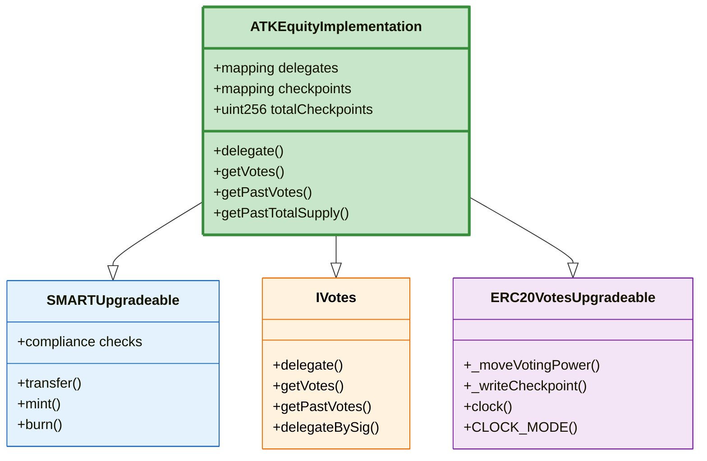
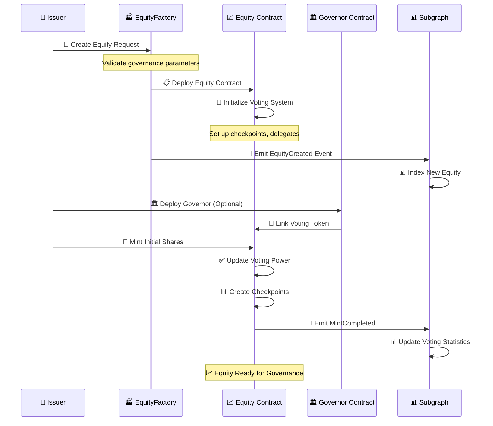
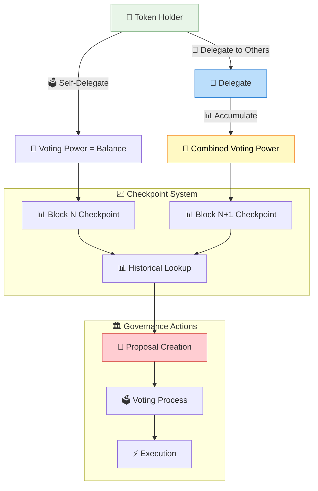
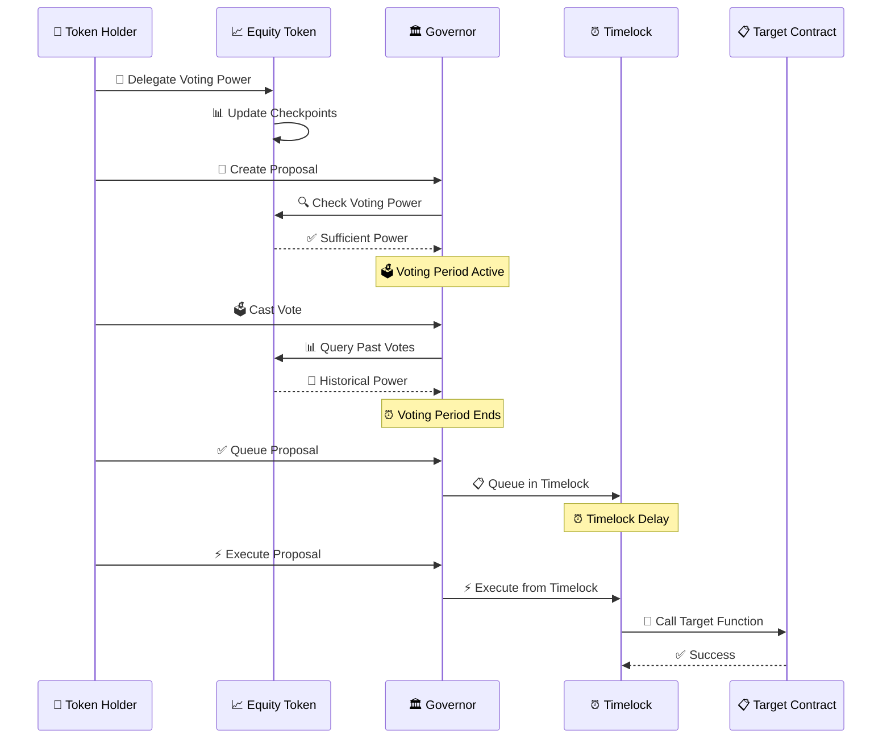
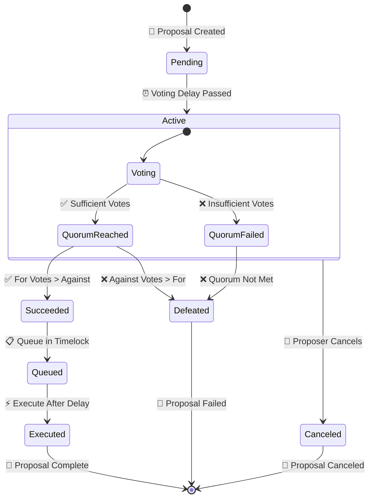
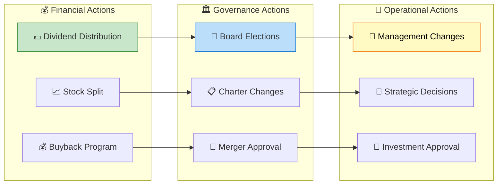
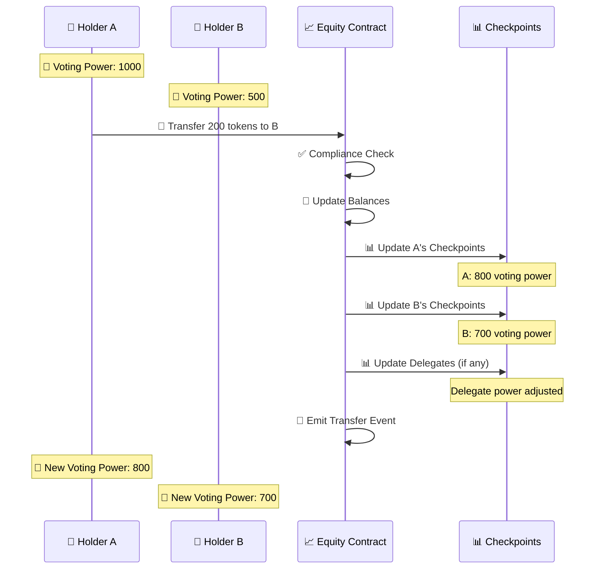

# Equity Asset Workflow & Implementation

## 📈 Equity Overview

Equity tokens in the Asset Tokenization Kit represent ownership stakes in organizations with built-in governance capabilities. They implement OpenZeppelin's voting mechanisms, enabling on-chain governance, shareholder rights, and democratic decision-making processes.

## 📋 Equity Contract Structure



## 🚀 Equity Creation Workflow



## 🏭 Equity Factory Implementation

### Factory Contract Features
- **🗳️ Governance Setup**: Automatic voting mechanism initialization
- **📊 Checkpoint System**: Historical voting power tracking
- **🔐 Access Control**: Shareholder rights management
- **⚖️ Compliance Integration**: Regulatory compliance for securities

```solidity
contract ATKEquityFactoryImplementation {
    event EquityCreated(
        indexed address creator,
        indexed address equityProxy,
        indexed address accessManager,
        string name,
        string symbol,
        uint8 decimals,
        uint16 managementFeeBps
    );
    
    function createEquity(
        string calldata name,
        string calldata symbol,
        uint8 decimals,
        SMARTComplianceModuleParamPair[] calldata initialModulePairs
    ) external returns (address equityProxy) {
        // Deploy minimal proxy
        equityProxy = Clones.clone(_equityImplementation);
        
        // Initialize equity with voting capabilities
        IATKEquity(equityProxy).initialize(
            name, symbol, decimals,
            initialModulePairs,
            _identityRegistry, _compliance, accessManager
        );
        
        // Emit creation event
        emit EquityCreated(/*...parameters...*/);
        
        return equityProxy;
    }
}
```

## 🗳️ Voting Mechanism

### Delegation System



### Voting Power Calculation

```solidity
contract ATKEquityImplementation {
    // Get current voting power
    function getVotes(address account) public view returns (uint256) {
        uint256 pos = _checkpoints[account].length;
        return pos == 0 ? 0 : _checkpoints[account][pos - 1].votes;
    }
    
    // Get historical voting power at specific block
    function getPastVotes(address account, uint256 blockNumber) 
        public view returns (uint256) {
        require(blockNumber < block.number, "Future block");
        return _checkpointsLookup(_checkpoints[account], blockNumber);
    }
    
    // Delegate voting power
    function delegate(address delegatee) public {
        _delegate(_msgSender(), delegatee);
    }
    
    // Internal delegation with checkpoint updates
    function _delegate(address delegator, address delegatee) internal {
        address currentDelegate = _delegates[delegator];
        uint256 delegatorBalance = balanceOf(delegator);
        
        _delegates[delegator] = delegatee;
        
        emit DelegateChanged(delegator, currentDelegate, delegatee);
        
        _moveVotingPower(currentDelegate, delegatee, delegatorBalance);
    }
}
```

## 🏛️ Governance Integration

### Governor Contract Integration



### Proposal Lifecycle



## 📊 Equity-specific Features

### Shareholder Rights Management

```solidity
contract ATKEquityImplementation {
    // Minimum tokens required to create proposals
    uint256 public proposalThreshold;
    
    // Percentage of total supply needed for quorum
    uint256 public quorumNumerator;
    
    // Check if account can create proposals
    function canCreateProposal(address account) public view returns (bool) {
        return getVotes(account) >= proposalThreshold;
    }
    
    // Calculate required quorum for current total supply
    function quorum(uint256 blockNumber) public view returns (uint256) {
        return (getPastTotalSupply(blockNumber) * quorumNumerator) / 100;
    }
    
    // Dividend distribution (if implemented)
    function distributeDividends(uint256 totalAmount) external {
        require(hasRole(GOVERNANCE_ROLE, _msgSender()), "Unauthorized");
        
        uint256 supply = totalSupply();
        for (uint256 i = 0; i < holderCount; i++) {
            address holder = holders[i];
            uint256 balance = balanceOf(holder);
            uint256 dividend = (totalAmount * balance) / supply;
            
            // Transfer dividend to holder
            payable(holder).transfer(dividend);
        }
    }
}
```

### Corporate Actions



## 📈 Voting Power Dynamics

### Transfer Impact on Voting



## 🔧 API Integration

### Frontend Integration Points

```typescript
// Equity governance data
interface EquityGovernanceData {
  totalSupply: bigint;
  votingPower: bigint;
  delegatedTo: Address | null;
  delegatedFrom: Address[];
  proposalThreshold: bigint;
  quorumRequired: bigint;
}

// Proposal creation
interface ProposalParams {
  targets: Address[];
  values: bigint[];
  calldatas: Hex[];
  description: string;
}

// Voting actions
interface VotingActions {
  delegate: (delegatee: Address) => Promise<Hash>;
  createProposal: (params: ProposalParams) => Promise<Hash>;
  castVote: (proposalId: bigint, support: number) => Promise<Hash>;
}
```

### GraphQL Queries

```graphql
query EquityGovernance($equityAddress: Bytes!, $holderAddress: Bytes!) {
  token(id: $equityAddress) {
    name
    symbol
    totalSupply
    balances(where: { account: $holderAddress }) {
      value
      account {
        id
      }
    }
  }
  
  # Voting power and delegation info
  votingDelegations(where: { 
    token: $equityAddress,
    delegator: $holderAddress 
  }) {
    delegatee
    votingPower
    timestamp
  }
  
  # Recent proposals
  proposals(
    where: { token: $equityAddress }
    orderBy: createdAt
    orderDirection: desc
    first: 10
  ) {
    id
    description
    status
    forVotes
    againstVotes
    quorumRequired
  }
}
```

## 🎯 Use Cases & Applications

### Startup Equity
- **🚀 Cap Table Management**: Digital shareholder registry
- **💰 Investment Rounds**: Automated share issuance
- **🗳️ Board Voting**: Decentralized governance decisions
- **📊 Transparency**: Real-time ownership visibility

### Public Companies
- **👥 Shareholder Meetings**: On-chain voting mechanisms
- **💵 Dividend Distribution**: Automated profit sharing
- **📋 Proxy Voting**: Delegated shareholder rights
- **📊 Regulatory Reporting**: Compliant ownership tracking

### DAOs and Cooperatives
- **🏛️ Democratic Governance**: One-token-one-vote systems
- **💰 Treasury Management**: Community-controlled funds
- **📝 Proposal Systems**: Member-driven decision making
- **🤝 Consensus Building**: Transparent voting processes

### Real Estate Investment
- **🏢 REIT Tokens**: Real Estate Investment Trusts
- **🏗️ Property Governance**: Asset management decisions
- **💰 Rental Distribution**: Automated income sharing
- **📊 Performance Tracking**: Investment return analytics

## 🔒 Security & Compliance

### Regulatory Compliance
- **📋 Securities Regulations**: KYC/AML compliance integration
- **🌍 Jurisdiction Rules**: Country-specific restrictions
- **👥 Investor Limits**: Accredited investor requirements
- **📊 Reporting Requirements**: Automated compliance reporting

### Technical Security
- **📊 Checkpoint Integrity**: Immutable voting history
- **🔐 Delegation Security**: Secure voting power transfers
- **⚡ Flash Loan Protection**: Governance attack prevention
- **🔍 Proposal Validation**: Malicious proposal detection

### Governance Security
- **⏰ Timelock Protection**: Delayed execution for security
- **🚫 Emergency Pause**: Circuit breaker mechanisms
- **👑 Admin Controls**: Multi-sig governance management
- **🔍 Proposal Review**: Community-driven proposal screening

This comprehensive equity workflow enables sophisticated corporate governance with full regulatory compliance and robust security measures for tokenized ownership structures.
