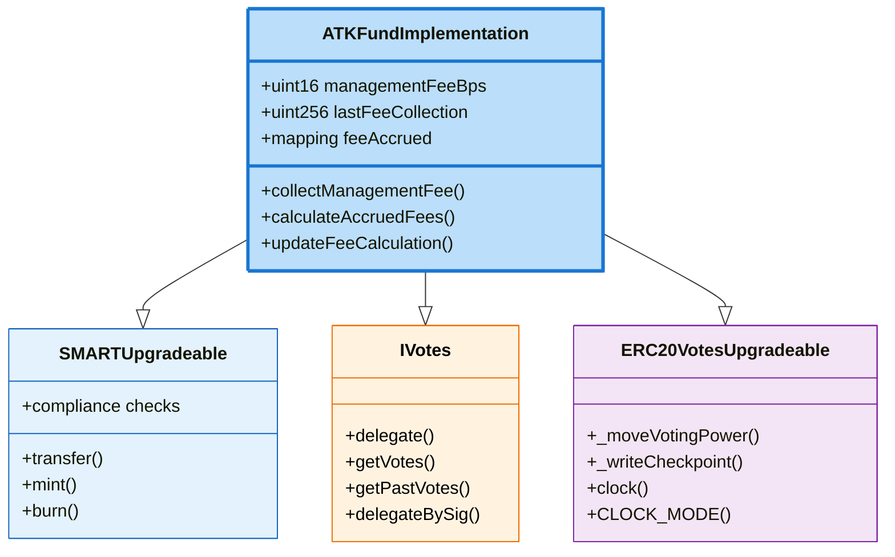
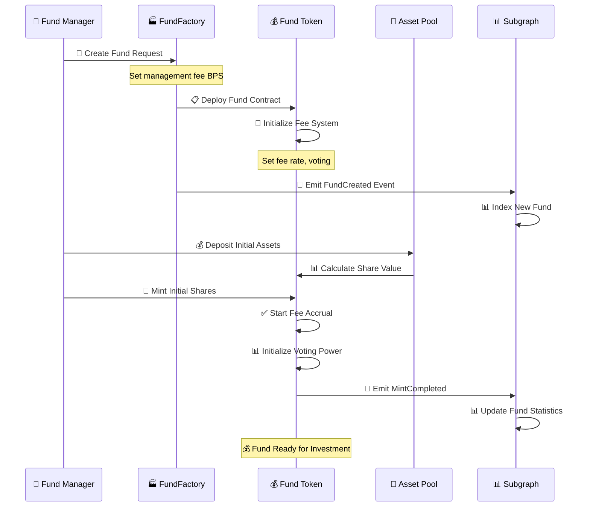
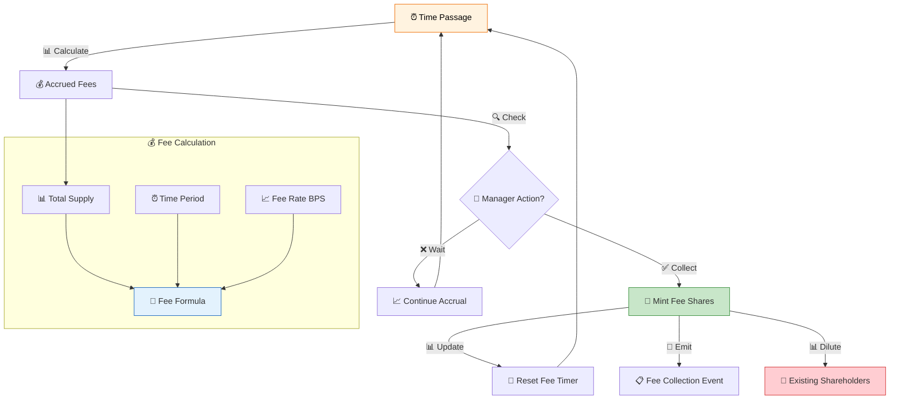
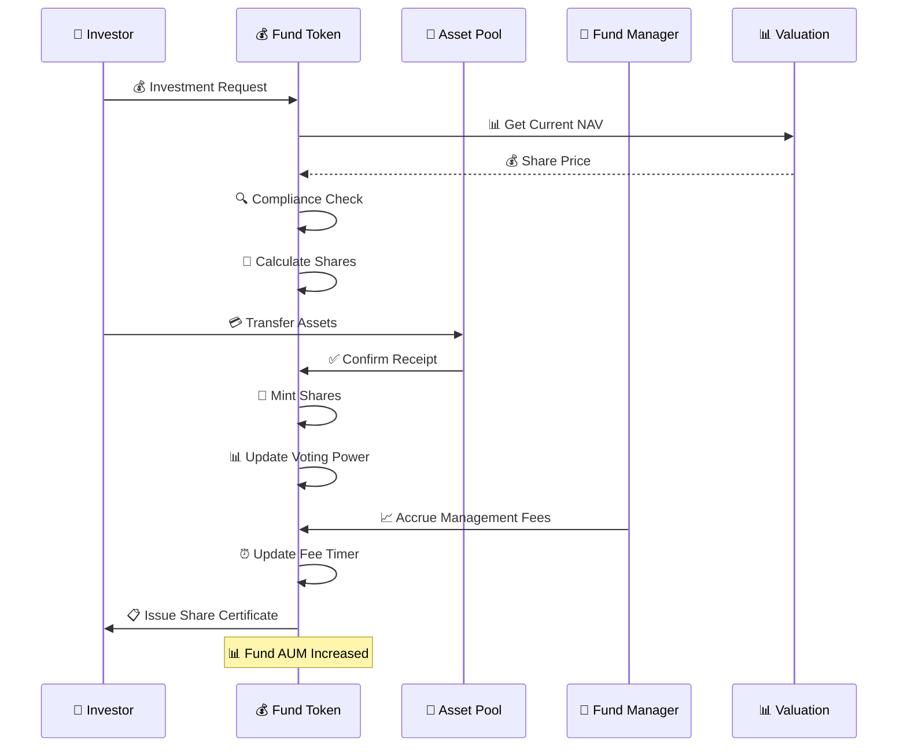
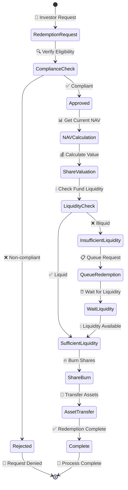
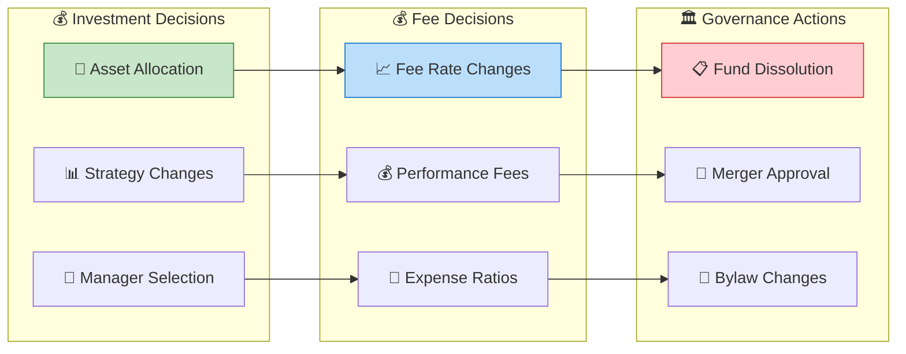
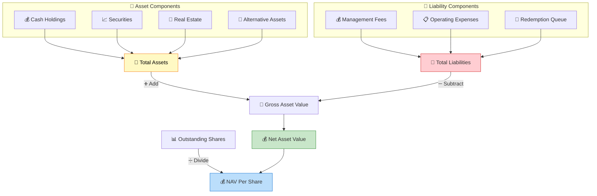

# Fund Asset Workflow & Implementation

## 💰 Fund Overview

Fund tokens in the Asset Tokenization Kit represent shares in managed investment vehicles with built-in fee collection mechanisms. They combine equity-like governance features with automated management fee accrual and distribution systems.

## 📋 Fund Contract Structure



## 🚀 Fund Creation Workflow



## 🏭 Fund Factory Implementation

### Factory Contract Features
- **💰 Fee Configuration**: Customizable management fee rates
- **🗳️ Governance Setup**: Shareholder voting mechanisms
- **📊 Performance Tracking**: NAV calculation systems
- **⚖️ Compliance Integration**: Investment fund regulations

```solidity
contract ATKFundFactoryImplementation {
    event FundCreated(
        indexed address creator,
        indexed address fundProxy,
        indexed address accessManager,
        string name,
        string symbol,
        uint8 decimals,
        uint16 managementFeeBps,
        uint16 performanceFeeBps
    );
    
    function createFund(
        string calldata name,
        string calldata symbol,
        uint8 decimals,
        uint16 managementFeeBps,
        SMARTComplianceModuleParamPair[] calldata initialModulePairs
    ) external returns (address fundProxy) {
        // Validate fee parameters
        require(managementFeeBps <= 1000, "Management fee too high"); // Max 10%
        
        // Deploy minimal proxy
        fundProxy = Clones.clone(_fundImplementation);
        
        // Initialize fund with fee parameters
        IATKFund(fundProxy).initialize(
            name, symbol, decimals, managementFeeBps,
            initialModulePairs,
            _identityRegistry, _compliance, accessManager
        );
        
        // Emit creation event
        emit FundCreated(/*...parameters...*/);
        
        return fundProxy;
    }
}
```

## 💰 Management Fee System

### Fee Accrual Mechanism



### Fee Collection Implementation

```solidity
contract ATKFundImplementation {
    uint16 private _managementFeeBps;
    uint256 private _lastFeeCollection;
    
    event ManagementFeeCollected(
        address indexed sender,
        uint256 indexed amount,
        uint256 indexed timestamp
    );
    
    function collectManagementFee() external returns (uint256) {
        require(hasRole(FUNDS_MANAGER_ROLE, _msgSender()), "Unauthorized");
        
        uint256 feeAmount = _calculateAccruedFees();
        require(feeAmount > 0, "No fees to collect");
        
        // Mint fee shares to fund manager
        _mint(_msgSender(), feeAmount);
        
        // Update last collection timestamp
        _lastFeeCollection = block.timestamp;
        
        emit ManagementFeeCollected(_msgSender(), feeAmount, block.timestamp);
        
        return feeAmount;
    }
    
    function _calculateAccruedFees() internal view returns (uint256) {
        if (_lastFeeCollection == 0) return 0;
        
        uint256 timeElapsed = block.timestamp - _lastFeeCollection;
        uint256 annualFeeRate = _managementFeeBps; // BPS
        uint256 currentSupply = totalSupply();
        
        // Calculate annual fee amount
        uint256 annualFeeAmount = (currentSupply * annualFeeRate) / 10000;
        
        // Pro-rate for time elapsed (assuming 365.25 days per year)
        uint256 feeAmount = (annualFeeAmount * timeElapsed) / (365.25 days);
        
        return feeAmount;
    }
    
    function managementFeeBps() external view returns (uint16) {
        return _managementFeeBps;
    }
}
```

## 📊 Fund Lifecycle Management

### Investment Flow



### Redemption Process



## 🗳️ Fund Governance

### Shareholder Voting Rights



### Voting Implementation

```solidity
contract ATKFundImplementation {
    struct Proposal {
        uint256 id;
        string description;
        uint256 forVotes;
        uint256 againstVotes;
        uint256 startBlock;
        uint256 endBlock;
        bool executed;
        mapping(address => bool) hasVoted;
    }
    
    mapping(uint256 => Proposal) public proposals;
    uint256 public nextProposalId;
    
    function createProposal(
        string calldata description,
        uint256 votingPeriod
    ) external returns (uint256) {
        require(
            getVotes(_msgSender()) >= proposalThreshold(),
            "Insufficient voting power"
        );
        
        uint256 proposalId = nextProposalId++;
        Proposal storage proposal = proposals[proposalId];
        
        proposal.id = proposalId;
        proposal.description = description;
        proposal.startBlock = block.number;
        proposal.endBlock = block.number + votingPeriod;
        
        emit ProposalCreated(proposalId, _msgSender(), description);
        
        return proposalId;
    }
    
    function castVote(
        uint256 proposalId,
        bool support
    ) external {
        Proposal storage proposal = proposals[proposalId];
        require(!proposal.hasVoted[_msgSender()], "Already voted");
        require(block.number <= proposal.endBlock, "Voting ended");
        
        uint256 weight = getPastVotes(_msgSender(), proposal.startBlock);
        require(weight > 0, "No voting power");
        
        proposal.hasVoted[_msgSender()] = true;
        
        if (support) {
            proposal.forVotes += weight;
        } else {
            proposal.againstVotes += weight;
        }
        
        emit VoteCast(_msgSender(), proposalId, support, weight);
    }
}
```

## 📈 Performance Tracking

### NAV Calculation



### Performance Metrics

```solidity
contract FundPerformanceTracker {
    struct PerformanceData {
        uint256 timestamp;
        uint256 navPerShare;
        uint256 totalAssets;
        uint256 totalShares;
    }
    
    PerformanceData[] public performanceHistory;
    
    function recordPerformance(
        uint256 navPerShare,
        uint256 totalAssets
    ) external onlyRole(FUNDS_MANAGER_ROLE) {
        performanceHistory.push(PerformanceData({
            timestamp: block.timestamp,
            navPerShare: navPerShare,
            totalAssets: totalAssets,
            totalShares: totalSupply()
        }));
        
        emit PerformanceRecorded(navPerShare, totalAssets, block.timestamp);
    }
    
    function getPerformanceReturn(
        uint256 fromTimestamp,
        uint256 toTimestamp
    ) external view returns (int256) {
        uint256 startNAV = _getNAVAtTimestamp(fromTimestamp);
        uint256 endNAV = _getNAVAtTimestamp(toTimestamp);
        
        if (startNAV == 0) return 0;
        
        return int256((endNAV - startNAV) * 10000 / startNAV); // BPS
    }
}
```

## 🔧 API Integration

### Frontend Integration Points

```typescript
// Fund management data
interface FundData {
  name: string;
  symbol: string;
  totalSupply: bigint;
  managementFeeBps: number;
  navPerShare: bigint;
  totalAssets: bigint;
  lastFeeCollection: Date;
  accruedFees: bigint;
}

// Investment actions
interface FundActions {
  invest: (amount: bigint) => Promise<Hash>;
  redeem: (shares: bigint) => Promise<Hash>;
  collectFees: () => Promise<Hash>;
  recordNAV: (navPerShare: bigint) => Promise<Hash>;
}

// Performance tracking
interface PerformanceMetrics {
  returns: {
    period: string;
    return: number;
  }[];
  volatility: number;
  sharpeRatio: number;
  maxDrawdown: number;
}
```

### GraphQL Queries

```graphql
query FundDetails($fundAddress: Bytes!) {
  token(id: $fundAddress) {
    name
    symbol
    totalSupply
    fund {
      managementFeeBps
    }
    balances(first: 100, orderBy: value, orderDirection: desc) {
      account {
        id
      }
      value
    }
    stats {
      totalValueInBaseCurrency
      balancesCount
    }
  }
  
  # Recent fee collections
  events(
    where: {
      emitter: $fundAddress,
      eventName: "ManagementFeeCollected"
    }
    orderBy: blockTimestamp
    orderDirection: desc
    first: 10
  ) {
    blockTimestamp
    values {
      name
      value
    }
  }
}

query FundPerformance($fundAddress: Bytes!, $fromDate: BigInt!) {
  performanceData: events(
    where: {
      emitter: $fundAddress,
      eventName: "PerformanceRecorded",
      blockTimestamp_gte: $fromDate
    }
    orderBy: blockTimestamp
  ) {
    blockTimestamp
    values {
      name
      value
    }
  }
}
```

## 🎯 Use Cases & Applications

### Mutual Funds
- **📊 Diversified Portfolios**: Multi-asset investment strategies
- **💰 Professional Management**: Expert fund management
- **📈 Performance Tracking**: Transparent return reporting
- **💸 Easy Liquidity**: Daily redemption capabilities

### Hedge Funds
- **🎯 Alternative Strategies**: Complex investment approaches
- **💰 Performance Fees**: Incentive-based compensation
- **🔒 Accredited Investors**: Sophisticated investor base
- **📊 Risk Management**: Advanced hedging techniques

### Index Funds
- **📊 Passive Management**: Market index tracking
- **💰 Low Fees**: Minimal management costs
- **📈 Broad Exposure**: Market-wide diversification
- **🤖 Automated Rebalancing**: Algorithm-driven allocation

### Private Equity
- **🏢 Company Investments**: Direct business ownership
- **⏰ Long-term Holds**: Multi-year investment horizons
- **💰 Value Creation**: Active portfolio management
- **📊 Carried Interest**: Performance-based returns

### Real Estate Funds
- **🏢 Property Portfolios**: Diversified real estate holdings
- **💰 Rental Income**: Regular distribution payments
- **📊 Property Management**: Professional asset management
- **🏗️ Development Projects**: New construction investments

## 🔒 Security & Compliance

### Regulatory Compliance
- **📋 Investment Company Act**: Mutual fund regulations
- **🏛️ SEC Registration**: Securities law compliance
- **👥 Investor Accreditation**: Qualified investor verification
- **📊 Reporting Requirements**: Regular disclosure obligations

### Operational Security
- **💰 Asset Custody**: Secure fund asset storage
- **🔐 Multi-sig Controls**: Manager authorization requirements
- **📊 NAV Validation**: Independent price verification
- **🔍 Audit Trail**: Complete transaction history

### Risk Management
- **📊 Concentration Limits**: Portfolio diversification rules
- **💧 Liquidity Management**: Redemption capacity monitoring
- **⚖️ Compliance Monitoring**: Real-time rule enforcement
- **🚨 Emergency Controls**: Circuit breaker mechanisms

This comprehensive fund workflow enables sophisticated investment vehicle management with automated fee collection, governance capabilities, and regulatory compliance for tokenized investment funds.
