# Stablecoin Asset Workflow & Implementation

## 🪙 Stablecoin Overview

Stablecoins in the Asset Tokenization Kit represent value-stable digital assets backed by collateral claims. They implement sophisticated collateral management systems with automatic redemption mechanisms and real-time stability monitoring.

## 📋 Stablecoin Contract Structure


## 🚀 Stablecoin Creation Workflow

```mermaid
sequenceDiagram
    participant I as 🏢 Issuer
    participant F as 🏭 StableCoinFactory
    participant S as 🪙 StableCoin Contract
    participant C as 📜 Collateral Claim
    participant M as 📊 Monitoring System
    participant G as 📈 Subgraph
    
    I->>F: 🚀 Create Stablecoin Request
    Note over F: Validate collateral requirements
    
    F->>S: 📋 Deploy Stablecoin Contract
    S->>S: 🔧 Initialize Collateral System
    Note over S: Set topic ID, ratios
    
    F->>G: 📡 Emit StableCoinCreated Event
    G->>G: 📊 Index New Stablecoin
    
    I->>C: 📜 Create Collateral Claim
    C->>S: 🔗 Link Claim to Contract
    
    I->>S: 💎 Mint Initial Supply
    S->>S: ✅ Validate Collateral Ratio
    S->>S: 📊 Update Collateral Stats
    
    S->>M: 📡 Start Monitoring
    M->>M: 🔄 Real-time Collateral Check
    
    S->>G: 📡 Emit MintCompleted
    G->>G: 📊 Update Collateral Statistics
    
    Note over S: 🪙 Stablecoin Ready for Use
```



## 🏭 Stablecoin Factory Implementation

### Factory Contract Features
- **📜 Collateral Integration**: Automatic claim verification
- **⚖️ Ratio Management**: Configurable collateralization ratios
- **🔍 Monitoring Setup**: Real-time stability tracking
- **⚖️ Compliance Integration**: Regulatory stablecoin requirements

```solidity
contract ATKStableCoinFactoryImplementation {
    event StableCoinCreated(
        indexed address creator,
        indexed address stableCoinProxy,
        indexed address accessManager,
        string name,
        string symbol,
        uint8 decimals,
        uint16 managementFeeBps
    );
    
    function createStableCoin(
        string calldata name,
        string calldata symbol,
        uint8 decimals,
        uint256 collateralTopicId,
        SMARTComplianceModuleParamPair[] calldata initialModulePairs
    ) external returns (address stableCoinProxy) {
        // Validate collateral topic exists
        require(
            _topicSchemeRegistry.isTopicRegistered(collateralTopicId),
            "Invalid collateral topic"
        );
        
        // Deploy minimal proxy
        stableCoinProxy = Clones.clone(_stableCoinImplementation);
        
        // Initialize stablecoin with collateral system
        IATKStableCoin(stableCoinProxy).initialize(
            name, symbol, decimals, collateralTopicId,
            initialModulePairs,
            _identityRegistry, _compliance, accessManager
        );
        
        // Emit creation event
        emit StableCoinCreated(/*...parameters...*/);
        
        return stableCoinProxy;
    }
}
```

## 📜 Collateral Management System

### Collateral Claim Structure


### Collateral Validation Process

```mermaid
sequenceDiagram
    participant S as 🪙 Stablecoin
    participant C as 📜 Collateral Claim
    participant V as 📊 Valuation Oracle
    participant T as 🏛️ Trusted Issuer
    participant M as 🔍 Monitor
    
    S->>C: 🔍 Check Claim Validity
    C->>C: ⏰ Verify Expiry
    C-->>S: ✅ Valid Timestamp
    
    S->>T: 🔍 Verify Issuer
    T->>T: 🔐 Check Signature
    T-->>S: ✅ Trusted Issuer
    
    S->>V: 📊 Get Asset Valuation
    V->>V: 💰 Calculate Current Value
    V-->>S: 💰 Asset Value
    
    S->>S: 🧮 Calculate Collateral Ratio
    Note over S: Value / Supply = Ratio
    
    alt Sufficient Collateral
        S->>M: ✅ Status: Stable
        M->>M: 📊 Update Metrics
    else Insufficient Collateral
        S->>M: 🚨 Status: Under-collateralized
        M->>M: 🚨 Trigger Alerts
    end
```



## 💰 Stability Mechanisms

### Collateral Ratio Management

```mermaid
stateDiagram-v2
    [*] --> OverCollateralized: 📈 Ratio > 150%
    OverCollateralized --> WellCollateralized: 📉 Ratio 120-150%
    WellCollateralized --> MinimallyCollateralized: 📉 Ratio 100-120%
    MinimallyCollateralized --> UnderCollateralized: 📉 Ratio < 100%
    
    OverCollateralized --> MintingEnabled: 💎 Allow New Minting
    WellCollateralized --> MintingCautious: ⚠️ Limited Minting
    MinimallyCollateralized --> MintingSuspended: 🚫 Suspend Minting
    UnderCollateralized --> EmergencyMode: 🚨 Emergency Actions
    
    UnderCollateralized --> MinimallyCollateralized: 📈 Add Collateral
    MinimallyCollateralized --> WellCollateralized: 📈 Improve Ratio
    WellCollateralized --> OverCollateralized: 📈 Strong Backing
    
    EmergencyMode --> RedemptionOnly: 💸 Only Allow Redemptions
    RedemptionOnly --> [*]: 🏁 Full Redemption
```



### Dynamic Supply Management

```solidity
contract ATKStableCoinImplementation {
    uint256 private constant MIN_COLLATERAL_RATIO = 10000; // 100%
    uint256 private constant HEALTHY_COLLATERAL_RATIO = 12000; // 120%
    uint256 private constant EXCESS_COLLATERAL_RATIO = 15000; // 150%
    
    function checkCollateralStatus() public view returns (
        uint256 currentRatio,
        bool canMint,
        bool shouldRedeem
    ) {
        uint256 collateralValue = _getCollateralValue();
        uint256 totalSupplyValue = totalSupply() * 1e18; // Assuming 1:1 USD peg
        
        if (totalSupplyValue == 0) {
            return (type(uint256).max, true, false);
        }
        
        currentRatio = (collateralValue * 10000) / totalSupplyValue;
        
        canMint = currentRatio >= HEALTHY_COLLATERAL_RATIO;
        shouldRedeem = currentRatio < MIN_COLLATERAL_RATIO;
        
        return (currentRatio, canMint, shouldRedeem);
    }
    
    function mint(address to, uint256 amount) external override {
        (uint256 ratio, bool canMint,) = checkCollateralStatus();
        require(canMint, "Insufficient collateral for minting");
        
        super.mint(to, amount);
        
        // Verify ratio is still healthy after mint
        (uint256 newRatio,,) = checkCollateralStatus();
        require(
            newRatio >= MIN_COLLATERAL_RATIO,
            "Mint would under-collateralize"
        );
    }
}
```

## 💸 Redemption Mechanism

### Redemption Process Flow

```mermaid
flowchart TD
    A[👤 Holder] -->|💸 Redeem Request| B{🔍 Validation}
    B -->|✅ Valid| C[🪙 Stablecoin Contract]
    B -->|❌ Invalid| D[🚫 Revert Transaction]
    
    C -->|📊 Calculate| E[💰 Redemption Value]
    E -->|🔍 Check| F{📜 Collateral Available?}
    
    F -->|✅ Yes| G[🔄 Execute Redemption]
    F -->|❌ No| H[📋 Queue Redemption]
    
    G --> I[🔥 Burn Tokens]
    G --> J[📜 Update Claim]
    G --> K[💸 Transfer Value]
    G --> L[📊 Update Ratios]
    
    H --> M[⏰ Wait for Collateral]
    M --> F
    
    style A fill:#e8f5e8,stroke:#2e7d32,color:#000000
    style C fill:#fff9c4,stroke:#f57f17,color:#000000
    style G fill:#bbdefb,stroke:#1976d2,color:#000000
    style D fill:#ffcdd2,stroke:#d32f2f,color:#000000
    style H fill:#ffecb3,stroke:#f57c00,color:#000000
```



### Collateral-backed Redemption

```solidity
contract ATKStableCoinImplementation {
    function __redeemable_redeem(address from, uint256 amount) 
        internal override nonReentrant {
        
        uint256 redemptionValue = _calculateRedemptionValue(amount);
        
        // Check if sufficient collateral exists
        uint256 availableCollateral = _getAvailableCollateral();
        require(
            availableCollateral >= redemptionValue,
            "Insufficient collateral for redemption"
        );
        
        // Burn the stablecoin tokens
        _burn(from, amount);
        
        // Update collateral claim to reflect redemption
        _updateCollateralClaim(redemptionValue);
        
        // Transfer collateral value to redeemer
        _transferCollateralValue(from, redemptionValue);
        
        emit Redeemed(from, amount, redemptionValue);
    }
    
    function _calculateRedemptionValue(uint256 amount) 
        internal view returns (uint256) {
        // For stablecoins, typically 1:1 with face value
        return amount; // Assuming 1 token = 1 USD
    }
    
    function _getAvailableCollateral() internal view returns (uint256) {
        if (!_hasValidCollateralClaim()) return 0;
        
        IdentityClaim memory claim = _collateral.identityClaim;
        return _parseCollateralValue(claim.data);
    }
}
```

## 📊 Price Stability Monitoring

### Real-time Monitoring System


### Monitoring Implementation

```solidity
contract StablecoinMonitor {
    struct MonitoringData {
        uint256 timestamp;
        uint256 collateralRatio;
        uint256 totalSupply;
        uint256 collateralValue;
        uint256 marketPrice; // If available
    }
    
    MonitoringData[] public history;
    uint256 public alertThreshold = 11000; // 110%
    
    event CollateralAlert(
        address indexed stablecoin,
        uint256 currentRatio,
        uint256 threshold,
        uint256 timestamp
    );
    
    function recordMetrics(
        address stablecoin,
        uint256 collateralRatio,
        uint256 totalSupply,
        uint256 collateralValue
    ) external {
        history.push(MonitoringData({
            timestamp: block.timestamp,
            collateralRatio: collateralRatio,
            totalSupply: totalSupply,
            collateralValue: collateralValue,
            marketPrice: 0 // Could integrate price oracles
        }));
        
        if (collateralRatio < alertThreshold) {
            emit CollateralAlert(
                stablecoin,
                collateralRatio,
                alertThreshold,
                block.timestamp
            );
        }
    }
    
    function getTrend(uint256 periods) external view returns (int256) {
        require(history.length >= periods, "Insufficient data");
        
        uint256 oldRatio = history[history.length - periods].collateralRatio;
        uint256 newRatio = history[history.length - 1].collateralRatio;
        
        return int256(newRatio) - int256(oldRatio);
    }
}
```

## 🔧 API Integration

### Frontend Integration Points

```typescript
// Stablecoin collateral data
interface StablecoinCollateral {
  collateralValue: bigint;
  totalSupply: bigint;
  collateralRatio: number;
  expiryTimestamp: Date;
  isValid: boolean;
  canMint: boolean;
  shouldRedeem: boolean;
}

// Stability monitoring
interface StabilityMetrics {
  currentRatio: number;
  healthStatus: 'healthy' | 'warning' | 'critical';
  priceDeviation: number;
  liquidityDepth: bigint;
  redemptionQueue: bigint;
}

// Collateral management
interface CollateralActions {
  updateClaim: (claimData: Hex) => Promise<Hash>;
  addCollateral: (amount: bigint) => Promise<Hash>;
  checkStatus: () => Promise<StabilityMetrics>;
}
```

### GraphQL Queries

```graphql
query StablecoinStatus($stablecoinAddress: Bytes!) {
  token(id: $stablecoinAddress) {
    name
    symbol
    totalSupply
    collateral {
      identityClaim {
        name
        signature
        values {
          key
          value
        }
      }
      expiryTimestamp
      collateral
      collateralExact
    }
    stats {
      totalValueInBaseCurrency
      balancesCount
    }
  }
  
  # Collateral statistics over time
  tokenCollateralStats(
    where: { token: $stablecoinAddress }
    orderBy: timestamp
    orderDirection: desc
    first: 100
  ) {
    timestamp
    collateral
    collateralAvailable
    collateralUsed
    expiryTimestamp
  }
}

query StabilityHistory($stablecoinAddress: Bytes!, $fromDate: BigInt!) {
  # Historical collateral ratios
  events(
    where: {
      emitter: $stablecoinAddress,
      eventName_in: ["MintCompleted", "BurnCompleted", "Redeemed"],
      blockTimestamp_gte: $fromDate
    }
    orderBy: blockTimestamp
  ) {
    eventName
    blockTimestamp
    values {
      name
      value
    }
  }
}
```

## 🎯 Use Cases & Applications

### Payment Systems
- **💳 Digital Payments**: Stable value for transactions
- **🌍 Cross-border Transfers**: Reduced volatility risk
- **🏪 Merchant Adoption**: Predictable purchasing power
- **📱 Mobile Wallets**: Consumer-friendly stability

### DeFi Integration
- **💧 Liquidity Provision**: Stable trading pairs
- **💰 Lending Protocols**: Collateral for loans
- **📊 Yield Farming**: Stable return calculations
- **⚖️ Derivatives**: Underlying asset for contracts

### Corporate Treasury
- **🏢 Cash Management**: Digital cash equivalents
- **📊 Accounting**: Simplified bookkeeping
- **💰 Payroll**: Stable employee payments
- **📈 Reserves**: Value preservation strategy

### Central Bank Digital Currencies (CBDCs)
- **🏛️ Government Issued**: Sovereign digital currency
- **💰 Monetary Policy**: Direct policy implementation
- **📊 Economic Monitoring**: Real-time economic data
- **🔍 Compliance**: Built-in regulatory controls

### Commodity-backed Stablecoins
- **🥇 Gold-backed**: Precious metal collateral
- **🛢️ Oil-backed**: Energy commodity backing
- **🌾 Agriculture**: Food commodity stability
- **🏭 Industrial**: Raw material tokenization

## 🔒 Security & Compliance

### Collateral Security
- **🔐 Multi-sig Controls**: Collateral management security
- **📊 Real-time Monitoring**: Continuous ratio tracking
- **🔍 Audit Verification**: Independent collateral audits
- **📜 Legal Framework**: Collateral custody agreements

### Regulatory Compliance
- **🏛️ Banking Regulations**: Reserve requirements compliance
- **💰 Money Transmission**: Payment service regulations
- **📊 Reporting Standards**: Financial disclosure requirements
- **🌍 International Standards**: Cross-border compliance

### Technical Security
- **⚡ Oracle Security**: Price feed manipulation protection
- **🔄 Upgrade Safety**: Secure contract upgrade mechanisms
- **🚨 Emergency Controls**: Circuit breakers and pause functions
- **🔍 Monitoring Systems**: Automated threat detection

### Risk Management
- **📊 Concentration Risk**: Collateral diversification requirements
- **💧 Liquidity Risk**: Redemption capacity management
- **📈 Market Risk**: Price volatility mitigation
- **🔗 Counterparty Risk**: Collateral issuer reliability

This comprehensive stablecoin workflow enables the creation and management of value-stable digital assets with robust collateral backing, real-time monitoring, and regulatory compliance for enterprise and consumer applications.
