# Deposit Asset Workflow & Implementation

## 💳 Deposit Overview

Deposit tokens in the Asset Tokenization Kit represent digital certificates of deposit, time deposits, or savings instruments. They provide simple, secure tokenization of deposit-based financial products with built-in compliance and custodian controls.

## 📋 Deposit Contract Structure


## 🚀 Deposit Creation Workflow

```mermaid
sequenceDiagram
    participant B as 🏦 Bank/Institution
    participant F as 🏭 DepositFactory
    participant D as 💳 Deposit Contract
    participant C as 👤 Customer
    participant S as 📊 Subgraph
    
    B->>F: 🚀 Create Deposit Product
    Note over F: Validate deposit terms
    
    F->>D: 📋 Deploy Deposit Contract
    D->>D: 🔧 Initialize Deposit System
    Note over D: Set rates, terms, custodian
    
    F->>S: 📡 Emit DepositCreated Event
    S->>S: 📊 Index New Deposit
    
    C->>D: 💰 Make Initial Deposit
    D->>D: ✅ Verify Minimum Amount
    D->>D: 📊 Record Deposit Details
    
    B->>D: 💎 Mint Deposit Certificate
    D->>D: 📋 Issue Digital Certificate
    D->>C: 📜 Transfer Certificate
    
    D->>S: 📡 Emit MintCompleted
    S->>S: 📊 Update Deposit Statistics
    
    Note over D: 💳 Deposit Active & Earning
```



## 🏭 Deposit Factory Implementation

### Factory Contract Features
- **💰 Flexible Terms**: Configurable interest rates and maturity periods
- **🏦 Institutional Control**: Bank-managed deposit products
- **📊 Compliance Integration**: Banking regulation compliance
- **🔐 Custodian Protection**: Enhanced security for deposits

```solidity
contract ATKDepositFactoryImplementation {
    struct DepositTerms {
        uint256 minimumDeposit;
        uint256 interestRate; // Annual rate in BPS
        uint256 termLength; // In seconds
        bool allowEarlyWithdrawal;
        uint256 penaltyRate; // Early withdrawal penalty in BPS
    }
    
    event DepositCreated(
        indexed address creator,
        indexed address depositProxy,
        indexed address accessManager,
        string name,
        string symbol,
        uint8 decimals,
        uint16 managementFeeBps
    );
    
    function createDeposit(
        string calldata name,
        string calldata symbol,
        uint8 decimals,
        DepositTerms calldata terms,
        SMARTComplianceModuleParamPair[] calldata initialModulePairs
    ) external returns (address depositProxy) {
        // Validate deposit terms
        require(terms.minimumDeposit > 0, "Invalid minimum deposit");
        require(terms.interestRate <= 5000, "Interest rate too high"); // Max 50%
        
        // Deploy minimal proxy
        depositProxy = Clones.clone(_depositImplementation);
        
        // Initialize deposit with terms
        IATKDeposit(depositProxy).initialize(
            name, symbol, decimals,
            initialModulePairs,
            _identityRegistry, _compliance, accessManager
        );
        
        // Set deposit-specific parameters
        IATKDeposit(depositProxy).setDepositTerms(terms);
        
        // Emit creation event
        emit DepositCreated(/*...parameters...*/);
        
        return depositProxy;
    }
}
```

## 💰 Deposit Lifecycle Management

### Deposit States and Transitions

```mermaid
stateDiagram-v2
    [*] --> Created: 🚀 Factory Deploy
    Created --> Active: 💰 First Deposit
    
    state Active {
        [*] --> Earning
        Earning --> Frozen: 🧊 Custodian Freeze
        Frozen --> Earning: 🔓 Unfreeze
        Earning --> Paused: ⏸️ Emergency Pause
        Paused --> Earning: ▶️ Resume
    }
    
    Active --> Matured: ⏰ Maturity Reached
    Active --> EarlyWithdrawal: 💸 Early Redemption
    
    Matured --> Withdrawn: 💸 Full Withdrawal
    EarlyWithdrawal --> Withdrawn: 💸 Penalty Applied
    
    Withdrawn --> [*]: 🏁 Deposit Closed
    
    Active --> Renewed: 🔄 Term Extension
    Renewed --> Active: ✅ New Term Started
```



### Interest Calculation System

```mermaid
flowchart TD
    A[💰 Principal Amount] -->|⏰ Time Factor| B[📊 Interest Calculation]
    C[📈 Interest Rate] -->|📊 Annual Rate| B
    D[⏰ Time Period] -->|🗓️ Days/Years| B
    
    B --> E{🔍 Deposit Type?}
    
    E -->|📊 Simple Interest| F[💰 P times R times T]
    E -->|📈 Compound Interest| G[💰 P times 1 plus R power T]
    
    F --> H[💎 Mint Interest Tokens]
    G --> H
    
    H --> I[📋 Update Balance]
    H --> J[📊 Record Transaction]
    H --> K[📡 Emit Interest Event]
    
    style A fill:#c8e6c9,stroke:#388e3c
    style B fill:#bbdefb,stroke:#1976d2
    style H fill:#fff9c4,stroke:#f57f17,color:#000000,color:#000000
```



### Deposit Implementation

```solidity
contract ATKDepositImplementation {
    struct DepositRecord {
        uint256 principal;
        uint256 interestRate;
        uint256 startDate;
        uint256 maturityDate;
        uint256 accruedInterest;
        bool isActive;
    }
    
    mapping(address => DepositRecord) public deposits;
    uint256 public totalPrincipal;
    uint256 public totalInterestAccrued;
    
    event DepositMade(
        address indexed depositor,
        uint256 principal,
        uint256 interestRate,
        uint256 maturityDate
    );
    
    event InterestAccrued(
        address indexed depositor,
        uint256 interestAmount,
        uint256 timestamp
    );
    
    function makeDeposit(
        address depositor,
        uint256 amount,
        uint256 termLength
    ) external onlyRole(CUSTODIAN_ROLE) {
        require(amount >= minimumDeposit, "Below minimum deposit");
        
        DepositRecord storage record = deposits[depositor];
        require(!record.isActive, "Existing deposit active");
        
        // Record deposit details
        record.principal = amount;
        record.interestRate = currentInterestRate;
        record.startDate = block.timestamp;
        record.maturityDate = block.timestamp + termLength;
        record.accruedInterest = 0;
        record.isActive = true;
        
        // Update totals
        totalPrincipal += amount;
        
        // Mint deposit certificate
        _mint(depositor, amount);
        
        emit DepositMade(depositor, amount, currentInterestRate, record.maturityDate);
    }
    
    function accrueInterest(address depositor) external returns (uint256) {
        DepositRecord storage record = deposits[depositor];
        require(record.isActive, "No active deposit");
        
        uint256 timeElapsed = block.timestamp - record.startDate;
        uint256 interestEarned = _calculateInterest(
            record.principal,
            record.interestRate,
            timeElapsed
        );
        
        uint256 newInterest = interestEarned - record.accruedInterest;
        if (newInterest > 0) {
            record.accruedInterest = interestEarned;
            totalInterestAccrued += newInterest;
            
            // Mint interest tokens
            _mint(depositor, newInterest);
            
            emit InterestAccrued(depositor, newInterest, block.timestamp);
        }
        
        return newInterest;
    }
    
    function _calculateInterest(
        uint256 principal,
        uint256 rate,
        uint256 timeElapsed
    ) internal pure returns (uint256) {
        // Simple interest calculation: P × R × T / (365 days × 10000 BPS)
        return (principal * rate * timeElapsed) / (365 days * 10000);
    }
}
```

## 🏦 Banking Integration Features

### Custodian Controls

```mermaid
flowchart LR
    subgraph "🔐 Account Management"
        A[🧊 Freeze Accounts]
        B[🔓 Unfreeze Accounts]
        C[⚡ Forced Transfers]
    end
    
    subgraph "💰 Deposit Controls"
        D[⏸️ Pause Deposits]
        E[📊 Rate Adjustments]
        F[💸 Early Withdrawal]
    end
    
    subgraph "⚖️ Compliance Actions"
        G[🔍 KYC Verification]
        H[🚫 Sanctions Check]
        I[📊 Reporting]
    end
    
    A --> D
    B --> E
    C --> F
    D --> G
    E --> H
    F --> I
    
    style A fill:#ffcdd2,stroke:#d32f2f
    style D fill:#fff3e0,stroke:#ef6c00,color:#000000,color:#000000
    style G fill:#e8f5e8,stroke:#2e7d32
```



### Advanced Custodian Functions

```solidity
contract ATKDepositImplementation {
    // Freeze specific deposit amount
    function freezeDeposit(
        address account,
        uint256 amount
    ) external onlyRole(CUSTODIAN_ROLE) {
        require(balanceOf(account) >= amount, "Insufficient balance");
        
        _smart_freezePartialTokens(account, amount);
        
        emit DepositFrozen(account, amount, block.timestamp);
    }
    
    // Emergency withdrawal for compliance
    function emergencyWithdrawal(
        address from,
        address to,
        uint256 amount,
        string calldata reason
    ) external onlyRole(EMERGENCY_ROLE) {
        require(bytes(reason).length > 0, "Reason required");
        
        // Force transfer without normal restrictions
        _smart_forcedTransfer(from, to, amount);
        
        // Update deposit records
        DepositRecord storage record = deposits[from];
        if (record.isActive && amount >= record.principal) {
            record.isActive = false;
        }
        
        emit EmergencyWithdrawal(from, to, amount, reason);
    }
    
    // Batch interest accrual for efficiency
    function batchAccrueInterest(
        address[] calldata depositors
    ) external onlyRole(CUSTODIAN_ROLE) {
        uint256 totalAccrued = 0;
        
        for (uint256 i = 0; i < depositors.length; i++) {
            totalAccrued += accrueInterest(depositors[i]);
        }
        
        emit BatchInterestAccrued(depositors.length, totalAccrued);
    }
}
```

## 📊 Deposit Product Variations

### Certificate of Deposit (CD)


### Savings Account

```mermaid
flowchart TD
    A[💰 Savings Account] --> B[📊 Variable Interest]
    A --> C[💸 Flexible Withdrawals]
    A --> D[💰 No Maturity Date]
    
    B --> E[📈 Rate Adjustments]
    C --> F[💳 Daily Access]
    D --> G[🔄 Ongoing Product]
    
    E --> H[📊 Market-based Rates]
    F --> I[🏧 ATM Integration]
    G --> J[📱 Mobile Banking]
    
    style A fill:#f8bbd9,stroke:#c2185b
    style B fill:#c8e6c9,stroke:#388e3c
    style C fill:#bbdefb,stroke:#1976d2
    style D fill:#fff9c4,stroke:#f57f17,color:#000000,color:#000000
```



### Time Deposit Variations

```solidity
contract DepositProductManager {
    enum ProductType {
        CERTIFICATE_OF_DEPOSIT,
        SAVINGS_ACCOUNT,
        MONEY_MARKET,
        TIME_DEPOSIT
    }
    
    struct ProductConfig {
        ProductType productType;
        uint256 minimumBalance;
        uint256 interestRate;
        uint256 termLength;
        bool allowPartialWithdrawal;
        uint256 withdrawalLimit;
        uint256 penaltyRate;
    }
    
    mapping(bytes32 => ProductConfig) public products;
    
    function createProduct(
        string calldata name,
        ProductConfig calldata config
    ) external onlyRole(PRODUCT_MANAGER_ROLE) {
        bytes32 productId = keccak256(abi.encodePacked(name));
        products[productId] = config;
        
        emit ProductCreated(productId, name, config.productType);
    }
    
    function getProductTerms(bytes32 productId) 
        external view returns (ProductConfig memory) {
        return products[productId];
    }
}
```

## 🔧 API Integration

### Frontend Integration Points

```typescript
// Deposit product data
interface DepositProduct {
  name: string;
  symbol: string;
  minimumDeposit: bigint;
  interestRate: number; // BPS
  termLength: number; // seconds
  allowEarlyWithdrawal: boolean;
  penaltyRate: number; // BPS
}

// Customer deposit record
interface DepositRecord {
  principal: bigint;
  interestRate: number;
  startDate: Date;
  maturityDate: Date;
  accruedInterest: bigint;
  isActive: boolean;
  currentBalance: bigint;
}

// Banking operations
interface DepositActions {
  makeDeposit: (amount: bigint, term: number) => Promise<Hash>;
  accrueInterest: () => Promise<Hash>;
  withdraw: (amount: bigint) => Promise<Hash>;
  checkBalance: () => Promise<DepositRecord>;
}
```

### GraphQL Queries

```graphql
query DepositProducts {
  tokenFactories(where: { typeId: "DEPOSIT" }) {
    id
    name
    tokens {
      name
      symbol
      totalSupply
      decimals
      balances(first: 10, orderBy: value, orderDirection: desc) {
        account {
          id
        }
        value
        frozen
      }
    }
  }
}

query CustomerDeposits($customerAddress: Bytes!) {
  tokenBalances(where: { 
    account: $customerAddress,
    token_: { type: "DEPOSIT" }
  }) {
    token {
      name
      symbol
      type
    }
    value
    valueExact
    frozen
    frozenExact
    available
    availableExact
    lastUpdatedAt
  }
}

query DepositInterestHistory($depositAddress: Bytes!, $fromDate: BigInt!) {
  events(
    where: {
      emitter: $depositAddress,
      eventName: "InterestAccrued",
      blockTimestamp_gte: $fromDate
    }
    orderBy: blockTimestamp
  ) {
    blockTimestamp
    values {
      name
      value
    }
  }
}
```

## 🎯 Use Cases & Applications

### Traditional Banking
- **🏦 Digital CDs**: Tokenized certificates of deposit
- **💰 Savings Accounts**: High-yield digital savings
- **📊 Money Market**: Institutional deposit products
- **🏧 ATM Integration**: Traditional banking interface

### Corporate Treasury
- **🏢 Cash Management**: Corporate deposit solutions
- **📊 Sweep Accounts**: Automated balance management
- **💰 Liquidity Management**: Short-term investment vehicles
- **📈 Yield Optimization**: Competitive rate seeking

### DeFi Integration
- **💧 Yield Farming**: Stable return mechanisms
- **🔄 Lending Protocols**: Deposit-backed lending
- **📊 Liquidity Pools**: Stable value provision
- **⚖️ Collateral**: Deposit certificates as collateral

### International Banking
- **🌍 Cross-border**: Multi-currency deposits
- **💱 Currency Hedging**: FX-protected deposits
- **🏛️ Correspondent Banking**: Institutional deposits
- **📊 Trade Finance**: Export/import financing

### Regulatory Compliance
- **🏛️ FDIC Insurance**: Deposit protection integration
- **📊 Reserve Requirements**: Banking regulation compliance
- **🔍 AML/KYC**: Customer verification requirements
- **📋 Reporting**: Regulatory disclosure automation

## 🔒 Security & Compliance

### Banking Regulations
- **🏛️ Reserve Requirements**: Fractional reserve compliance
- **📊 Capital Adequacy**: Risk-weighted asset calculations
- **🔍 Liquidity Coverage**: Liquidity risk management
- **📋 Stress Testing**: Regulatory stress test compliance

### Customer Protection
- **🛡️ Deposit Insurance**: FDIC/equivalent protection
- **🔐 Account Security**: Multi-factor authentication
- **📊 Privacy Protection**: Customer data security
- **⚖️ Fair Lending**: Non-discriminatory practices

### Technical Security
- **🔐 Multi-sig Controls**: Institutional fund management
- **📊 Real-time Monitoring**: Fraud detection systems
- **🔍 Audit Trails**: Complete transaction history
- **🚨 Emergency Controls**: Incident response procedures

### Risk Management
- **💧 Liquidity Risk**: Withdrawal capacity management
- **📈 Interest Rate Risk**: Rate change impact analysis
- **🔗 Credit Risk**: Counterparty risk assessment
- **🌍 Operational Risk**: System failure mitigation

This comprehensive deposit workflow enables traditional banking products to be tokenized with full regulatory compliance, advanced custodian controls, and seamless integration with both traditional and DeFi financial systems.
