# Frontend Architecture & Implementation

## 🎨 Frontend Overview

The Asset Tokenization Kit frontend is a sophisticated Next.js 15 application built with modern React patterns, providing an intuitive interface for managing tokenized assets, compliance workflows, and blockchain interactions.

## 🏗️ Application Architecture

```mermaid
graph TB
    subgraph "🌐 Browser Layer"
        A[🎨 React Components]
        B[🔧 TanStack Router]
        C[📱 Responsive UI]
    end
    
    subgraph "📊 State Management"
        D[🔄 TanStack Query]
        E[📦 TanStack Store]
        F[🔐 Auth Context]
    end
    
    subgraph "🔌 API Layer"
        G[⚡ ORPC Client]
        H[📊 GraphQL Queries]
        I[🔗 Blockchain Calls]
    end
    
    subgraph "🎯 Core Features"
        J[🏭 Asset Creation]
        K[👤 Identity Management]
        L[⚖️ Compliance Dashboard]
        M[📊 Analytics & Charts]
    end
    
    A --> D
    B --> E
    C --> F
    D --> G
    E --> H
    F --> I
    G --> J
    H --> K
    I --> L
    J --> M
    
    style A fill:#e1f5fe,stroke:#01579b,stroke-width:3px
    style D fill:#f3e5f5,stroke:#4a148c,stroke-width:3px
    style G fill:#e8f5e8,stroke:#1b5e20,stroke-width:3px
    style J fill:#fff3e0,stroke:#e65100,stroke-width:3px
```



## 📱 Component Architecture

### UI Component Hierarchy


### Component Structure

```typescript
// Component organization pattern
interface ComponentStructure {
  // UI Components (Radix-based)
  'components/ui/': {
    button: 'Reusable button component';
    dialog: 'Modal dialog component';
    form: 'Form field components';
    table: 'Data table components';
    chart: 'Chart visualization components';
  };
  
  // Feature Components
  'components/': {
    'asset-designer/': 'Asset creation wizard';
    'onboarding/': 'User onboarding flow';
    'compliance/': 'Compliance management';
    'dashboard/': 'Analytics dashboard';
    'identity/': 'Identity management';
  };
  
  // Layout Components
  'components/layout/': {
    'page-header': 'Page title and actions';
    'sidebar': 'Navigation sidebar';
    'breadcrumb': 'Navigation breadcrumbs';
  };
}
```

## 🔄 State Management

### TanStack Query Integration

```mermaid
sequenceDiagram
    participant C as 🎨 Component
    participant Q as 🔄 TanStack Query
    participant O as ⚡ ORPC Client
    participant A as 🔌 API
    participant B as 🔗 Blockchain
    
    C->>Q: 📊 useQuery Hook
    Q->>Q: 🔍 Check Cache
    
    alt Cache Hit
        Q-->>C: ✅ Cached Data
    else Cache Miss
        Q->>O: 📞 API Call
        O->>A: 🔌 HTTP Request
        A->>B: 🔗 Blockchain Query
        B-->>A: 📊 Response Data
        A-->>O: ✅ API Response
        O-->>Q: 📊 Processed Data
        Q->>Q: 💾 Update Cache
        Q-->>C: ✅ Fresh Data
    end
    
    Note over Q: 🔄 Background Refetch
    Q->>O: 🔄 Refresh Data
    O-->>Q: 📊 Updated Data
    Q-->>C: 🔄 UI Update
```



### Query Configuration

```typescript
// Query client configuration
export function createRouter() {
  const queryClient = new QueryClient({
    defaultOptions: {
      queries: {
        // Offline-first strategy
        networkMode: "offlineFirst",
        structuralSharing: true,
        
        // Cache configuration
        gcTime: 1000 * 60 * 60 * 24, // 24 hours
        staleTime: 1000 * 60 * 5, // 5 minutes
        
        // Smart refetching
        refetchOnMount: (query) => {
          return query.state.isInvalidated || 
                 query.state.dataUpdateCount === 0;
        },
        
        // Error retry logic
        retry: (failureCount, error) => {
          const queryError = error as { status?: number };
          if (queryError.status && 
              queryError.status >= 400 && 
              queryError.status < 500) {
            return false; // Don't retry client errors
          }
          return failureCount < 3;
        }
      }
    }
  });
}
```

### Store Management

```typescript
// Global application store
export const useAppStore = create<AppState>()((set, get) => ({
  // Authentication state
  user: null,
  isAuthenticated: false,
  
  // UI state
  sidebar: {
    isOpen: true,
    activeSection: 'dashboard'
  },
  
  // Asset creation state
  assetWizard: {
    currentStep: 0,
    formData: {},
    isSubmitting: false
  },
  
  // Actions
  setUser: (user) => set({ user, isAuthenticated: !!user }),
  toggleSidebar: () => set(state => ({
    sidebar: { ...state.sidebar, isOpen: !state.sidebar.isOpen }
  })),
  
  updateWizardStep: (step, data) => set(state => ({
    assetWizard: {
      ...state.assetWizard,
      currentStep: step,
      formData: { ...state.assetWizard.formData, ...data }
    }
  }))
}));
```

## 🎨 UI Design System

### Theme Configuration

```mermaid
graph LR
    subgraph "🎨 Design Tokens"
        A[🎨 Colors]
        B[📏 Spacing]
        C[🔤 Typography]
        D[🎭 Shadows]
    end
    
    subgraph "🌙 Theme Modes"
        E[☀️ Light Theme]
        F[🌙 Dark Theme]
        G[🔄 Auto Switch]
    end
    
    subgraph "📱 Responsive"
        H[📱 Mobile]
        I[💻 Desktop]
        J[🖥️ Large Screen]
    end
    
    A --> E
    B --> F
    C --> G
    D --> H
    E --> I
    F --> J
    
    style A fill:#ffcdd2,stroke:#d32f2f
    style E fill:#fff9c4,stroke:#f57f17
    style H fill:#c8e6c9,stroke:#388e3c
```



### Component Variants

```typescript
// Button component with variants
const buttonVariants = cva(
  // Base styles
  "inline-flex items-center justify-center rounded-md text-sm font-medium ring-offset-background transition-colors focus-visible:outline-none focus-visible:ring-2 focus-visible:ring-ring focus-visible:ring-offset-2 disabled:pointer-events-none disabled:opacity-50",
  {
    variants: {
      variant: {
        default: "bg-primary text-primary-foreground hover:bg-primary/90",
        destructive: "bg-destructive text-destructive-foreground hover:bg-destructive/90",
        outline: "border border-input bg-background hover:bg-accent hover:text-accent-foreground",
        secondary: "bg-secondary text-secondary-foreground hover:bg-secondary/80",
        ghost: "hover:bg-accent hover:text-accent-foreground",
        link: "text-primary underline-offset-4 hover:underline"
      },
      size: {
        default: "h-10 px-4 py-2",
        sm: "h-9 rounded-md px-3",
        lg: "h-11 rounded-md px-8",
        icon: "h-10 w-10"
      }
    },
    defaultVariants: {
      variant: "default",
      size: "default"
    }
  }
);
```

### Responsive Design

```css
/* Tailwind responsive utilities */
.responsive-grid {
  @apply grid gap-4;
  @apply grid-cols-1;           /* Mobile: 1 column */
  @apply md:grid-cols-2;        /* Tablet: 2 columns */
  @apply lg:grid-cols-3;        /* Desktop: 3 columns */
  @apply xl:grid-cols-4;        /* Large: 4 columns */
}

.responsive-text {
  @apply text-sm;               /* Mobile: small text */
  @apply md:text-base;          /* Tablet: base text */
  @apply lg:text-lg;            /* Desktop: large text */
}

.responsive-spacing {
  @apply p-4;                   /* Mobile: 16px padding */
  @apply md:p-6;                /* Tablet: 24px padding */
  @apply lg:p-8;                /* Desktop: 32px padding */
}
```

## 🔐 Authentication & Security

### Authentication Flow

```mermaid
sequenceDiagram
    participant U as 👤 User
    participant A as 🔐 Auth Component
    participant B as 🔑 Better Auth
    participant S as 🗄️ Session Store
    participant P as 🔒 Protected Route
    
    U->>A: 📝 Login Form
    A->>B: 🔑 Authenticate
    B->>B: ✅ Verify Credentials
    B->>S: 💾 Create Session
    S-->>A: 🎫 Session Token
    
    A->>A: 🔄 Update Auth State
    A-->>U: ✅ Login Success
    
    U->>P: 🌐 Navigate to Protected Page
    P->>S: 🔍 Check Session
    S-->>P: ✅ Valid Session
    P-->>U: 📄 Render Page
    
    Note over S: ⏰ Session Expiry Check
    S->>B: 🔄 Refresh Token
    B-->>S: 🎫 New Token
```



### Protected Route Implementation

```typescript
// Protected route wrapper
function ProtectedRoute({ children }: { children: React.ReactNode }) {
  const { user, isLoading } = useAuth();
  const router = useRouter();
  
  useEffect(() => {
    if (!isLoading && !user) {
      router.navigate({ to: '/auth/signin' });
    }
  }, [user, isLoading, router]);
  
  if (isLoading) {
    return <LoadingSpinner />;
  }
  
  if (!user) {
    return null; // Will redirect
  }
  
  return <>{children}</>;
}

// Auth context provider
export function AuthProvider({ children }: { children: React.ReactNode }) {
  const [user, setUser] = useState<User | null>(null);
  const [isLoading, setIsLoading] = useState(true);
  
  useEffect(() => {
    // Check for existing session
    checkSession()
      .then(setUser)
      .catch(() => setUser(null))
      .finally(() => setIsLoading(false));
  }, []);
  
  return (
    <AuthContext.Provider value={{ user, isLoading, setUser }}>
      {children}
    </AuthContext.Provider>
  );
}
```

## 🏭 Asset Creation Wizard

### Multi-step Form Flow

```mermaid
graph TD
    A[🚀 Start Wizard] --> B[📋 Asset Type Selection]
    B --> C[📝 Basic Information]
    C --> D[⚖️ Compliance Configuration]
    D --> E[🔧 Extensions & Features]
    E --> F[👥 Access Control]
    F --> G[📊 Review & Confirm]
    G --> H[🚀 Deploy Contract]
    H --> I[✅ Success & Navigation]
    
    subgraph "📋 Asset Types"
        J[🏦 Bond]
        K[📈 Equity]
        L[💰 Fund]
        M[🪙 Stablecoin]
        N[💳 Deposit]
    end
    
    B --> J
    B --> K
    B --> L
    B --> M
    B --> N
    
    style A fill:#e1f5fe,stroke:#01579b
    style B fill:#f3e5f5,stroke:#4a148c
    style G fill:#e8f5e8,stroke:#1b5e20
    style I fill:#c8e6c9,stroke:#388e3c
```



### Form State Management

```typescript
// Asset creation wizard hook
export function useAssetWizard() {
  const [currentStep, setCurrentStep] = useState(0);
  const [formData, setFormData] = useState<AssetFormData>({});
  const [isSubmitting, setIsSubmitting] = useState(false);
  
  const updateFormData = useCallback((stepData: Partial<AssetFormData>) => {
    setFormData(prev => ({ ...prev, ...stepData }));
  }, []);
  
  const nextStep = useCallback(() => {
    setCurrentStep(prev => Math.min(prev + 1, TOTAL_STEPS - 1));
  }, []);
  
  const prevStep = useCallback(() => {
    setCurrentStep(prev => Math.max(prev - 1, 0));
  }, []);
  
  const submitForm = useCallback(async () => {
    setIsSubmitting(true);
    try {
      const result = await createAsset(formData);
      return result;
    } finally {
      setIsSubmitting(false);
    }
  }, [formData]);
  
  return {
    currentStep,
    formData,
    isSubmitting,
    updateFormData,
    nextStep,
    prevStep,
    submitForm
  };
}
```

### Wizard Component Structure

```typescript
// Asset designer wizard component
export function AssetDesignerWizard() {
  const {
    currentStep,
    formData,
    isSubmitting,
    updateFormData,
    nextStep,
    prevStep,
    submitForm
  } = useAssetWizard();
  
  const steps = [
    { title: 'Asset Type', component: AssetTypeStep },
    { title: 'Basic Info', component: BasicInfoStep },
    { title: 'Compliance', component: ComplianceStep },
    { title: 'Extensions', component: ExtensionsStep },
    { title: 'Access Control', component: AccessControlStep },
    { title: 'Review', component: ReviewStep }
  ];
  
  const CurrentStepComponent = steps[currentStep].component;
  
  return (
    <div className="asset-wizard">
      <StepIndicator steps={steps} currentStep={currentStep} />
      
      <div className="step-content">
        <CurrentStepComponent
          data={formData}
          onUpdate={updateFormData}
          onNext={nextStep}
          onPrev={prevStep}
          onSubmit={submitForm}
          isSubmitting={isSubmitting}
        />
      </div>
    </div>
  );
}
```

## 📊 Data Visualization

### Chart Components

```mermaid
graph LR
    subgraph "📊 Chart Types"
        A[📈 Line Charts]
        B[📊 Bar Charts]
        C[🥧 Pie Charts]
        D[📉 Area Charts]
    end
    
    subgraph "📊 Data Sources"
        E[🔗 Blockchain Data]
        F[📊 Subgraph Queries]
        G[⚡ Real-time Updates]
    end
    
    subgraph "🎨 Visualizations"
        H[💰 Asset Performance]
        I[👥 Holder Distribution]
        J[📊 Compliance Metrics]
        K[🔄 Transaction Volume]
    end
    
    A --> E
    B --> F
    C --> G
    D --> H
    E --> I
    F --> J
    G --> K
    
    style A fill:#bbdefb,stroke:#1976d2
    style E fill:#e8f5e8,stroke:#2e7d32
    style H fill:#fff9c4,stroke:#f57f17
```



### Chart Implementation

```typescript
// Recharts integration
export function AssetPerformanceChart({ data }: { data: PerformanceData[] }) {
  const theme = useTheme();
  
  return (
    <ResponsiveContainer width="100%" height={400}>
      <LineChart data={data} margin={{ top: 20, right: 30, left: 20, bottom: 5 }}>
        <CartesianGrid strokeDasharray="3 3" stroke={theme.colors.border} />
        <XAxis 
          dataKey="timestamp" 
          tickFormatter={(value) => format(new Date(value), 'MMM dd')}
          stroke={theme.colors.text.muted}
        />
        <YAxis 
          tickFormatter={(value) => `$${value.toLocaleString()}`}
          stroke={theme.colors.text.muted}
        />
        <Tooltip
          content={({ active, payload, label }) => {
            if (!active || !payload?.length) return null;
            
            return (
              <div className="chart-tooltip">
                <p className="tooltip-label">
                  {format(new Date(label), 'PPP')}
                </p>
                {payload.map((entry, index) => (
                  <p key={index} className="tooltip-value" style={{ color: entry.color }}>
                    {entry.name}: ${entry.value?.toLocaleString()}
                  </p>
                ))}
              </div>
            );
          }}
        />
        <Line 
          type="monotone" 
          dataKey="value" 
          stroke={theme.colors.primary} 
          strokeWidth={2}
          dot={{ fill: theme.colors.primary, strokeWidth: 2 }}
        />
      </LineChart>
    </ResponsiveContainer>
  );
}
```

## 🔧 API Integration

### ORPC Client Configuration

```typescript
// Type-safe API client
export const orpc = createORPCClient<AppRouter>({
  baseURL: '/api/rpc',
  fetch: async (input, init) => {
    // Add authentication headers
    const headers = new Headers(init?.headers);
    const session = await getSession();
    
    if (session?.apiKey) {
      headers.set('X-Api-Key', session.apiKey);
    }
    
    return fetch(input, { ...init, headers });
  }
});

// React Query integration
export function useAssetList() {
  return orpc.asset.list.useQuery({
    limit: 50,
    offset: 0
  });
}

export function useCreateAsset() {
  const queryClient = useQueryClient();
  
  return orpc.asset.create.useMutation({
    onSuccess: () => {
      // Invalidate and refetch asset list
      queryClient.invalidateQueries({
        queryKey: orpc.asset.list.getQueryKey()
      });
    }
  });
}
```

### GraphQL Integration

```typescript
// GraphQL client setup
const graphqlClient = new GraphQLClient('/api/graphql', {
  headers: {
    authorization: `Bearer ${token}`
  }
});

// Custom hook for GraphQL queries
export function useGraphQLQuery<T>(
  query: string,
  variables?: Record<string, any>
) {
  return useQuery({
    queryKey: ['graphql', query, variables],
    queryFn: () => graphqlClient.request<T>(query, variables)
  });
}

// Asset statistics query
export function useAssetStats(assetAddress: string) {
  return useGraphQLQuery(gql`
    query AssetStats($address: Bytes!) {
      token(id: $address) {
        name
        symbol
        totalSupply
        stats {
          balancesCount
          totalValueInBaseCurrency
        }
        distributionStats {
          percentageOwnedByTop5Holders
          balancesCountSegment1
          balancesCountSegment2
          balancesCountSegment3
        }
      }
    }
  `, { address: assetAddress });
}
```

## 🌍 Internationalization

### Multi-language Support

```mermaid
flowchart LR
    A[🌍 Language Detection] --> B{📍 User Preference?}
    B -->|✅ Set| C[🔧 Load User Language]
    B -->|❌ None| D[🌐 Browser Language]
    
    C --> E[📚 Load Translations]
    D --> E
    
    E --> F[🔄 Initialize i18n]
    F --> G[🎨 Render UI]
    
    subgraph "🗣️ Supported Languages"
        H[🇺🇸 English]
        I[🇩🇪 German]
        J[🇯🇵 Japanese]
        K[🇸🇦 Arabic]
    end
    
    E --> H
    E --> I
    E --> J
    E --> K
    
    style A fill:#e1f5fe,stroke:#01579b
    style E fill:#f3e5f5,stroke:#4a148c
    style H fill:#c8e6c9,stroke:#388e3c
```



### Translation Implementation

```typescript
// i18n configuration
export const i18n = createInstance({
  lng: 'en-US',
  fallbackLng: 'en-US',
  supportedLngs: ['en-US', 'de-DE', 'ja-JP', 'ar-SA'],
  
  resources: {
    'en-US': { translation: enTranslations },
    'de-DE': { translation: deTranslations },
    'ja-JP': { translation: jaTranslations },
    'ar-SA': { translation: arTranslations }
  },
  
  interpolation: {
    escapeValue: false
  }
});

// Translation hook usage
export function AssetCard({ asset }: { asset: Asset }) {
  const { t } = useTranslation();
  
  return (
    <Card>
      <CardHeader>
        <CardTitle>{asset.name}</CardTitle>
        <CardDescription>
          {t('asset.type.{{type}}', { type: asset.type.toLowerCase() })}
        </CardDescription>
      </CardHeader>
      <CardContent>
        <p>{t('asset.totalSupply')}: {asset.totalSupply}</p>
        <p>{t('asset.holders')}: {asset.holderCount}</p>
      </CardContent>
    </Card>
  );
}
```

## 📱 Mobile Responsiveness

### Responsive Layout Patterns

```css
/* Mobile-first responsive design */
.dashboard-layout {
  @apply flex flex-col;
  @apply lg:flex-row;
}

.sidebar {
  @apply fixed inset-y-0 left-0 z-50;
  @apply w-64 transform transition-transform;
  @apply -translate-x-full;
  @apply lg:translate-x-0 lg:static lg:inset-0;
}

.sidebar.open {
  @apply translate-x-0;
}

.main-content {
  @apply flex-1 min-w-0;
  @apply lg:ml-0;
}

.mobile-menu-button {
  @apply lg:hidden;
}
```

### Touch-friendly Interactions

```typescript
// Mobile-optimized components
export function MobileAssetCard({ asset }: { asset: Asset }) {
  return (
    <div className="mobile-asset-card">
      {/* Larger touch targets */}
      <button className="w-full p-4 text-left touch-target">
        <div className="flex items-center justify-between">
          <div>
            <h3 className="text-lg font-semibold">{asset.name}</h3>
            <p className="text-sm text-muted-foreground">{asset.symbol}</p>
          </div>
          <div className="text-right">
            <p className="text-lg font-bold">{asset.totalSupply}</p>
            <p className="text-sm text-muted-foreground">
              {asset.holderCount} holders
            </p>
          </div>
        </div>
      </button>
    </div>
  );
}
```

This comprehensive frontend architecture provides a modern, scalable, and user-friendly interface for managing tokenized assets with full responsive design, internationalization support, and robust state management capabilities.
