# Backend API Architecture & Implementation

## 🔌 API Overview

The Asset Tokenization Kit backend provides a comprehensive API layer built with ORPC (OpenRPC), offering type-safe procedures for managing assets, compliance, identity, and blockchain interactions with full end-to-end type safety.

## 🏗️ API Architecture

```mermaid
graph TB
    subgraph "🌐 Client Layer"
        A[📱 Frontend App]
        B[📱 Mobile App]
        C[🔧 External APIs]
    end
    
    subgraph "🔌 API Gateway"
        D[⚡ ORPC Server]
        E[🔐 Authentication]
        F[⚖️ Rate Limiting]
        G[📊 Request Logging]
    end
    
    subgraph "🎯 Business Logic"
        H[🏭 Asset Procedures]
        I[👤 Identity Procedures]
        J[⚖️ Compliance Procedures]
        K[📊 Analytics Procedures]
    end
    
    subgraph "💾 Data Layer"
        L[🗄️ Database]
        M[🔗 Blockchain]
        N[📊 Subgraph]
        O[📦 File Storage]
    end
    
    A --> D
    B --> D
    C --> D
    D --> E
    E --> F
    F --> G
    G --> H
    H --> I
    I --> J
    J --> K
    K --> L
    L --> M
    M --> N
    N --> O
    
    style D fill:#e1f5fe,stroke:#01579b,stroke-width:3px
    style H fill:#f3e5f5,stroke:#4a148c,stroke-width:3px
    style L fill:#e8f5e8,stroke:#1b5e20,stroke-width:3px
```



## 🔧 ORPC Implementation

### Server Configuration

```typescript
// ORPC server setup
export const orpcServer = createORPCServer({
  router: appRouter,
  context: createContext,
  
  // Global middleware
  middleware: [
    corsMiddleware(),
    authenticationMiddleware(),
    rateLimitMiddleware(),
    loggingMiddleware()
  ],
  
  // Error handling
  onError: ({ error, input, path, type }) => {
    console.error(`ORPC Error on ${type} ${path}:`, error);
    
    // Log to monitoring service
    logger.error('ORPC_ERROR', {
      path,
      type,
      error: error.message,
      input: JSON.stringify(input)
    });
  }
});

// Context creation
async function createContext({ req, res }: CreateContextOptions) {
  // Get session from request
  const session = await getSession(req);
  
  // Create database connection
  const db = createDrizzleConnection();
  
  // Create blockchain client
  const viemClient = createPublicClient({
    chain: settlemintChain,
    transport: http(process.env.RPC_URL)
  });
  
  return {
    session,
    db,
    viem: viemClient,
    req,
    res
  };
}
```

### Router Structure

```mermaid
graph TD
    A[🔌 App Router] --> B[🏭 Asset Router]
    A --> C[👤 Identity Router]
    A --> D[⚖️ Compliance Router]
    A --> E[📊 Analytics Router]
    A --> F[🔐 Auth Router]
    
    B --> G[🏦 Bond Procedures]
    B --> H[📈 Equity Procedures]
    B --> I[💰 Fund Procedures]
    B --> J[🪙 Stablecoin Procedures]
    B --> K[💳 Deposit Procedures]
    
    C --> L[👤 Identity Management]
    C --> M[📜 Claims Management]
    C --> N[🔑 Key Management]
    
    D --> O[📋 Module Configuration]
    D --> P[⚖️ Rule Enforcement]
    D --> Q[🔍 Verification]
    
    E --> R[📊 Performance Metrics]
    E --> S[📈 Market Data]
    E --> T[👥 User Analytics]
    
    style A fill:#e1f5fe,stroke:#01579b
    style B fill:#ffcdd2,stroke:#d32f2f
    style C fill:#c8e6c9,stroke:#388e3c
    style D fill:#fff3e0,stroke:#ef6c00,color:#000000,color:#000000
    style E fill:#f3e5f5,stroke:#7b1fa2
```



### Type-safe Procedures

```typescript
// Asset management procedures
export const assetRouter = router({
  // List assets with filtering
  list: publicProcedure
    .input(z.object({
      type: z.enum(['BOND', 'EQUITY', 'FUND', 'STABLECOIN', 'DEPOSIT']).optional(),
      limit: z.number().min(1).max(100).default(20),
      offset: z.number().min(0).default(0),
      search: z.string().optional()
    }))
    .query(async ({ input, ctx }) => {
      const { type, limit, offset, search } = input;
      
      let query = ctx.db.select().from(tokens);
      
      if (type) {
        query = query.where(eq(tokens.type, type));
      }
      
      if (search) {
        query = query.where(
          or(
            ilike(tokens.name, `%${search}%`),
            ilike(tokens.symbol, `%${search}%`)
          )
        );
      }
      
      const results = await query
        .limit(limit)
        .offset(offset)
        .orderBy(desc(tokens.createdAt));
      
      return {
        items: results,
        total: await getTokenCount(ctx.db, { type, search }),
        hasMore: results.length === limit
      };
    }),

  // Create new asset
  create: protectedProcedure
    .input(createAssetSchema)
    .mutation(async ({ input, ctx }) => {
      const { type, name, symbol, ...params } = input;
      
      // Validate user permissions
      await validateAssetCreationPermissions(ctx.session.user, type);
      
      // Deploy smart contract
      const contractAddress = await deployAssetContract({
        type,
        name,
        symbol,
        ...params
      });
      
      // Store in database
      const asset = await ctx.db.insert(tokens).values({
        address: contractAddress,
        type,
        name,
        symbol,
        createdBy: ctx.session.user.id,
        createdAt: new Date()
      }).returning();
      
      // Index in subgraph
      await indexNewAsset(contractAddress, type);
      
      return asset[0];
    }),

  // Get asset details
  get: publicProcedure
    .input(z.object({
      address: addressSchema
    }))
    .query(async ({ input, ctx }) => {
      const asset = await ctx.db.select()
        .from(tokens)
        .where(eq(tokens.address, input.address))
        .limit(1);
      
      if (!asset.length) {
        throw new TRPCError({
          code: 'NOT_FOUND',
          message: 'Asset not found'
        });
      }
      
      // Get additional blockchain data
      const onchainData = await getAssetOnchainData(input.address);
      
      return {
        ...asset[0],
        ...onchainData
      };
    })
});
```

## 🔐 Authentication & Authorization

### Session Management

```mermaid
sequenceDiagram
    participant C as 📱 Client
    participant A as 🔐 Auth API
    participant S as 🗄️ Session Store
    participant D as 💾 Database
    
    C->>A: 🔑 Login Request
    A->>D: ✅ Verify Credentials
    D-->>A: 👤 User Data
    
    A->>S: 💾 Create Session
    S-->>A: 🎫 Session ID
    
    A->>A: 🍪 Set HTTP-only Cookie
    A-->>C: ✅ Login Success
    
    C->>A: 🔌 API Request + Cookie
    A->>S: 🔍 Validate Session
    S-->>A: 👤 Session Data
    
    A->>A: ✅ Authorize Request
    A-->>C: 📊 API Response
    
    Note over S: ⏰ Session Expiry
    S->>S: 🗑️ Cleanup Expired
```



### Authentication Middleware

```typescript
// Authentication middleware
export const authenticationMiddleware = (): ORPCMiddleware => {
  return async ({ input, ctx, next, meta }) => {
    // Skip auth for public procedures
    if (meta?.isPublic) {
      return next();
    }
    
    // Extract session from request
    const sessionId = extractSessionId(ctx.req);
    if (!sessionId) {
      throw new TRPCError({
        code: 'UNAUTHORIZED',
        message: 'No session found'
      });
    }
    
    // Validate session
    const session = await validateSession(sessionId);
    if (!session) {
      throw new TRPCError({
        code: 'UNAUTHORIZED',
        message: 'Invalid session'
      });
    }
    
    // Check session expiry
    if (session.expiresAt < new Date()) {
      await invalidateSession(sessionId);
      throw new TRPCError({
        code: 'UNAUTHORIZED',
        message: 'Session expired'
      });
    }
    
    // Add session to context
    return next({
      ctx: {
        ...ctx,
        session
      }
    });
  };
};

// Role-based authorization
export function requireRole(role: UserRole) {
  return ({ ctx }: { ctx: AuthenticatedContext }) => {
    if (!ctx.session.user.roles.includes(role)) {
      throw new TRPCError({
        code: 'FORBIDDEN',
        message: `Required role: ${role}`
      });
    }
  };
}
```

## 💾 Database Integration

### Drizzle ORM Schema

```typescript
// Database schema definitions
export const users = pgTable('users', {
  id: uuid('id').primaryKey().defaultRandom(),
  email: varchar('email', { length: 255 }).unique().notNull(),
  passwordHash: varchar('password_hash', { length: 255 }),
  name: varchar('name', { length: 255 }),
  roles: text('roles').array().default([]),
  createdAt: timestamp('created_at').defaultNow(),
  updatedAt: timestamp('updated_at').defaultNow()
});

export const tokens = pgTable('tokens', {
  id: uuid('id').primaryKey().defaultRandom(),
  address: varchar('address', { length: 42 }).unique().notNull(),
  type: varchar('type', { length: 50 }).notNull(),
  name: varchar('name', { length: 255 }).notNull(),
  symbol: varchar('symbol', { length: 10 }).notNull(),
  decimals: integer('decimals').default(18),
  totalSupply: numeric('total_supply', { precision: 78, scale: 0 }),
  createdBy: uuid('created_by').references(() => users.id),
  createdAt: timestamp('created_at').defaultNow(),
  updatedAt: timestamp('updated_at').defaultNow()
});

export const tokenBalances = pgTable('token_balances', {
  id: uuid('id').primaryKey().defaultRandom(),
  tokenId: uuid('token_id').references(() => tokens.id),
  userAddress: varchar('user_address', { length: 42 }).notNull(),
  balance: numeric('balance', { precision: 78, scale: 0 }).default('0'),
  frozenBalance: numeric('frozen_balance', { precision: 78, scale: 0 }).default('0'),
  lastUpdated: timestamp('last_updated').defaultNow()
});

// Relations
export const usersRelations = relations(users, ({ many }) => ({
  tokens: many(tokens)
}));

export const tokensRelations = relations(tokens, ({ one, many }) => ({
  creator: one(users, {
    fields: [tokens.createdBy],
    references: [users.id]
  }),
  balances: many(tokenBalances)
}));
```

### Query Optimization

```typescript
// Optimized database queries
export class TokenService {
  constructor(private db: DrizzleDB) {}
  
  // Get tokens with pagination and filtering
  async getTokens(params: GetTokensParams) {
    const { type, limit, offset, search } = params;
    
    // Build dynamic query
    const baseQuery = this.db.select({
      id: tokens.id,
      address: tokens.address,
      type: tokens.type,
      name: tokens.name,
      symbol: tokens.symbol,
      totalSupply: tokens.totalSupply,
      createdAt: tokens.createdAt,
      creator: {
        id: users.id,
        name: users.name,
        email: users.email
      }
    })
    .from(tokens)
    .leftJoin(users, eq(tokens.createdBy, users.id));
    
    // Apply filters
    const conditions = [];
    if (type) {
      conditions.push(eq(tokens.type, type));
    }
    if (search) {
      conditions.push(
        or(
          ilike(tokens.name, `%${search}%`),
          ilike(tokens.symbol, `%${search}%`)
        )
      );
    }
    
    const query = conditions.length > 0 
      ? baseQuery.where(and(...conditions))
      : baseQuery;
    
    // Execute with pagination
    const results = await query
      .orderBy(desc(tokens.createdAt))
      .limit(limit)
      .offset(offset);
    
    return results;
  }
  
  // Get token with balances
  async getTokenWithBalances(address: string) {
    const result = await this.db.select()
      .from(tokens)
      .where(eq(tokens.address, address))
      .leftJoin(tokenBalances, eq(tokens.id, tokenBalances.tokenId))
      .limit(1);
    
    if (!result.length) return null;
    
    const token = result[0].tokens;
    const balances = result
      .filter(r => r.token_balances)
      .map(r => r.token_balances!);
    
    return { ...token, balances };
  }
}
```

## 🔗 Blockchain Integration

### Viem Client Configuration

```typescript
// Blockchain client setup
export function createBlockchainClient() {
  const publicClient = createPublicClient({
    chain: settlemintChain,
    transport: http(process.env.RPC_URL),
    batch: {
      multicall: true
    }
  });
  
  const walletClient = createWalletClient({
    chain: settlemintChain,
    transport: http(process.env.RPC_URL),
    account: privateKeyToAccount(process.env.PRIVATE_KEY as Hex)
  });
  
  return { publicClient, walletClient };
}

// Contract interaction helpers
export class ContractService {
  constructor(
    private publicClient: PublicClient,
    private walletClient: WalletClient
  ) {}
  
  // Deploy new asset contract
  async deployAssetContract(params: DeployAssetParams) {
    const { type, name, symbol, ...args } = params;
    
    // Get factory contract for asset type
    const factoryAddress = await this.getFactoryAddress(type);
    
    // Prepare transaction
    const { request } = await this.publicClient.simulateContract({
      address: factoryAddress,
      abi: assetFactoryAbi,
      functionName: 'createAsset',
      args: [name, symbol, ...Object.values(args)]
    });
    
    // Execute deployment
    const hash = await this.walletClient.writeContract(request);
    
    // Wait for confirmation
    const receipt = await this.publicClient.waitForTransactionReceipt({
      hash
    });
    
    // Extract contract address from logs
    const contractAddress = this.extractContractAddress(receipt.logs);
    
    return contractAddress;
  }
  
  // Get asset data from blockchain
  async getAssetData(address: Address) {
    const [name, symbol, decimals, totalSupply] = await this.publicClient.multicall({
      contracts: [
        {
          address,
          abi: erc20Abi,
          functionName: 'name'
        },
        {
          address,
          abi: erc20Abi,
          functionName: 'symbol'
        },
        {
          address,
          abi: erc20Abi,
          functionName: 'decimals'
        },
        {
          address,
          abi: erc20Abi,
          functionName: 'totalSupply'
        }
      ]
    });
    
    return {
      name: name.result,
      symbol: symbol.result,
      decimals: decimals.result,
      totalSupply: totalSupply.result
    };
  }
}
```

## 📊 GraphQL Integration

### Subgraph Queries

```typescript
// GraphQL client for subgraph
export class SubgraphService {
  private client: GraphQLClient;
  
  constructor(endpoint: string) {
    this.client = new GraphQLClient(endpoint);
  }
  
  // Get asset statistics
  async getAssetStats(address: string) {
    const query = gql`
      query AssetStats($address: Bytes!) {
        token(id: $address) {
          name
          symbol
          totalSupply
          totalSupplyExact
          stats {
            balancesCount
            totalValueInBaseCurrency
          }
          distributionStats {
            percentageOwnedByTop5Holders
            topHolders {
              account {
                id
              }
              balance
              rank
            }
          }
        }
      }
    `;
    
    const result = await this.client.request<AssetStatsQuery>(query, {
      address: address.toLowerCase()
    });
    
    return result.token;
  }
  
  // Get transaction history
  async getTransactionHistory(params: TransactionHistoryParams) {
    const { address, limit, offset, fromDate } = params;
    
    const query = gql`
      query TransactionHistory(
        $address: Bytes!
        $limit: Int!
        $offset: Int!
        $fromDate: BigInt
      ) {
        events(
          where: {
            emitter: $address
            blockTimestamp_gte: $fromDate
          }
          orderBy: blockTimestamp
          orderDirection: desc
          first: $limit
          skip: $offset
        ) {
          id
          eventName
          blockTimestamp
          transactionHash
          sender {
            id
          }
          values {
            name
            value
          }
        }
      }
    `;
    
    const result = await this.client.request<TransactionHistoryQuery>(query, {
      address: address.toLowerCase(),
      limit,
      offset,
      fromDate: fromDate ? Math.floor(fromDate.getTime() / 1000) : undefined
    });
    
    return result.events;
  }
}
```

## 🔧 Middleware & Error Handling

### Rate Limiting

```typescript
// Rate limiting middleware
export const rateLimitMiddleware = (): ORPCMiddleware => {
  const limiter = new Map<string, { count: number; resetTime: number }>();
  
  return async ({ ctx, next, meta }) => {
    const key = ctx.session?.user.id || ctx.req.ip;
    const limit = meta?.rateLimit || 100; // requests per minute
    const window = 60 * 1000; // 1 minute
    
    const now = Date.now();
    const userLimit = limiter.get(key);
    
    if (!userLimit || now > userLimit.resetTime) {
      limiter.set(key, { count: 1, resetTime: now + window });
      return next();
    }
    
    if (userLimit.count >= limit) {
      throw new TRPCError({
        code: 'TOO_MANY_REQUESTS',
        message: 'Rate limit exceeded'
      });
    }
    
    userLimit.count++;
    return next();
  };
};
```

### Error Handling

```typescript
// Global error handler
export function handleORPCError(error: unknown): ORPCError {
  if (error instanceof TRPCError) {
    return {
      code: error.code,
      message: error.message,
      data: error.cause
    };
  }
  
  if (error instanceof ZodError) {
    return {
      code: 'BAD_REQUEST',
      message: 'Validation error',
      data: {
        fieldErrors: error.flatten().fieldErrors
      }
    };
  }
  
  if (error instanceof ContractFunctionExecutionError) {
    return {
      code: 'INTERNAL_SERVER_ERROR',
      message: 'Blockchain transaction failed',
      data: {
        reason: error.shortMessage,
        details: error.details
      }
    };
  }
  
  // Log unexpected errors
  logger.error('Unexpected ORPC error', error);
  
  return {
    code: 'INTERNAL_SERVER_ERROR',
    message: 'Internal server error'
  };
}
```

## 📊 Monitoring & Logging

### Request Logging

```typescript
// Logging middleware
export const loggingMiddleware = (): ORPCMiddleware => {
  return async ({ input, ctx, next, path, type }) => {
    const startTime = Date.now();
    
    // Log request start
    logger.info('ORPC_REQUEST_START', {
      path,
      type,
      userId: ctx.session?.user.id,
      ip: ctx.req.ip,
      userAgent: ctx.req.headers['user-agent']
    });
    
    try {
      const result = await next();
      const duration = Date.now() - startTime;
      
      // Log successful completion
      logger.info('ORPC_REQUEST_SUCCESS', {
        path,
        type,
        duration,
        userId: ctx.session?.user.id
      });
      
      return result;
    } catch (error) {
      const duration = Date.now() - startTime;
      
      // Log error
      logger.error('ORPC_REQUEST_ERROR', {
        path,
        type,
        duration,
        error: error instanceof Error ? error.message : 'Unknown error',
        userId: ctx.session?.user.id
      });
      
      throw error;
    }
  };
};
```

### Performance Monitoring

```typescript
// Performance metrics collection
export class MetricsCollector {
  private metrics = new Map<string, number[]>();
  
  recordRequestDuration(path: string, duration: number) {
    if (!this.metrics.has(path)) {
      this.metrics.set(path, []);
    }
    
    const durations = this.metrics.get(path)!;
    durations.push(duration);
    
    // Keep only last 100 requests
    if (durations.length > 100) {
      durations.shift();
    }
  }
  
  getAverageResponseTime(path: string): number {
    const durations = this.metrics.get(path) || [];
    if (durations.length === 0) return 0;
    
    return durations.reduce((sum, d) => sum + d, 0) / durations.length;
  }
  
  getMetricsSummary() {
    const summary: Record<string, any> = {};
    
    for (const [path, durations] of this.metrics.entries()) {
      summary[path] = {
        requestCount: durations.length,
        averageResponseTime: this.getAverageResponseTime(path),
        minResponseTime: Math.min(...durations),
        maxResponseTime: Math.max(...durations)
      };
    }
    
    return summary;
  }
}
```

This comprehensive backend API architecture provides a robust, type-safe, and scalable foundation for managing tokenized assets with full authentication, authorization, database integration, and blockchain connectivity.
