# Compliance & Identity System

## 🆔 Identity & Compliance Overview

The Asset Tokenization Kit implements a comprehensive identity and compliance system based on ERC-734/735 standards, providing KYC/AML compliance, regulatory enforcement, and sophisticated access control mechanisms for compliant security token operations.

## 🏗️ Identity System Architecture

```mermaid
graph TB
    subgraph "🏭 Identity Factory"
        A[👤 Standard Identity]
        B[📋 Contract Identity]
        C[🔑 Key Management]
    end
    
    subgraph "📋 Identity Registry"
        D[📊 Registry Logic]
        E[💾 Storage Backend]
        F[🌍 Country Mapping]
        G[🔄 Recovery System]
    end
    
    subgraph "📜 Claims System"
        H[🔍 Claim Verification]
        I[🏛️ Trusted Issuers]
        J[📋 Topic Schemes]
        K[✅ Attestations]
    end
    
    subgraph "⚖️ Compliance Engine"
        L[📝 Module Registry]
        M[🔧 Rule Engine]
        N[🚫 Transfer Blocking]
        O[📊 Reporting]
    end
    
    A --> D
    B --> D
    C --> E
    D --> H
    E --> I
    F --> J
    G --> K
    H --> L
    I --> M
    J --> N
    K --> O
    
    style A fill:#c8e6c9,stroke:#388e3c,stroke-width:3px
    style D fill:#bbdefb,stroke:#1976d2,stroke-width:3px
    style H fill:#fff3e0,stroke:#ef6c00,stroke-width:3px
    style L fill:#f3e5f5,stroke:#7b1fa2,stroke-width:3px
```



## 🔑 OnChain Identity Implementation

### ERC-734 Key Management

```mermaid
flowchart TD
    A[🔑 Identity Contract] --> B[📊 Key Storage]
    B --> C[🎯 Purpose Classification]
    
    C --> D[🔧 MANAGEMENT]
    C --> E[🔐 ACTION]
    C --> F[📜 CLAIM]
    C --> G[🔒 ENCRYPTION]
    
    D --> H[👑 Contract Control]
    E --> I[💰 Transaction Signing]
    F --> J[📋 Claim Issuance]
    G --> K[🔐 Data Encryption]
    
    subgraph "🔑 Key Types"
        L[🔐 ECDSA Keys]
        M[🔒 RSA Keys]
        N[🔑 Multi-sig Keys]
    end
    
    H --> L
    I --> M
    J --> N
    
    style A fill:#e1f5fe,stroke:#01579b,stroke-width:3px
    style C fill:#f3e5f5,stroke:#7b1fa2
    style L fill:#c8e6c9,stroke:#388e3c
```



### Identity Contract Structure

```solidity
contract OnChainIdentity is ERC734, ERC735 {
    // Key purposes from ERC-734
    uint256 constant MANAGEMENT_KEY = 1;
    uint256 constant ACTION_KEY = 2;
    uint256 constant CLAIM_SIGNER_KEY = 3;
    uint256 constant ENCRYPTION_KEY = 4;
    
    struct Key {
        uint256 purpose;
        uint256 keyType;
        bytes32 key;
    }
    
    mapping(bytes32 => Key) public keys;
    mapping(uint256 => bytes32[]) public keysByPurpose;
    mapping(bytes32 => Claim) public claims;
    
    event KeyAdded(
        bytes32 indexed key,
        uint256 indexed purpose,
        uint256 indexed keyType
    );
    
    event ClaimAdded(
        bytes32 indexed claimRequestId,
        uint256 indexed topic,
        uint256 scheme,
        address indexed issuer,
        bytes signature,
        bytes data,
        string uri
    );
    
    function addKey(
        bytes32 _key,
        uint256 _purpose,
        uint256 _keyType
    ) external returns (bool success) {
        require(keyHasPurpose(keccak256(abi.encodePacked(msg.sender)), MANAGEMENT_KEY));
        
        if (keys[_key].key == _key) {
            return false; // Key already exists
        }
        
        keys[_key] = Key(_purpose, _keyType, _key);
        keysByPurpose[_purpose].push(_key);
        
        emit KeyAdded(_key, _purpose, _keyType);
        return true;
    }
    
    function addClaim(
        uint256 _topic,
        uint256 _scheme,
        address _issuer,
        bytes memory _signature,
        bytes memory _data,
        string memory _uri
    ) external returns (bytes32 claimRequestId) {
        claimRequestId = keccak256(abi.encodePacked(_issuer, _topic));
        
        claims[claimRequestId] = Claim({
            topic: _topic,
            scheme: _scheme,
            issuer: _issuer,
            signature: _signature,
            data: _data,
            uri: _uri
        });
        
        emit ClaimAdded(claimRequestId, _topic, _scheme, _issuer, _signature, _data, _uri);
        return claimRequestId;
    }
}
```

## 📋 Identity Registry System

### Registry Architecture

```mermaid
sequenceDiagram
    participant U as 👤 User
    participant I as 🆔 Identity
    participant R as 📋 Registry
    participant S as 💾 Storage
    participant T as 🏛️ Trusted Issuer
    
    U->>I: 🚀 Create Identity
    I->>I: 🔑 Generate Keys
    I-->>U: ✅ Identity Created
    
    U->>T: 📝 Request KYC
    T->>T: 🔍 Verify Identity
    T->>I: 📜 Issue KYC Claim
    I->>I: ✅ Store Claim
    
    U->>R: 📋 Register Identity
    R->>I: 🔍 Verify Claims
    I-->>R: ✅ Valid Claims
    
    R->>S: 💾 Store Registration
    S-->>R: ✅ Stored
    
    R->>R: 🌍 Set Country Code
    R-->>U: ✅ Registration Complete
```



### Registry Implementation

```solidity
contract IdentityRegistry is IIdentityRegistry {
    IIdentityRegistryStorage public identityStorage;
    ITrustedIssuersRegistry public issuersRegistry;
    ITopicSchemeRegistry public topicRegistry;
    
    event IdentityRegistered(
        address indexed investorAddress,
        address indexed identity,
        uint16 indexed country
    );
    
    function registerIdentity(
        address _userAddress,
        IIdentity _identity,
        uint16 _country
    ) external {
        require(_isVerified(_identity), "Identity not verified");
        require(_isCountryAllowed(_country), "Country not allowed");
        
        // Store in registry storage
        identityStorage.storeIdentity(
            _userAddress,
            _identity,
            _country
        );
        
        emit IdentityRegistered(_userAddress, address(_identity), _country);
    }
    
    function _isVerified(IIdentity _identity) internal view returns (bool) {
        // Check required claims exist and are valid
        uint256[] memory requiredTopics = topicRegistry.getRequiredTopics();
        
        for (uint256 i = 0; i < requiredTopics.length; i++) {
            if (!_hasValidClaim(_identity, requiredTopics[i])) {
                return false;
            }
        }
        
        return true;
    }
    
    function _hasValidClaim(
        IIdentity _identity,
        uint256 _topic
    ) internal view returns (bool) {
        bytes32[] memory claimIds = _identity.getClaimIdsByTopic(_topic);
        
        for (uint256 i = 0; i < claimIds.length; i++) {
            (
                uint256 topic,
                uint256 scheme,
                address issuer,
                bytes memory signature,
                bytes memory data,
                string memory uri
            ) = _identity.getClaim(claimIds[i]);
            
            // Verify issuer is trusted
            if (issuersRegistry.isTrustedIssuer(issuer)) {
                // Verify signature
                if (_verifyClaimSignature(_identity, claimIds[i])) {
                    return true;
                }
            }
        }
        
        return false;
    }
}
```

## ⚖️ Compliance Module System

### Module Architecture

```mermaid
graph LR
    subgraph "🌍 Global Modules"
        A[🔍 Identity Verification]
        B[🌍 Country Restrictions]
        C[🚫 Sanctions Screening]
    end
    
    subgraph "💰 Token-specific Modules"
        D[👥 Investor Count]
        E[💰 Supply Limits]
        F[⏰ Time Locks]
        G[✅ Transfer Approval]
    end
    
    subgraph "📊 Module Framework"
        H[📝 Registry]
        I[⚙️ Parameters]
        J[🔧 Execution]
    end
    
    A --> H
    B --> H
    C --> H
    D --> H
    E --> I
    F --> I
    G --> J
    
    style A fill:#c8e6c9,stroke:#388e3c
    style D fill:#bbdefb,stroke:#1976d2
    style H fill:#fff3e0,stroke:#ef6c00
```



### Identity Verification Module

```solidity
contract IdentityVerificationComplianceModule is IComplianceModule {
    struct VerificationParams {
        uint256[] requiredTopics;
        bool requireAllTopics;
        uint256 maxClaimAge; // in seconds
    }
    
    mapping(address => VerificationParams) public tokenParams;
    
    function canTransfer(
        address _token,
        address _from,
        address _to,
        uint256 _amount
    ) external view override returns (bool) {
        // Skip verification for minting/burning
        if (_from == address(0) || _to == address(0)) {
            return true;
        }
        
        // Get token's verification requirements
        VerificationParams memory params = tokenParams[_token];
        if (params.requiredTopics.length == 0) {
            return true; // No requirements set
        }
        
        // Check both sender and receiver
        return _isIdentityVerified(_from, params) && 
               _isIdentityVerified(_to, params);
    }
    
    function _isIdentityVerified(
        address _user,
        VerificationParams memory _params
    ) internal view returns (bool) {
        IIdentityRegistry registry = IIdentityRegistry(
            ISMARTToken(msg.sender).identityRegistry()
        );
        
        IIdentity identity = registry.identity(_user);
        if (address(identity) == address(0)) {
            return false; // No identity registered
        }
        
        uint256 validTopics = 0;
        
        for (uint256 i = 0; i < _params.requiredTopics.length; i++) {
            if (_hasValidRecentClaim(identity, _params.requiredTopics[i], _params.maxClaimAge)) {
                validTopics++;
                
                if (!_params.requireAllTopics) {
                    return true; // Only need one valid claim
                }
            }
        }
        
        return _params.requireAllTopics ? 
               validTopics == _params.requiredTopics.length : 
               validTopics > 0;
    }
    
    function _hasValidRecentClaim(
        IIdentity _identity,
        uint256 _topic,
        uint256 _maxAge
    ) internal view returns (bool) {
        bytes32[] memory claimIds = _identity.getClaimIdsByTopic(_topic);
        
        for (uint256 i = 0; i < claimIds.length; i++) {
            (,, address issuer,,,) = _identity.getClaim(claimIds[i]);
            
            // Check if issuer is trusted and claim is recent
            if (_isTrustedIssuer(issuer) && _isClaimRecent(claimIds[i], _maxAge)) {
                return true;
            }
        }
        
        return false;
    }
}
```

### Investor Count Compliance Module

```mermaid
flowchart TD
    A[👥 Transfer Request] --> B{🔍 Check Current Holders}
    B --> C[📊 Count by Country]
    C --> D{🌍 Country Limits?}
    
    D -->|✅ Within Limits| E[👤 New Investor Check]
    D -->|❌ Exceeded| F[🚫 Block Transfer]
    
    E --> G{🆔 Existing Holder?}
    G -->|✅ Yes| H[✅ Allow Transfer]
    G -->|❌ No| I{📊 Under Global Limit?}
    
    I -->|✅ Yes| J{🌍 Under Country Limit?}
    I -->|❌ No| F
    
    J -->|✅ Yes| H
    J -->|❌ No| F
    
    style A fill:#e8f5e8,stroke:#2e7d32
    style H fill:#c8e6c9,stroke:#388e3c
    style F fill:#ffcdd2,stroke:#d32f2f
```



```solidity
contract InvestorCountComplianceModule is IComplianceModule {
    struct CountParams {
        uint256 maxInvestors;
        bool globalTracking;
        uint16[] countryCodes;
        uint256[] countryLimits;
        uint256[] requiredTopics; // For filtering eligible investors
    }
    
    mapping(address => CountParams) public tokenParams;
    mapping(address => mapping(uint16 => uint256)) public countryInvestorCount;
    mapping(address => uint256) public globalInvestorCount;
    
    function canTransfer(
        address _token,
        address _from,
        address _to,
        uint256 _amount
    ) external view override returns (bool) {
        // Skip for minting/burning
        if (_from == address(0) || _to == address(0)) {
            return true;
        }
        
        CountParams memory params = tokenParams[_token];
        if (params.maxInvestors == 0) {
            return true; // No limits set
        }
        
        // Check if recipient is already a holder
        if (IERC20(_token).balanceOf(_to) > 0) {
            return true; // Existing holder, no new investor
        }
        
        // Get recipient's country
        uint16 recipientCountry = _getInvestorCountry(_to);
        
        // Check global limit
        if (params.maxInvestors > 0) {
            uint256 currentGlobal = params.globalTracking ? 
                globalInvestorCount[_token] : 
                _calculateGlobalInvestors(_token);
                
            if (currentGlobal >= params.maxInvestors) {
                return false;
            }
        }
        
        // Check country-specific limits
        for (uint256 i = 0; i < params.countryCodes.length; i++) {
            if (params.countryCodes[i] == recipientCountry) {
                uint256 currentCountry = countryInvestorCount[_token][recipientCountry];
                if (currentCountry >= params.countryLimits[i]) {
                    return false;
                }
                break;
            }
        }
        
        return true;
    }
    
    function _getInvestorCountry(address _investor) internal view returns (uint16) {
        IIdentityRegistry registry = IIdentityRegistry(
            ISMARTToken(msg.sender).identityRegistry()
        );
        
        return registry.investorCountry(_investor);
    }
}
```

## 🔍 KYC/AML Integration

### KYC Process Flow

```mermaid
sequenceDiagram
    participant U as 👤 User
    participant D as 📱 dApp
    participant K as 🔍 KYC Service
    participant I as 🆔 Identity
    participant T as 🏛️ Trusted Issuer
    participant R as 📋 Registry
    
    U->>D: 📝 Submit KYC Data
    D->>K: 🔍 Initiate Verification
    K->>K: 🔍 Document Verification
    K->>K: 🔍 Identity Checks
    K->>K: 🔍 Sanctions Screening
    
    alt ✅ Verification Passed
        K->>T: ✅ Verification Complete
        T->>I: 📜 Issue KYC Claim
        I->>I: 💾 Store Claim
        T->>R: 📋 Register Identity
        R-->>D: ✅ KYC Approved
        D-->>U: ✅ Verification Complete
    else ❌ Verification Failed
        K->>D: ❌ Verification Failed
        D-->>U: ❌ KYC Rejected
    end
```



### KYC Data Structure

```typescript
// KYC data schema
export const kycSchema = z.object({
  personalInfo: z.object({
    firstName: z.string().min(1),
    lastName: z.string().min(1),
    dateOfBirth: z.date(),
    nationality: z.string().length(2), // ISO country code
    placeOfBirth: z.string(),
    gender: z.enum(['male', 'female', 'other'])
  }),
  
  address: z.object({
    street: z.string().min(1),
    city: z.string().min(1),
    state: z.string().optional(),
    postalCode: z.string().min(1),
    country: z.string().length(2)
  }),
  
  identification: z.object({
    documentType: z.enum(['passport', 'drivingLicense', 'nationalId']),
    documentNumber: z.string().min(1),
    issuingCountry: z.string().length(2),
    expiryDate: z.date(),
    documentImages: z.array(z.string()) // Base64 encoded images
  }),
  
  financialInfo: z.object({
    occupation: z.string().min(1),
    employer: z.string().optional(),
    annualIncome: z.number().positive(),
    sourceOfFunds: z.string().min(1),
    investmentExperience: z.enum(['none', 'limited', 'moderate', 'extensive'])
  }),
  
  riskProfile: z.object({
    riskTolerance: z.enum(['low', 'medium', 'high']),
    investmentHorizon: z.enum(['short', 'medium', 'long']),
    liquidityNeeds: z.enum(['low', 'medium', 'high'])
  })
});

export type KYCData = z.infer<typeof kycSchema>;
```

### Claim Issuance

```solidity
contract KYCClaimIssuer is ClaimIssuer {
    uint256 constant KYC_TOPIC = 1;
    uint256 constant AML_TOPIC = 2;
    uint256 constant ACCREDITED_INVESTOR_TOPIC = 3;
    
    struct KYCClaim {
        uint256 verificationLevel; // 1-5 scale
        uint16 nationality;
        uint16 residence;
        uint256 verifiedAt;
        uint256 expiresAt;
        bytes32 documentHash;
    }
    
    mapping(address => KYCClaim) public kycClaims;
    
    event KYCClaimIssued(
        address indexed subject,
        uint256 verificationLevel,
        uint16 nationality,
        uint256 expiresAt
    );
    
    function issueKYCClaim(
        IIdentity _identity,
        uint256 _verificationLevel,
        uint16 _nationality,
        uint16 _residence,
        uint256 _validityPeriod,
        bytes32 _documentHash
    ) external onlyRole(CLAIM_ISSUER_ROLE) {
        address subject = address(_identity);
        
        // Create claim data
        KYCClaim memory claim = KYCClaim({
            verificationLevel: _verificationLevel,
            nationality: _nationality,
            residence: _residence,
            verifiedAt: block.timestamp,
            expiresAt: block.timestamp + _validityPeriod,
            documentHash: _documentHash
        });
        
        kycClaims[subject] = claim;
        
        // Encode claim data
        bytes memory claimData = abi.encode(claim);
        
        // Sign claim
        bytes memory signature = _signClaim(KYC_TOPIC, subject, claimData);
        
        // Add claim to identity
        _identity.addClaim(
            KYC_TOPIC,
            1, // ECDSA signature scheme
            address(this),
            signature,
            claimData,
            "" // No URI
        );
        
        emit KYCClaimIssued(subject, _verificationLevel, _nationality, claim.expiresAt);
    }
    
    function verifyKYCClaim(
        IIdentity _identity,
        uint256 _minimumLevel
    ) external view returns (bool) {
        bytes32 claimId = keccak256(abi.encodePacked(address(this), KYC_TOPIC));
        
        try _identity.getClaim(claimId) returns (
            uint256 topic,
            uint256 scheme,
            address issuer,
            bytes memory signature,
            bytes memory data,
            string memory uri
        ) {
            if (issuer != address(this)) return false;
            
            // Decode and verify claim
            KYCClaim memory claim = abi.decode(data, (KYCClaim));
            
            return claim.verificationLevel >= _minimumLevel && 
                   claim.expiresAt > block.timestamp;
        } catch {
            return false;
        }
    }
}
```

## 📊 Compliance Reporting & Analytics

### Compliance Dashboard

```mermaid
graph LR
    subgraph "📊 Real-time Monitoring"
        A[🔍 Transfer Monitoring]
        B[👥 Investor Tracking]
        C[🌍 Geographic Distribution]
        D[⚖️ Rule Violations]
    end
    
    subgraph "📋 Regulatory Reports"
        E[📊 Holder Reports]
        F[💰 Transaction Reports]
        G[🌍 Jurisdiction Reports]
        H[⚖️ Compliance Audits]
    end
    
    subgraph "🚨 Alert System"
        I[🔔 Real-time Alerts]
        J[📧 Email Notifications]
        K[📱 Dashboard Warnings]
        L[📋 Audit Logs]
    end
    
    A --> E
    B --> F
    C --> G
    D --> H
    E --> I
    F --> J
    G --> K
    H --> L
    
    style A fill:#bbdefb,stroke:#1976d2
    style E fill:#c8e6c9,stroke:#388e3c
    style I fill:#ffcdd2,stroke:#d32f2f
```



### Compliance Analytics

```typescript
// Compliance analytics service
export class ComplianceAnalyticsService {
  constructor(
    private db: Database,
    private subgraph: SubgraphClient
  ) {}
  
  async generateHolderReport(tokenAddress: string, date: Date) {
    const holders = await this.subgraph.getTokenHolders(tokenAddress);
    
    const report = {
      tokenAddress,
      reportDate: date,
      totalHolders: holders.length,
      geographicDistribution: await this.getGeographicDistribution(holders),
      investorClassification: await this.getInvestorClassification(holders),
      complianceStatus: await this.getComplianceStatus(holders),
      topHolders: holders
        .sort((a, b) => Number(b.balance) - Number(a.balance))
        .slice(0, 10)
    };
    
    return report;
  }
  
  async getGeographicDistribution(holders: TokenHolder[]) {
    const distribution = new Map<string, number>();
    
    for (const holder of holders) {
      const country = await this.getHolderCountry(holder.address);
      const current = distribution.get(country) || 0;
      distribution.set(country, current + 1);
    }
    
    return Object.fromEntries(distribution);
  }
  
  async detectComplianceViolations(tokenAddress: string) {
    const violations = [];
    
    // Check investor count limits
    const investorLimits = await this.getInvestorLimits(tokenAddress);
    const currentCounts = await this.getCurrentInvestorCounts(tokenAddress);
    
    for (const [country, limit] of Object.entries(investorLimits)) {
      const current = currentCounts[country] || 0;
      if (current > limit) {
        violations.push({
          type: 'INVESTOR_COUNT_EXCEEDED',
          country,
          limit,
          current,
          severity: 'HIGH'
        });
      }
    }
    
    // Check for sanctioned addresses
    const holders = await this.getTokenHolders(tokenAddress);
    for (const holder of holders) {
      if (await this.isSanctionedAddress(holder.address)) {
        violations.push({
          type: 'SANCTIONED_ADDRESS',
          address: holder.address,
          balance: holder.balance,
          severity: 'CRITICAL'
        });
      }
    }
    
    return violations;
  }
}
```

This comprehensive compliance and identity system provides robust KYC/AML capabilities, sophisticated access control, and real-time compliance monitoring for fully compliant security token operations.
