# Subgraph Indexing System

## 📊 Indexing Overview

The Asset Tokenization Kit uses TheGraph Protocol to provide efficient, queryable access to blockchain data through a comprehensive subgraph that indexes all smart contract events, maintains statistical aggregations, and enables real-time data access for the frontend application.

## 🏗️ Subgraph Architecture

```mermaid
graph TB
    subgraph "🔗 Blockchain Layer"
        A[📋 Smart Contracts]
        B[📡 Event Emissions]
        C[🔄 State Changes]
    end
    
    subgraph "📊 Indexing Layer"
        D[📡 Event Handlers]
        E[🔄 Entity Mapping]
        F[📊 Statistical Aggregation]
        G[💾 Graph Node Storage]
    end
    
    subgraph "🌐 Query Layer"
        H[📋 GraphQL Schema]
        I[🔍 Query Resolvers]
        J[📊 Real-time Subscriptions]
    end
    
    subgraph "📱 Application Layer"
        K[🎨 Frontend Queries]
        L[📊 Dashboard Analytics]
        M[📈 Chart Data]
    end
    
    A --> B
    B --> C
    C --> D
    D --> E
    E --> F
    F --> G
    G --> H
    H --> I
    I --> J
    J --> K
    K --> L
    L --> M
    
    style D fill:#e1f5fe,stroke:#01579b,color:#000000,stroke-width:3px
    style H fill:#f3e5f5,stroke:#7b1fa2,color:#000000,stroke-width:3px
    style K fill:#e8f5e8,stroke:#1b5e20,color:#000000,stroke-width:3px
```



## 📋 Entity Schema Design

### Core Entities


### Statistical Entities

```mermaid
graph LR
    subgraph "📊 System Statistics"
        A[🌍 System Stats]
        B[📈 Token Type Stats]
        C[📊 Event Stats]
    end
    
    subgraph "💰 Token Statistics"
        D[📊 Token Stats]
        E[👥 Distribution Stats]
        F[🏦 Bond Stats]
        G[📈 Collateral Stats]
    end
    
    subgraph "👤 Account Statistics"
        H[👤 Account Stats]
        I[💰 Balance Stats]
        J[🔄 Activity Stats]
    end
    
    A --> D
    B --> E
    C --> F
    D --> G
    E --> H
    F --> I
    G --> J
    
    style A fill:#e1f5fe,stroke:#01579b,color:#000000
    style D fill:#f3e5f5,stroke:#7b1fa2,color:#000000
    style H fill:#e8f5e8,stroke:#1b5e20,color:#000000
```



## 🔄 Event Handler Implementation

### Token Event Handlers

```typescript
// Token transfer event handler
export function handleTransferCompleted(event: TransferCompleted): void {
  // Load or create entities
  let token = Token.load(event.address.toHexString());
  if (!token) {
    token = createTokenEntity(event.address);
  }
  
  const fromAccount = getOrCreateAccount(event.params.from);
  const toAccount = getOrCreateAccount(event.params.to);
  
  // Update balances
  updateTokenBalance(
    token,
    fromAccount,
    event.params.amount,
    false // subtract
  );
  
  updateTokenBalance(
    token,
    toAccount,
    event.params.amount,
    true // add
  );
  
  // Create event record
  const eventEntity = new Event(
    event.transaction.hash.toHexString() + '-' + event.logIndex.toString()
  );
  
  eventEntity.eventName = 'TransferCompleted';
  eventEntity.blockNumber = event.block.number;
  eventEntity.blockTimestamp = event.block.timestamp;
  eventEntity.transactionHash = event.transaction.hash;
  eventEntity.emitter = token.account;
  eventEntity.sender = fromAccount.id;
  eventEntity.involved = [fromAccount.id, toAccount.id];
  
  // Store event parameters
  const values: EventValue[] = [];
  values.push(createEventValue(eventEntity.id, 'from', event.params.from.toHexString()));
  values.push(createEventValue(eventEntity.id, 'to', event.params.to.toHexString()));
  values.push(createEventValue(eventEntity.id, 'amount', event.params.amount.toString()));
  
  // Save entities
  eventEntity.save();
  token.save();
  
  // Update statistics
  updateTokenStats(token, event.block.timestamp);
  updateAccountStats(fromAccount, event.block.timestamp);
  updateAccountStats(toAccount, event.block.timestamp);
  updateSystemStats(token.system, event.block.timestamp);
}
```

### Statistical Aggregation

```typescript
// Token statistics handler
export function updateTokenStats(token: Token, timestamp: BigInt): void {
  // Get or create stats entity
  let stats = TokenStatsState.load(token.id);
  if (!stats) {
    stats = new TokenStatsState(token.id);
    stats.token = token.id;
    stats.balancesCount = 0;
    stats.totalValueInBaseCurrency = BigDecimal.zero();
  }
  
  // Calculate current metrics
  const balances = token.balances.load();
  stats.balancesCount = balances.length;
  
  // Calculate total value (requires price feed integration)
  let totalValue = BigDecimal.zero();
  for (let i = 0; i < balances.length; i++) {
    const balance = balances[i];
    const valueInBase = convertToBaseCurrency(
      balance.value,
      token.symbol,
      timestamp
    );
    totalValue = totalValue.plus(valueInBase);
  }
  
  stats.totalValueInBaseCurrency = totalValue;
  stats.save();
  
  // Create timeseries data point
  const timeseriesData = new TokenStatsData(
    token.id.concat('-').concat(timestamp.toString())
  );
  
  timeseriesData.timestamp = timestamp;
  timeseriesData.token = token.id;
  timeseriesData.type = token.type;
  timeseriesData.balancesCount = stats.balancesCount;
  timeseriesData.totalValueInBaseCurrency = stats.totalValueInBaseCurrency;
  timeseriesData.totalSupply = token.totalSupply;
  timeseriesData.totalSupplyExact = token.totalSupplyExact;
  
  timeseriesData.save();
}
```

### Distribution Analytics

```typescript
// Token distribution statistics
export function updateDistributionStats(token: Token): void {
  const balances = token.balances.load();
  
  // Sort balances by value
  balances.sort((a, b) => {
    if (a.value.gt(b.value)) return -1;
    if (a.value.lt(b.value)) return 1;
    return 0;
  });
  
  let distributionStats = TokenDistributionStatsState.load(token.id);
  if (!distributionStats) {
    distributionStats = new TokenDistributionStatsState(token.id);
    distributionStats.token = token.id;
  }
  
  // Calculate top 5 holder percentage
  const totalSupply = token.totalSupply;
  let top5Total = BigDecimal.zero();
  
  for (let i = 0; i < Math.min(5, balances.length); i++) {
    top5Total = top5Total.plus(balances[i].value);
  }
  
  distributionStats.percentageOwnedByTop5Holders = totalSupply.gt(BigDecimal.zero())
    ? top5Total.times(BigDecimal.fromString('100')).div(totalSupply)
    : BigDecimal.zero();
  
  // Update top holders
  const existingTopHolders = distributionStats.topHolders.load();
  for (let i = 0; i < existingTopHolders.length; i++) {
    store.remove('TokenTopHolder', existingTopHolders[i].id);
  }
  
  // Create new top holder records
  for (let i = 0; i < Math.min(6, balances.length); i++) {
    const topHolder = new TokenTopHolder(
      token.id.concat('-').concat(balances[i].account)
    );
    
    topHolder.state = distributionStats.id;
    topHolder.account = balances[i].account;
    topHolder.balance = balances[i].value;
    topHolder.balanceExact = balances[i].valueExact;
    topHolder.rank = i + 1;
    
    topHolder.save();
  }
  
  // Calculate distribution segments
  calculateDistributionSegments(distributionStats, balances, totalSupply);
  
  distributionStats.save();
}

function calculateDistributionSegments(
  stats: TokenDistributionStatsState,
  balances: TokenBalance[],
  totalSupply: BigDecimal
): void {
  // Define segments by percentage of max balance
  const maxBalance = balances.length > 0 ? balances[0].value : BigDecimal.zero();
  
  const segments = [
    { min: 0, max: 0.02, count: 0, value: BigDecimal.zero() },     // 0-2%
    { min: 0.02, max: 0.1, count: 0, value: BigDecimal.zero() },   // 2-10%
    { min: 0.1, max: 0.2, count: 0, value: BigDecimal.zero() },    // 10-20%
    { min: 0.2, max: 0.4, count: 0, value: BigDecimal.zero() },    // 20-40%
    { min: 0.4, max: 1.0, count: 0, value: BigDecimal.zero() }     // 40-100%
  ];
  
  for (let i = 0; i < balances.length; i++) {
    const balance = balances[i];
    const percentage = maxBalance.gt(BigDecimal.zero())
      ? balance.value.div(maxBalance)
      : BigDecimal.zero();
    
    for (let j = 0; j < segments.length; j++) {
      const segment = segments[j];
      if (percentage.ge(BigDecimal.fromString(segment.min.toString())) &&
          percentage.lt(BigDecimal.fromString(segment.max.toString()))) {
        segment.count++;
        segment.value = segment.value.plus(balance.value);
        break;
      }
    }
  }
  
  // Update stats entity
  stats.balancesCountSegment1 = segments[0].count;
  stats.totalValueSegment1 = segments[0].value;
  stats.balancesCountSegment2 = segments[1].count;
  stats.totalValueSegment2 = segments[1].value;
  stats.balancesCountSegment3 = segments[2].count;
  stats.totalValueSegment3 = segments[2].value;
  stats.balancesCountSegment4 = segments[3].count;
  stats.totalValueSegment4 = segments[3].value;
  stats.balancesCountSegment5 = segments[4].count;
  stats.totalValueSegment5 = segments[4].value;
}
```

## 📊 Real-time Data Synchronization

### Event Processing Pipeline

```mermaid
sequenceDiagram
    participant C as 📋 Smart Contract
    participant N as 🔗 Blockchain Node
    participant G as 📊 Graph Node
    participant S as 💾 Subgraph
    participant Q as 🔍 GraphQL API
    participant F as 📱 Frontend
    
    C->>N: 📡 Emit Event
    N->>N: 📦 Include in Block
    
    N->>G: 📡 Stream Block Data
    G->>G: 🔍 Filter Relevant Events
    
    G->>S: 🔄 Process Event
    S->>S: 📊 Update Entities
    S->>S: 📈 Calculate Statistics
    S->>S: 💾 Store in Database
    
    F->>Q: 📊 GraphQL Query
    Q->>S: 🔍 Query Database
    S-->>Q: 📊 Return Data
    Q-->>F: 📊 Formatted Response
    
    Note over F: 🔄 Real-time Updates
```



### Data Source Templates

```yaml
# Dynamic contract indexing
templates:
  - kind: ethereum
    name: Token
    network: settlemint
    source:
      abi: Token
    mapping:
      kind: ethereum/events
      apiVersion: 0.0.9
      language: wasm/assemblyscript
      entities:
        - Token
        - TokenBalance
        - Event
      abis:
        - name: Token
          file: ../contracts/.generated/artifacts/contracts/smart/interface/ISMART.sol/ISMART.json
      eventHandlers:
        - event: Transfer(indexed address,indexed address,uint256)
          handler: handleTransfer
        - event: Approval(indexed address,indexed address,uint256)
          handler: handleApproval
        - event: MintCompleted(indexed address,indexed address,indexed uint256)
          handler: handleMintCompleted
        - event: BurnCompleted(indexed address,indexed address,indexed uint256)
          handler: handleBurnCompleted
      file: ./src/token/token.ts
```

### Handler Implementation

```typescript
// AssemblyScript event handler
export function handleMintCompleted(event: MintCompleted): void {
  // Load token entity
  let token = Token.load(event.address.toHexString());
  if (!token) {
    log.error('Token not found for mint event: {}', [event.address.toHexString()]);
    return;
  }
  
  // Update token supply
  const mintAmount = event.params.amount;
  token.totalSupplyExact = token.totalSupplyExact.plus(mintAmount);
  token.totalSupply = formatTokenAmount(token.totalSupplyExact, token.decimals);
  
  // Update recipient balance
  const recipient = getOrCreateAccount(event.params.to);
  updateTokenBalance(
    token as Token,
    recipient,
    mintAmount,
    true // isAdd
  );
  
  // Create event record
  const eventRecord = createEventRecord(event, 'MintCompleted');
  eventRecord.involved = [recipient.id];
  
  // Add event values
  createEventValue(eventRecord, 'to', event.params.to.toHexString());
  createEventValue(eventRecord, 'amount', mintAmount.toString());
  
  // Save entities
  token.save();
  eventRecord.save();
  
  // Update statistics
  updateTokenStatsData(token as Token, event.block.timestamp);
  updateAccountStatsData(recipient, event.block.timestamp);
  
  // Update system-wide statistics
  const system = System.load(token.system);
  if (system) {
    updateSystemStatsData(system, event.block.timestamp);
  }
}
```

## 📈 Statistical Aggregations

### Time-series Data Collection

```mermaid
graph LR
    subgraph "⏰ Time Intervals"
        A[📊 Real-time]
        B[⏰ Hourly]
        C[📅 Daily]
        D[📊 Weekly]
    end
    
    subgraph "📊 Metric Types"
        E[💰 Token Supply]
        F[👥 Holder Count]
        G[💸 Transaction Volume]
        H[📈 Price Data]
    end
    
    subgraph "📈 Aggregation Functions"
        I[📊 Last Value]
        J[➕ Sum]
        K[📊 Average]
        L[📈 Count]
    end
    
    A --> E
    B --> F
    C --> G
    D --> H
    E --> I
    F --> J
    G --> K
    H --> L
    
    style A fill:#e8f5e8,stroke:#1b5e20,color:#000000
    style E fill:#bbdefb,stroke:#1976d2,color:#000000
    style I fill:#fff3e0,stroke:#ef6c00,color:#000000
```



### Aggregation Implementation

```typescript
// Statistical data collection
export function updateTokenStatsData(token: Token, timestamp: BigInt): void {
  // Create unique ID for this time point
  const dataId = token.id
    .concat('-')
    .concat(timestamp.toString());
  
  let statsData = TokenStatsData.load(dataId);
  if (!statsData) {
    statsData = new TokenStatsData(dataId);
    statsData.timestamp = timestamp;
    statsData.token = token.id;
    statsData.type = token.type;
  }
  
  // Calculate current metrics
  const balances = token.balances.load();
  statsData.balancesCount = balances.length;
  statsData.totalSupply = token.totalSupply;
  statsData.totalSupplyExact = token.totalSupplyExact;
  
  // Calculate value in base currency
  statsData.totalValueInBaseCurrency = calculateTokenValueInBaseCurrency(
    token,
    timestamp
  );
  
  // Calculate period-specific metrics
  const previousData = getPreviousStatsData(token.id, timestamp);
  if (previousData) {
    // Calculate minted/burned amounts for this period
    const supplyDiff = statsData.totalSupplyExact.minus(previousData.totalSupplyExact);
    
    if (supplyDiff.gt(BigInt.zero())) {
      statsData.minted = formatTokenAmount(supplyDiff, token.decimals);
      statsData.mintedExact = supplyDiff;
      statsData.burned = BigDecimal.zero();
      statsData.burnedExact = BigInt.zero();
    } else {
      statsData.minted = BigDecimal.zero();
      statsData.mintedExact = BigInt.zero();
      statsData.burned = formatTokenAmount(supplyDiff.neg(), token.decimals);
      statsData.burnedExact = supplyDiff.neg();
    }
  }
  
  statsData.save();
}

// Bond-specific statistics
export function updateBondStats(bond: TokenBond, timestamp: BigInt): void {
  let bondStats = TokenBondStatsState.load(bond.id);
  if (!bondStats) {
    bondStats = new TokenBondStatsState(bond.id);
    bondStats.bond = bond.id;
  }
  
  // Get denomination asset balance
  const denominationAssetBalance = getDenominationAssetBalance(
    bond.id,
    bond.denominationAsset
  );
  
  bondStats.denominationAssetBalanceAvailable = formatTokenAmount(
    denominationAssetBalance,
    18 // Assuming 18 decimals for denomination asset
  );
  bondStats.denominationAssetBalanceAvailableExact = denominationAssetBalance;
  
  // Calculate required balance for full redemption
  const token = Token.load(bond.id)!;
  const requiredBalance = token.totalSupplyExact.times(bond.faceValueExact);
  
  bondStats.denominationAssetBalanceRequired = formatTokenAmount(
    requiredBalance,
    token.decimals
  );
  bondStats.denominationAssetBalanceRequiredExact = requiredBalance;
  
  // Calculate coverage percentage
  if (requiredBalance.gt(BigInt.zero())) {
    const coverage = denominationAssetBalance
      .times(BigInt.fromI32(10000))
      .div(requiredBalance);
    
    bondStats.coveredPercentage = BigDecimal.fromString(coverage.toString())
      .div(BigDecimal.fromString('100'));
  } else {
    bondStats.coveredPercentage = BigDecimal.fromString('100');
  }
  
  bondStats.save();
  
  // Create timeseries data
  const timeseriesData = new TokenBondStatsData(
    bond.id.concat('-').concat(timestamp.toString())
  );
  
  timeseriesData.timestamp = timestamp;
  timeseriesData.bond = bond.id;
  timeseriesData.denominationAssetBalanceAvailable = bondStats.denominationAssetBalanceAvailable;
  timeseriesData.denominationAssetBalanceAvailableExact = bondStats.denominationAssetBalanceAvailableExact;
  timeseriesData.denominationAssetBalanceRequired = bondStats.denominationAssetBalanceRequired;
  timeseriesData.denominationAssetBalanceRequiredExact = bondStats.denominationAssetBalanceRequiredExact;
  timeseriesData.coveredPercentage = bondStats.coveredPercentage;
  
  timeseriesData.save();
}
```

## 🔍 Query Optimization

### Efficient Query Patterns

```graphql
# Optimized token list query with pagination
query TokenList(
  $first: Int!
  $skip: Int!
  $where: Token_filter
  $orderBy: Token_orderBy
  $orderDirection: OrderDirection
) {
  tokens(
    first: $first
    skip: $skip
    where: $where
    orderBy: $orderBy
    orderDirection: $orderDirection
  ) {
    id
    name
    symbol
    type
    totalSupply
    createdAt
    
    # Include essential stats without deep nesting
    stats {
      balancesCount
      totalValueInBaseCurrency
    }
    
    # Include factory info for categorization
    tokenFactory {
      name
      typeId
    }
  }
}

# Detailed token query for individual pages
query TokenDetails($id: Bytes!) {
  token(id: $id) {
    id
    name
    symbol
    type
    decimals
    totalSupply
    totalSupplyExact
    createdAt
    createdBy {
      id
    }
    
    # Extension-specific data
    pausable {
      paused
    }
    
    capped {
      cap
      capExact
    }
    
    bond {
      faceValue
      maturityDate
      isMatured
      denominationAsset {
        name
        symbol
      }
      stats {
        denominationAssetBalanceAvailable
        denominationAssetBalanceRequired
        coveredPercentage
      }
    }
    
    fund {
      managementFeeBps
    }
    
    # Recent activity
    balances(
      first: 10
      orderBy: value
      orderDirection: desc
      where: { value_gt: "0" }
    ) {
      account {
        id
      }
      value
      frozen
      lastUpdatedAt
    }
    
    # Statistics
    stats {
      balancesCount
      totalValueInBaseCurrency
    }
    
    distributionStats {
      percentageOwnedByTop5Holders
      topHolders(first: 5) {
        account {
          id
        }
        balance
        rank
      }
    }
  }
}
```

### Performance Optimization

```typescript
// Query optimization utilities
export class SubgraphOptimizer {
  // Batch multiple queries into single request
  static batchQueries(queries: GraphQLQuery[]): string {
    const batchedQuery = queries
      .map((query, index) => `
        query${index}: ${query.query}
      `)
      .join('\n');
    
    return `query BatchedQueries {
      ${batchedQuery}
    }`;
  }
  
  // Optimize pagination for large datasets
  static createPaginatedQuery(
    baseQuery: string,
    pageSize: number = 100
  ): PaginatedQueryFunction {
    return async function* (variables: Record<string, any>) {
      let skip = 0;
      let hasMore = true;
      
      while (hasMore) {
        const paginatedVariables = {
          ...variables,
          first: pageSize,
          skip
        };
        
        const result = await graphQLClient.request(baseQuery, paginatedVariables);
        const items = result[Object.keys(result)[0]];
        
        yield items;
        
        hasMore = items.length === pageSize;
        skip += pageSize;
      }
    };
  }
  
  // Cache frequently accessed data
  static withCaching<T>(
    queryFn: () => Promise<T>,
    cacheKey: string,
    ttl: number = 300 // 5 minutes
  ): Promise<T> {
    const cached = cache.get(cacheKey);
    if (cached && Date.now() - cached.timestamp < ttl * 1000) {
      return Promise.resolve(cached.data);
    }
    
    return queryFn().then(data => {
      cache.set(cacheKey, {
        data,
        timestamp: Date.now()
      });
      return data;
    });
  }
}
```

This comprehensive subgraph indexing system provides efficient, real-time access to blockchain data with sophisticated statistical aggregations and optimized query patterns for scalable dApp performance.
