# Addon System Architecture

## 🔧 Addon Overview

The Asset Tokenization Kit features a modular addon system that extends core functionality with specialized features like airdrops, multi-signature vaults, XvP settlements, and yield schedules. This architecture enables flexible customization and feature enhancement without modifying core contracts.

## 🏗️ Addon System Architecture

```mermaid
graph TB
    subgraph "📦 Addon Registry"
        A[📋 SystemAddonRegistry]
        B[🏭 Addon Factories]
        C[⚙️ Implementation Registry]
    end
    
    subgraph "🎁 Airdrop System"
        D[📤 Push Airdrop]
        E[⏰ Time-bound Airdrop]
        F[📈 Vesting Airdrop]
        G[🌳 Merkle Distribution]
    end
    
    subgraph "🏦 Vault System"
        H[🔐 Multi-sig Vault]
        I[⚖️ Weighted Signatures]
        J[📋 Transaction Queue]
        K[⚡ Batch Execution]
    end
    
    subgraph "💱 XvP Settlement"
        L[📋 Settlement Contract]
        M[✅ Approval System]
        N[⚡ Atomic Execution]
        O[🔄 Multi-asset Swaps]
    end
    
    subgraph "📈 Yield Schedules"
        P[📊 Fixed Schedule]
        Q[📈 Variable Schedule]
        R[💰 Distribution Logic]
        S[⏰ Payment Automation]
    end
    
    A --> B
    B --> C
    C --> D
    D --> E
    E --> F
    F --> G
    G --> H
    H --> I
    I --> J
    J --> K
    K --> L
    L --> M
    M --> N
    N --> O
    O --> P
    P --> Q
    Q --> R
    R --> S
    
    style A fill:#e1f5fe,stroke:#01579b,stroke-width:3px
    style D fill:#ffcdd2,stroke:#d32f2f,stroke-width:3px
    style H fill:#c8e6c9,stroke:#388e3c,stroke-width:3px
    style L fill:#bbdefb,stroke:#1976d2,stroke-width:3px
    style P fill:#fff9c4,stroke:#f57f17,stroke-width:3px
```



## 📦 Addon Registry System

### Registry Implementation

```solidity
contract ATKSystemAddonRegistry {
    struct AddonInfo {
        string name;
        bytes32 typeId;
        address implementation;
        address factory;
        bytes initData;
        uint256 registeredAt;
    }
    
    mapping(bytes32 => AddonInfo) public addons;
    mapping(address => bool) public isRegisteredFactory;
    bytes32[] public addonTypeIds;
    
    event SystemAddonRegistered(
        address indexed sender,
        string name,
        bytes32 indexed typeId,
        address indexed implementation,
        address factory,
        bytes initData,
        uint256 timestamp
    );
    
    function registerAddon(
        string calldata name,
        bytes32 typeId,
        address implementation,
        address factory,
        bytes calldata initData
    ) external onlyRole(ADDON_MANAGER_ROLE) {
        require(implementation != address(0), "Invalid implementation");
        require(factory != address(0), "Invalid factory");
        require(addons[typeId].implementation == address(0), "Addon already registered");
        
        // Verify implementation supports required interface
        require(
            IERC165(implementation).supportsInterface(type(ISystemAddon).interfaceId),
            "Invalid addon interface"
        );
        
        // Store addon information
        addons[typeId] = AddonInfo({
            name: name,
            typeId: typeId,
            implementation: implementation,
            factory: factory,
            initData: initData,
            registeredAt: block.timestamp
        });
        
        isRegisteredFactory[factory] = true;
        addonTypeIds.push(typeId);
        
        emit SystemAddonRegistered(
            msg.sender,
            name,
            typeId,
            implementation,
            factory,
            initData,
            block.timestamp
        );
    }
    
    function getAddonFactory(bytes32 typeId) external view returns (address) {
        return addons[typeId].factory;
    }
    
    function getAllAddonTypes() external view returns (bytes32[] memory) {
        return addonTypeIds;
    }
}
```

## 🎁 Airdrop System

### Airdrop Types and Workflows

```mermaid
graph TD
    subgraph "📤 Push Airdrop"
        A[🏭 Factory Deploy]
        B[📊 Recipient List]
        C[⚡ Immediate Distribution]
        D[📊 Distribution Cap]
    end
    
    subgraph "⏰ Time-bound Airdrop"
        E[🏭 Factory Deploy]
        F[⏰ Start/End Times]
        G[🔍 Claim Window]
        H[📊 Merkle Verification]
    end
    
    subgraph "📈 Vesting Airdrop"
        I[🏭 Factory Deploy]
        J[📊 Vesting Schedule]
        K[🔒 Lock Periods]
        L[📈 Linear Release]
    end
    
    A --> B
    B --> C
    C --> D
    
    E --> F
    F --> G
    G --> H
    
    I --> J
    J --> K
    K --> L
    
    style A fill:#ffcdd2,stroke:#d32f2f
    style E fill:#fff3e0,stroke:#ef6c00
    style I fill:#f3e5f5,stroke:#7b1fa2
```



### Merkle Airdrop Implementation

```solidity
contract ATKAirdrop {
    bytes32 public merkleRoot;
    IERC20 public token;
    mapping(uint256 => bool) public claimed;
    
    event AirdropTokensTransferred(
        address indexed recipient,
        uint256 indexed index,
        uint256 indexed amount
    );
    
    function claimTokens(
        uint256 index,
        address recipient,
        uint256 amount,
        bytes32[] calldata merkleProof
    ) external {
        require(!claimed[index], "Tokens already claimed");
        
        // Verify merkle proof
        bytes32 leaf = keccak256(abi.encodePacked(index, recipient, amount));
        require(
            MerkleProof.verify(merkleProof, merkleRoot, leaf),
            "Invalid merkle proof"
        );
        
        // Mark as claimed
        claimed[index] = true;
        
        // Transfer tokens
        require(
            token.transfer(recipient, amount),
            "Token transfer failed"
        );
        
        emit AirdropTokensTransferred(recipient, index, amount);
    }
    
    function batchClaimTokens(
        uint256[] calldata indices,
        address[] calldata recipients,
        uint256[] calldata amounts,
        bytes32[][] calldata merkleProofs
    ) external {
        require(
            indices.length == recipients.length &&
            recipients.length == amounts.length &&
            amounts.length == merkleProofs.length,
            "Array length mismatch"
        );
        
        for (uint256 i = 0; i < indices.length; i++) {
            claimTokens(indices[i], recipients[i], amounts[i], merkleProofs[i]);
        }
    }
}
```

### Vesting Airdrop

```mermaid
sequenceDiagram
    participant U as 👤 User
    participant A as 🎁 Vesting Airdrop
    participant S as 📊 Vesting Strategy
    participant T as 💰 Token Contract
    
    U->>A: 🔍 Check Eligibility
    A->>A: 🌳 Verify Merkle Proof
    A-->>U: ✅ Eligible for Vesting
    
    U->>A: 🚀 Initialize Vesting
    A->>S: 📊 Create Vesting Schedule
    S->>S: 📅 Set Release Dates
    S-->>A: ✅ Schedule Created
    
    Note over A: ⏰ Cliff Period
    
    U->>A: 💎 Claim Vested Tokens
    A->>S: 📊 Calculate Vested Amount
    S-->>A: 💰 Vested Amount
    
    A->>T: 💸 Transfer Tokens
    T-->>U: ✅ Tokens Received
    
    A->>A: 📊 Update Claimed Amount
    
    Note over A: 🔄 Repeat Until Fully Vested
```



## 🏦 Multi-signature Vault System

### Vault Architecture

```mermaid
graph LR
    subgraph "🔐 Vault Core"
        A[🏦 Vault Contract]
        B[👥 Signer Management]
        C[📊 Threshold Logic]
    end
    
    subgraph "📋 Transaction System"
        D[📝 Transaction Queue]
        E[✅ Confirmation System]
        F[⚡ Execution Engine]
    end
    
    subgraph "⚖️ Signature Modes"
        G[🔢 Standard Multi-sig]
        H[⚖️ Weighted Signatures]
        I[🎯 Role-based Approval]
    end
    
    A --> D
    B --> E
    C --> F
    D --> G
    E --> H
    F --> I
    
    style A fill:#c8e6c9,stroke:#388e3c,stroke-width:3px
    style D fill:#bbdefb,stroke:#1976d2
    style G fill:#fff3e0,stroke:#ef6c00
```



### Vault Implementation

```solidity
contract ATKVault {
    struct Transaction {
        address to;
        uint256 value;
        bytes data;
        string comment;
        bool executed;
        uint256 confirmationsRequired;
        uint256 confirmationsCount;
        address submittedBy;
        uint256 submittedAt;
    }
    
    Transaction[] public transactions;
    mapping(uint256 => mapping(address => bool)) public confirmations;
    mapping(address => uint256) public signerWeights;
    address[] public signers;
    uint256 public required;
    bool public weightedSignaturesEnabled;
    
    event SubmitTransactionWithSignatures(
        address indexed sender,
        uint256 indexed txIndex,
        address indexed to,
        uint256 value,
        bytes data,
        string comment,
        uint256 confirmationsRequired
    );
    
    event ExecuteTransaction(
        address indexed sender,
        uint256 indexed txIndex
    );
    
    function submitTransaction(
        address to,
        uint256 value,
        bytes calldata data,
        string calldata comment
    ) external onlySigner returns (uint256) {
        uint256 txIndex = transactions.length;
        
        uint256 confirmationsRequired = weightedSignaturesEnabled
            ? _calculateWeightedThreshold()
            : required;
        
        transactions.push(Transaction({
            to: to,
            value: value,
            data: data,
            comment: comment,
            executed: false,
            confirmationsRequired: confirmationsRequired,
            confirmationsCount: 0,
            submittedBy: msg.sender,
            submittedAt: block.timestamp
        }));
        
        emit SubmitTransactionWithSignatures(
            msg.sender, txIndex, to, value, data, comment, confirmationsRequired
        );
        
        return txIndex;
    }
    
    function confirmTransaction(uint256 txIndex) external onlySigner {
        require(txIndex < transactions.length, "Transaction does not exist");
        require(!confirmations[txIndex][msg.sender], "Transaction already confirmed");
        require(!transactions[txIndex].executed, "Transaction already executed");
        
        confirmations[txIndex][msg.sender] = true;
        
        if (weightedSignaturesEnabled) {
            transactions[txIndex].confirmationsCount += signerWeights[msg.sender];
        } else {
            transactions[txIndex].confirmationsCount += 1;
        }
        
        emit ConfirmTransaction(msg.sender, txIndex);
        
        // Auto-execute if threshold reached
        if (transactions[txIndex].confirmationsCount >= transactions[txIndex].confirmationsRequired) {
            executeTransaction(txIndex);
        }
    }
    
    function executeTransaction(uint256 txIndex) public {
        require(txIndex < transactions.length, "Transaction does not exist");
        require(!transactions[txIndex].executed, "Transaction already executed");
        require(
            transactions[txIndex].confirmationsCount >= transactions[txIndex].confirmationsRequired,
            "Insufficient confirmations"
        );
        
        Transaction storage txn = transactions[txIndex];
        txn.executed = true;
        
        // Execute the transaction
        (bool success, bytes memory returnData) = txn.to.call{value: txn.value}(txn.data);
        require(success, "Transaction execution failed");
        
        emit ExecuteTransaction(msg.sender, txIndex);
    }
}
```

## 💱 XvP Settlement System

### Delivery vs Payment Workflow

```mermaid
sequenceDiagram
    participant A as 👤 Party A
    participant B as 👤 Party B
    participant X as 💱 XvP Contract
    participant T1 as 💰 Token A
    participant T2 as 💰 Token B
    participant E as ⚡ Executor
    
    A->>X: 📋 Create Settlement
    Note over X: Define asset flows
    
    B->>X: ✅ Approve Settlement
    A->>X: ✅ Approve Settlement
    
    A->>T1: ✅ Approve XvP Contract
    B->>T2: ✅ Approve XvP Contract
    
    Note over X: ⏰ All Approvals Received
    
    E->>X: ⚡ Execute Settlement
    X->>T1: 🔄 Transfer A to B
    X->>T2: 🔄 Transfer B to A
    
    alt ✅ Both Transfers Succeed
        X->>X: ✅ Mark as Executed
        X->>A: 📧 Notify Success
        X->>B: 📧 Notify Success
    else ❌ Any Transfer Fails
        X->>X: 🔄 Revert All Changes
        X->>A: ❌ Notify Failure
        X->>B: ❌ Notify Failure
    end
```



### XvP Implementation

```solidity
contract ATKXvPSettlement {
    struct SettlementFlow {
        address asset;
        address from;
        address to;
        uint256 amount;
    }
    
    struct Settlement {
        string name;
        SettlementFlow[] flows;
        uint256 cutoffDate;
        bool autoExecute;
        bool executed;
        bool cancelled;
        mapping(address => bool) approvals;
        uint256 createdAt;
    }
    
    Settlement public settlement;
    address[] public participants;
    
    event XvPSettlementApproved(address indexed participant);
    event XvPSettlementExecuted(address indexed executor);
    event XvPSettlementCancelled(address indexed canceller);
    
    function approveSettlement() external {
        require(_isParticipant(msg.sender), "Not a participant");
        require(!settlement.executed, "Already executed");
        require(!settlement.cancelled, "Settlement cancelled");
        
        settlement.approvals[msg.sender] = true;
        
        emit XvPSettlementApproved(msg.sender);
        
        // Auto-execute if all approvals received and auto-execute enabled
        if (settlement.autoExecute && _allApproved()) {
            _executeSettlement();
        }
    }
    
    function executeSettlement() external {
        require(!settlement.executed, "Already executed");
        require(!settlement.cancelled, "Settlement cancelled");
        require(block.timestamp >= settlement.cutoffDate, "Before cutoff date");
        require(_allApproved(), "Missing approvals");
        
        _executeSettlement();
    }
    
    function _executeSettlement() internal {
        settlement.executed = true;
        
        // Execute all flows atomically
        for (uint256 i = 0; i < settlement.flows.length; i++) {
            SettlementFlow memory flow = settlement.flows[i];
            
            bool success = IERC20(flow.asset).transferFrom(
                flow.from,
                flow.to,
                flow.amount
            );
            
            require(success, "Transfer failed");
        }
        
        emit XvPSettlementExecuted(msg.sender);
    }
    
    function _allApproved() internal view returns (bool) {
        for (uint256 i = 0; i < participants.length; i++) {
            if (!settlement.approvals[participants[i]]) {
                return false;
            }
        }
        return true;
    }
}
```

## 📈 Yield Schedule System

### Fixed Yield Schedule


### Yield Schedule Implementation

```solidity
contract ATKFixedYieldSchedule {
    struct YieldPeriod {
        uint256 startDate;
        uint256 endDate;
        uint256 totalYield;
        uint256 totalClaimed;
        mapping(address => uint256) claimed;
    }
    
    IERC20 public token;
    IERC20 public denominationAsset;
    uint256 public startDate;
    uint256 public endDate;
    uint256 public rate; // Annual rate in BPS
    uint256 public interval; // Payment interval in seconds
    
    YieldPeriod[] public periods;
    mapping(address => uint256) public totalClaimed;
    
    event YieldClaimed(
        address indexed holder,
        uint256 period,
        uint256 amount,
        uint256 totalClaimed,
        uint256[] periodAmounts,
        uint256[] periodClaimed,
        uint256 totalYield,
        uint256 totalUnclaimed
    );
    
    function claimYield() external returns (uint256) {
        address holder = msg.sender;
        uint256 totalClaimable = 0;
        uint256[] memory periodAmounts = new uint256[](periods.length);
        uint256[] memory periodClaimed = new uint256[](periods.length);
        
        for (uint256 i = 0; i < periods.length; i++) {
            YieldPeriod storage period = periods[i];
            
            if (block.timestamp >= period.endDate) {
                uint256 holderBalance = _getHistoricalBalance(holder, period.startDate);
                uint256 periodYield = _calculatePeriodYield(holderBalance, period);
                uint256 alreadyClaimed = period.claimed[holder];
                uint256 claimable = periodYield - alreadyClaimed;
                
                if (claimable > 0) {
                    period.claimed[holder] = periodYield;
                    period.totalClaimed += claimable;
                    totalClaimable += claimable;
                }
                
                periodAmounts[i] = claimable;
                periodClaimed[i] = period.claimed[holder];
            }
        }
        
        require(totalClaimable > 0, "No yield to claim");
        
        // Transfer yield tokens
        require(
            denominationAsset.transfer(holder, totalClaimable),
            "Yield transfer failed"
        );
        
        totalClaimed[holder] += totalClaimable;
        
        emit YieldClaimed(
            holder,
            periods.length,
            totalClaimable,
            totalClaimed[holder],
            periodAmounts,
            periodClaimed,
            _getTotalYield(holder),
            _getTotalUnclaimed(holder)
        );
        
        return totalClaimable;
    }
    
    function _calculatePeriodYield(
        uint256 balance,
        YieldPeriod storage period
    ) internal view returns (uint256) {
        uint256 periodLength = period.endDate - period.startDate;
        uint256 annualYield = (balance * rate) / 10000;
        
        return (annualYield * periodLength) / 365 days;
    }
    
    function _getHistoricalBalance(
        address holder,
        uint256 timestamp
    ) internal view returns (uint256) {
        // Query historical balance from token contract
        return ISMARTHistoricalBalances(address(token))
            .balanceOfAt(holder, timestamp);
    }
}
```

## 🔧 Addon Integration Patterns

### Factory Pattern Implementation

```typescript
// Addon factory interface
interface AddonFactory {
  name: string;
  typeId: string;
  implementation: Address;
  
  create(params: AddonCreateParams): Promise<Address>;
  getInstances(): Promise<Address[]>;
  getInstanceCount(): Promise<number>;
}

// Generic addon factory implementation
export class AddonFactoryService {
  constructor(
    private factoryAddress: Address,
    private viemClient: PublicClient
  ) {}
  
  async createAddon(params: AddonCreateParams): Promise<Address> {
    // Prepare creation transaction
    const { request } = await this.viemClient.simulateContract({
      address: this.factoryAddress,
      abi: addonFactoryAbi,
      functionName: 'createAddon',
      args: [params.name, params.configData]
    });
    
    // Execute transaction
    const hash = await this.walletClient.writeContract(request);
    
    // Wait for confirmation and extract address
    const receipt = await this.viemClient.waitForTransactionReceipt({ hash });
    const addonAddress = this.extractAddonAddress(receipt.logs);
    
    return addonAddress;
  }
  
  async getAddonInstances(): Promise<AddonInstance[]> {
    // Query subgraph for addon instances
    const query = gql`
      query AddonInstances($factoryAddress: Bytes!) {
        systemAddons(where: { factory: $factoryAddress }) {
          id
          name
          typeId
          account {
            id
          }
          deployedInTransaction
        }
      }
    `;
    
    const result = await this.subgraphClient.request(query, {
      factoryAddress: this.factoryAddress.toLowerCase()
    });
    
    return result.systemAddons;
  }
}
```

### Addon Configuration

```typescript
// Addon configuration schema
export const addonConfigSchema = z.discriminatedUnion('type', [
  // Airdrop configuration
  z.object({
    type: z.literal('AIRDROP'),
    name: z.string(),
    token: addressSchema,
    merkleRoot: z.string(),
    totalAmount: z.bigint(),
    claimPeriod: z.object({
      start: z.date(),
      end: z.date()
    })
  }),
  
  // Vault configuration
  z.object({
    type: z.literal('VAULT'),
    name: z.string(),
    signers: z.array(addressSchema),
    threshold: z.number().min(1),
    weightedSignatures: z.boolean(),
    signerWeights: z.array(z.number()).optional()
  }),
  
  // XvP Settlement configuration
  z.object({
    type: z.literal('XVP_SETTLEMENT'),
    name: z.string(),
    flows: z.array(z.object({
      asset: addressSchema,
      from: addressSchema,
      to: addressSchema,
      amount: z.bigint()
    })),
    cutoffDate: z.date(),
    autoExecute: z.boolean()
  }),
  
  // Yield Schedule configuration
  z.object({
    type: z.literal('YIELD_SCHEDULE'),
    token: addressSchema,
    denominationAsset: addressSchema,
    startDate: z.date(),
    endDate: z.date(),
    rate: z.number(), // BPS
    interval: z.number() // seconds
  })
]);

export type AddonConfig = z.infer<typeof addonConfigSchema>;
```

## 📊 Addon Analytics & Monitoring

### Performance Metrics

```mermaid
graph LR
    subgraph "🎁 Airdrop Metrics"
        A[📊 Claim Rate]
        B[⏰ Time to Claim]
        C[👥 Participant Count]
        D[💰 Distribution Volume]
    end
    
    subgraph "🏦 Vault Metrics"
        E[📋 Transaction Count]
        F[⏰ Approval Time]
        G[✅ Success Rate]
        H[💰 Volume Processed]
    end
    
    subgraph "💱 XvP Metrics"
        I[⚡ Settlement Speed]
        J[✅ Success Rate]
        K[💰 Value Settled]
        L[🔄 Retry Rate]
    end
    
    subgraph "📈 Yield Metrics"
        M[💰 Yield Distributed]
        N[👥 Claim Rate]
        O[⏰ Distribution Timing]
        P[📊 APY Realized]
    end
    
    A --> E
    B --> F
    C --> G
    D --> H
    E --> I
    F --> J
    G --> K
    H --> L
    I --> M
    J --> N
    K --> O
    L --> P
    
    style A fill:#ffcdd2,stroke:#d32f2f
    style E fill:#c8e6c9,stroke:#388e3c
    style I fill:#bbdefb,stroke:#1976d2
    style M fill:#fff9c4,stroke:#f57f17
```



### Analytics Implementation

```typescript
// Addon analytics service
export class AddonAnalyticsService {
  constructor(private subgraph: SubgraphClient) {}
  
  async getAirdropAnalytics(airdropAddress: string) {
    const query = gql`
      query AirdropAnalytics($address: Bytes!) {
        airdrop(id: $address) {
          name
          token {
            name
            symbol
          }
          amountTransferred
          recipients {
            account {
              id
            }
            amountTransferred
          }
          allocations {
            initialized
            amountTransferred
          }
        }
      }
    `;
    
    const result = await this.subgraph.request(query, { address });
    const airdrop = result.airdrop;
    
    return {
      totalAllocations: airdrop.allocations.length,
      claimedAllocations: airdrop.allocations.filter(a => a.initialized).length,
      claimRate: airdrop.allocations.length > 0 
        ? airdrop.allocations.filter(a => a.initialized).length / airdrop.allocations.length
        : 0,
      totalDistributed: airdrop.amountTransferred,
      uniqueRecipients: airdrop.recipients.length
    };
  }
  
  async getVaultAnalytics(vaultAddress: string) {
    const query = gql`
      query VaultAnalytics($address: Bytes!) {
        vault(id: $address) {
          required
          signers
          balance
          weightedSignaturesEnabled
          transactions {
            executed
            confirmationsRequired
            confirmationsCount
            submittedAt
            executedAt
          }
        }
      }
    `;
    
    const result = await this.subgraph.request(query, { address });
    const vault = result.vault;
    
    const transactions = vault.transactions;
    const executedTxs = transactions.filter(tx => tx.executed);
    
    return {
      totalTransactions: transactions.length,
      executedTransactions: executedTxs.length,
      successRate: transactions.length > 0 
        ? executedTxs.length / transactions.length 
        : 0,
      averageApprovalTime: this.calculateAverageApprovalTime(executedTxs),
      currentBalance: vault.balance,
      signerCount: vault.signers.length,
      requiredSignatures: vault.required
    };
  }
  
  async getYieldScheduleAnalytics(scheduleAddress: string) {
    const query = gql`
      query YieldScheduleAnalytics($address: Bytes!) {
        tokenFixedYieldSchedule(id: $address) {
          token {
            name
            symbol
            totalSupply
          }
          startDate
          endDate
          rate
          interval
          totalClaimed
          totalUnclaimedYield
          totalYield
          periods {
            startDate
            endDate
            totalClaimed
            totalYield
          }
        }
      }
    `;
    
    const result = await this.subgraph.request(query, { address });
    const schedule = result.tokenFixedYieldSchedule;
    
    return {
      totalYieldGenerated: schedule.totalYield,
      totalYieldClaimed: schedule.totalClaimed,
      unclaimedYield: schedule.totalUnclaimedYield,
      claimRate: schedule.totalYield > 0 
        ? parseFloat(schedule.totalClaimed) / parseFloat(schedule.totalYield)
        : 0,
      activePeriods: schedule.periods.filter(p => 
        Date.now() / 1000 >= parseInt(p.startDate) &&
        Date.now() / 1000 <= parseInt(p.endDate)
      ).length,
      completedPeriods: schedule.periods.filter(p => 
        Date.now() / 1000 > parseInt(p.endDate)
      ).length
    };
  }
}
```

This comprehensive addon system architecture provides flexible, modular extensions to the core tokenization platform, enabling sophisticated financial products and workflows with full monitoring and analytics capabilities.
