# SettleMint Platform Integration

## 🌐 Platform Overview

The Asset Tokenization Kit is deeply integrated with the SettleMint Blockchain Transformation Platform (BTP), leveraging enterprise-grade infrastructure, development tools, and deployment automation for production-ready blockchain applications.

## 🏗️ SettleMint BTP Integration

```mermaid
graph TB
    subgraph "🌐 SettleMint BTP"
        A[🏗️ Infrastructure Layer]
        B[🔧 Development Tools]
        C[🚀 Deployment Engine]
        D[📊 Monitoring & Analytics]
    end
    
    subgraph "💻 Development Environment"
        E[🐳 Docker Containers]
        F[🔗 Blockchain Node]
        G[📊 Graph Indexer]
        H[🗄️ Database Services]
    end
    
    subgraph "🚀 Production Deployment"
        I[☸️ Kubernetes Clusters]
        J[🔄 Auto-scaling]
        K[🔒 Security Hardening]
        L[📊 Performance Monitoring]
    end
    
    subgraph "🔧 Developer Experience"
        M[📋 Smart Contract IDE]
        N[🧪 Testing Framework]
        O[📊 Analytics Dashboard]
        P[🔍 Debugging Tools]
    end
    
    A --> E
    B --> F
    C --> G
    D --> H
    E --> I
    F --> J
    G --> K
    H --> L
    I --> M
    J --> N
    K --> O
    L --> P
    
    style A fill:#e1f5fe,stroke:#01579b,stroke-width:3px
    style E fill:#f3e5f5,stroke:#7b1fa2,stroke-width:3px
    style I fill:#e8f5e8,stroke:#1b5e20,stroke-width:3px
    style M fill:#fff3e0,stroke:#e65100,stroke-width:3px
```



## 🔧 SettleMint SDK Integration

### Core SDK Components

```mermaid
graph LR
    subgraph "🔗 Blockchain SDKs"
        A[⚡ Viem Integration]
        B[📊 Portal API]
        C[🔍 Blockscout Explorer]
        D[📈 TheGraph Client]
    end
    
    subgraph "💾 Storage SDKs"
        E[🗄️ Hasura GraphQL]
        F[📦 MinIO S3]
        G[⚡ Redis Cache]
    end
    
    subgraph "🔧 Utility SDKs"
        H[🛠️ Utils Library]
        I[📦 IPFS Client]
        J[🔒 Security Tools]
    end
    
    A --> E
    B --> F
    C --> G
    D --> H
    E --> I
    F --> J
    
    style A fill:#bbdefb,stroke:#1976d2
    style E fill:#c8e6c9,stroke:#388e3c
    style H fill:#fff9c4,stroke:#f57f17
```



### SDK Usage Examples

```typescript
// SettleMint SDK integration
import {
  createViemClient,
  createPortalClient,
  createTheGraphClient,
  createMinIOClient,
  createHasuraClient
} from '@settlemint/sdk';

// Blockchain client configuration
export const viemClient = createViemClient({
  chain: settlemintChain,
  transport: http(process.env.SETTLEMINT_RPC_URL),
  apiKey: process.env.SETTLEMINT_API_KEY
});

// Portal API client for enhanced blockchain data
export const portalClient = createPortalClient({
  endpoint: process.env.SETTLEMINT_PORTAL_URL,
  apiKey: process.env.SETTLEMINT_API_KEY
});

// TheGraph client for indexed data
export const graphClient = createTheGraphClient({
  endpoint: process.env.SETTLEMINT_SUBGRAPH_URL,
  apiKey: process.env.SETTLEMINT_API_KEY
});

// File storage client
export const storageClient = createMinIOClient({
  endpoint: process.env.SETTLEMINT_MINIO_URL,
  accessKey: process.env.MINIO_ACCESS_KEY,
  secretKey: process.env.MINIO_SECRET_KEY
});

// Database client
export const hasuraClient = createHasuraClient({
  endpoint: process.env.SETTLEMINT_HASURA_URL,
  adminSecret: process.env.HASURA_ADMIN_SECRET
});
```

## 🚀 Deployment Architecture

### Kubernetes Deployment

```mermaid
graph TB
    subgraph "☸️ Kubernetes Cluster"
        A[🌐 Ingress Controller]
        B[🔄 Load Balancer]
        C[📱 Frontend Pods]
        D[🔌 API Pods]
    end
    
    subgraph "🔗 Blockchain Services"
        E[🔗 Blockchain Node]
        F[📊 Graph Node]
        G[🔍 Blockscout]
        H[📊 Portal Service]
    end
    
    subgraph "💾 Data Services"
        I[🐘 PostgreSQL]
        J[⚡ Redis]
        K[📦 MinIO]
        L[📊 Hasura]
    end
    
    subgraph "🔍 Monitoring"
        M[📊 Prometheus]
        N[📈 Grafana]
        O[📋 Alertmanager]
        P[📊 Jaeger Tracing]
    end
    
    A --> B
    B --> C
    B --> D
    C --> E
    D --> F
    E --> G
    F --> H
    G --> I
    H --> J
    I --> K
    J --> L
    K --> M
    L --> N
    M --> O
    N --> P
    
    style A fill:#e1f5fe,stroke:#01579b
    style E fill:#f3e5f5,stroke:#7b1fa2
    style I fill:#e8f5e8,stroke:#1b5e20
    style M fill:#fff3e0,stroke:#e65100
```



### Helm Chart Configuration

```yaml
# values.yaml for Asset Tokenization Kit
global:
  settlemint:
    platform:
      enabled: true
      apiKey: "${SETTLEMINT_API_KEY}"
      environment: "${ENVIRONMENT}"
    
    blockchain:
      network: "${BLOCKCHAIN_NETWORK}"
      rpcUrl: "${RPC_URL}"
      explorerUrl: "${EXPLORER_URL}"
    
    services:
      portal:
        enabled: true
        url: "${PORTAL_URL}"
      
      subgraph:
        enabled: true
        url: "${SUBGRAPH_URL}"
      
      storage:
        enabled: true
        provider: "minio"
        endpoint: "${MINIO_ENDPOINT}"

# Frontend deployment
frontend:
  replicaCount: 3
  image:
    repository: "settlemint/atk-frontend"
    tag: "${IMAGE_TAG}"
  
  service:
    type: ClusterIP
    port: 3000
  
  ingress:
    enabled: true
    className: "nginx"
    annotations:
      cert-manager.io/cluster-issuer: "letsencrypt-prod"
    hosts:
      - host: "${FRONTEND_DOMAIN}"
        paths:
          - path: /
            pathType: Prefix
    tls:
      - secretName: frontend-tls
        hosts:
          - "${FRONTEND_DOMAIN}"

# API deployment
api:
  replicaCount: 2
  image:
    repository: "settlemint/atk-api"
    tag: "${IMAGE_TAG}"
  
  env:
    DATABASE_URL: "${DATABASE_URL}"
    REDIS_URL: "${REDIS_URL}"
    SETTLEMINT_API_KEY: "${SETTLEMINT_API_KEY}"
    BLOCKCHAIN_RPC_URL: "${RPC_URL}"

# Database
postgresql:
  enabled: true
  auth:
    postgresPassword: "${POSTGRES_PASSWORD}"
    database: "atk"
  
  primary:
    persistence:
      enabled: true
      size: 100Gi
      storageClass: "fast-ssd"

# Redis cache
redis:
  enabled: true
  auth:
    enabled: true
    password: "${REDIS_PASSWORD}"
  
  master:
    persistence:
      enabled: true
      size: 10Gi
```

## 🔍 Monitoring & Observability

### SettleMint Analytics Integration

```mermaid
sequenceDiagram
    participant A as 📱 Application
    participant S as 📊 SettleMint Analytics
    participant M as 📈 Metrics Store
    participant D as 📊 Dashboard
    participant Alert as 🚨 Alerting
    
    A->>S: 📊 Send Metrics
    S->>M: 💾 Store Data
    
    A->>S: 📋 Log Events
    S->>M: 💾 Store Logs
    
    A->>S: 🔍 Trace Requests
    S->>M: 💾 Store Traces
    
    D->>M: 📊 Query Metrics
    M-->>D: 📈 Return Data
    
    M->>Alert: 🔍 Check Thresholds
    Alert->>Alert: 🚨 Trigger Alerts
    Alert->>D: 📧 Send Notifications
```



### Monitoring Configuration

```typescript
// SettleMint monitoring integration
export class SettleMintMonitoring {
  constructor(
    private apiKey: string,
    private environment: string
  ) {}
  
  // Custom metrics collection
  recordCustomMetric(name: string, value: number, tags?: Record<string, string>) {
    const metric = {
      name,
      value,
      timestamp: Date.now(),
      environment: this.environment,
      tags: {
        service: 'asset-tokenization-kit',
        ...tags
      }
    };
    
    this.sendToSettleMint('/metrics', metric);
  }
  
  // Business metrics
  recordAssetCreation(assetType: string, creatorId: string) {
    this.recordCustomMetric('asset_created', 1, {
      asset_type: assetType,
      creator: creatorId
    });
  }
  
  recordTransaction(
    type: string,
    amount: bigint,
    tokenAddress: string
  ) {
    this.recordCustomMetric('transaction_volume', Number(amount), {
      transaction_type: type,
      token: tokenAddress
    });
  }
  
  recordComplianceCheck(
    result: 'passed' | 'failed',
    module: string,
    tokenAddress: string
  ) {
    this.recordCustomMetric('compliance_check', result === 'passed' ? 1 : 0, {
      compliance_module: module,
      token: tokenAddress
    });
  }
  
  // Error tracking
  recordError(error: Error, context?: Record<string, any>) {
    const errorData = {
      message: error.message,
      stack: error.stack,
      timestamp: Date.now(),
      environment: this.environment,
      context
    };
    
    this.sendToSettleMint('/errors', errorData);
  }
  
  private async sendToSettleMint(endpoint: string, data: any) {
    try {
      await fetch(`${process.env.SETTLEMINT_ANALYTICS_URL}${endpoint}`, {
        method: 'POST',
        headers: {
          'Content-Type': 'application/json',
          'Authorization': `Bearer ${this.apiKey}`
        },
        body: JSON.stringify(data)
      });
    } catch (error) {
      console.error('Failed to send metrics to SettleMint:', error);
    }
  }
}
```

## 🔒 Security & Compliance Integration

### SettleMint Security Services

```mermaid
flowchart LR
    subgraph "🔒 Security Services"
        A[🔐 Key Management]
        B[🛡️ HSM Integration]
        C[🔍 Vulnerability Scanning]
        D[📊 Security Monitoring]
    end
    
    subgraph "⚖️ Compliance Services"
        E[📋 Regulatory Reporting]
        F[🔍 AML Screening]
        G[📊 Audit Trails]
        H[🏛️ Jurisdiction Mapping]
    end
    
    subgraph "🔧 Platform Services"
        I[🚀 CI/CD Pipeline]
        J[📦 Container Registry]
        K[🔄 Backup Services]
        L[📊 Performance Analytics]
    end
    
    A --> E
    B --> F
    C --> G
    D --> H
    E --> I
    F --> J
    G --> K
    H --> L
    
    style A fill:#ffcdd2,stroke:#d32f2f
    style E fill:#c8e6c9,stroke:#388e3c
    style I fill:#bbdefb,stroke:#1976d2
```



### Security Configuration

```typescript
// SettleMint security integration
export class SettleMintSecurity {
  constructor(private config: SettleMintConfig) {}
  
  // Hardware Security Module integration
  async signTransaction(
    transaction: TransactionRequest,
    keyId: string
  ): Promise<Signature> {
    const hsmClient = new HSMClient({
      endpoint: this.config.hsm.endpoint,
      credentials: this.config.hsm.credentials
    });
    
    const signature = await hsmClient.sign({
      keyId,
      data: serializeTransaction(transaction),
      algorithm: 'ECDSA_SHA256'
    });
    
    return signature;
  }
  
  // Vulnerability scanning
  async scanSmartContracts(contractAddresses: string[]) {
    const scanner = new ContractScanner({
      apiKey: this.config.security.scannerApiKey
    });
    
    const results = await Promise.all(
      contractAddresses.map(address => 
        scanner.scanContract(address)
      )
    );
    
    return results;
  }
  
  // Compliance screening
  async screenAddress(address: string): Promise<ComplianceResult> {
    const screeningService = new ComplianceScreening({
      apiKey: this.config.compliance.screeningApiKey
    });
    
    const result = await screeningService.checkAddress(address);
    
    return {
      address,
      riskScore: result.riskScore,
      sanctions: result.sanctions,
      pep: result.politicallyExposed,
      jurisdiction: result.jurisdiction,
      timestamp: new Date()
    };
  }
}
```

## 📊 Analytics & Reporting

### SettleMint Analytics Dashboard

```mermaid
graph LR
    subgraph "📊 Data Sources"
        A[🔗 Blockchain Events]
        B[📊 Application Metrics]
        C[👤 User Analytics]
        D[💰 Financial Data]
    end
    
    subgraph "📈 Analytics Engine"
        E[🔄 Real-time Processing]
        F[📊 Batch Analytics]
        G[🤖 ML Insights]
        H[📋 Report Generation]
    end
    
    subgraph "📊 Visualization"
        I[📈 Performance Charts]
        J[👥 User Dashboards]
        K[⚖️ Compliance Reports]
        L[💰 Financial Analytics]
    end
    
    A --> E
    B --> F
    C --> G
    D --> H
    E --> I
    F --> J
    G --> K
    H --> L
    
    style A fill:#e8f5e8,stroke:#1b5e20
    style E fill:#bbdefb,stroke:#1976d2
    style I fill:#fff9c4,stroke:#f57f17
```



### Analytics Implementation

```typescript
// SettleMint analytics integration
export class SettleMintAnalytics {
  private analyticsClient: AnalyticsClient;
  
  constructor(config: SettleMintConfig) {
    this.analyticsClient = new AnalyticsClient({
      endpoint: config.analytics.endpoint,
      apiKey: config.analytics.apiKey,
      projectId: config.analytics.projectId
    });
  }
  
  // Track business events
  async trackAssetCreation(event: AssetCreationEvent) {
    await this.analyticsClient.track('asset_created', {
      asset_type: event.type,
      asset_name: event.name,
      creator_id: event.creatorId,
      total_supply: event.totalSupply.toString(),
      timestamp: event.timestamp,
      
      // Custom dimensions
      compliance_modules: event.complianceModules,
      extensions: event.extensions,
      jurisdiction: event.jurisdiction
    });
  }
  
  // Track user interactions
  async trackUserAction(action: UserAction) {
    await this.analyticsClient.track('user_action', {
      action_type: action.type,
      user_id: action.userId,
      page: action.page,
      timestamp: action.timestamp,
      
      // Context data
      session_id: action.sessionId,
      user_agent: action.userAgent,
      ip_address: action.ipAddress
    });
  }
  
  // Track compliance events
  async trackComplianceEvent(event: ComplianceEvent) {
    await this.analyticsClient.track('compliance_event', {
      event_type: event.type,
      token_address: event.tokenAddress,
      module_name: event.moduleName,
      result: event.result,
      timestamp: event.timestamp,
      
      // Compliance context
      investor_address: event.investorAddress,
      jurisdiction: event.jurisdiction,
      risk_score: event.riskScore
    });
  }
  
  // Generate analytics reports
  async generateReport(params: ReportParams): Promise<AnalyticsReport> {
    const report = await this.analyticsClient.generateReport({
      type: params.type,
      dateRange: params.dateRange,
      filters: params.filters,
      metrics: params.metrics
    });
    
    return {
      id: report.id,
      title: report.title,
      generatedAt: new Date(report.timestamp),
      data: report.data,
      charts: report.visualizations,
      downloadUrl: report.downloadUrl
    };
  }
}
```

## 🔄 CI/CD Integration

### SettleMint DevOps Pipeline

```mermaid
graph LR
    subgraph "📝 Development"
        A[💻 Code Commit]
        B[🧪 Local Testing]
        C[📋 Code Review]
    end
    
    subgraph "🔄 CI Pipeline"
        D[🏗️ Build & Test]
        E[🔍 Security Scan]
        F[📦 Container Build]
        G[📊 Quality Gates]
    end
    
    subgraph "🚀 CD Pipeline"
        H[🧪 Staging Deploy]
        I[🧪 Integration Tests]
        J[📊 Performance Tests]
        K[🚀 Production Deploy]
    end
    
    subgraph "📊 Monitoring"
        L[📈 Health Checks]
        M[📊 Metrics Collection]
        N[🚨 Alerting]
        O[📋 Incident Response]
    end
    
    A --> D
    B --> E
    C --> F
    D --> G
    E --> H
    F --> I
    G --> J
    H --> K
    I --> L
    J --> M
    K --> N
    L --> O
    
    style D fill:#bbdefb,stroke:#1976d2
    style H fill:#c8e6c9,stroke:#388e3c
    style L fill:#fff3e0,stroke:#e65100
```



### Pipeline Configuration

```yaml
# .settlemint/pipeline.yml
pipeline:
  stages:
    - name: build
      steps:
        - name: install-dependencies
          command: bun install
        
        - name: compile-contracts
          command: bun run compile
        
        - name: run-tests
          command: bun run test
        
        - name: build-frontend
          command: bun run build
    
    - name: security
      steps:
        - name: vulnerability-scan
          uses: settlemint/security-scanner@v1
          with:
            contracts: kit/contracts/contracts
            severity: medium
        
        - name: dependency-audit
          command: bun audit
    
    - name: deploy-staging
      environment: staging
      steps:
        - name: deploy-contracts
          uses: settlemint/contract-deployer@v1
          with:
            network: staging
            contracts: kit/contracts
        
        - name: deploy-subgraph
          uses: settlemint/subgraph-deployer@v1
          with:
            endpoint: ${STAGING_SUBGRAPH_ENDPOINT}
            manifest: kit/subgraph/subgraph.yaml
        
        - name: deploy-application
          uses: settlemint/k8s-deployer@v1
          with:
            cluster: staging
            manifests: kit/charts/atk
    
    - name: integration-tests
      environment: staging
      steps:
        - name: api-tests
          command: bun run test:e2e:api
        
        - name: ui-tests
          command: bun run test:e2e:ui
    
    - name: deploy-production
      environment: production
      requires-approval: true
      steps:
        - name: deploy-contracts
          uses: settlemint/contract-deployer@v1
          with:
            network: production
            contracts: kit/contracts
        
        - name: deploy-subgraph
          uses: settlemint/subgraph-deployer@v1
          with:
            endpoint: ${PRODUCTION_SUBGRAPH_ENDPOINT}
            manifest: kit/subgraph/subgraph.yaml
        
        - name: deploy-application
          uses: settlemint/k8s-deployer@v1
          with:
            cluster: production
            manifests: kit/charts/atk
```

## 🌐 Multi-chain Deployment

### Cross-chain Architecture

```mermaid
graph TB
    subgraph "🌐 SettleMint Networks"
        A[🔗 Ethereum Mainnet]
        B[🔗 Polygon]
        C[🔗 BSC]
        D[🔗 Private Networks]
    end
    
    subgraph "🔄 Cross-chain Services"
        E[🌉 Bridge Contracts]
        F[📊 Unified Indexing]
        G[🔄 State Sync]
        H[📊 Multi-chain Analytics]
    end
    
    subgraph "📱 Application Layer"
        I[🌐 Network Selector]
        J[🔄 Chain Switching]
        K[📊 Unified Dashboard]
        L[💰 Cross-chain Balances]
    end
    
    A --> E
    B --> F
    C --> G
    D --> H
    E --> I
    F --> J
    G --> K
    H --> L
    
    style A fill:#e1f5fe,stroke:#01579b
    style E fill:#f3e5f5,stroke:#7b1fa2
    style I fill:#e8f5e8,stroke:#1b5e20
```



### Multi-chain Configuration

```typescript
// Multi-chain configuration
export const chainConfigs: Record<string, ChainConfig> = {
  ethereum: {
    id: 1,
    name: 'Ethereum Mainnet',
    rpcUrl: process.env.ETHEREUM_RPC_URL,
    explorerUrl: 'https://etherscan.io',
    subgraphUrl: process.env.ETHEREUM_SUBGRAPH_URL,
    contracts: {
      systemFactory: '0x...',
      // ... other contracts
    }
  },
  
  polygon: {
    id: 137,
    name: 'Polygon',
    rpcUrl: process.env.POLYGON_RPC_URL,
    explorerUrl: 'https://polygonscan.com',
    subgraphUrl: process.env.POLYGON_SUBGRAPH_URL,
    contracts: {
      systemFactory: '0x...',
      // ... other contracts
    }
  },
  
  settlemint: {
    id: 1337,
    name: 'SettleMint Network',
    rpcUrl: process.env.SETTLEMINT_RPC_URL,
    explorerUrl: process.env.SETTLEMINT_EXPLORER_URL,
    subgraphUrl: process.env.SETTLEMINT_SUBGRAPH_URL,
    contracts: {
      systemFactory: '0x5e771e1417100000000000000000000000020088',
      // ... other contracts
    }
  }
};

// Chain switching logic
export function useChainSwitching() {
  const [currentChain, setCurrentChain] = useState('settlemint');
  
  const switchChain = useCallback(async (chainId: string) => {
    const config = chainConfigs[chainId];
    if (!config) {
      throw new Error(`Unsupported chain: ${chainId}`);
    }
    
    // Update client configuration
    await updateViemClient(config);
    await updateSubgraphClient(config.subgraphUrl);
    
    // Update application state
    setCurrentChain(chainId);
    
    // Refresh data for new chain
    queryClient.invalidateQueries();
  }, []);
  
  return {
    currentChain,
    availableChains: Object.keys(chainConfigs),
    switchChain
  };
}
```

This comprehensive SettleMint platform integration provides enterprise-grade infrastructure, security, monitoring, and deployment capabilities for production-ready asset tokenization solutions.
