# Customization Guide

## 🎨 Customization Overview

The Asset Tokenization Kit is designed for extensive customization, allowing developers to modify UI components, extend smart contracts, add new asset types, create custom compliance modules, and integrate with external systems while maintaining security and compliance standards.

## 🎨 UI Customization

### Theme Customization

```mermaid
graph LR
    subgraph "🎨 Design System"
        A[🎨 Color Palette]
        B[📏 Spacing Scale]
        C[🔤 Typography]
        D[🎭 Component Variants]
    end
    
    subgraph "🌙 Theme Configuration"
        E[☀️ Light Theme]
        F[🌙 Dark Theme]
        G[🎨 Custom Themes]
        H[🔄 Dynamic Switching]
    end
    
    subgraph "📱 Responsive Design"
        I[📱 Mobile Layout]
        J[💻 Tablet Layout]
        K[🖥️ Desktop Layout]
        L[📺 Large Screen]
    end
    
    A --> E
    B --> F
    C --> G
    D --> H
    E --> I
    F --> J
    G --> K
    H --> L
    
    style A fill:#ffcdd2,stroke:#d32f2f,color:#000000,stroke-width:3px
    style E fill:#fff9c4,stroke:#f57f17,color:#000000
    style I fill:#c8e6c9,stroke:#388e3c,color:#000000
```



### Custom Theme Implementation

```typescript
// Custom theme configuration
export const customTheme = {
  colors: {
    // Brand colors
    primary: {
      50: '#eff6ff',
      100: '#dbeafe',
      500: '#3b82f6',
      600: '#2563eb',
      900: '#1e3a8a'
    },
    
    // Semantic colors
    success: {
      50: '#f0fdf4',
      500: '#22c55e',
      600: '#16a34a'
    },
    
    warning: {
      50: '#fffbeb',
      500: '#f59e0b',
      600: '#d97706'
    },
    
    error: {
      50: '#fef2f2',
      500: '#ef4444',
      600: '#dc2626'
    },
    
    // Asset type colors
    asset: {
      bond: '#ef4444',      // Red
      equity: '#22c55e',    // Green
      fund: '#3b82f6',      // Blue
      stablecoin: '#f59e0b', // Orange
      deposit: '#ec4899'     // Pink
    }
  },
  
  // Typography scale
  typography: {
    fontFamily: {
      sans: ['Figtree Variable', 'system-ui', 'sans-serif'],
      mono: ['Roboto Mono Variable', 'monospace']
    },
    
    fontSize: {
      xs: ['0.75rem', { lineHeight: '1rem' }],
      sm: ['0.875rem', { lineHeight: '1.25rem' }],
      base: ['1rem', { lineHeight: '1.5rem' }],
      lg: ['1.125rem', { lineHeight: '1.75rem' }],
      xl: ['1.25rem', { lineHeight: '1.75rem' }],
      '2xl': ['1.5rem', { lineHeight: '2rem' }],
      '3xl': ['1.875rem', { lineHeight: '2.25rem' }]
    }
  },
  
  // Spacing scale
  spacing: {
    px: '1px',
    0: '0',
    0.5: '0.125rem',
    1: '0.25rem',
    2: '0.5rem',
    3: '0.75rem',
    4: '1rem',
    5: '1.25rem',
    6: '1.5rem',
    8: '2rem',
    10: '2.5rem',
    12: '3rem',
    16: '4rem',
    20: '5rem',
    24: '6rem'
  }
};

// Tailwind configuration
export default {
  content: ['./src/**/*.{js,ts,jsx,tsx}'],
  theme: {
    extend: {
      colors: customTheme.colors,
      fontFamily: customTheme.typography.fontFamily,
      fontSize: customTheme.typography.fontSize,
      spacing: customTheme.spacing
    }
  },
  plugins: [
    require('@tailwindcss/forms'),
    require('@tailwindcss/typography'),
    require('tailwindcss-animate')
  ]
} satisfies Config;
```

### Component Customization

```typescript
// Custom button component
export const Button = React.forwardRef<
  HTMLButtonElement,
  ButtonProps
>(({ className, variant, size, asChild = false, ...props }, ref) => {
  const Comp = asChild ? Slot : "button";
  
  return (
    <Comp
      className={cn(buttonVariants({ variant, size, className }))}
      ref={ref}
      {...props}
    />
  );
});

// Custom button variants
const buttonVariants = cva(
  // Base styles
  "inline-flex items-center justify-center rounded-md text-sm font-medium ring-offset-background transition-colors focus-visible:outline-none focus-visible:ring-2 focus-visible:ring-ring focus-visible:ring-offset-2 disabled:pointer-events-none disabled:opacity-50",
  {
    variants: {
      variant: {
        default: "bg-primary text-primary-foreground hover:bg-primary/90",
        destructive: "bg-destructive text-destructive-foreground hover:bg-destructive/90",
        outline: "border border-input bg-background hover:bg-accent hover:text-accent-foreground",
        secondary: "bg-secondary text-secondary-foreground hover:bg-secondary/80",
        ghost: "hover:bg-accent hover:text-accent-foreground",
        link: "text-primary underline-offset-4 hover:underline",
        
        // Custom asset type variants
        bond: "bg-red-500 text-white hover:bg-red-600",
        equity: "bg-green-500 text-white hover:bg-green-600",
        fund: "bg-blue-500 text-white hover:bg-blue-600",
        stablecoin: "bg-orange-500 text-white hover:bg-orange-600",
        deposit: "bg-pink-500 text-white hover:bg-pink-600"
      },
      size: {
        default: "h-10 px-4 py-2",
        sm: "h-9 rounded-md px-3",
        lg: "h-11 rounded-md px-8",
        icon: "h-10 w-10"
      }
    },
    defaultVariants: {
      variant: "default",
      size: "default"
    }
  }
);
```

### Custom Dashboard Layout

```typescript
// Custom dashboard layout
export function CustomDashboardLayout({ children }: { children: React.ReactNode }) {
  const { user } = useAuth();
  const { theme } = useTheme();
  
  return (
    <div className="dashboard-layout">
      {/* Custom header */}
      <header className="dashboard-header">
        <div className="flex items-center justify-between">
          <div className="flex items-center space-x-4">
            <CustomLogo />
            <nav className="hidden md:flex space-x-4">
              <NavLink to="/dashboard">Dashboard</NavLink>
              <NavLink to="/assets">My Assets</NavLink>
              <NavLink to="/compliance">Compliance</NavLink>
              <NavLink to="/analytics">Analytics</NavLink>
            </nav>
          </div>
          
          <div className="flex items-center space-x-4">
            <ThemeToggle />
            <LanguageSwitcher />
            <UserDropdown user={user} />
          </div>
        </div>
      </header>
      
      {/* Custom sidebar */}
      <aside className="dashboard-sidebar">
        <CustomSidebar />
      </aside>
      
      {/* Main content */}
      <main className="dashboard-main">
        {children}
      </main>
      
      {/* Custom footer */}
      <footer className="dashboard-footer">
        <CustomFooter />
      </footer>
    </div>
  );
}
```

## 🔧 Backend Customization

### Custom API Procedures

```typescript
// Custom business logic procedures
export const customBusinessRouter = router({
  // Custom asset valuation
  calculateAssetValuation: publicProcedure
    .input(z.object({
      assetAddress: addressSchema,
      valuationMethod: z.enum(['market', 'book', 'liquidation']),
      asOfDate: z.date().optional()
    }))
    .query(async ({ input, ctx }) => {
      const { assetAddress, valuationMethod, asOfDate } = input;
      
      // Get asset data
      const asset = await getAssetData(ctx.db, assetAddress);
      if (!asset) {
        throw new TRPCError({
          code: 'NOT_FOUND',
          message: 'Asset not found'
        });
      }
      
      // Apply custom valuation logic
      const valuation = await calculateCustomValuation(
        asset,
        valuationMethod,
        asOfDate || new Date()
      );
      
      return valuation;
    }),
  
  // Custom compliance check
  performCustomComplianceCheck: protectedProcedure
    .input(z.object({
      tokenAddress: addressSchema,
      fromAddress: addressSchema,
      toAddress: addressSchema,
      amount: z.bigint(),
      customRules: z.array(z.string()).optional()
    }))
    .mutation(async ({ input, ctx }) => {
      const complianceResult = await runCustomComplianceCheck({
        ...input,
        customRules: input.customRules || []
      });
      
      // Log compliance check
      await ctx.db.insert(complianceLogs).values({
        tokenAddress: input.tokenAddress,
        fromAddress: input.fromAddress,
        toAddress: input.toAddress,
        amount: input.amount.toString(),
        result: complianceResult.passed,
        reason: complianceResult.reason,
        checkedAt: new Date()
      });
      
      return complianceResult;
    }),
  
  // Custom reporting
  generateCustomReport: protectedProcedure
    .input(z.object({
      reportType: z.enum(['holdings', 'transactions', 'compliance', 'performance']),
      dateRange: z.object({
        from: z.date(),
        to: z.date()
      }),
      filters: z.record(z.any()).optional(),
      format: z.enum(['json', 'csv', 'pdf']).default('json')
    }))
    .mutation(async ({ input, ctx }) => {
      const report = await generateReport({
        type: input.reportType,
        dateRange: input.dateRange,
        filters: input.filters || {},
        userId: ctx.session.user.id
      });
      
      if (input.format === 'pdf') {
        const pdfBuffer = await generatePDF(report);
        const fileUrl = await uploadFile(pdfBuffer, `report-${Date.now()}.pdf`);
        return { downloadUrl: fileUrl };
      }
      
      return report;
    })
});
```

### Custom Database Schemas

```typescript
// Custom database extensions
export const customTables = {
  // Asset valuations table
  assetValuations: pgTable('asset_valuations', {
    id: uuid('id').primaryKey().defaultRandom(),
    assetAddress: varchar('asset_address', { length: 42 }).notNull(),
    valuationMethod: varchar('valuation_method', { length: 50 }).notNull(),
    value: numeric('value', { precision: 78, scale: 18 }).notNull(),
    currency: varchar('currency', { length: 3 }).default('USD'),
    valuationDate: timestamp('valuation_date').notNull(),
    valuedBy: uuid('valued_by').references(() => users.id),
    createdAt: timestamp('created_at').defaultNow()
  }),
  
  // Custom compliance logs
  complianceLogs: pgTable('compliance_logs', {
    id: uuid('id').primaryKey().defaultRandom(),
    tokenAddress: varchar('token_address', { length: 42 }).notNull(),
    fromAddress: varchar('from_address', { length: 42 }).notNull(),
    toAddress: varchar('to_address', { length: 42 }).notNull(),
    amount: varchar('amount', { length: 78 }).notNull(),
    result: boolean('result').notNull(),
    reason: text('reason'),
    modulesChecked: text('modules_checked').array(),
    checkedAt: timestamp('checked_at').defaultNow(),
    checkedBy: uuid('checked_by').references(() => users.id)
  }),
  
  // Custom notifications
  notifications: pgTable('notifications', {
    id: uuid('id').primaryKey().defaultRandom(),
    userId: uuid('user_id').references(() => users.id),
    type: varchar('type', { length: 50 }).notNull(),
    title: varchar('title', { length: 255 }).notNull(),
    message: text('message').notNull(),
    data: jsonb('data'),
    read: boolean('read').default(false),
    createdAt: timestamp('created_at').defaultNow()
  })
};
```

## 📋 Smart Contract Extensions

### Custom Asset Type Creation

```mermaid
flowchart TD
    A[🎯 Define Requirements] --> B[📋 Create Interface]
    B --> C[🔧 Implement Contract]
    C --> D[🏭 Create Factory]
    D --> E[🧪 Write Tests]
    E --> F[📊 Add Subgraph Support]
    F --> G[🎨 Create UI Components]
    G --> H[🚀 Deploy & Register]
    
    subgraph "📋 Interface Definition"
        I[📝 Function Signatures]
        J[📊 Events Definition]
        K[🔧 Extension Integration]
    end
    
    subgraph "🔧 Implementation"
        L[💰 Core Logic]
        M[🔐 Access Control]
        N[⚖️ Compliance Integration]
        O[📊 Event Emission]
    end
    
    B --> I
    C --> L
    I --> J
    L --> M
    J --> K
    M --> N
    K --> O
    
    style A fill:#e1f5fe,stroke:#01579b,color:#000000
    style C fill:#f3e5f5,stroke:#7b1fa2,color:#000000
    style F fill:#e8f5e8,stroke:#1b5e20,color:#000000
```



### Custom Asset Implementation

```solidity
// Custom Real Estate Investment Trust (REIT) token
contract ATKREITImplementation is
    IATKCustomAsset,
    SMARTUpgradeable,
    SMARTTokenAccessManagedUpgradeable,
    SMARTCustodianUpgradeable,
    SMARTPausableUpgradeable,
    SMARTBurnableUpgradeable,
    SMARTYieldUpgradeable,
    ERC2771ContextUpgradeable
{
    // REIT-specific properties
    struct PropertyAsset {
        string propertyId;
        string location;
        uint256 valuation;
        uint256 acquisitionDate;
        uint256 lastValuationDate;
        bool isActive;
    }
    
    mapping(string => PropertyAsset) public properties;
    string[] public propertyIds;
    uint256 public totalPropertyValue;
    uint256 public managementFeeBps;
    
    // REIT-specific events
    event PropertyAdded(
        string indexed propertyId,
        string location,
        uint256 valuation,
        uint256 timestamp
    );
    
    event PropertyValuationUpdated(
        string indexed propertyId,
        uint256 oldValuation,
        uint256 newValuation,
        uint256 timestamp
    );
    
    event RentalIncomeDistributed(
        uint256 totalIncome,
        uint256 distributionPerShare,
        uint256 timestamp
    );
    
    // Initialize REIT with custom parameters
    function initialize(
        string calldata name_,
        string calldata symbol_,
        uint8 decimals_,
        uint256 managementFeeBps_,
        SMARTComplianceModuleParamPair[] calldata initialModulePairs_,
        address identityRegistry_,
        address compliance_,
        address accessManager_
    ) external initializer {
        require(managementFeeBps_ <= 1000, "Management fee too high"); // Max 10%
        
        __SMART_init(name_, symbol_, decimals_, address(0), identityRegistry_, compliance_, initialModulePairs_);
        __SMARTTokenAccessManaged_init(accessManager_);
        __SMARTCustodian_init();
        __SMARTPausable_init(true);
        __SMARTBurnable_init();
        __SMARTYield_init();
        
        managementFeeBps = managementFeeBps_;
        
        _registerInterface(type(IATKCustomAsset).interfaceId);
    }
    
    // Add property to REIT portfolio
    function addProperty(
        string calldata propertyId,
        string calldata location,
        uint256 valuation
    ) external onlyAccessManagerRole(ASSET_MANAGER_ROLE) {
        require(bytes(propertyId).length > 0, "Invalid property ID");
        require(valuation > 0, "Invalid valuation");
        require(!properties[propertyId].isActive, "Property already exists");
        
        properties[propertyId] = PropertyAsset({
            propertyId: propertyId,
            location: location,
            valuation: valuation,
            acquisitionDate: block.timestamp,
            lastValuationDate: block.timestamp,
            isActive: true
        });
        
        propertyIds.push(propertyId);
        totalPropertyValue += valuation;
        
        emit PropertyAdded(propertyId, location, valuation, block.timestamp);
    }
    
    // Distribute rental income
    function distributeRentalIncome(
        uint256 totalIncome
    ) external onlyAccessManagerRole(ASSET_MANAGER_ROLE) {
        require(totalIncome > 0, "Invalid income amount");
        require(totalSupply() > 0, "No shares outstanding");
        
        // Calculate management fee
        uint256 managementFee = (totalIncome * managementFeeBps) / 10000;
        uint256 netIncome = totalIncome - managementFee;
        
        // Calculate distribution per share
        uint256 distributionPerShare = (netIncome * 10**decimals()) / totalSupply();
        
        // Mint management fee to asset manager
        if (managementFee > 0) {
            _mint(_msgSender(), managementFee);
        }
        
        // Distribute to all holders (simplified - in practice, use yield schedule)
        // This would typically integrate with the yield schedule system
        
        emit RentalIncomeDistributed(totalIncome, distributionPerShare, block.timestamp);
    }
    
    // Update property valuation
    function updatePropertyValuation(
        string calldata propertyId,
        uint256 newValuation
    ) external onlyAccessManagerRole(ASSET_MANAGER_ROLE) {
        PropertyAsset storage property = properties[propertyId];
        require(property.isActive, "Property not found");
        require(newValuation > 0, "Invalid valuation");
        
        uint256 oldValuation = property.valuation;
        property.valuation = newValuation;
        property.lastValuationDate = block.timestamp;
        
        // Update total portfolio value
        totalPropertyValue = totalPropertyValue - oldValuation + newValuation;
        
        emit PropertyValuationUpdated(propertyId, oldValuation, newValuation, block.timestamp);
    }
    
    // Calculate Net Asset Value per share
    function calculateNAV() external view returns (uint256) {
        if (totalSupply() == 0) return 0;
        
        return (totalPropertyValue * 10**decimals()) / totalSupply();
    }
    
    // Get property portfolio
    function getPortfolio() external view returns (PropertyAsset[] memory) {
        PropertyAsset[] memory portfolio = new PropertyAsset[](propertyIds.length);
        
        for (uint256 i = 0; i < propertyIds.length; i++) {
            portfolio[i] = properties[propertyIds[i]];
        }
        
        return portfolio;
    }
}
```

### Custom Factory Implementation

```solidity
// Custom REIT factory
contract ATKREITFactoryImplementation is IATKCustomAssetFactory {
    address private immutable _reitImplementation;
    
    event REITCreated(
        indexed address creator,
        indexed address reitProxy,
        indexed address accessManager,
        string name,
        string symbol,
        uint8 decimals,
        uint16 managementFeeBps
    );
    
    constructor(address reitImplementation_) {
        _reitImplementation = reitImplementation_;
    }
    
    function createREIT(
        string calldata name,
        string calldata symbol,
        uint8 decimals,
        uint16 managementFeeBps,
        SMARTComplianceModuleParamPair[] calldata initialModulePairs
    ) external returns (address reitProxy) {
        // Create access manager for this REIT
        address accessManager = _createTokenAccessManager();
        
        // Deploy REIT proxy
        reitProxy = Clones.clone(_reitImplementation);
        
        // Initialize REIT
        IATKREITImplementation(reitProxy).initialize(
            name,
            symbol,
            decimals,
            managementFeeBps,
            initialModulePairs,
            _identityRegistry,
            _compliance,
            accessManager
        );
        
        // Grant roles to creator
        _setupInitialRoles(accessManager, msg.sender);
        
        emit REITCreated(
            msg.sender,
            reitProxy,
            accessManager,
            name,
            symbol,
            decimals,
            managementFeeBps
        );
        
        return reitProxy;
    }
}
```

## ⚖️ Custom Compliance Modules

### Compliance Module Development

```mermaid
sequenceDiagram
    participant D as 👨‍💻 Developer
    participant M as 📝 Module Contract
    participant R as 📋 Registry
    participant T as 💰 Token
    participant C as ⚖️ Compliance Check
    
    D->>M: 🔧 Develop Module
    M->>M: 🧪 Test Logic
    
    D->>R: 📋 Register Module
    R->>R: ✅ Validate Interface
    R-->>D: ✅ Registration Complete
    
    D->>T: 🔧 Add Module to Token
    T->>M: 🔗 Link Module
    M-->>T: ✅ Module Active
    
    Note over T: 🔄 Transfer Attempt
    T->>C: 🔍 Check Compliance
    C->>M: ⚖️ Run Custom Logic
    M-->>C: ✅/❌ Result
    C-->>T: ✅/❌ Allow/Block Transfer
```



### Custom Compliance Implementation

```solidity
// Custom ESG (Environmental, Social, Governance) compliance module
contract ESGComplianceModule is IComplianceModule {
    struct ESGCriteria {
        uint256 minimumESGScore;
        bool requireEnvironmentalCertification;
        bool requireSocialImpactReport;
        bool requireGovernanceAudit;
        uint256 certificationValidityPeriod;
    }
    
    mapping(address => ESGCriteria) public tokenCriteria;
    mapping(address => uint256) public investorESGScores;
    
    event ESGScoreUpdated(
        address indexed investor,
        uint256 oldScore,
        uint256 newScore,
        uint256 timestamp
    );
    
    function canTransfer(
        address _token,
        address _from,
        address _to,
        uint256 _amount
    ) external view override returns (bool) {
        // Skip for minting/burning
        if (_from == address(0) || _to == address(0)) {
            return true;
        }
        
        ESGCriteria memory criteria = tokenCriteria[_token];
        if (criteria.minimumESGScore == 0) {
            return true; // No ESG requirements
        }
        
        // Check recipient's ESG score
        uint256 recipientScore = investorESGScores[_to];
        if (recipientScore < criteria.minimumESGScore) {
            return false;
        }
        
        // Check ESG certifications if required
        if (criteria.requireEnvironmentalCertification) {
            if (!_hasValidCertification(_to, ESG_ENVIRONMENTAL_TOPIC)) {
                return false;
            }
        }
        
        if (criteria.requireSocialImpactReport) {
            if (!_hasValidCertification(_to, ESG_SOCIAL_TOPIC)) {
                return false;
            }
        }
        
        if (criteria.requireGovernanceAudit) {
            if (!_hasValidCertification(_to, ESG_GOVERNANCE_TOPIC)) {
                return false;
            }
        }
        
        return true;
    }
    
    function setESGCriteria(
        address _token,
        ESGCriteria calldata _criteria
    ) external onlyRole(COMPLIANCE_MANAGER_ROLE) {
        tokenCriteria[_token] = _criteria;
        
        emit ESGCriteriaSet(_token, _criteria);
    }
    
    function updateInvestorESGScore(
        address _investor,
        uint256 _score
    ) external onlyRole(ESG_ASSESSOR_ROLE) {
        require(_score <= 100, "Score must be 0-100");
        
        uint256 oldScore = investorESGScores[_investor];
        investorESGScores[_investor] = _score;
        
        emit ESGScoreUpdated(_investor, oldScore, _score, block.timestamp);
    }
    
    function _hasValidCertification(
        address _investor,
        uint256 _topicId
    ) internal view returns (bool) {
        IIdentityRegistry registry = IIdentityRegistry(
            ISMARTToken(msg.sender).identityRegistry()
        );
        
        IIdentity identity = registry.identity(_investor);
        if (address(identity) == address(0)) {
            return false;
        }
        
        bytes32[] memory claimIds = identity.getClaimIdsByTopic(_topicId);
        
        for (uint256 i = 0; i < claimIds.length; i++) {
            (,, address issuer,,,) = identity.getClaim(claimIds[i]);
            
            if (_isTrustedESGIssuer(issuer)) {
                return true;
            }
        }
        
        return false;
    }
}
```

## 🔧 Custom Frontend Components

### Asset-specific UI Components

```typescript
// Custom REIT dashboard component
export function REITDashboard({ reitAddress }: { reitAddress: string }) {
  const { data: reitData } = useREITData(reitAddress);
  const { data: portfolio } = usePropertyPortfolio(reitAddress);
  const { data: performance } = useREITPerformance(reitAddress);
  
  return (
    <div className="reit-dashboard">
      {/* REIT Overview */}
      <div className="grid grid-cols-1 md:grid-cols-3 gap-6 mb-8">
        <Card>
          <CardHeader>
            <CardTitle>Total Assets</CardTitle>
          </CardHeader>
          <CardContent>
            <div className="text-2xl font-bold">
              ${reitData?.totalPropertyValue.toLocaleString()}
            </div>
            <p className="text-sm text-muted-foreground">
              {portfolio?.length} properties
            </p>
          </CardContent>
        </Card>
        
        <Card>
          <CardHeader>
            <CardTitle>NAV per Share</CardTitle>
          </CardHeader>
          <CardContent>
            <div className="text-2xl font-bold">
              ${reitData?.navPerShare.toFixed(2)}
            </div>
            <p className="text-sm text-muted-foreground">
              As of {format(reitData?.lastValuation, 'MMM dd, yyyy')}
            </p>
          </CardContent>
        </Card>
        
        <Card>
          <CardHeader>
            <CardTitle>Annual Yield</CardTitle>
          </CardHeader>
          <CardContent>
            <div className="text-2xl font-bold">
              {performance?.annualYield.toFixed(2)}%
            </div>
            <p className="text-sm text-muted-foreground">
              Last 12 months
            </p>
          </CardContent>
        </Card>
      </div>
      
      {/* Property Portfolio */}
      <Card className="mb-8">
        <CardHeader>
          <CardTitle>Property Portfolio</CardTitle>
        </CardHeader>
        <CardContent>
          <PropertyPortfolioTable properties={portfolio} />
        </CardContent>
      </Card>
      
      {/* Performance Charts */}
      <div className="grid grid-cols-1 lg:grid-cols-2 gap-6">
        <Card>
          <CardHeader>
            <CardTitle>NAV Performance</CardTitle>
          </CardHeader>
          <CardContent>
            <NAVPerformanceChart data={performance?.navHistory} />
          </CardContent>
        </Card>
        
        <Card>
          <CardHeader>
            <CardTitle>Rental Income</CardTitle>
          </CardHeader>
          <CardContent>
            <RentalIncomeChart data={performance?.incomeHistory} />
          </CardContent>
        </Card>
      </div>
    </div>
  );
}

// Custom property portfolio table
function PropertyPortfolioTable({ properties }: { properties: Property[] }) {
  const columns = [
    {
      accessorKey: 'propertyId',
      header: 'Property ID'
    },
    {
      accessorKey: 'location',
      header: 'Location'
    },
    {
      accessorKey: 'valuation',
      header: 'Current Value',
      cell: ({ row }) => (
        <div className="font-medium">
          ${row.original.valuation.toLocaleString()}
        </div>
      )
    },
    {
      accessorKey: 'acquisitionDate',
      header: 'Acquired',
      cell: ({ row }) => (
        format(new Date(row.original.acquisitionDate), 'MMM yyyy')
      )
    },
    {
      id: 'actions',
      header: 'Actions',
      cell: ({ row }) => (
        <DropdownMenu>
          <DropdownMenuTrigger asChild>
            <Button variant="ghost" size="sm">
              <MoreHorizontal className="h-4 w-4" />
            </Button>
          </DropdownMenuTrigger>
          <DropdownMenuContent>
            <DropdownMenuItem onClick={() => updateValuation(row.original.propertyId)}>
              Update Valuation
            </DropdownMenuItem>
            <DropdownMenuItem onClick={() => viewDetails(row.original.propertyId)}>
              View Details
            </DropdownMenuItem>
          </DropdownMenuContent>
        </DropdownMenu>
      )
    }
  ];
  
  return <DataTable columns={columns} data={properties} />;
}
```

## 🔌 External System Integration

### Third-party Service Integration

```mermaid
graph LR
    subgraph "🏦 Financial Services"
        A[🏦 Banking APIs]
        B[💳 Payment Processors]
        C[📊 Market Data]
        D[💱 Currency Exchange]
    end
    
    subgraph "⚖️ Compliance Services"
        E[🔍 KYC Providers]
        F[🚫 Sanctions Screening]
        G[📊 Risk Assessment]
        H[📋 Regulatory Reporting]
    end
    
    subgraph "📊 Data Providers"
        I[📈 Price Feeds]
        J[🏢 Company Data]
        K[🌍 Economic Indicators]
        L[📊 ESG Ratings]
    end
    
    A --> E
    B --> F
    C --> G
    D --> H
    E --> I
    F --> J
    G --> K
    H --> L
    
    style A fill:#bbdefb,stroke:#1976d2,color:#000000
    style E fill:#c8e6c9,stroke:#388e3c,color:#000000
    style I fill:#fff9c4,stroke:#f57f17,color:#000000
```



### Integration Implementation

```typescript
// External service integration
export class ExternalServiceIntegrator {
  // Banking API integration
  async integrateBankingAPI(config: BankingAPIConfig) {
    const bankingClient = new BankingAPIClient({
      apiKey: config.apiKey,
      environment: config.environment,
      baseUrl: config.baseUrl
    });
    
    return {
      // Account verification
      verifyBankAccount: async (accountDetails: BankAccountDetails) => {
        return await bankingClient.verifyAccount(accountDetails);
      },
      
      // Payment processing
      processPayment: async (paymentRequest: PaymentRequest) => {
        return await bankingClient.processPayment(paymentRequest);
      },
      
      // Account balance checking
      getAccountBalance: async (accountId: string) => {
        return await bankingClient.getBalance(accountId);
      }
    };
  }
  
  // KYC service integration
  async integrateKYCProvider(config: KYCProviderConfig) {
    const kycClient = new KYCClient({
      apiKey: config.apiKey,
      webhookSecret: config.webhookSecret,
      baseUrl: config.baseUrl
    });
    
    return {
      // Start verification process
      startVerification: async (userData: UserData) => {
        const verification = await kycClient.createVerification({
          firstName: userData.firstName,
          lastName: userData.lastName,
          dateOfBirth: userData.dateOfBirth,
          nationality: userData.nationality,
          documentType: userData.documentType,
          documentNumber: userData.documentNumber
        });
        
        return verification;
      },
      
      // Check verification status
      checkStatus: async (verificationId: string) => {
        return await kycClient.getVerificationStatus(verificationId);
      },
      
      // Handle webhook notifications
      handleWebhook: async (payload: any, signature: string) => {
        const isValid = kycClient.verifyWebhookSignature(payload, signature);
        if (!isValid) {
          throw new Error('Invalid webhook signature');
        }
        
        // Process verification result
        await this.processKYCResult(payload);
      }
    };
  }
  
  // Market data integration
  async integrateMarketDataProvider(config: MarketDataConfig) {
    const marketClient = new MarketDataClient({
      apiKey: config.apiKey,
      baseUrl: config.baseUrl
    });
    
    return {
      // Get real-time prices
      getCurrentPrice: async (symbol: string) => {
        return await marketClient.getPrice(symbol);
      },
      
      // Get historical data
      getHistoricalPrices: async (
        symbol: string,
        fromDate: Date,
        toDate: Date
      ) => {
        return await marketClient.getHistoricalData({
          symbol,
          from: fromDate,
          to: toDate,
          interval: '1d'
        });
      },
      
      // Subscribe to price updates
      subscribeToPriceUpdates: (symbols: string[], callback: PriceUpdateCallback) => {
        return marketClient.subscribe(symbols, callback);
      }
    };
  }
}
```

This comprehensive customization guide enables developers to extend the Asset Tokenization Kit with custom asset types, compliance modules, UI components, and external integrations while maintaining security and compliance standards.
