# Real-World Applications & Use Cases

## 🌍 Real-World Implementation Overview

The Asset Tokenization Kit enables diverse real-world applications across multiple industries, providing compliant tokenization solutions for traditional assets, innovative financial products, and emerging digital asset classes with regulatory compliance and institutional-grade security.

## 🏢 Enterprise Asset Tokenization

### Corporate Bond Issuance

```mermaid
graph LR
    subgraph "🏢 Corporate Issuer"
        A[📋 Board Approval]
        B[💰 Funding Requirement]
        C[📊 Credit Rating]
        D[⚖️ Legal Structure]
    end
    
    subgraph "🔗 Tokenization Process"
        E[📋 Smart Contract Deploy]
        F[💰 Collateral Deposit]
        G[📜 Compliance Setup]
        H[🚀 Token Issuance]
    end
    
    subgraph "🌐 Distribution"
        I[🏦 Institutional Investors]
        J[👤 Retail Investors]
        K[💱 Secondary Markets]
        L[📊 Market Making]
    end
    
    subgraph "💰 Lifecycle Management"
        M[📈 Interest Payments]
        N[📊 Performance Reporting]
        O[🔄 Maturity Processing]
        P[💸 Redemption]
    end
    
    A --> E
    B --> F
    C --> G
    D --> H
    E --> I
    F --> J
    G --> K
    H --> L
    I --> M
    J --> N
    K --> O
    L --> P
    
    style A fill:#e1f5fe,stroke:#01579b
    style E fill:#f3e5f5,stroke:#7b1fa2
    style I fill:#e8f5e8,stroke:#1b5e20
    style M fill:#fff3e0,stroke:#e65100
```

#### Implementation Example: Corporate Bond Platform

```typescript
// Corporate bond issuance workflow
export class CorporateBondPlatform {
  constructor(
    private contractService: ContractService,
    private complianceService: ComplianceService,
    private investorService: InvestorService
  ) {}
  
  async issueCorporateBond(params: CorporateBondParams) {
    // 1. Validate corporate credentials
    await this.validateCorporateIssuer(params.issuer);
    
    // 2. Set up compliance framework
    const complianceModules = await this.setupCorporateCompliance({
      jurisdiction: params.jurisdiction,
      investorTypes: params.allowedInvestorTypes,
      minimumInvestment: params.minimumInvestment,
      maximumInvestors: params.maximumInvestors
    });
    
    // 3. Deploy bond contract
    const bondAddress = await this.contractService.deployBond({
      name: params.name,
      symbol: params.symbol,
      maturityDate: params.maturityDate,
      faceValue: params.faceValue,
      denominationAsset: params.denominationAsset,
      complianceModules
    });
    
    // 4. Set up yield schedule
    if (params.yieldSchedule) {
      await this.setupYieldSchedule(bondAddress, params.yieldSchedule);
    }
    
    // 5. Configure investor access
    await this.setupInvestorAccess(bondAddress, params.investorCriteria);
    
    // 6. Initialize market making (if applicable)
    if (params.marketMaking) {
      await this.setupMarketMaking(bondAddress, params.marketMaking);
    }
    
    return {
      bondAddress,
      bondContract: bondAddress,
      dashboardUrl: `${process.env.FRONTEND_URL}/bonds/${bondAddress}`,
      investorPortalUrl: `${process.env.INVESTOR_PORTAL_URL}/bonds/${bondAddress}`
    };
  }
  
  private async validateCorporateIssuer(issuer: CorporateIssuer) {
    // Verify corporate registration
    const registration = await this.verifyBusinessRegistration(issuer.registrationNumber);
    if (!registration.isValid) {
      throw new Error('Invalid business registration');
    }
    
    // Check credit rating
    const creditRating = await this.getCreditRating(issuer.entityId);
    if (creditRating.rating < issuer.minimumRating) {
      throw new Error('Insufficient credit rating');
    }
    
    // Verify regulatory approvals
    const approvals = await this.checkRegulatoryApprovals(issuer.jurisdiction);
    if (!approvals.canIssueSecurities) {
      throw new Error('Missing regulatory approvals');
    }
  }
  
  private async setupCorporateCompliance(criteria: ComplianceCriteria) {
    const modules = [];
    
    // Identity verification for all investors
    modules.push({
      module: 'IDENTITY_VERIFICATION',
      params: {
        requiredTopics: ['KYC', 'AML'],
        minimumVerificationLevel: 3
      }
    });
    
    // Investor accreditation requirements
    if (criteria.requireAccreditation) {
      modules.push({
        module: 'ACCREDITED_INVESTOR',
        params: {
          minimumNetWorth: criteria.minimumNetWorth,
          minimumIncome: criteria.minimumIncome
        }
      });
    }
    
    // Geographic restrictions
    if (criteria.restrictedCountries.length > 0) {
      modules.push({
        module: 'COUNTRY_RESTRICTIONS',
        params: {
          blockedCountries: criteria.restrictedCountries,
          allowedCountries: criteria.allowedCountries
        }
      });
    }
    
    // Investment limits
    modules.push({
      module: 'INVESTMENT_LIMITS',
      params: {
        minimumInvestment: criteria.minimumInvestment,
        maximumInvestment: criteria.maximumInvestment,
        maximumInvestors: criteria.maximumInvestors
      }
    });
    
    return modules;
  }
}
```

## 🏠 Real Estate Tokenization

### Property Investment Platform

```mermaid
sequenceDiagram
    participant O as 🏢 Property Owner
    participant P as 🏗️ Platform
    participant V as 🔍 Valuation Service
    participant L as ⚖️ Legal Service
    participant I as 👤 Investors
    participant M as 🏢 Property Manager
    
    O->>P: 🏠 Submit Property
    P->>V: 📊 Request Valuation
    V-->>P: 💰 Property Value
    
    P->>L: 📜 Legal Structure
    L-->>P: ✅ Legal Entity Created
    
    P->>P: 🚀 Deploy REIT Contract
    P->>P: 💎 Mint Property Tokens
    
    I->>P: 💰 Investment Request
    P->>P: 🔍 KYC Verification
    P->>P: 💸 Process Investment
    P->>I: 📜 Issue Tokens
    
    M->>P: 💰 Rental Income
    P->>P: 📊 Calculate Distributions
    P->>I: 💸 Distribute Yield
    
    Note over P: 🔄 Ongoing Management
```

#### REIT Implementation

```typescript
// Real Estate Investment Trust platform
export class REITPlatform {
  async tokenizeProperty(property: PropertyDetails) {
    // 1. Property valuation and due diligence
    const valuation = await this.getPropertyValuation(property);
    const dueDiligence = await this.performDueDiligence(property);
    
    if (!dueDiligence.approved) {
      throw new Error('Property failed due diligence');
    }
    
    // 2. Legal structure setup
    const legalEntity = await this.createLegalEntity({
      propertyAddress: property.address,
      jurisdiction: property.jurisdiction,
      ownershipStructure: 'REIT'
    });
    
    // 3. Deploy REIT smart contract
    const reitAddress = await this.deployREITContract({
      name: `${property.name} REIT`,
      symbol: this.generateSymbol(property.name),
      totalValue: valuation.currentValue,
      minimumInvestment: property.minimumInvestment,
      managementFeeBps: property.managementFeeBps
    });
    
    // 4. Set up property management
    await this.setupPropertyManagement(reitAddress, {
      propertyManager: property.manager,
      maintenanceReserve: valuation.currentValue * 0.02, // 2% reserve
      insurancePolicy: property.insurance
    });
    
    // 5. Configure compliance
    await this.setupREITCompliance(reitAddress, {
      jurisdiction: property.jurisdiction,
      investorLimits: property.investorLimits,
      transferRestrictions: property.transferRestrictions
    });
    
    // 6. Initialize investor portal
    const investorPortal = await this.createInvestorPortal({
      reitAddress,
      propertyDetails: property,
      investmentTerms: property.terms
    });
    
    return {
      reitAddress,
      legalEntity,
      investorPortal,
      managementDashboard: `${process.env.PLATFORM_URL}/reit/${reitAddress}/manage`
    };
  }
  
  async distributeRentalIncome(
    reitAddress: string,
    incomeDetails: RentalIncomeDetails
  ) {
    // 1. Validate income source
    await this.validateIncomeSource(incomeDetails);
    
    // 2. Calculate management fees
    const managementFee = await this.calculateManagementFee(
      reitAddress,
      incomeDetails.grossIncome
    );
    
    // 3. Calculate net distribution
    const netIncome = incomeDetails.grossIncome - managementFee - incomeDetails.expenses;
    
    // 4. Get current token holders
    const holders = await this.getTokenHolders(reitAddress);
    
    // 5. Calculate pro-rata distributions
    const distributions = await this.calculateDistributions(holders, netIncome);
    
    // 6. Execute distributions
    const distributionTx = await this.executeDistributions(reitAddress, distributions);
    
    // 7. Generate tax reporting
    await this.generateTaxReports(reitAddress, distributions, incomeDetails);
    
    return distributionTx;
  }
}
```

## 💰 DeFi Integration

### Liquidity Pool Integration

```mermaid
graph LR
    subgraph "🪙 Tokenized Assets"
        A[🏦 Bond Tokens]
        B[📈 Equity Tokens]
        C[🏠 REIT Tokens]
        D[🪙 Stablecoins]
    end
    
    subgraph "💧 Liquidity Pools"
        E[💧 AMM Pools]
        F[📊 Order Books]
        G[🤖 Market Makers]
        H[⚖️ Balancer Pools]
    end
    
    subgraph "💰 Yield Farming"
        I[📈 Liquidity Mining]
        J[💎 Staking Rewards]
        K[🔄 Compound Interest]
        L[📊 Yield Optimization]
    end
    
    A --> E
    B --> F
    C --> G
    D --> H
    E --> I
    F --> J
    G --> K
    H --> L
    
    style A fill:#bbdefb,stroke:#1976d2
    style E fill:#c8e6c9,stroke:#388e3c
    style I fill:#fff9c4,stroke:#f57f17,color:#000000,color:#000000
```

#### DeFi Integration Implementation

```typescript
// DeFi protocol integration
export class DeFiIntegration {
  async createLiquidityPool(params: LiquidityPoolParams) {
    const { tokenA, tokenB, feeRate, initialLiquidity } = params;
    
    // 1. Validate tokens are compatible
    await this.validateTokenCompatibility(tokenA, tokenB);
    
    // 2. Deploy liquidity pool
    const poolAddress = await this.deployPool({
      tokenA,
      tokenB,
      fee: feeRate,
      tickSpacing: this.calculateTickSpacing(feeRate)
    });
    
    // 3. Add initial liquidity
    const liquidityTx = await this.addLiquidity({
      pool: poolAddress,
      amountA: initialLiquidity.amountA,
      amountB: initialLiquidity.amountB,
      recipient: params.liquidityProvider
    });
    
    // 4. Set up yield farming rewards (optional)
    if (params.rewardsProgram) {
      await this.setupYieldFarming({
        pool: poolAddress,
        rewardToken: params.rewardsProgram.rewardToken,
        rewardRate: params.rewardsProgram.rewardRate,
        duration: params.rewardsProgram.duration
      });
    }
    
    return {
      poolAddress,
      liquidityTx,
      poolInfo: await this.getPoolInfo(poolAddress)
    };
  }
  
  async enableCollateralizedLending(tokenAddress: string) {
    // 1. Assess token suitability for collateral
    const suitability = await this.assessCollateralSuitability(tokenAddress);
    if (!suitability.approved) {
      throw new Error(`Token not suitable for collateral: ${suitability.reason}`);
    }
    
    // 2. Configure lending parameters
    const lendingParams = {
      collateralFactor: suitability.recommendedCollateralFactor,
      liquidationThreshold: suitability.liquidationThreshold,
      liquidationPenalty: suitability.liquidationPenalty,
      interestRateModel: suitability.interestRateModel
    };
    
    // 3. Deploy lending market
    const marketAddress = await this.deployLendingMarket({
      underlyingAsset: tokenAddress,
      ...lendingParams
    });
    
    // 4. Initialize price oracle
    await this.setupPriceOracle(marketAddress, tokenAddress);
    
    // 5. Configure risk parameters
    await this.configureRiskParameters(marketAddress, lendingParams);
    
    return marketAddress;
  }
}
```

## 🏦 Banking & Financial Institutions Integration

### Comprehensive Banking Transformation

The Asset Tokenization Kit provides banks and financial institutions with a complete digital transformation platform, enabling the tokenization of traditional banking products while maintaining regulatory compliance and operational efficiency.

```mermaid
graph TB
    subgraph "🏦 Traditional Banking Core"
        A[🏛️ Core Banking System]
        B[👤 Customer Management]
        C[💰 Account Management]
        D[📊 Risk Management]
        E[⚖️ Compliance Engine]
    end
    
    subgraph "🔗 Tokenization Layer"
        F[🪙 Digital Asset Creation]
        G[📋 Smart Contract Deploy]
        H[🔐 Identity Management]
        I[⚖️ Compliance Automation]
        J[📊 Real-time Monitoring]
    end
    
    subgraph "🌐 Digital Banking Services"
        K[💳 Digital Deposits]
        L[🏦 Tokenized Loans]
        M[💰 Investment Products]
        N[💱 FX & Remittances]
        O[🏢 Trade Finance]
    end
    
    subgraph "👤 Customer Experience"
        P[📱 Mobile Banking]
        Q[🌐 Web Portal]
        R[🏧 ATM Integration]
        S[💳 Card Services]
        T[📊 Wealth Management]
    end
    
    A --> F
    B --> G
    C --> H
    D --> I
    E --> J
    F --> K
    G --> L
    H --> M
    I --> N
    J --> O
    K --> P
    L --> Q
    M --> R
    N --> S
    O --> T
    
    style A fill:#e1f5fe,stroke:#01579b,stroke-width:3px
    style F fill:#f3e5f5,stroke:#7b1fa2,stroke-width:3px
    style K fill:#e8f5e8,stroke:#1b5e20,stroke-width:3px
    style P fill:#fff3e0,stroke:#ef6c00,color:#000000,color:#000000,stroke-width:3px
```

### Digital Banking Product Suite

```mermaid
graph LR
    subgraph "💳 Deposit Products"
        A[💰 Savings Accounts]
        B[🏦 Checking Accounts]
        C[📋 Certificates of Deposit]
        D[💼 Money Market Accounts]
        E[🏢 Commercial Deposits]
    end
    
    subgraph "💸 Lending Products"
        F[🏠 Mortgages]
        G[🚗 Auto Loans]
        H[👤 Personal Loans]
        I[💳 Credit Cards]
        J[🏢 Business Loans]
    end
    
    subgraph "💰 Investment Products"
        K[📈 Mutual Funds]
        L[🏦 Bank Bonds]
        M[💎 Structured Products]
        N[🌍 International Funds]
        O[🏢 Private Banking]
    end
    
    subgraph "🌐 Digital Services"
        P[📱 Mobile Payments]
        Q[💱 Currency Exchange]
        R[🌍 Cross-border Transfers]
        S[🏢 Trade Finance]
        T[📊 Treasury Services]
    end
    
    A --> F
    B --> G
    C --> H
    D --> I
    E --> J
    F --> K
    G --> L
    H --> M
    I --> N
    J --> O
    K --> P
    L --> Q
    M --> R
    N --> S
    O --> T
    
    style A fill:#c8e6c9,stroke:#388e3c
    style F fill:#bbdefb,stroke:#1976d2
    style K fill:#fff9c4,stroke:#f57f17,color:#000000,color:#000000
    style P fill:#ffcdd2,stroke:#d32f2f
```

### Banking Integration Architecture

```mermaid
sequenceDiagram
    participant B as 🏦 Traditional Bank
    participant P as 🔗 ATK Platform
    participant C as 📋 Core Banking
    participant R as 📊 Regulatory System
    participant I as 👤 Bank Customers
    participant A as 🔍 Audit System
    
    B->>P: 🔗 Integration Setup
    P->>C: 🔌 API Integration
    C-->>P: ✅ Connection Established
    
    B->>R: 📋 Compliance Mapping
    R-->>B: ⚖️ Regulatory Requirements
    
    B->>P: 🪙 Tokenize Bank Products
    P->>P: 🚀 Deploy Token Contracts
    P->>A: 📊 Register for Audit
    P-->>B: 📋 Token Contracts
    
    I->>B: 💰 Open Digital Account
    B->>P: 👤 Create Digital Identity
    P->>P: 🔍 KYC Verification
    P->>R: 📊 Compliance Check
    R-->>P: ✅ Compliant
    P-->>B: ✅ Identity Verified
    
    I->>B: 💳 Make Deposit
    B->>P: 💎 Mint Deposit Tokens
    P->>A: 📋 Log Transaction
    P->>I: 📜 Issue Digital Certificate
    
    Note over P: 📈 Ongoing Interest Accrual
    
    P->>I: 💰 Distribute Interest
    I->>B: 💸 Withdrawal Request
    B->>R: 🔍 Validate Withdrawal
    R-->>B: ✅ Approved
    B->>P: 🔥 Burn Tokens
    P->>A: 📊 Record Burn
    P->>I: 💰 Transfer Funds
```

#### Banking Integration Implementation

```typescript
// Traditional banking integration
export class BankingIntegration {
  async integrateCoreBank(config: CoreBankingConfig) {
    // 1. Establish secure API connection
    const bankingAPI = new CoreBankingClient({
      endpoint: config.apiEndpoint,
      credentials: config.credentials,
      environment: config.environment
    });
    
    // 2. Map bank products to token types
    const productMapping = {
      'SAVINGS_ACCOUNT': 'DEPOSIT',
      'CERTIFICATE_OF_DEPOSIT': 'BOND',
      'MONEY_MARKET': 'FUND',
      'CHECKING_ACCOUNT': 'DEPOSIT'
    };
    
    // 3. Set up automated token issuance
    await this.setupAutomatedIssuance({
      bankingAPI,
      productMapping,
      complianceRules: config.complianceRules
    });
    
    // 4. Configure real-time synchronization
    await this.setupRealTimeSync({
      bankingAPI,
      syncFrequency: config.syncFrequency || 300, // 5 minutes
      events: ['DEPOSIT', 'WITHDRAWAL', 'INTEREST_ACCRUAL']
    });
    
    return {
      integrationId: generateIntegrationId(),
      status: 'ACTIVE',
      supportedProducts: Object.keys(productMapping),
      syncStatus: 'REAL_TIME'
    };
  }
  
  // Central Bank Digital Currency (CBDC) Implementation
  async integrateCBDC(config: CBDCConfig) {
    // 1. Deploy CBDC stablecoin contract
    const cbdcAddress = await this.deployCBDCContract({
      name: config.currencyName,
      symbol: config.currencyCode,
      centralBankIdentity: config.centralBankAddress,
      monetaryPolicy: config.monetaryPolicyParams
    });
    
    // 2. Set up monetary policy automation
    await this.setupMonetaryPolicy(cbdcAddress, {
      supplyMechanisms: config.supplyMechanisms,
      interestRateTargets: config.interestRateTargets,
      inflationTargets: config.inflationTargets
    });
    
    // 3. Configure commercial bank integration
    await this.setupCommercialBankIntegration(cbdcAddress, {
      authorizedBanks: config.authorizedBanks,
      reserveRequirements: config.reserveRequirements,
      settlementMechanisms: config.settlementMechanisms
    });
    
    return cbdcAddress;
  }
  
  // Investment Banking Integration
  async setupInvestmentBanking(config: InvestmentBankingConfig) {
    // 1. Capital markets infrastructure
    const capitalMarketsHub = await this.deployCapitalMarketsHub({
      primaryMarkets: config.primaryMarkets,
      secondaryMarkets: config.secondaryMarkets,
      clearingHouses: config.clearingHouses
    });
    
    // 2. Underwriting automation
    await this.setupUnderwritingAutomation({
      riskModels: config.riskModels,
      pricingAlgorithms: config.pricingAlgorithms,
      allocationMechanisms: config.allocationMechanisms
    });
    
    // 3. Trading infrastructure
    await this.setupTradingInfrastructure({
      orderBookManagement: config.orderBooks,
      marketMaking: config.marketMaking,
      riskControls: config.riskControls
    });
    
    return capitalMarketsHub;
  }
  
  async processDepositTokenization(deposit: BankDeposit) {
    // 1. Validate deposit details
    await this.validateDeposit(deposit);
    
    // 2. Create customer identity if not exists
    let customerIdentity = await this.getCustomerIdentity(deposit.customerId);
    if (!customerIdentity) {
      customerIdentity = await this.createCustomerIdentity({
        customerId: deposit.customerId,
        kycData: deposit.customerKYC
      });
    }
    
    // 3. Deploy or use existing deposit token contract
    let tokenAddress = await this.getDepositTokenContract(deposit.productType);
    if (!tokenAddress) {
      tokenAddress = await this.deployDepositToken({
        name: `${deposit.bankName} ${deposit.productType}`,
        symbol: this.generateDepositSymbol(deposit),
        interestRate: deposit.interestRate,
        termLength: deposit.termLength
      });
    }
    
    // 4. Mint tokens representing the deposit
    const mintTx = await this.mintDepositTokens({
      tokenAddress,
      recipient: customerIdentity,
      amount: deposit.principal,
      metadata: {
        accountNumber: deposit.accountNumber,
        openDate: deposit.openDate,
        maturityDate: deposit.maturityDate,
        interestRate: deposit.interestRate
      }
    });
    
    // 5. Set up interest accrual automation
    await this.setupInterestAccrual({
      tokenAddress,
      customerIdentity,
      accrualFrequency: deposit.accrualFrequency,
      interestRate: deposit.interestRate
    });
    
    return {
      tokenAddress,
      customerIdentity,
      mintTx,
      digitalCertificate: await this.generateDigitalCertificate(deposit)
    };
  }
}
```

## 🌍 Cross-border Finance

### International Trade Finance

```mermaid
graph TB
    subgraph "🌍 Trade Participants"
        A[🏢 Exporter]
        B[🏢 Importer]
        C[🏦 Export Bank]
        D[🏦 Import Bank]
    end
    
    subgraph "📋 Trade Documents"
        E[📄 Letter of Credit]
        F[📋 Bill of Lading]
        G[📊 Commercial Invoice]
        H[🛡️ Insurance Policy]
    end
    
    subgraph "💰 Tokenized Finance"
        I[💰 Trade Finance Tokens]
        J[📈 Invoice Factoring]
        K[🛡️ Trade Insurance]
        L[💱 Currency Hedging]
    end
    
    A --> E
    B --> F
    C --> G
    D --> H
    E --> I
    F --> J
    G --> K
    H --> L
    
    style A fill:#e1f5fe,stroke:#01579b
    style E fill:#f3e5f5,stroke:#7b1fa2
    style I fill:#e8f5e8,stroke:#1b5e20
```

#### Trade Finance Implementation

```typescript
// International trade finance platform
export class TradeFinancePlatform {
  async createTradeFinanceInstrument(params: TradeFinanceParams) {
    // 1. Validate trade participants
    await this.validateTradeParticipants(params.participants);
    
    // 2. Verify trade documents
    const documentVerification = await this.verifyTradeDocuments(params.documents);
    if (!documentVerification.allValid) {
      throw new Error('Invalid trade documents');
    }
    
    // 3. Deploy trade finance contract
    const contractAddress = await this.deployTradeContract({
      type: params.instrumentType, // LC, BG, Invoice, etc.
      amount: params.amount,
      currency: params.currency,
      maturityDate: params.maturityDate,
      participants: params.participants,
      terms: params.terms
    });
    
    // 4. Set up compliance for international trade
    await this.setupTradeCompliance(contractAddress, {
      exportControls: params.exportControls,
      sanctionsScreening: true,
      amlRequirements: params.amlRequirements,
      jurisdictions: params.jurisdictions
    });
    
    // 5. Enable secondary market trading
    if (params.enableSecondaryMarket) {
      await this.setupSecondaryMarket(contractAddress, {
        minimumHoldPeriod: params.minimumHoldPeriod,
        transferRestrictions: params.transferRestrictions,
        marketMakers: params.marketMakers
      });
    }
    
    return {
      contractAddress,
      instrumentId: generateInstrumentId(),
      participantPortals: await this.createParticipantPortals(contractAddress, params.participants),
      complianceStatus: 'COMPLIANT'
    };
  }
  
  // Letter of Credit tokenization
  async tokenizeLetterOfCredit(lc: LetterOfCreditDetails) {
    const lcTokenAddress = await this.deployLCToken({
      issuer: lc.issuingBank,
      beneficiary: lc.beneficiary,
      applicant: lc.applicant,
      amount: lc.amount,
      currency: lc.currency,
      expiryDate: lc.expiryDate,
      terms: lc.terms
    });
    
    // Set up document presentation workflow
    await this.setupDocumentWorkflow(lcTokenAddress, {
      requiredDocuments: lc.requiredDocuments,
      presentationDeadline: lc.presentationDeadline,
      discrepancyHandling: lc.discrepancyHandling
    });
    
    // Enable financing options
    await this.enableLCFinancing(lcTokenAddress, {
      discountingEnabled: true,
      forfaitingEnabled: true,
      minimumFinancingAmount: lc.amount * 0.1 // 10% minimum
    });
    
    return lcTokenAddress;
  }
}
```

## 🎯 Specialized Applications

### Carbon Credit Tokenization


#### Carbon Credit Implementation

```solidity
// Carbon credit token contract
contract CarbonCreditToken is ATKTokenImplementation {
    struct CarbonProject {
        string projectId;
        string methodology;
        string location;
        uint256 vintageYear;
        uint256 verificationDate;
        address verifier;
        uint256 totalCredits;
        uint256 retiredCredits;
        bool isActive;
    }
    
    mapping(string => CarbonProject) public projects;
    mapping(address => uint256) public retiredByHolder;
    uint256 public totalRetired;
    
    event CarbonCreditsRetired(
        address indexed holder,
        uint256 amount,
        string reason,
        uint256 timestamp
    );
    
    event ProjectAdded(
        string indexed projectId,
        string methodology,
        uint256 totalCredits,
        address verifier
    );
    
    function addCarbonProject(
        string calldata projectId,
        string calldata methodology,
        string calldata location,
        uint256 vintageYear,
        uint256 totalCredits,
        address verifier
    ) external onlyRole(PROJECT_MANAGER_ROLE) {
        require(bytes(projectId).length > 0, "Invalid project ID");
        require(totalCredits > 0, "Invalid credit amount");
        require(verifier != address(0), "Invalid verifier");
        
        projects[projectId] = CarbonProject({
            projectId: projectId,
            methodology: methodology,
            location: location,
            vintageYear: vintageYear,
            verificationDate: block.timestamp,
            verifier: verifier,
            totalCredits: totalCredits,
            retiredCredits: 0,
            isActive: true
        });
        
        emit ProjectAdded(projectId, methodology, totalCredits, verifier);
    }
    
    function retireCredits(
        uint256 amount,
        string calldata reason
    ) external {
        require(amount > 0, "Invalid amount");
        require(balanceOf(msg.sender) >= amount, "Insufficient balance");
        require(bytes(reason).length > 0, "Retirement reason required");
        
        // Burn the tokens (permanent retirement)
        _burn(msg.sender, amount);
        
        // Update retirement tracking
        retiredByHolder[msg.sender] += amount;
        totalRetired += amount;
        
        emit CarbonCreditsRetired(msg.sender, amount, reason, block.timestamp);
    }
    
    function getCarbonFootprintOffset(address holder) external view returns (uint256) {
        return retiredByHolder[holder];
    }
}
```

### Supply Chain Finance

```mermaid
graph LR
    subgraph "🏭 Supply Chain"
        A[🏢 Supplier]
        B[🏭 Manufacturer]
        C[📦 Distributor]
        D[🏪 Retailer]
    end
    
    subgraph "💰 Finance Instruments"
        E[📄 Invoice Tokens]
        F[📋 Purchase Order Tokens]
        G[🚚 Shipment Tokens]
        H[💳 Payment Tokens]
    end
    
    subgraph "🔄 Financing Flow"
        I[💰 Early Payment]
        J[📊 Risk Assessment]
        K[💸 Factoring]
        L[🏦 Bank Financing]
    end
    
    A --> E
    B --> F
    C --> G
    D --> H
    E --> I
    F --> J
    G --> K
    H --> L
    
    style A fill:#e8f5e8,stroke:#1b5e20
    style E fill:#bbdefb,stroke:#1976d2
    style I fill:#fff9c4,stroke:#f57f17,color:#000000,color:#000000
```

## 🎨 Frontend Customization Examples

### Custom Asset Dashboard

```typescript
// Industry-specific dashboard
export function RealEstateDashboard() {
  const { data: properties } = usePropertyPortfolio();
  const { data: performance } = useREITPerformance();
  const { data: market } = useRealEstateMarketData();
  
  return (
    <div className="real-estate-dashboard">
      {/* Market Overview */}
      <div className="grid grid-cols-1 lg:grid-cols-4 gap-6 mb-8">
        <MetricCard
          title="Total Portfolio Value"
          value={`$${properties?.totalValue.toLocaleString()}`}
          change={performance?.portfolioReturn}
          icon={<Building className="h-6 w-6" />}
          color="blue"
        />
        
        <MetricCard
          title="Properties"
          value={properties?.count.toString()}
          change={properties?.recentAdditions}
          icon={<Home className="h-6 w-6" />}
          color="green"
        />
        
        <MetricCard
          title="Occupancy Rate"
          value={`${properties?.occupancyRate.toFixed(1)}%`}
          change={properties?.occupancyChange}
          icon={<Users className="h-6 w-6" />}
          color="purple"
        />
        
        <MetricCard
          title="Annual Yield"
          value={`${performance?.annualYield.toFixed(2)}%`}
          change={performance?.yieldChange}
          icon={<TrendingUp className="h-6 w-6" />}
          color="orange"
        />
      </div>
      
      {/* Property Map */}
      <Card className="mb-8">
        <CardHeader>
          <CardTitle>Property Locations</CardTitle>
        </CardHeader>
        <CardContent>
          <PropertyMap properties={properties?.items} />
        </CardContent>
      </Card>
      
      {/* Performance Charts */}
      <div className="grid grid-cols-1 lg:grid-cols-2 gap-6 mb-8">
        <Card>
          <CardHeader>
            <CardTitle>Portfolio Performance</CardTitle>
          </CardHeader>
          <CardContent>
            <PortfolioPerformanceChart data={performance?.history} />
          </CardContent>
        </Card>
        
        <Card>
          <CardHeader>
            <CardTitle>Rental Income Trend</CardTitle>
          </CardHeader>
          <CardContent>
            <RentalIncomeChart data={performance?.rentalIncome} />
          </CardContent>
        </Card>
      </div>
      
      {/* Property List */}
      <Card>
        <CardHeader>
          <CardTitle>Property Portfolio</CardTitle>
          <CardDescription>
            Detailed view of all properties in the portfolio
          </CardDescription>
        </CardHeader>
        <CardContent>
          <PropertyDataTable properties={properties?.items} />
        </CardContent>
      </Card>
    </div>
  );
}

// Custom property map component
function PropertyMap({ properties }: { properties: Property[] }) {
  const [selectedProperty, setSelectedProperty] = useState<Property | null>(null);
  
  return (
    <div className="relative h-96 w-full">
      <MapContainer
        center={[40.7128, -74.0060]} // NYC default
        zoom={10}
        className="h-full w-full rounded-lg"
      >
        <TileLayer
          url="https://{s}.tile.openstreetmap.org/{z}/{x}/{y}.png"
          attribution='&copy; OpenStreetMap contributors'
        />
        
        {properties.map((property) => (
          <Marker
            key={property.id}
            position={[property.latitude, property.longitude]}
            eventHandlers={{
              click: () => setSelectedProperty(property)
            }}
          >
            <Popup>
              <div className="p-2">
                <h3 className="font-semibold">{property.name}</h3>
                <p className="text-sm">{property.address}</p>
                <p className="text-sm font-medium">
                  ${property.currentValue.toLocaleString()}
                </p>
              </div>
            </Popup>
          </Marker>
        ))}
      </MapContainer>
      
      {selectedProperty && (
        <PropertyDetailsModal
          property={selectedProperty}
          onClose={() => setSelectedProperty(null)}
        />
      )}
    </div>
  );
}
```

## 🏦 Advanced Banking & Financial Institution Solutions

### Central Bank Digital Currency (CBDC) Implementation

```mermaid
graph TB
    subgraph "🏛️ Central Bank Operations"
        A[🏛️ Monetary Policy Committee]
        B[📊 Economic Analysis]
        C[💰 Money Supply Control]
        D[📈 Interest Rate Setting]
        E[📊 Inflation Targeting]
    end
    
    subgraph "🪙 CBDC Infrastructure"
        F[🪙 CBDC Smart Contract]
        G[🔐 Identity Registry]
        H[⚖️ Compliance Framework]
        I[📊 Transaction Monitoring]
        J[🔄 Cross-border Settlement]
    end
    
    subgraph "🏦 Commercial Bank Layer"
        K[🏦 Authorized Banks]
        L[💰 Reserve Accounts]
        M[🔄 Wholesale CBDC]
        N[👤 Retail Distribution]
        O[📊 Reporting Systems]
    end
    
    subgraph "👤 End User Services"
        P[📱 Digital Wallets]
        Q[💳 Payment Cards]
        R[🏪 Merchant Acceptance]
        S[🌍 Cross-border Payments]
        T[📊 Financial Inclusion]
    end
    
    A --> F
    B --> G
    C --> H
    D --> I
    E --> J
    F --> K
    G --> L
    H --> M
    I --> N
    J --> O
    K --> P
    L --> Q
    M --> R
    N --> S
    O --> T
    
    style A fill:#e1f5fe,stroke:#01579b,stroke-width:3px
    style F fill:#fff9c4,stroke:#f57f17,color:#000000,color:#000000,stroke-width:3px
    style K fill:#c8e6c9,stroke:#388e3c,stroke-width:3px
    style P fill:#bbdefb,stroke:#1976d2,stroke-width:3px
```

### Investment Banking Digital Platform

```mermaid
flowchart LR
    subgraph "🏢 Investment Banking Services"
        A[📊 Equity Capital Markets]
        B[🏦 Debt Capital Markets]
        C[🤝 Mergers & Acquisitions]
        D[💰 Asset Management]
        E[🏛️ Prime Brokerage]
    end
    
    subgraph "🚀 Tokenization Services"
        F[🪙 Security Token Offerings]
        G[📋 Digital Bond Issuance]
        H[📈 Tokenized Fund Management]
        I[💱 Digital Asset Trading]
        J[🔄 Cross-asset Swaps]
    end
    
    subgraph "⚖️ Regulatory Compliance"
        K[📋 SEC Registration]
        L[🌍 International Compliance]
        M[📊 Risk Management]
        N[🔍 Market Surveillance]
        O[📋 Audit & Reporting]
    end
    
    subgraph "🌐 Market Infrastructure"
        P[📊 Order Management]
        Q[🔄 Settlement Systems]
        R[💧 Liquidity Provision]
        S[📈 Price Discovery]
        T[🔒 Custody Services]
    end
    
    A --> F
    B --> G
    C --> H
    D --> I
    E --> J
    F --> K
    G --> L
    H --> M
    I --> N
    J --> O
    K --> P
    L --> Q
    M --> R
    N --> S
    O --> T
    
    style A fill:#e1f5fe,stroke:#01579b
    style F fill:#fff9c4,stroke:#f57f17,color:#000000,color:#000000
    style K fill:#ffcdd2,stroke:#d32f2f
    style P fill:#c8e6c9,stroke:#388e3c
```

### Private Banking & Wealth Management

```mermaid
graph TB
    subgraph "💎 High Net Worth Services"
        A[👑 Private Banking]
        B[💰 Wealth Management]
        C[🏛️ Family Office Services]
        D[🌍 International Banking]
        E[🎯 Bespoke Solutions]
    end
    
    subgraph "📈 Investment Solutions"
        F[🏦 Alternative Investments]
        G[🏠 Real Estate Portfolios]
        H[🎨 Art & Collectibles]
        I[🚀 Private Equity]
        J[🌱 ESG Investments]
    end
    
    subgraph "🔒 Custody & Security"
        K[🏦 Multi-sig Vaults]
        L[🔐 Hardware Security]
        M[🛡️ Insurance Coverage]
        N[🔍 24/7 Monitoring]
        O[📊 Risk Assessment]
    end
    
    subgraph "⚖️ Regulatory & Tax"
        P[📋 Tax Optimization]
        Q[🌍 Jurisdiction Planning]
        R[⚖️ Compliance Management]
        S[📊 Regulatory Reporting]
        T[🔍 Audit Support]
    end
    
    A --> F
    B --> G
    C --> H
    D --> I
    E --> J
    F --> K
    G --> L
    H --> M
    I --> N
    J --> O
    K --> P
    L --> Q
    M --> R
    N --> S
    O --> T
    
    style A fill:#f3e5f5,stroke:#7b1fa2,stroke-width:3px
    style F fill:#fff9c4,stroke:#f57f17,color:#000000,color:#000000,stroke-width:3px
    style K fill:#ffcdd2,stroke:#d32f2f,stroke-width:3px
    style P fill:#e8f5e8,stroke:#1b5e20,stroke-width:3px
```

### Credit Union & Community Banking

```mermaid
sequenceDiagram
    participant M as 👥 Credit Union Members
    participant C as 🏛️ Credit Union
    participant P as 🔗 ATK Platform
    participant G as 🏛️ Governance System
    participant R as 📊 Regulatory Body
    participant A as 🔍 Audit System
    
    M->>C: 🗳️ Democratic Governance
    C->>G: 📋 Member Voting Setup
    G->>P: 🚀 Deploy Governance Tokens
    P-->>C: 📜 Member Equity Tokens
    
    M->>C: 💰 Share Deposits
    C->>P: 💎 Mint Share Tokens
    P->>A: 📊 Record Ownership
    P->>M: 📋 Digital Membership
    
    C->>P: 🏦 Tokenize Loan Products
    P->>P: 🚀 Deploy Loan Tokens
    P->>R: 📋 Register Products
    
    M->>C: 💸 Loan Application
    C->>P: 🔍 Credit Assessment
    P->>R: 📊 Compliance Check
    R-->>P: ✅ Approved
    P->>A: 📊 Log Approval
    P->>M: 💰 Digital Loan Tokens
    
    Note over P: 📈 Ongoing Loan Management
    
    M->>P: 💸 Loan Payments
    P->>C: 📊 Update Loan Status
    C->>A: 📋 Record Payment
    C->>M: 💰 Distribute Profits
```

### Islamic Banking (Sharia-Compliant) Solutions

```mermaid
graph LR
    subgraph "☪️ Sharia-Compliant Products"
        A[🏦 Mudarabah Deposits]
        B[🏠 Murabaha Financing]
        C[🤝 Musharakah Partnerships]
        D[💰 Sukuk Bonds]
        E[🏢 Ijarah Leasing]
    end
    
    subgraph "⚖️ Sharia Compliance"
        F[👨‍⚖️ Sharia Board]
        G[🔍 Compliance Monitoring]
        H[📊 Profit-sharing Calculation]
        I[🚫 Interest Prohibition]
        J[✅ Asset-backed Requirements]
    end
    
    subgraph "🔧 Technical Implementation"
        K[📋 Smart Contracts]
        L[⚖️ Compliance Modules]
        M[📊 Profit Distribution]
        N[🔍 Asset Verification]
        O[📋 Audit Trail]
    end
    
    A --> F
    B --> G
    C --> H
    D --> I
    E --> J
    F --> K
    G --> L
    H --> M
    I --> N
    J --> O
    
    style A fill:#e8f5e8,stroke:#1b5e20
    style F fill:#fff3e0,stroke:#ef6c00,color:#000000,color:#000000
    style K fill:#bbdefb,stroke:#1976d2
```

### RegTech & Compliance Automation

```mermaid
flowchart TD
    A[📊 Data Collection] --> B[🔍 Analysis Engine]
    B --> C[⚖️ Compliance Assessment]
    C --> D[📋 Report Generation]
    
    subgraph "📊 Data Sources"
        E[💰 Transaction Data]
        F[👤 Customer Data]
        G[🏦 Account Data]
        H[🌍 Market Data]
        I[⚖️ Regulatory Updates]
    end
    
    subgraph "🤖 AI/ML Processing"
        J[🔍 Pattern Recognition]
        K[🚨 Anomaly Detection]
        L[📊 Risk Scoring]
        M[📈 Predictive Analytics]
        N[🎯 Personalization]
    end
    
    subgraph "📋 Regulatory Outputs"
        O[📊 CCAR Reports]
        P[💰 AML Reports]
        Q[🌍 FATCA/CRS Reports]
        R[📋 Basel III Reports]
        S[🔍 Stress Test Results]
    end
    
    E --> B
    F --> B
    G --> B
    H --> B
    I --> C
    
    B --> J
    J --> K
    K --> L
    L --> M
    M --> N
    
    C --> O
    D --> P
    O --> Q
    P --> R
    Q --> S
    
    style A fill:#e1f5fe,stroke:#01579b
    style J fill:#fff9c4,stroke:#f57f17,color:#000000,color:#000000
    style O fill:#c8e6c9,stroke:#388e3c
```

This comprehensive guide demonstrates how the Asset Tokenization Kit can be applied to diverse real-world scenarios, from traditional banking integration to innovative DeFi applications, specialized use cases like carbon credits and supply chain finance, and advanced financial institution solutions including CBDC implementation, investment banking digitization, and comprehensive regulatory compliance automation.
