# Testing Strategy & Implementation

## 🧪 Testing Overview

The Asset Tokenization Kit implements a comprehensive testing strategy covering unit tests, integration tests, end-to-end tests, security testing, and performance validation to ensure robust, secure, and reliable tokenization platform operations.

## 🏗️ Testing Architecture

```mermaid
graph TB
    subgraph "🔍 Unit Testing"
        A[📋 Smart Contract Tests]
        B[🎨 Component Tests]
        C[🔌 API Tests]
        D[🔧 Utility Tests]
    end
    
    subgraph "🔗 Integration Testing"
        E[🔗 Contract Integration]
        F[📊 Subgraph Integration]
        G[🔌 API Integration]
        H[💾 Database Integration]
    end
    
    subgraph "🎭 End-to-End Testing"
        I[👤 User Workflows]
        J[🏭 Asset Creation]
        K[⚖️ Compliance Flows]
        L[💰 Transaction Flows]
    end
    
    subgraph "🛡️ Security Testing"
        M[🔒 Smart Contract Audits]
        N[🔍 Penetration Testing]
        O[🚨 Vulnerability Scanning]
        P[⚖️ Compliance Validation]
    end
    
    subgraph "⚡ Performance Testing"
        Q[📊 Load Testing]
        R[🔄 Stress Testing]
        S[📈 Scalability Testing]
        T[⚡ Response Time Testing]
    end
    
    A --> E
    B --> F
    C --> G
    D --> H
    E --> I
    F --> J
    G --> K
    H --> L
    I --> M
    J --> N
    K --> O
    L --> P
    M --> Q
    N --> R
    O --> S
    P --> T
    
    style A fill:#e1f5fe,stroke:#01579b,stroke-width:3px
    style E fill:#f3e5f5,stroke:#7b1fa2,stroke-width:3px
    style I fill:#e8f5e8,stroke:#1b5e20,stroke-width:3px
    style M fill:#ffcdd2,stroke:#d32f2f,stroke-width:3px
    style Q fill:#fff3e0,stroke:#e65100,stroke-width:3px
```



## 📋 Smart Contract Testing

### Foundry Test Implementation

```solidity
// Bond contract test suite
contract ATKBondTest is Test {
    ATKBondImplementation public bond;
    MockERC20 public denominationAsset;
    ATKSystemImplementation public system;
    
    address public issuer = address(0x1);
    address public investor = address(0x2);
    uint256 public constant FACE_VALUE = 1000e18;
    uint256 public constant MATURITY_DATE = block.timestamp + 365 days;
    
    function setUp() public {
        // Deploy mock denomination asset
        denominationAsset = new MockERC20("USD Coin", "USDC", 6);
        
        // Deploy system and bond
        system = new ATKSystemImplementation(address(0));
        bond = new ATKBondImplementation(address(0));
        
        // Initialize bond
        IATKBond.BondInitParams memory bondParams = IATKBond.BondInitParams({
            maturityDate: MATURITY_DATE,
            faceValue: FACE_VALUE,
            denominationAsset: address(denominationAsset)
        });
        
        bond.initialize(
            "Test Bond",
            "TBOND",
            18,
            1000000e18, // cap
            bondParams,
            new SMARTComplianceModuleParamPair[](0),
            address(0), // identity registry
            address(0), // compliance
            address(0)  // access manager
        );
    }
    
    function testBondInitialization() public {
        assertEq(bond.name(), "Test Bond");
        assertEq(bond.symbol(), "TBOND");
        assertEq(bond.decimals(), 18);
        assertEq(bond.maturityDate(), MATURITY_DATE);
        assertEq(bond.faceValue(), FACE_VALUE);
        assertEq(address(bond.denominationAsset()), address(denominationAsset));
        assertFalse(bond.isMatured());
    }
    
    function testMintingRequiresRole() public {
        vm.expectRevert("AccessControl: account missing role");
        bond.mint(investor, 1000e18);
    }
    
    function testBondMaturityProcess() public {
        // Mint bonds
        vm.prank(issuer);
        bond.mint(investor, 1000e18);
        
        // Deposit sufficient collateral
        uint256 requiredCollateral = bond.totalDenominationAssetNeeded();
        denominationAsset.mint(address(bond), requiredCollateral);
        
        // Fast forward to maturity
        vm.warp(MATURITY_DATE + 1);
        
        // Mature the bond
        vm.prank(issuer);
        bond.mature();
        
        assertTrue(bond.isMatured());
    }
    
    function testRedemptionAfterMaturity() public {
        // Setup: mint bonds and mature
        vm.prank(issuer);
        bond.mint(investor, 1000e18);
        
        uint256 requiredCollateral = bond.totalDenominationAssetNeeded();
        denominationAsset.mint(address(bond), requiredCollateral);
        
        vm.warp(MATURITY_DATE + 1);
        vm.prank(issuer);
        bond.mature();
        
        // Test redemption
        uint256 initialBalance = denominationAsset.balanceOf(investor);
        uint256 bondBalance = bond.balanceOf(investor);
        
        vm.prank(investor);
        bond.redeem(bondBalance);
        
        // Verify redemption
        assertEq(bond.balanceOf(investor), 0);
        assertGt(denominationAsset.balanceOf(investor), initialBalance);
    }
    
    function testCannotTransferAfterMaturity() public {
        // Setup matured bond
        vm.prank(issuer);
        bond.mint(investor, 1000e18);
        
        vm.warp(MATURITY_DATE + 1);
        vm.prank(issuer);
        bond.mature();
        
        // Attempt transfer after maturity
        vm.prank(investor);
        vm.expectRevert(abi.encodeWithSelector(IATKBond.BondAlreadyMatured.selector));
        bond.transfer(address(0x3), 100e18);
    }
    
    function testFuzzMintAndRedeem(uint256 amount) public {
        // Bound amount to reasonable range
        amount = bound(amount, 1e18, 1000000e18);
        
        // Mint bonds
        vm.prank(issuer);
        bond.mint(investor, amount);
        
        // Deposit collateral
        uint256 requiredCollateral = bond.totalDenominationAssetNeeded();
        denominationAsset.mint(address(bond), requiredCollateral);
        
        // Mature and redeem
        vm.warp(MATURITY_DATE + 1);
        vm.prank(issuer);
        bond.mature();
        
        vm.prank(investor);
        bond.redeem(amount);
        
        assertEq(bond.balanceOf(investor), 0);
    }
}
```

### Property-based Testing

```solidity
// Property-based testing for compliance modules
contract ComplianceModulePropertyTest is Test {
    InvestorCountComplianceModule public module;
    MockToken public token;
    
    function setUp() public {
        module = new InvestorCountComplianceModule();
        token = new MockToken();
        
        // Set up basic compliance parameters
        module.setComplianceParameters(
            address(token),
            abi.encode(100, true, new uint16[](0), new uint256[](0)) // max 100 investors
        );
    }
    
    function testInvariantInvestorCountNeverExceedsLimit(
        address[] calldata newInvestors
    ) public {
        // Assume newInvestors array is bounded and contains unique addresses
        vm.assume(newInvestors.length <= 150);
        vm.assume(newInvestors.length > 0);
        
        uint256 successfulTransfers = 0;
        
        for (uint256 i = 0; i < newInvestors.length; i++) {
            address investor = newInvestors[i];
            vm.assume(investor != address(0));
            vm.assume(token.balanceOf(investor) == 0); // New investor
            
            bool canTransfer = module.canTransfer(
                address(token),
                address(0), // minting
                investor,
                1000e18
            );
            
            if (canTransfer) {
                // Simulate successful transfer
                token.mint(investor, 1000e18);
                successfulTransfers++;
            }
        }
        
        // Invariant: successful transfers should never exceed limit
        assertLe(successfulTransfers, 100, "Investor count exceeded limit");
    }
    
    function testPropertyTransferConsistency(
        address from,
        address to,
        uint256 amount
    ) public {
        vm.assume(from != address(0) && to != address(0) && from != to);
        vm.assume(amount > 0 && amount <= 1000000e18);
        
        // Set up initial state
        token.mint(from, amount);
        
        bool canTransferBefore = module.canTransfer(address(token), from, to, amount);
        
        if (canTransferBefore) {
            // Execute transfer
            vm.prank(from);
            token.transfer(to, amount);
            
            // Check that the same transfer would still be allowed
            // (assuming no other state changes)
            bool canTransferAfter = module.canTransfer(address(token), from, to, 0);
            
            // This should remain true for existing holders
            assertTrue(canTransferAfter, "Transfer consistency violated");
        }
    }
}
```

## 🎨 Frontend Testing

### Component Testing with React Testing Library

```typescript
// Asset creation wizard component test
import { render, screen, fireEvent, waitFor } from '@testing-library/react';
import { AssetCreationWizard } from '@/components/asset-designer/asset-creation-wizard';
import { QueryClient, QueryClientProvider } from '@tanstack/react-query';

describe('AssetCreationWizard', () => {
  let queryClient: QueryClient;
  
  beforeEach(() => {
    queryClient = new QueryClient({
      defaultOptions: {
        queries: { retry: false },
        mutations: { retry: false }
      }
    });
  });
  
  const renderWithProviders = (component: React.ReactElement) => {
    return render(
      <QueryClientProvider client={queryClient}>
        {component}
      </QueryClientProvider>
    );
  };
  
  test('should display asset type selection on first step', () => {
    renderWithProviders(<AssetCreationWizard />);
    
    expect(screen.getByText('Select Asset Type')).toBeInTheDocument();
    expect(screen.getByRole('button', { name: /bond/i })).toBeInTheDocument();
    expect(screen.getByRole('button', { name: /equity/i })).toBeInTheDocument();
    expect(screen.getByRole('button', { name: /fund/i })).toBeInTheDocument();
  });
  
  test('should progress through wizard steps', async () => {
    renderWithProviders(<AssetCreationWizard />);
    
    // Step 1: Select asset type
    fireEvent.click(screen.getByRole('button', { name: /bond/i }));
    fireEvent.click(screen.getByRole('button', { name: /next/i }));
    
    // Step 2: Basic information
    await waitFor(() => {
      expect(screen.getByLabelText(/name/i)).toBeInTheDocument();
    });
    
    fireEvent.change(screen.getByLabelText(/name/i), {
      target: { value: 'Test Bond' }
    });
    fireEvent.change(screen.getByLabelText(/symbol/i), {
      target: { value: 'TBOND' }
    });
    fireEvent.click(screen.getByRole('button', { name: /next/i }));
    
    // Step 3: Bond-specific parameters
    await waitFor(() => {
      expect(screen.getByLabelText(/face value/i)).toBeInTheDocument();
    });
    
    fireEvent.change(screen.getByLabelText(/face value/i), {
      target: { value: '1000' }
    });
    
    // Continue through remaining steps...
  });
  
  test('should validate form inputs', async () => {
    renderWithProviders(<AssetCreationWizard />);
    
    // Select bond type
    fireEvent.click(screen.getByRole('button', { name: /bond/i }));
    fireEvent.click(screen.getByRole('button', { name: /next/i }));
    
    // Try to proceed without required fields
    fireEvent.click(screen.getByRole('button', { name: /next/i }));
    
    await waitFor(() => {
      expect(screen.getByText(/name is required/i)).toBeInTheDocument();
      expect(screen.getByText(/symbol is required/i)).toBeInTheDocument();
    });
  });
  
  test('should handle API errors gracefully', async () => {
    // Mock API error
    const mockCreateAsset = jest.fn().mockRejectedValue(
      new Error('Contract deployment failed')
    );
    
    renderWithProviders(
      <AssetCreationWizard createAsset={mockCreateAsset} />
    );
    
    // Complete form and submit
    // ... fill form steps ...
    
    fireEvent.click(screen.getByRole('button', { name: /create asset/i }));
    
    await waitFor(() => {
      expect(screen.getByText(/contract deployment failed/i)).toBeInTheDocument();
    });
  });
});
```

### Hook Testing

```typescript
// Custom hook testing
import { renderHook, waitFor } from '@testing-library/react';
import { useAssetData } from '@/hooks/use-asset-data';
import { QueryClient, QueryClientProvider } from '@tanstack/react-query';

describe('useAssetData', () => {
  let queryClient: QueryClient;
  
  beforeEach(() => {
    queryClient = new QueryClient({
      defaultOptions: {
        queries: { retry: false },
        mutations: { retry: false }
      }
    });
  });
  
  const wrapper = ({ children }: { children: React.ReactNode }) => (
    <QueryClientProvider client={queryClient}>
      {children}
    </QueryClientProvider>
  );
  
  test('should fetch asset data successfully', async () => {
    const mockAssetData = {
      name: 'Test Bond',
      symbol: 'TBOND',
      totalSupply: '1000000',
      type: 'BOND'
    };
    
    // Mock API response
    global.fetch = jest.fn().mockResolvedValue({
      ok: true,
      json: async () => mockAssetData
    });
    
    const { result } = renderHook(
      () => useAssetData('0x123...'),
      { wrapper }
    );
    
    await waitFor(() => {
      expect(result.current.isSuccess).toBe(true);
    });
    
    expect(result.current.data).toEqual(mockAssetData);
  });
  
  test('should handle loading states', () => {
    global.fetch = jest.fn().mockImplementation(
      () => new Promise(resolve => setTimeout(resolve, 1000))
    );
    
    const { result } = renderHook(
      () => useAssetData('0x123...'),
      { wrapper }
    );
    
    expect(result.current.isLoading).toBe(true);
    expect(result.current.data).toBeUndefined();
  });
  
  test('should handle error states', async () => {
    global.fetch = jest.fn().mockRejectedValue(
      new Error('Network error')
    );
    
    const { result } = renderHook(
      () => useAssetData('0x123...'),
      { wrapper }
    );
    
    await waitFor(() => {
      expect(result.current.isError).toBe(true);
    });
    
    expect(result.current.error).toEqual(
      expect.objectContaining({
        message: 'Network error'
      })
    );
  });
});
```

## 🔗 Integration Testing

### Contract Integration Tests

```typescript
// Integration test for bond lifecycle
describe('Bond Lifecycle Integration', () => {
  let system: ATKSystemImplementation;
  let bondFactory: ATKBondFactoryImplementation;
  let bond: ATKBondImplementation;
  let denominationAsset: MockERC20;
  
  beforeEach(async () => {
    // Deploy full system
    const deployment = await deployFullSystem();
    system = deployment.system;
    bondFactory = deployment.bondFactory;
    denominationAsset = deployment.denominationAsset;
  });
  
  test('complete bond issuance and redemption flow', async () => {
    // 1. Create bond through factory
    const bondTx = await bondFactory.createBond({
      name: 'Integration Test Bond',
      symbol: 'ITB',
      decimals: 18,
      cap: parseEther('1000000'),
      bondParams: {
        maturityDate: Math.floor(Date.now() / 1000) + 365 * 24 * 60 * 60,
        faceValue: parseEther('1000'),
        denominationAsset: denominationAsset.address
      },
      initialModulePairs: []
    });
    
    const receipt = await bondTx.wait();
    const bondAddress = extractBondAddress(receipt.logs);
    bond = ATKBondImplementation__factory.connect(bondAddress, signer);
    
    // 2. Verify bond initialization
    expect(await bond.name()).toBe('Integration Test Bond');
    expect(await bond.symbol()).toBe('ITB');
    expect(await bond.isMatured()).toBe(false);
    
    // 3. Mint bonds to investor
    await bond.mint(investor.address, parseEther('1000'));
    expect(await bond.balanceOf(investor.address)).toBe(parseEther('1000'));
    
    // 4. Deposit denomination asset collateral
    const requiredCollateral = await bond.totalDenominationAssetNeeded();
    await denominationAsset.mint(bond.address, requiredCollateral);
    
    // 5. Fast forward to maturity
    await network.provider.send('evm_increaseTime', [365 * 24 * 60 * 60]);
    await network.provider.send('evm_mine');
    
    // 6. Mature the bond
    await bond.mature();
    expect(await bond.isMatured()).toBe(true);
    
    // 7. Redeem bonds
    const initialDenominationBalance = await denominationAsset.balanceOf(investor.address);
    await bond.connect(investor).redeem(parseEther('1000'));
    
    // 8. Verify redemption
    expect(await bond.balanceOf(investor.address)).toBe(0);
    expect(await denominationAsset.balanceOf(investor.address))
      .toBeGreaterThan(initialDenominationBalance);
  });
  
  test('compliance module integration', async () => {
    // Deploy compliance module
    const identityModule = await deployIdentityVerificationModule();
    
    // Add module to bond
    await bond.addComplianceModule(identityModule.address, '0x');
    
    // Attempt transfer without identity verification
    await bond.mint(investor.address, parseEther('1000'));
    
    await expect(
      bond.connect(investor).transfer(anotherInvestor.address, parseEther('100'))
    ).toBeReverted();
    
    // Set up identity verification
    await setupIdentityVerification(investor.address);
    await setupIdentityVerification(anotherInvestor.address);
    
    // Now transfer should succeed
    await expect(
      bond.connect(investor).transfer(anotherInvestor.address, parseEther('100'))
    ).not.toBeReverted();
  });
});
```

## 🎭 End-to-End Testing

### Complete User Workflow Tests

```typescript
// E2E test for complete onboarding and asset creation
import { test, expect } from '@playwright/test';
import { OnboardingPage } from '../pages/onboarding-page';
import { AssetCreationPage } from '../pages/asset-creation-page';

test.describe('Complete Asset Tokenization Workflow', () => {
  test('should complete full user journey from signup to asset creation', async ({ page }) => {
    const onboardingPage = new OnboardingPage(page);
    const assetPage = new AssetCreationPage(page);
    
    // 1. User registration and authentication
    await page.goto('/');
    await page.getByRole('link', { name: /sign up/i }).click();
    
    const userEmail = `test-${Date.now()}@example.com`;
    await page.getByRole('textbox', { name: /email/i }).fill(userEmail);
    await page.getByRole('textbox', { name: /password/i }).fill('SecurePassword123!');
    await page.getByRole('textbox', { name: /confirm password/i }).fill('SecurePassword123!');
    await page.getByRole('button', { name: /create account/i }).click();
    
    // 2. Complete onboarding process
    await onboardingPage.completeWalletSetup('123456');
    await onboardingPage.deploySystemContracts(['BOND', 'EQUITY'], ['AIRDROP', 'VAULT']);
    await onboardingPage.setupIdentity({
      firstName: 'John',
      lastName: 'Doe',
      dateOfBirth: '1990-01-01',
      country: 'US'
    });
    await onboardingPage.completeKYCVerification();
    
    // 3. Navigate to asset creation
    await page.getByRole('link', { name: /create asset/i }).click();
    
    // 4. Create a bond asset
    await assetPage.selectAssetType('bond');
    await assetPage.fillBasicInformation({
      name: 'Test Corporate Bond',
      symbol: 'TCB',
      description: 'A test corporate bond for integration testing'
    });
    
    await assetPage.configureBondParameters({
      faceValue: '1000',
      maturityDate: '2025-12-31',
      denominationAsset: 'USDC',
      interestRate: '5.5'
    });
    
    await assetPage.setupCompliance({
      modules: ['Identity Verification', 'Country Restrictions'],
      investorLimits: {
        maximum: 500,
        minimumInvestment: 1000
      }
    });
    
    await assetPage.configureAccessControl({
      governance: [userEmail],
      supplyManagement: [userEmail],
      custodian: [userEmail]
    });
    
    // 5. Review and deploy
    await assetPage.reviewConfiguration();
    await assetPage.deployAsset();
    
    // 6. Verify successful deployment
    await expect(page.getByText(/asset created successfully/i)).toBeVisible();
    await expect(page.getByText(/test corporate bond/i)).toBeVisible();
    
    // 7. Navigate to asset dashboard
    await page.getByRole('link', { name: /view asset/i }).click();
    
    // 8. Verify asset dashboard functionality
    await expect(page.getByText(/bond overview/i)).toBeVisible();
    await expect(page.getByText(/maturity date/i)).toBeVisible();
    await expect(page.getByText(/2025-12-31/i)).toBeVisible();
    
    // 9. Test token minting
    await page.getByRole('button', { name: /mint tokens/i }).click();
    await page.getByRole('textbox', { name: /recipient/i }).fill('0x742d35Cc6634C0532925a3b8D6Ac9f');
    await page.getByRole('textbox', { name: /amount/i }).fill('1000');
    await page.getByRole('button', { name: /confirm mint/i }).click();
    
    // 10. Verify minting success
    await expect(page.getByText(/tokens minted successfully/i)).toBeVisible();
    
    // 11. Check token balance update
    await expect(page.getByText(/total supply: 1,000/i)).toBeVisible();
  });
  
  test('should handle compliance violations correctly', async ({ page }) => {
    // Set up asset with strict compliance
    await createAssetWithStrictCompliance(page);
    
    // Attempt to mint to non-verified address
    await page.getByRole('button', { name: /mint tokens/i }).click();
    await page.getByRole('textbox', { name: /recipient/i }).fill('0x000000000000000000000000000000000000dead');
    await page.getByRole('textbox', { name: /amount/i }).fill('1000');
    await page.getByRole('button', { name: /confirm mint/i }).click();
    
    // Verify compliance error
    await expect(page.getByText(/compliance check failed/i)).toBeVisible();
    await expect(page.getByText(/recipient identity not verified/i)).toBeVisible();
  });
});
```

### API Integration Tests

```typescript
// API endpoint integration tests
describe('Asset Management API', () => {
  let testServer: TestServer;
  let authToken: string;
  
  beforeAll(async () => {
    testServer = await createTestServer();
    authToken = await authenticateTestUser();
  });
  
  afterAll(async () => {
    await testServer.close();
  });
  
  test('POST /api/assets - should create new asset', async () => {
    const assetData = {
      type: 'BOND',
      name: 'API Test Bond',
      symbol: 'ATB',
      decimals: 18,
      cap: '1000000',
      bondParams: {
        maturityDate: '2025-12-31T00:00:00Z',
        faceValue: '1000',
        denominationAsset: '0x...'
      }
    };
    
    const response = await testServer.request
      .post('/api/assets')
      .set('Authorization', `Bearer ${authToken}`)
      .send(assetData)
      .expect(201);
    
    expect(response.body).toMatchObject({
      id: expect.any(String),
      address: expect.stringMatching(/^0x[a-fA-F0-9]{40}$/),
      type: 'BOND',
      name: 'API Test Bond',
      symbol: 'ATB'
    });
    
    // Verify asset exists in database
    const asset = await db.select()
      .from(assets)
      .where(eq(assets.id, response.body.id))
      .limit(1);
    
    expect(asset).toHaveLength(1);
    expect(asset[0].name).toBe('API Test Bond');
  });
  
  test('GET /api/assets/:id - should return asset details', async () => {
    // Create test asset
    const asset = await createTestAsset();
    
    const response = await testServer.request
      .get(`/api/assets/${asset.id}`)
      .set('Authorization', `Bearer ${authToken}`)
      .expect(200);
    
    expect(response.body).toMatchObject({
      id: asset.id,
      name: asset.name,
      symbol: asset.symbol,
      type: asset.type,
      totalSupply: expect.any(String),
      holders: expect.any(Array),
      stats: expect.objectContaining({
        balancesCount: expect.any(Number),
        totalValue: expect.any(String)
      })
    });
  });
  
  test('POST /api/assets/:id/mint - should mint tokens with compliance check', async () => {
    const asset = await createTestAsset();
    const recipient = await createVerifiedInvestor();
    
    const mintData = {
      recipient: recipient.address,
      amount: '1000'
    };
    
    const response = await testServer.request
      .post(`/api/assets/${asset.id}/mint`)
      .set('Authorization', `Bearer ${authToken}`)
      .send(mintData)
      .expect(200);
    
    expect(response.body).toMatchObject({
      transactionHash: expect.stringMatching(/^0x[a-fA-F0-9]{64}$/),
      status: 'SUCCESS'
    });
    
    // Verify balance update
    const balance = await getTokenBalance(asset.address, recipient.address);
    expect(balance).toBe('1000');
  });
});
```

## 🛡️ Security Testing

### Smart Contract Security Tests


### Security Test Implementation

```solidity
// Security-focused test suite
contract SecurityTest is Test {
    ATKBondImplementation public bond;
    MockERC20 public denominationAsset;
    
    address public attacker = address(0xBAD);
    address public victim = address(0x123);
    
    function setUp() public {
        denominationAsset = new MockERC20("USDC", "USDC", 6);
        bond = new ATKBondImplementation(address(0));
        
        // Initialize with test parameters
        // ... initialization code ...
    }
    
    function testReentrancyProtection() public {
        // Deploy malicious contract that attempts reentrancy
        MaliciousRedeemer malicious = new MaliciousRedeemer(address(bond));
        
        // Mint bonds to malicious contract
        vm.prank(issuer);
        bond.mint(address(malicious), 1000e18);
        
        // Deposit collateral
        denominationAsset.mint(address(bond), bond.totalDenominationAssetNeeded());
        
        // Mature bond
        vm.warp(bond.maturityDate() + 1);
        vm.prank(issuer);
        bond.mature();
        
        // Attempt reentrancy attack
        vm.expectRevert("ReentrancyGuard: reentrant call");
        malicious.attemptReentrancy();
    }
    
    function testAccessControlEnforcement() public {
        // Test unauthorized minting
        vm.prank(attacker);
        vm.expectRevert(); // Should revert due to missing role
        bond.mint(victim, 1000e18);
        
        // Test unauthorized pausing
        vm.prank(attacker);
        vm.expectRevert(); // Should revert due to missing role
        bond.pause();
        
        // Test unauthorized compliance module addition
        vm.prank(attacker);
        vm.expectRevert(); // Should revert due to missing role
        bond.addComplianceModule(address(0x123), "0x");
    }
    
    function testIntegerOverflowProtection() public {
        uint256 maxUint256 = type(uint256).max;
        
        // Test minting with maximum values
        vm.prank(issuer);
        vm.expectRevert(); // Should revert due to cap or overflow protection
        bond.mint(victim, maxUint256);
        
        // Test face value calculation overflow
        vm.expectRevert();
        bond.calculateRedemptionValue(maxUint256);
    }
    
    function testFlashLoanAttackPrevention() public {
        // Deploy flash loan attacker
        FlashLoanAttacker attacker = new FlashLoanAttacker();
        
        // Set up scenario where attacker tries to manipulate voting
        // through flash loans (for equity tokens)
        
        // This should fail due to checkpoint-based voting power
        vm.expectRevert("Insufficient voting power");
        attacker.attemptFlashLoanAttack(address(bond));
    }
}

// Malicious contract for testing
contract MaliciousRedeemer {
    ATKBondImplementation public bond;
    bool public attacking = false;
    
    constructor(address _bond) {
        bond = ATKBondImplementation(_bond);
    }
    
    function attemptReentrancy() external {
        attacking = true;
        bond.redeem(bond.balanceOf(address(this)));
    }
    
    // This function will be called during redemption
    receive() external payable {
        if (attacking && bond.balanceOf(address(this)) > 0) {
            // Attempt to call redeem again (reentrancy)
            bond.redeem(bond.balanceOf(address(this)));
        }
    }
}
```

## ⚡ Performance Testing

### Load Testing Configuration

```typescript
// Performance testing with Artillery
export const loadTestConfig = {
  config: {
    target: 'https://api.tokenization.company.com',
    phases: [
      {
        duration: 60,
        arrivalRate: 10, // 10 requests per second
        name: 'Warm up'
      },
      {
        duration: 300,
        arrivalRate: 50, // 50 requests per second
        name: 'Sustained load'
      },
      {
        duration: 120,
        arrivalRate: 100, // 100 requests per second
        name: 'Peak load'
      }
    ],
    
    defaults: {
      headers: {
        'Content-Type': 'application/json',
        'Authorization': 'Bearer {{ $randomString() }}'
      }
    }
  },
  
  scenarios: [
    {
      name: 'Asset Management Workflow',
      weight: 40,
      flow: [
        {
          get: {
            url: '/api/assets',
            capture: {
              json: '$.items[0].id',
              as: 'assetId'
            }
          }
        },
        {
          get: {
            url: '/api/assets/{{ assetId }}'
          }
        },
        {
          post: {
            url: '/api/assets/{{ assetId }}/mint',
            json: {
              recipient: '0x742d35Cc6634C0532925a3b8D6Ac9f64d5b165dD',
              amount: '{{ $randomInt(100, 10000) }}'
            }
          }
        }
      ]
    },
    
    {
      name: 'Compliance Checking',
      weight: 30,
      flow: [
        {
          post: {
            url: '/api/compliance/check',
            json: {
              tokenAddress: '{{ $randomString() }}',
              fromAddress: '{{ $randomString() }}',
              toAddress: '{{ $randomString() }}',
              amount: '{{ $randomInt(1, 1000000) }}'
            }
          }
        }
      ]
    },
    
    {
      name: 'Analytics Queries',
      weight: 30,
      flow: [
        {
          get: {
            url: '/api/analytics/system-stats'
          }
        },
        {
          get: {
            url: '/api/analytics/token-stats/{{ $randomString() }}'
          }
        }
      ]
    }
  ]
};

// Performance monitoring
export class PerformanceMonitor {
  private metrics = new Map<string, PerformanceMetric[]>();
  
  recordResponseTime(endpoint: string, duration: number) {
    if (!this.metrics.has(endpoint)) {
      this.metrics.set(endpoint, []);
    }
    
    const endpointMetrics = this.metrics.get(endpoint)!;
    endpointMetrics.push({
      timestamp: Date.now(),
      duration,
      endpoint
    });
    
    // Keep only last 1000 measurements
    if (endpointMetrics.length > 1000) {
      endpointMetrics.shift();
    }
  }
  
  getPerformanceReport(): PerformanceReport {
    const report: PerformanceReport = {
      endpoints: {},
      summary: {
        totalRequests: 0,
        averageResponseTime: 0,
        slowestEndpoint: '',
        fastestEndpoint: ''
      }
    };
    
    let totalDuration = 0;
    let totalRequests = 0;
    let slowestTime = 0;
    let fastestTime = Infinity;
    
    for (const [endpoint, metrics] of this.metrics.entries()) {
      const durations = metrics.map(m => m.duration);
      const avg = durations.reduce((sum, d) => sum + d, 0) / durations.length;
      const p95 = this.calculatePercentile(durations, 0.95);
      const p99 = this.calculatePercentile(durations, 0.99);
      
      report.endpoints[endpoint] = {
        requestCount: metrics.length,
        averageResponseTime: avg,
        p95ResponseTime: p95,
        p99ResponseTime: p99,
        minResponseTime: Math.min(...durations),
        maxResponseTime: Math.max(...durations)
      };
      
      totalDuration += durations.reduce((sum, d) => sum + d, 0);
      totalRequests += metrics.length;
      
      if (avg > slowestTime) {
        slowestTime = avg;
        report.summary.slowestEndpoint = endpoint;
      }
      
      if (avg < fastestTime) {
        fastestTime = avg;
        report.summary.fastestEndpoint = endpoint;
      }
    }
    
    report.summary.totalRequests = totalRequests;
    report.summary.averageResponseTime = totalDuration / totalRequests;
    
    return report;
  }
  
  private calculatePercentile(values: number[], percentile: number): number {
    const sorted = values.slice().sort((a, b) => a - b);
    const index = Math.ceil(sorted.length * percentile) - 1;
    return sorted[index];
  }
}
```

This comprehensive testing strategy ensures the Asset Tokenization Kit maintains high quality, security, and performance standards across all components and use cases.
