# API Reference Guide

## 🔌 API Overview

The Asset Tokenization Kit provides comprehensive REST and GraphQL APIs for managing tokenized assets, compliance workflows, identity management, and blockchain interactions. All APIs are type-safe, well-documented, and follow OpenAPI standards.

## 🏗️ API Architecture

```mermaid
graph TB
    subgraph "🌐 API Gateway"
        A[🔌 ORPC Server]
        B[🔐 Authentication]
        C[⚖️ Rate Limiting]
        D[📊 Request Logging]
    end
    
    subgraph "🎯 API Routers"
        E[🏭 Asset Router]
        F[👤 Identity Router]
        G[⚖️ Compliance Router]
        H[📊 Analytics Router]
        I[🔐 Auth Router]
    end
    
    subgraph "📊 Data Sources"
        J[🗄️ PostgreSQL]
        K[🔗 Blockchain]
        L[📊 Subgraph]
        M[📦 File Storage]
    end
    
    A --> B
    B --> C
    C --> D
    D --> E
    E --> F
    F --> G
    G --> H
    H --> I
    I --> J
    J --> K
    K --> L
    L --> M
    
    style A fill:#e1f5fe,stroke:#01579b,color:#000000,stroke-width:3px
    style E fill:#f3e5f5,stroke:#7b1fa2,color:#000000,stroke-width:3px
    style J fill:#e8f5e8,stroke:#1b5e20,color:#000000,stroke-width:3px
```



## 🏭 Asset Management API

### Asset Creation Endpoints

```typescript
// Asset creation API specification
export const assetRouter = router({
  // Create new asset
  create: protectedProcedure
    .input(z.object({
      type: z.enum(['BOND', 'EQUITY', 'FUND', 'STABLECOIN', 'DEPOSIT']),
      name: z.string().min(1).max(255),
      symbol: z.string().min(1).max(10),
      decimals: z.number().min(0).max(18).default(18),
      
      // Type-specific parameters
      bondParams: z.object({
        maturityDate: z.date(),
        faceValue: z.bigint().positive(),
        denominationAsset: addressSchema
      }).optional(),
      
      equityParams: z.object({
        votingRights: z.boolean().default(true),
        dividendRights: z.boolean().default(true)
      }).optional(),
      
      fundParams: z.object({
        managementFeeBps: z.number().min(0).max(1000),
        performanceFeeBps: z.number().min(0).max(2000).optional()
      }).optional(),
      
      stablecoinParams: z.object({
        collateralTopicId: z.number().positive(),
        targetPrice: z.bigint().positive().default(parseEther('1'))
      }).optional(),
      
      depositParams: z.object({
        interestRate: z.number().min(0).max(10000), // BPS
        termLength: z.number().positive(), // seconds
        minimumDeposit: z.bigint().positive()
      }).optional(),
      
      // Compliance configuration
      complianceModules: z.array(z.object({
        module: z.string(),
        parameters: z.record(z.any())
      })).default([]),
      
      // Access control
      accessControl: z.object({
        governance: z.array(addressSchema),
        supplyManagement: z.array(addressSchema),
        custodian: z.array(addressSchema),
        emergency: z.array(addressSchema)
      })
    }))
    .output(z.object({
      id: z.string(),
      address: addressSchema,
      transactionHash: z.string(),
      deploymentStatus: z.enum(['PENDING', 'CONFIRMED', 'FAILED']),
      estimatedConfirmationTime: z.number()
    }))
    .mutation(async ({ input, ctx }) => {
      // Validate user permissions
      await validateAssetCreationPermissions(ctx.session.user, input.type);
      
      // Deploy smart contract
      const deployment = await deployAssetContract(input);
      
      // Store in database
      const asset = await ctx.db.insert(assets).values({
        address: deployment.contractAddress,
        type: input.type,
        name: input.name,
        symbol: input.symbol,
        decimals: input.decimals,
        createdBy: ctx.session.user.id,
        deploymentTxHash: deployment.transactionHash
      }).returning();
      
      return {
        id: asset[0].id,
        address: deployment.contractAddress,
        transactionHash: deployment.transactionHash,
        deploymentStatus: 'PENDING',
        estimatedConfirmationTime: 30 // seconds
      };
    })
});
```

### Asset Query Endpoints

```typescript
// Asset query procedures
export const assetQueryRouter = router({
  // List assets with filtering and pagination
  list: publicProcedure
    .input(z.object({
      type: z.enum(['BOND', 'EQUITY', 'FUND', 'STABLECOIN', 'DEPOSIT']).optional(),
      search: z.string().optional(),
      creator: addressSchema.optional(),
      status: z.enum(['ACTIVE', 'PAUSED', 'MATURED']).optional(),
      
      // Pagination
      limit: z.number().min(1).max(100).default(20),
      offset: z.number().min(0).default(0),
      
      // Sorting
      sortBy: z.enum(['name', 'symbol', 'totalSupply', 'createdAt']).default('createdAt'),
      sortDirection: z.enum(['asc', 'desc']).default('desc')
    }))
    .output(z.object({
      items: z.array(assetSchema),
      total: z.number(),
      hasMore: z.boolean(),
      pagination: z.object({
        limit: z.number(),
        offset: z.number(),
        total: z.number(),
        pages: z.number()
      })
    }))
    .query(async ({ input, ctx }) => {
      const query = buildAssetQuery(input);
      const [items, total] = await Promise.all([
        ctx.db.select().from(assets).where(query.conditions)
          .orderBy(query.orderBy)
          .limit(input.limit)
          .offset(input.offset),
        ctx.db.select({ count: count() }).from(assets).where(query.conditions)
      ]);
      
      return {
        items,
        total: total[0].count,
        hasMore: items.length === input.limit,
        pagination: {
          limit: input.limit,
          offset: input.offset,
          total: total[0].count,
          pages: Math.ceil(total[0].count / input.limit)
        }
      };
    }),
  
  // Get detailed asset information
  get: publicProcedure
    .input(z.object({
      address: addressSchema,
      includeBalances: z.boolean().default(false),
      includeHistory: z.boolean().default(false),
      includeCompliance: z.boolean().default(false)
    }))
    .output(detailedAssetSchema)
    .query(async ({ input, ctx }) => {
      // Get basic asset data
      const asset = await ctx.db.select()
        .from(assets)
        .where(eq(assets.address, input.address))
        .limit(1);
      
      if (!asset.length) {
        throw new TRPCError({
          code: 'NOT_FOUND',
          message: 'Asset not found'
        });
      }
      
      // Get blockchain data
      const onchainData = await getAssetOnchainData(input.address);
      
      // Get additional data based on flags
      const additionalData: any = {};
      
      if (input.includeBalances) {
        additionalData.balances = await getAssetBalances(input.address);
      }
      
      if (input.includeHistory) {
        additionalData.history = await getAssetHistory(input.address);
      }
      
      if (input.includeCompliance) {
        additionalData.compliance = await getComplianceStatus(input.address);
      }
      
      return {
        ...asset[0],
        ...onchainData,
        ...additionalData
      };
    })
});
```

## 💰 Token Operations API

### Token Management Endpoints

```mermaid
sequenceDiagram
    participant C as 📱 Client
    participant A as 🔌 API
    participant B as 🔗 Blockchain
    participant D as 💾 Database
    
    C->>A: 💎 POST /api/tokens/{address}/mint
    A->>A: 🔍 Validate Request
    A->>A: 🔐 Check Permissions
    
    A->>B: 🚀 Submit Transaction
    B-->>A: 📋 Transaction Hash
    
    A->>D: 💾 Store Transaction
    A-->>C: ✅ Response
    
    Note over B: ⏰ Mining Transaction
    
    B->>A: 📡 Transaction Confirmed
    A->>D: 🔄 Update Status
    A->>C: 📧 Notify Success
```



### Token Operations Implementation

```typescript
// Token operations router
export const tokenOperationsRouter = router({
  // Mint tokens
  mint: protectedProcedure
    .input(z.object({
      tokenAddress: addressSchema,
      recipient: addressSchema,
      amount: z.bigint().positive(),
      metadata: z.record(z.any()).optional()
    }))
    .output(z.object({
      transactionHash: z.string(),
      status: z.enum(['PENDING', 'CONFIRMED', 'FAILED']),
      blockNumber: z.number().optional(),
      gasUsed: z.string().optional()
    }))
    .mutation(async ({ input, ctx }) => {
      // Validate minting permissions
      await validateMintingPermissions(
        ctx.session.user,
        input.tokenAddress
      );
      
      // Check compliance before minting
      const complianceCheck = await checkMintingCompliance({
        tokenAddress: input.tokenAddress,
        recipient: input.recipient,
        amount: input.amount
      });
      
      if (!complianceCheck.passed) {
        throw new TRPCError({
          code: 'FORBIDDEN',
          message: `Compliance check failed: ${complianceCheck.reason}`
        });
      }
      
      // Submit blockchain transaction
      const txHash = await submitMintTransaction({
        tokenAddress: input.tokenAddress,
        recipient: input.recipient,
        amount: input.amount,
        signer: ctx.session.user.walletAddress
      });
      
      // Store transaction record
      await ctx.db.insert(transactions).values({
        hash: txHash,
        type: 'MINT',
        tokenAddress: input.tokenAddress,
        from: ctx.session.user.walletAddress,
        to: input.recipient,
        amount: input.amount.toString(),
        status: 'PENDING',
        submittedBy: ctx.session.user.id,
        submittedAt: new Date()
      });
      
      return {
        transactionHash: txHash,
        status: 'PENDING'
      };
    }),
  
  // Transfer tokens
  transfer: protectedProcedure
    .input(z.object({
      tokenAddress: addressSchema,
      from: addressSchema,
      to: addressSchema,
      amount: z.bigint().positive(),
      memo: z.string().optional()
    }))
    .mutation(async ({ input, ctx }) => {
      // Validate transfer permissions
      await validateTransferPermissions(ctx.session.user, input);
      
      // Check compliance
      const complianceCheck = await checkTransferCompliance(input);
      if (!complianceCheck.passed) {
        throw new TRPCError({
          code: 'FORBIDDEN',
          message: `Transfer blocked: ${complianceCheck.reason}`
        });
      }
      
      // Submit transaction
      const txHash = await submitTransferTransaction(input);
      
      return { transactionHash: txHash, status: 'PENDING' };
    }),
  
  // Burn tokens
  burn: protectedProcedure
    .input(z.object({
      tokenAddress: addressSchema,
      holder: addressSchema,
      amount: z.bigint().positive(),
      reason: z.string().min(1)
    }))
    .mutation(async ({ input, ctx }) => {
      await validateBurningPermissions(ctx.session.user, input.tokenAddress);
      
      const txHash = await submitBurnTransaction(input);
      
      return { transactionHash: txHash, status: 'PENDING' };
    }),
  
  // Get token balance
  getBalance: publicProcedure
    .input(z.object({
      tokenAddress: addressSchema,
      holderAddress: addressSchema,
      includeHistory: z.boolean().default(false)
    }))
    .output(z.object({
      balance: z.string(),
      balanceFormatted: z.string(),
      frozen: z.string(),
      frozenFormatted: z.string(),
      available: z.string(),
      availableFormatted: z.string(),
      lastUpdated: z.date(),
      history: z.array(balanceHistorySchema).optional()
    }))
    .query(async ({ input, ctx }) => {
      const balance = await getTokenBalance(input.tokenAddress, input.holderAddress);
      
      let history;
      if (input.includeHistory) {
        history = await getBalanceHistory(input.tokenAddress, input.holderAddress);
      }
      
      return {
        balance: balance.total.toString(),
        balanceFormatted: formatTokenAmount(balance.total, balance.decimals),
        frozen: balance.frozen.toString(),
        frozenFormatted: formatTokenAmount(balance.frozen, balance.decimals),
        available: balance.available.toString(),
        availableFormatted: formatTokenAmount(balance.available, balance.decimals),
        lastUpdated: balance.lastUpdated,
        history
      };
    })
});
```

## 👤 Identity Management API

### Identity Operations

```mermaid
flowchart LR
    subgraph "👤 Identity Creation"
        A[🚀 Create Identity]
        B[🔑 Generate Keys]
        C[📋 Register Identity]
        D[✅ Verify Identity]
    end
    
    subgraph "📜 Claims Management"
        E[📝 Add Claims]
        F[🔍 Verify Claims]
        G[🗑️ Remove Claims]
        H[🔄 Update Claims]
    end
    
    subgraph "🔐 Access Control"
        I[👑 Role Assignment]
        J[🔍 Permission Check]
        K[🚫 Revoke Access]
        L[📊 Audit Trail]
    end
    
    A --> E
    B --> F
    C --> G
    D --> H
    E --> I
    F --> J
    G --> K
    H --> L
    
    style A fill:#c8e6c9,stroke:#388e3c,color:#000000
    style E fill:#bbdefb,stroke:#1976d2,color:#000000
    style I fill:#fff3e0,stroke:#ef6c00,color:#000000
```



### Identity API Implementation

```typescript
// Identity management router
export const identityRouter = router({
  // Create new identity
  create: protectedProcedure
    .input(z.object({
      type: z.enum(['STANDARD', 'CONTRACT']),
      ownerAddress: addressSchema.optional(),
      contractAddress: addressSchema.optional(),
      metadata: z.record(z.any()).optional()
    }))
    .output(z.object({
      identityAddress: addressSchema,
      transactionHash: z.string(),
      ownerAddress: addressSchema
    }))
    .mutation(async ({ input, ctx }) => {
      const identityFactory = await getIdentityFactory();
      
      let txHash: string;
      let identityAddress: string;
      
      if (input.type === 'STANDARD') {
        const result = await identityFactory.createIdentity(
          input.ownerAddress || ctx.session.user.walletAddress
        );
        txHash = result.transactionHash;
        identityAddress = result.identityAddress;
      } else {
        const result = await identityFactory.createContractIdentity(
          input.contractAddress!
        );
        txHash = result.transactionHash;
        identityAddress = result.identityAddress;
      }
      
      // Store in database
      await ctx.db.insert(identities).values({
        address: identityAddress,
        type: input.type,
        ownerAddress: input.ownerAddress || ctx.session.user.walletAddress,
        contractAddress: input.contractAddress,
        metadata: input.metadata,
        createdBy: ctx.session.user.id,
        createdAt: new Date()
      });
      
      return {
        identityAddress,
        transactionHash: txHash,
        ownerAddress: input.ownerAddress || ctx.session.user.walletAddress
      };
    }),
  
  // Add claim to identity
  addClaim: protectedProcedure
    .input(z.object({
      identityAddress: addressSchema,
      topicId: z.number().positive(),
      claimData: z.string(),
      signature: z.string(),
      uri: z.string().optional()
    }))
    .mutation(async ({ input, ctx }) => {
      // Validate claim issuer permissions
      await validateClaimIssuerPermissions(
        ctx.session.user,
        input.identityAddress,
        input.topicId
      );
      
      // Submit claim transaction
      const txHash = await addClaimToIdentity({
        identityAddress: input.identityAddress,
        topicId: input.topicId,
        claimData: input.claimData,
        signature: input.signature,
        uri: input.uri || '',
        issuer: ctx.session.user.walletAddress
      });
      
      return { transactionHash: txHash };
    }),
  
  // Get identity details
  get: publicProcedure
    .input(z.object({
      address: addressSchema,
      includeClaims: z.boolean().default(true),
      includeKeys: z.boolean().default(false)
    }))
    .output(z.object({
      address: addressSchema,
      type: z.enum(['STANDARD', 'CONTRACT']),
      ownerAddress: addressSchema,
      claims: z.array(claimSchema).optional(),
      keys: z.array(keySchema).optional(),
      verificationStatus: z.object({
        isVerified: z.boolean(),
        verificationLevel: z.number(),
        verifiedTopics: z.array(z.number())
      })
    }))
    .query(async ({ input, ctx }) => {
      // Get identity from database
      const identity = await ctx.db.select()
        .from(identities)
        .where(eq(identities.address, input.address))
        .limit(1);
      
      if (!identity.length) {
        throw new TRPCError({
          code: 'NOT_FOUND',
          message: 'Identity not found'
        });
      }
      
      // Get blockchain data
      const onchainData = await getIdentityOnchainData(input.address);
      
      let claims, keys;
      if (input.includeClaims) {
        claims = await getIdentityClaims(input.address);
      }
      if (input.includeKeys) {
        keys = await getIdentityKeys(input.address);
      }
      
      return {
        ...identity[0],
        ...onchainData,
        claims,
        keys,
        verificationStatus: await getVerificationStatus(input.address)
      };
    })
});
```

## ⚖️ Compliance API

### Compliance Check Endpoints

```typescript
// Compliance router
export const complianceRouter = router({
  // Check transfer compliance
  checkTransfer: publicProcedure
    .input(z.object({
      tokenAddress: addressSchema,
      fromAddress: addressSchema,
      toAddress: addressSchema,
      amount: z.bigint().positive(),
      includeDetails: z.boolean().default(false)
    }))
    .output(z.object({
      canTransfer: z.boolean(),
      reason: z.string().optional(),
      blockedBy: z.array(z.string()).optional(),
      details: z.object({
        moduleResults: z.array(z.object({
          module: z.string(),
          passed: z.boolean(),
          reason: z.string().optional()
        })),
        identityVerification: z.object({
          fromVerified: z.boolean(),
          toVerified: z.boolean(),
          requiredTopics: z.array(z.number())
        }),
        restrictions: z.object({
          countryRestrictions: z.array(z.string()),
          investorLimits: z.object({
            current: z.number(),
            maximum: z.number()
          })
        })
      }).optional()
    }))
    .query(async ({ input, ctx }) => {
      const complianceResult = await checkTransferCompliance({
        tokenAddress: input.tokenAddress,
        from: input.fromAddress,
        to: input.toAddress,
        amount: input.amount,
        includeDetails: input.includeDetails
      });
      
      // Log compliance check
      await ctx.db.insert(complianceLogs).values({
        tokenAddress: input.tokenAddress,
        fromAddress: input.fromAddress,
        toAddress: input.toAddress,
        amount: input.amount.toString(),
        result: complianceResult.canTransfer,
        reason: complianceResult.reason,
        checkedAt: new Date()
      });
      
      return complianceResult;
    }),
  
  // Configure compliance modules
  configureModules: protectedProcedure
    .input(z.object({
      tokenAddress: addressSchema,
      modules: z.array(z.object({
        moduleAddress: addressSchema,
        parameters: z.string(), // ABI-encoded parameters
        action: z.enum(['ADD', 'REMOVE', 'UPDATE'])
      }))
    }))
    .mutation(async ({ input, ctx }) => {
      await validateCompliancePermissions(ctx.session.user, input.tokenAddress);
      
      const results = [];
      
      for (const module of input.modules) {
        let txHash: string;
        
        switch (module.action) {
          case 'ADD':
            txHash = await addComplianceModule(
              input.tokenAddress,
              module.moduleAddress,
              module.parameters
            );
            break;
            
          case 'REMOVE':
            txHash = await removeComplianceModule(
              input.tokenAddress,
              module.moduleAddress
            );
            break;
            
          case 'UPDATE':
            txHash = await updateComplianceModuleParameters(
              input.tokenAddress,
              module.moduleAddress,
              module.parameters
            );
            break;
        }
        
        results.push({
          moduleAddress: module.moduleAddress,
          action: module.action,
          transactionHash: txHash
        });
      }
      
      return { results };
    }),
  
  // Get compliance status
  getStatus: publicProcedure
    .input(z.object({
      tokenAddress: addressSchema,
      includeHistory: z.boolean().default(false)
    }))
    .output(z.object({
      modules: z.array(z.object({
        address: addressSchema,
        name: z.string(),
        isActive: z.boolean(),
        parameters: z.record(z.any()),
        lastUpdated: z.date()
      })),
      globalRules: z.array(z.object({
        rule: z.string(),
        isActive: z.boolean(),
        parameters: z.record(z.any())
      })),
      recentChecks: z.array(complianceCheckSchema).optional()
    }))
    .query(async ({ input, ctx }) => {
      const complianceStatus = await getTokenComplianceStatus(input.tokenAddress);
      
      let recentChecks;
      if (input.includeHistory) {
        recentChecks = await ctx.db.select()
          .from(complianceLogs)
          .where(eq(complianceLogs.tokenAddress, input.tokenAddress))
          .orderBy(desc(complianceLogs.checkedAt))
          .limit(50);
      }
      
      return {
        ...complianceStatus,
        recentChecks
      };
    })
});
```

## 📊 Analytics API

### Performance Analytics

```typescript
// Analytics router
export const analyticsRouter = router({
  // System-wide statistics
  getSystemStats: publicProcedure
    .input(z.object({
      timeRange: z.enum(['1h', '24h', '7d', '30d', '1y']).default('24h'),
      metrics: z.array(z.enum([
        'totalValue',
        'assetCount',
        'transactionVolume',
        'userCount',
        'complianceRate'
      ])).optional()
    }))
    .output(z.object({
      totalValue: z.string(),
      totalValueFormatted: z.string(),
      assetCount: z.number(),
      assetsByType: z.record(z.number()),
      transactionVolume: z.string(),
      transactionCount: z.number(),
      userCount: z.number(),
      activeUsers: z.number(),
      complianceRate: z.number(),
      
      // Time series data
      timeSeries: z.array(z.object({
        timestamp: z.date(),
        totalValue: z.string(),
        transactionVolume: z.string(),
        assetCount: z.number()
      })).optional()
    }))
    .query(async ({ input, ctx }) => {
      const timeRange = parseTimeRange(input.timeRange);
      const stats = await getSystemStatistics(timeRange);
      
      return stats;
    }),
  
  // Asset-specific analytics
  getAssetAnalytics: publicProcedure
    .input(z.object({
      assetAddress: addressSchema,
      timeRange: z.enum(['1h', '24h', '7d', '30d', '1y']).default('7d'),
      includeDistribution: z.boolean().default(true),
      includePerformance: z.boolean().default(true)
    }))
    .output(z.object({
      overview: z.object({
        totalSupply: z.string(),
        holderCount: z.number(),
        transactionCount: z.number(),
        volume24h: z.string()
      }),
      distribution: z.object({
        topHolders: z.array(z.object({
          address: addressSchema,
          balance: z.string(),
          percentage: z.number()
        })),
        concentrationRatio: z.number(),
        giniCoefficient: z.number()
      }).optional(),
      performance: z.object({
        priceHistory: z.array(z.object({
          timestamp: z.date(),
          price: z.string(),
          volume: z.string()
        })),
        returns: z.object({
          daily: z.number(),
          weekly: z.number(),
          monthly: z.number(),
          yearly: z.number()
        }),
        volatility: z.number()
      }).optional()
    }))
    .query(async ({ input, ctx }) => {
      const analytics = await getAssetAnalytics(input);
      return analytics;
    }),
  
  // Generate custom report
  generateReport: protectedProcedure
    .input(z.object({
      reportType: z.enum(['HOLDINGS', 'TRANSACTIONS', 'COMPLIANCE', 'PERFORMANCE']),
      parameters: z.object({
        assetAddresses: z.array(addressSchema).optional(),
        userAddresses: z.array(addressSchema).optional(),
        dateRange: z.object({
          from: z.date(),
          to: z.date()
        }),
        format: z.enum(['JSON', 'CSV', 'PDF']).default('JSON'),
        includeCharts: z.boolean().default(false)
      })
    }))
    .output(z.object({
      reportId: z.string(),
      downloadUrl: z.string().optional(),
      data: z.record(z.any()).optional(),
      generatedAt: z.date(),
      expiresAt: z.date()
    }))
    .mutation(async ({ input, ctx }) => {
      const reportId = generateReportId();
      
      // Generate report data
      const reportData = await generateReportData(input);
      
      if (input.parameters.format === 'JSON') {
        return {
          reportId,
          data: reportData,
          generatedAt: new Date(),
          expiresAt: new Date(Date.now() + 24 * 60 * 60 * 1000) // 24 hours
        };
      } else {
        // Generate file and upload
        const fileBuffer = await generateReportFile(reportData, input.parameters.format);
        const downloadUrl = await uploadReportFile(fileBuffer, reportId, input.parameters.format);
        
        return {
          reportId,
          downloadUrl,
          generatedAt: new Date(),
          expiresAt: new Date(Date.now() + 7 * 24 * 60 * 60 * 1000) // 7 days
        };
      }
    })
});
```

## 📊 GraphQL API

### Subgraph Query Examples

```graphql
# Get comprehensive asset data
query AssetDetails($address: Bytes!) {
  token(id: $address) {
    id
    name
    symbol
    type
    decimals
    totalSupply
    totalSupplyExact
    createdAt
    
    # Creator information
    createdBy {
      id
    }
    
    # Token factory information
    tokenFactory {
      name
      typeId
    }
    
    # Extension-specific data
    pausable {
      paused
    }
    
    capped {
      cap
      capExact
    }
    
    bond {
      faceValue
      faceValueExact
      maturityDate
      isMatured
      denominationAsset {
        name
        symbol
        decimals
      }
      stats {
        denominationAssetBalanceAvailable
        denominationAssetBalanceRequired
        coveredPercentage
      }
    }
    
    fund {
      managementFeeBps
    }
    
    collateral {
      identityClaim {
        name
        signature
        values {
          key
          value
        }
      }
      expiryTimestamp
      collateral
    }
    
    yield_ {
      schedule {
        startDate
        endDate
        rate
        interval
        totalClaimed
        totalYield
        denominationAsset {
          name
          symbol
        }
      }
    }
    
    # Holder information
    balances(
      first: 100
      orderBy: value
      orderDirection: desc
      where: { value_gt: "0" }
    ) {
      account {
        id
      }
      value
      valueExact
      frozen
      frozenExact
      available
      availableExact
      lastUpdatedAt
    }
    
    # Statistics
    stats {
      balancesCount
      totalValueInBaseCurrency
    }
    
    distributionStats {
      percentageOwnedByTop5Holders
      topHolders(first: 5) {
        account {
          id
        }
        balance
        balanceExact
        rank
      }
    }
    
    # Compliance configuration
    complianceModuleConfigs {
      complianceModule {
        name
        typeId
      }
      parameters {
        encodedParams
        addresses
        countries
      }
    }
  }
}

# Get system overview
query SystemOverview {
  systems {
    id
    organisationIdentity {
      id
    }
    
    # System statistics
    systemStats {
      totalValueInBaseCurrency
    }
    
    tokenTypeStats {
      type
      count
      totalValueInBaseCurrency
      percentageOfTotalSupply
    }
  }
  
  # Recent activity
  events(
    first: 20
    orderBy: blockTimestamp
    orderDirection: desc
  ) {
    eventName
    blockTimestamp
    emitter {
      id
      contractName
    }
    sender {
      id
    }
    values {
      name
      value
    }
  }
}

# Get user portfolio
query UserPortfolio($userAddress: Bytes!) {
  account(id: $userAddress) {
    id
    
    # Token balances
    balances(where: { value_gt: "0" }) {
      token {
        name
        symbol
        type
      }
      value
      valueExact
      frozen
      frozenExact
      available
      availableExact
    }
    
    # User statistics
    stats {
      totalValueInBaseCurrency
      balancesCount
    }
    
    # Associated identities
    identities {
      id
      claims {
        name
        issuer {
          id
        }
        revoked
      }
    }
  }
  
  # Recent transactions involving this user
  events(
    where: {
      involved_contains: [$userAddress]
    }
    first: 50
    orderBy: blockTimestamp
    orderDirection: desc
  ) {
    eventName
    blockTimestamp
    transactionHash
    emitter {
      id
      contractName
    }
    values {
      name
      value
    }
  }
}
```

## 🔒 Authentication API

### Auth Endpoints

```typescript
// Authentication router
export const authRouter = router({
  // Sign up new user
  signUp: publicProcedure
    .input(z.object({
      email: z.string().email(),
      password: z.string().min(8),
      firstName: z.string().min(1),
      lastName: z.string().min(1),
      acceptedTerms: z.boolean().refine(val => val === true)
    }))
    .output(z.object({
      userId: z.string(),
      email: z.string(),
      verificationRequired: z.boolean(),
      verificationEmail: z.string().optional()
    }))
    .mutation(async ({ input, ctx }) => {
      // Check if user already exists
      const existingUser = await ctx.db.select()
        .from(users)
        .where(eq(users.email, input.email))
        .limit(1);
      
      if (existingUser.length > 0) {
        throw new TRPCError({
          code: 'CONFLICT',
          message: 'User already exists'
        });
      }
      
      // Hash password
      const passwordHash = await hashPassword(input.password);
      
      // Create user
      const user = await ctx.db.insert(users).values({
        email: input.email,
        passwordHash,
        firstName: input.firstName,
        lastName: input.lastName,
        emailVerified: false,
        createdAt: new Date()
      }).returning();
      
      // Send verification email
      const verificationToken = generateVerificationToken();
      await sendVerificationEmail(input.email, verificationToken);
      
      return {
        userId: user[0].id,
        email: user[0].email,
        verificationRequired: true,
        verificationEmail: input.email
      };
    }),
  
  // Sign in user
  signIn: publicProcedure
    .input(z.object({
      email: z.string().email(),
      password: z.string(),
      rememberMe: z.boolean().default(false)
    }))
    .output(z.object({
      sessionId: z.string(),
      user: userSchema,
      expiresAt: z.date()
    }))
    .mutation(async ({ input, ctx }) => {
      // Find user
      const user = await ctx.db.select()
        .from(users)
        .where(eq(users.email, input.email))
        .limit(1);
      
      if (!user.length) {
        throw new TRPCError({
          code: 'UNAUTHORIZED',
          message: 'Invalid credentials'
        });
      }
      
      // Verify password
      const isValidPassword = await verifyPassword(input.password, user[0].passwordHash);
      if (!isValidPassword) {
        throw new TRPCError({
          code: 'UNAUTHORIZED',
          message: 'Invalid credentials'
        });
      }
      
      // Check if email is verified
      if (!user[0].emailVerified) {
        throw new TRPCError({
          code: 'FORBIDDEN',
          message: 'Email verification required'
        });
      }
      
      // Create session
      const sessionDuration = input.rememberMe ? 30 * 24 * 60 * 60 * 1000 : 24 * 60 * 60 * 1000;
      const session = await createSession({
        userId: user[0].id,
        duration: sessionDuration
      });
      
      return {
        sessionId: session.id,
        user: user[0],
        expiresAt: session.expiresAt
      };
    })
});
```

This comprehensive API reference provides complete documentation for all available endpoints, request/response schemas, and implementation examples for integrating with the Asset Tokenization Kit platform.
