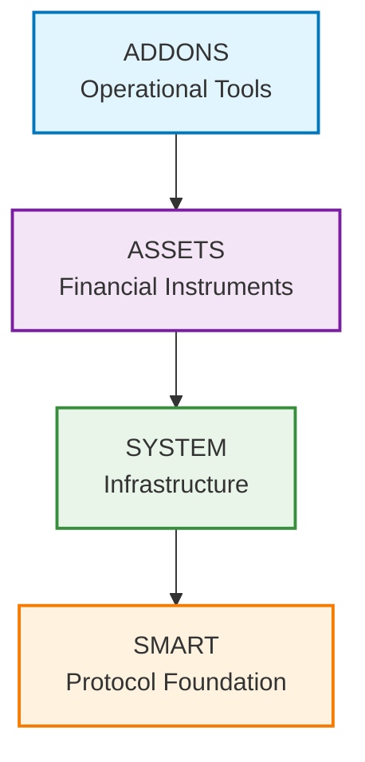

# ATK (Asset Tokenization Kit) Protocol Contracts

✨ [https://settlemint.com](https://settlemint.com) ✨

**A comprehensive smart contract architecture for regulatory-compliant asset
tokenization**

## 📋 Overview

This directory contains the complete ATK (Asset Tokenization Kit) smart contract
architecture, organized into logical layers that build upon each other to create
a comprehensive asset tokenization platform.

**Important Distinction:**

- **SMART Protocol** = The foundational protocol specification (like HTTP or
  TCP/IP)
- **ATK (Asset Tokenization Kit)** = SettleMint's production implementation of
  the SMART Protocol with specific assumptions and optimizations

ATK is one possible implementation of the SMART Protocol, designed for
enterprise-grade asset tokenization with particular choices around access
control, proxy patterns, and infrastructure management.

## 🏗️ Architecture Layers

The ATK Protocol follows a layered architecture where each level builds upon the
previous one:



## 📁 Directory Structure

### 1. **`smart/`** - Protocol Foundation

The foundational layer implementing the SMART Protocol (SettleMint Adaptable
Regulated Token).

**Purpose**: Provides the core tokenization framework based on ERC-3643
standards with modular extensions. This is the protocol specification that can
be implemented in different ways.

**Key Components**:

- **Core**: Base SMART token implementation with ERC-20 compatibility
- **Extensions**: Modular functionality (Pausable, Burnable, Custodian, Yield,
  etc.)
- **Compliance**: Modular compliance system with pluggable rules
- **Interface**: ERC-3643 interfaces and protocol definitions

**Why First**: Everything else builds on this foundation. It provides the basic
token functionality, compliance framework, and extension system that all other
layers depend on.

### 2. **`system/`** - ATK Infrastructure Implementation

The infrastructure layer that manages the entire ATK ecosystem. This represents
ATK's specific implementation choices for how to manage the SMART Protocol in
production.

**Purpose**: Provides centralized management of identities, compliance,
factories, and access control across the entire platform. These are ATK's
specific architectural decisions.

**Key Components**:

- **Identity Management**: Identity registry, factory, and storage
- **Compliance System**: Compliance orchestration and module registry
- **Access Control**: Role-based permissions and access management
- **Registries**: Discovery and management of factories, modules, and addons

**Why Second**: The system layer manages the infrastructure that assets need to
operate. It provides the identity management, compliance orchestration, and
factory systems that assets use.

### 3. **`assets/`** - ATK Asset Implementations

Production-ready tokenized financial instruments built on the SMART Protocol
using ATK's implementation patterns.

**Purpose**: Provides ATK's specific implementations of tokenized assets for
different financial use cases, following ATK's design patterns and
infrastructure choices.

**Key Components**:

- **Bond**: Fixed-term debt instruments with maturity and redemption
- **Equity**: Shares with voting rights and governance
- **Deposit**: Collateral-backed deposit certificates
- **Fund**: Investment fund shares with management fees
- **StableCoin**: Fiat-pegged tokens with collateral backing

**Why Third**: Assets are built on top of the SMART Protocol foundation and use
the system infrastructure. They represent the actual tokenized financial
instruments that users interact with.

### 4. **`addons/`** - ATK Operational Tools

Additional functionality that extends the ATK platform with operational
capabilities.

**Purpose**: Provides ATK's specialized tools for token distribution, treasury
management, settlements, and yield distribution. These are ATK-specific
extensions beyond the core SMART Protocol.

**Key Components**:

- **Airdrop**: Token distribution system with multiple strategies
- **Vault**: Multi-signature treasury management
- **XvP**: Cross-value proposition atomic settlements
- **Yield**: Fixed yield schedule management

**Why Fourth**: Addons are operational tools that work with the existing assets
and infrastructure. They provide additional functionality for managing and
operating tokenized assets.

### 5. **`onchainid/`** - Identity Infrastructure

OnChainID implementation for identity management and claims.

**Purpose**: Provides the identity infrastructure used by the compliance system
for KYC/AML and regulatory compliance.

**Key Components**:

- **ERC-734**: Key management standard
- **ERC-735**: Claim management standard
- **Identity Contracts**: On-chain identity with revocation support

### 6. **`vendor/`** - Third-Party Dependencies

External dependencies and vendor contracts.

**Purpose**: Contains third-party contracts and libraries that the ATK Protocol
depends on.

## 🔄 How They Work Together

### Bottom-Up Construction

1. **SMART Protocol** provides the foundational token framework
2. **System Infrastructure** manages identities, compliance, and access control
3. **Assets** implement specific financial instruments using the foundation
4. **Addons** provide operational tools for managing and distributing assets

### Information Flow

```
User Request → Asset Contract → System Infrastructure → SMART Protocol → Execution
```

### Example: Bond Token Transfer

1. **User** initiates transfer of bond tokens
2. **Bond Asset** (assets/) uses its extensions and compliance rules
3. **System Infrastructure** (system/) validates identity and compliance
4. **SMART Protocol** (smart/) executes the compliant transfer
5. **Result** returned to user

## ✅ Key Benefits

This layered architecture provides:

- **Modularity**: Each layer can be developed and tested independently
- **Extensibility**: New functionality can be added at any layer
- **Reusability**: Lower layers serve multiple upper layers
- **Maintainability**: Clear separation of concerns
- **Compliance**: Regulatory requirements handled at appropriate layers

The result is a comprehensive, production-ready platform for compliant asset
tokenization that can be extended and customized for various financial use
cases.
