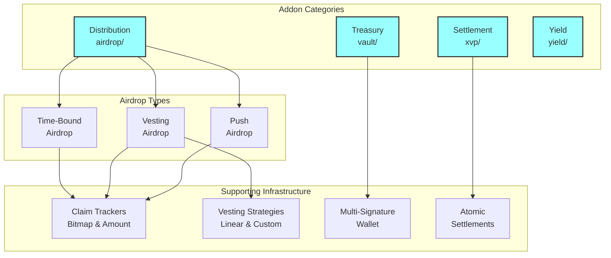
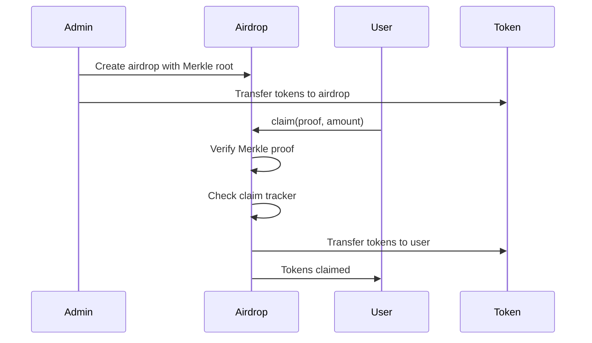
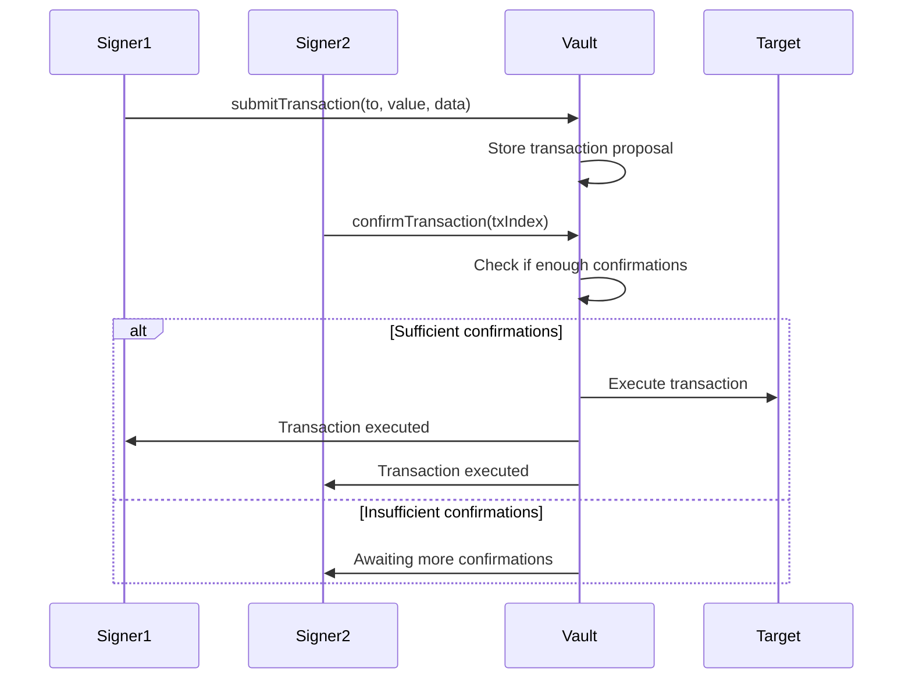
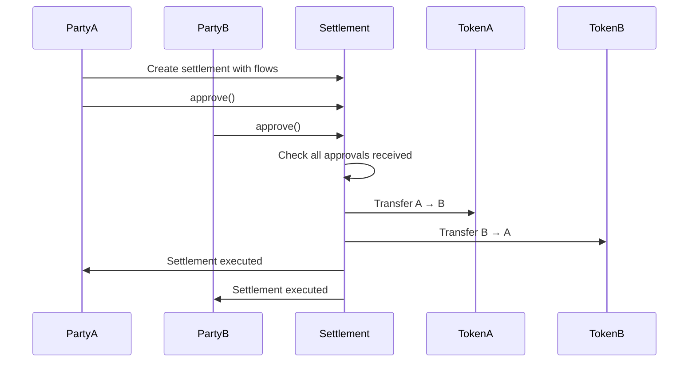

# ATK System Addons

✨ [https://settlemint.com](https://settlemint.com) ✨

**A comprehensive suite of system addons that extend the ATK Protocol with
additional functionality for airdrops, vaults, cross-value settlements, and
yield management**

## 📋 What are ATK System Addons?

ATK System Addons are modular extensions that provide additional functionality
beyond core asset tokenization. These addons integrate with the ATK System
infrastructure to offer specialized capabilities for token distribution,
treasury management, cross-chain settlements, and yield strategies.

Unlike assets (which are tokenized instruments), addons are operational tools
that work alongside the tokenization infrastructure to provide enhanced
functionality for ecosystem participants.

## 🏗️ Architecture Overview

ATK System Addons follow a modular architecture with specialized functionality:



## 🎯 Addon Categories

### 1. **Airdrop** (`airdrop/`)

Token distribution system with multiple strategies and claim tracking

**Overview:** A comprehensive airdrop system built on Merkle proofs with
flexible claim tracking and multiple distribution strategies. Supports partial
claims, time-bound distributions, vesting schedules, and push-based airdrops.

**Core Features:**

- Merkle proof-based eligibility verification
- Pluggable claim tracking strategies
- Meta-transaction support via ERC2771
- Owner withdrawal of unclaimed tokens
- Batch claim operations

**Airdrop Types:**

#### Time-Bound Airdrop (`time-bound-airdrop/`)

- **Purpose**: Airdrops with specific start and end times
- **Key Features**:
  - Configurable start and end timestamps
  - Automatic expiration handling
  - Owner withdrawal after expiration
  - Standard Merkle proof verification

#### Vesting Airdrop (`vesting-airdrop/`)

- **Purpose**: Airdrops with token vesting schedules
- **Key Features**:
  - Linear vesting strategy support
  - Configurable vesting periods and cliffs
  - Progressive token release
  - Vesting schedule management

#### Push Airdrop (`push-airdrop/`)

- **Purpose**: Admin-initiated token distribution
- **Key Features**:
  - Admin-controlled token pushing
  - Batch distribution capabilities
  - No user claiming required
  - Instant token delivery

**Claim Tracking:**

#### Bitmap Claim Tracker (`claim-tracker/`)

- **Purpose**: Efficient tracking of claimed airdrops using bitmaps
- **Features**:
  - Gas-efficient storage for large airdrop lists
  - Binary claim status (claimed/unclaimed)
  - Optimal for simple airdrop scenarios

#### Amount Claim Tracker (`claim-tracker/`)

- **Purpose**: Tracking of partial claims and remaining amounts
- **Features**:
  - Support for partial claims
  - Tracks claimed amounts per user
  - Suitable for progressive claiming

**Airdrop-Specific Features:**

#### Merkle Proof System

- **Root Verification**: Efficient verification of large recipient lists
- **Proof Generation**: Off-chain proof generation for gas efficiency
- **Tamper Resistance**: Cryptographic integrity of airdrop data

#### Flexible Distribution

- **Multiple Strategies**: Support for different airdrop types
- **Configurable Parameters**: Customizable timing, amounts, and restrictions
- **Batch Operations**: Efficient multi-user operations

**Use Cases:**

- Token launches and community rewards
- Retroactive airdrops for existing users
- Vested team and investor distributions
- Marketing and engagement campaigns

**Airdrop Workflow:**



### 2. **Vault** (`vault/`)

Multi-signature treasury management system with role-based access control

**Overview:** A comprehensive multi-signature wallet system designed for
treasury management, featuring role-based access control, transaction proposals,
confirmations, and emergency procedures.

**Core Features:**

- Multi-signature transaction approval
- Role-based access control (Signers, Emergency, Governance)
- Support for both ETH and ERC20 transactions
- Pausable operations for emergency situations
- Comprehensive audit trail

**Vault-Specific Features:**

#### Multi-Signature Operations

- **Transaction Proposals**: Signers can propose transactions
- **Confirmation System**: Required number of confirmations before execution
- **Revocation Support**: Ability to revoke confirmations
- **Automatic Execution**: Configurable auto-execution upon sufficient approvals

#### Role-Based Security

- **SIGNER_ROLE**: Can propose and confirm transactions
- **EMERGENCY_ROLE**: Can pause/unpause operations
- **GOVERNANCE_ROLE**: Can modify vault parameters
- **Access Control**: Enumerable role management

#### Transaction Types

- **ETH Transfers**: Native currency transactions
- **ERC20 Transfers**: Token transfers with approval mechanics
- **Contract Interactions**: General contract function calls
- **Batch Operations**: Multiple transactions in one proposal

**Use Cases:**

- DAO treasury management
- Multi-sig custody solutions
- Corporate treasury operations
- Project fund management

**Vault Workflow:**



### 3. **XvP Settlement** (`xvp/`)

Cross-Value Proposition atomic settlement system for multi-party token exchanges

**Overview:** A sophisticated settlement system that enables atomic swaps
between multiple parties with different tokens, ensuring all transfers happen
together or none at all.

**Core Features:**

- Multi-party atomic settlements
- Support for any number of participants
- Configurable expiration dates
- Per-sender approval system for local senders only
- Automatic execution options gated by HTLC coordination
- Optional cross-chain hashlock enforcement

**XvP-Specific Features:**

#### Atomic Settlement Engine

- **Multi-Party Support**: Any number of participants
- **Flow Management**: Multiple token flows in single settlement
- **All-or-Nothing**: Atomic execution guarantees
- **Expiration Handling**: Time-based settlement expiry

#### Approval System

- **Per-Sender Approvals**: Each party approves the entire settlement
- **Approval Tracking**: Comprehensive approval status monitoring
- **Cancellation Rights**: Any sender can cancel before execution
- **Auto-Execution**: Optional automatic execution when all approvals received

#### Settlement Flows

- **Token Flows**: ERC20 token transfers between parties
- **External References**: Each flow now includes an `externalChainId`
  - `0` designates a local transfer executed on the current chain
  - Non-zero values record an external leg (no local transfer is attempted)
- **Approval Scope**: Only senders in local flows must provide ERC20 allowances
  and approvals
- **Validation**: Local flows are probed for ERC20 compliance; external flows
  skip token introspection

#### Hashlock Coordination

- **Shared Hashlock (`hashlock`)**: Required whenever any flow targets an
  external chain; optional for pure local settlements
- **Permissionless Reveal**: Anyone may call `revealSecret(bytes secret)` once
  the external HTLC reveals the preimage
- **Execution Gate**: Local transfers execute only after both all local
  approvals and the hashlock are satisfied
- **Auto-Execution Alignment**: Auto mode now waits for approvals _and_ a
  successful secret reveal before triggering transfers
- **Withholding Protection**: Since `revealSecret` is open to all,
  counterparties cannot block completion once the secret is public

**Use Cases:**

- Cross-chain asset swaps
- Multi-party token exchanges
- Complex financial settlements
- Atomic trade execution

**XvP Settlement Workflow:**



**Hashlock Lifecycle (for external flows):**

1. Any flow with `externalChainId != 0` requires a non-zero `hashlock` during
   creation.
2. External counterparties deploy HTLCs using the shared hashlock and eventually
   reveal the secret on their chain.
3. Anyone can relay the revealed secret via `revealSecret(bytes secret)`.
4. Execution (manual or auto) proceeds only after both the secret is accepted
   and all local approvals are present.

### 4. **Yield** (`yield/`)

Fixed yield schedule management system for token yield distribution

**Overview:** A factory system for creating and managing fixed yield schedules
that can be attached to tokens for automatic yield distribution.

**Core Features:**

- Fixed yield schedule creation
- Factory pattern for deployment
- Integration with token yield systems
- Configurable yield parameters

**Yield-Specific Features:**

#### Fixed Yield Schedules

- **Deterministic Yields**: Pre-configured yield amounts and timing
- **Schedule Management**: Creation and configuration of yield schedules
- **Token Integration**: Seamless integration with yield-bearing tokens
- **Factory Deployment**: Standardized deployment via factory pattern

#### Schedule Configuration

- **Yield Amounts**: Fixed yield amounts per distribution
- **Distribution Timing**: Configurable distribution schedules
- **Recipient Management**: Automatic distribution to token holders
- **Parameter Updates**: Admin-controlled schedule modifications

**Use Cases:**

- Fixed-term bond yield distributions
- Dividend payments for equity tokens
- Reward distributions for staking
- Scheduled token distributions

## 🔐 Access Control & Security

### Common Security Patterns

All ATK System Addons implement consistent security patterns:

#### Role-Based Access Control

- **Granular Permissions**: Specific roles for different operations
- **Separation of Duties**: Clear separation between operational roles
- **Enumerable Access**: Transparent role management
- **Emergency Procedures**: Dedicated emergency response roles

#### Meta-Transaction Support

- **ERC2771 Integration**: Gasless transaction support
- **Trusted Forwarders**: Configurable trusted forwarder contracts
- **User Experience**: Improved UX through sponsored transactions

#### Reentrancy Protection

- **ReentrancyGuard**: Protection against reentrancy attacks
- **Secure Patterns**: Checks-effects-interactions pattern
- **State Management**: Proper state management during external calls

### Addon-Specific Security

#### Airdrop Security

- **Merkle Proofs**: Cryptographic verification of eligibility
- **Claim Tracking**: Prevent double-spending and replay attacks
- **Owner Controls**: Secure withdrawal of unclaimed tokens
- **Time Bounds**: Automatic expiration and cleanup

#### Vault Security

- **Multi-Signature**: Distributed control over treasury operations
- **Confirmation Thresholds**: Configurable approval requirements
- **Emergency Pause**: Immediate suspension of operations
- **Audit Trail**: Comprehensive transaction logging

#### XvP Security

- **Atomic Execution**: All-or-nothing transaction guarantees
- **Approval Verification**: Cryptographic approval verification
- **Expiration Safety**: Automatic expiration of stale settlements
- **Flow Validation**: Pre-execution validation of all transfers

## 📁 Directory Structure

```
addons/
├── airdrop/                              # Token distribution system
│   ├── ATKAirdrop.sol                    # Base airdrop contract
│   ├── ATKAirdropErrors.sol              # Error definitions
│   ├── IATKAirdrop.sol                   # Airdrop interface
│   ├── claim-tracker/                    # Claim tracking strategies
│   │   ├── ATKAmountClaimTracker.sol     # Amount-based tracking
│   │   ├── ATKBitmapClaimTracker.sol     # Bitmap-based tracking
│   │   └── IATKClaimTracker.sol          # Claim tracker interface
│   ├── push-airdrop/                     # Admin-initiated distributions
│   │   ├── ATKPushAirdropImplementation.sol
│   │   ├── ATKPushAirdropFactoryImplementation.sol
│   │   ├── ATKPushAirdropProxy.sol
│   │   ├── IATKPushAirdrop.sol
│   │   └── IATKPushAirdropFactory.sol
│   ├── time-bound-airdrop/               # Time-constrained airdrops
│   │   ├── ATKTimeBoundAirdropImplementation.sol
│   │   ├── ATKTimeBoundAirdropFactoryImplementation.sol
│   │   ├── ATKTimeBoundAirdropProxy.sol
│   │   ├── IATKTimeBoundAirdrop.sol
│   │   └── IATKTimeBoundAirdropFactory.sol
│   └── vesting-airdrop/                  # Vesting-enabled airdrops
│       ├── ATKLinearVestingStrategy.sol   # Linear vesting implementation
│       ├── ATKVestingAirdropImplementation.sol
│       ├── ATKVestingAirdropFactoryImplementation.sol
│       ├── ATKVestingAirdropProxy.sol
│       ├── IATKLinearVestingStrategy.sol
│       ├── IATKVestingAirdrop.sol
│       ├── IATKVestingAirdropFactory.sol
│       └── IATKVestingStrategy.sol
├── vault/                                # Multi-signature treasury
│   ├── ATKVault.sol                      # Multi-sig vault implementation
│   ├── ATKVaultFactoryImplementation.sol # Vault factory
│   └── IATKVaultFactory.sol              # Factory interface
├── xvp/                                  # Cross-value proposition settlements
│   ├── ATKXvPSettlementImplementation.sol # Settlement logic
│   ├── ATKXvPSettlementFactoryImplementation.sol
│   ├── ATKXvPSettlementProxy.sol
│   ├── IATKXvPSettlement.sol
│   └── IATKXvPSettlementFactory.sol
└── yield/                                # Yield schedule management
    ├── ATKFixedYieldProxy.sol            # Yield schedule proxy
    ├── ATKFixedYieldScheduleFactoryImplementation.sol
    └── IATKFixedYieldScheduleFactory.sol
```

## ✅ Conclusion

ATK System Addons provide a comprehensive suite of operational tools that extend
the core ATK Protocol with specialized functionality for:

- **Token Distribution**: Sophisticated airdrop systems with multiple strategies
- **Treasury Management**: Multi-signature vaults with role-based access control
- **Atomic Settlements**: Cross-value proposition settlements for complex
  exchanges
- **Yield Management**: Fixed yield schedules for automated distributions

Key benefits of the addon architecture:

- **Modularity**: Independent addons that can be used individually or together
- **Extensibility**: Factory patterns enable easy deployment of new instances
- **Security**: Consistent security patterns across all addons
- **Integration**: Seamless integration with ATK System infrastructure
- **Flexibility**: Configurable parameters for different use cases

The addon system enables ecosystem participants to build sophisticated
tokenization solutions that go beyond basic asset representation, providing the
operational tools needed for real-world deployment and management of tokenized
assets.
