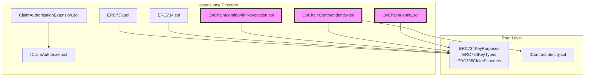

# OnChainID Extensions - Building Blocks for Identity Management

✨ [https://settlemint.com](https://settlemint.com) ✨

**Modular extensions and building blocks for implementing OnChainID-compliant
identity contracts**

## 📋 What are OnChainID Extensions?

These OnChainID extensions are reusable building blocks and utility contracts
that extend the base
[OnChainID protocol](https://github.com/onchain-id/solidity) functionality.
Rather than monolithic identity implementations, these provide modular
components that can be composed together to create sophisticated identity
management systems.

These extensions follow the **composition over inheritance** pattern, allowing
developers to:

- **Mix and match** functionality based on specific requirements
- **Extend existing implementations** without breaking compatibility
- **Maintain upgradability** while preserving identity state
- **Ensure compliance** with ERC-734/735 standards

## 🧩 Core Building Blocks

### Available Extensions

The actual files in the `onchainid/` directory provide building blocks for
OnChainID implementations:

#### Core Constants

- `ERC734KeyPurposes.sol` - Key purpose constants
- `ERC734KeyTypes.sol` - Cryptographic key types
- `ERC735ClaimSchemes.sol` - Signature scheme constants

#### Interface Definitions

- `IContractIdentity.sol` - Interface for contract identities

#### Extension Implementations (in `extensions/` folder)

- `OnChainIdentity.sol` - Standard user identity implementation
- `OnChainContractIdentity.sol` - Contract identity implementation
- `OnChainIdentityWithRevocation.sol` - Identity with revocation support
- `ERC734.sol` - ERC-734 key management extension
- `ERC735.sol` - ERC-735 claim management extension
- `ClaimAuthorizationExtension.sol` - Claim authorization logic
- `IClaimAuthorizer.sol` - Claim authorizer interface

These files provide the building blocks for creating OnChainID-compliant
identity systems with modular, extensible architecture.

### Claim Issuance Mechanisms

These extensions support two different mechanisms for issuing claims to
identities:

#### 1. Direct Contract Identity Claims

Contract identities can issue claims directly to other identities using the
`issueClaimTo` method without going through the authorization system:

```solidity
// Contract identity issuing a claim directly
IContractIdentity contractIdentity = IContractIdentity(contractOnchainID);
contractIdentity.issueClaimTo(
    targetIdentity,
    topicId,
    claimData,
    proofUri
);
```

#### 2. Trusted Issuer Authorization

Trusted issuers add claims directly to identity contracts. The identity
validates the issuer's authorization by checking with registered claim
authorizers (like the trusted issuers registry).

### Claim Authorization Extensions

#### `ClaimAuthorizationSystem.sol`

A sophisticated extension that enables programmatic claim management for trusted
issuers. This system controls which trusted issuers can add claims through the
trusted issuers registry - it does not control contract identities using
`issueClaimTo` directly.

```solidity
contract ClaimAuthorizationSystem {
    mapping(address => bool) public authorizedClaimAdders;
    mapping(address => bool) public authorizedClaimRemovers;

    function canAddClaim(address caller, uint256 topic) external view returns (bool);
    function canRemoveClaim(address caller, bytes32 claimId) external view returns (bool);
    function authorizeClaimAdder(address adder) external;
    function revokeClaimAdder(address adder) external;
}
```

**Key Features:**

1. **Programmatic Authorization**: Contracts can be authorized to add/remove
   claims
2. **Topic-Specific Control**: Fine-grained permissions per claim topic
3. **Revocable Permissions**: Authorization can be granted and revoked
   dynamically
4. **Integration Ready**: Designed to work with trusted issuer registries

**Usage Example:**

```solidity
// 1. Register KYC provider as trusted issuer for KYC topic
ITrustedIssuersRegistry(registry).addTrustedIssuer(
    IClaimIssuer(kycProviderContract),
    [KYC_TOPIC]
);

// 2. Register the trusted issuers registry as a claim authorizer on the identity
IIdentity(userIdentity).registerClaimAuthorizationContract(registry);

// 3. KYC provider can now add claims directly to the identity
// The identity will check with the registry to validate authorization
IIdentity(userIdentity).addClaim(
    KYC_TOPIC,
    1, // ECDSA signature scheme
    kycProviderContract,
    signature,
    kycData,
    "https://kyc-proof.com"
);
```

## 🏗️ Identity Implementation Architecture

### Modular Composition Pattern

Identity implementations use these extensions as building blocks:



### Extension Integration Points

1. **Constructor Composition**: Extensions are initialized during identity
   deployment
2. **Interface Aggregation**: Multiple extension interfaces are exposed through
   the main contract
3. **State Isolation**: Each extension manages its own state to prevent
   conflicts
4. **Upgrade Compatibility**: Extensions can be upgraded independently

## 📚 Extension Reference

### Available Extensions

| Extension                       | Purpose                             | Status | Integration Points                        |
| ------------------------------- | ----------------------------------- | ------ | ----------------------------------------- |
| `OnChainIdentity`               | Standard user identity              | Stable | Complete ERC-734/735 implementation       |
| `OnChainContractIdentity`       | Contract identity with issueClaimTo | Stable | For smart contracts needing identity      |
| `OnChainIdentityWithRevocation` | Identity with claim revocation      | Stable | Enhanced identity with revocation support |
| `ERC734`                        | ERC-734 key management extension    | Stable | Key management building block             |
| `ERC735`                        | ERC-735 claim management extension  | Stable | Claim management building block           |
| `ERC734KeyPurposes`             | Key purpose constants               | Stable | Used by ERC734 extension                  |
| `ERC734KeyTypes`                | Cryptographic key types             | Stable | Used by ERC734 extension                  |
| `ERC735ClaimSchemes`            | Signature schemes                   | Stable | Used by ERC735 extension                  |
| `ClaimAuthorizationExtension`   | Programmatic claim control          | Stable | Extension for authorization logic         |
| `IContractIdentity`             | Contract identity interface         | Stable | Interface definition                      |
| `IClaimAuthorizer`              | Claim authorizer interface          | Stable | Interface definition                      |

## 📁 Directory Structure

```
onchainid/
├── README.md                          # This documentation
├── ERC734KeyPurposes.sol             # Key purpose constants
├── ERC734KeyTypes.sol                # Cryptographic key types
├── ERC735ClaimSchemes.sol            # Signature scheme constants
├── IContractIdentity.sol             # Contract identity interface
└── extensions/                       # Extension components
    ├── ClaimAuthorizationExtension.sol # Claim authorization logic
    ├── ERC734.sol                     # ERC-734 key management extension
    ├── ERC735.sol                     # ERC-735 claim management extension
    ├── IClaimAuthorizer.sol           # Claim authorizer interface
    ├── OnChainContractIdentity.sol    # Contract identity implementation
    ├── OnChainIdentity.sol            # Standard user identity implementation
    └── OnChainIdentityWithRevocation.sol # Identity with revocation support
```

## ✅ Conclusion

These OnChainID extensions provide a flexible, secure, and composable foundation
for building sophisticated identity management systems. By using these building
blocks, developers can:

- **Accelerate Development**: Reuse proven, tested components
- **Ensure Compliance**: Build on ERC-734/735 compliant foundations
- **Maintain Flexibility**: Compose exactly the functionality needed
- **Enable Innovation**: Extend the system with custom logic
- **Preserve Security**: Benefit from battle-tested security patterns

The extension system bridges the gap between the base OnChainID protocol and
complex real-world requirements, providing the tools needed to build
production-ready identity solutions with modular, upgradeable architecture.
