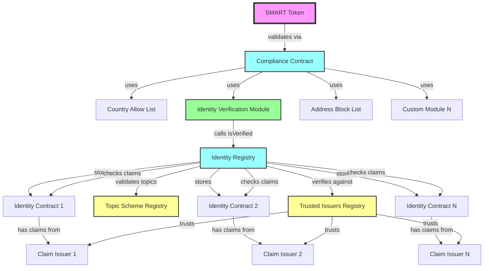
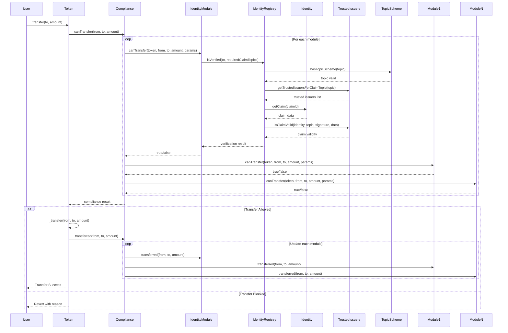
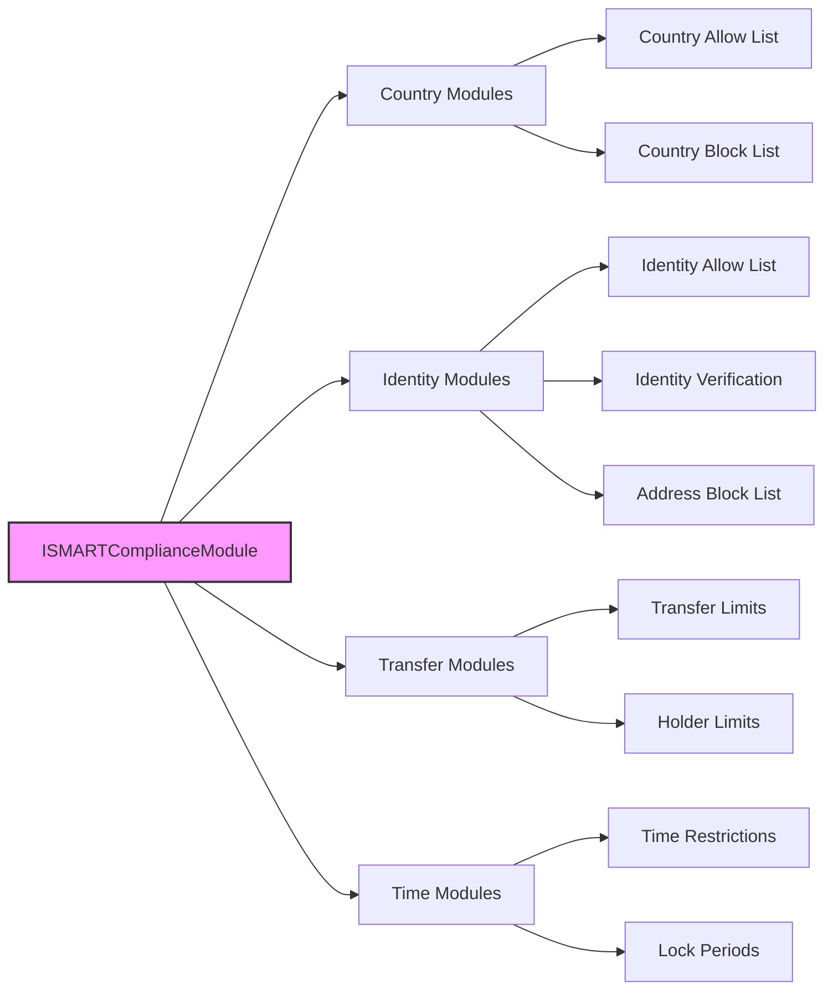
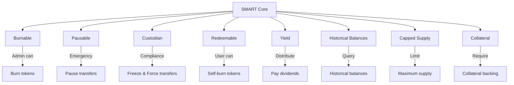
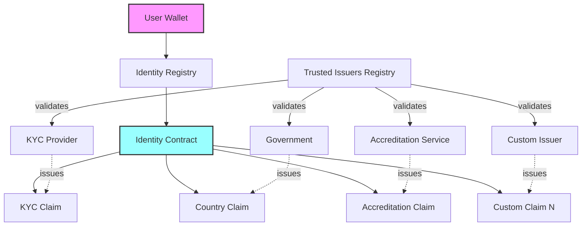
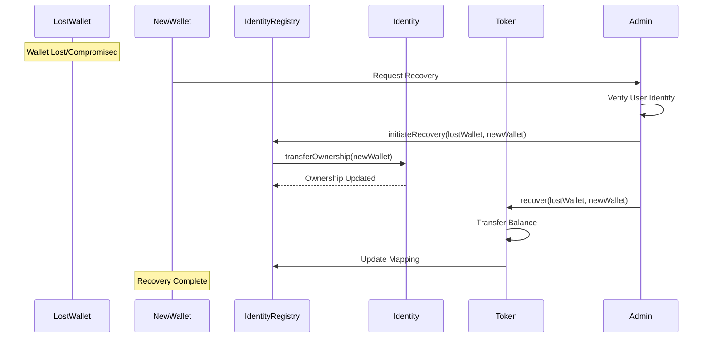
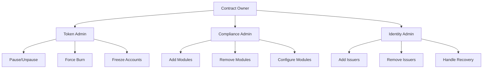
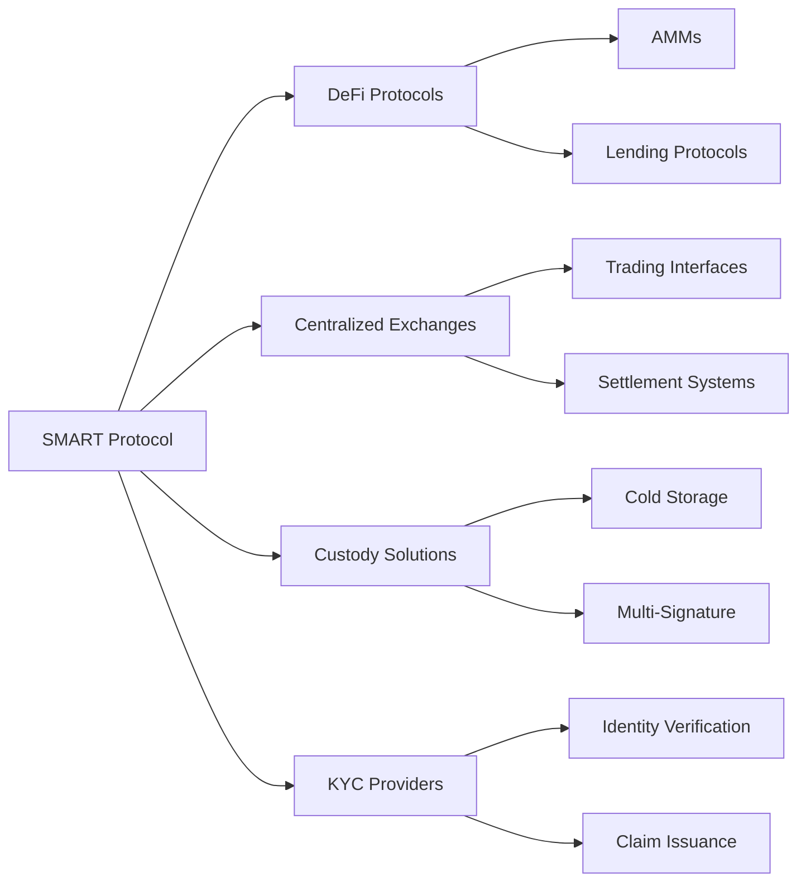

# SMART Protocol Architecture

## Overview

The SMART (SettleMint Adaptable Regulated Token) protocol is a comprehensive
derivation of the ERC-3643 (T-REX) standard for compliant security tokens. Built
on ERC-20 foundations using OpenZeppelin, it provides a more modular and
flexible approach to tokenized asset compliance. This document details the
architectural design, component relationships, and operational flows.

## System Architecture

### Core Components Overview



### Component Descriptions

#### 1. **SMART Token**

The main security token contract that derives from ERC-3643 principles while
maintaining full ERC-20 compatibility through OpenZeppelin. Available in two
variants:

- **SMART.sol**: Non-upgradeable implementation
- **SMARTUpgradeable.sol**: UUPS upgradeable implementation

#### 2. **Identity Registry**

Central registry mapping wallet addresses to identity contracts. Features:

- Stores identity contract addresses for each wallet
- Manages identity verification status
- Handles wallet recovery mechanisms
- Supports identity transfers

#### 3. **Compliance Contract**

Orchestrates compliance checks as an engine based on token configuration:

- Executes modules configured on each specific token
- Performs pre-transfer validation using token's module list
- Updates post-transfer state for configured modules
- No modules stored directly - purely orchestration engine

#### 4. **Trusted Issuers Registry**

Manages trusted entities that can issue identity claims:

- Stores trusted issuer addresses
- Maps issuers to claim topics they can attest
- Supports multiple issuers per topic

#### 5. **Topic Scheme Registry**

Defines the claim topics available for compliance:

- Lists valid claim topics globally
- Maps topics to verification requirements
- Shared registry across all tokens

## Token Transfer Flow

### Detailed Transfer Sequence



### Transfer Validation Steps

1. **Identity Verification**
   - Verify receiver has valid identity contract and required claims
   - Sender verification is assumed (already owns tokens, so was previously
     verified)

2. **Compliance Validation**
   - Compliance engine runs through modules configured on the specific token
   - Each configured module performs its specific checks
   - All configured modules must approve for transfer to proceed

3. **Balance Updates**
   - Execute standard ERC-20 transfer
   - Update compliance module states
   - Emit transfer events

## Compliance Module Architecture

### Multi-Token Configuration

```mermaid
graph TB
    %% Multiple Tokens
    TokenA[Token A]
    TokenB[Token B]
    TokenC[Token C]

    %% Token-Specific Compliance Configurations
    ConfigA[Token A Compliance Config<br/>Modules: A, B<br/>Parameters: {...}]
    ConfigB[Token B Compliance Config<br/>Modules: A, C<br/>Parameters: {...}]
    ConfigC[Token C Compliance Config<br/>Modules: B, C<br/>Parameters: {...}]

    %% Shared Compliance Contract
    CC[Compliance Contract<br/>Orchestration Engine]

    %% Compliance Modules
    ModuleA[Module A]
    ModuleB[Module B]
    ModuleC[Module C]

    %% Global Module Configuration
    GlobalA[Module A Global Config]
    GlobalB[Module B Global Config]
    GlobalC[Module C Global Config]

    %% Relationships
    TokenA -->|has configuration| ConfigA
    TokenB -->|has configuration| ConfigB
    TokenC -->|has configuration| ConfigC

    TokenA -->|uses| CC
    TokenB -->|uses| CC
    TokenC -->|uses| CC

    CC -->|orchestrates| ModuleA
    CC -->|orchestrates| ModuleB
    CC -->|orchestrates| ModuleC

    ConfigA -->|configures| ModuleA
    ConfigA -->|configures| ModuleB

    ConfigB -->|configures| ModuleA
    ConfigB -->|configures| ModuleC

    ConfigC -->|configures| ModuleB
    ConfigC -->|configures| ModuleC

    GlobalA -->|global config| ModuleA
    GlobalB -->|global config| ModuleB
    GlobalC -->|global config| ModuleC

    ModuleA -->|verifies| Identity[Identity/Claims System]
    ModuleB -->|verifies| Identity
    ModuleC -->|verifies| Identity

    style CC fill:#9ff,stroke:#333,stroke-width:2px
    style ConfigA fill:#f9f,stroke:#333,stroke-width:1px
    style ConfigB fill:#f9f,stroke:#333,stroke-width:1px
    style ConfigC fill:#f9f,stroke:#333,stroke-width:1px
    style GlobalA fill:#ff9,stroke:#333,stroke-width:1px
    style GlobalB fill:#ff9,stroke:#333,stroke-width:1px
    style GlobalC fill:#ff9,stroke:#333,stroke-width:1px
```

### Configuration Levels

#### **Global Configuration**

- **Trusted Issuers Registry**: Defines which entities can issue identity claims
- **Topic Scheme Registry**: Defines valid claim topics (KYC, Accreditation,
  etc.)
- **Module Deployment**: Shared compliance modules across all tokens
- **Infrastructure**: Identity registry, storage contracts

#### **Token-Specific Configuration**

- **Required Claim Topics**: Each token defines which claims investors must have
- **Module Parameters**: Token-specific rules (allowed countries, transfer
  limits, etc.)
- **Compliance Rules**: Different restrictions per token type
- **Extension Configuration**: Token-specific feature enablement

### Configuration Example

```solidity
// Global Configuration (shared across all tokens)
TrustedIssuersRegistry.addTrustedIssuer(kycProvider, [1, 2, 3]); // Can issue KYC, Country, Accreditation
TopicSchemeRegistry.addTopicScheme(1, "KYC Verification");
TopicSchemeRegistry.addTopicScheme(2, "Country Verification");
TopicSchemeRegistry.addTopicScheme(3, "Accredited Investor");

// Token A Configuration (Real Estate Token)
TokenA.setRequiredClaimTopics([1, 2]); // Requires KYC + Country
CountryModule.setAllowedCountries(TokenA, [840, 826]); // US, UK only
IdentityModule.setRequiredTopics(TokenA, [1, 2]);

// Token B Configuration (Corporate Bond)
TokenB.setRequiredClaimTopics([1, 3]); // Requires KYC + Accreditation
CountryModule.setAllowedCountries(TokenB, [840, 826, 276]); // US, UK, Germany
IdentityModule.setRequiredTopics(TokenB, [1, 3]);

// Token C Configuration (Equity Shares)
TokenC.setRequiredClaimTopics([1, 2, 3]); // Requires KYC + Country + Accreditation
CountryModule.setAllowedCountries(TokenC, [840]); // US only
IdentityModule.setRequiredTopics(TokenC, [1, 2, 3]);
```

### Benefits of Shared Infrastructure

1. **Cost Efficiency**: Multiple tokens share the same compliance modules
2. **Consistency**: Same compliance logic across all tokens
3. **Flexibility**: Each token can have different parameters
4. **Scalability**: Easy to add new tokens without deploying new modules
5. **Maintenance**: Single point of updates for compliance logic
6. **Regulatory Alignment**: Shared global rules ensure consistency

### Module Hierarchy



### Module Interface

Each compliance module implements:

```solidity
interface ISMARTComplianceModule {
    // Pre-transfer check
    function canTransfer(
        address from,
        address to,
        uint256 amount
    ) external view returns (bool);

    // Post-transfer state update
    function transferred(
        address from,
        address to,
        uint256 amount
    ) external;

    // Token creation hook
    function created(address to, uint256 amount) external;

    // Token destruction hook
    function destroyed(address from, uint256 amount) external;
}
```

## Token Extensions Architecture

### Extension System



### Extension Descriptions

The SMART protocol's modular approach allows mixing and matching extensions
based on specific tokenization needs. Each extension adds specific functionality
through well-defined interfaces:

#### **Administrative Extensions**

1. **Burnable Extension** (`extensions/burnable/`)
   - **Purpose**: Allows designated administrators to burn tokens from any
     account
   - **Use Cases**: Regulatory compliance, token destruction, supply management
   - **Key Functions**: `burn(address account, uint256 amount)`
   - **Access Control**: Supply Manager role required

2. **Pausable Extension** (`extensions/pausable/`)
   - **Purpose**: Emergency pause functionality for all token transfers
   - **Use Cases**: Security incidents, regulatory orders, system maintenance
   - **Key Functions**: `pause()`, `unpause()`
   - **Access Control**: Token Admin role required

3. **Custodian Extension** (`extensions/custodian/`)
   - **Purpose**: Freeze addresses and force transfers for compliance
   - **Use Cases**: Legal orders, sanctions compliance, dispute resolution
   - **Key Functions**: `freeze(address account)`,
     `forceTransfer(from, to, amount)`
   - **Access Control**: Compliance Manager role required

#### **User-Facing Extensions**

4. **Redeemable Extension** (`extensions/redeemable/`)
   - **Purpose**: Users can burn their own tokens (self-redemption)
   - **Use Cases**: Token buybacks, voluntary redemptions, exit mechanisms
   - **Key Functions**: `redeem(uint256 amount)`
   - **Access Control**: Token holders can redeem their own tokens

5. **Yield Extension** (`extensions/yield/`)
   - **Purpose**: Distribute dividends or yield to token holders
   - **Use Cases**: Dividend payments, profit sharing, interest distribution
   - **Key Functions**: `distributeYield(uint256 totalAmount)`, `claimYield()`
   - **Access Control**: Yield Manager role for distribution

#### **Data & Analytics Extensions**

6. **Historical Balances Extension** (`extensions/historical/`)
   - **Purpose**: Query historical balance data at specific blocks
   - **Use Cases**: Snapshot governance, historical reporting, audit trails
   - **Key Functions**: `balanceOfAt(address account, uint256 blockNumber)`
   - **Features**: Automatic snapshot creation on transfers

#### **Supply Management Extensions**

7. **Capped Extension** (`extensions/capped/`)
   - **Purpose**: Enforce maximum token supply limits
   - **Use Cases**: Fixed supply tokens, inflation control, tokenomics
   - **Key Functions**: `cap()`, `totalSupply()`
   - **Features**: Prevents minting beyond cap, immutable once set

8. **Collateral Extension** (`extensions/collateral/`)
   - **Purpose**: Require collateral backing for token issuance
   - **Use Cases**: Asset-backed tokens, stablecoins, secured instruments
   - **Key Functions**: `addCollateral(uint256 amount)`,
     `removeCollateral(uint256 amount)`
   - **Features**: Maintains collateral ratios, prevents over-issuance

#### **Extension Compatibility**

Extensions are designed to work together seamlessly:

- **Burnable + Redeemable**: Admin and user-initiated token destruction
- **Pausable + Custodian**: Emergency controls with granular freezing
- **Yield + Historical**: Dividend distribution based on historical snapshots
- **Capped + Collateral**: Supply-limited tokens with backing requirements

#### **vs. Standard ERC-3643**

Unlike standard ERC-3643 implementations, SMART protocol's derivation approach
provides:

- **Modular Design**: Add only needed functionality
- **Role-Based Access**: Granular permission system
- **Upgradeability**: Extensions can be added/removed post-deployment
- **Composability**: Extensions work together without conflicts
- **Gas Efficiency**: Pay only for used functionality

## Identity and Claims System

### Identity Architecture



### Claim Structure

Claims follow the ERC-735 standard:

- **Topic**: Category of the claim (e.g., KYC, Country, Accreditation)
- **Scheme**: Version/format of the claim data
- **Issuer**: Address that issued and signed the claim
- **Signature**: Cryptographic proof of claim validity
- **Data**: Encrypted or hashed claim information
- **URI**: Optional link to off-chain claim data

## Recovery Mechanism

### Two-Step Recovery Process



## Gas Optimization Strategies

1. **Storage Packing**: Related variables packed in single storage slots
2. **Immutable Variables**: Use immutable for deployment-time constants
3. **Caching**: Identity verification results cached per transaction
4. **Batch Operations**: Multiple operations combined where possible
5. **Custom Errors**: Replace require strings with custom errors
6. **Short-Circuit Evaluation**: Check cheapest conditions first

## Security Architecture

### Access Control Hierarchy



### Security Features

1. **Role-Based Access Control**: Granular permissions for different operations
2. **Reentrancy Protection**: All state changes follow CEI pattern
3. **Integer Overflow Protection**: Solidity 0.8+ built-in protections
4. **Signature Validation**: All claims cryptographically verified
5. **Upgrade Safety**: UUPS pattern with access control

## Integration Points

### External System Integration



## Performance Characteristics

### Operation Complexity

| Operation                 | Gas Cost | Complexity             |
| ------------------------- | -------- | ---------------------- |
| Transfer (verified users) | ~150k    | O(m) where m = modules |
| Initial Registration      | ~300k    | O(1)                   |
| Add Compliance Module     | ~50k     | O(1)                   |
| Identity Verification     | ~100k    | O(c) where c = claims  |
| Burn Tokens               | ~80k     | O(1)                   |
| Pause/Unpause             | ~30k     | O(1)                   |

### Scalability Considerations

1. **Module Count**: Linear scaling with number of compliance modules
2. **Claim Verification**: Cached after first check per transaction
3. **Storage Growth**: Minimal per-user storage requirements
4. **Batch Operations**: Support for batch transfers and operations
