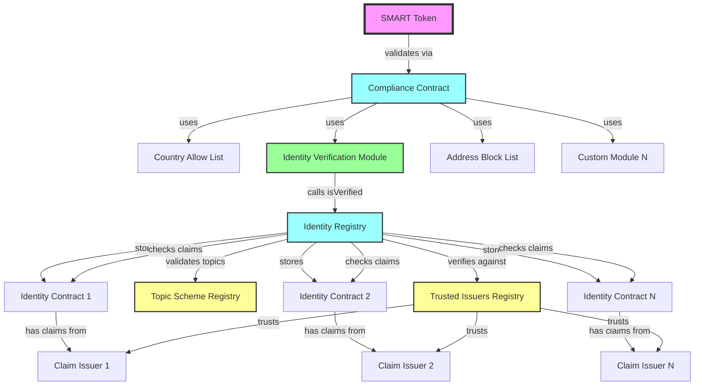
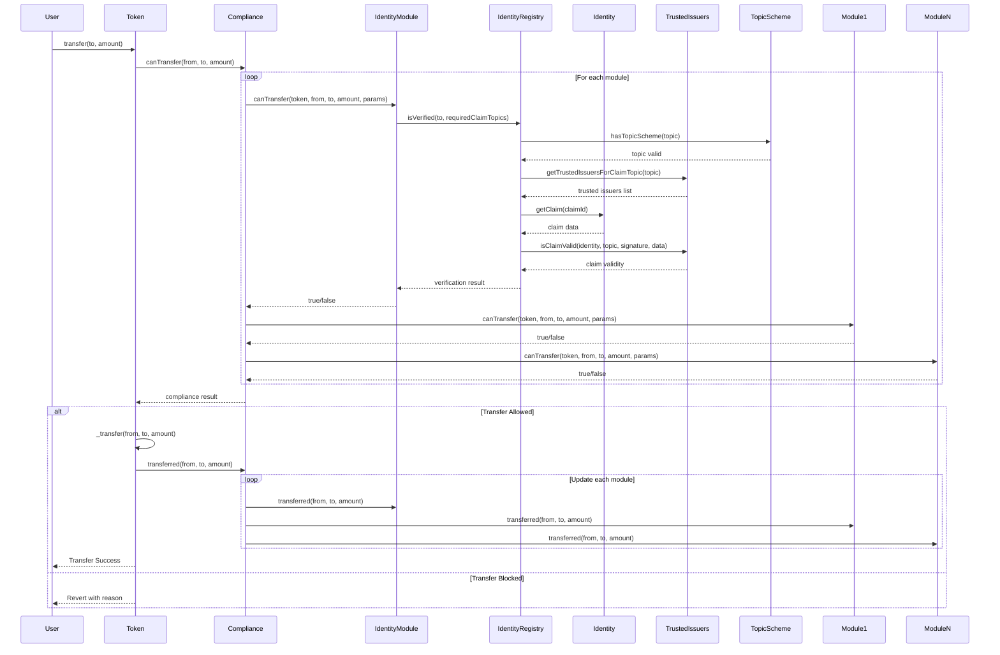
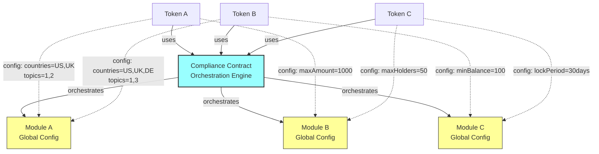
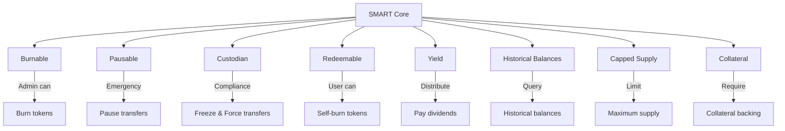
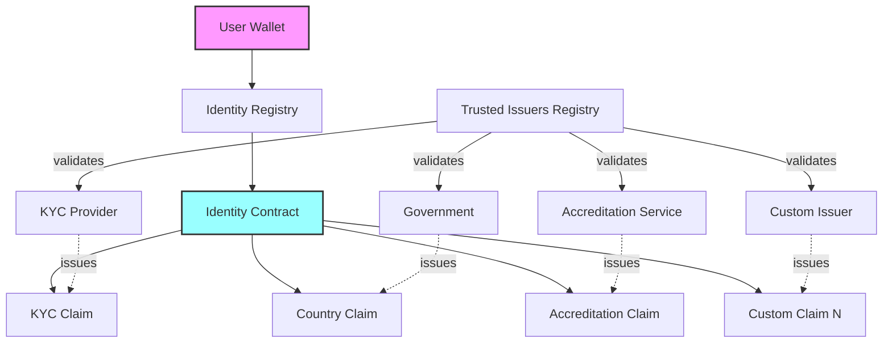
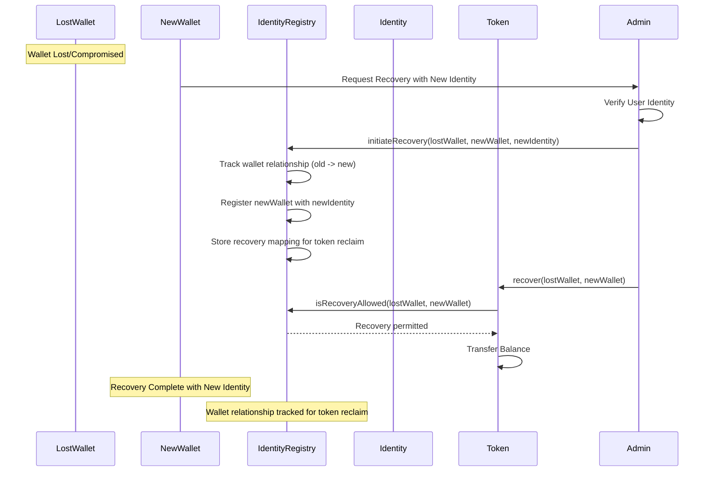
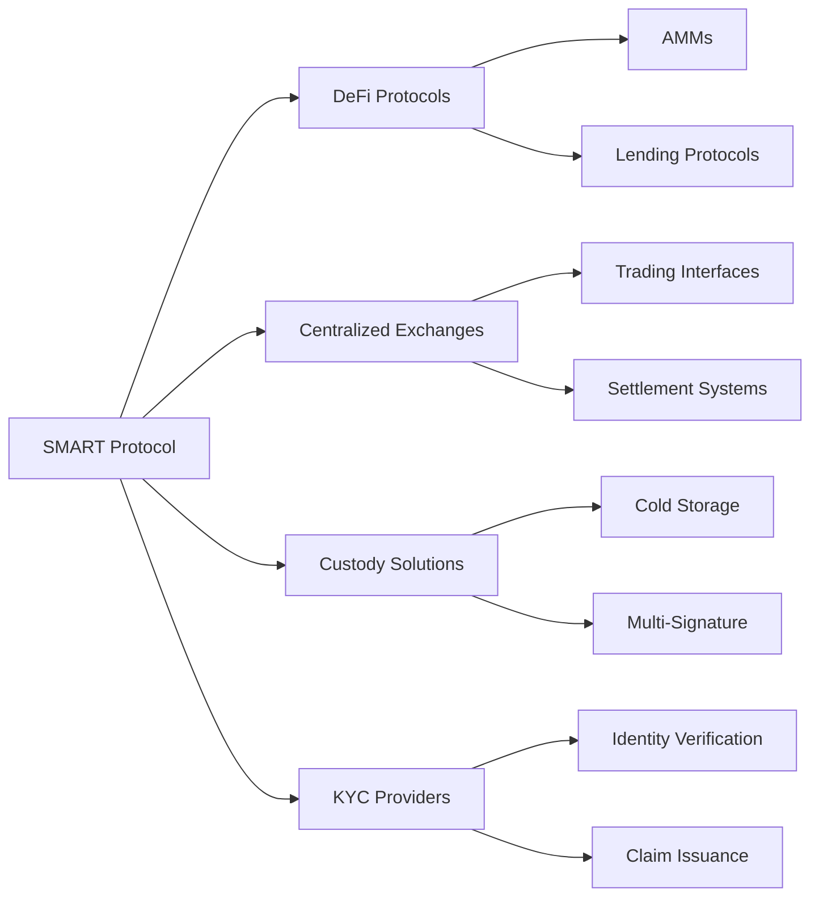

# SMART Protocol Architecture

## Overview

The SMART (SettleMint Adaptable Regulated Token) protocol is a comprehensive
derivation of the ERC-3643 (T-REX) standard for compliant security tokens. Built
on ERC-20 foundations using OpenZeppelin, it provides a more modular and
flexible approach to tokenized asset compliance. This document details the
architectural design, component relationships, and operational flows.

## System Architecture

### Core Components Overview

### Component Descriptions

#### 1. **SMART Token**

The main security token contract that derives from ERC-3643 principles while
maintaining full ERC-20 compatibility through OpenZeppelin. Available in two
variants:

- **SMART.sol**: Non-upgradeable implementation
- **SMARTUpgradeable.sol**: UUPS upgradeable implementation

#### 2. **Identity Registry**

Central registry mapping wallet addresses to identity contracts. Features:

- Stores identity contract addresses for each wallet
- Manages identity verification status
- Handles wallet recovery mechanisms
- Supports identity transfers

#### 3. **Compliance Contract**

Orchestrates compliance checks as an engine based on token configuration:

- Executes modules configured on each specific token
- Performs pre-transfer validation using token's module list
- Updates post-transfer state for configured modules
- No modules stored directly - purely orchestration engine

#### 4. **Trusted Issuers Registry**

Manages trusted entities that can issue identity claims:

- Stores trusted issuer addresses
- Maps issuers to claim topics they can attest
- Supports multiple issuers per topic

#### 5. **Topic Scheme Registry**

Defines the claim topics available for compliance:

- Lists valid claim topics globally
- Maps topics to verification requirements
- Shared registry across all tokens

## Token Transfer Flow

### Detailed Transfer Sequence

### Transfer Validation Steps

1. **Identity Verification**
   - Verify receiver has valid identity contract and required claims
   - Sender verification is assumed (already owns tokens, so was previously
     verified)

2. **Compliance Validation**
   - Compliance engine runs through modules configured on the specific token
   - Each configured module performs its specific checks
   - All configured modules must approve for transfer to proceed

3. **Balance Updates**
   - Execute standard ERC-20 transfer
   - Update compliance module states
   - Emit transfer events

## Compliance Module Architecture

### Multi-Token Configuration

### Configuration Architecture

The diagram shows a clean separation of concerns:

#### **Token Layer**

- Multiple tokens can exist independently
- Each token defines its own compliance requirements
- Tokens use the shared compliance contract for orchestration

#### **Compliance Contract**

- Single orchestration engine shared by all tokens
- Executes compliance checks based on token-specific configuration
- Routes requests to appropriate modules

#### **Module Layer**

- Shared compliance modules with global configuration
- Each module can be used by multiple tokens with different parameters
- Modules contain both global settings and token-specific configuration

#### **Configuration Types**

**Global Configuration** (applies to all tokens):

- Module deployment and availability
- Trusted issuers registry
- Topic scheme registry
- Infrastructure settings

**Token-Specific Configuration** (per token):

- Which modules to use
- Module parameters (countries, limits, topics, etc.)
- Compliance rules specific to token type
- Business logic parameters

### Benefits of Shared Infrastructure

1. **Cost Efficiency**: Multiple tokens share the same compliance modules
2. **Consistency**: Same compliance logic across all tokens
3. **Flexibility**: Each token can have different parameters
4. **Scalability**: Easy to add new tokens without deploying new modules
5. **Maintenance**: Single point of updates for compliance logic
6. **Regulatory Alignment**: Shared global rules ensure consistency

## Token Extensions Architecture

### Extension System

### Extension Descriptions

The SMART protocol's modular approach allows mixing and matching extensions
based on specific tokenization needs. Each extension adds specific functionality
through well-defined interfaces:

#### **Administrative Extensions**

1. **Burnable Extension** (`extensions/burnable/`)
   - **Purpose**: Allows designated administrators to burn tokens from any
     account
   - **Use Cases**: Regulatory compliance, token destruction, supply management
   - **Key Functions**: `burn(address account, uint256 amount)`

2. **Pausable Extension** (`extensions/pausable/`)
   - **Purpose**: Emergency pause functionality for all token transfers
   - **Use Cases**: Security incidents, regulatory orders, system maintenance
   - **Key Functions**: `pause()`, `unpause()`

3. **Custodian Extension** (`extensions/custodian/`)
   - **Purpose**: Freeze addresses and force transfers for compliance
   - **Use Cases**: Legal orders, sanctions compliance, dispute resolution
   - **Key Functions**: `freeze(address account)`,
     `forceTransfer(from, to, amount)`

#### **User-Facing Extensions**

4. **Redeemable Extension** (`extensions/redeemable/`)
   - **Purpose**: Users can burn their own tokens (self-redemption)
   - **Use Cases**: Token buybacks, voluntary redemptions, exit mechanisms
   - **Key Functions**: `redeem(uint256 amount)`

5. **Yield Extension** (`extensions/yield/`)
   - **Purpose**: Distribute dividends or yield to token holders
   - **Use Cases**: Dividend payments, profit sharing, interest distribution
   - **Key Functions**: `distributeYield(uint256 totalAmount)`, `claimYield()`

#### **Data & Analytics Extensions**

6. **Historical Balances Extension** (`extensions/historical/`)
   - **Purpose**: Query historical balance data at specific blocks
   - **Use Cases**: Snapshot governance, historical reporting, audit trails
   - **Key Functions**: `balanceOfAt(address account, uint256 blockNumber)`
   - **Features**: Automatic snapshot creation on transfers

#### **Supply Management Extensions**

7. **Capped Extension** (`extensions/capped/`)
   - **Purpose**: Enforce maximum token supply limits
   - **Use Cases**: Fixed supply tokens, inflation control, tokenomics
   - **Key Functions**: `cap()`, `totalSupply()`
   - **Features**: Prevents minting beyond cap, immutable once set

8. **Collateral Extension** (`extensions/collateral/`)
   - **Purpose**: Require collateral backing for token issuance
   - **Use Cases**: Asset-backed tokens, stablecoins, secured instruments
   - **Key Functions**: Collateral managed through token's OnchainID identity
   - **Features**: Each token has its own identity contract for collateral
     management

#### **vs. Standard ERC-3643**

Unlike standard ERC-3643 implementations, SMART protocol's derivation approach
provides:

- **Modular Design**: Add only needed functionality
- **Role-Based Access**: Granular permission system
- **Upgradeability**: Extensions can be added/removed post-deployment
- **Composability**: Extensions work together without conflicts
- **Gas Efficiency**: Pay only for used functionality

## Identity and Claims System

### Identity Architecture

### Claim Structure

Claims follow the ERC-735 standard:

- **Topic**: Category of the claim (e.g., KYC, Country, Accreditation)
- **Scheme**: Version/format of the claim data
- **Issuer**: Address that issued and signed the claim
- **Signature**: Cryptographic proof of claim validity
- **Data**: Encrypted or hashed claim information
- **URI**: Optional link to off-chain claim data

## Recovery Mechanism

### Two-Step Recovery Process

## Gas Optimization Strategies

1. **Storage Packing**: Related variables packed in single storage slots
2. **Immutable Variables**: Use immutable for deployment-time constants
3. **Caching**: Identity verification results cached per transaction
4. **Batch Operations**: Multiple operations combined where possible
5. **Custom Errors**: Replace require strings with custom errors
6. **Short-Circuit Evaluation**: Check cheapest conditions first

## Integration Points

### External System Integration

