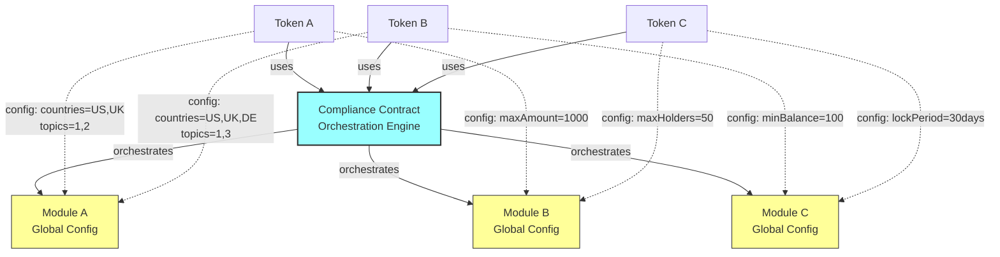
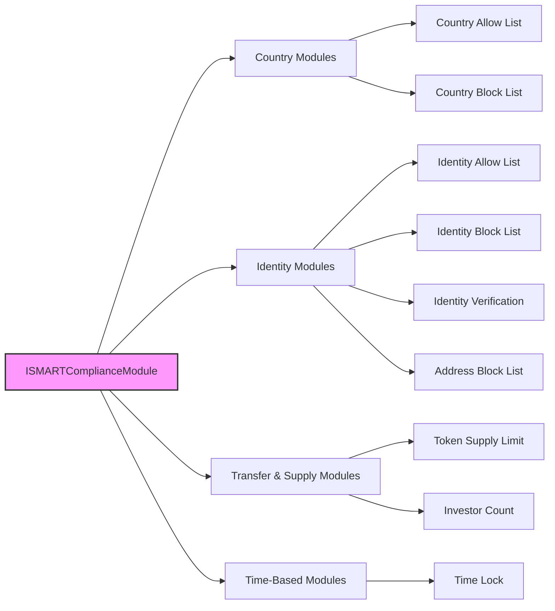

# SMART Compliance Modules

The SMART protocol provides a flexible, extensible compliance module system for regulatory compliance across different jurisdictions and use cases. Each module implements specific compliance rules that can be configured per-token while sharing global infrastructure.

## Architecture Overview



### Key Principles

- **Separation of Concerns**: Token layer defines requirements, compliance contract orchestrates, modules enforce specific rules
- **Reusability**: Single compliance contract and modules serve multiple tokens with different configurations
- **Modularity**: Each module handles one specific compliance aspect (country restrictions, investor limits, etc.)
- **Global + Token-Specific Configuration**: Modules have both global settings and per-token parameters

## Module Categories



## Available Modules

### Country-Based Restrictions

#### CountryAllowListComplianceModule
**Purpose**: Only allow investors from specific approved countries

**Use Cases**: 
- Restricted offerings for specific jurisdictions
- Regional compliance requirements
- Export control compliance

**Configuration**:
```solidity
struct CountryAllowListConfig {
    uint16[] allowedCountries; // ISO 3166-1 country codes
}
```

#### CountryBlockListComplianceModule  
**Purpose**: Block investors from specific prohibited countries

**Use Cases**:
- Sanctions compliance (OFAC, EU sanctions)
- Regulatory restrictions
- Risk management

**Configuration**:
```solidity
struct CountryBlockListConfig {
    uint16[] blockedCountries; // ISO 3166-1 country codes
}
```

### Identity-Based Restrictions

#### IdentityAllowListComplianceModule
**Purpose**: Whitelist specific identity contracts for token access

**Use Cases**:
- Private placements to specific investors
- Institutional-only offerings
- Closed investor groups

#### IdentityBlockListComplianceModule
**Purpose**: Block specific identity contracts from token access

**Use Cases**:
- Compliance violations
- Legal disputes
- Risk management

#### AddressBlockListComplianceModule
**Purpose**: Block specific wallet addresses from token transfers

**Use Cases**:
- Sanctions compliance
- Fraud prevention
- Temporary restrictions

#### SMARTIdentityVerificationComplianceModule
**Purpose**: Advanced identity verification with logical expressions

**Key Innovation**: Unlike ERC-3643's simple AND-only logic, supports complex expressions:

```typescript
// Simple requirement (like ERC-3643)
"KYC AND AML"

// Smart contracts bypass individual verification  
"CONTRACT OR (KYC AND AML)"

// Accredited investors have different requirements
"ACCREDITED OR (KYC AND AML AND JURISDICTION)"

// Complex institutional rules
"(INSTITUTION AND REGULATORY_APPROVAL) OR (INDIVIDUAL AND KYC AND AML)"
```

**Benefits**:
-  Flexible entity types (contracts, institutions, individuals)
-  Regulatory efficiency for accredited investors
-  DeFi compatibility (smart contracts without individual KYC)
-  Multi-jurisdiction support

### Transfer & Supply Modules

#### TokenSupplyLimitComplianceModule
**Purpose**: Enforce maximum token supply limits based on jurisdictional caps

**Key Features**:
- **Multiple Limit Types**: Lifetime, fixed period, or rolling period caps
- **Currency Conversion**: Support for base currency limits using on-chain price claims
- **Regulatory Compliance**: Essential for jurisdictions like MiCA (�8M limit)
- **Flexible Configuration**: Token-amount or currency-equivalent limits

**Use Cases**:
- MiCA compliance (�8M issuance limit)
- SEC Regulation CF ($5M limit)
- Private placement caps
- Crowdfunding limits

**Configuration**:
```solidity
struct SupplyLimitConfig {
    uint256 maxSupply;           // Maximum supply (logical whole numbers)
    LimitType limitType;         // LIFETIME, FIXED_PERIOD, ROLLING_PERIOD
    uint256 periodLength;        // Period length in days (for period-based limits)
    bool useBaseCurrency;        // Whether to use base currency limits
    uint256 maxBaseCurrencyValue; // Maximum value in base currency (if enabled)
    uint8 baseCurrencyDecimals;  // Decimals for base currency calculations
}

enum LimitType {
    LIFETIME,      // Total supply cap across token lifetime
    FIXED_PERIOD,  // Cap within specific fixed periods
    ROLLING_PERIOD // Cap within rolling time windows
}
```

#### InvestorCountComplianceModule  
**Purpose**: Restrict the number of unique investors who can hold tokens

**Key Features**:
- **Global and Per-Country Limits**: Track investors both globally and by jurisdiction
- **Expression Filtering**: Only count investors meeting specific compliance requirements
- **Flexible Counting**: Global across all tokens or per-token limits
- **Real-time Tracking**: Updates investor counts on transfers

**Use Cases**:
- Private placements (typically <100 investors)
- Regulation D offerings (500+ accredited investors)
- European prospectus exemptions (150 qualified investors)
- Crowdfunding investor limits

**Configuration**:
```solidity
struct InvestorCountConfig {
    uint256 maxInvestors;        // Maximum total investors (0 = no global limit)
    bool global;                 // Track globally across all issuer tokens
    uint16[] countryCodes;       // Country codes for per-country limits
    uint256[] countryLimits;     // Corresponding limits per country
    ExpressionNode[] topicFilter; // Filter which investors to count
}
```

> **⚠️ Important**: The `topicFilter` determines **which investors are COUNTED** towards limits, not which investors are **BLOCKED**. Investors who don't match the filter can still receive tokens but won't count towards the investor limits.
>
> **To block non-qualifying investors**: Use `SMARTIdentityVerificationComplianceModule` alongside this module with the same expression criteria.

### Time-Based Modules

#### TimeLockComplianceModule
**Purpose**: Enforce minimum holding periods before tokens can be transferred

**Key Features**:
- **FIFO Token Tracking**: First-in-first-out logic for multiple token batches
- **Configurable Hold Periods**: Flexible time-based restrictions
- **Exemption Support**: Identity-based exemptions via logical expressions
- **Batch Management**: Efficient tracking of acquisition timestamps

**Use Cases**:
- Regulation D lock-up periods (6-12 months)
- Insider trading restrictions
- Vesting schedules
- Market manipulation prevention
- Regulatory compliance periods

**Configuration**:
```solidity
struct TimeLockParams {
    uint256 holdPeriod;                  // Minimum holding period in seconds
    bool allowExemptions;                // Whether to allow exemptions
    ExpressionNode[] exemptionExpression; // Logical expression for exemptions
}
```

**FIFO Logic**:
- Tracks multiple token batches per user with acquisition timestamps
- Transfers always use oldest unlocked tokens first
- Preserves chronological order during batch removal
- Supports partial transfers from batches

## Module Configuration

### Global Configuration (Infrastructure)
- Module deployment and availability
- Trusted issuers registry
- Topic scheme registry  
- Shared compliance settings

### Token-Specific Configuration (Business Logic)
- Which modules to activate
- Module parameters (countries, limits, topics, etc.)
- Compliance rules specific to token type
- Business logic parameters

## Advanced Features

### Logical Expressions for Identity Verification

SMART Protocol supports complex logical expressions for identity verification, going beyond simple AND-only requirements:

**Expression Components**:
- **TOPIC nodes**: Represent required claims (KYC, AML, ACCREDITED, etc.)
- **AND nodes**: All child requirements must be met
- **OR nodes**: At least one child requirement must be met  
- **NOT nodes**: Child requirement must NOT be met

**Expression Examples**:
```typescript
// Allow contracts or verified individuals
"CONTRACT OR (KYC AND AML)"

// Different requirements for different investor types
"ACCREDITED OR (RETAIL AND KYC AND AML AND SUITABILITY)"

// Multi-jurisdiction compliance
"KYC AND (US_ACCREDITED OR EU_QUALIFIED OR UK_SOPHISTICATED)"
```

### Exemption Support

Many modules support exemption mechanisms through logical expressions:
- Identity-based exemptions for privileged users
- Temporary exemptions for specific situations
- Role-based exemptions for system operations

## Creating Custom Modules

To create a custom compliance module:

1. **Inherit from AbstractComplianceModule**:
```solidity
contract CustomComplianceModule is AbstractComplianceModule {
    // Implementation
}
```

2. **Implement Required Functions**:
```solidity
function name() external pure override returns (string memory);
function typeId() external pure override returns (bytes32);
function validateParameters(bytes calldata params) external pure override;
function canTransfer(address token, address from, address to, uint256 value, bytes calldata params) external view override;
```

3. **Optional Lifecycle Hooks**:
```solidity
function transferred(address token, address from, address to, uint256 value, bytes calldata params) external override;
function created(address token, address to, uint256 value, bytes calldata params) external override;
```

4. **Register with Compliance Contract**:
Configure the module in your token's compliance settings.

## Security Considerations

- **Access Control**: Only authorized addresses can modify module configurations
- **Parameter Validation**: All module parameters are validated before use
- **Reentrancy Protection**: Modules include appropriate guards against reentrancy attacks
- **Gas Optimization**: Efficient algorithms to minimize transaction costs
- **Upgrade Safety**: Modules designed to be upgradeable without breaking existing tokens

## Integration Examples

### Basic Country Restriction
```solidity
// Only allow US and UK investors
CountryAllowListConfig memory config = CountryAllowListConfig({
    allowedCountries: [840, 826] // US=840, UK=826 (ISO 3166-1)
});
```

### Complex Identity Verification
```solidity  
// Allow smart contracts OR individuals with KYC+AML
ExpressionNode[] memory expression = [
    ExpressionNode(ExpressionType.TOPIC, CONTRACT_TOPIC_ID),
    ExpressionNode(ExpressionType.TOPIC, KYC_TOPIC_ID),
    ExpressionNode(ExpressionType.TOPIC, AML_TOPIC_ID),
    ExpressionNode(ExpressionType.AND, 0), // KYC AND AML
    ExpressionNode(ExpressionType.OR, 0)   // CONTRACT OR (KYC AND AML)
];
```

### Time Lock with Exemptions
```solidity
// 6-month lock-up with exemptions for accredited investors
TimeLockParams memory config = TimeLockParams({
    holdPeriod: 180 days,
    allowExemptions: true,
    exemptionExpression: [
        ExpressionNode(ExpressionType.TOPIC, ACCREDITED_TOPIC_ID)
    ]
});
```

### Complete Investor Control (Identity + Count)
```solidity
// Common expression for both modules - only KYC+AML verified investors
ExpressionNode[] memory kycAmlExpression = [
    ExpressionNode(ExpressionType.TOPIC, KYC_TOPIC_ID),
    ExpressionNode(ExpressionType.TOPIC, AML_TOPIC_ID),
    ExpressionNode(ExpressionType.AND, 0) // KYC AND AML
];

// Module 1: Block non-KYC+AML investors (gate keeper)
IdentityVerificationConfig memory identityConfig = IdentityVerificationConfig({
    requiredExpression: kycAmlExpression
});

// Module 2: Count only KYC+AML investors towards 100 limit (counter)
InvestorCountConfig memory countConfig = InvestorCountConfig({
    maxInvestors: 100,
    global: false,
    countryCodes: [],
    countryLimits: [],
    topicFilter: kycAmlExpression // Same expression for consistency
});
```

**Result**: Only KYC+AML verified investors can hold tokens, and max 100 such investors allowed.

**Behavior Comparison**:

| Investor Type | Identity Module | Count Module | Final Result |
|---------------|----------------|--------------|--------------|
| **No KYC+AML** | ❌ **BLOCKED** | N/A (never reaches counting) | **❌ TRANSFER BLOCKED** |
| **Has KYC+AML, Count < 100** | ✅ **ALLOWED** | ✅ **COUNTED** | **✅ TRANSFER ALLOWED** |
| **Has KYC+AML, Count = 100** | ✅ **ALLOWED** | ❌ **BLOCKED** (over limit) | **❌ TRANSFER BLOCKED** |

## Conclusion

The SMART compliance module system provides a flexible, extensible framework for regulatory compliance across different jurisdictions and use cases. By separating concerns between token configuration, compliance orchestration, and rule enforcement, it enables efficient reuse of compliance infrastructure while maintaining the flexibility to meet diverse regulatory requirements.

For more information about specific modules, see the individual contract files or the main SMART Protocol documentation.