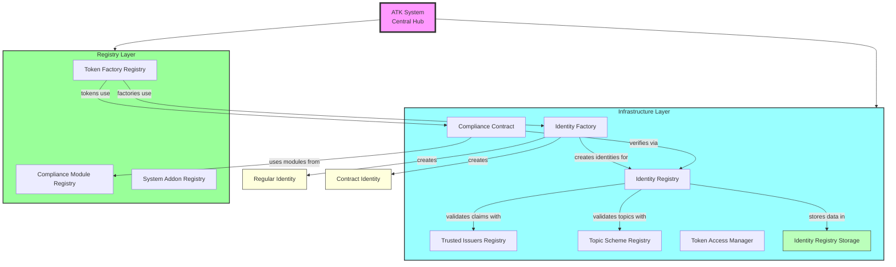
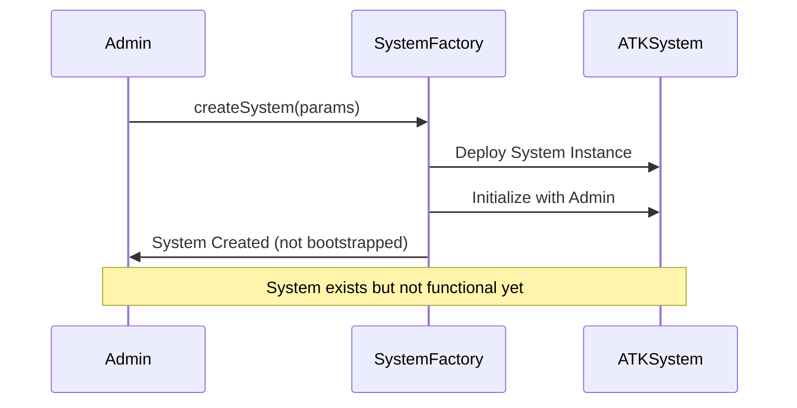
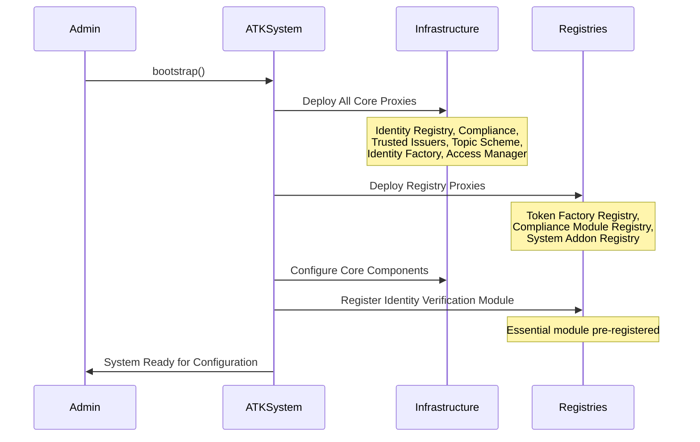
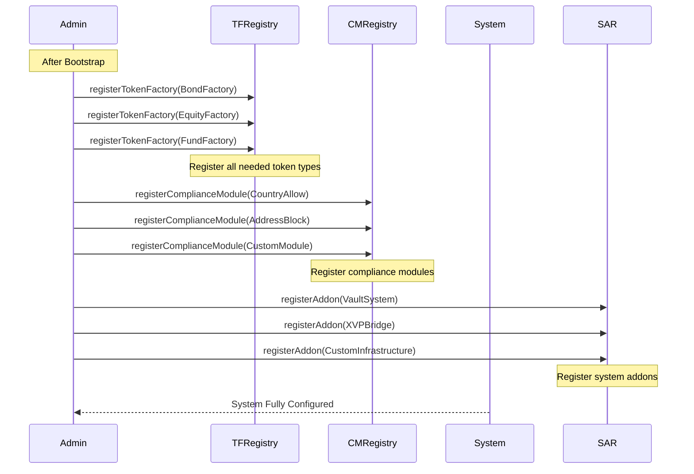
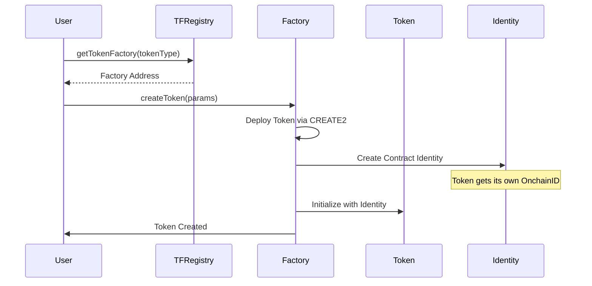
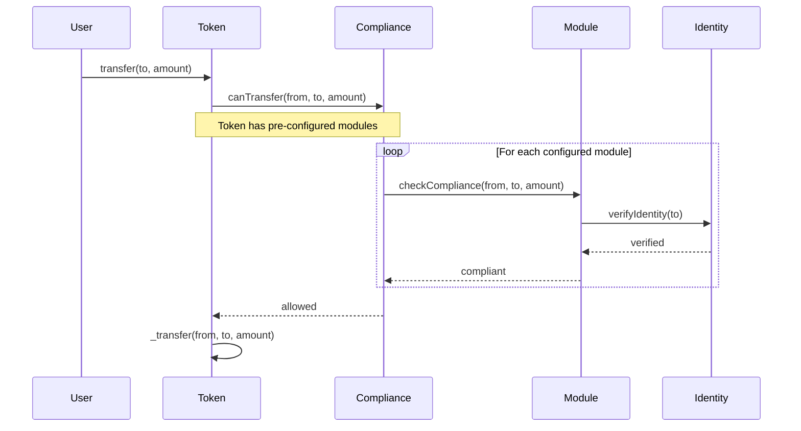

# ATK System - Asset Tokenization Kit Infrastructure

✨ [https://settlemint.com](https://settlemint.com) ✨

**The comprehensive infrastructure layer for the Asset Tokenization Kit (ATK) -
A production-ready implementation of the SMART Protocol**

## 📋 What is ATK System?

The ATK System is the infrastructure layer that implements the SMART Protocol
for production use. While **SMART** is the foundational protocol (defining the
token standards, compliance modules, and identity management), **ATK** is
SettleMint's complete implementation that adds enterprise-grade features like:

- **Centralized Management**: Single point of control for all protocol
  components
- **Role-Based Access Control**: Granular permissions for different operations
- **Factory Pattern**: Standardized token deployment across asset types
- **Upgradeable Infrastructure**: System-managed implementations for all
  components
- **Registry System**: Centralized discovery and management of modules
- **Production Security**: Battle-tested security patterns and access controls

## 🏗️ Architecture Overview

The ATK System manages the entire tokenization infrastructure through a
hierarchical architecture:



## 🎯 ATK System Core

### ATKSystem Contract

The central coordinator that manages all protocol components:

- **Bootstrap Function**: One-time setup of the entire infrastructure
- **Implementation Management**: Upgrades for all system components
- **Registry Discovery**: Single source of truth for all component addresses
- **Access Control**: Role-based security for all operations

### Key Components

1. **ATKSystemImplementation**: Main logic contract
2. **ATKSystemFactory**: Factory that creates new ATK System instances
3. **ATKSystemRoles**: Defines all access control roles
4. **ATKTopics**: Standard claim topics for identity verification
5. **ATKTypedImplementationProxy**: Proxy pattern for typed implementations

## 🏭 Infrastructure Layer

### Identity Management

#### Identity Registry (`identity-registry/`)

- **Purpose**: Maps wallet addresses to identity contracts
- **Features**: Recovery mechanisms, verification status tracking
- **Implementation**: `ATKIdentityRegistryImplementation`

#### Identity Factory (`identity-factory/`)

- **Purpose**: Creates new identity contracts for both users and contracts
- **Features**: Two types of OnchainID identities
- **Implementation**: `ATKIdentityFactoryImplementation`

##### Two Types of OnchainID Identities (`identity-factory/identities/`)

1. **Regular Identity Contract** (`ATKIdentityImplementation`)
   - For individual users and wallet addresses
   - Manages KYC/AML claims for natural persons
   - Used for investor verification and compliance

2. **Contract Identity** (`ATKTokenIdentityImplementation`)
   - For smart contracts and protocols
   - Allows contracts to have their own identity and claims
   - Essential for token contracts, protocols, or other smart contracts that
     need identity verification
   - Enables contract-to-contract compliance checks

#### Identity Storage (`identity-registry-storage/`)

- **Purpose**: Optimized storage for identity data
- **Features**: Efficient lookups, batch operations
- **Implementation**: `ATKIdentityRegistryStorageImplementation`

### Compliance System

#### Compliance Contract (`compliance/`)

- **Purpose**: Orchestrates compliance checks across all tokens
- **Features**: Modular rule execution, token-specific configuration
- **Implementation**: `ATKComplianceImplementation`

#### Compliance Module Registry (`compliance/`)

- **Purpose**: Manages available compliance modules
- **Features**: Module discovery, registration, validation
- **Implementation**: `ATKComplianceModuleRegistryImplementation`
- **Special Note**: Identity Verification Module is registered during bootstrap
  as it's essential for the system

### Trust Infrastructure

#### Trusted Issuers Registry (`trusted-issuers-registry/`)

- **Purpose**: Manages entities that can issue identity claims
- **Features**: Issuer validation, topic-specific trust
- **Implementation**: `ATKTrustedIssuersRegistryImplementation`

#### Topic Scheme Registry (`topic-scheme-registry/`)

- **Purpose**: Defines available claim topics for verification
- **Features**: Topic validation, scheme management
- **Implementation**: `ATKTopicSchemeRegistryImplementation`

### Access Management

#### Token Access Manager (`access-manager/`)

- **Purpose**: Manages permissions for individual tokens
- **Features**: Role-based access, fine-grained control
- **Implementation**: `ATKTokenAccessManagerImplementation`

## 📊 Registry Layer

### Token Factory Registry (`token-factory/`)

- **Purpose**: Manages all token factories in the system
- **Features**: Factory discovery, type-based routing
- **Implementation**: `ATKTokenFactoryRegistryImplementation`
- **Usage**: Register different token factories after bootstrap

### Compliance Module Registry (`compliance/`)

- **Purpose**: Central registry for all compliance modules
- **Features**: Module registration, discovery, and validation
- **Implementation**: `ATKComplianceModuleRegistryImplementation`
- **Usage**: Register additional compliance modules after bootstrap

### System Addon Registry (`addons/`)

- **Purpose**: Registry for non-asset system extensions and addons
- **Features**: Addon discovery, registration, and management
- **Implementation**: `ATKSystemAddonRegistryImplementation`
- **Use Cases**: Vaults, XVP (Cross-Chain Value Proposition), and other
  infrastructure components
- **Usage**: Register additional system functionality after bootstrap

## 🔐 Security & Access Control

### Role-Based Access Control

The ATK System implements a comprehensive RBAC system:

#### System-Level Roles

- **DEFAULT_ADMIN_ROLE**: Super admin with all permissions
- **IMPLEMENTATION_MANAGER_ROLE**: Can upgrade system implementations
- **REGISTRAR_ROLE**: Can register users and identities
- **DEPLOYER_ROLE**: Can deploy new tokens and contracts

#### Token-Level Roles

- **CLAIM_MANAGER_ROLE**: Manages identity claims
- **BYPASS_LIST_MANAGER_ROLE**: Manages compliance bypass lists
- **STORAGE_MODIFIER_ROLE**: Can modify identity storage
- **REGISTRY_MANAGER_ROLE**: Manages registry bindings

### Security Features

1. **Reentrancy Protection**: All state-changing functions protected
2. **Access Control**: Role-based permissions for all operations
3. **Upgrade Safety**: System-managed implementation updates with admin controls
4. **Input Validation**: Comprehensive parameter validation
5. **Event Logging**: Complete audit trail for all operations

## 🚀 System Lifecycle

### 1. System Creation Phase

The ATK System starts with the SystemFactory that creates new system instances:



### 2. Bootstrap Phase

Each created ATK System must be bootstrapped to set up the core infrastructure:



### 3. Post-Bootstrap Configuration

After bootstrap, the system is ready for use but requires configuration:



### 4. Token Creation Flow



### 5. Transfer Compliance Flow



## 🔍 Registry Usage for Discovery

The registries serve as discovery mechanisms for the entire system:

### Token Factory Discovery

```
1. Query Token Factory Registry for available token types
2. Get factory address for desired token type
3. Use factory to create new tokens
```

### Compliance Module Discovery

```
1. Query Compliance Module Registry for available modules
2. View module capabilities and requirements
3. Use discovered modules when configuring tokens during deployment
```

### System Addon Discovery

```
1. Query System Addon Registry for available addons
2. View addon capabilities and integration points
3. Use addons for extended functionality (vaults, bridges, etc.)
```

### Dynamic System Extension

```
1. Deploy new factory, module, or addon implementation
2. Register with appropriate registry
3. Immediately available for use system-wide
```

## 🛡️ Production Considerations

### Deployment Strategy

1. **Create System**: Use SystemFactory to create new system instances
2. **Bootstrap Once**: Single bootstrap call sets up entire infrastructure per
   system
3. **Register Components**: Add token factories, compliance modules, and system
   addons through registries
4. **Permission Management**: Assign roles based on operational needs
5. **Monitoring**: Track all system events for operational visibility

### Upgrade Path

The ATK System uses a centralized upgrade mechanism where all implementation
addresses are managed by the system:

1. **Implementation Updates**: ATKSystem manages all implementation upgrades
2. **Factory Registration**: Add new token types through factory registry
3. **Module Registration**: Add new compliance modules through module registry
4. **Addon Registration**: Add new system addons (vaults, bridges, etc.) through
   addon registry
5. **Rollback Capability**: System can revert to previous implementations if
   needed

All upgrades are controlled through the ATKSystem's implementation management
functions, ensuring consistent and secure updates across the entire protocol.

### Operational Security

1. **Multi-sig Admin**: Use multi-signature wallets for admin roles
2. **Time-locked Upgrades**: Implement time delays for critical changes
3. **Emergency Procedures**: Define emergency pause and recovery procedures
4. **Audit Trail**: Maintain comprehensive logs of all operations

## 📁 Directory Structure

```
system/
├── ATKSystem*.sol                          # Core system contracts
├── ATKSystemRoles.sol                      # Role definitions
├── ATKTopics.sol                          # Standard claim topics
├── access-manager/                        # Token access management
├── addons/                                # System addon registry
├── compliance/                            # Compliance orchestration
├── identity-factory/                      # Identity creation (user & contract)
│   └── identities/                        # Identity implementations
├── identity-registry/                     # Identity management
├── identity-registry-storage/             # Identity data storage
├── token-factory/                         # Token factory registry
├── topic-scheme-registry/                 # Claim topic management
└── trusted-issuers-registry/              # Trust management
```

## ✅ Conclusion

The ATK System provides a comprehensive, production-ready infrastructure for
tokenizing real-world assets. By building on the SMART Protocol foundation and
adding enterprise-grade features, it enables organizations to deploy compliant,
upgradeable, and secure tokenization solutions at scale.

The system's key differentiator is its centralized implementation management
approach - rather than each contract managing its own upgrades (like UUPS), all
implementation addresses are managed through the ATKSystem contract. This
provides:

- **Centralized Control**: Single point of upgrade management
- **Consistency**: All components upgrade through the same mechanism
- **Security**: Reduced attack surface with centralized access control
- **Auditability**: All upgrades tracked in one place

The system's modular architecture, comprehensive access controls, and
registry-based discovery model make it suitable for a wide range of asset
tokenization use cases while maintaining the flexibility to adapt to evolving
regulatory requirements.
