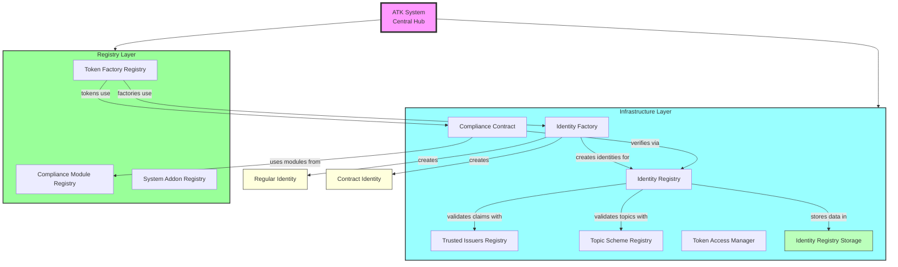
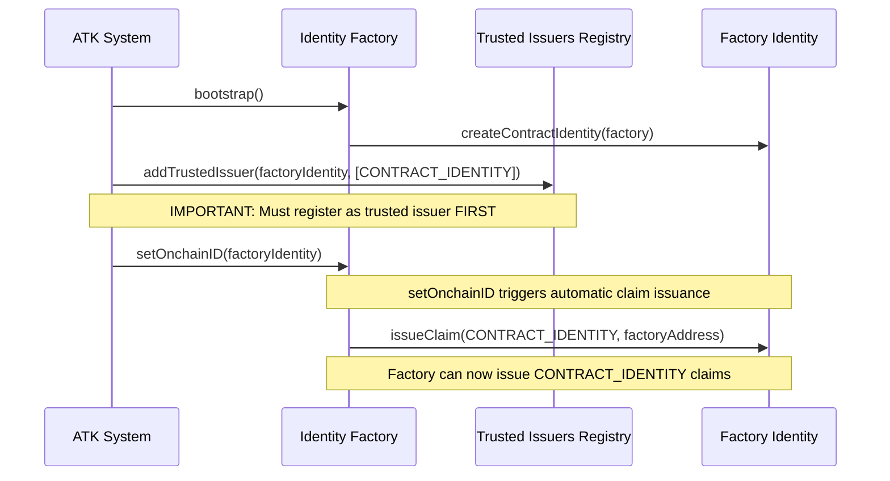
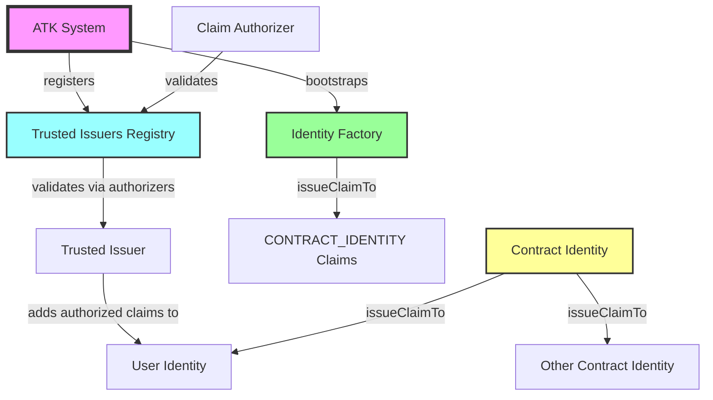
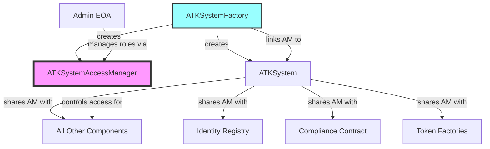
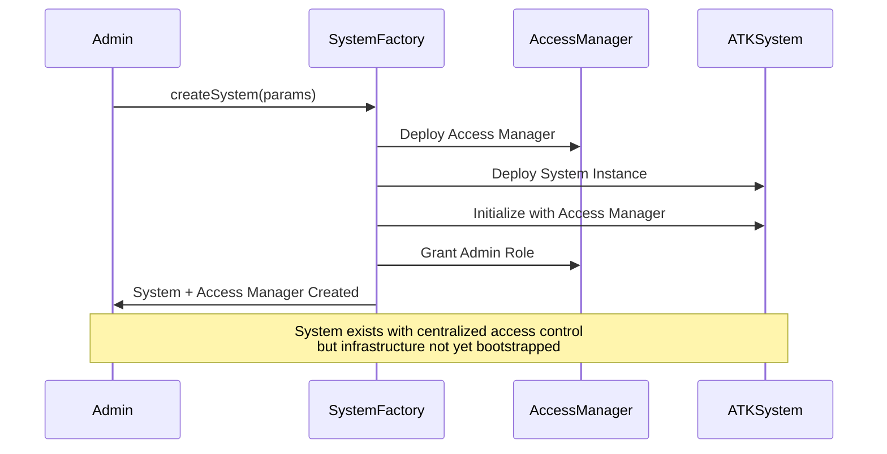
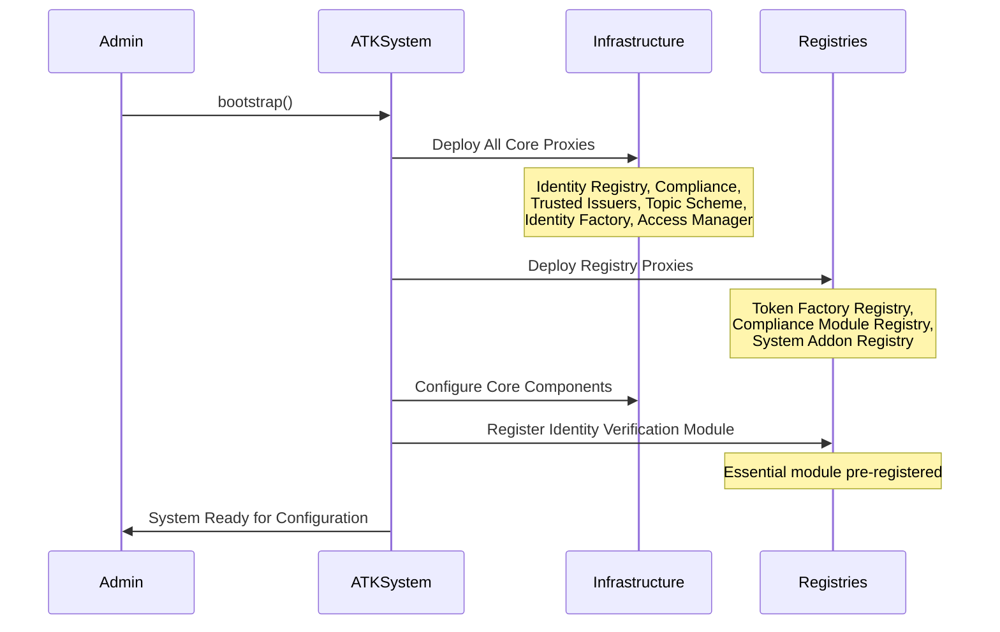
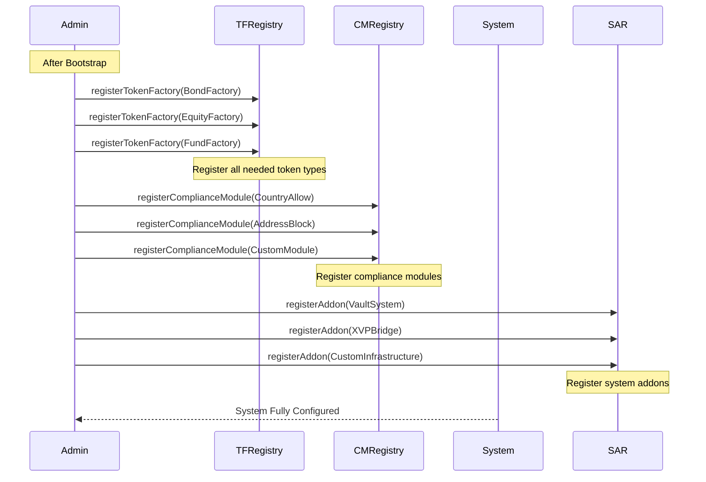
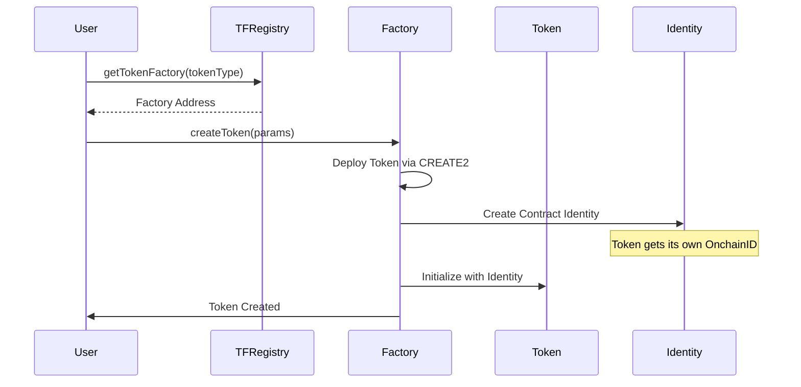
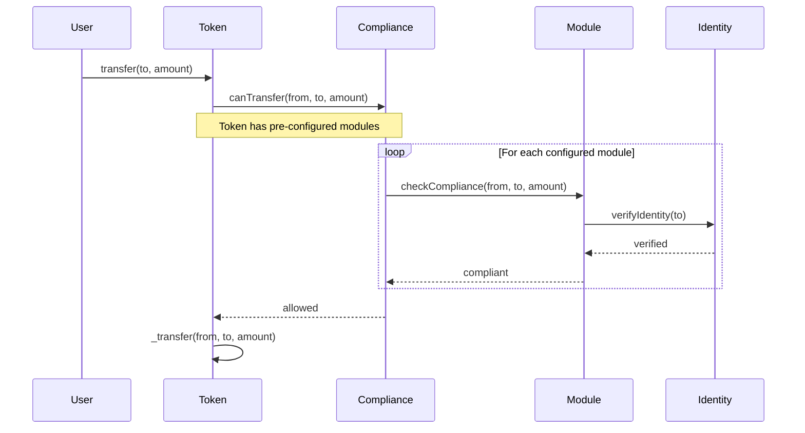

# ATK System - Asset Tokenization Kit Infrastructure

✨ [https://settlemint.com](https://settlemint.com) ✨

**The comprehensive infrastructure layer for the Asset Tokenization Kit (ATK) -
A production-ready implementation of the SMART Protocol**

## 📋 What is ATK System?

The ATK System is the infrastructure layer that implements the SMART Protocol
for production use. While **SMART** is the foundational protocol (defining the
token standards, compliance modules, and identity management), **ATK** is
SettleMint's complete implementation that adds enterprise-grade features like:

- **Centralized Management**: Single point of control for all protocol
  components
- **Role-Based Access Control**: Granular permissions for different operations
- **Factory Pattern**: Standardized token deployment across asset types
- **Upgradeable Infrastructure**: System-managed implementations for all
  components
- **Registry System**: Centralized discovery and management of modules
- **Production Security**: Battle-tested security patterns and access controls

## 🏗️ Architecture Overview

The ATK System manages the entire tokenization infrastructure through a
hierarchical architecture:



## 🎯 ATK System Core

### ATKSystem Contract

The central coordinator that manages all protocol components:

- **Bootstrap Function**: One-time setup of the entire infrastructure
- **Implementation Management**: Upgrades for all system components
- **Registry Discovery**: Single source of truth for all component addresses
- **Access Control**: Centralized role-based security for all operations

### Key Components

1. **ATKSystemImplementation**: Main logic contract
2. **ATKSystemFactory**: Factory that creates new ATK System instances with
   centralized access control
3. **ATKPeopleRoles**: Defines roles for human operators (EOAs)
4. **ATKSystemRoles**: Defines roles for system contracts and modules
5. **ATKTopics**: Standard claim topics for identity verification
6. **ATKTypedImplementationProxy**: Proxy pattern for typed implementations
7. **ATKSystemAccessManager**: Centralized access control manager created by the
   factory

## 🏭 Infrastructure Layer

### Identity Management

#### Identity Registry (`identity-registry/`)

- **Purpose**: Maps wallet addresses to identity contracts
- **Features**: Recovery mechanisms, verification status tracking
- **Implementation**: `ATKIdentityRegistryImplementation`

#### Identity Factory (`identity-factory/`)

- **Purpose**: Creates new identity contracts for both users and contracts
- **Features**: Two types of OnchainID identities
- **Implementation**: `ATKIdentityFactoryImplementation`

##### Two Types of OnchainID Identities (`identity-factory/identities/`)

1. **Regular Identity Contract** (`ATKIdentityImplementation`)
   - For individual users and wallet addresses
   - Manages KYC/AML claims for natural persons
   - Used for investor verification and compliance

2. **Contract Identity** (`ATKContractIdentityImplementation`)
   - For smart contracts and protocols
   - Allows contracts to have their own identity and claims
   - Essential for token contracts, protocols, or other smart contracts that
     need identity verification
   - Enables contract-to-contract compliance checks
   - Contract identities can issue claims directly to other identities using the
     `issueClaimTo` method

#### Identity Storage (`identity-registry-storage/`)

- **Purpose**: Optimized storage for identity data
- **Features**: Efficient lookups, batch operations
- **Implementation**: `ATKIdentityRegistryStorageImplementation`

### Compliance System

#### Compliance Contract (`compliance/`)

- **Purpose**: Orchestrates compliance checks across all tokens
- **Features**: Modular rule execution, token-specific configuration
- **Implementation**: `ATKComplianceImplementation`

#### Compliance Module Registry (`compliance/`)

- **Purpose**: Manages available compliance modules
- **Features**: Module discovery, registration, validation
- **Implementation**: `ATKComplianceModuleRegistryImplementation`
- **Special Note**: Identity Verification Module is registered during bootstrap
  as it's essential for the system

### Trust Infrastructure

#### Trusted Issuers Registry (`trusted-issuers-registry/`)

- **Purpose**: Manages entities that can issue identity claims
- **Features**: Issuer validation, topic-specific trust
- **Implementation**: `ATKSystemTrustedIssuersRegistryImplementation`
- **Capability**: Trusted issuers can directly add claims to identities through
  the claim authorization system, which validates their permissions

#### Topic Scheme Registry (`topic-scheme-registry/`)

- **Purpose**: Defines available claim topics for verification
- **Features**: Topic validation, scheme management
- **Implementation**: `ATKTopicSchemeRegistryImplementation`

### Claim Authorization System

#### Overview

The ATK System includes a sophisticated claim issuance system that enables both
contract identities and trusted issuers to add claims to identities through
different mechanisms, maintaining security and trust.

#### Key Components

1. **Contract Identity Claims**: Contract identities can issue claims directly
   to other identities using the `issueClaimTo` method
2. **Trusted Issuer Authorization**: Claim authorizers control which trusted
   issuers can add claims to specific identities
3. **Bootstrap Claim Issuance**: System automatically issues initial claims
   during bootstrap (e.g., CONTRACT_IDENTITY claims)

#### How It Works

##### 1. Two Claim Issuance Mechanisms

**A. Contract Identity Direct Issuance**

Contract identities can issue claims directly to other identities:

```solidity
// Contract identity issuing a claim
IATKContractIdentity contractIdentity = IATKContractIdentity(contractOnchainID);
IIdentity targetIdentity = IIdentity(userIdentity);

contractIdentity.issueClaimTo(
    targetIdentity,
    topicId,
    abi.encode(claimData),
    "https://proof-uri.com"
);
```

**B. Trusted Issuer Authorization via Claim Authorizers**

Claim authorizers control which trusted issuers can add claims to identities.
Contracts implementing `IContractWithIdentity` can authorize claim operations:

```solidity
interface IContractWithIdentity {
    function onchainID() external view returns (address);
    function canAddClaim(address caller) external view returns (bool);
    function canRemoveClaim(address caller) external view returns (bool);
}
```

##### 2. Bootstrap Claim Issuance

During system bootstrap, the Identity Factory automatically:

1. **Creates its own identity**: The factory gets a contract identity
2. **Registers as trusted issuer**: Factory identity is registered for
   CONTRACT_IDENTITY claims
3. **Issues self-claim**: Factory issues a CONTRACT_IDENTITY claim to itself
4. **Issues claims to new contracts**: When creating contract identities, the
   factory automatically issues CONTRACT_IDENTITY claims



##### 3. Trusted Issuer Claim Addition via Authorization

Trusted issuers add claims directly to identity contracts. The identity
validates the issuer's authorization by checking with registered claim
authorizers (like the trusted issuers registry):

```solidity
// Example: Trusted issuer adding a claim directly to an identity
// The identity will check with its registered authorizers (including TrustedIssuersRegistry)
IIdentity targetIdentity = IIdentity(userIdentityAddress);

targetIdentity.addClaim(
    kycTopicId,                    // uint256 topic
    ERC735ClaimSchemes.ECDSA,      // uint256 scheme
    issuerAddress,                 // address issuer
    signature,                     // bytes signature
    abi.encode(kycData),          // bytes data
    "https://kyc-provider.com/proof" // string uri
);

// The identity automatically checks:
// 1. Is the issuer registered in TrustedIssuersRegistry?
// 2. Is the issuer authorized for this claim topic?
// 3. If yes, the claim is added; if no, the transaction reverts
```

##### 4. Automatic CONTRACT_IDENTITY Claims

When the Identity Factory creates a new contract identity:

1. **Creates the identity**: Deploys proxy pointing to contract identity
   implementation
2. **Checks factory authorization**: Verifies factory has onchainID set
3. **Issues claim automatically**: Factory uses `issueClaimTo` to add a
   CONTRACT_IDENTITY claim containing the contract address
4. **Emits event**: Logs the contract identity creation with claim

#### Security Model

##### Authorization Hierarchy

1. **System Level**: ATK System can manage all components
2. **Factory Level**: Identity Factory can issue CONTRACT_IDENTITY claims
   directly using `issueClaimTo`
3. **Trusted Issuer Level**: Registered trusted issuers can add claims through
   the authorization system (validated by claim authorizers)
4. **Contract Level**: Contract identities can issue claims directly to other
   identities using `issueClaimTo`

##### Trust Chain



#### Benefits

1. **Automated Compliance**: Claims can be issued automatically based on
   contract logic
2. **Reduced Manual Work**: No need for manual claim issuance processes
3. **Trust Preservation**: Only authorized entities can issue claims
4. **Audit Trail**: All claim operations are logged and traceable
5. **Scalability**: System can handle high-volume claim issuance

### Access Management

#### Token Access Manager (`access-manager/`)

- **Purpose**: Manages permissions for individual tokens
- **Features**: Role-based access, fine-grained control
- **Implementation**: `ATKTokenAccessManagerImplementation`

## 📊 Registry Layer

### Token Factory Registry (`token-factory/`)

- **Purpose**: Manages all token factories in the system
- **Features**: Factory discovery, type-based routing
- **Implementation**: `ATKTokenFactoryRegistryImplementation`
- **Usage**: Register different token factories after bootstrap

### Compliance Module Registry (`compliance/`)

- **Purpose**: Central registry for all compliance modules
- **Features**: Module registration, discovery, and validation
- **Implementation**: `ATKComplianceModuleRegistryImplementation`
- **Usage**: Register additional compliance modules after bootstrap

### System Addon Registry (`addons/`)

- **Purpose**: Registry for non-asset system extensions and addons
- **Features**: Addon discovery, registration, and management
- **Implementation**: `ATKSystemAddonRegistryImplementation`
- **Use Cases**: Vaults, XVP (Cross-Chain Value Proposition), and other
  infrastructure components
- **Usage**: Register additional system functionality after bootstrap

## 🔐 Security & Access Control

### Centralized Access Control Architecture

The ATK System implements a **centralized access control** model where a single
`ATKSystemAccessManager` is created by the `ATKSystemFactory` and shared across
all system components. This replaces the previous per-contract access control
approach.

#### Key Benefits of Centralization

1. **Single Point of Authority**: All role assignments managed in one place
2. **Consistent Permissions**: Same roles work across all system components
3. **Simplified Management**: No need to manage roles on individual contracts
4. **Enhanced Security**: Reduced attack surface with centralized control
5. **Audit Trail**: All permission changes tracked in one contract

### Role Categories

The system separates roles into two distinct categories:

#### 1. People Roles (ATKPeopleRoles)

These roles are assigned to human operators (EOAs) who manage and operate the
system:

- **SYSTEM_MANAGER_ROLE**: Bootstrap system, manage upgrades, register
  factories/modules
- **IDENTITY_MANAGER_ROLE**: Register and recover identities, manage user
  onboarding
- **TOKEN_MANAGER_ROLE**: Deploy and configure tokens
- **COMPLIANCE_MANAGER_ROLE**: Register compliance modules, configure bypass
  lists
- **ADDON_MANAGER_ROLE**: Manage system addons and extensions
- **CLAIM_POLICY_MANAGER_ROLE**: Manage trusted issuers and claim topics
- **AUDITOR_ROLE**: View-only access for compliance and monitoring

#### 2. System Roles (ATKSystemRoles)

These roles are assigned to smart contracts for automated operations:

- **SYSTEM_MODULE_ROLE**: Core system modules that manage infrastructure
- **IDENTITY_REGISTRY_MODULE_ROLE**: Identity registry contract permissions
- **TOKEN_FACTORY_REGISTRY_MODULE_ROLE**: Token factory registry permissions
- **TOKEN_FACTORY_MODULE_ROLE**: Individual token factory permissions
- **ADDON_FACTORY_REGISTRY_MODULE_ROLE**: Addon registry permissions
- **ADDON_FACTORY_MODULE_ROLE**: Individual addon factory permissions

### Access Control Flow



### Security Features

1. **Centralized Access Control**: Single access manager for entire system
2. **Role Separation**: Clear distinction between human and system roles
3. **Reentrancy Protection**: All state-changing functions protected
4. **Upgrade Safety**: System-managed implementation updates with admin controls
5. **Input Validation**: Comprehensive parameter validation
6. **Event Logging**: Complete audit trail for all operations
7. **Batch Operations**: Efficient role management with batch grant/revoke

## 🚀 System Lifecycle

### 1. System Creation Phase

The ATK System starts with the SystemFactory that creates new system instances:



### 2. Bootstrap Phase

Each created ATK System must be bootstrapped to set up the core infrastructure:



### 3. Post-Bootstrap Configuration

After bootstrap, the system is ready for use but requires configuration:



### 4. Token Creation Flow



### 5. Transfer Compliance Flow



## 🔍 Registry Usage for Discovery

The registries serve as discovery mechanisms for the entire system:

### Token Factory Discovery

```
1. Query Token Factory Registry for available token types
2. Get factory address for desired token type
3. Use factory to create new tokens
```

### Compliance Module Discovery

```
1. Query Compliance Module Registry for available modules
2. View module capabilities and requirements
3. Use discovered modules when configuring tokens during deployment
```

### System Addon Discovery

```
1. Query System Addon Registry for available addons
2. View addon capabilities and integration points
3. Use addons for extended functionality (vaults, bridges, etc.)
```

### Dynamic System Extension

```
1. Deploy new factory, module, or addon implementation
2. Register with appropriate registry
3. Immediately available for use system-wide
```

## 🛡️ Production Considerations

### Deployment Strategy

1. **Create System**: Use SystemFactory to create new system instances
2. **Bootstrap Once**: Single bootstrap call sets up entire infrastructure per
   system
3. **Register Components**: Add token factories, compliance modules, and system
   addons through registries
4. **Permission Management**: Assign roles based on operational needs
5. **Monitoring**: Track all system events for operational visibility

### Upgrade Path

The ATK System uses a centralized upgrade mechanism where all implementation
addresses are managed by the system:

1. **Implementation Updates**: ATKSystem manages all implementation upgrades
2. **Factory Registration**: Add new token types through factory registry
3. **Module Registration**: Add new compliance modules through module registry
4. **Addon Registration**: Add new system addons (vaults, bridges, etc.) through
   addon registry
5. **Rollback Capability**: System can revert to previous implementations if
   needed

All upgrades are controlled through the ATKSystem's implementation management
functions, ensuring consistent and secure updates across the entire protocol.

### Operational Security

1. **Multi-sig Admin**: Use multi-signature wallets for admin roles
2. **Time-locked Upgrades**: Implement time delays for critical changes
3. **Emergency Procedures**: Define emergency pause and recovery procedures
4. **Audit Trail**: Maintain comprehensive logs of all operations

## 📁 Directory Structure

```
system/
├── ATKSystem*.sol                          # Core system contracts
├── ATKPeopleRoles.sol                     # Human operator role definitions
├── ATKSystemRoles.sol                     # System contract role definitions
├── ATKTopics.sol                          # Standard claim topics
├── access-manager/                        # Token access management
├── addons/                                # System addon registry
├── compliance/                            # Compliance orchestration
├── identity-factory/                      # Identity creation (user & contract)
│   └── identities/                        # Identity implementations
├── identity-registry/                     # Identity management
├── identity-registry-storage/             # Identity data storage
├── token-factory/                         # Token factory registry
├── topic-scheme-registry/                 # Claim topic management
└── trusted-issuers-registry/              # Trust management
```

## 🔑 Centralized Access Control Details

### How It Works

1. **Factory Creates Access Manager**: When `ATKSystemFactory.createSystem()` is
   called, it first deploys a dedicated `ATKSystemAccessManager` instance

2. **System Components Use Shared Access Manager**: All system components
   (Identity Registry, Compliance, Token Factories, etc.) receive a reference to
   this single access manager during initialization

3. **Role Checks**: Components inherit from `ATKSystemAccessManaged` which
   provides modifiers like:
   - `onlyRole(bytes32 role)`: Requires specific role
   - `onlyRoles(bytes32[] roles)`: Requires any of the specified roles
   - `onlyAllRoles(bytes32[] roles)`: Requires all specified roles

4. **Unified Management**: Administrators manage all permissions through the
   central access manager's functions:
   - `grantRole(bytes32 role, address account)`
   - `revokeRole(bytes32 role, address account)`
   - `batchGrantRole(bytes32 role, address[] accounts)`
   - `grantMultipleRoles(address account, bytes32[] roles)`

## ✅ Conclusion

The ATK System provides a comprehensive, production-ready infrastructure for
tokenizing real-world assets. By building on the SMART Protocol foundation and
adding enterprise-grade features, it enables organizations to deploy compliant,
upgradeable, and secure tokenization solutions at scale.

The system's key differentiator is its centralized implementation management
approach - rather than each contract managing its own upgrades (like UUPS), all
implementation addresses are managed through the ATKSystem contract. This
provides:

- **Centralized Control**: Single point of upgrade management
- **Consistency**: All components upgrade through the same mechanism
- **Security**: Reduced attack surface with centralized access control
- **Auditability**: All upgrades tracked in one place

The system's modular architecture, comprehensive access controls, and
registry-based discovery model make it suitable for a wide range of asset
tokenization use cases while maintaining the flexibility to adapt to evolving
regulatory requirements.
