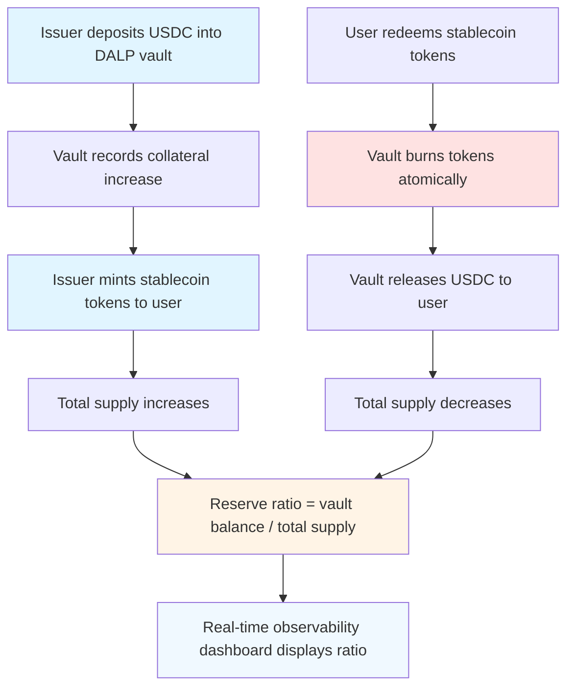
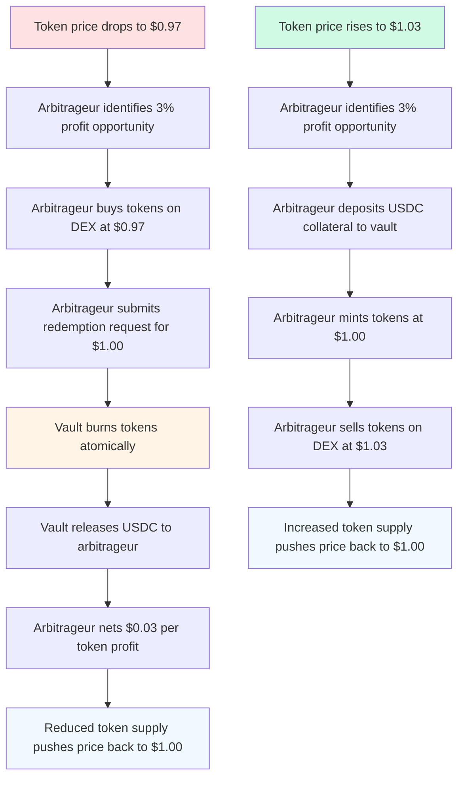

**Who should read this:** Payment service providers, money transmitters,
financial institutions issuing fiat-backed digital currencies, and treasury
teams managing stablecoin reserves.

**Time required:** 25-30 minutes for deployment; additional setup time for
reserve attestation, banking integration, and regulatory compliance workflows.

**Prerequisites:**

- Completed [Getting started](/docs/user-guides/getting-started) onboarding
- Stablecoin system factory deployed during initial setup
- Banking relationships established for fiat custody or partnerships with
  regulated stablecoin issuers (Circle, Paxos, etc.)
- Regulatory framework determined: e-money license (EMD2/MiCA in EU), money
  transmitter licenses (US states), or Payment Services Directive compliance
- Independent auditor or attestation service contracted for reserve verification

## Understanding stablecoin economics

Stablecoins solve a fundamental problem in digital asset markets: price
volatility. While Bitcoin and Ethereum fluctuate dramatically, stablecoins
maintain a consistent value pegged to traditional currencies like USD, EUR, or
GBP. This price stability makes them practical for payments, treasury
management, and cross-border settlement.

**How the peg works:** A USD stablecoin aims to trade at exactly $1.00. When
market price drifts above $1.02, arbitrageurs mint new tokens at par and sell
them at market price, pocketing the spread while increasing supply and pushing
price down. When price drops below $0.98, arbitrageurs buy cheap tokens and
redeem them at par, reducing supply and restoring the peg. This arbitrage
mechanism only functions when minting and redemption are instant, liquid, and
trustworthy—all enforced programmatically in DALP's vault architecture.

### Collateral models: fiat-backed vs algorithmic

**Fiat-backed stablecoins** (USDC, USDT, EURC) hold $1 of cash or cash
equivalents in reserve for every token in circulation. Tether holds commercial
paper and treasury bills; Circle holds only cash and short-term US treasuries.
This 1:1 backing provides strong price stability and regulatory clarity, but
requires banking relationships, custodians, and periodic attestations.
Fiat-backed models dominate the market because regulators understand them—they
operate like digital bank notes.

**Algorithmic stablecoins** (historical examples: Terra UST, Basis) attempt to
maintain pegs through smart contract mechanisms without collateral backing.
These designs collapsed catastrophically in 2022 when market confidence broke,
triggering death spirals where falling prices caused more selling. Regulators
globally now treat pure algorithmic stablecoins with extreme skepticism. Some
hybrid models (DAI) use overcollateralization with crypto assets instead of
fiat—providing censorship resistance at the cost of capital efficiency.

**Economic tradeoff:** Fiat backing requires operational overhead (banking,
attestations, custody) but delivers regulatory acceptance and user trust.
Algorithmic designs promise capital efficiency but carry existential risk. For
institutional use cases, fiat backing remains the only viable path.

### Regulatory landscape: MiCA, e-money, and global frameworks

**Markets in Crypto-Assets Regulation (MiCA)** took effect in the EU in 2024,
establishing the first comprehensive stablecoin regulatory framework. MiCA
classifies stablecoins as "e-money tokens" (EMTs) when pegged 1:1 to a single
fiat currency, requiring issuers to hold e-money licenses and maintain 100%
reserves in segregated accounts. Significant EMTs (over €5M daily transactions
or 1M holders) face additional capital requirements, governance standards, and
daily reserve reporting to regulators. MiCA's transparency mandates require
public disclosure of reserve composition, redemption rights, and issuer
governance—setting a global standard that other jurisdictions are adopting.

**United States** takes a state-by-state approach through money transmitter
licensing. Circle obtained licenses in all 50 states to issue USDC; new issuers
face 2-3 years of regulatory applications and millions in compliance costs.
Federal legislation (stablecoin bills in Congress) aims to create a unified
framework, likely requiring federally chartered institutions or state-regulated
entities with Federal Reserve supervision. The SEC treats some stablecoins as
securities if they pay interest; the CFTC claims jurisdiction over stablecoins
used in derivatives. This fragmentation creates operational complexity.

**Global convergence:** Singapore (MAS Payment Services Act), UK (FCA e-money
rules), Japan (Payment Services Act amendments), and other jurisdictions
increasingly require stablecoin issuers to hold reserves with local banks,
maintain capital buffers, and provide monthly attestations. The common thread:
regulators want proof that every token has real-world backing.

## DALP vault architecture: transparent reserves on-chain

Traditional stablecoins like USDC maintain reserves in bank accounts managed by
custodians. Users trust Circle's monthly attestations from Grant Thornton, but
cannot verify reserves in real-time. This opacity creates systemic risk—Tether
faced years of controversy over whether reserves actually existed.

**DALP's vault architecture** changes this model fundamentally. Reserve
collateral lives in smart contract vaults with transparent, on-chain accounting.
When you mint 1,000 PUSD tokens, the vault records exactly which USDC tokens
back them. When users redeem tokens, the vault burns them atomically and
releases collateral. Observers can verify reserve ratios at any block—no waiting
for monthly auditor reports.

**Custody differentiator:** Instead of trusting Circle's bank accounts, users
trust Ethereum's execution layer. The vault contract is non-upgradeable and
permissionless for reads—anyone can audit reserves. This transparency satisfies
MiCA's reserve disclosure requirements automatically and enables algorithmic
arbitrage that keeps the peg tight.

## Reserve management with observability integration

The **Reserves** dashboard provides real-time visibility into collateral health.
Treasury operators monitor:

- **Collateralization ratio** (vault balance ÷ total supply × 100%) — Must stay
  above 100% or minting pauses automatically
- **Reserve composition** — Breakdown by asset type (USDC, USDT, tokenized
  treasuries) with allocation percentages
- **Excess reserves** — Buffer above minimum backing, providing redemption
  liquidity and operational flexibility
- **Reserve ratio history** — 30-day trend chart showing lowest/highest ratios
  and alert thresholds

When ratio drops below 102%, the system displays a yellow warning. Below 100%, a
red alert appears and minting freezes. Below your configured circuit breaker
threshold (typically 95%), redemptions pause automatically to protect remaining
holders. This programmatic risk management replaces manual reconciliation cycles
that introduce human error.

**Observability advantage:** Traditional stablecoin issuers reconcile reserves
weekly or monthly, aggregating bank statements, custodian reports, and internal
ledgers. This delayed visibility means management learns about reserve
shortfalls days after they occur. DALP's vault architecture provides
block-by-block reserve tracking, triggering alerts within seconds of ratio
breaches.

<Callout type="info" title="Business context">
  USDC publishes reserve attestations monthly through Grant Thornton LLP,
  verifying that reserves match circulating supply. This attestation costs
  Circle approximately $50,000-100,000 per month and requires 2-3 weeks of data
  collection, auditor review, and report publication. DALP's vault transparency
  enables continuous attestation—any observer can verify reserves at any moment
  by querying the blockchain. This eliminates attestation costs and provides
  users with instant confidence during market stress.
</Callout>

### Proof-of-reserves with cryptographic verification

The vault contract exposes a `getReserveProof()` function that returns Merkle
proofs demonstrating reserve backing without revealing individual user balances.
External verifiers can validate that:

1. Total supply matches the sum of all user balances (no hidden inflation)
2. Vault collateral balance exceeds or equals total supply
3. No double-counting of reserves across multiple token contracts

This cryptographic auditability satisfies MiCA's requirement for "robust and
reliable verification mechanisms" and provides users with mathematical certainty
instead of auditor opinions.

<Steps>

<Step>

## Step 1: Navigate to stablecoin creation

From the main dashboard, select **Asset Management** in the left sidebar, then
choose **Stablecoins** from the asset type list. Click **Create New Stablecoin**
to begin configuration.

The stablecoin wizard guides you through economic parameters, reserve settings,
compliance frameworks, and operational roles specific to maintaining a price
peg.

 _Asset
Management section showing existing stablecoins with circulating supply, reserve
ratios, and peg status indicators_

</Step>

<Step>

## Step 2: Configure token economics

### Basic token information

Enter the token's identifying information:

- **Token name** — Full legal name matching regulatory filings (e.g., "Platform
  USD Stablecoin")
- **Token symbol** — Trading symbol indicating currency (e.g., "PUSD" for
  USD-pegged, "PEUR" for EUR-pegged)
- **Decimals** — Token divisibility, typically 6 decimals (cent-level precision
  like USDC) or 18 decimals (full EVM precision like DAI)
- **Initial supply** — Number of tokens to mint at deployment, typically 0 for
  stablecoins (mint only after reserve funding)

**Naming conventions:** Include currency designation in the symbol to clarify
peg target. "PUSD" immediately signals USD backing, while "PST" (Platform Stable
Token) creates ambiguity. Clear naming reduces user confusion during market
volatility.

**Decimals choice:** Six decimals matches traditional finance (cents) and
reduces gas costs for transfers. Eighteen decimals provides maximum DeFi
composability—most AMMs and lending protocols expect 18-decimal tokens. Choose
based on your primary use case: payments favor 6, DeFi integration favors 18.

 _Basic token
information fields with real-time validation showing symbol availability and
decimal precision implications_

### Peg parameters

Define the currency relationship:

**Peg currency** — Select the fiat currency your token tracks: USD (most
common), EUR, GBP, JPY, CHF, or custom. This determines price targets for
monitoring and redemption calculations.

**Peg ratio** — Specify the token-to-fiat exchange rate. Standard 1:1 peg means
1 token = 1 unit of fiat currency (1 PUSD = $1.00 USD). Custom ratios (100:1,
1000:1) are rare but exist for legacy currency conversions or fractional cent
precision.

**Peg tolerance** — Set acceptable deviation before triggering alerts. A 2%
tolerance means prices between $0.98-$1.02 are normal; deviations beyond this
range trigger arbitrage recommendations. Tighter tolerances (0.5%) signal strong
peg commitment but require active reserve management.

### Collateralization model

**Reserve ratio** determines backing strength. Enter 100 for 100% backing (every
token backed by $1 of reserves), or higher for overcollateralization (105 means
$1.05 backing per token). MiCA and most e-money regulations require minimum 100%
reserves. Overcollateralization provides operational buffers for:

- Settlement timing mismatches (wire transfers take 1-2 days, but tokens redeem
  instantly)
- Market maker liquidity (keeping tokens available for arbitrageurs without
  depleting reserves)
- Collateral valuation fluctuations (if you hold treasury bills worth $1M today,
  they might be worth $995K tomorrow)

Circle maintains approximately 100% reserves in cash and treasuries. Tether
historically claimed 100% but faced scrutiny over commercial paper valuations.
Your ratio choice signals risk philosophy to users and regulators.

 _Peg
currency selector, ratio input, and collateralization ratio with visual
indicator showing minimum regulatory requirements_

</Step>

<Step>

## Step 3: Configure reserve management

### Reserve wallet configuration

**Reserve wallet address** — Enter the Ethereum address holding collateral
assets. This wallet must contain USDC, USDT, or other approved stablecoins equal
to or exceeding your initial token supply. The system monitors this address
continuously, calculating reserve ratios in real-time.

For diversification, add multiple reserve wallets. If you hold $5M USDC at Bank
A's custodian and $5M in tokenized treasuries at Institution B, configure both
addresses. The vault aggregates balances across all reserve sources.

**Collateral composition** defines which assets count as reserves:

- **Fiat-backed stablecoins** (USDC, USDT, EURC) — Direct 1:1 equivalents with
  no haircut if matching your peg currency
- **Tokenized treasury bills** (Backed Finance TBIIL, Ondo OUSG) — Considered
  cash equivalents, typically 1-2% haircut for interest rate risk
- **Tokenized money market funds** — Similar to treasuries but with management
  fees, 2-5% haircut
- **Off-chain bank deposits** — Tracked through oracle attestations, requires
  independent auditor verification

For each collateral type:

- **Asset address** (ERC-20 contract) for on-chain assets
- **Haircut percentage** — Discount factor for risk management (5% haircut means
  $100 of asset counts as $95 of reserves)
- **Maximum allocation** — Concentration limits preventing over-reliance on
  single asset (e.g., max 40% USDT, max 30% treasuries)

 _Reserve
wallet management showing multiple custody addresses, collateral asset
allocation table with current holdings, haircuts, and allocation percentages_

<Callout type="info" title="Business context">
  Tether's reserve controversy stemmed from unclear collateral composition. In
  2019, disclosures revealed only 74% cash backing, with the remainder in loans
  to affiliated entities and commercial paper of unknown credit quality. Users
  lost confidence, causing temporary depegging to $0.92. MiCA's transparency
  requirements mandate daily disclosure of reserve composition precisely to
  prevent such opacity. DALP's on-chain vault accounting makes composition
  visible in real-time—users don't wait for quarterly reports to verify backing.
</Callout>

### Observability dashboard integration

Once configured, the **Reserve Health** dashboard tracks:

- **Total reserves** — Aggregated value across all custody addresses and
  collateral types
- **Weighted reserve value** — After applying haircuts (e.g., $10M holdings with
  2% average haircut = $9.8M reserve value)
- **Collateralization ratio** — (Weighted reserves ÷ circulating supply) × 100%
- **30-day minimum ratio** — Lowest point reached in past month, showing stress
  test resilience
- **Reserve composition pie chart** — Visual allocation breakdown

Alert thresholds trigger notifications:

- **Green zone (105%+)** — Healthy buffer, minting enabled without restrictions
- **Yellow zone (100-105%)** — Acceptable but monitor closely, consider adding
  reserves
- **Red zone (100% or below)** — Minting paused automatically, prioritize
  reserve additions
- **Circuit breaker (below configured threshold)** — Redemptions pause,
  emergency protocols activate

</Step>

<Step>

## Step 4: Configure minting and redemption mechanics

### Issuance (minting) workflow

**Permissioned minting** ensures only authorized treasury operators create new
tokens. Toggle this to **Enabled** and configure:

**Proof of reserve required** — When enabled, each mint transaction must include
a `collateralReference` field (transaction hash or bank wire reference) proving
reserves increased correspondingly. This creates an immutable audit trail
linking every token to specific reserve deposits.

**Minimum issuance** — Set floor amount for minting (e.g., $10,000 equivalent).
This reduces operational overhead—processing 100 × $1,000 requests costs more in
compliance review and gas fees than 10 × $10,000 requests. Most institutional
stablecoin issuers set minimums between $10,000-100,000.

**Issuance fee** — Basis points charged on minting (e.g., 10 bps = 0.1%). Circle
charges nothing for USDC minting but captures spread through interest on
reserves. Fee revenue helps offset attestation costs and infrastructure
overhead.

**Daily mint cap** — Maximum supply expansion per 24-hour period, preventing
sudden reserve strain. If you hold $50M reserves and set a $5M daily cap,
reserves can't drop below 90% overnight from rapid issuance.

 _Minting settings
showing authorization requirements, proof of reserve toggle, minimum amount, fee
structure, and daily caps with current utilization_

**Authorized issuers** — Add wallet addresses permitted to execute minting. Each
issuer receives a `SUPPLY_MANAGEMENT_ROLE` grant. Configure per-issuer limits:

- **Daily mint cap** — Individual issuer's 24-hour ceiling
- **Single transaction maximum** — Prevents accidental over-minting from human
  error (treasury operator types $10M instead of $1M)

Only authorized issuers can mint tokens. Redemption (burning) is typically
permissionless—any token holder can redeem for reserves, aligning with MiCA's
requirement that users have unconditional redemption rights at par.

### Redemption (burning) workflow

**Redemption enabled** — Toggle to control whether users can burn tokens for
fiat/collateral. Disabling redemptions breaks the arbitrage mechanism that
maintains the peg, so this setting should only be used during emergency circuit
breaker activations.

**Minimum redemption** — Floor amount for redemptions (e.g., $1,000). Small
redemptions create operational burden—processing a $50 redemption requires the
same KYC checks, wire fees, and accounting as a $50,000 redemption. Setting
minimums makes operational costs predictable.

**Redemption fee** — Basis points charged on burning. Circle charges zero for
USDC redemptions above minimum thresholds. Some issuers charge 10-25 bps to
cover wire fees and operational overhead. High redemption fees weaken arbitrage
incentives and can cause persistent depegging.

**Settlement time** — When users redeem tokens, how quickly do they receive
fiat?

- **T+0 (same-day)** — Instant settlement for collateral-based redemptions (burn
  tokens, receive USDC immediately). Requires vault holding liquid on-chain
  stablecoins.
- **T+1 (next business day)** — Standard for domestic wire transfers. Treasury
  receives redemption request today, initiates wire, user receives fiat
  tomorrow.
- **T+2 (two business days)** — International wires or ACH transfers.

Faster settlement strengthens peg maintenance—if redemptions take three days,
arbitrageurs avoid them, allowing price to drift further below peg.

**Business hours only** — Restrict redemption processing to business days/hours
(e.g., weekdays 9am-5pm ET). This prevents weekend redemption backlogs but
weakens 24/7 arbitrage.

**Daily redemption cap** — Maximum redemption volume per 24 hours. If
circulating supply is $50M and you set a $10M daily cap, maximum possible
redemptions are 20% of supply per day. This prevents bank runs while maintaining
meaningful redemption access. MiCA requires redemption caps to be "reasonable"
relative to supply.

**Reserve threshold circuit breaker** — Automatically pause redemptions if
reserve ratio drops below configured percentage (e.g., 95%). This protects
remaining holders from reserve depletion, though it also breaks peg arbitrage.
Use only as emergency safeguard.

 _Redemption
settings panel showing enabled toggle, minimum/fee inputs, settlement timing
selector, daily caps, and circuit breaker threshold_

**Peg arbitrage cycle:** Price deviations create profit opportunities that
naturally restore equilibrium. DALP's instant atomic settlement (burn tokens →
receive collateral in single transaction) enables faster arbitrage than
traditional stablecoins, keeping the peg tighter.

</Step>

<Step>

## Step 5: Set compliance framework

### Regulatory framework selection

Choose the regulatory regime governing your stablecoin issuance:

**Markets in Crypto-Assets (MiCA)** — EU regulation effective June 2024.
Requires e-money token (EMT) authorization, 100% reserves in segregated
accounts, daily reserve reporting to supervisory authority, public disclosure of
reserve composition, and comprehensive governance framework. Significant EMTs
(€5M+ daily volume or 1M+ holders) face additional capital requirements.

**E-Money Directive 2 (EMD2)** — Predecessor to MiCA, still valid until MiCA
fully supersedes it. Requires e-money institution (EMI) license, 100%
safeguarding of funds, passporting rights across EU member states, and six-month
audited financial statements.

**Money Transmitter Licensing (US)** — State-by-state requirements in the United
States. Typically requires surety bonds ($25,000-$500,000 per state), audited
financial statements, background checks on principals, and minimum net worth
requirements ($100,000-$1M depending on state). Circle holds licenses in all 50
states; new issuers face 2-3 years of applications.

**Payment Services Directive 2 (PSD2)** — EU framework for payment institutions.
Permits e-money issuance if authorized as payment institution (PI) or EMI.
Requires capital adequacy, safeguarding arrangements, and transaction reporting.

**Custom** — Jurisdiction-specific compliance for other regions (Singapore MAS,
UK FCA, Japan FSA, etc.). Configure manual compliance module parameters.

Selecting a framework pre-populates compliance modules with required identity
verification levels, transaction monitoring thresholds, and reporting templates.

_Framework cards showing MiCA, EMD2, MTL, PSD2, and Custom options with key
requirements, capital minimums, and geographic scope_

### Identity verification requirements

Based on your selected framework, configure OnchainID claim requirements for
token holders:

**KYC verification level** — Choose Basic (Level 1) for natural persons with
identity document verification, or Enhanced (Level 2) for high-risk
jurisdictions requiring proof of address and source of funds. MiCA requires
Enhanced KYC for transactions exceeding €1,000 cumulative per customer.

**Jurisdiction verification** — Confirm holder's country of residence. Use this
to block holders from restricted jurisdictions (e.g., US persons for
non-registered securities, sanctioned countries).

**Sanctions screening** — Require holders pass OFAC, EU, UN sanctions list
checks. Claims update continuously as lists change—stale claims older than 90
days require reverification.

**PEP screening** — Politically exposed persons require Enhanced Due Diligence
under most AML regimes. Flag PEPs for manual compliance review before minting to
their addresses.

**Business verification** — For institutional holders (DAOs, funds, corporate
treasuries), require business registration documents, beneficial ownership
disclosure (UBO), and authorized signatory verification.

All stablecoin holders must maintain valid OnchainIDs with required claims
before receiving tokens. Transfers to addresses without valid identity claims
revert automatically, ensuring compliance at the protocol layer.

### Transaction monitoring and restrictions

Configure AML controls enforced in smart contracts:

**Transaction limits** — Maximum transfer amount per transaction. Common
thresholds: $10,000 (US Bank Secrecy Act reporting), €10,000 (EU AML 5th
Directive), or custom based on risk appetite.

**Velocity limits** — Maximum cumulative volume per address per time period
(e.g., $50,000 per address per 24 hours). Prevents structuring attempts to evade
transaction reporting.

**Geographic restrictions** — Block transfers to addresses with verified
identities in prohibited jurisdictions. Useful for complying with US securities
laws (excluding US persons from Reg S offerings) or sanctions regimes.

**Blocklist management** — Maintain list of sanctioned addresses that cannot
hold or transfer tokens. When OFAC designates new addresses, add them to
blocklist. Existing holders on blocklist have balances frozen.

 _Compliance
configuration showing identity verification requirements, transaction monitoring
thresholds, geographic restrictions, and blocklist management panels_

**Protocol-layer enforcement advantage:** Traditional stablecoins like USDC
implement compliance through off-chain processes—Circle reviews transactions,
then manually freezes accounts. This reactive approach means sanctioned
addresses can receive tokens before freezing occurs. DALP enforces restrictions
in smart contracts—transfers to invalid addresses revert immediately, preventing
compliance violations before they happen.

### Reserve attestation and transparency

**Attestation frequency** — Schedule periodic reserve verification: daily,
weekly, or monthly. MiCA significant EMTs require daily reserve reporting to
supervisors. Public attestations build user confidence—Circle publishes monthly
attestations, Tether quarterly.

**Attestation provider** — Contract an independent auditor (Big Four accounting
firm), blockchain audit firm (Trail of Bits, OpenZeppelin), or proof-of-reserves
service (Chainlink Proof of Reserve). Enter provider's address or API endpoint
for automated attestations.

**Publication method** — Choose how attestations are shared:

- **On-chain hash commitment** — Auditor posts SHA-256 hash of attestation
  report to blockchain, proving report existed at specific time. Full report
  hosted off-chain (IPFS or auditor website).
- **On-chain full report** — Store complete attestation data on-chain (expensive
  for detailed reports, typically reserved for summary data).
- **Off-chain publication** — Auditor posts report to website; no on-chain
  component (least trustworthy method).

**Public transparency toggles** — Enable public visibility for:

- **Total supply** — Circulating token count (always public for ERC-20 tokens)
- **Reserve balance** — Real-time aggregate reserve value across all custody
  addresses
- **Collateralization ratio** — Current backing percentage, updated per block
- **Redemption statistics** — Aggregate metrics: daily redemption volume,
  average settlement time, redemption fee revenue

MiCA requires public disclosure of reserve composition, collateralization ratio,
and redemption rights. DALP's vault transparency satisfies these requirements
automatically.

 _Attestation
settings showing frequency selector, provider address input, publication method
options (on-chain hash, full report, off-chain), and transparency toggles_

</Step>

<Step>

## Step 6: Assign operational roles

Grant permissions for stablecoin lifecycle management. Use multisig wallets for
all privileged roles to prevent single-point-of-failure.

### Role assignments

**GOVERNANCE_ROLE** manages compliance policies and parameters:

- Configure compliance modules (KYC requirements, transaction limits)
- Update reserve composition rules and haircut percentages
- Modify attestation schedule and provider
- Pause/unpause issuance and redemptions during market stress

Typically assigned to: Compliance officer multisig or regulatory affairs wallet

**SUPPLY_MANAGEMENT_ROLE** controls token supply:

- Mint new stablecoins after verifying reserve deposits
- Burn stablecoins during redemption processing
- Manage authorized issuer list and per-issuer limits

Typically assigned to: Treasury operations multisig with 2-of-3 signature
requirement

**CUSTODIAN_ROLE** enforces sanctions and court orders:

- Freeze individual accounts flagged by compliance
- Execute forced transfers (regulatory seizures, court judgments)
- Recover tokens from lost private keys (with legal documentation)
- Manage blocklist additions/removals

Typically assigned to: AML compliance officer multisig

**EMERGENCY_ROLE** handles security incidents:

- Pause all token transfers during smart contract exploits
- Activate circuit breaker (pause minting/redemption)
- Unpause after incident resolution

Typically assigned to: Security operations multisig with 3-of-5 signature
requirement

 _Role
configuration form showing four roles with wallet address inputs, permission
descriptions, current role holders, and multisig status indicators_

<Callout type="warning" title="Security requirement">
  Never assign privileged roles to single-signature wallets. A compromised
  SUPPLY_MANAGEMENT_ROLE key could mint unlimited tokens, destroying peg
  credibility and collateralization ratio. Use multisig wallets (Gnosis Safe)
  with geographically distributed signers. For EMERGENCY_ROLE, require 3-of-5
  signatures to balance security (prevents single compromised key) with
  responsiveness (can act during genuine emergencies).
</Callout>

</Step>

<Step>

## Step 7: Review and deploy

### Pre-deployment checklist

Verify your configuration before deployment:

- [ ] Token name and symbol match regulatory filings and legal entity
      documentation
- [ ] Peg currency and ratio correctly reflect intended currency relationship
- [ ] Collateralization model meets or exceeds regulatory requirements (minimum
      100% for MiCA/EMD2)
- [ ] Reserve wallet addresses verified as secure multisig custody with
      appropriate signers
- [ ] Collateral composition rules align with risk management policy
- [ ] Issuance and redemption parameters match operational procedures and
      compliance requirements
- [ ] Compliance framework matches obtained licenses (MiCA, EMD2, MTL, etc.)
- [ ] All operational roles assigned to secure multisig wallets with documented
      signers
- [ ] Attestation provider contracted and connection tested
- [ ] Reserve wallet(s) funded with initial collateral equal to or exceeding
      initial mint plans

 _Pre-deployment
review showing stablecoin parameters, peg settings, reserve configuration,
compliance framework, role assignments, and attestation schedule in organized
sections_

### Deploy stablecoin contract

Click **Deploy Stablecoin** to begin contract deployment. The system:

1. Deploys stablecoin proxy contract (upgradeable for parameter adjustments,
   non-upgradeable for core economic logic) — 15-20 seconds
2. Initializes with your parameters (name, symbol, decimals, peg target) — 10
   seconds
3. Configures reserve vault and links custody addresses — 10 seconds
4. Assigns roles to specified multisig wallets — 5 seconds per role
5. Registers with identity registry and compliance modules — 10 seconds
6. Emits `StablecoinDeployed` event with contract address

Total deployment time: 60-90 seconds depending on network congestion.

Enter your PIN or OTP to sign deployment transactions. The deployment process
requires multiple signatures if your wallet is a multisig—coordinate with
co-signers before initiating.

 _Deployment progress
modal showing step-by-step status with checkmarks, timestamps, transaction
hashes, and estimated remaining time_

</Step>

<Step>

## Step 8: Post-deployment configuration

After successful deployment, complete operational setup.

### Verify deployment

Note the stablecoin contract address and click **View Stablecoin** to navigate
to the token dashboard. Verify:

- Token information (name, symbol, decimals, peg target) displays correctly
- Reserve vault address matches configured custody wallets
- Collateralization ratio shows 100%+ if reserves pre-funded, or 0% if awaiting
  funding
- Roles assigned to correct multisig addresses
- Compliance modules enabled with proper claim requirements

 _Token
details page showing key metrics (total supply, market cap, reserve balance),
collateralization ratio gauge, peg status indicator, and active role holders_

### Fund reserve wallet

Establish initial collateral before first mint:

**For on-chain collateral (USDC, USDT):**

1. Transfer stablecoins to reserve wallet address shown in **Reserves** tab
2. Wait for transaction confirmation (1-2 blocks)
3. Refresh **Reserve Health** dashboard to verify balance appears
4. Confirm collateralization ratio displays 100%+ (infinite if no tokens minted
   yet)

**For off-chain collateral (bank deposits):**

1. Wire fiat to designated bank account per your banking relationship
2. Wait for funds to clear (1-3 business days)
3. Coordinate with attestation provider to verify deposit
4. Upload attestation report via **Attestation** &gt; **Post Report**
5. Reserve balance updates after attestation processed

**Best practice:** Maintain 105-110% collateralization as operational buffer.
This excess covers:

- Wire transfer timing delays (customer deposits fiat Tuesday, but wire doesn't
  settle until Thursday)
- Market making needs (keeping tokens available on DEXs without depleting
  primary reserves)
- Interest rate fluctuations on treasury collateral (if you hold T-bills, their
  mark-to-market value changes daily)

### Configure attestation automation

Set up independent reserve verification to satisfy regulatory requirements and
build user trust:

**For automated attestation services:**

1. Navigate to **Attestation** tab
2. Click **Configure Provider**
3. Enter attestation service API endpoint or smart contract address (e.g.,
   Chainlink Proof of Reserve feed)
4. Set attestation frequency (daily recommended for MiCA significant EMTs)
5. Test connection to verify provider can access reserve wallet data
6. Enable automated attestations
7. System will request attestation per schedule, post results on-chain

**For manual attestation (accounting firms):**

1. Contract independent auditor (Big Four firm or specialized blockchain
   auditor)
2. Provide reserve wallet addresses, bank account details, and collateral
   composition reports
3. Schedule periodic attestations (monthly or quarterly)
4. When attestation report completed, upload PDF via **Attestation** &gt; **Post
   Report**
5. System generates SHA-256 hash and posts to blockchain as proof of existence
6. Full report hosted at auditor's website or IPFS, hash verifies integrity

Circle publishes USDC attestations monthly through Grant Thornton LLP, available
at circle.com/usdc. Tether publishes quarterly, historically receiving criticism
for infrequency. Choose frequency balancing cost (attestations cost
$5,000-$50,000 each) and transparency expectations.

 _Attestation
configuration showing provider connection status, frequency settings, last
attestation timestamp, and manual report upload interface with hash
verification_

### Enable issuance

Activate minting after reserves funded and attestation configured:

1. Navigate to **Settings** &gt; **Issuance**
2. Toggle **Issuance Enabled** to On
3. Verify reserve wallet shows adequate balance
4. Review authorized issuer list contains correct treasury operation wallets
5. Save changes

Authorized issuers can now execute minting. Initial mints typically go to:

- Treasury reserve (keep tokens on hand for market making)
- Early customers (pre-funded their accounts)
- DEX liquidity pools (establish secondary market)

**Operational workflow:** Customer wires $100,000 to your bank account →
Treasury confirms wire cleared → Treasury mints 100,000 PUSD to customer's
OnchainID-verified address → Reserve ratio updates automatically.

</Step>

<Step>

## Step 9: Operate stablecoin lifecycle

### Process issuance requests

When customers deposit fiat collateral, mint corresponding tokens:

**Issuance workflow (fiat-backed):**

1. Customer initiates fiat deposit:
   - Sends wire transfer to your bank account with reference number
   - Or transfers USDC/USDT to your reserve custody address
2. Verify deposit cleared and available (wait for wire settlement or blockchain
   confirmation)
3. Navigate to **Actions** &gt; **Mint Stablecoins**
4. Enter issuance details:
   - **Recipient address** — Customer's OnchainID-verified wallet
   - **Mint amount** — Equal to deposited collateral (e.g., $100,000 deposit =
     100,000 tokens)
   - **Collateral reference** — Transaction hash (on-chain) or wire reference
     number (off-chain)
5. Review collateralization ratio projection (shows pre-mint and post-mint
   ratios)
6. Click **Execute Mint**

System validation checks before minting:

- Recipient has valid OnchainID with required claims (KYC level, jurisdiction,
  sanctions clear)
- Reserve balance sufficient to maintain collateralization ratio above minimum
- Mint amount within authorized issuer's daily limit
- Recipient address not on blocklist

If validation fails, transaction reverts with specific error message. Fix
compliance issue (e.g., complete customer KYC) before reattempting mint.

 _Mint stablecoins form
showing recipient address input with OnchainID verification status, amount
field, collateral reference input, pre/post collateralization ratio comparison,
and execute button_

**Proof of reserve linking:** The `collateralReference` parameter creates
immutable audit trail. Regulators or auditors can query: "Show me the collateral
deposit backing these tokens." Your system produces the transaction hash or wire
reference, proving 1:1 correspondence. This satisfies MiCA's requirement for
"robust and reliable verification mechanisms."

<Callout type="default" title="For developers">
  See [Contract
  Reference](/docs/developer-guides/smart-contracts/contract-reference) for
  technical details on the `mint()` function, proof-of-reserve encoding, and
  collateral verification mechanisms. Developers integrating programmatic
  minting should implement retry logic for transient validation failures (e.g.,
  OnchainID claim temporarily stale).
</Callout>

### Process redemption requests

When customers burn tokens to receive fiat:

**Redemption workflow:**

1. Customer submits redemption request via dApp:
   - Enters redemption amount (must meet minimum threshold)
   - Selects payout method (wire transfer for fiat, or stablecoin collateral for
     instant settlement)
   - Provides banking details (account number, routing, SWIFT) for fiat
     redemptions
2. Request appears in **Redemptions** &gt; **Pending** queue
3. Review request details:
   - Customer identity (OnchainID) and KYC status
   - Redemption amount and payout method
   - Settlement date (T+0, T+1, or T+2 depending on configuration)
   - Current collateralization ratio impact (preview)
4. Process redemption:
   - Click **Process Redemption**
   - System burns tokens from customer's address atomically
   - For stablecoin payout: vault releases USDC/USDT immediately (T+0)
   - For fiat payout: initiate wire transfer through banking partner
   - Mark redemption as **Completed** after fiat transfer confirmed
5. Collateralization ratio updates automatically (reserve balance decreases
   proportionally)

**Settlement timing:**

- **T+0 (instant)** — Stablecoin collateral payout via smart contract. Burn
  tokens → receive USDC in same transaction. Enables tight arbitrage.
- **T+1 (next business day)** — Domestic wire transfer. Treasury initiates wire
  same day, customer receives fiat next business day.
- **T+2 (two business days)** — International wire transfer or ACH (US).
  Standard cross-border settlement timing.

Circle offers T+1 settlement for USDC redemptions above $100,000. Smaller
redemptions face longer delays due to operational overhead. Consider tiered
settlement: instant for large redemptions (attract arbitrageurs), T+1-T+2 for
retail.

 _Redemption requests
table showing pending requests with customer OnchainID, redemption amount,
payout method, settlement date, and process/reject buttons_

<Callout type="info" title="Business context">
  Traditional stablecoin redemption workflows involve: customer support ticket →
  KYC verification → compliance review → treasury approval → manual wire
  initiation → bank processing → reconciliation. This multi-day process costs
  $25-$75 per redemption in labor and overhead. DALP automates KYC verification
  (OnchainID claims checked in smart contract) and compliance screening
  (transaction monitoring rules), reducing manual steps to wire initiation only.
  Operational costs drop 70-85%, and settlement accelerates to T+0 or T+1.
</Callout>

**Collateralization monitoring:** Reserve balance decreases with each
redemption. If ratio approaches minimum threshold (100%), the system alerts
treasury to:

- Pause issuance until reserves replenished
- Reduce reserve haircuts (if safe to do so)
- Add collateral to buffer reserves

If ratio drops below configured circuit breaker threshold (typically 95%),
redemptions pause automatically to prevent reserve depletion and protect
remaining holders.

### Monitor peg health

Track secondary market pricing and arbitrage opportunities:

Navigate to **Peg Health** dashboard to view:

- **Current market price** — Real-time price from DEX oracles (Uniswap TWAP,
  Chainlink feeds)
- **Target peg price** — Always 1.00 for 1:1 pegged stablecoins
- **Deviation percentage** — How far current price differs from target (e.g.,
  +2.3% = $1.023)
- **Trading volume** — 24-hour volume across tracked DEXs and CEXs
- **Price history chart** — 30-day trend showing volatility and deviation
  patterns

**Peg maintenance actions:**

**If trading above peg (e.g., $1.02):**

Token demand exceeds supply. Users paying premium because they can't mint tokens
fast enough. Actions:

- Increase issuance capacity (raise daily mint caps for authorized issuers)
- Signal willingness to mint at par (post liquidity depth at $1.00 on DEX order
  books)
- Add DEX liquidity (provide PUSD/USDC pair at tight spreads)
- Verify redemption minimums aren't blocking small arbitrageurs

**If trading below peg (e.g., $0.98):**

Token supply exceeds demand. Users dumping tokens because redemption is
difficult. Actions:

- Verify redemptions are enabled and processing quickly
- Reduce redemption minimums (make arbitrage accessible to more participants)
- Buy back tokens from market using reserve collateral (support price floor)
- Communicate redemption availability publicly (Twitter, Discord, documentation)
- Check for technical issues preventing redemptions (daily caps exhausted,
  circuit breaker triggered)

 _Peg monitoring
dashboard showing current price vs target, deviation gauge (green zone ±0.5%,
yellow ±1%, red &gt;2%), price history chart, DEX volume breakdown, and
recommended actions panel_

**Arbitrage mechanism explained:** When PUSD trades at $0.98 on Uniswap,
arbitrageurs profit by:

1. Buying PUSD on Uniswap at $0.98
2. Redeeming PUSD with issuer at $1.00 (receiving USDC or fiat)
3. Netting $0.02 per token (2% return)

This arbitrage reduces circulating supply (tokens burned during redemption) and
increases demand (buying from Uniswap), pushing price back toward $1.00. The
mechanism only works if:

- Redemption is fast (T+0 or T+1, not T+7)
- Redemption minimums are accessible ($1,000-$10,000, not $100,000)
- Redemption fees don't exceed profit margin (0-10 bps, not 50 bps)

DALP's atomic settlement (burn tokens → receive collateral in single
transaction) enables instant T+0 arbitrage when collateral is on-chain
stablecoins. This creates tighter peg maintenance than traditional stablecoins
relying on T+1 wire transfers.

<Callout type="default" title="For developers">
  See [Contract
  Reference](/docs/developer-guides/smart-contracts/contract-reference) for
  technical details on peg stability mechanisms, oracle integration for price
  feeds, and redemption queue prioritization algorithms. Developers building
  automated arbitrage bots should monitor `RedemptionRequested` events for queue
  depth.
</Callout>

### Maintain reserve health

Monitor collateralization ratio continuously in **Reserves** dashboard:

**Key metrics:**

- **Total supply** — Circulating tokens (sum of all holder balances)
- **Reserve balance** — On-chain collateral (real-time) plus off-chain
  collateral (per last attestation)
- **Collateralization ratio** — (Reserve balance ÷ Total supply) × 100%
- **Excess reserves** — Absolute amount above minimum backing (e.g., $52M
  reserves / $50M supply = $2M excess)
- **Reserve composition** — Pie chart showing allocation across USDC, USDT,
  treasuries, bank deposits

**Alert thresholds:**

- **Green zone (105%+)** — Healthy operational buffer, all functions enabled
- **Yellow alert (100-105%)** — Acceptable but monitor closely, consider adding
  reserves before next issuance
- **Red alert (&lt;100%)** — Below minimum regulatory requirement, minting
  paused automatically
- **Circuit breaker (&lt;configured threshold, typically 95%)** — Emergency
  mode, redemptions paused, governance intervention required

**Reserve rebalancing:**

As collateral composition drifts from target allocation (e.g., you want 50% USDC
/ 50% USDT but currently 60/40), rebalance:

1. Navigate to **Reserves** &gt; **Rebalance**
2. Review current vs. target allocation
3. Execute transfers:
   - Reduce overweight asset (transfer USDC from reserve wallet to trading
     account)
   - Increase underweight asset (buy USDT, transfer to reserve wallet)
4. Verify new allocation meets policy limits
5. Reserves total remains constant (no change to collateralization ratio)

**Stress testing:**

Simulate redemption scenarios to verify reserve adequacy:

- "What if 20% of supply redeems in 24 hours?" — Do reserves support $10M
  outflow?
- "What if T-bill collateral drops 2% in value?" — Does ratio stay above 100%?
- "What if primary banking partner freezes account?" — Do backup liquidity
  sources suffice?

Run quarterly stress tests and adjust reserve buffers accordingly.

</Step>

</Steps>

## Common operational workflows

### Handle reserve shortfall

If collateralization ratio drops below 100% unexpectedly:

**Causes:**

- Off-chain collateral revaluation (T-bills declined in value, but attestation
  hasn't updated on-chain)
- Unauthorized minting (compromised issuer key)
- Oracle malfunction (reserve balance reported incorrectly)
- Accounting error (miscounted circulating supply)

**Response:**

1. System automatically pauses minting when ratio &lt;100%
2. Navigate to **Reserves** &gt; **Diagnostics** to investigate
3. Verify reserve wallet balances manually (check blockchain explorer, bank
   statements)
4. Confirm total supply matches sum of holder balances
5. If collateral truly depleted:
   - Add reserves immediately (wire fiat, transfer stablecoins)
   - Activate circuit breaker to pause redemptions if needed
   - Communicate transparently with users and regulators
6. If data error:
   - Update attestation with correct reserve balance
   - Fix oracle configuration
   - Resume minting after ratio restored

### Implement circuit breaker during market stress

During severe market volatility or bank runs, activate emergency pause:

**Trigger scenarios:**

- Collateralization ratio drops below 95%
- Redemption volume exceeds 50% of daily cap in first hour (signals possible
  run)
- Smart contract security incident detected
- Banking partner freezes accounts unexpectedly
- Regulatory order requires suspension

**Activation:**

1. Emergency responder with EMERGENCY_ROLE navigates to **Emergency** &gt;
   **Circuit Breaker**
2. Click **Activate**
3. System immediately:
   - Pauses all minting (new issuance blocked)
   - Pauses all redemptions (burn requests rejected)
   - Existing token transfers continue (holders can still move tokens between
     addresses)
4. Public dashboard displays "Circuit Breaker Active" notice
5. Communicate incident to users via official channels

**Resolution:**

1. Investigate root cause and resolve (add reserves, fix technical issue,
   coordinate with regulators)
2. Verify reserves adequate and systems operational
3. Governance multisig approves **Deactivate Circuit Breaker**
4. Requires 3-of-5 EMERGENCY_ROLE signatures
5. System resumes normal operations
6. Post incident report explaining cause and remediation

Circle activated circuit breaker for USDC in March 2023 when Silicon Valley Bank
(holding $3.3B of Circle's reserves) failed. Redemptions paused until FDIC
guaranteed deposits. Transparent communication preserved user confidence.

### Handle sanctioned address

When an address appears on OFAC, EU, or UN sanctions lists:

**Compliance workflow:**

1. Compliance officer identifies sanctioned address through screening tool
2. Navigate to **Compliance** &gt; **Blocklist**
3. Click **Add Address**
4. Enter address and select sanction reason:
   - OFAC SDN List
   - EU Financial Sanctions
   - UN Sanctions List
   - Court Order
   - Suspicious Activity Report (SAR)
5. Click **Freeze and Blocklist**
6. System immediately:
   - Prevents all transfers to/from address
   - Freezes current balance (holder cannot transfer out)
   - Records blocklist event for audit trail
7. If required by regulatory order, use **Forced Transfer** to move tokens to
   segregated law enforcement wallet
8. Requires CUSTODIAN_ROLE permission and multisig approval

Circle has frozen hundreds of addresses at law enforcement request. DALP's
protocol-layer enforcement prevents sanctioned addresses from receiving tokens
in the first place—transfers revert before execution, eliminating need for
reactive freezing.

### Increase redemption capacity during high demand

If redemption queues grow during market stress:

**Scenarios:**

- Market volatility increases redemption requests 10x normal
- Competitor stablecoin depegs, users flee to your token then redeem for fiat
- Regulatory uncertainty causes users to exit crypto markets

**Actions:**

1. Navigate to **Settings** &gt; **Redemptions**
2. Click **Edit Limits**
3. Increase parameters:
   - **Daily redemption cap** — Raise from e.g., $10M to $25M
   - **Per-address limit** — Raise from e.g., $100K to $250K
   - **Settlement time** — If possible, offer T+0 for large redemptions
4. Change requires GOVERNANCE_ROLE multisig approval
5. Save changes
6. Monitor reserve adequacy to handle increased outflow

**Reserve coordination:** Increasing redemption caps risks reserve depletion.
Coordinate with banking partners to:

- Arrange backup credit line (draw if reserves run low)
- Convert T-bill holdings to cash for faster liquidity
- Transfer reserves from diversified custody to operational wallet

**Communication:** Announce increased redemption capacity publicly to reassure
users. "To maintain confidence during market volatility, we've increased daily
redemption capacity to $25M and prioritized T+0 settlement for redemptions above
$100K."

## Best practices

**Regulatory preparation:**

- Obtain all required licenses before deployment (e-money, money transmitter,
  payment services)
- Establish banking relationships with multiple institutions (prevents single
  point of failure if one bank exits crypto)
- Contract independent attestation service before launch (proof of reserves from
  day one builds trust)
- Prepare AML/KYC procedures and screening tools (OnchainID integration,
  sanctions list APIs)
- Test full issuance/redemption lifecycle in testnet environment (verify
  settlement timing, compliance checks, vault mechanics)

**Reserve management:**

- Maintain 105-110% collateralization continuously (operational buffer covers
  timing mismatches and market fluctuations)
- Diversify reserve holdings (50% USDC + 30% T-bills + 20% bank deposits reduces
  single-asset risk)
- Keep 10-20% of reserves in liquid on-chain stablecoins (enables instant T+0
  redemptions and arbitrage)
- Execute attestations on consistent schedule (daily for MiCA significant EMTs,
  monthly minimum for smaller issuances)
- Reconcile on-chain and off-chain reserves daily (catch discrepancies before
  they compound)
- Maintain emergency credit line equal to 20-30% of circulating supply (draw
  during bank runs to maintain peg)

**Operational discipline:**

- Monitor peg health multiple times daily during market volatility (price
  deviations accelerate during stress)
- Review blocklist against updated sanctions lists weekly (OFAC updates SDN list
  several times monthly)
- Conduct quarterly stress tests (model redemption runs, bank failures, interest
  rate shocks)
- Document all forced transfers and account freezes (comprehensive audit trail
  for regulatory inquiries)
- Maintain runbook for circuit breaker activation (clear decision criteria,
  communication templates, resolution procedures)

**Transparency:**

- Publish reserve attestations consistently (monthly minimum, daily preferred)
- Provide real-time on-chain reserve balance visibility (leverage DALP vault
  transparency)
- Communicate clearly during incidents (Circle's SVB transparency preserved USDC
  credibility)
- Maintain public documentation of compliance framework (users should understand
  your KYC/AML requirements)

## Troubleshooting

**Deployment fails with "Invalid collateralization ratio"**

Ratio must be ≥100% and ≤200% (values outside this range suggest configuration
error). Enter 100 for 100% backing, 105 for 105%, etc. Do not enter 1.0 (system
expects percentage integer, not decimal).

**Issuance reverts with "Insufficient reserves"**

Mint would drop collateralization ratio below minimum. Check:

- Reserve wallet balance adequate (query wallet address on blockchain explorer)
- Off-chain reserves reflected in latest attestation (if using bank deposits)
- Mint amount correct (decimal precision—minting 100000 with 6 decimals = 0.1
  tokens)
- Collateral tokens approved if using ERC-20 reserves (approve vault to spend
  USDC)

**Redemption processing fails with "Recipient OnchainID invalid"**

Redemption recipient lacks required identity claims. Verify:

- Customer has OnchainID registered
- KYC claims current (not expired or revoked)
- Jurisdiction claim meets geographic restrictions
- Sanctions screening claim passed
- Customer completes identity verification before reattempting redemption

**Collateralization ratio showing incorrect value**

- Refresh reserve balance manually if using off-chain collateral (attestation
  may be stale)
- Verify all reserve wallet addresses configured (missing address = undercounted
  reserves)
- Check for pending mints/burns (ratio updates after transaction confirms)
- Confirm haircut percentages correct (5% haircut on $10M reserves = $9.5M
  effective value)

**Peg deviating significantly from target (&gt;5%)**

- Verify redemptions enabled (not paused by circuit breaker or governance)
- Check redemption accessibility (minimums too high block small arbitrageurs)
- Review settlement timing (T+2 redemptions allow wider peg deviations than T+0)
- Monitor DEX liquidity depth (thin liquidity causes price volatility)
- Consider market-making operations (post buy orders at $0.99, sell orders at
  $1.01 to stabilize)

For additional troubleshooting, see
[Asset issues](/docs/user-guides/troubleshooting/assets) or contact support with
contract address and transaction hashes.

## Next steps

- **Set up fiat bridge** — Configure
  [Fiat bridge](/docs/user-guides/operations/fiat-bridge) for banking
  integration, wire transfer automation, and multi-currency settlement
- **Configure compliance workflows** — Review
  [Manage investors](/docs/user-guides/operations/manage-investors) for KYC/AML
  procedures, sanctions screening, and OnchainID claim verification
- **Understand regulatory requirements** — Deep dive into
  [Compliance certification](/docs/architecture/quality/compliance-certification)
  for MiCA, EMD2, and AML framework details
- **Integrate DEX liquidity** — Deploy Uniswap/Curve pools for secondary market
  trading and arbitrage enablement
- **Monitor operations** — Set up
  [Observability dashboards](/docs/architecture/observability/monitoring-metrics)
  for reserve health, peg deviation alerts, and transaction monitoring
