# Zod Validators Library

## Overview

This directory contains a comprehensive collection of custom Zod validators
designed specifically for the Asset Tokenization Kit. These validators ensure
data integrity, type safety, and business rule compliance throughout the
application, from blockchain interactions to user interfaces.

The validators are built with:

- **Type Safety**: Full TypeScript support with branded types and type guards
- **Reusability**: Composable schemas that can be combined for complex
  validation
- **Performance**: Efficient validation with early returns and optimized
  transforms
- **Developer Experience**: Clear error messages and extensive JSDoc
  documentation

## Architecture

```mermaid
graph TD
    A[Zod Validators Library] --> B[Financial Validators]
    A --> C[Blockchain Validators]
    A --> D[Identity Validators]
    A --> E[Utility Validators]

    B --> B1[amount.ts<br/>Price validation]
    B --> B2[price.ts<br/>Monetary values]
    B --> B3[basis-points.ts<br/>Percentage precision]
    B --> B4[fiat-currency.ts<br/>Currency codes]

    C --> C1[ethereum-address.ts<br/>EIP-55 checksums]
    C --> C2[ethereum-hash.ts<br/>Transaction hashes]
    C --> C3[bigint.ts<br/>Large numbers]
    C --> C4[asset-types.ts<br/>Token categories]

    D --> D1[compliance.ts<br/>KYC/AML rules]
    D --> D2[isin.ts<br/>Securities IDs]
    D --> D3[iso-country-code.ts<br/>Country validation]
    D --> D4[roles.ts<br/>Access control]

    E --> E1[timestamp.ts<br/>Date handling]
    E --> E2[duration.ts<br/>Time periods]
    E --> E3[verification-code.ts<br/>OTP/2FA]
    E --> E4[settings-key.ts<br/>Config validation]
```



## File Structure

```
validators/
├── Financial Validators
│   ├── amount.ts           # Numeric amounts with precision control
│   ├── amount.test.ts      # Amount validator tests
│   ├── price.ts            # Monetary price validation (>0, 4 decimals)
│   ├── price.test.ts       # Price validator tests
│   ├── basis-points.ts     # Percentage as basis points (0-10000)
│   ├── basis-points.test.ts
│   ├── fiat-currency.ts    # ISO 4217 currency codes
│   └── fiat-currency.test.ts
│
├── Blockchain Validators
│   ├── ethereum-address.ts  # EIP-55 checksummed addresses
│   ├── ethereum-address.test.ts
│   ├── ethereum-hash.ts     # 32-byte transaction hashes
│   ├── ethereum-hash.test.ts
│   ├── bigint.ts           # BigInt with scientific notation
│   ├── bigint.test.ts
│   ├── bigdecimal.ts       # Decimal precision for tokens
│   └── bigdecimal.test.ts
│
├── Asset & Token Validators
│   ├── asset-types.ts       # Asset categories (bond, equity, etc.)
│   ├── asset-types.test.ts
│   ├── asset-symbol.ts      # Token ticker symbols
│   ├── asset-symbol.test.ts
│   ├── decimals.ts         # Token decimal places (0-18)
│   ├── decimals.test.ts
│   ├── airdrop-types.ts    # Airdrop distribution types
│   └── airdrop-types.test.ts
│
├── Compliance & Identity Validators
│   ├── compliance.ts        # KYC/AML module configurations
│   ├── compliance.test.ts
│   ├── isin.ts             # International Securities ID
│   ├── isin.test.ts
│   ├── iso-country-code.ts  # ISO 3166-1 alpha-2 codes
│   ├── iso-country-code.test.ts
│   ├── roles.ts            # Platform role definitions
│   └── roles.test.ts
│
├── Security Validators
│   ├── pincode.ts          # 6-digit PIN validation
│   ├── pincode.test.ts
│   ├── secret-code.ts      # 8-character alphanumeric
│   ├── secret-code.test.ts
│   ├── two-factor-code.ts  # 6-digit 2FA codes
│   ├── two-factor-code.test.ts
│   ├── verification-code.ts # Email/SMS verification
│   └── verification-type.ts # Verification method types
│
├── Utility Validators
│   ├── timestamp.ts        # Flexible date/time parsing
│   ├── timestamp.test.ts
│   ├── duration.ts         # Time period validation
│   ├── duration.test.ts
│   ├── time-units.ts       # Time unit enums
│   ├── time-units.test.ts
│   ├── settings-key.ts     # Configuration keys
│   └── settings-key.test.ts
│
└── Category-Specific Validators
    ├── equity-categories.ts # Equity subcategories
    ├── equity-classes.ts    # Share classifications
    ├── fund-categories.ts   # Fund subcategories
    ├── fund-classes.ts      # Fund classifications
    └── user-roles.ts        # User role mappings
```

## Key Patterns

### 1. **Validator Factory Pattern**

Most validators are implemented as factory functions that return Zod schemas:

```typescript
export const validatorName = (options?: ValidatorOptions) =>
  z
    .schema()
    .refine(/* custom validation */)
    .transform(/* normalization */)
    .describe("Clear description");
```

### 2. **Type Exports**

Each validator exports its inferred TypeScript type:

```typescript
export type ValidatorType = z.infer<ReturnType<typeof validatorName>>;
```

### 3. **Helper Functions**

Common helper functions for runtime validation:

```typescript
// Type guard
export function isValidatorType(value: unknown): value is ValidatorType;

// Parse with error throwing
export function getValidatorType(value: unknown): ValidatorType;
```

### 4. **Enum Pattern**

For fixed sets of values, we use both const arrays and enum objects:

```typescript
export const validValues = ["value1", "value2"] as const;
export const ValidEnum = {
  value1: "value1",
  value2: "value2",
} as const;
```

### 5. **Discriminated Unions**

Complex validators use discriminated unions for type-safe variants:

```typescript
z.discriminatedUnion("typeId", [
  z.object({ typeId: z.literal("type1") /* type1 fields */ }),
  z.object({ typeId: z.literal("type2") /* type2 fields */ }),
]);
```

## Categories of Validators

### Financial Validators

These validators handle monetary values and financial calculations:

- **amount**: Validates positive numerical amounts with configurable min/max
  boundaries
- **price**: Ensures valid pricing with 4 decimal precision
- **basis-points**: Handles percentage values as basis points (0-10000)
- **fiat-currency**: Validates ISO 4217 currency codes

### Blockchain Validators

Specialized validators for blockchain data types:

- **ethereum-address**: EIP-55 checksummed Ethereum addresses with viem
  integration
- **ethereum-hash**: 32-byte transaction and block hashes
- **bigint**: Handles large numbers with scientific notation support
- **bigdecimal**: Decimal precision for token amounts

### Identity & Compliance Validators

For KYC/AML and regulatory compliance:

- **compliance**: Validates compliance module configurations (country lists,
  identity verification)
- **isin**: International Securities Identification Numbers with Luhn checksum
- **iso-country-code**: ISO 3166-1 alpha-2 country codes
- **roles**: Platform role definitions and permissions

### Asset & Token Validators

Domain-specific validators for tokenized assets:

- **asset-types**: Validates asset categories (bond, equity, fund, stablecoin,
  deposit)
- **asset-symbol**: Token ticker symbols with format validation
- **decimals**: Token decimal places (0-18)
- **airdrop-types**: Distribution types for airdrops

### Utility Validators

General-purpose validators:

- **timestamp**: Flexible date/time parsing (ISO strings, Unix timestamps, Date
  objects)
- **duration**: Time period validation with unit conversion
- **verification-code**: OTP and verification code validation
- **settings-key**: Configuration key validation

## Usage Examples

### Basic Validation

```typescript
import { ethereumAddress } from "@/lib/zod/validators/ethereum-address";
import { amount } from "@/lib/zod/validators/amount";

// Validate Ethereum address
const address = ethereumAddress.parse(
  "0x742d35Cc6634C0532925a3b844Bc9e7595f6ed2"
);
// Returns checksummed: "0x742d35Cc6634C0532925a3b844Bc9e7595f6eD2"

// Validate amount with 2 decimals
const usdAmount = amount({ decimals: 2 });
const value = usdAmount.parse("99.99"); // Returns: 99.99
```

### Form Validation

```typescript
import { z } from "zod";
import { ethereumAddress } from "@/lib/zod/validators/ethereum-address";
import { amount } from "@/lib/zod/validators/amount";
import { assetType } from "@/lib/zod/validators/asset-types";

const transferSchema = z.object({
  recipient: ethereumAddress,
  amount: amount({ min: 0.01 }),
  assetType: assetType(),
  memo: z.string().optional(),
});

// Use with TanStack Form
const form = useForm({
  validatorAdapter: zodValidator,
  validators: {
    onChange: transferSchema,
  },
});
```

### Type Guards

```typescript
import {
  isEthereumAddress,
  getEthereumAddress,
} from "@/lib/zod/validators/ethereum-address";

// Safe checking
if (isEthereumAddress(userInput)) {
  // TypeScript knows userInput is Address
  console.log(`Valid address: ${userInput}`);
}

// Parse with error throwing
try {
  const address = getEthereumAddress(userInput);
  // Use address safely
} catch (error) {
  console.error("Invalid address");
}
```

### Composite Validation

```typescript
import { complianceModulePairArray } from "@/lib/zod/validators/compliance";

const tokenCreationSchema = z.object({
  name: z.string().min(1),
  symbol: assetSymbol(),
  decimals: decimals(),
  initialSupply: amount({ min: 0 }),
  compliance: complianceModulePairArray(),
});
```

## Testing Approach

Each validator has a corresponding test file with comprehensive coverage:

1. **Valid Input Tests**: Various formats and edge cases
2. **Invalid Input Tests**: Malformed data, out-of-range values
3. **Transformation Tests**: Normalization and formatting
4. **Type Guard Tests**: Runtime type checking
5. **Edge Cases**: Boundary values, special characters

Example test structure:

```typescript
describe("validatorName", () => {
  describe("valid inputs", () => {
    test.each([
      /* valid test cases */
    ])("accepts %s", (input) => {
      expect(() => validator().parse(input)).not.toThrow();
    });
  });

  describe("invalid inputs", () => {
    test.each([
      /* invalid test cases */
    ])("rejects %s", (input) => {
      expect(() => validator().parse(input)).toThrow();
    });
  });

  describe("transformations", () => {
    test("normalizes input correctly", () => {
      const result = validator().parse(input);
      expect(result).toBe(expected);
    });
  });
});
```

## Guidelines for Adding New Validators

### 1. **File Naming**

- Use kebab-case: `validator-name.ts`
- Include test file: `validator-name.test.ts`

### 2. **Documentation**

- Add comprehensive JSDoc comments
- Include @module tag
- Provide usage examples
- Document all parameters and returns

### 3. **Implementation Checklist**

- [ ] Factory function returning Zod schema
- [ ] Type export using `z.infer`
- [ ] Type guard function (`isValidatorType`)
- [ ] Getter function (`getValidatorType`)
- [ ] Clear error messages
- [ ] Proper transformations
- [ ] Unit tests with >90% coverage

### 4. **Best Practices**

- Prefer composition over complex schemas
- Use descriptive error messages
- Implement proper normalization in transforms
- Consider performance for high-frequency validations
- Export enums for fixed value sets

### 5. **Integration**

- Update this README with new validator details
- Add to appropriate category section
- Include in architecture diagram if significant
- Document any special dependencies

## Common Validation Scenarios

### API Request Validation

```typescript
export const createOrder = orpc
  .input(
    z.object({
      address: ethereumAddress,
      amount: amount({ min: 0.01 }),
      price: price(),
    })
  )
  .mutation(async ({ input }) => {
    // Input is fully typed and validated
  });
```

### Database Schema Validation

```typescript
export const assetTable = sqliteTable("assets", {
  address: text("address").$type<EthereumAddress>().notNull(),
  symbol: text("symbol").$type<AssetSymbol>().notNull(),
  decimals: integer("decimals").$type<Decimals>().notNull(),
});
```

### Configuration Validation

```typescript
const configSchema = z.object({
  network: z.enum(["mainnet", "testnet"]),
  rpcUrl: z.string().url(),
  contracts: z.record(ethereumAddress),
  gasPrice: amount({ min: 0 }),
});
```

## Performance Considerations

1. **Caching**: Validators are stateless and can be reused
2. **Lazy Evaluation**: Use `.lazy()` for recursive schemas
3. **Selective Validation**: Validate only changed fields in forms
4. **Batch Validation**: Use `.array()` for multiple items

## Integration with Other Libraries

### ORPC Serializers

Some validators include ORPC serializers for proper JSON handling:

```typescript
export const bigIntSerializer: StandardRPCCustomJsonSerializer = {
  type: 32,
  condition: (data) => typeof data === "bigint",
  serialize: (data: bigint) => data.toString(),
  deserialize: BigInt,
};
```

### Viem Integration

Blockchain validators integrate with viem for type compatibility:

```typescript
import { type Address, getAddress, isAddress } from "viem";

export const ethereumAddress = z
  .string()
  .refine(isAddress)
  .transform((value): Address => getAddress(value));
```

## Troubleshooting

### Common Issues

1. **Type Mismatch**: Ensure imported types match validator outputs
2. **Transform Errors**: Check that transforms return expected types
3. **Validation Performance**: Profile complex schemas, consider splitting
4. **Error Messages**: Use `.describe()` and custom messages in `.refine()`

### Debug Tips

```typescript
// Enable detailed error formatting
const result = schema.safeParse(input);
if (!result.success) {
  console.error(result.error.format());
}

// Test individual validators
const debugValidator = validator().parse(testInput);
console.log({ input: testInput, output: debugValidator });
```

## Future Enhancements

- [ ] Add validators for additional blockchain networks
- [ ] Implement custom error formatting
- [ ] Create validator composition utilities
- [ ] Add performance benchmarks
- [ ] Develop Visual Studio Code snippets
