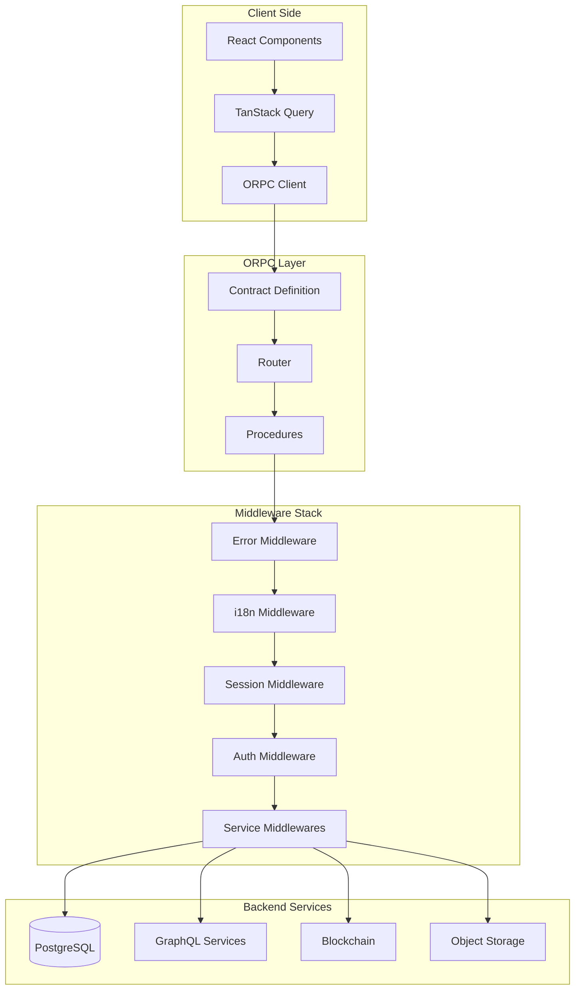

# ORPC API Implementation

This folder contains the complete ORPC (OpenRPC) API implementation for the
Asset Tokenization Kit. ORPC provides a type-safe, full-stack RPC framework that
enables seamless client-server communication with automatic TypeScript type
inference, OpenAPI documentation generation, and integrated validation.

## Architecture Overview



## Folder Structure

```
orpc/
├── context/                 # Context type definitions
│   └── context.ts          # Main context interface for all procedures
├── helpers/                # Shared utility functions
│   ├── array-validation.*  # Array validation utilities
│   ├── blockchain-transaction-messages.*  # Transaction message formatting
│   ├── challenge-response.*  # Wallet signature challenges
│   ├── mutation-messages.*   # User-friendly mutation messages
│   ├── role-validation.*     # User role validation
│   └── transaction-receipt.* # Transaction receipt handling
├── middlewares/           # Middleware implementations
│   ├── auth/             # Authentication & authorization
│   ├── i18n/             # Internationalization
│   ├── monitoring/       # Error handling & monitoring
│   ├── services/         # External service integrations
│   └── system/           # System & token context
├── procedures/           # Base router configurations
│   ├── base.router.ts    # Foundation router
│   ├── public.router.ts  # Public endpoints router
│   ├── auth.router.ts    # Authenticated endpoints router
│   ├── onboarded.router.ts # Onboarded users router
│   └── token.router.ts   # Token-specific router
├── routes/              # API endpoint implementations
│   ├── account/         # Account management
│   ├── actions/         # Time-bound executable tasks
│   ├── addons/          # System addon management
│   ├── common/          # Shared schemas
│   ├── exchange-rates/  # Currency conversion
│   ├── settings/        # User settings
│   ├── system/          # SMART system management
│   ├── token/           # Token operations
│   ├── user/            # User management
│   ├── contract.ts      # Main contract definition
│   └── router.ts        # Main router configuration
└── orpc-client.ts       # Client configuration
```

## Key Concepts

### 1. Contract-First Development

ORPC follows a contract-first approach where all API endpoints are defined
through type-safe contracts:

```typescript
// Define contract
export const userContract = {
  me: oc.input(z.object({})).output(UserSchema),
  update: oc.input(UpdateUserSchema).output(UserSchema),
};

// Implement router
export const userRouter = authRouter.router({
  me: authRouter.me.handler(async ({ context }) => {
    return getUserById(context.auth.user.id);
  }),
});
```

### 2. Middleware Composition

Middlewares are composed to create different security levels:

- **Base Router**: No middleware, raw implementation
- **Public Router**: Error handling + i18n + optional session
- **Auth Router**: Public + required authentication
- **Onboarded Router**: Auth + onboarding verification
- **Token Router**: Auth + token permissions

### 3. Context Injection

Each procedure receives a context object with:

- Request headers
- Authentication state
- Database connection
- External service clients
- System/token information

### 4. Lazy Loading

Routes are lazy-loaded to optimize bundle size:

```typescript
export const router = baseRouter.router({
  user: baseRouter.user.lazy(async () => import("./user/user.router")),
});
```

## Creating New Endpoints

### 1. Define the Contract

Create a contract file in your route folder:

```typescript
// routes/myfeature/myfeature.contract.ts
import { oc } from "@orpc/contract";
import { z } from "zod";

export const myFeatureContract = {
  list: oc
    .input(ListSchema)
    .output(z.array(ItemSchema))
    .metadata({
      openapi: {
        method: "GET",
        path: "/myfeature",
        description: "List all features",
      },
    }),

  create: oc
    .input(CreateSchema)
    .output(ItemSchema)
    .metadata({
      openapi: {
        method: "POST",
        path: "/myfeature",
      },
    }),
};
```

### 2. Create Schemas

Define input/output schemas for validation:

```typescript
// routes/myfeature/routes/myfeature.list.schema.ts
import { z } from "zod";

export const ListSchema = z.object({
  offset: z.number().optional().default(0),
  limit: z.number().max(100).optional(),
  filter: z.string().optional(),
});

export const ItemSchema = z.object({
  id: z.string(),
  name: z.string(),
  createdAt: z.date(),
});
```

### 3. Implement Handlers

Create handler files for each endpoint:

```typescript
// routes/myfeature/routes/myfeature.list.ts
import { authRouter } from "@/orpc/procedures/auth.router";

export const list = authRouter.myfeature.list.handler(
  async ({ input, context }) => {
    const { offset, limit, filter } = input;

    // Access authenticated user
    const userId = context.auth.user.id;

    // Query database
    const items = await context.db
      .select()
      .from(myFeatureTable)
      .where(eq(myFeatureTable.userId, userId))
      .limit(limit)
      .offset(offset);

    return items;
  }
);
```

### 4. Create Router

Aggregate handlers into a router:

```typescript
// routes/myfeature/myfeature.router.ts
import { list } from "./routes/myfeature.list";
import { create } from "./routes/myfeature.create";

const routes = {
  list,
  create,
};

export default routes;
```

### 5. Register in Main Router

Add to the main router with lazy loading:

```typescript
// routes/router.ts
export const router = baseRouter.router({
  // ... existing routes
  myFeature: baseRouter.myFeature.lazy(
    async () => import("./myfeature/myfeature.router")
  ),
});
```

### 6. Update Contract

Add to the main contract:

```typescript
// routes/contract.ts
export const contract = {
  // ... existing contracts
  myFeature: myFeatureContract,
};
```

## Using Middlewares

### Authentication Levels

Choose the appropriate router based on security needs:

```typescript
// Public endpoint - no auth required
export const status = publicRouter.system.status.handler(async () => {
  return { status: "healthy" };
});

// Authenticated endpoint - user must be logged in
export const profile = authRouter.user.profile.handler(async ({ context }) => {
  return getUserProfile(context.auth.user.id);
});

// Onboarded endpoint - user must complete onboarding
export const createToken = onboardedRouter.token.create.handler(
  async ({ context }) => {
    // User is authenticated and onboarded
    return createTokenForUser(context.auth.user);
  }
);
```

### Adding Service Clients

Use service middlewares to inject clients:

```typescript
// Add database access
export const withDb = authRouter.use(dbMiddleware);

// Add GraphQL clients
export const withGraphQL = authRouter
  .use(theGraphMiddleware)
  .use(portalMiddleware);

// Use in handler
export const handler = withGraphQL.data.fetch.handler(async ({ context }) => {
  // Access injected clients
  const blockchainData = await context.theGraphClient.query({
    query: GET_TOKENS,
    schema: TokensSchema,
  });

  const portalData = await context.portalClient.query({
    query: GET_METADATA,
  });

  return combineData(blockchainData, portalData);
});
```

### The Graph Middleware - Automatic Pagination

The Graph middleware provides advanced querying capabilities with automatic
pagination support. It offers two approaches:

#### 1. @fetchAll Directive (Recommended)

Add `@fetchAll` to any list field to automatically fetch all results, bypassing
The Graph's default 100-item limit:

```typescript
import { gql } from "gql.tada";
import { theGraphMiddleware } from "@/orpc/middlewares/services/the-graph.middleware";

// Define your GraphQL query with @fetchAll directive
const ALL_TOKENS_QUERY = gql`
  query GetAllTokens {
    tokens @fetchAll {
      # Automatically fetches ALL tokens
      id
      name
      symbol
      totalSupply
      holders @fetchAll {
        # Nested pagination also supported
        id
        balance
      }
    }
  }
`;

// Use in your handler
export const listAllTokens = authRouter
  .use(theGraphMiddleware)
  .token.list.handler(async ({ context }) => {
    const result = await context.theGraphClient.query(ALL_TOKENS_QUERY, {
      input: {},
      output: TokensSchema,
    });

    return result.tokens; // Contains ALL tokens, not just first 100
  });
```

#### 2. Explicit Pagination Parameters

For backward compatibility or manual control, use explicit `first` and `skip`
parameters:

```typescript
const PAGINATED_TOKENS_QUERY = gql`
  query GetTokens($first: Int, $skip: Int) {
    tokens(first: $first, skip: $skip) {
      id
      name
      symbol
    }
  }
`;

// The middleware automatically handles pagination when first > 1000
export const listTokensPaginated = authRouter
  .use(theGraphMiddleware)
  .token.list.handler(async ({ context, input }) => {
    const result = await context.theGraphClient.query(PAGINATED_TOKENS_QUERY, {
      input: {
        first: 5000, // Will automatically paginate in batches of 500
        skip: 0,
      },
      output: TokensSchema,
    });

    return result.tokens;
  });
```

#### Key Features

- **Automatic Pagination**: The middleware automatically fetches all data in
  batches when using `@fetchAll` or when `first` exceeds The Graph's limit
- **Nested Support**: Works with nested fields - each field can have its own
  pagination
- **Type Safety**: Full TypeScript support with schema validation
- **Performance**: Parallel fetching for multiple paginated fields
- **Backward Compatible**: Existing queries without `@fetchAll` work unchanged

## Client Usage

The ORPC client provides type-safe access to all endpoints:

```typescript
import { client, orpc } from "@/orpc/orpc-client";

// Direct client usage
const user = await client.user.me.query();
const token = await client.token.create.mutate({
  name: "My Token",
  symbol: "MTK",
});

// With TanStack Query (recommended)
function MyComponent() {
  // Query with caching
  const { data: user } = orpc.user.me.useQuery();

  // Mutation with optimistic updates
  const createToken = orpc.token.create.useMutation({
    onSuccess: () => {
      // Invalidate and refetch
      queryClient.invalidateQueries(["token"]);
    },
  });

  return (
    <button onClick={() => createToken.mutate({ name: "Token" })}>
      Create Token
    </button>
  );
}
```

## Error Handling

All errors are standardized through the error middleware:

```typescript
// Define custom errors in procedures
export const handler = authRouter.procedure.handler(
  async ({ input, errors }) => {
    if (!isValid(input)) {
      throw errors.BAD_REQUEST("Invalid input provided");
    }

    if (!hasPermission(user)) {
      throw errors.FORBIDDEN("You don't have permission");
    }

    // Errors are automatically formatted and logged
  }
);
```

## Testing

Test procedures by mocking the context:

```typescript
import { describe, it, expect, vi } from "vitest";
import { handler } from "./myfeature.list";

describe("myFeature.list", () => {
  it("returns user's features", async () => {
    const mockContext = {
      auth: { user: { id: "user123" } },
      db: {
        select: vi.fn().mockReturnValue({
          from: vi.fn().mockReturnValue({
            where: vi.fn().mockReturnValue({
              limit: vi.fn().mockReturnValue([{ id: "1", name: "Feature 1" }]),
            }),
          }),
        }),
      },
    };

    const result = await handler({
      input: { limit: 10 },
      context: mockContext,
    });

    expect(result).toHaveLength(1);
    expect(result[0].name).toBe("Feature 1");
  });
});
```

## Best Practices

1. **Use Specific Routers**: Choose the most restrictive router that meets your
   needs
2. **Validate Everything**: Use Zod schemas for all inputs and outputs
3. **Handle Errors Gracefully**: Use the errors object for consistent error
   handling
4. **Keep Handlers Focused**: Each handler should do one thing well
5. **Document Contracts**: Add OpenAPI metadata for automatic documentation
6. **Test Context Usage**: Mock context objects in tests for isolation
7. **Lazy Load Routes**: Use lazy loading for better performance
8. **Use Type Inference**: Let TypeScript infer types from schemas

## Performance Considerations

1. **Lazy Loading**: Routes are loaded on-demand to reduce initial bundle size
2. **Direct Router Client**: Server-side uses direct function calls, bypassing
   HTTP
3. **Efficient Queries**: Use select/limit/offset for database queries
4. **Caching**: TanStack Query provides automatic caching on the client
5. **Validation**: Zod schemas are compiled once and reused

## Security

1. **Authentication**: Required for most endpoints via auth middleware
2. **Authorization**: Permission checks in handlers and middlewares
3. **Input Validation**: All inputs validated with Zod schemas
4. **CSRF Protection**: Handled by cookie-based sessions
5. **Rate Limiting**: Can be added via custom middleware
6. **SQL Injection**: Prevented by using parameterized queries

## Monitoring

The error middleware automatically:

- Logs all errors with context
- Tracks error rates and types
- Provides consistent error responses
- Integrates with monitoring services

## Future Enhancements

- WebSocket support for real-time updates
- Batch operations for efficiency
- Response compression
- Request/response logging middleware
- API versioning support
