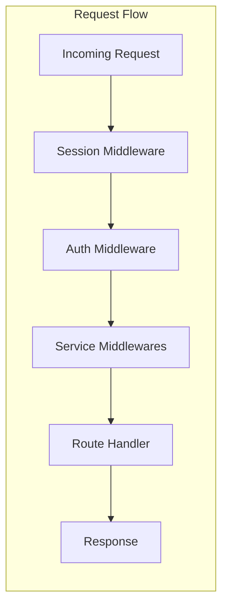

# ORPC Middlewares

This folder contains middleware implementations that provide cross-cutting
functionality for ORPC procedures. Middlewares are composable functions that
intercept requests, add context, handle errors, and enforce security policies.

## Architecture



## Middleware Categories

### 1. Authentication & Authorization (`auth/`)

Handles user authentication, session management, and permission checking.

- **`session.middleware.ts`**: Loads user session from auth cookies
- **`auth.middleware.ts`**: Enforces authentication requirements
- **`permissions.middleware.ts`**: Validates user permissions
- **`wallet.middleware.ts`**: Validates wallet ownership
- **`token-permission.middleware.ts`**: Checks token-specific permissions
- **`token-factory-permission.middleware.ts`**: Validates factory permissions

### 2. Services (`services/`)

Injects external service clients into the context.

- **`db.middleware.ts`**: PostgreSQL database connection
- **`hasura.middleware.ts`**: Hasura GraphQL client
- **`minio.middleware.ts`**: MinIO object storage client
- **`portal.middleware.ts`**: SettleMint Portal API client
- **`the-graph.middleware.ts`**: TheGraph blockchain indexer client

### 5. System (`system/`)

Provides blockchain and system-specific context.

- **`system.middleware.ts`**: Loads SMART system information
- **`token.middleware.ts`**: Loads token contract details
- **`user-claims.middleware.ts`**: Retrieves user identity claims

## Middleware Composition

Middlewares are composed using the `.use()` method to create specialized
routers:

```typescript
// Base router - no middleware
export const baseRouter = implement(contract).$context<Context>();

// Public router - optional session
export const publicRouter = baseRouter.use(sessionMiddleware);

// Authenticated router - adds required authentication
export const authRouter = publicRouter.use(authMiddleware);

// Onboarded router - adds onboarding check
export const onboardedRouter = authRouter
  .use(walletMiddleware)
  .use(systemMiddleware)
  .use(userClaimsMiddleware);
```

## Creating Custom Middlewares

### Basic Middleware Structure

```typescript
import { baseRouter } from "@/orpc/procedures/base.router";

export const myMiddleware = baseRouter.middleware(
  async ({ context, next, errors, input, output }) => {
    // Pre-processing logic
    const additionalData = await fetchSomeData();

    // Call next middleware/handler with enhanced context
    const result = await next({
      context: {
        ...context,
        myData: additionalData,
      },
    });

    // Post-processing logic (optional)
    console.log("Request completed", result);

    return result;
  }
);
```

### Error Handling in Middleware

```typescript
export const validationMiddleware = baseRouter.middleware(
  async ({ context, next, errors, input }) => {
    try {
      // Validate input
      if (!isValid(input)) {
        throw errors.BAD_REQUEST("Invalid input");
      }

      return next({ context });
    } catch (error) {
      // Log and re-throw
      logger.error("Validation failed", { error, input });
      throw error;
    }
  }
);
```

### Conditional Middleware

```typescript
export const conditionalMiddleware = baseRouter.middleware(
  async ({ context, next, input }) => {
    // Skip middleware based on conditions
    if (!shouldApplyMiddleware(input)) {
      return next({ context });
    }

    // Apply middleware logic
    const enhancedContext = await enhanceContext(context);
    return next({ context: enhancedContext });
  }
);
```

## Usage Examples

### Authentication Flow

```typescript
// Handler that requires authentication
export const updateProfile = authRouter.user.update.handler(
  async ({ context, input }) => {
    // context.auth is guaranteed to exist
    const userId = context.auth.user.id;

    return updateUser(userId, input);
  }
);
```

### Service Injection

```typescript
// Compose multiple service middlewares
const withServices = authRouter.use(dbMiddleware).use(theGraphMiddleware);

// Use injected services in handler
export const getTokenData = withServices.token.read.handler(
  async ({ context, input }) => {
    // Query database
    const dbData = await context.db
      .select()
      .from(tokens)
      .where(eq(tokens.id, input.id));

    // Query blockchain
    const blockchainData = await context.theGraphClient.query({
      query: GET_TOKEN_QUERY,
      variables: { id: input.id },
      schema: TokenSchema,
    });

    return mergeData(dbData, blockchainData);
  }
);
```

### Permission Checking

```typescript
// Token-specific permissions
export const mintTokens = authRouter
  .use(tokenMiddleware)
  .use(tokenPermissionMiddleware(["mint"]))
  .token.mint.handler(async ({ context, input }) => {
    // User has mint permission for this token
    return mintTokensForUser(context.token, input.amount);
  });
```

## Middleware Order

The order of middleware execution is crucial:

1. **Session** - Loads authentication state
2. **Auth** - Validates authentication
3. **Permissions** - Checks authorization
4. **Services** - Injects required clients
5. **Business Logic** - Custom validation/transformation

## Performance Considerations

1. **Lazy Loading**: Middlewares should only load resources when needed
2. **Caching**: Cache expensive operations (e.g., permission checks)
3. **Early Exit**: Return early when conditions aren't met
4. **Minimal Processing**: Keep middleware logic lightweight
5. **Async Operations**: Use parallel processing where possible

## Testing Middlewares

```typescript
import { describe, it, expect, vi } from "vitest";
import { myMiddleware } from "./my.middleware";

describe("myMiddleware", () => {
  it("enhances context with additional data", async () => {
    const mockNext = vi.fn().mockResolvedValue({ success: true });
    const mockContext = { headers: {} };

    await myMiddleware({
      context: mockContext,
      next: mockNext,
      input: {},
      errors: {},
    });

    expect(mockNext).toHaveBeenCalledWith({
      context: expect.objectContaining({
        myData: expect.any(Object),
      }),
    });
  });

  it("handles errors gracefully", async () => {
    const mockNext = vi.fn().mockRejectedValue(new Error("Failed"));

    await expect(
      myMiddleware({
        context: {},
        next: mockNext,
        input: {},
        errors: {},
      })
    ).rejects.toThrow("Failed");
  });
});
```

## Best Practices

1. **Single Responsibility**: Each middleware should have one clear purpose
2. **Context Immutability**: Don't mutate the original context
3. **Error Propagation**: Let errors bubble up to error middleware
4. **Type Safety**: Define context additions in TypeScript
5. **Documentation**: Document what context properties are added
6. **Idempotency**: Middlewares should be safe to apply multiple times
7. **Performance**: Monitor middleware execution time
8. **Testing**: Unit test middlewares in isolation
