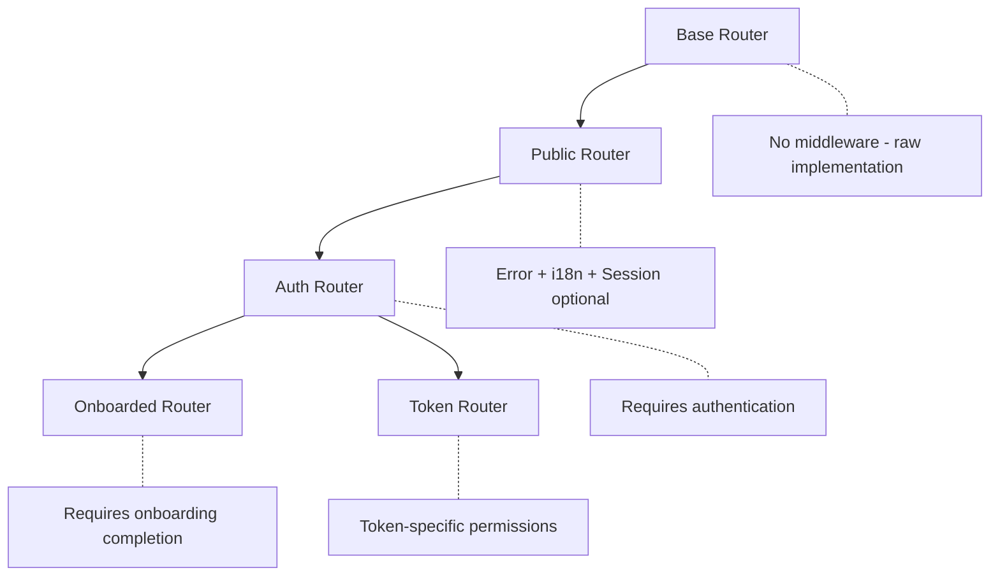

# ORPC Procedures

This folder contains the base router configurations that form the foundation of
the ORPC API. These routers compose different middleware stacks to create
specialized contexts for different types of endpoints.

## Router Hierarchy



## Available Routers

### 1. Base Router (`base.router.ts`)

The foundation router that implements the contract with the application context.

```typescript
export const baseRouter = implement(contract).$context<Context>();
```

**Use when:**

- Building custom middleware compositions
- Need raw access without any middleware
- Creating specialized routers

### 2. Public Router (`public.router.ts`)

Adds essential middleware for public-facing endpoints.

```typescript
export const publicRouter = baseRouter
  .use(errorMiddleware)
  .use(i18nMiddleware)
  .use(sessionMiddleware);
```

**Middleware stack:**

1. Error handling and formatting
2. Internationalization support
3. Optional session loading

**Use for:**

- Public content endpoints
- Health checks and status
- Endpoints with optional authentication
- Public API routes

### 3. Auth Router (`auth.router.ts`)

Enforces authentication requirements on top of public router features.

```typescript
export const authRouter = publicRouter.use(authMiddleware);
```

**Additional middleware:**

- Strict authentication validation
- Throws UNAUTHORIZED if not authenticated

**Use for:**

- User-specific operations
- Protected resources
- Any endpoint requiring login

### 4. Onboarded Router (`onboarded.router.ts`)

Ensures users have completed the onboarding process.

```typescript
export const onboardedRouter = authRouter
  .use(walletMiddleware)
  .use(systemMiddleware)
  .use(userClaimsMiddleware);
```

**Additional middleware:**

- Wallet verification
- System context loading
- User identity claims

**Use for:**

- Token creation and management
- Compliance-required operations
- Features requiring full KYC

### 5. Token Router (`token.router.ts`)

Provides token-specific context and permissions.

```typescript
export const tokenRouter = authRouter
  .use(tokenMiddleware)
  .use(tokenPermissionMiddleware);
```

**Additional middleware:**

- Token context loading
- Permission validation

**Use for:**

- Token-specific operations
- Permission-based actions
- Token administration

## Usage Patterns

### Choosing the Right Router

```typescript
// Public endpoint - no auth needed
export const getPublicStats = publicRouter.stats.public.handler(async () => {
  return getPublicStatistics();
});

// Requires login only
export const getUserProfile = authRouter.user.profile.handler(
  async ({ context }) => {
    return getUserById(context.auth.user.id);
  }
);

// Requires full onboarding
export const createToken = onboardedRouter.token.create.handler(
  async ({ context }) => {
    // User is authenticated, onboarded, and has identity claims
    return deployToken(context.auth.user, context.system);
  }
);

// Token-specific operation
export const mintTokens = tokenRouter.token.mint.handler(
  async ({ context }) => {
    // Has token context and permissions
    return mint(context.token, context.auth.user);
  }
);
```

### Extending Routers

Create custom routers by composing existing ones:

```typescript
// Custom router with specific middleware combination
export const adminRouter = authRouter
  .use(adminPermissionMiddleware)
  .use(auditLogMiddleware);

// Domain-specific router
export const complianceRouter = onboardedRouter
  .use(complianceMiddleware)
  .use(regulatoryCheckMiddleware);
```

### Context Access

Each router level provides cumulative context:

```typescript
// Public router context
{
  headers: Headers,
  // Optional if user is logged in:
  auth?: { user, session }
}

// Auth router context
{
  headers: Headers,
  auth: { user, session } // Required
}

// Onboarded router context
{
  headers: Headers,
  auth: { user, session },
  system: { address, tokenFactories },
  userClaimTopics: string[]
}

// Token router context
{
  headers: Headers,
  auth: { user, session },
  token: Token,
  permissions: string[]
}
```

## Implementation Guidelines

### 1. Router Selection

Choose the most restrictive router that satisfies your requirements:

```typescript
// ❌ Bad - using auth router for public endpoint
export const publicInfo = authRouter.info.get.handler(async () => {
  return getPublicInfo(); // Doesn't need auth!
});

// ✅ Good - using public router
export const publicInfo = publicRouter.info.get.handler(async () => {
  return getPublicInfo();
});

// ❌ Bad - using public router for protected endpoint
export const deleteUser = publicRouter.user.delete.handler(
  async ({ context }) => {
    if (!context.auth) throw new Error("Unauthorized"); // Manual check
  }
);

// ✅ Good - using auth router
export const deleteUser = authRouter.user.delete.handler(
  async ({ context }) => {
    // Auth is guaranteed
    return deleteUserById(context.auth.user.id);
  }
);
```

### 2. Context Type Safety

TypeScript ensures context properties are available:

```typescript
// TypeScript knows auth is optional in public router
export const publicHandler = publicRouter.handler(async ({ context }) => {
  if (context.auth) {
    // TypeScript knows auth exists here
    return getUserSpecificData(context.auth.user.id);
  }
  return getPublicData();
});

// TypeScript knows auth is required in auth router
export const authHandler = authRouter.handler(async ({ context }) => {
  // No need to check - TypeScript guarantees auth exists
  return updateUser(context.auth.user.id);
});
```

### 3. Error Handling

Routers inherit error handling from their parent:

```typescript
// All routers have error middleware from public router
export const handler = authRouter.action.handler(async ({ errors }) => {
  // Use standardized errors
  if (!hasPermission) {
    throw errors.FORBIDDEN("Insufficient permissions");
  }

  if (!isValid) {
    throw errors.BAD_REQUEST("Invalid input");
  }

  // Errors are automatically formatted and logged
});
```

## Testing Procedures

Test handlers by providing mock context appropriate to their router:

```typescript
// Testing public router handler
describe("publicHandler", () => {
  it("works without auth", async () => {
    const result = await publicHandler({
      context: { headers: {} },
      input: {},
    });
    expect(result).toBeDefined();
  });
});

// Testing auth router handler
describe("authHandler", () => {
  it("uses authenticated user", async () => {
    const result = await authHandler({
      context: {
        headers: {},
        auth: {
          user: { id: "123", email: "test@example.com" },
          session: { id: "session123" },
        },
      },
      input: {},
    });
    expect(result.userId).toBe("123");
  });
});

// Testing onboarded router handler
describe("onboardedHandler", () => {
  it("has system context", async () => {
    const result = await onboardedHandler({
      context: {
        headers: {},
        auth: { user: { id: "123" }, session: {} },
        system: {
          address: "0x...",
          tokenFactories: [{ address: "0x...", type: "ERC20" }],
        },
        userClaimTopics: ["COUNTRY", "KYC_VERIFIED"],
      },
      input: {},
    });
    expect(result.systemAddress).toBe("0x...");
  });
});
```

## Best Practices

1. **Start Specific**: Use the most specific router that meets your needs
2. **Avoid Downgrading**: Don't use a less restrictive router and add manual
   checks
3. **Leverage Type Safety**: Trust TypeScript to ensure context properties exist
4. **Document Requirements**: Clearly state why a specific router is chosen
5. **Test Appropriately**: Mock the exact context each router provides
6. **Consider Performance**: More middleware means more processing
7. **Maintain Consistency**: Similar endpoints should use similar routers
