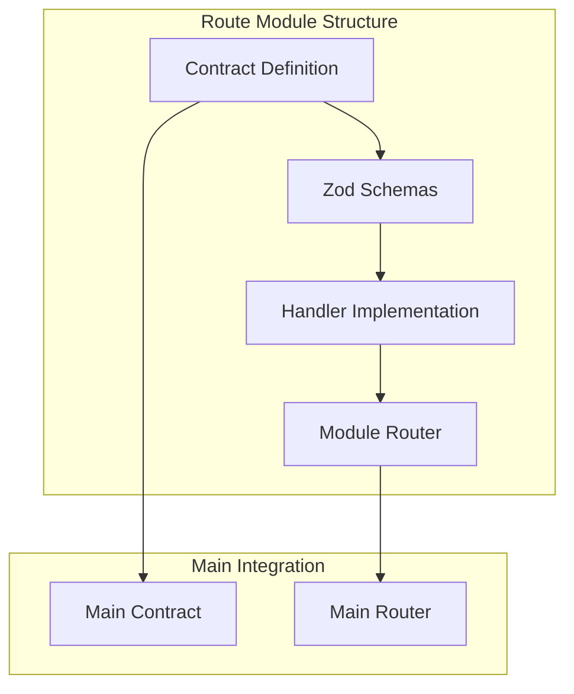

# ORPC Routes

This folder contains all API endpoint implementations organized by domain. Each
route module follows a consistent structure with contracts, schemas, handlers,
and routers.

## Architecture



## Folder Organization

```
routes/
├── account/           # Account and wallet management
├── actions/          # Time-bound executable tasks
├── addons/           # System addon modules
├── common/           # Shared schemas and utilities
├── exchange-rates/   # Currency conversion rates
├── settings/         # User preferences
├── system/           # SMART system operations
├── token/            # Token creation and management
├── user/             # User profiles and KYC
├── contract.ts       # Main contract aggregation
└── router.ts         # Main router with lazy loading
```

## Route Module Structure

Each route module follows this pattern:

### 1. Contract File (`*.contract.ts`)

Defines the type-safe API contract:

```typescript
// account/account.contract.ts
import { oc } from "@orpc/contract";
import { AccountSchema, AccountReadSchema } from "./routes/account.read.schema";

export const accountContract = {
  read: oc
    .input(AccountReadSchema)
    .output(AccountSchema)
    .metadata({
      openapi: {
        method: "GET",
        path: "/account/{wallet}",
        description: "Get account information and identity claims",
      },
    }),

  me: oc
    .input(z.object({}))
    .output(AccountSchema)
    .metadata({
      openapi: {
        method: "GET",
        path: "/account/me",
        description: "Get current user's account",
      },
    }),
};
```

### 2. Schema Files (`routes/*.schema.ts`)

Define validation schemas for inputs and outputs:

```typescript
// account/routes/account.read.schema.ts
import { z } from "zod";
import { ethereumAddress } from "@/lib/zod/validators/ethereum-address";

export const AccountReadSchema = z.object({
  wallet: ethereumAddress.describe("The wallet address to read"),
});

export const AccountSchema = z.object({
  id: ethereumAddress,
  country: isoCountryCode.optional(),
  identity: ethereumAddress.optional(),
  claims: z.array(z.string()).optional(),
});
```

### 3. Handler Files (`routes/*.ts`)

Implement the business logic:

```typescript
// account/routes/account.read.ts
import { authRouter } from "@/orpc/procedures/auth.router";
import {
  AccountReadSchema,
  AccountResponseSchema,
} from "./account.read.schema";

export const read = authRouter.account.read
  .use(hasuraMiddleware)
  .handler(async ({ input, context }) => {
    const { wallet } = input;

    // Query account data
    const response = await context.hasuraClient.query({
      query: GET_ACCOUNT_QUERY,
      variables: { wallet },
      schema: AccountResponseSchema,
    });

    // Transform and return
    return transformAccount(response.account);
  });
```

### 4. Router File (`*.router.ts`)

Aggregates all handlers for the module:

```typescript
// account/account.router.ts
import { read } from "./routes/account.read";
import { me } from "./routes/account.me";

const routes = {
  read,
  me,
};

export default routes;
```

## Common Patterns

### Pagination

Use the shared pagination schema:

```typescript
import { ListSchema } from "../common/schemas/list.schema";

export const TokenListSchema = ListSchema.extend({
  typeId: z.enum(["equity", "bond", "fund"]).optional(),
  status: z.enum(["active", "paused"]).optional(),
});
```

### Mutations

Follow consistent patterns for blockchain transactions:

```typescript
export const create = onboardedRouter.token.create
  .use(portalMiddleware)
  .handler(async ({ input, context }) => {
    // 1. Validate input
    const validated = await validateTokenCreation(input);

    // 2. Submit transaction
    const { transactionHash } = await context.portalClient.mutate({
      mutation: CREATE_TOKEN_MUTATION,
      variables: validated,
    });

    // 3. Return tracking info
    return {
      transactionHash,
      message: "Token creation initiated",
    };
  });
```

### Query Patterns

Combine multiple data sources:

```typescript
export const read = authRouter.token.read
  .use(theGraphMiddleware)
  .use(dbMiddleware)
  .handler(async ({ input, context }) => {
    // Fetch from blockchain
    const blockchainData = await context.theGraphClient.query({
      query: GET_TOKEN_QUERY,
      variables: { id: input.id },
      schema: TokenBlockchainSchema,
    });

    // Fetch from database
    const dbData = await context.db
      .select()
      .from(tokenMetadata)
      .where(eq(tokenMetadata.address, input.id))
      .get();

    // Combine sources
    return {
      ...blockchainData,
      metadata: dbData,
    };
  });
```

## Domain-Specific Routes

### Account Routes

Manage blockchain wallets and identity:

- `read` - Get account details and claims
- `me` - Get current user's account

### Actions Routes

Time-bound tasks users can execute:

- `list` - Get available actions
- `execute` - Perform an action

### Token Routes

Comprehensive token management:

- **Factory** - Token factory operations
- **Mutations** - Create, mint, burn, transfer
- **Stats** - Analytics and metrics
- **Queries** - List, read, holders, events

### System Routes

SMART protocol system management:

- `list` - Available systems
- `read` - System details
- `create` - Deploy new system
- **Identity** - Identity registry operations

### User Routes

User profile and compliance:

- `me` - Current user profile
- `list` - User directory
- **KYC** - Know Your Customer operations
- **Stats** - User analytics

## Adding New Routes

### 1. Create Route Module

```bash
mkdir -p routes/myfeature/routes
```

### 2. Define Contract

```typescript
// routes/myfeature/myfeature.contract.ts
export const myFeatureContract = {
  list: oc.input(ListSchema).output(z.array(ItemSchema)),
  create: oc.input(CreateSchema).output(ItemSchema),
};
```

### 3. Create Schemas

```typescript
// routes/myfeature/routes/myfeature.list.schema.ts
export const ListSchema = z.object({
  filter: z.string().optional(),
});
```

### 4. Implement Handlers

```typescript
// routes/myfeature/routes/myfeature.list.ts
export const list = authRouter.myfeature.list.handler(
  async ({ input, context }) => {
    // Implementation
  }
);
```

### 5. Create Router

```typescript
// routes/myfeature/myfeature.router.ts
export default { list, create };
```

### 6. Register in Main Files

Update `contract.ts` and `router.ts` to include your module.

## Best Practices

1. **Consistent Naming**: Use clear, descriptive names
2. **Schema Reuse**: Use common schemas where possible
3. **Error Handling**: Let middleware handle errors
4. **Type Safety**: Leverage TypeScript inference
5. **Documentation**: Add JSDoc comments to contracts
6. **Testing**: Test handlers with mock context
7. **Separation**: Keep schemas, handlers, and contracts separate
8. **Validation**: Always validate inputs and outputs

## Testing Routes

```typescript
import { describe, it, expect } from "vitest";
import { list } from "./token.list";

describe("token.list", () => {
  it("returns filtered tokens", async () => {
    const mockContext = createMockContext({
      theGraphClient: {
        query: vi.fn().mockResolvedValue({
          tokens: [{ id: "0x123", name: "Token" }],
        }),
      },
    });

    const result = await list({
      input: { typeId: "equity" },
      context: mockContext,
    });

    expect(result).toHaveLength(1);
    expect(result[0].name).toBe("Token");
  });
});
```
