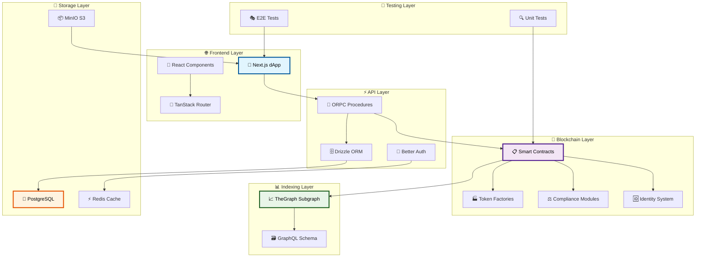
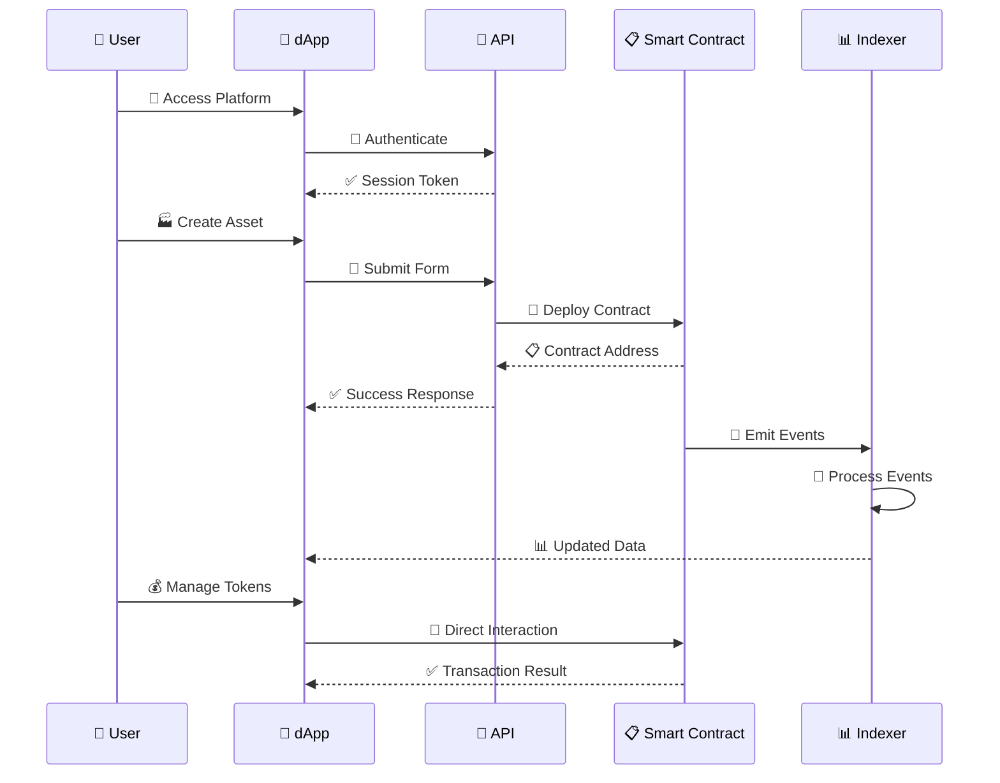

# Asset Tokenization Kit - System Overview

## 🌟 Introduction

The SettleMint Asset Tokenization Kit is a comprehensive blockchain platform that enables the creation, management, and trading of tokenized real-world assets. Built on ERC-3643 standards, it provides a complete solution for compliant security token offerings with built-in identity management, compliance modules, and yield mechanisms.

## 🏗️ Architecture Overview

## 🎯 Core Components

### 1. 📱 Frontend Application (dApp)
- **Technology**: Next.js 15 with App Router
- **State Management**: TanStack Query + Store
- **UI Framework**: Radix UI + Tailwind CSS
- **Forms**: TanStack Form with Zod validation
- **Authentication**: Better Auth with session management

### 2. 🔗 Smart Contract System
- **Standard**: ERC-3643 compliant security tokens
- **Language**: Solidity 0.8.30
- **Framework**: Hardhat + Foundry
- **Patterns**: Factory, Proxy, Access Control
- **Extensions**: Pausable, Burnable, Capped, Yield, Redeemable

### 3. 📊 Data Indexing
- **Technology**: TheGraph Protocol
- **Language**: AssemblyScript
- **Schema**: GraphQL with comprehensive entities
- **Features**: Real-time indexing, aggregations, statistics

### 4. 💾 Backend Services
- **Database**: PostgreSQL with Drizzle ORM
- **File Storage**: MinIO S3-compatible storage
- **Caching**: Redis for session and query caching
- **API**: ORPC for type-safe procedures

## 🚀 Key Features

### Asset Types Supported
- 🏦 **Bonds**: Fixed-term debt instruments with maturity dates
- 📈 **Equities**: Voting rights and governance tokens
- 💰 **Funds**: Management fee collection and distribution
- 🪙 **Stablecoins**: Collateral-backed stable value tokens
- 💳 **Deposits**: Simple deposit certificates

### Compliance & Identity
- 🆔 **OnChain Identity**: ERC-734/735 identity contracts
- ⚖️ **Compliance Modules**: Configurable rule enforcement
- 🌍 **KYC/AML**: Built-in identity verification
- 🏛️ **Regulatory**: Country restrictions and investor limits

### Advanced Features
- 📈 **Yield Generation**: Fixed and variable yield schedules
- 🎁 **Airdrops**: Token distribution mechanisms
- 🏦 **Multi-sig Vaults**: Secure asset custody
- 💱 **XvP Settlement**: Delivery vs Payment workflows

## 🔄 System Workflows

## 🔧 Development Environment

The system runs entirely in Docker containers for consistent development:

- **🔗 Anvil**: Local Ethereum node
- **📊 TheGraph**: Local indexing node
- **🐘 PostgreSQL**: Database with multiple schemas
- **⚡ Redis**: Caching and sessions
- **📦 MinIO**: S3-compatible file storage
- **🔍 Blockscout**: Blockchain explorer
- **📈 Hasura**: GraphQL API for database

## 🎨 UI/UX Design Principles

- **🎯 User-Centric**: Intuitive workflows for complex financial operations
- **📱 Responsive**: Mobile-first design with desktop optimization
- **♿ Accessible**: WCAG compliant with screen reader support
- **🌙 Theme Support**: Light/dark mode with system preference
- **🌍 Internationalization**: Multi-language support (EN, DE, JP, AR)

## 🔒 Security Measures

- **🔐 Authentication**: Multi-factor with PIN codes and recovery
- **🛡️ Authorization**: Role-based access control (RBAC)
- **⚖️ Compliance**: Built-in regulatory compliance checks
- **🔍 Auditing**: Comprehensive event logging and monitoring
- **🏦 Custody**: Multi-signature vault contracts

## 📈 Scalability Features

- **⚡ Caching**: Multi-layer caching strategy
- **📊 Indexing**: Efficient blockchain data querying
- **🔄 State Management**: Optimistic updates and background sync
- **📦 Code Splitting**: Lazy loading and bundle optimization
- **🌐 CDN**: Static asset distribution

## 🧪 Testing Strategy

- **🔍 Unit Tests**: Smart contract and frontend component testing
- **🔗 Integration Tests**: Cross-system workflow validation
- **🎭 E2E Tests**: Complete user journey automation
- **⚡ Performance Tests**: Load testing and optimization
- **🛡️ Security Tests**: Vulnerability scanning and penetration testing

This system overview provides the foundation for understanding the comprehensive Asset Tokenization Kit architecture and its capabilities for creating compliant, secure, and scalable tokenized asset platforms.
