# 🏗️ System Overview - Asset Tokenization Kit

## Executive Summary

The SettleMint Asset Tokenization Kit (ATK) is a comprehensive full-stack blockchain platform designed for enterprise-grade tokenization of real-world assets. Built as a production-ready solution on the SettleMint Blockchain Platform, it provides complete infrastructure for creating, managing, and operating compliant digital asset platforms with built-in regulatory compliance, identity management, and sophisticated yield mechanisms.

The platform serves as a complete tokenization ecosystem, offering modular components for bonds, equities, funds, stablecoins, and deposits, all integrated through a unified architecture that ensures regulatory compliance, operational efficiency, and seamless user experiences. This system represents a paradigm shift from traditional asset management to blockchain-native financial infrastructure.

## Table of Contents

- [Executive Summary](#executive-summary)
- [Architecture Overview](#architecture-overview)
- [Monorepo Structure](#monorepo-structure)
- [Technology Stack](#technology-stack)
- [Core Asset Types](#core-asset-types)
- [System Components](#system-components)
- [Integration Architecture](#integration-architecture)
- [Development Workflow](#development-workflow)
- [Deployment Architecture](#deployment-architecture)
- [Security Model](#security-model)
- [Performance Characteristics](#performance-characteristics)
- [Compliance Framework](#compliance-framework)
- [Related Resources](#related-resources)

## Architecture Overview

The Asset Tokenization Kit follows a layered, modular architecture that separates concerns while maintaining tight integration between components. This design ensures scalability, maintainability, and regulatory compliance across all system operations.

The architecture demonstrates a clear separation of concerns with well-defined interfaces between layers. The frontend layer provides user interfaces for different stakeholder types, while the API layer handles request processing and authentication. The business logic layer implements core tokenization functionality, supported by a robust data layer for persistence and indexing. The blockchain layer provides the foundational smart contract infrastructure, all running on a scalable infrastructure layer.

## Monorepo Structure

The Asset Tokenization Kit is organized as a Turborepo monorepo, providing efficient dependency management, build optimization, and development workflows across all components.

### Workspace Dependencies

The monorepo structure enables efficient dependency management and ensures consistency across all components:

| Component | Dependencies | Purpose |
|-----------|--------------|---------|
| **dapp** | contracts (ABIs, types), subgraph (GraphQL) | Frontend depends on contract types and indexed data |
| **subgraph** | contracts (ABIs, events) | Indexer requires contract interfaces for event handling |
| **e2e** | dapp (testing UI/API) | End-to-end tests validate complete application workflows |
| **charts** | All components | Kubernetes deployment requires all application artifacts |

## Technology Stack

The Asset Tokenization Kit leverages a modern, enterprise-grade technology stack optimized for performance, security, and developer experience.

### Technology Stack Comparison

| Layer | Technology | Version | Purpose | Alternatives Considered |
|-------|------------|---------|---------|------------------------|
| **Package Manager** | Bun | 1.2.19 | Fast JavaScript runtime and package manager | npm, yarn, pnpm |
| **Monorepo** | Turborepo | 2.5.6 | Build system and task orchestration | Lerna, Nx, Rush |
| **Smart Contracts** | Solidity | 0.8.30 | Smart contract development language | Vyper, Rust (Solana) |
| **Contract Framework** | Foundry + Hardhat | Latest | Testing and deployment frameworks | Truffle, Brownie |
| **Frontend Framework** | Next.js | 15.x | React-based web application framework | Vite + React, Remix |
| **React Version** | React | 19.1.1 | UI library with latest features | Vue.js, Angular |
| **State Management** | TanStack Query | 5.89.0 | Server state management | Redux, Zustand, SWR |
| **Routing** | TanStack Router | 1.131.49 | Type-safe client-side routing | Next.js App Router, React Router |
| **Forms** | TanStack Form | 1.23.0 | Type-safe form management | React Hook Form, Formik |
| **UI Components** | Radix UI | Latest | Unstyled, accessible components | Material-UI, Chakra UI |
| **Styling** | Tailwind CSS | 4.1.13 | Utility-first CSS framework | Styled Components, CSS Modules |
| **API Layer** | ORPC | 1.8.9 | Type-safe API procedures | tRPC, GraphQL, REST |
| **Database** | PostgreSQL | 17.6 | Relational database | MySQL, MongoDB |
| **ORM** | Drizzle ORM | 0.44.5 | Type-safe database toolkit | Prisma, TypeORM |
| **Authentication** | Better Auth | 1.3.13 | Authentication and session management | NextAuth.js, Auth0 |
| **Blockchain Indexing** | TheGraph | 0.97.1 | Decentralized indexing protocol | Custom indexer, Alchemy |
| **File Storage** | MinIO | Latest | S3-compatible object storage | AWS S3, IPFS |
| **Caching** | Redis | 8.2 | In-memory data structure store | Memcached, DragonflyDB |
| **Container** | Docker | Latest | Application containerization | Podman, containerd |
| **Orchestration** | Kubernetes | Latest | Container orchestration | Docker Swarm, Nomad |
| **Testing** | Vitest + Playwright | Latest | Unit and E2E testing | Jest, Cypress |

### Development Tools Integration

| Tool Category | Primary Tool | Integration Points | Configuration Files |
|---------------|--------------|-------------------|-------------------|
| **Type Checking** | TypeScript 5.9.2 | All packages, shared config | `tsconfig.json`, `typescript-config/` |
| **Code Quality** | ESLint + Prettier | Pre-commit hooks, CI pipeline | `eslint.config.ts`, `.prettierrc` |
| **Build System** | Turborepo | Parallel builds, caching | `turbo.json`, package scripts |
| **Package Management** | Bun workspaces | Monorepo dependency management | `bunfig.toml`, workspace protocol |
| **Container** | Docker Compose | Local development environment | `docker-compose.yml` |
| **Deployment** | Helm Charts | Kubernetes deployment | `kit/charts/` |

## Core Asset Types

The Asset Tokenization Kit supports five primary asset classes, each optimized for specific financial instruments and use cases:

```mermaid
graph TB
    subgraph "Asset Tokenization Ecosystem"
        subgraph "Fixed Income"
            Bond[🏦 Bond Tokens<br/>Fixed-term debt instruments<br/>• Maturity dates<br/>• Yield distribution<br/>• Redemption mechanics]
        end
        
        subgraph "Equity Instruments"
            Equity[📈 Equity Tokens<br/>Ownership with voting rights<br/>• Governance participation<br/>• Dividend distribution<br/>• Shareholder privileges]
        end
        
        subgraph "Investment Vehicles"
            Fund[💰 Fund Tokens<br/>Collective investment schemes<br/>• Management fees<br/>• NAV calculation<br/>• Performance tracking]
        end
        
        subgraph "Stable Value"
            Stable[🪙 StableCoin Tokens<br/>Fiat-pegged stable tokens<br/>• Collateral backing<br/>• Price stability<br/>• Reserve management]
        end
        
        subgraph "Deposit Instruments"
            Deposit[💳 Deposit Tokens<br/>Collateral-backed deposits<br/>• Banking integration<br/>• Time-locked deposits<br/>• Backing verification]
        end
    end
    
    subgraph "Common Features"
        Compliance[⚖️ Regulatory Compliance<br/>ERC-3643 Standard<br/>• KYC/AML integration<br/>• Transfer restrictions<br/>• Identity verification]
        
        Extensions[🔧 Modular Extensions<br/>SMART Protocol<br/>• Pausable operations<br/>• Custodian controls<br/>• Historical tracking]
        
        Governance[🗳️ Governance Systems<br/>Voting Mechanisms<br/>• Proposal creation<br/>• Vote delegation<br/>• Execution controls]
    end
    
    %% Connections
    Bond --> Compliance
    Equity --> Compliance
    Fund --> Compliance
    Stable --> Compliance
    Deposit --> Compliance
    
    Bond --> Extensions
    Equity --> Extensions
    Fund --> Extensions
    Stable --> Extensions
    Deposit --> Extensions
    
    Equity --> Governance
    Fund --> Governance
    
    %% Styling
    style Bond fill:#e1f5fe,stroke:#01579b,color:#000000,stroke-width:3px
    style Equity fill:#f3e5f5,stroke:#4a148c,color:#000000,stroke-width:3px
    style Fund fill:#e8f5e8,stroke:#1b5e20,color:#000000,stroke-width:3px
    style Stable fill:#fff3e0,stroke:#e65100,color:#000000,stroke-width:3px
    style Deposit fill:#ffebee,stroke:#c62828,color:#000000,stroke-width:3px
```

### Asset Type Feature Matrix

| Feature | Bond | Equity | Fund | StableCoin | Deposit | Implementation |
|---------|------|--------|------|------------|---------|----------------|
| **Core Tokenization** | ✅ | ✅ | ✅ | ✅ | ✅ | SMART Protocol base |
| **Compliance Modules** | ✅ | ✅ | ✅ | ✅ | ✅ | ERC-3643 integration |
| **Transfer Restrictions** | ✅ | ✅ | ✅ | ✅ | ✅ | OnchainID verification |
| **Pausable Operations** | ✅ | ✅ | ✅ | ✅ | ✅ | Emergency controls |
| **Custodian Controls** | ✅ | ✅ | ✅ | ✅ | ✅ | Forced transfers |
| **Voting Rights** | ❌ | ✅ | ✅ | ❌ | ❌ | ERC20Votes extension |
| **Yield Distribution** | ✅ | ❌ | ❌ | ❌ | ❌ | Scheduled payments |
| **Maturity Management** | ✅ | ❌ | ❌ | ❌ | ❌ | Time-locked redemption |
| **Collateral Backing** | ✅ | ❌ | ❌ | ✅ | ✅ | Claim verification |
| **Management Fees** | ❌ | ❌ | ✅ | ❌ | ❌ | Time-based collection |
| **Redemption Rights** | ✅ | ❌ | ❌ | ✅ | ❌ | User-initiated burning |
| **Supply Caps** | ✅ | ❌ | ❌ | ❌ | ❌ | Maximum issuance limits |
| **Historical Balances** | ✅ | ❌ | ❌ | ❌ | ❌ | Snapshot capabilities |

## System Components

The Asset Tokenization Kit consists of six primary components, each serving specific roles in the overall architecture:

### Component Architecture Diagram

```mermaid
graph TB
    subgraph "Component Interaction Flow"
        subgraph "User Interface Layer"
            WebApp[Web Application<br/>Next.js 15 dApp<br/>• Asset Designer<br/>• Portfolio Management<br/>• Admin Dashboard]
            
            Mobile[Mobile Interface<br/>Responsive Design<br/>• Wallet Integration<br/>• Asset Trading<br/>• Compliance Forms]
        end
        
        subgraph "API & Business Logic"
            API[ORPC API Server<br/>Type-safe Procedures<br/>• Authentication<br/>• Asset Management<br/>• Compliance Processing]
            
            Services[Business Services<br/>Service Layer<br/>• Token Operations<br/>• Identity Management<br/>• Notification System]
        end
        
        subgraph "Blockchain Infrastructure"
            Contracts[Smart Contracts<br/>Solidity Implementation<br/>• Asset Tokens<br/>• System Contracts<br/>• Addon Modules]
            
            Indexer[Blockchain Indexer<br/>TheGraph Subgraph<br/>• Event Processing<br/>• Data Aggregation<br/>• Query Interface]
        end
        
        subgraph "Data & Storage"
            Database[Application Database<br/>PostgreSQL<br/>• User Data<br/>• Application State<br/>• Audit Logs]
            
            Cache[Caching Layer<br/>Redis<br/>• Session Storage<br/>• Query Caching<br/>• Real-time Data]
            
            Files[File Storage<br/>MinIO + IPFS<br/>• Document Storage<br/>• Media Assets<br/>• Compliance Documents]
        end
        
        subgraph "Testing & Deployment"
            Tests[End-to-End Tests<br/>Playwright<br/>• UI Testing<br/>• API Testing<br/>• Integration Flows]
            
            Deploy[Kubernetes Deployment<br/>Helm Charts<br/>• Container Orchestration<br/>• Service Discovery<br/>• Auto-scaling]
        end
    end
    
    %% Component Interactions
    WebApp --> API
    Mobile --> API
    API --> Services
    Services --> Contracts
    Services --> Database
    Services --> Cache
    Contracts --> Indexer
    Indexer --> API
    Files --> API
    Tests --> WebApp
    Tests --> API
    Deploy --> WebApp
    Deploy --> API
    Deploy --> Database
    
    %% Styling
    style WebApp fill:#e1f5fe,stroke:#01579b,color:#000000,stroke-width:3px
    style API fill:#f3e5f5,stroke:#4a148c,color:#000000,stroke-width:3px
    style Contracts fill:#e8f5e8,stroke:#1b5e20,color:#000000,stroke-width:3px
    style Database fill:#fff3e0,stroke:#e65100,color:#000000,stroke-width:3px
    style Tests fill:#ffebee,stroke:#c62828,color:#000000,stroke-width:3px
    style Deploy fill:#f3e5f5,stroke:#4a148c,color:#000000,stroke-width:3px
```

### Component Specifications

| Component | Primary Technologies | Key Responsibilities | Performance Targets |
|-----------|---------------------|---------------------|-------------------|
| **Smart Contracts** | Solidity, Foundry, Hardhat | Token logic, compliance enforcement, system governance | <100ms transaction confirmation |
| **Frontend dApp** | Next.js 15, React 19, TanStack | User interface, wallet integration, asset management | <2s page load time |
| **API Server** | ORPC, Better Auth, Drizzle | Business logic, authentication, data processing | <200ms API response time |
| **Blockchain Indexer** | TheGraph, GraphQL, AssemblyScript | Event processing, data aggregation, query optimization | <5s indexing latency |
| **Database** | PostgreSQL, Redis, MinIO | Data persistence, caching, file storage | 99.9% uptime target |
| **Testing Suite** | Playwright, Vitest, Foundry | Quality assurance, integration testing, security validation | 100% critical path coverage |
| **Deployment** | Kubernetes, Helm, Docker | Container orchestration, service management, scaling | Auto-scaling based on demand |

## Integration Architecture

The Asset Tokenization Kit integrates with multiple external systems to provide comprehensive tokenization capabilities:

```mermaid
graph TB
    subgraph "External Integrations"
        subgraph "Blockchain Infrastructure"
            EVM[EVM-Compatible Networks<br/>Ethereum, Polygon, BSC<br/>• Smart contract deployment<br/>• Transaction processing<br/>• Event monitoring]
            
            IPFS_Ext[IPFS Network<br/>Decentralized Storage<br/>• Document persistence<br/>• Metadata storage<br/>• Content addressing]
        end
        
        subgraph "Identity & Compliance"
            OnchainID[OnchainID Protocol<br/>Decentralized Identity<br/>• KYC verification<br/>• Claim management<br/>• Identity attestation]
            
            KYC[KYC/AML Providers<br/>Third-party Services<br/>• Identity verification<br/>• Risk assessment<br/>• Compliance monitoring]
        end
        
        subgraph "Financial Services"
            Banking[Core Banking Systems<br/>Traditional Finance<br/>• Account integration<br/>• Payment processing<br/>• Settlement rails]
            
            Custody[Custody Providers<br/>Asset Custodians<br/>• Asset safekeeping<br/>• Corporate actions<br/>• Reporting services]
        end
        
        subgraph "Infrastructure Services"
            Portal[SettleMint Portal<br/>Blockchain Gateway<br/>• RPC endpoint<br/>• Transaction relay<br/>• Network abstraction]
            
            Monitoring[Monitoring Services<br/>Observability Stack<br/>• Performance monitoring<br/>• Error tracking<br/>• Business metrics]
        end
    end
    
    subgraph "ATK Core System"
        ATK[Asset Tokenization Kit<br/>Core Platform<br/>• Asset management<br/>• User interface<br/>• API services]
    end
    
    %% Integration Connections
    ATK --> EVM
    ATK --> IPFS_Ext
    ATK --> OnchainID
    ATK --> KYC
    ATK --> Banking
    ATK --> Custody
    ATK --> Portal
    ATK --> Monitoring
    
    %% Cross-service connections
    OnchainID --> EVM
    Portal --> EVM
    Banking --> Custody
    
    %% Styling
    style ATK fill:#e1f5fe,stroke:#01579b,color:#000000,stroke-width:3px
    style EVM fill:#f3e5f5,stroke:#4a148c,color:#000000,stroke-width:3px
    style OnchainID fill:#e8f5e8,stroke:#1b5e20,color:#000000,stroke-width:3px
    style Banking fill:#fff3e0,stroke:#e65100,color:#000000,stroke-width:3px
    style Portal fill:#ffebee,stroke:#c62828,color:#000000,stroke-width:3px
```

### Integration Specifications

| Integration Type | Protocol/Standard | Data Flow | Security Model |
|------------------|-------------------|-----------|----------------|
| **Blockchain Networks** | JSON-RPC, WebSocket | Bidirectional transaction and event data | Private key management, transaction signing |
| **Identity Systems** | OnchainID, ERC-735 | KYC data verification and claim attestation | Zero-knowledge proofs, selective disclosure |
| **Banking APIs** | REST, SWIFT, ISO 20022 | Account data, payment instructions, settlement | OAuth 2.0, API keys, message encryption |
| **Storage Networks** | IPFS, HTTP Gateway | Content upload and retrieval | Content addressing, encryption at rest |
| **Monitoring Systems** | OpenTelemetry, Prometheus | Metrics, logs, and traces | API authentication, data aggregation |

## Development Workflow

The Asset Tokenization Kit implements a comprehensive development workflow optimized for team collaboration, quality assurance, and rapid iteration:

### Development Commands Reference

| Command Category | Command | Purpose | Dependencies |
|------------------|---------|---------|--------------|
| **Setup** | `bun install` | Install all workspace dependencies | Bun runtime |
| **Development** | `bun run dev` | Start development environment with Docker | Docker, PostgreSQL, Redis |
| **Development** | `bun run dev:up` | Start Docker Compose services | Docker Compose |
| **Development** | `bun run dev:reset` | Clean restart with fresh state | Docker, database |
| **Quality** | `bun run lint` | Lint all packages with ESLint | ESLint, Solhint |
| **Quality** | `bun run format` | Format code with Prettier | Prettier |
| **Quality** | `bun run typecheck` | Type-check all TypeScript | TypeScript compiler |
| **Testing** | `bun run test` | Run unit tests across packages | Vitest, Foundry |
| **Testing** | `bun run test:e2e:ui` | Run UI end-to-end tests | Playwright |
| **Testing** | `bun run test:e2e:api` | Run API end-to-end tests | Playwright |
| **Build** | `bun run build` | Build all packages in order | Turborepo |
| **Build** | `bun run artifacts` | Generate contract artifacts | Foundry, Hardhat |
| **CI/CD** | `bun run ci` | Full CI pipeline | All development tools |

## Deployment Architecture

The Asset Tokenization Kit supports multiple deployment scenarios, from local development to enterprise production environments:

### Deployment Configuration Matrix

| Environment | Compute Resources | Database Config | Blockchain Network | Monitoring Level |
|-------------|------------------|-----------------|-------------------|------------------|
| **Local** | 4 CPU, 8GB RAM | Single PostgreSQL instance | Local Anvil node | Basic logging |
| **Development** | 8 CPU, 16GB RAM | PostgreSQL with backup | Sepolia testnet | Development metrics |
| **Staging** | 16 CPU, 32GB RAM | HA PostgreSQL cluster | Goerli testnet | Full observability |
| **Production** | 32+ CPU, 64+ GB RAM | Multi-region PostgreSQL | Ethereum mainnet | Enterprise monitoring |

## Security Model

The Asset Tokenization Kit implements a comprehensive security model that addresses threats at every layer of the architecture:

```mermaid
graph TB
    subgraph "Security Architecture"
        subgraph "Application Security"
            AuthZ[Authorization<br/>Role-Based Access<br/>• Granular permissions<br/>• Principle of least privilege<br/>• Dynamic role assignment]
            
            AuthN[Authentication<br/>Multi-Factor Auth<br/>• Wallet-based auth<br/>• Session management<br/>• Token validation]
            
            Input[Input Validation<br/>Data Sanitization<br/>• Schema validation<br/>• SQL injection prevention<br/>• XSS protection]
        end
        
        subgraph "Smart Contract Security"
            Access[Access Control<br/>OpenZeppelin AccessManager<br/>• Role-based permissions<br/>• Time-locked operations<br/>• Emergency controls]
            
            Upgrades[Upgrade Safety<br/>Proxy Patterns<br/>• Implementation versioning<br/>• Storage slot safety<br/>• Migration validation]
            
            Audit[Security Audits<br/>Code Review<br/>• Automated analysis<br/>• Manual review<br/>• Penetration testing]
        end
        
        subgraph "Infrastructure Security"
            Network[Network Security<br/>Traffic Encryption<br/>• TLS/SSL encryption<br/>• VPN access<br/>• Firewall rules]
            
            Secrets[Secret Management<br/>Key Rotation<br/>• Environment isolation<br/>• Encrypted storage<br/>• Access logging]
            
            Monitor[Security Monitoring<br/>Threat Detection<br/>• Anomaly detection<br/>• Incident response<br/>• Audit logging]
        end
        
        subgraph "Compliance Security"
            Privacy[Data Privacy<br/>GDPR Compliance<br/>• Data minimization<br/>• Consent management<br/>• Right to erasure]
            
            Audit_Trail[Audit Trail<br/>Immutable Logging<br/>• Transaction logs<br/>• Access records<br/>• Compliance reporting]
            
            Regulatory[Regulatory Controls<br/>AML/KYC Integration<br/>• Identity verification<br/>• Transaction monitoring<br/>• Sanctions screening]
        end
    end
    
    %% Security layer interactions
    AuthN --> AuthZ
    AuthZ --> Input
    Access --> Upgrades
    Upgrades --> Audit
    Network --> Secrets
    Secrets --> Monitor
    Privacy --> Audit_Trail
    Audit_Trail --> Regulatory
    
    %% Cross-layer security
    AuthZ -.-> Access
    Input -.-> Network
    Monitor -.-> Audit_Trail
    
    %% Styling
    style AuthN fill:#e1f5fe,stroke:#01579b,color:#000000,stroke-width:3px
    style Access fill:#f3e5f5,stroke:#4a148c,color:#000000,stroke-width:3px
    style Network fill:#e8f5e8,stroke:#1b5e20,color:#000000,stroke-width:3px
    style Privacy fill:#fff3e0,stroke:#e65100,color:#000000,stroke-width:3px
    style Monitor fill:#ffebee,stroke:#c62828,color:#000000,stroke-width:3px
```

### Security Controls Matrix

| Security Domain | Controls Implemented | Risk Mitigation | Compliance Standards |
|-----------------|---------------------|-----------------|-------------------|
| **Authentication** | Wallet-based auth, MFA, session management | Identity theft, unauthorized access | NIST, OWASP |
| **Authorization** | RBAC, least privilege, dynamic permissions | Privilege escalation, insider threats | ISO 27001, SOC 2 |
| **Smart Contracts** | Access controls, upgradeable proxies, audits | Contract vulnerabilities, governance attacks | Smart contract best practices |
| **Data Protection** | Encryption at rest/transit, key rotation | Data breaches, information disclosure | GDPR, CCPA |
| **Infrastructure** | Network segmentation, secret management | Infrastructure attacks, credential theft | CIS Controls, NIST Framework |
| **Compliance** | Audit trails, KYC/AML integration, reporting | Regulatory violations, sanctions | AML/KYC regulations, MiCA |

## Performance Characteristics

The Asset Tokenization Kit is designed for enterprise-scale performance with specific targets for each system component:

### Performance Benchmarks

| Component | Metric | Target | Current Performance | Optimization Strategy |
|-----------|--------|--------|-------------------|-------------------|
| **Smart Contracts** | Gas cost per transaction | <200,000 gas | ~150,000 gas | Storage optimization, batch operations |
| **Frontend dApp** | Page load time | <2 seconds | ~1.5 seconds | Code splitting, lazy loading, CDN |
| **API Server** | Response time | <200ms | ~150ms | Caching, database optimization |
| **Database** | Query response time | <50ms | ~30ms | Indexing, query optimization |
| **Blockchain Indexing** | Event processing latency | <5 seconds | ~3 seconds | Parallel processing, efficient mappings |
| **File Storage** | Upload throughput | >100MB/s | ~120MB/s | Multi-part uploads, compression |

### Scalability Targets

```mermaid
graph LR
    subgraph "Scalability Metrics"
        Users[Concurrent Users<br/>Target: 10,000+<br/>Current: 5,000+]
        
        TPS[Transactions Per Second<br/>Target: 1,000 TPS<br/>Current: 500 TPS]
        
        Storage[Data Storage<br/>Target: 100TB+<br/>Current: 50TB+]
        
        Assets[Active Assets<br/>Target: 1M+ tokens<br/>Current: 500K+ tokens]
    end
    
    subgraph "Performance Optimization"
        Caching[Multi-layer Caching<br/>• Redis for sessions<br/>• CDN for static assets<br/>• Query result caching]
        
        Indexing[Database Indexing<br/>• Composite indexes<br/>• Partial indexes<br/>• Query optimization]
        
        Scaling[Horizontal Scaling<br/>• Kubernetes auto-scaling<br/>• Database read replicas<br/>• Load balancing]
    end
    
    Users --> Caching
    TPS --> Indexing
    Storage --> Scaling
    Assets --> Indexing
    
    %% Styling
    style Users fill:#e1f5fe,stroke:#01579b,color:#000000,stroke-width:3px
    style TPS fill:#f3e5f5,stroke:#4a148c,color:#000000,stroke-width:3px
    style Storage fill:#e8f5e8,stroke:#1b5e20,color:#000000,stroke-width:3px
    style Assets fill:#fff3e0,stroke:#e65100,color:#000000,stroke-width:3px
```

## Compliance Framework

The Asset Tokenization Kit implements a comprehensive compliance framework that addresses regulatory requirements across multiple jurisdictions:

```mermaid
graph TB
    subgraph "Compliance Architecture"
        subgraph "Identity Management"
            KYC[KYC Verification<br/>Know Your Customer<br/>• Identity verification<br/>• Document validation<br/>• Risk assessment]
            
            AML[AML Monitoring<br/>Anti-Money Laundering<br/>• Transaction monitoring<br/>• Suspicious activity<br/>• Sanctions screening]
            
            Identity[Digital Identity<br/>OnchainID Integration<br/>• Decentralized identity<br/>• Claim management<br/>• Privacy preservation]
        end
        
        subgraph "Token Compliance"
            ERC3643[ERC-3643 Standard<br/>Security Token Standard<br/>• Transfer restrictions<br/>• Compliance modules<br/>• Regulatory rules]
            
            Modules[Compliance Modules<br/>Pluggable Rules<br/>• Country restrictions<br/>• Investor limits<br/>• Time-based rules]
            
            Registry[Token Registry<br/>Compliance Tracking<br/>• Token registration<br/>• Rule enforcement<br/>• Audit trails]
        end
        
        subgraph "Regulatory Reporting"
            Reports[Automated Reports<br/>Compliance Reporting<br/>• Transaction reports<br/>• Holdings reports<br/>• Regulatory filings]
            
            Audit[Audit Trail<br/>Immutable Records<br/>• Transaction logs<br/>• Access records<br/>• Compliance events]
            
            Monitoring[Real-time Monitoring<br/>Compliance Alerts<br/>• Rule violations<br/>• Suspicious patterns<br/>• Regulatory changes]
        end
    end
    
    %% Compliance workflow
    KYC --> Identity
    AML --> KYC
    Identity --> ERC3643
    ERC3643 --> Modules
    Modules --> Registry
    Registry --> Reports
    Reports --> Audit
    Audit --> Monitoring
    Monitoring -.-> AML
    
    %% Styling
    style KYC fill:#e1f5fe,stroke:#01579b,color:#000000,stroke-width:3px
    style ERC3643 fill:#f3e5f5,stroke:#4a148c,color:#000000,stroke-width:3px
    style Reports fill:#e8f5e8,stroke:#1b5e20,color:#000000,stroke-width:3px
    style Identity fill:#fff3e0,stroke:#e65100,color:#000000,stroke-width:3px
    style Monitoring fill:#ffebee,stroke:#c62828,color:#000000,stroke-width:3px
```

### Regulatory Compliance Matrix

| Jurisdiction | Applicable Regulations | Implementation Status | Compliance Features |
|-------------|----------------------|---------------------|-------------------|
| **United States** | SEC regulations, BSA, PATRIOT Act | ✅ Implemented | KYC/AML, accredited investor verification |
| **European Union** | MiCA, GDPR, AML5 | ✅ Implemented | Data privacy, transaction monitoring |
| **United Kingdom** | FCA regulations, MLR 2017 | ✅ Implemented | Regulatory reporting, sanctions screening |
| **Singapore** | MAS guidelines, PSAA | 🔄 In Progress | Digital asset licensing, compliance modules |
| **Japan** | FIEA, JVCEA guidelines | 🔄 In Progress | Crypto asset regulations, investor protection |

## Related Resources

### Core Implementation Files

- **System Architecture**: [`kit/`](../../../) - Complete monorepo structure
- **Configuration**: [`package.json`](../../../package.json), [`turbo.json`](../../../turbo.json)
- **Docker Setup**: [`docker-compose.yml`](../../../docker-compose.yml)
- **Development Tools**: [`tools/`](../../../tools/) - Build and development utilities

### Smart Contract Foundation

- **SMART Protocol**: [`kit/contracts/contracts/smart/`](../../contracts/contracts/smart/) - Token protocol foundation
- **ATK System**: [`kit/contracts/contracts/system/`](../../contracts/contracts/system/) - System infrastructure
- **Asset Contracts**: [`kit/contracts/contracts/assets/`](../../contracts/contracts/assets/) - Token implementations

### Frontend Application

- **Next.js dApp**: [`kit/dapp/src/`](../../dapp/src/) - Complete frontend implementation
- **Component Library**: [`kit/dapp/src/components/`](../../dapp/src/components/) - UI components
- **API Layer**: [`kit/dapp/src/orpc/`](../../dapp/src/orpc/) - Backend API procedures

### Documentation Navigation

- **Next**: [02 - SMART Protocol Foundation](./02-smart-protocol-foundation.md) - Token protocol implementation
- **Related**: [04 - Development Environment](./04-development-environment.md) - Local setup guide
- **Related**: [05 - Deployment Operations](./05-deployment-operations.md) - Production deployment

### External Resources

- **SettleMint Platform**: [https://settlemint.com](https://settlemint.com) - Blockchain platform documentation
- **ERC-3643 Standard**: [https://eips.ethereum.org/EIPS/eip-3643](https://eips.ethereum.org/EIPS/eip-3643) - Security token standard
- **OnchainID Protocol**: [https://onchainid.com](https://onchainid.com) - Decentralized identity solution
- **Turborepo Documentation**: [https://turbo.build](https://turbo.build) - Monorepo build system
