# 🔗 SMART Protocol Foundation

## Executive Summary

The SMART Protocol (SettleMint Adaptable Regulated Token) serves as the foundational layer for the Asset Tokenization Kit, implementing a comprehensive ERC-3643 compliant framework for regulatory-compliant security tokens. This protocol provides the core tokenization infrastructure with modular extensions, enabling the creation of sophisticated financial instruments while maintaining full regulatory compliance and operational flexibility.

The SMART Protocol represents a paradigm shift from traditional token standards by embedding regulatory compliance directly into the token logic, ensuring that all transfers and operations automatically comply with applicable regulations. This approach eliminates the need for external compliance checking and provides real-time regulatory enforcement at the smart contract level.

## Table of Contents

- [Executive Summary](#executive-summary)
- [Protocol Architecture](#protocol-architecture)
- [ERC-3643 Compliance Implementation](#erc-3643-compliance-implementation)
- [Core SMART Token](#core-smart-token)
- [Extension System](#extension-system)
- [Compliance Module Framework](#compliance-module-framework)
- [Identity Integration](#identity-integration)
- [Upgrade Mechanisms](#upgrade-mechanisms)
- [Security Architecture](#security-architecture)
- [Gas Optimization](#gas-optimization)
- [Testing Framework](#testing-framework)
- [Integration Patterns](#integration-patterns)
- [Related Resources](#related-resources)

## Protocol Architecture

The SMART Protocol follows a layered architecture that separates core token functionality from regulatory compliance and operational extensions:

```mermaid
graph TB
    subgraph "SMART Protocol Stack"
        subgraph "Application Layer"
            AssetTokens[Asset Token Implementations<br/>Bond, Equity, Fund, StableCoin, Deposit<br/>• Business logic<br/>• Asset-specific features<br/>• User interfaces]
        end
        
        subgraph "Extension Layer"
            CoreExt[Core Extensions<br/>Pausable, Burnable, Custodian<br/>• Operational controls<br/>• Emergency functions<br/>• Administrative actions]
            
            FeatureExt[Feature Extensions<br/>Yield, Voting, Collateral, Redeemable<br/>• Advanced functionality<br/>• Asset-specific features<br/>• Custom behaviors]
            
            ComplianceExt[Compliance Extensions<br/>Historical Balances, Capped<br/>• Regulatory requirements<br/>• Audit capabilities<br/>• Reporting features]
        end
        
        subgraph "Core Protocol Layer"
            SMARTCore[SMART Core Token<br/>Base Implementation<br/>• ERC-20 compatibility<br/>• Transfer logic<br/>• Balance management]
            
            ComplianceCore[Compliance Core<br/>ERC-3643 Implementation<br/>• Transfer restrictions<br/>• Identity verification<br/>• Regulatory rules]
            
            IdentityCore[Identity Core<br/>OnchainID Integration<br/>• Identity management<br/>• Claim verification<br/>• KYC/AML integration]
        end
        
        subgraph "Infrastructure Layer"
            AccessControl[Access Control<br/>OpenZeppelin AccessManager<br/>• Role-based permissions<br/>• Time-locked operations<br/>• Emergency controls]
            
            Upgradeable[Upgradeable Framework<br/>Proxy Pattern Implementation<br/>• Implementation versioning<br/>• Storage safety<br/>• Migration support]
            
            MetaTx[Meta-Transaction Support<br/>ERC-2771 Integration<br/>• Gasless transactions<br/>• Trusted forwarders<br/>• User experience enhancement]
        end
    end
    
    %% Layer dependencies
    AssetTokens --> CoreExt
    AssetTokens --> FeatureExt
    AssetTokens --> ComplianceExt
    
    CoreExt --> SMARTCore
    FeatureExt --> SMARTCore
    ComplianceExt --> ComplianceCore
    
    SMARTCore --> AccessControl
    ComplianceCore --> IdentityCore
    IdentityCore --> AccessControl
    
    AccessControl --> Upgradeable
    Upgradeable --> MetaTx
    
    %% Styling
    style AssetTokens fill:#e1f5fe,stroke:#01579b,color:#000000,stroke-width:3px
    style CoreExt fill:#f3e5f5,stroke:#4a148c,color:#000000,stroke-width:3px
    style SMARTCore fill:#e8f5e8,stroke:#1b5e20,color:#000000,stroke-width:3px
    style AccessControl fill:#fff3e0,stroke:#e65100,color:#000000,stroke-width:3px
    style ComplianceCore fill:#ffebee,stroke:#c62828,color:#000000,stroke-width:3px
```

The protocol architecture ensures clear separation of concerns while maintaining tight integration between layers. Each layer builds upon the previous one, providing increasingly sophisticated functionality while preserving the security and compliance guarantees of the foundation layers.

## ERC-3643 Compliance Implementation

The SMART Protocol implements the ERC-3643 standard for security tokens, providing comprehensive regulatory compliance capabilities:

```mermaid
graph TB
    subgraph "ERC-3643 Implementation"
        subgraph "Core Interfaces"
            ERC20[ERC-20 Interface<br/>Standard Token Functions<br/>• transfer<br/>• approve<br/>• balanceOf]
            
            ERC3643[ERC-3643 Interface<br/>Security Token Standard<br/>• canTransfer<br/>• transferWithData<br/>• compliance verification]
        end
        
        subgraph "Identity Management"
            IdentityRegistry[Identity Registry<br/>Verified Identities<br/>• Identity registration<br/>• Claim management<br/>• Verification status]
            
            ClaimTopics[Claim Topics Registry<br/>Required Claims<br/>• KYC claims<br/>• AML claims<br/>• Accreditation claims]
            
            TrustedIssuers[Trusted Issuers Registry<br/>Claim Authorities<br/>• Issuer registration<br/>• Trust relationships<br/>• Revocation management]
        end
        
        subgraph "Compliance Framework"
            ComplianceContract[Compliance Contract<br/>Rule Engine<br/>• Transfer validation<br/>• Rule enforcement<br/>• Compliance reporting]
            
            ComplianceModules[Compliance Modules<br/>Pluggable Rules<br/>• Country restrictions<br/>• Investor limits<br/>• Time-based rules]
            
            ModuleRegistry[Module Registry<br/>Module Management<br/>• Module registration<br/>• Version control<br/>• Activation status]
        end
        
        subgraph "Transfer Validation"
            Validator[Transfer Validator<br/>Pre-transfer Checks<br/>• Identity verification<br/>• Compliance rules<br/>• Balance validation]
            
            Enforcer[Transfer Enforcer<br/>Rule Enforcement<br/>• Automatic blocking<br/>• Violation reporting<br/>• Recovery mechanisms]
            
            Logger[Event Logger<br/>Compliance Events<br/>• Transfer logs<br/>• Violation events<br/>• Audit trails]
        end
    end
    
    %% Interface relationships
    ERC20 --> ERC3643
    ERC3643 --> IdentityRegistry
    
    %% Identity flow
    IdentityRegistry --> ClaimTopics
    ClaimTopics --> TrustedIssuers
    TrustedIssuers --> ComplianceContract
    
    %% Compliance flow
    ComplianceContract --> ComplianceModules
    ComplianceModules --> ModuleRegistry
    ModuleRegistry --> Validator
    
    %% Validation flow
    Validator --> Enforcer
    Enforcer --> Logger
    
    %% Cross-references
    ERC3643 -.-> Validator
    IdentityRegistry -.-> Validator
    ComplianceContract -.-> Enforcer
    
    %% Styling
    style ERC3643 fill:#e1f5fe,stroke:#01579b,color:#000000,stroke-width:3px
    style IdentityRegistry fill:#f3e5f5,stroke:#4a148c,color:#000000,stroke-width:3px
    style ComplianceContract fill:#e8f5e8,stroke:#1b5e20,color:#000000,stroke-width:3px
    style Validator fill:#fff3e0,stroke:#e65100,color:#000000,stroke-width:3px
    style Logger fill:#ffebee,stroke:#c62828,color:#000000,stroke-width:3px
```

### ERC-3643 Interface Specifications

| Interface | Methods | Purpose | Implementation Status |
|-----------|---------|---------|---------------------|
| **IERC3643** | `canTransfer()`, `transferWithData()` | Core security token interface | ✅ Complete |
| **IIdentityRegistry** | `registerIdentity()`, `updateIdentity()` | Identity management | ✅ Complete |
| **IClaimTopicsRegistry** | `addClaimTopic()`, `removeClaimTopic()` | Required claim management | ✅ Complete |
| **ITrustedIssuersRegistry** | `addTrustedIssuer()`, `removeTrustedIssuer()` | Issuer trust management | ✅ Complete |
| **ICompliance** | `canTransfer()`, `transferred()` | Compliance rule engine | ✅ Complete |
| **IComplianceModule** | `canCompute()`, `moduleTransferAction()` | Pluggable compliance rules | ✅ Complete |

### Compliance Rule Categories

| Rule Category | Implementation | Use Cases | Configuration |
|---------------|----------------|-----------|---------------|
| **Country Restrictions** | Country compliance module | Geographic limitations, sanctions | Country codes, restriction types |
| **Investor Limits** | Max ownership module | Concentration limits, whale protection | Percentage limits, exemptions |
| **Time-Based Rules** | Time restrictions module | Lock-up periods, vesting schedules | Time periods, release schedules |
| **Supply Controls** | Supply limit module | Maximum issuance, burn controls | Supply caps, burn permissions |
| **Exchange Rules** | Exchange compliance module | DEX restrictions, approved venues | Exchange whitelist, trading rules |

## Core SMART Token

The core SMART token implementation provides the foundation for all asset tokenization, combining ERC-20 compatibility with regulatory compliance:

```mermaid
graph TB
    subgraph "SMART Core Implementation"
        subgraph "Token Standards"
            ERC20Impl[ERC-20 Implementation<br/>OpenZeppelin Base<br/>• Standard functions<br/>• Event emissions<br/>• Balance tracking]
            
            ERC3643Impl[ERC-3643 Implementation<br/>Security Token Standard<br/>• Compliance integration<br/>• Identity verification<br/>• Transfer restrictions]
            
            ERC2771Impl[ERC-2771 Implementation<br/>Meta-Transaction Support<br/>• Gasless transactions<br/>• Trusted forwarders<br/>• Context preservation]
        end
        
        subgraph "Core Features"
            TransferLogic[Transfer Logic<br/>Enhanced Transfer System<br/>• Pre-transfer validation<br/>• Compliance checking<br/>• Event logging]
            
            BalanceManagement[Balance Management<br/>Account Tracking<br/>• Real-time balances<br/>• Historical tracking<br/>• Snapshot support]
            
            AllowanceSystem[Allowance System<br/>Approval Management<br/>• Spending permissions<br/>• Approval events<br/>• Security controls]
        end
        
        subgraph "Compliance Integration"
            IdentityCheck[Identity Verification<br/>OnchainID Integration<br/>• Identity validation<br/>• Claim verification<br/>• KYC status checking]
            
            ComplianceCheck[Compliance Validation<br/>Rule Engine Integration<br/>• Rule evaluation<br/>• Violation detection<br/>• Enforcement actions]
            
            EventEmission[Event Emission<br/>Audit Trail Creation<br/>• Transfer events<br/>• Compliance events<br/>• Administrative events]
        end
    end
    
    %% Implementation relationships
    ERC20Impl --> TransferLogic
    ERC3643Impl --> TransferLogic
    ERC2771Impl --> TransferLogic
    
    TransferLogic --> BalanceManagement
    TransferLogic --> AllowanceSystem
    TransferLogic --> IdentityCheck
    
    IdentityCheck --> ComplianceCheck
    ComplianceCheck --> EventEmission
    
    %% Cross-references
    BalanceManagement -.-> IdentityCheck
    AllowanceSystem -.-> ComplianceCheck
    
    %% Styling
    style ERC20Impl fill:#e1f5fe,stroke:#01579b,color:#000000,stroke-width:3px
    style ERC3643Impl fill:#f3e5f5,stroke:#4a148c,color:#000000,stroke-width:3px
    style TransferLogic fill:#e8f5e8,stroke:#1b5e20,color:#000000,stroke-width:3px
    style IdentityCheck fill:#fff3e0,stroke:#e65100,color:#000000,stroke-width:3px
    style ComplianceCheck fill:#ffebee,stroke:#c62828,color:#000000,stroke-width:3px
```

### Core Token Function Specifications

| Function Category | Functions | Gas Cost | Security Level | Compliance Integration |
|------------------|-----------|----------|----------------|----------------------|
| **Transfer Functions** | `transfer()`, `transferFrom()` | ~80,000 gas | High | Full compliance checking |
| **Approval Functions** | `approve()`, `increaseAllowance()` | ~45,000 gas | Medium | Identity verification |
| **Balance Functions** | `balanceOf()`, `totalSupply()` | ~3,000 gas | Low | Read-only access |
| **Compliance Functions** | `canTransfer()`, `transferWithData()` | ~60,000 gas | High | Complete rule evaluation |
| **Administrative Functions** | `mint()`, `burn()`, `pause()` | ~100,000 gas | Critical | Role-based access control |

### Transfer Validation Flow

| Step | Validation Check | Failure Action | Gas Impact |
|------|------------------|----------------|------------|
| **1. Identity Verification** | Sender and receiver identity status | Revert transaction | +15,000 gas |
| **2. Compliance Rules** | All active compliance modules | Revert transaction | +25,000 gas |
| **3. Balance Validation** | Sufficient balance and allowance | Revert transaction | +5,000 gas |
| **4. Transfer Execution** | Update balances and allowances | Complete transaction | +20,000 gas |
| **5. Event Emission** | Emit transfer and compliance events | Log events | +10,000 gas |

## Extension System

The SMART Protocol's extension system provides modular functionality that can be composed to create sophisticated asset tokens:

### Extension Feature Matrix

| Extension | Primary Use Case | Gas Overhead | Dependencies | Asset Compatibility |
|-----------|------------------|--------------|--------------|-------------------|
| **Pausable** | Emergency controls | +5,000 gas | Access control | All asset types |
| **Burnable** | Token destruction | +15,000 gas | Access control | All asset types |
| **Custodian** | Regulatory compliance | +20,000 gas | Access control | All asset types |
| **Yield** | Dividend payments | +30,000 gas | Historical balances | Bonds, Funds |
| **Voting** | Governance participation | +25,000 gas | Historical balances | Equity, Funds |
| **Collateral** | Backing verification | +35,000 gas | Identity registry | StableCoins, Deposits |
| **Redeemable** | User redemption | +20,000 gas | Access control | Bonds, StableCoins |
| **Historical** | Balance snapshots | +10,000 gas | None | Utility for other extensions |
| **Capped** | Supply limits | +5,000 gas | Access control | Bonds, specific use cases |

### Extension Composition Patterns

| Asset Type | Required Extensions | Optional Extensions | Gas Cost Impact |
|------------|-------------------|-------------------|-----------------|
| **Bond** | Pausable, Burnable, Custodian, Yield, Redeemable, Historical, Capped | None | +110,000 gas |
| **Equity** | Pausable, Burnable, Custodian, Voting | Historical | +55,000 gas |
| **Fund** | Pausable, Burnable, Custodian, Voting | Historical | +55,000 gas |
| **StableCoin** | Pausable, Burnable, Custodian, Collateral, Redeemable | Historical | +85,000 gas |
| **Deposit** | Pausable, Burnable, Custodian, Collateral | Redeemable | +65,000 gas |

## Compliance Module Framework

The SMART Protocol implements a pluggable compliance module system that allows for flexible regulatory rule implementation:

```mermaid
graph TB
    subgraph "Compliance Module System"
        subgraph "Module Registry"
            Registry[Module Registry<br/>Central Registration<br/>• Module registration<br/>• Version management<br/>• Activation control]
            
            Factory[Module Factory<br/>Deployment System<br/>• Standardized deployment<br/>• Configuration management<br/>• Upgrade coordination]
        end
        
        subgraph "Core Modules"
            CountryRestriction[Country Restriction Module<br/>Geographic Compliance<br/>• Country whitelist/blacklist<br/>• Sanctions compliance<br/>• Regional regulations]
            
            MaxOwnership[Max Ownership Module<br/>Concentration Limits<br/>• Percentage limits<br/>• Whale protection<br/>• Exemption management]
            
            TimeRestriction[Time Restriction Module<br/>Temporal Controls<br/>• Lock-up periods<br/>• Vesting schedules<br/>• Trading windows]
        end
        
        subgraph "Advanced Modules"
            SupplyLimit[Supply Limit Module<br/>Issuance Controls<br/>• Maximum supply<br/>• Burn restrictions<br/>• Dynamic limits]
            
            ExchangeRestriction[Exchange Restriction Module<br/>Venue Controls<br/>• Approved exchanges<br/>• DEX restrictions<br/>• Trading limitations]
            
            CustomModule[Custom Module Template<br/>Extensible Framework<br/>• Custom logic<br/>• Specific requirements<br/>• Regulatory adaptation]
        end
        
        subgraph "Module Interface"
            IComplianceModule[IComplianceModule Interface<br/>Standard Interface<br/>• canCompute<br/>• moduleTransferAction<br/>• Standard events]
        end
    end
    
    %% Module relationships
    Registry --> Factory
    Factory --> CountryRestriction
    Factory --> MaxOwnership
    Factory --> TimeRestriction
    Factory --> SupplyLimit
    Factory --> ExchangeRestriction
    Factory --> CustomModule
    
    CountryRestriction --> IComplianceModule
    MaxOwnership --> IComplianceModule
    TimeRestriction --> IComplianceModule
    SupplyLimit --> IComplianceModule
    ExchangeRestriction --> IComplianceModule
    CustomModule --> IComplianceModule
    
    %% Styling
    style Registry fill:#e1f5fe,stroke:#01579b,color:#000000,stroke-width:3px
    style CountryRestriction fill:#f3e5f5,stroke:#4a148c,color:#000000,stroke-width:3px
    style MaxOwnership fill:#e8f5e8,stroke:#1b5e20,color:#000000,stroke-width:3px
    style SupplyLimit fill:#fff3e0,stroke:#e65100,color:#000000,stroke-width:3px
    style IComplianceModule fill:#ffebee,stroke:#c62828,color:#000000,stroke-width:3px
```

### Compliance Module Specifications

| Module Type | Configuration Parameters | Validation Logic | Gas Cost | Update Frequency |
|-------------|-------------------------|------------------|----------|------------------|
| **Country Restriction** | Allowed countries, blocked countries | Country code verification | +8,000 gas | Quarterly |
| **Max Ownership** | Maximum percentage, exempted addresses | Balance percentage calculation | +12,000 gas | As needed |
| **Time Restriction** | Lock periods, release schedules | Timestamp validation | +5,000 gas | Per token lifecycle |
| **Supply Limit** | Maximum supply, burn permissions | Total supply checking | +3,000 gas | Rarely |
| **Exchange Restriction** | Approved exchanges, DEX rules | Transaction origin verification | +10,000 gas | Monthly |
| **Custom Module** | Variable parameters | Custom validation logic | Variable | Project-specific |

### Module Lifecycle Management

| Phase | Actions | Stakeholders | Governance Required |
|-------|---------|--------------|-------------------|
| **Development** | Code creation, testing, audit | Developers, auditors | No |
| **Registration** | Module registry submission | Module creators, administrators | Yes |
| **Deployment** | Factory-based deployment | Token issuers, compliance officers | Yes |
| **Activation** | Module activation on tokens | Token administrators | Yes |
| **Updates** | Parameter modifications | Compliance officers | Depends on change |
| **Deactivation** | Module removal | Token administrators, regulators | Yes |

## Identity Integration

The SMART Protocol integrates deeply with OnchainID for decentralized identity management and compliance verification:

```mermaid
graph TB
    subgraph "Identity Integration Architecture"
        subgraph "OnchainID Protocol"
            Identity[OnchainID Contract<br/>Decentralized Identity<br/>• Identity creation<br/>• Key management<br/>• Claim storage]
            
            Claims[Claim Management<br/>Attestation System<br/>• KYC claims<br/>• AML claims<br/>• Accreditation claims]
            
            Issuers[Claim Issuers<br/>Trusted Authorities<br/>• KYC providers<br/>• Regulatory bodies<br/>• Certification authorities]
        end
        
        subgraph "SMART Integration"
            IdentityRegistry[Identity Registry<br/>Token-Specific Registry<br/>• Identity registration<br/>• Verification status<br/>• Claim requirements]
            
            ClaimValidator[Claim Validator<br/>Verification Engine<br/>• Claim verification<br/>• Expiration checking<br/>• Revocation status]
            
            ComplianceEngine[Compliance Engine<br/>Rule Processing<br/>• Identity-based rules<br/>• Claim-based rules<br/>• Dynamic evaluation]
        end
        
        subgraph "Verification Flow"
            PreTransfer[Pre-Transfer Check<br/>Identity Verification<br/>• Sender verification<br/>• Receiver verification<br/>• Claim validation]
            
            RuleEvaluation[Rule Evaluation<br/>Compliance Assessment<br/>• Module execution<br/>• Rule aggregation<br/>• Decision making]
            
            TransferDecision[Transfer Decision<br/>Allow/Deny Result<br/>• Final determination<br/>• Reason logging<br/>• Event emission]
        end
    end
    
    %% Identity flow
    Identity --> Claims
    Claims --> Issuers
    Issuers --> IdentityRegistry
    
    %% Integration flow
    IdentityRegistry --> ClaimValidator
    ClaimValidator --> ComplianceEngine
    ComplianceEngine --> PreTransfer
    
    %% Verification flow
    PreTransfer --> RuleEvaluation
    RuleEvaluation --> TransferDecision
    
    %% Cross-references
    Claims -.-> ClaimValidator
    Identity -.-> IdentityRegistry
    ComplianceEngine -.-> RuleEvaluation
    
    %% Styling
    style Identity fill:#e1f5fe,stroke:#01579b,color:#000000,stroke-width:3px
    style IdentityRegistry fill:#f3e5f5,stroke:#4a148c,color:#000000,stroke-width:3px
    style ClaimValidator fill:#e8f5e8,stroke:#1b5e20,color:#000000,stroke-width:3px
    style PreTransfer fill:#fff3e0,stroke:#e65100,color:#000000,stroke-width:3px
    style TransferDecision fill:#ffebee,stroke:#c62828,color:#000000,stroke-width:3px
```

### Identity Claim Types

| Claim Type | Claim Topic | Issuer Type | Validity Period | Verification Method |
|------------|-------------|-------------|-----------------|-------------------|
| **KYC Verification** | Topic 1 | KYC providers | 12 months | Document verification |
| **AML Screening** | Topic 2 | AML services | 6 months | Risk assessment |
| **Accredited Investor** | Topic 3 | Financial institutions | 24 months | Wealth verification |
| **Country Residence** | Topic 4 | Government agencies | 12 months | Address verification |
| **Professional Investor** | Topic 5 | Regulatory bodies | 36 months | Qualification assessment |
| **Sanctions Screening** | Topic 6 | Sanctions databases | 3 months | Watchlist checking |

### Identity Verification Process

| Step | Process | Validation | Gas Cost | Failure Handling |
|------|---------|------------|----------|------------------|
| **1. Identity Lookup** | Find OnchainID for address | Identity registry check | +3,000 gas | Use zero address |
| **2. Claim Retrieval** | Get required claims | OnchainID query | +5,000 gas | Missing claim error |
| **3. Claim Validation** | Verify claim signatures | Cryptographic verification | +8,000 gas | Invalid claim error |
| **4. Expiration Check** | Validate claim timestamps | Time comparison | +2,000 gas | Expired claim error |
| **5. Revocation Check** | Check revocation status | Issuer query | +4,000 gas | Revoked claim error |

## Upgrade Mechanisms

The SMART Protocol implements a comprehensive upgrade system using proxy patterns to enable safe evolution of token contracts:

```mermaid
graph TB
    subgraph "Upgrade Architecture"
        subgraph "Proxy Layer"
            TokenProxy[Token Proxy<br/>ERC1967 Proxy<br/>• Delegatecall routing<br/>• Storage preservation<br/>• Upgrade coordination]
            
            ProxyAdmin[Proxy Admin<br/>Upgrade Controller<br/>• Implementation management<br/>• Access control<br/>• Upgrade coordination]
        end
        
        subgraph "Implementation Layer"
            CurrentImpl[Current Implementation<br/>Active Contract Version<br/>• Business logic<br/>• State management<br/>• Function execution]
            
            NewImpl[New Implementation<br/>Upgraded Contract Version<br/>• Enhanced features<br/>• Bug fixes<br/>• Security improvements]
            
            ImplRegistry[Implementation Registry<br/>Version Management<br/>• Version tracking<br/>• Compatibility checking<br/>• Rollback support]
        end
        
        subgraph "Upgrade Process"
            Proposal[Upgrade Proposal<br/>Governance Process<br/>• Proposal creation<br/>• Community review<br/>• Voting process]
            
            Validation[Upgrade Validation<br/>Safety Checks<br/>• Storage compatibility<br/>• Function signatures<br/>• Security audit]
            
            Execution[Upgrade Execution<br/>Implementation Switch<br/>• Atomic upgrade<br/>• State preservation<br/>• Event emission]
        end
        
        subgraph "Safety Mechanisms"
            Timelock[Upgrade Timelock<br/>Delay Mechanism<br/>• Minimum delay period<br/>• Emergency override<br/>• Cancellation support]
            
            Rollback[Rollback System<br/>Version Reversion<br/>• Previous version restore<br/>• Emergency response<br/>• Data integrity]
            
            Testing[Upgrade Testing<br/>Validation Framework<br/>• Test deployment<br/>• Functionality verification<br/>• Regression testing]
        end
    end
    
    %% Proxy relationships
    TokenProxy --> CurrentImpl
    ProxyAdmin --> TokenProxy
    ProxyAdmin --> ImplRegistry
    
    %% Implementation management
    ImplRegistry --> CurrentImpl
    ImplRegistry --> NewImpl
    
    %% Upgrade process
    Proposal --> Validation
    Validation --> Execution
    Execution --> TokenProxy
    
    %% Safety mechanisms
    Timelock --> Execution
    Rollback --> ImplRegistry
    Testing --> Validation
    
    %% Styling
    style TokenProxy fill:#e1f5fe,stroke:#01579b,color:#000000,stroke-width:3px
    style CurrentImpl fill:#f3e5f5,stroke:#4a148c,color:#000000,stroke-width:3px
    style Proposal fill:#e8f5e8,stroke:#1b5e20,color:#000000,stroke-width:3px
    style Timelock fill:#fff3e0,stroke:#e65100,color:#000000,stroke-width:3px
    style Rollback fill:#ffebee,stroke:#c62828,color:#000000,stroke-width:3px
```

### Upgrade Safety Checklist

| Safety Check | Validation Method | Risk Level | Mitigation Strategy |
|--------------|------------------|------------|-------------------|
| **Storage Layout Compatibility** | Storage slot analysis | High | Automated validation tools |
| **Function Signature Preservation** | ABI comparison | Medium | Interface compatibility checks |
| **Access Control Consistency** | Role verification | High | Permission audit |
| **State Migration Requirements** | Data structure analysis | High | Migration script validation |
| **External Dependency Updates** | Integration testing | Medium | Comprehensive testing |
| **Gas Cost Impact** | Performance benchmarking | Low | Optimization analysis |

### Upgrade Governance Process

| Phase | Duration | Participants | Approval Threshold | Emergency Override |
|-------|----------|--------------|-------------------|-------------------|
| **Proposal Submission** | 1 day | Developers, community | N/A | No |
| **Community Review** | 7 days | Token holders, experts | N/A | No |
| **Voting Period** | 5 days | Token holders | 51% of voting power | No |
| **Timelock Period** | 2 days | Automatic | N/A | Yes (multisig) |
| **Execution Window** | 7 days | Administrators | N/A | Yes |
| **Monitoring Period** | 30 days | Community | N/A | Rollback available |

## Security Architecture

The SMART Protocol implements multiple layers of security controls to protect against various attack vectors:

### Security Control Matrix

| Security Layer | Controls | Threat Mitigation | Implementation |
|----------------|----------|------------------|----------------|
| **Access Control** | Role-based permissions, time-locked operations | Unauthorized access, privilege escalation | OpenZeppelin AccessManager |
| **Input Validation** | Parameter checking, bounds validation | Invalid inputs, overflow attacks | Solidity checks, custom validators |
| **Reentrancy Protection** | ReentrancyGuard, checks-effects-interactions | Reentrancy attacks, state manipulation | OpenZeppelin ReentrancyGuard |
| **Upgrade Safety** | Storage compatibility, function preservation | Malicious upgrades, state corruption | Custom validation framework |
| **Economic Security** | Supply controls, transfer limits | Economic manipulation, flash loan attacks | Compliance modules, rate limiting |
| **Identity Security** | Claim verification, revocation checking | Identity spoofing, false credentials | OnchainID integration |

### Attack Vector Analysis

| Attack Vector | Likelihood | Impact | Mitigation | Detection Method |
|---------------|------------|--------|------------|------------------|
| **Reentrancy** | Low | High | ReentrancyGuard | Static analysis |
| **Access Control Bypass** | Medium | High | Role verification | Runtime monitoring |
| **Upgrade Exploitation** | Low | Critical | Governance process | Audit reviews |
| **Compliance Bypass** | Medium | High | Module validation | Transaction analysis |
| **Identity Spoofing** | Low | Medium | Cryptographic verification | Claim validation |
| **Economic Manipulation** | Medium | Medium | Transfer limits | Behavioral analysis |

## Gas Optimization

The SMART Protocol implements several gas optimization strategies to minimize transaction costs:

### Gas Optimization Techniques

| Technique | Gas Savings | Implementation | Trade-offs |
|-----------|-------------|----------------|------------|
| **Storage Packing** | 15,000-20,000 gas | Struct optimization | Code complexity |
| **Event Optimization** | 2,000-5,000 gas | Indexed parameters | Query limitations |
| **External Calls Batching** | 10,000-15,000 gas | Batch operations | Transaction size |
| **Compliance Caching** | 5,000-10,000 gas | Result memoization | Storage costs |
| **Identity Lookup Optimization** | 3,000-5,000 gas | Registry caching | Update complexity |
| **Module Execution Optimization** | 8,000-12,000 gas | Early termination | Logic complexity |

### Performance Benchmarks

| Operation | Base Cost | Optimized Cost | Savings | Optimization Applied |
|-----------|-----------|----------------|---------|-------------------|
| **Standard Transfer** | 95,000 gas | 78,000 gas | 17,000 gas | Storage packing, event optimization |
| **Compliance Transfer** | 145,000 gas | 118,000 gas | 27,000 gas | Module optimization, caching |
| **Identity Verification** | 35,000 gas | 28,000 gas | 7,000 gas | Lookup optimization |
| **Module Execution** | 25,000 gas | 18,000 gas | 7,000 gas | Early termination, batching |
| **Administrative Operations** | 120,000 gas | 95,000 gas | 25,000 gas | Role caching, batch updates |

## Testing Framework

The SMART Protocol includes a comprehensive testing framework covering all aspects of functionality and security:

### Test Coverage Matrix

| Test Category | Coverage | Tools | Automation Level |
|---------------|----------|-------|------------------|
| **Unit Tests** | 98% | Foundry | Fully automated |
| **Integration Tests** | 95% | Foundry + Hardhat | Fully automated |
| **Compliance Tests** | 100% | Custom framework | Fully automated |
| **Upgrade Tests** | 90% | Custom scripts | Semi-automated |
| **Security Tests** | 85% | Slither, Mythril | Automated + manual |
| **Gas Tests** | 100% | Foundry gas reports | Fully automated |

### Test Scenarios

| Scenario Type | Test Cases | Expected Outcomes | Validation Method |
|---------------|------------|-------------------|-------------------|
| **Happy Path** | Standard operations | Successful execution | Function return values |
| **Edge Cases** | Boundary conditions | Proper handling | Error message validation |
| **Attack Scenarios** | Security exploits | Transaction reversion | Revert reason checking |
| **Compliance Scenarios** | Regulatory rules | Rule enforcement | Event emission |
| **Upgrade Scenarios** | Version transitions | State preservation | Storage comparison |
| **Performance Scenarios** | Gas optimization | Cost efficiency | Gas consumption analysis |

## Integration Patterns

The SMART Protocol supports various integration patterns for different use cases:

### Integration Architecture Patterns

| Pattern | Use Case | Implementation | Benefits |
|---------|----------|----------------|----------|
| **Direct Integration** | Simple tokenization | Direct contract inheritance | Low complexity, full control |
| **Factory Pattern** | Standardized deployment | Factory contract deployment | Consistency, reduced deployment cost |
| **Proxy Pattern** | Upgradeable tokens | ERC1967 proxy implementation | Upgradeability, bug fixes |
| **Module Pattern** | Custom compliance | Pluggable compliance modules | Flexibility, regulatory adaptation |
| **Registry Pattern** | Multi-token systems | Central registry management | Discoverability, coordination |
| **Bridge Pattern** | Cross-chain tokens | Bridge contract integration | Multi-chain support |

### Common Integration Scenarios

| Scenario | Requirements | Implementation Approach | Considerations |
|----------|--------------|------------------------|----------------|
| **New Asset Tokenization** | Regulatory compliance, custom features | Factory + Proxy + Extensions | Compliance requirements, feature selection |
| **Existing System Integration** | Legacy compatibility, gradual migration | Bridge pattern, dual systems | Migration strategy, data consistency |
| **Multi-jurisdictional Deployment** | Different regulatory requirements | Multiple compliance modules | Jurisdiction-specific rules |
| **DeFi Integration** | AMM compatibility, yield farming | Standard interfaces, wrapper contracts | Liquidity considerations |
| **Institutional Adoption** | Enterprise features, audit trails | Full feature implementation | Security requirements, reporting |
| **Cross-chain Expansion** | Multi-network presence | Bridge contracts, synchronized state | Security, consistency |

## Related Resources

### Core Implementation Files

- **SMART Protocol Core**: [`kit/contracts/contracts/smart/`](../../contracts/contracts/smart/) - Complete protocol implementation
- **Core Token**: [`kit/contracts/contracts/smart/extensions/core/SMART.sol`](../../contracts/contracts/smart/extensions/core/SMART.sol) - Base token implementation
- **Upgradeable Token**: [`kit/contracts/contracts/smart/extensions/core/SMARTUpgradeable.sol`](../../contracts/contracts/smart/extensions/core/SMARTUpgradeable.sol) - Proxy-compatible version

### Extension Implementations

- **Core Extensions**: [`kit/contracts/contracts/smart/extensions/`](../../contracts/contracts/smart/extensions/) - All extension implementations
- **Compliance System**: [`kit/contracts/contracts/smart/compliance/`](../../contracts/contracts/smart/compliance/) - Compliance modules and registry
- **Interface Definitions**: [`kit/contracts/contracts/smart/interface/`](../../contracts/contracts/smart/interface/) - Protocol interfaces

### Testing and Validation

- **Protocol Tests**: [`kit/contracts/test/smart/`](../../contracts/test/smart/) - Comprehensive test suite
- **Compliance Tests**: [`kit/contracts/test/smart/compliance/`](../../contracts/test/smart/compliance/) - Compliance-specific tests
- **Extension Tests**: [`kit/contracts/test/smart/extensions/`](../../contracts/test/smart/extensions/) - Extension test coverage

### Documentation Navigation

- **Previous**: [01 - System Overview](./01-system-overview.md) - Overall architecture
- **Next**: [03 - ATK System Contracts](./03-atk-system-contracts.md) - System infrastructure
- **Related**: [06 - Asset Token Contracts](./06-asset-token-contracts.md) - Asset implementations
- **Related**: [07 - Identity Compliance System](./07-identity-compliance-system.md) - Compliance details

### External Standards and References

- **ERC-3643 Standard**: [https://eips.ethereum.org/EIPS/eip-3643](https://eips.ethereum.org/EIPS/eip-3643) - Security token standard
- **OnchainID Protocol**: [https://onchainid.com](https://onchainid.com) - Decentralized identity solution
- **OpenZeppelin Contracts**: [https://docs.openzeppelin.com/contracts](https://docs.openzeppelin.com/contracts) - Security framework
- **ERC-1967 Proxy**: [https://eips.ethereum.org/EIPS/eip-1967](https://eips.ethereum.org/EIPS/eip-1967) - Upgrade proxy standard
