# 🏭 ATK System Contracts

## Executive Summary

The ATK (Asset Tokenization Kit) System Contracts provide the comprehensive infrastructure layer that implements the SMART Protocol for production use in enterprise environments. While the SMART Protocol defines the foundational token standards and compliance framework, the ATK System adds enterprise-grade features including centralized management, role-based access control, factory-based deployment patterns, upgradeable infrastructure, and comprehensive registry systems.

The ATK System represents SettleMint's production-ready implementation of asset tokenization infrastructure, designed to support large-scale deployments with thousands of asset tokens, millions of users, and complex regulatory requirements across multiple jurisdictions. This system provides the operational backbone for the entire Asset Tokenization Kit ecosystem.

## Table of Contents

- [Executive Summary](#executive-summary)
- [System Architecture](#system-architecture)
- [ATK System Core](#atk-system-core)
- [Factory Pattern Implementation](#factory-pattern-implementation)
- [Access Management System](#access-management-system)
- [Registry Infrastructure](#registry-infrastructure)
- [Proxy Architecture](#proxy-architecture)
- [Role-Based Access Control](#role-based-access-control)
- [System Governance](#system-governance)
- [Upgrade Coordination](#upgrade-coordination)
- [Security Controls](#security-controls)
- [Performance Optimization](#performance-optimization)
- [Monitoring and Analytics](#monitoring-and-analytics)
- [Related Resources](#related-resources)

## System Architecture

The ATK System follows a hierarchical architecture that provides centralized coordination while maintaining the security and flexibility of the underlying SMART Protocol:

```mermaid
graph TB
    subgraph "ATK System Architecture"
        subgraph "System Coordination Layer"
            ATKSystem[ATK System Implementation<br/>Central Coordination<br/>• System-wide configuration<br/>• Factory coordination<br/>• Registry management]
            
            SystemProxy[ATK System Proxy<br/>Upgradeable System<br/>• Implementation routing<br/>• State preservation<br/>• Upgrade coordination]
            
            SystemFactory[ATK System Factory<br/>System Deployment<br/>• System instance creation<br/>• Configuration management<br/>• Multi-tenant support]
        end
        
        subgraph "Asset Factory Layer"
            BondFactory[Bond Factory<br/>Bond Token Deployment<br/>• Bond-specific configuration<br/>• Maturity management<br/>• Yield setup]
            
            EquityFactory[Equity Factory<br/>Equity Token Deployment<br/>• Voting configuration<br/>• Governance setup<br/>• Shareholder management]
            
            FundFactory[Fund Factory<br/>Fund Token Deployment<br/>• Fee configuration<br/>• Management setup<br/>• Performance tracking]
            
            StableCoinFactory[StableCoin Factory<br/>StableCoin Deployment<br/>• Collateral configuration<br/>• Peg management<br/>• Reserve setup]
            
            DepositFactory[Deposit Factory<br/>Deposit Token Deployment<br/>• Backing configuration<br/>• Verification setup<br/>• Time-lock management]
        end
        
        subgraph "Registry Infrastructure"
            TokenRegistry[Token Registry<br/>Asset Discovery<br/>• Token registration<br/>• Metadata management<br/>• Query interface]
            
            FactoryRegistry[Factory Registry<br/>Factory Management<br/>• Factory registration<br/>• Version tracking<br/>• Capability discovery]
            
            ComplianceRegistry[Compliance Registry<br/>Module Management<br/>• Module registration<br/>• Rule coordination<br/>• Compliance tracking]
        end
        
        subgraph "Access Control Layer"
            AccessManager[Access Manager<br/>Permission System<br/>• Role management<br/>• Permission enforcement<br/>• Delegation support]
            
            IdentityFactory[Identity Factory<br/>Identity Deployment<br/>• OnchainID creation<br/>• Claim setup<br/>• Verification coordination]
            
            RoleRegistry[Role Registry<br/>Role Definitions<br/>• System roles<br/>• Custom roles<br/>• Permission mapping]
        end
    end
    
    %% System relationships
    ATKSystem --> SystemProxy
    SystemFactory --> ATKSystem
    
    %% Factory coordination
    ATKSystem --> BondFactory
    ATKSystem --> EquityFactory
    ATKSystem --> FundFactory
    ATKSystem --> StableCoinFactory
    ATKSystem --> DepositFactory
    
    %% Registry management
    ATKSystem --> TokenRegistry
    ATKSystem --> FactoryRegistry
    ATKSystem --> ComplianceRegistry
    
    %% Access control
    AccessManager --> ATKSystem
    AccessManager --> IdentityFactory
    AccessManager --> RoleRegistry
    
    %% Cross-references
    BondFactory -.-> TokenRegistry
    EquityFactory -.-> TokenRegistry
    FundFactory -.-> TokenRegistry
    StableCoinFactory -.-> TokenRegistry
    DepositFactory -.-> TokenRegistry
    
    ComplianceRegistry -.-> AccessManager
    FactoryRegistry -.-> AccessManager
    
    %% Styling
    style ATKSystem fill:#e1f5fe,stroke:#01579b,color:#000000,stroke-width:3px
    style BondFactory fill:#f3e5f5,stroke:#4a148c,color:#000000,stroke-width:3px
    style TokenRegistry fill:#e8f5e8,stroke:#1b5e20,color:#000000,stroke-width:3px
    style AccessManager fill:#fff3e0,stroke:#e65100,color:#000000,stroke-width:3px
    style SystemProxy fill:#ffebee,stroke:#c62828,color:#000000,stroke-width:3px
```

The architecture demonstrates clear separation of concerns with the ATK System providing centralized coordination, factory contracts handling standardized deployment, registries enabling discovery and management, and access control ensuring security across all operations.

## ATK System Core

The ATK System Core provides the central coordination point for the entire tokenization infrastructure:

### System Core Functions

| Function Category | Functions | Purpose | Access Control | Gas Cost |
|------------------|-----------|---------|----------------|----------|
| **Factory Management** | `registerFactory()`, `updateFactory()` | Factory lifecycle management | FACTORY_ADMIN_ROLE | ~50,000 gas |
| **Token Deployment** | `deployToken()`, `deployTokenWithConfig()` | Standardized token creation | TOKEN_DEPLOYER_ROLE | ~200,000 gas |
| **Registry Operations** | `registerToken()`, `updateTokenMetadata()` | Token registration and updates | REGISTRY_ADMIN_ROLE | ~30,000 gas |
| **Configuration Management** | `setSystemConfig()`, `getSystemConfig()` | System-wide configuration | SYSTEM_ADMIN_ROLE | ~25,000 gas |
| **Access Control** | `grantRole()`, `revokeRole()` | Permission management | DEFAULT_ADMIN_ROLE | ~40,000 gas |
| **Query Functions** | `getToken()`, `listTokens()` | Information retrieval | Public | ~5,000 gas |

### System Configuration Parameters

| Parameter Category | Configuration Options | Default Values | Update Frequency | Impact Level |
|-------------------|----------------------|----------------|------------------|--------------|
| **Deployment Fees** | Factory deployment costs | 0.01 ETH | Monthly | Medium |
| **Gas Limits** | Maximum gas per operation | 500,000 gas | Quarterly | High |
| **Registry Limits** | Maximum tokens per registry | 10,000 tokens | Yearly | Low |
| **Access Timeouts** | Role assignment delays | 24 hours | Rarely | High |
| **Compliance Settings** | Default compliance modules | Country + Max ownership | Per jurisdiction | Critical |
| **Upgrade Parameters** | Timelock periods, approval thresholds | 48 hours, 51% | Rarely | Critical |

## Factory Pattern Implementation

The ATK System implements a comprehensive factory pattern for standardized and secure token deployment:

```mermaid
graph TB
    subgraph "Factory Pattern Architecture"
        subgraph "Abstract Factory Layer"
            BaseFactory[Base Factory Contract<br/>Common Functionality<br/>• Deployment logic<br/>• Access control<br/>• Event emission]
            
            FactoryInterface[Factory Interface<br/>Standard Interface<br/>• Deployment functions<br/>• Configuration methods<br/>• Query capabilities]
        end
        
        subgraph "Concrete Factories"
            BondFactoryImpl[Bond Factory Implementation<br/>Bond-Specific Deployment<br/>• Maturity configuration<br/>• Yield setup<br/>• Redemption parameters]
            
            EquityFactoryImpl[Equity Factory Implementation<br/>Equity-Specific Deployment<br/>• Voting configuration<br/>• Governance setup<br/>• Dividend parameters]
            
            FundFactoryImpl[Fund Factory Implementation<br/>Fund-Specific Deployment<br/>• Management fee setup<br/>• NAV configuration<br/>• Performance tracking]
            
            StableCoinFactoryImpl[StableCoin Factory Implementation<br/>StableCoin-Specific Deployment<br/>• Collateral setup<br/>• Peg configuration<br/>• Reserve management]
            
            DepositFactoryImpl[Deposit Factory Implementation<br/>Deposit-Specific Deployment<br/>• Backing configuration<br/>• Time-lock setup<br/>• Verification parameters]
        end
        
        subgraph "Deployment Infrastructure"
            ProxyDeployer[Proxy Deployer<br/>Proxy Contract Creation<br/>• ERC1967 proxy deployment<br/>• Implementation linking<br/>• Initialization coordination]
            
            ConfigValidator[Configuration Validator<br/>Parameter Validation<br/>• Input sanitization<br/>• Business rule checking<br/>• Compliance verification]
            
            PostDeployment[Post-Deployment Handler<br/>Setup Coordination<br/>• Registry registration<br/>• Permission setup<br/>• Initial configuration]
        end
        
        subgraph "Factory Registry"
            FactoryRegistration[Factory Registration<br/>Factory Management<br/>• Factory discovery<br/>• Version tracking<br/>• Capability mapping]
            
            DeploymentTracking[Deployment Tracking<br/>Deployment History<br/>• Deployment logs<br/>• Token enumeration<br/>• Statistics collection]
        end
    end
    
    %% Factory inheritance
    BaseFactory --> BondFactoryImpl
    BaseFactory --> EquityFactoryImpl
    BaseFactory --> FundFactoryImpl
    BaseFactory --> StableCoinFactoryImpl
    BaseFactory --> DepositFactoryImpl
    
    FactoryInterface --> BaseFactory
    
    %% Deployment infrastructure
    BondFactoryImpl --> ProxyDeployer
    EquityFactoryImpl --> ProxyDeployer
    FundFactoryImpl --> ProxyDeployer
    StableCoinFactoryImpl --> ProxyDeployer
    DepositFactoryImpl --> ProxyDeployer
    
    ProxyDeployer --> ConfigValidator
    ConfigValidator --> PostDeployment
    
    %% Registry integration
    PostDeployment --> FactoryRegistration
    PostDeployment --> DeploymentTracking
    
    %% Styling
    style BaseFactory fill:#e1f5fe,stroke:#01579b,color:#000000,stroke-width:3px
    style BondFactoryImpl fill:#f3e5f5,stroke:#4a148c,color:#000000,stroke-width:3px
    style ProxyDeployer fill:#e8f5e8,stroke:#1b5e20,color:#000000,stroke-width:3px
    style FactoryRegistration fill:#fff3e0,stroke:#e65100,color:#000000,stroke-width:3px
    style DeploymentTracking fill:#ffebee,stroke:#c62828,color:#000000,stroke-width:3px
```

### Factory Deployment Process

| Step | Process | Validation | Stakeholders | Gas Cost |
|------|---------|------------|--------------|----------|
| **1. Parameter Validation** | Input sanitization and validation | Business rules, compliance requirements | Deployer, validators | ~15,000 gas |
| **2. Proxy Deployment** | ERC1967 proxy contract creation | Implementation compatibility | Factory contract | ~100,000 gas |
| **3. Implementation Linking** | Connect proxy to implementation | Version compatibility | System administrator | ~25,000 gas |
| **4. Token Initialization** | Initialize token with parameters | Parameter validation | Token issuer | ~50,000 gas |
| **5. Registry Registration** | Register token in system registries | Registration permissions | Registry administrator | ~30,000 gas |
| **6. Permission Setup** | Configure roles and permissions | Access control rules | System administrator | ~40,000 gas |
| **7. Compliance Configuration** | Setup compliance modules | Regulatory requirements | Compliance officer | ~60,000 gas |

### Factory Configuration Matrix

| Asset Type | Required Parameters | Optional Parameters | Validation Rules | Default Extensions |
|------------|-------------------|-------------------|------------------|-------------------|
| **Bond** | Name, symbol, maturity date, face value | Yield rate, underlying asset | Maturity > current time | Pausable, Burnable, Custodian, Yield, Redeemable, Historical, Capped |
| **Equity** | Name, symbol, total supply | Dividend policy, voting weight | Supply > 0 | Pausable, Burnable, Custodian, Voting |
| **Fund** | Name, symbol, management fee | Performance fee, benchmark | Fee <= 5% annually | Pausable, Burnable, Custodian, Voting |
| **StableCoin** | Name, symbol, collateral asset | Peg currency, reserve ratio | Collateral verification | Pausable, Burnable, Custodian, Collateral, Redeemable |
| **Deposit** | Name, symbol, backing asset | Lock period, minimum deposit | Backing verification | Pausable, Burnable, Custodian, Collateral |

## Access Management System

The ATK System implements a sophisticated access management system based on OpenZeppelin's AccessManager:

### Role Permission Matrix

| Role | System Config | Factory Management | Token Operations | Compliance Management | Emergency Controls |
|------|---------------|-------------------|------------------|----------------------|-------------------|
| **SYSTEM_ADMIN_ROLE** | ✅ Full | ✅ Full | ✅ Full | ✅ Full | ✅ Full |
| **FACTORY_ADMIN_ROLE** | ❌ None | ✅ Full | ✅ Limited | ✅ Configuration | ✅ Factory pause |
| **TOKEN_ADMIN_ROLE** | ❌ None | ❌ None | ✅ Full | ✅ Token-specific | ✅ Token pause |
| **COMPLIANCE_OFFICER_ROLE** | ❌ None | ❌ None | ✅ Compliance | ✅ Full | ✅ Compliance pause |
| **DEPLOYER_ROLE** | ❌ None | ❌ None | ✅ Deployment | ✅ Initial setup | ❌ None |
| **OPERATOR_ROLE** | ❌ None | ❌ None | ✅ Operations | ✅ Monitoring | ❌ None |

### Access Control Implementation

| Control Type | Implementation | Security Level | Bypass Mechanism | Audit Trail |
|--------------|----------------|----------------|------------------|-------------|
| **Role-Based Access** | OpenZeppelin AccessManager | High | Multi-signature override | Complete logging |
| **Function-Level Guards** | Modifier-based validation | High | Emergency admin | Function call logs |
| **Time-Locked Operations** | Delay + cancellation mechanism | Critical | Emergency override | Time-lock events |
| **Emergency Controls** | Pause + role suspension | Critical | Multi-signature only | Emergency action logs |
| **Delegation Management** | Temporary role assignment | Medium | Role revocation | Delegation events |

## Registry Infrastructure

The ATK System maintains comprehensive registries for discovery, management, and coordination:

```mermaid
graph TB
    subgraph "Registry Infrastructure"
        subgraph "Core Registries"
            TokenRegistry[Token Registry<br/>Asset Discovery<br/>• Token enumeration<br/>• Metadata storage<br/>• Query interface]
            
            FactoryRegistry[Factory Registry<br/>Factory Management<br/>• Factory discovery<br/>• Version tracking<br/>• Capability mapping]
            
            ComplianceRegistry[Compliance Registry<br/>Module Management<br/>• Module discovery<br/>• Rule coordination<br/>• Compliance tracking]
        end
        
        subgraph "Identity Registries"
            IdentityRegistry[Identity Registry<br/>User Identity Management<br/>• OnchainID registration<br/>• Claim management<br/>• Verification status]
            
            ClaimTopicsRegistry[Claim Topics Registry<br/>Required Claims<br/>• Topic definitions<br/>• Requirement mapping<br/>• Validation rules]
            
            TrustedIssuersRegistry[Trusted Issuers Registry<br/>Claim Authorities<br/>• Issuer registration<br/>• Trust relationships<br/>• Revocation management]
        end
        
        subgraph "Registry Services"
            RegistryCoordinator[Registry Coordinator<br/>Cross-Registry Operations<br/>• Registry synchronization<br/>• Consistency management<br/>• Query optimization]
            
            SearchService[Search Service<br/>Discovery Interface<br/>• Multi-registry search<br/>• Filter capabilities<br/>• Result aggregation]
            
            CacheManager[Cache Manager<br/>Performance Optimization<br/>• Query result caching<br/>• Cache invalidation<br/>• Memory management]
        end
        
        subgraph "Data Management"
            MetadataStorage[Metadata Storage<br/>Extended Information<br/>• Rich metadata<br/>• IPFS integration<br/>• Version control]
            
            IndexingService[Indexing Service<br/>Query Optimization<br/>• Multi-field indexes<br/>• Range queries<br/>• Performance tuning]
            
            ArchivalService[Archival Service<br/>Historical Data<br/>• Data archiving<br/>• Historical queries<br/>• Compliance records]
        end
    end
    
    %% Core registry relationships
    TokenRegistry --> RegistryCoordinator
    FactoryRegistry --> RegistryCoordinator
    ComplianceRegistry --> RegistryCoordinator
    
    %% Identity registry relationships
    IdentityRegistry --> ClaimTopicsRegistry
    ClaimTopicsRegistry --> TrustedIssuersRegistry
    TrustedIssuersRegistry --> RegistryCoordinator
    
    %% Service relationships
    RegistryCoordinator --> SearchService
    SearchService --> CacheManager
    CacheManager --> MetadataStorage
    
    %% Data management
    MetadataStorage --> IndexingService
    IndexingService --> ArchivalService
    
    %% Cross-references
    TokenRegistry -.-> IdentityRegistry
    FactoryRegistry -.-> ComplianceRegistry
    SearchService -.-> IndexingService
    
    %% Styling
    style TokenRegistry fill:#e1f5fe,stroke:#01579b,color:#000000,stroke-width:3px
    style FactoryRegistry fill:#f3e5f5,stroke:#4a148c,color:#000000,stroke-width:3px
    style IdentityRegistry fill:#e8f5e8,stroke:#1b5e20,color:#000000,stroke-width:3px
    style RegistryCoordinator fill:#fff3e0,stroke:#e65100,color:#000000,stroke-width:3px
    style MetadataStorage fill:#ffebee,stroke:#c62828,color:#000000,stroke-width:3px
```

### Registry Data Models

| Registry Type | Data Structure | Key Fields | Indexing Strategy | Query Patterns |
|---------------|----------------|------------|------------------|----------------|
| **Token Registry** | Token metadata record | Address, name, symbol, type, issuer | Multi-field composite index | By type, issuer, creation date |
| **Factory Registry** | Factory information | Address, version, capabilities, status | Version + capability index | By capability, version, status |
| **Compliance Registry** | Module information | Address, type, version, rules | Type + version index | By type, compatibility |
| **Identity Registry** | Identity record | OnchainID, verification status, claims | Status + verification index | By status, issuer, claims |
| **Claim Topics Registry** | Topic definitions | Topic ID, requirements, validators | Topic ID primary index | By topic, requirements |
| **Trusted Issuers Registry** | Issuer information | Address, trust level, capabilities | Trust level index | By trust level, capabilities |

### Registry Performance Specifications

| Operation Type | Target Performance | Current Performance | Optimization Strategy | Scaling Approach |
|----------------|-------------------|-------------------|----------------------|------------------|
| **Token Registration** | <50,000 gas | ~45,000 gas | Storage optimization | Batch registration |
| **Token Lookup** | <5,000 gas | ~4,200 gas | Index optimization | Read replicas |
| **Multi-Registry Search** | <100ms | ~85ms | Caching, parallel queries | Distributed search |
| **Metadata Updates** | <30,000 gas | ~28,000 gas | Incremental updates | Event-driven updates |
| **Registry Synchronization** | <10 seconds | ~8 seconds | Async processing | Background sync |
| **Historical Queries** | <200ms | ~150ms | Archival indexing | Time-series optimization |

## Proxy Architecture

The ATK System implements a comprehensive proxy architecture for upgradeability and modularity:

```mermaid
graph TB
    subgraph "Proxy Architecture"
        subgraph "Proxy Layer"
            SystemProxy[ATK System Proxy<br/>ERC1967 Proxy<br/>• Implementation routing<br/>• Storage preservation<br/>• Upgrade coordination]
            
            AssetProxies[Asset Token Proxies<br/>Individual Token Proxies<br/>• Token-specific routing<br/>• Independent upgrades<br/>• State isolation]
            
            FactoryProxies[Factory Proxies<br/>Factory Implementation Proxies<br/>• Factory upgradeability<br/>• Deployment consistency<br/>• Version management]
        end
        
        subgraph "Implementation Layer"
            SystemImpl[ATK System Implementation<br/>Business Logic<br/>• Core functionality<br/>• Factory coordination<br/>• Registry management]
            
            AssetImplementations[Asset Implementations<br/>Token Business Logic<br/>• Asset-specific logic<br/>• Extension composition<br/>• Compliance integration]
            
            FactoryImplementations[Factory Implementations<br/>Deployment Logic<br/>• Asset-specific deployment<br/>• Configuration validation<br/>• Post-deployment setup]
        end
        
        subgraph "Upgrade Infrastructure"
            ProxyAdmin[Proxy Admin<br/>Upgrade Controller<br/>• Implementation management<br/>• Upgrade coordination<br/>• Access control]
            
            UpgradeCoordinator[Upgrade Coordinator<br/>System-Wide Upgrades<br/>• Coordinated upgrades<br/>• Dependency management<br/>• Rollback support]
            
            ImplementationRegistry[Implementation Registry<br/>Version Management<br/>• Version tracking<br/>• Compatibility checking<br/>• Deployment history]
        end
        
        subgraph "Storage Management"
            StorageLayout[Storage Layout Manager<br/>Storage Safety<br/>• Layout validation<br/>• Compatibility checking<br/>• Migration support]
            
            StateManager[State Manager<br/>State Preservation<br/>• State migration<br/>• Data consistency<br/>• Backup management]
            
            CompatibilityChecker[Compatibility Checker<br/>Upgrade Safety<br/>• Interface validation<br/>• Storage compatibility<br/>• Function preservation]
        end
    end
    
    %% Proxy relationships
    SystemProxy --> SystemImpl
    AssetProxies --> AssetImplementations
    FactoryProxies --> FactoryImplementations
    
    %% Upgrade infrastructure
    ProxyAdmin --> SystemProxy
    ProxyAdmin --> AssetProxies
    ProxyAdmin --> FactoryProxies
    
    UpgradeCoordinator --> ProxyAdmin
    UpgradeCoordinator --> ImplementationRegistry
    
    %% Storage management
    StorageLayout --> StateManager
    StateManager --> CompatibilityChecker
    CompatibilityChecker --> UpgradeCoordinator
    
    %% Cross-references
    SystemImpl -.-> ImplementationRegistry
    AssetImplementations -.-> StorageLayout
    FactoryImplementations -.-> StateManager
    
    %% Styling
    style SystemProxy fill:#e1f5fe,stroke:#01579b,color:#000000,stroke-width:3px
    style AssetProxies fill:#f3e5f5,stroke:#4a148c,color:#000000,stroke-width:3px
    style SystemImpl fill:#e8f5e8,stroke:#1b5e20,color:#000000,stroke-width:3px
    style ProxyAdmin fill:#fff3e0,stroke:#e65100,color:#000000,stroke-width:3px
    style StorageLayout fill:#ffebee,stroke:#c62828,color:#000000,stroke-width:3px
```

### Proxy Implementation Patterns

| Proxy Type | Implementation Pattern | Use Case | Upgrade Scope | Gas Overhead |
|------------|----------------------|----------|---------------|--------------|
| **System Proxy** | ERC1967 with AccessManager | Central system coordination | System-wide upgrades | +2,000 gas per call |
| **Asset Proxies** | ERC1967 with individual admin | Token-specific upgrades | Individual token upgrades | +2,000 gas per call |
| **Factory Proxies** | ERC1967 with coordinated admin | Factory logic upgrades | Factory-specific upgrades | +2,000 gas per call |
| **Registry Proxies** | ERC1967 with system admin | Registry functionality upgrades | Registry-specific upgrades | +2,000 gas per call |

### Upgrade Safety Mechanisms

| Safety Mechanism | Implementation | Risk Mitigation | Validation Method | Recovery Process |
|------------------|----------------|-----------------|------------------|------------------|
| **Storage Layout Validation** | Automated slot analysis | Storage collision prevention | Static analysis tools | Rollback to previous version |
| **Function Signature Preservation** | ABI compatibility checking | Interface breaking changes | Signature comparison | Interface restoration |
| **State Migration Validation** | Migration script testing | Data corruption prevention | Test environment validation | State restoration from backup |
| **Access Control Preservation** | Role validation | Permission escalation | Role audit | Permission restoration |
| **Dependency Compatibility** | Version compatibility matrix | Integration failures | Integration testing | Dependency rollback |

## Role-Based Access Control

The ATK System implements a comprehensive RBAC system with fine-grained permissions:

### System Role Hierarchy

| Role Level | Role Name | Permissions | Assignment Method | Delegation Allowed |
|------------|-----------|-------------|------------------|-------------------|
| **Level 1** | SYSTEM_ADMIN_ROLE | Full system control | Multi-signature only | No |
| **Level 2** | FACTORY_ADMIN_ROLE | Factory management | System admin assignment | Limited |
| **Level 2** | COMPLIANCE_ADMIN_ROLE | Compliance management | System admin assignment | Limited |
| **Level 3** | TOKEN_ADMIN_ROLE | Token operations | Factory admin assignment | Yes |
| **Level 3** | REGISTRY_ADMIN_ROLE | Registry management | System admin assignment | Yes |
| **Level 4** | DEPLOYER_ROLE | Token deployment | Token admin assignment | Yes |
| **Level 4** | OPERATOR_ROLE | Operational tasks | Token admin assignment | Yes |
| **Level 5** | VIEWER_ROLE | Read-only access | Any admin assignment | Yes |

### Permission Granularity Matrix

| Function Category | SYSTEM_ADMIN | FACTORY_ADMIN | TOKEN_ADMIN | COMPLIANCE_ADMIN | DEPLOYER | OPERATOR |
|------------------|--------------|---------------|-------------|------------------|----------|----------|
| **System Configuration** | ✅ Full | ❌ None | ❌ None | ❌ None | ❌ None | ❌ None |
| **Factory Registration** | ✅ Full | ✅ Full | ❌ None | ❌ None | ❌ None | ❌ None |
| **Token Deployment** | ✅ Full | ✅ Full | ✅ Full | ❌ None | ✅ Full | ❌ None |
| **Compliance Configuration** | ✅ Full | ✅ Limited | ✅ Token-specific | ✅ Full | ❌ None | ❌ None |
| **Registry Management** | ✅ Full | ✅ Factory-specific | ✅ Token-specific | ✅ Compliance-specific | ❌ None | ❌ None |
| **Emergency Controls** | ✅ Full | ✅ Factory pause | ✅ Token pause | ✅ Compliance pause | ❌ None | ❌ None |
| **Upgrade Operations** | ✅ Full | ✅ Factory upgrades | ✅ Token upgrades | ✅ Module upgrades | ❌ None | ❌ None |

## System Governance

The ATK System implements a governance framework for decentralized decision-making:

### Governance Process Flow

| Phase | Duration | Participants | Threshold | Actions |
|-------|----------|--------------|-----------|---------|
| **Proposal Creation** | 1 day | Token holders, administrators | 1% voting power | Proposal submission |
| **Discussion Period** | 7 days | Community, experts | N/A | Proposal refinement |
| **Voting Period** | 5 days | Token holders | 51% participation | Vote casting |
| **Timelock Period** | 2 days | Automatic | N/A | Implementation delay |
| **Execution Window** | 7 days | Administrators | N/A | Change implementation |
| **Monitoring Period** | 30 days | Community | N/A | Impact assessment |

### Governance Scope and Limitations

| Governance Area | Scope | Limitations | Emergency Override | Implementation Method |
|-----------------|-------|-------------|-------------------|----------------------|
| **System Parameters** | Configuration values | Non-security critical | Multi-signature | Direct update |
| **Factory Registration** | New factory approval | Security audited only | System admin | Registry update |
| **Compliance Modules** | Module activation/deactivation | Regulatory compliance | Compliance admin | Module registry |
| **Upgrade Proposals** | Implementation upgrades | Security audited only | Emergency multisig | Proxy upgrade |
| **Role Assignments** | Non-admin role assignments | Admin roles excluded | System admin | Access manager |
| **Emergency Actions** | System pause/unpause | Critical situations only | Multi-signature | Emergency controls |

## Upgrade Coordination

The ATK System provides sophisticated upgrade coordination across all system components:

### Upgrade Coordination Matrix

| Component Type | Upgrade Trigger | Coordination Required | Rollback Support | Testing Requirements |
|----------------|-----------------|----------------------|------------------|---------------------|
| **System Core** | Governance proposal | All factories and registries | Full rollback | Comprehensive test suite |
| **Asset Factories** | Factory admin decision | Related assets only | Individual rollback | Factory-specific tests |
| **Asset Tokens** | Token admin decision | Token-specific only | Individual rollback | Token functionality tests |
| **Compliance Modules** | Compliance admin decision | All using tokens | Module rollback | Compliance rule tests |
| **Registry Contracts** | System admin decision | System-wide coordination | Full rollback | Registry integration tests |

### Upgrade Safety Protocols

| Protocol | Implementation | Validation | Recovery | Monitoring |
|----------|----------------|------------|----------|------------|
| **Pre-Upgrade Validation** | Automated compatibility checks | Storage layout, function signatures | Upgrade rejection | Validation logs |
| **Staged Deployment** | Testnet → Mainnet progression | Functionality verification | Environment rollback | Deployment metrics |
| **Canary Releases** | Limited user exposure | Performance monitoring | Traffic redirection | Usage analytics |
| **Rollback Procedures** | Automated reversion capability | State consistency checks | Previous version restore | Rollback logs |
| **Post-Upgrade Monitoring** | Continuous system monitoring | Performance and error tracking | Issue detection | System health metrics |

## Security Controls

The ATK System implements comprehensive security controls across all operational layers:

### Security Control Implementation

| Security Domain | Controls | Implementation | Monitoring | Response |
|-----------------|----------|----------------|------------|----------|
| **Access Control** | Multi-signature, role-based permissions | OpenZeppelin AccessManager | Role usage tracking | Permission revocation |
| **Upgrade Security** | Timelock, governance approval | Proxy admin controls | Upgrade monitoring | Emergency pause |
| **Economic Security** | Deployment fees, rate limiting | Smart contract enforcement | Transaction analysis | Automated throttling |
| **Operational Security** | Emergency pause, admin controls | Circuit breaker patterns | System health monitoring | Incident response |
| **Data Integrity** | Registry validation, state checks | Input validation, checksums | Data consistency monitoring | Automatic correction |
| **External Integration** | Trusted contract verification | Whitelist management | Integration monitoring | Isolation procedures |

### Threat Model and Mitigations

| Threat Category | Specific Threats | Likelihood | Impact | Mitigation Strategy |
|-----------------|-----------------|------------|--------|-------------------|
| **Governance Attacks** | Vote buying, proposal manipulation | Medium | High | Timelock, multi-signature override |
| **Economic Attacks** | Flash loan manipulation | Low | Medium | Rate limiting, economic barriers |
| **Technical Attacks** | Reentrancy, overflow | Low | High | Security patterns, audits |
| **Social Engineering** | Admin key compromise | Medium | Critical | Multi-signature, role separation |
| **Regulatory Attacks** | Compliance bypass | Medium | High | Module validation, monitoring |
| **Infrastructure Attacks** | Network congestion, MEV | High | Medium | Gas optimization, MEV protection |

## Performance Optimization

The ATK System implements various performance optimization strategies:

### Performance Metrics and Targets

| Performance Metric | Current Performance | Target Performance | Optimization Strategy | Monitoring Method |
|-------------------|-------------------|-------------------|----------------------|-------------------|
| **Token Deployment** | ~320,000 gas | <300,000 gas | Storage optimization, batch operations | Gas usage tracking |
| **Registry Queries** | ~8,000 gas | <5,000 gas | Index optimization, caching | Query performance metrics |
| **Access Control Checks** | ~12,000 gas | <10,000 gas | Role caching, permission batching | Access control metrics |
| **Compliance Validation** | ~45,000 gas | <40,000 gas | Module optimization, early termination | Compliance performance tracking |
| **Upgrade Operations** | ~150,000 gas | <120,000 gas | Batch upgrades, state optimization | Upgrade performance metrics |
| **System Coordination** | ~25,000 gas | <20,000 gas | Event optimization, batch processing | Coordination metrics |

### Optimization Techniques Applied

| Technique | Implementation | Gas Savings | Complexity Impact | Maintenance Overhead |
|-----------|----------------|-------------|-------------------|---------------------|
| **Storage Packing** | Struct field ordering | 15,000-20,000 gas | Medium | Low |
| **Batch Operations** | Multi-operation functions | 20,000-30,000 gas | High | Medium |
| **Lazy Loading** | On-demand data loading | 5,000-10,000 gas | Medium | Medium |
| **Result Caching** | Computation result storage | 10,000-15,000 gas | Low | High |
| **Event Optimization** | Indexed parameter selection | 2,000-5,000 gas | Low | Low |
| **Access Pattern Optimization** | Frequent operation optimization | 8,000-12,000 gas | Medium | Medium |

## Monitoring and Analytics

The ATK System provides comprehensive monitoring and analytics capabilities:

### System Monitoring Framework

| Monitoring Category | Metrics Collected | Collection Method | Analysis Tools | Alert Thresholds |
|-------------------|------------------|------------------|----------------|------------------|
| **System Health** | Deployment success rate, upgrade status | Event monitoring | Custom dashboards | <95% success rate |
| **Performance Metrics** | Gas usage, transaction latency | Transaction analysis | Performance analytics | >10% degradation |
| **Security Metrics** | Failed access attempts, anomalous behavior | Security monitoring | Threat detection | >5 failed attempts/hour |
| **Governance Metrics** | Proposal activity, voting participation | Governance tracking | Participation analytics | <30% participation |
| **Economic Metrics** | Deployment costs, token creation rate | Economic analysis | Cost tracking | >20% cost increase |
| **Compliance Metrics** | Rule violations, module effectiveness | Compliance monitoring | Regulatory reporting | Any violation |

### Analytics and Reporting

| Report Type | Frequency | Stakeholders | Content | Delivery Method |
|-------------|-----------|--------------|---------|----------------|
| **System Status Report** | Daily | Operations team | System health, performance metrics | Automated dashboard |
| **Security Report** | Weekly | Security team | Threat analysis, incident summary | Email + dashboard |
| **Governance Report** | Monthly | Community | Proposal activity, voting statistics | Public dashboard |
| **Compliance Report** | Quarterly | Regulators | Compliance metrics, violation reports | Formal submission |
| **Performance Report** | Monthly | Development team | Optimization opportunities, trends | Internal dashboard |
| **Economic Report** | Quarterly | Management | Cost analysis, usage trends | Executive summary |

## Related Resources

### Core Implementation Files

- **ATK System Core**: [`kit/contracts/contracts/system/`](../../contracts/contracts/system/) - Complete system implementation
- **System Interface**: [`kit/contracts/contracts/system/IATKSystem.sol`](../../contracts/contracts/system/IATKSystem.sol) - Main system interface
- **System Implementation**: [`kit/contracts/contracts/system/ATKSystemImplementation.sol`](../../contracts/contracts/system/ATKSystemImplementation.sol) - Core business logic

### Factory Implementations

- **Asset Factories**: [`kit/contracts/contracts/assets/`](../../contracts/contracts/assets/) - All asset factory implementations
- **Factory Base**: [`kit/contracts/contracts/system/token-factory/`](../../contracts/contracts/system/token-factory/) - Factory infrastructure
- **Proxy Deployment**: [`kit/contracts/contracts/system/proxy/`](../../contracts/contracts/system/proxy/) - Proxy deployment logic

### Access Control and Security

- **Access Manager**: [`kit/contracts/contracts/system/access-manager/`](../../contracts/contracts/system/access-manager/) - RBAC implementation
- **Registry System**: [`kit/contracts/contracts/system/registries/`](../../contracts/contracts/system/registries/) - Registry infrastructure
- **Security Controls**: [`kit/contracts/contracts/system/security/`](../../contracts/contracts/system/security/) - Security implementations

### Testing and Validation

- **System Tests**: [`kit/contracts/test/system/`](../../contracts/test/system/) - Comprehensive system tests
- **Integration Tests**: [`kit/contracts/test/integration/`](../../contracts/test/integration/) - Cross-component testing
- **Security Tests**: [`kit/contracts/test/security/`](../../contracts/test/security/) - Security validation

### Documentation Navigation

- **Previous**: [02 - SMART Protocol Foundation](./02-smart-protocol-foundation.md) - Protocol foundation
- **Next**: [04 - Development Environment](./04-development-environment.md) - Local development setup
- **Related**: [06 - Asset Token Contracts](./06-asset-token-contracts.md) - Asset implementations
- **Related**: [09 - Factory Proxy Patterns](./09-factory-proxy-patterns.md) - Detailed factory patterns

### External References

- **OpenZeppelin AccessManager**: [https://docs.openzeppelin.com/contracts/5.x/api/access#AccessManager](https://docs.openzeppelin.com/contracts/5.x/api/access#AccessManager) - Access control framework
- **ERC-1967 Proxy Standard**: [https://eips.ethereum.org/EIPS/eip-1967](https://eips.ethereum.org/EIPS/eip-1967) - Proxy implementation standard
- **Factory Pattern**: [https://en.wikipedia.org/wiki/Factory_method_pattern](https://en.wikipedia.org/wiki/Factory_method_pattern) - Design pattern reference
