# 🛠️ Development Environment

## Executive Summary

The Asset Tokenization Kit development environment provides a comprehensive, production-ready local development setup that mirrors the complete production infrastructure. Built around Docker Compose for service orchestration and Turborepo for monorepo management, this environment enables developers to build, test, and deploy tokenization solutions with full blockchain infrastructure, data services, and development tools.

The development environment emphasizes developer experience with hot reloading, comprehensive testing capabilities, and integrated debugging tools while maintaining production parity to ensure seamless deployment transitions. This setup supports the complete development lifecycle from initial prototyping to production deployment preparation.

## Table of Contents

- [Executive Summary](#executive-summary)
- [Environment Architecture](#environment-architecture)
- [Prerequisites and Setup](#prerequisites-and-setup)
- [Docker Services Infrastructure](#docker-services-infrastructure)
- [Turborepo Workspace Management](#turborepo-workspace-management)
- [Development Workflow](#development-workflow)
- [Local Blockchain Infrastructure](#local-blockchain-infrastructure)
- [Database and Storage Services](#database-and-storage-services)
- [Testing Infrastructure](#testing-infrastructure)
- [Debugging and Monitoring](#debugging-and-monitoring)
- [Environment Configuration](#environment-configuration)
- [Performance Optimization](#performance-optimization)
- [Troubleshooting Guide](#troubleshooting-guide)
- [Related Resources](#related-resources)

## Environment Architecture

The development environment follows a microservices architecture that closely mirrors the production deployment:

```mermaid
graph TB
    subgraph "Development Environment Architecture"
        subgraph "Developer Interface"
            DevServer[Development Server<br/>TanStack Start Dev Server<br/>• Hot reloading<br/>• Source maps<br/>• Debug tools]
            
            IDE[Integrated Development Environment<br/>VSCode/Cursor<br/>• TypeScript support<br/>• Debugging integration<br/>• Extension ecosystem]
            
            Browser[Browser Development Tools<br/>Chrome DevTools<br/>• Network inspection<br/>• Performance profiling<br/>• React DevTools]
        end
        
        subgraph "Application Services"
            Frontend[Frontend Application<br/>TanStack Start dApp<br/>• React components<br/>• TanStack ecosystem<br/>• Wallet integration]
            
            API[API Server<br/>ORPC Backend<br/>• Type-safe procedures<br/>• Authentication<br/>• Business logic]
            
            Subgraph[Subgraph Indexer<br/>TheGraph Node<br/>• Event processing<br/>• GraphQL API<br/>• Real-time indexing]
        end
        
        subgraph "Blockchain Infrastructure"
            Anvil[Local Blockchain<br/>Anvil Test Node<br/>• EVM compatibility<br/>• Instant mining<br/>• Debug capabilities]
            
            TxSigner[Transaction Signer<br/>BTP Signer Service<br/>• Key management<br/>• Transaction relay<br/>• Gasless transactions]
            
            Portal[Blockchain Gateway<br/>SettleMint Portal<br/>• RPC endpoint<br/>• Contract management<br/>• Network abstraction]
        end
        
        subgraph "Data Services"
            PostgreSQL[PostgreSQL Database<br/>Application Data<br/>• User data<br/>• Application state<br/>• Audit logs]
            
            Redis[Redis Cache<br/>Session & Cache Store<br/>• Session storage<br/>• Query caching<br/>• Real-time data]
            
            MinIO[Object Storage<br/>MinIO S3 Compatible<br/>• File storage<br/>• Document management<br/>• Media assets]
        end
        
        subgraph "Development Tools"
            Hasura[GraphQL Engine<br/>Hasura Console<br/>• Database admin<br/>• GraphQL playground<br/>• Real-time subscriptions]
            
            Blockscout[Blockchain Explorer<br/>Blockscout Instance<br/>• Transaction explorer<br/>• Contract verification<br/>• Network statistics]
            
            GraphNode[Graph Node<br/>Indexing Engine<br/>• Subgraph deployment<br/>• Query interface<br/>• Development console]
        end
    end
    
    %% Developer interactions
    DevServer --> Frontend
    IDE --> DevServer
    Browser --> Frontend
    
    %% Application flow
    Frontend --> API
    API --> PostgreSQL
    API --> Redis
    API --> Subgraph
    
    %% Blockchain interactions
    Frontend --> Anvil
    API --> Portal
    Portal --> Anvil
    TxSigner --> Anvil
    
    %% Data flow
    Subgraph --> GraphNode
    GraphNode --> PostgreSQL
    Hasura --> PostgreSQL
    
    %% Storage
    API --> MinIO
    Frontend --> MinIO
    
    %% Development tools
    Blockscout --> Anvil
    GraphNode --> Anvil
    
    %% Styling
    style DevServer fill:#e1f5fe,stroke:#01579b,color:#000000,stroke-width:3px
    style Frontend fill:#f3e5f5,stroke:#4a148c,color:#000000,stroke-width:3px
    style Anvil fill:#e8f5e8,stroke:#1b5e20,color:#000000,stroke-width:3px
    style PostgreSQL fill:#fff3e0,stroke:#e65100,color:#000000,stroke-width:3px
    style Hasura fill:#ffebee,stroke:#c62828,color:#000000,stroke-width:3px
```

The architecture provides complete separation of concerns while maintaining tight integration between services. Each service runs in its own container with proper networking, health checks, and volume management for data persistence.

## Prerequisites and Setup

### System Requirements

| Component | Minimum Requirements | Recommended Requirements | Notes |
|-----------|---------------------|-------------------------|-------|
| **Operating System** | macOS, Ubuntu, Windows | Latest stable versions | WSL2 required for Windows |
| **CPU** | 4 cores, 2.5 GHz | 8+ cores, 3.0+ GHz | Parallel builds and services |
| **Memory** | 16 GB RAM | 32+ GB RAM | Docker containers and compilation |
| **Storage** | 50 GB available | 100+ GB SSD | Fast I/O for development |
| **Network** | Stable internet connection | High-speed broadband | Package downloads and updates |

### Required Software Installation

| Software | Version | Installation Method | Verification Command |
|----------|---------|-------------------|---------------------|
| **Node.js** | LTS | [nodejs.org](https://nodejs.org) | `node --version` |
| **Bun** | Latest | `curl -fsSL https://bun.sh/install \| bash` | `bun --version` |
| **Docker** | Latest | [docker.com](https://docker.com) | `docker --version` |
| **Docker Compose** | Latest | Included with Docker Desktop | `docker compose version` |
| **Git** | Latest | System package manager | `git --version` |

### Initial Setup Process

```mermaid
graph TB
    subgraph "Setup Process Flow"
        subgraph "Environment Preparation"
            Clone[Repository Clone<br/>git clone<br/>• Clone main repository<br/>• Switch to dev branch<br/>• Verify file integrity]
            
            Dependencies[Dependency Installation<br/>bun install<br/>• Install all workspace deps<br/>• Generate lockfile<br/>• Verify installations]
        end
        
        subgraph "Service Configuration"
            EnvSetup[Environment Configuration<br/>Environment Variables<br/>• Copy .env.example<br/>• Configure local settings<br/>• Set service ports]
            
            DockerPull[Docker Image Preparation<br/>Image Downloads<br/>• Pull base images<br/>• Build custom images<br/>• Verify image integrity]
        end
        
        subgraph "Service Initialization"
            ServicesUp[Start Services<br/>docker compose up<br/>• Start all services<br/>• Wait for health checks<br/>• Verify connectivity]
            
            DatabaseInit[Database Initialization<br/>Schema Setup<br/>• Run migrations<br/>• Seed test data<br/>• Verify schema]
        end
        
        subgraph "Development Readiness"
            ContractDeploy[Contract Deployment<br/>Local Blockchain Setup<br/>• Deploy system contracts<br/>• Configure factories<br/>• Setup test tokens]
            
            SubgraphDeploy[Subgraph Deployment<br/>Indexing Setup<br/>• Deploy subgraph<br/>• Verify indexing<br/>• Test queries]
        end
        
        subgraph "Verification"
            HealthCheck[System Health Check<br/>Service Verification<br/>• Check all services<br/>• Verify endpoints<br/>• Test core flows]
            
            DevReady[Development Ready<br/>Environment Validated<br/>• All services running<br/>• Tests passing<br/>• Ready for development]
        end
    end
    
    %% Setup flow
    Clone --> Dependencies
    Dependencies --> EnvSetup
    EnvSetup --> DockerPull
    DockerPull --> ServicesUp
    ServicesUp --> DatabaseInit
    DatabaseInit --> ContractDeploy
    ContractDeploy --> SubgraphDeploy
    SubgraphDeploy --> HealthCheck
    HealthCheck --> DevReady
    
    %% Styling
    style Clone fill:#e1f5fe,stroke:#01579b,color:#000000,stroke-width:3px
    style Dependencies fill:#f3e5f5,stroke:#4a148c,color:#000000,stroke-width:3px
    style ServicesUp fill:#e8f5e8,stroke:#1b5e20,color:#000000,stroke-width:3px
    style ContractDeploy fill:#fff3e0,stroke:#e65100,color:#000000,stroke-width:3px
    style DevReady fill:#ffebee,stroke:#c62828,color:#000000,stroke-width:3px
```

### Setup Command Reference

| Phase | Commands | Purpose | Expected Duration |
|-------|----------|---------|------------------|
| **Repository Setup** | `git clone <repo>`, `cd asset-tokenization-kit` | Get source code | 2-5 minutes |
| **Dependencies** | `bun install` | Install all dependencies | 3-8 minutes |
| **Environment** | `cp .env.example .env.local` | Configure environment | 1 minute |
| **Services** | `bun run dev:up` | Start all Docker services | 5-10 minutes |
| **Database** | `bun run db:migrate` | Initialize database | 1-2 minutes |
| **Contracts** | `bun run --cwd kit/contracts publish` | Deploy contracts | 2-3 minutes |
| **Subgraph** | `bun run --cwd kit/subgraph publish` | Deploy subgraph | 3-5 minutes |
| **Development** | `bun run dev` | Start development server | 1-2 minutes |

## Docker Services Infrastructure

The development environment uses Docker Compose to orchestrate multiple services that provide complete infrastructure:

### Service Configuration Matrix

| Service | Image | Port | Purpose | Health Check | Dependencies |
|---------|-------|------|---------|--------------|--------------|
| **anvil** | `ghcr.io/settlemint/btp-anvil-test-node:v7.7.10` | 8545 | Local blockchain | RPC connectivity | None |
| **txsigner** | `ghcr.io/settlemint/btp-signer:7.15.13` | 8547 | Transaction signing | RPC response | anvil, postgres |
| **postgres** | `postgres:17.6-alpine` | 5432 | Primary database | Connection test | None |
| **portal** | `ghcr.io/settlemint/btp-scs-portal:8.6.8` | 7700 | Blockchain gateway | HTTP health endpoint | postgres, redis |
| **redis** | `redis:8.2-alpine` | 6379 | Cache and sessions | PING response | None |
| **hasura** | `hasura/graphql-engine:v2.48.5` | 8080 | GraphQL engine | TCP connection | postgres |
| **graph-node** | `graphprotocol/graph-node:v0.40.2` | 8000 | Subgraph indexing | TCP connection | anvil, postgres |
| **minio** | `minio/minio:RELEASE.2025-05-24T17-08-30Z` | 9000 | Object storage | MinIO ready check | None |
| **blockscout-backend** | `ghcr.io/blockscout/blockscout:9.0.2` | 4000 | Block explorer API | TCP connection | postgres |
| **blockscout-frontend** | `ghcr.io/blockscout/frontend:v2.3.3` | 4001 | Block explorer UI | HTTP response | blockscout-backend |

### Service Networking

```mermaid
graph TB
    subgraph "Docker Network: atk_default"
        subgraph "Blockchain Layer"
            Anvil[anvil:8545<br/>Local Blockchain<br/>• EVM compatible<br/>• Instant mining<br/>• Debug features]
            
            TxSigner[txsigner:8547<br/>Transaction Signer<br/>• Key management<br/>• Meta-transactions<br/>• Gas abstraction]
        end
        
        subgraph "Data Layer"
            Postgres[postgres:5432<br/>PostgreSQL Database<br/>• Application data<br/>• User accounts<br/>• System state]
            
            Redis[redis:6379<br/>Redis Cache<br/>• Session storage<br/>• Query cache<br/>• Real-time data]
            
            MinIO[minio:9000<br/>Object Storage<br/>• File uploads<br/>• Document storage<br/>• Media assets]
        end
        
        subgraph "Application Layer"
            Portal[portal:7700<br/>Blockchain Gateway<br/>• RPC proxy<br/>• Contract management<br/>• Network abstraction]
            
            Hasura[hasura:8080<br/>GraphQL Engine<br/>• Database API<br/>• Real-time queries<br/>• Admin console]
            
            GraphNode[graph-node:8000<br/>Indexing Service<br/>• Event processing<br/>• GraphQL API<br/>• Subgraph hosting]
        end
        
        subgraph "Development Tools"
            BlockscoutBE[blockscout-backend:4000<br/>Explorer API<br/>• Transaction data<br/>• Contract verification<br/>• Network stats]
            
            BlockscoutFE[blockscout-frontend:4001<br/>Explorer UI<br/>• Block explorer<br/>• Transaction viewer<br/>• Contract interaction]
        end
    end
    
    %% Service connections
    TxSigner --> Anvil
    TxSigner --> Postgres
    
    Portal --> Redis
    Portal --> Postgres
    Portal --> Anvil
    
    Hasura --> Postgres
    
    GraphNode --> Anvil
    GraphNode --> Postgres
    
    BlockscoutBE --> Postgres
    BlockscoutBE --> Anvil
    
    BlockscoutFE --> BlockscoutBE
    
    %% Styling
    style Anvil fill:#e1f5fe,stroke:#01579b,color:#000000,stroke-width:3px
    style Postgres fill:#f3e5f5,stroke:#4a148c,color:#000000,stroke-width:3px
    style Portal fill:#e8f5e8,stroke:#1b5e20,color:#000000,stroke-width:3px
    style GraphNode fill:#fff3e0,stroke:#e65100,color:#000000,stroke-width:3px
    style BlockscoutBE fill:#ffebee,stroke:#c62828,color:#000000,stroke-width:3px
```

### Volume Management

| Service | Volume Type | Mount Path | Purpose | Persistence |
|---------|-------------|------------|---------|-------------|
| **postgres** | Named volume | `/var/lib/postgresql/data` | Database storage | Persistent |
| **redis** | Named volume | `/data` | Cache persistence | Persistent |
| **minio** | Named volume | `/data` | Object storage | Persistent |
| **anvil** | Bind mount | `/opt/anvil/genesis.json` | Genesis configuration | Read-only |
| **portal** | Bind mount | `/abis` | Contract ABIs | Read-only |
| **minio-setup** | Bind mount | `/init.sh` | Initialization script | Read-only |

## Turborepo Workspace Management

The development environment leverages Turborepo for efficient monorepo management and build orchestration:

### Workspace Structure

```mermaid
graph TB
    subgraph "Turborepo Workspace"
        subgraph "Root Configuration"
            TurboConfig[turbo.json<br/>Build Configuration<br/>• Task definitions<br/>• Dependency graph<br/>• Cache settings]
            
            RootPackage[package.json<br/>Workspace Definition<br/>• Workspace patterns<br/>• Shared dependencies<br/>• Script orchestration]
        end
        
        subgraph "Application Packages"
            Contracts[kit/contracts<br/>Smart Contracts<br/>• Solidity compilation<br/>• Testing framework<br/>• Deployment scripts]
            
            DApp[kit/dapp<br/>Frontend Application<br/>• TanStack Start development<br/>• Component library<br/>• API integration]
            
            Subgraph[kit/subgraph<br/>Indexing Layer<br/>• GraphQL schema<br/>• Event handlers<br/>• Query interface]
            
            E2E[kit/e2e<br/>End-to-End Tests<br/>• UI testing<br/>• API testing<br/>• Integration flows]
        end
        
        subgraph "Shared Packages"
            Config[packages/config<br/>Shared Configuration<br/>• ESLint rules<br/>• TypeScript config<br/>• Build tools]
            
            Zod[packages/zod<br/>Schema Validation<br/>• Type definitions<br/>• Validation schemas<br/>• Shared types]
            
            Tools[tools/*<br/>Development Tools<br/>• Build scripts<br/>• Utilities<br/>• Automation]
        end
        
        subgraph "Task Orchestration"
            DevTasks[Development Tasks<br/>Parallel Execution<br/>• dev persistent<br/>• watch persistent<br/>• Hot reloading]
            
            BuildTasks[Build Tasks<br/>Dependency Order<br/>• compile<br/>• codegen<br/>• build artifacts]
            
            TestTasks[Testing Tasks<br/>Parallel Execution<br/>• test unit<br/>• test:integration<br/>• test:e2e]
        end
    end
    
    %% Configuration relationships
    TurboConfig --> DevTasks
    TurboConfig --> BuildTasks
    TurboConfig --> TestTasks
    
    RootPackage --> Contracts
    RootPackage --> DApp
    RootPackage --> Subgraph
    RootPackage --> E2E
    
    %% Shared dependencies
    Config --> Contracts
    Config --> DApp
    Config --> Subgraph
    
    Zod --> DApp
    Zod --> Subgraph
    
    Tools --> Contracts
    Tools --> DApp
    
    %% Task dependencies
    Contracts --> DApp
    Contracts --> Subgraph
    DApp --> E2E
    
    %% Styling
    style TurboConfig fill:#e1f5fe,stroke:#01579b,color:#000000,stroke-width:3px
    style Contracts fill:#f3e5f5,stroke:#4a148c,color:#000000,stroke-width:3px
    style DApp fill:#e8f5e8,stroke:#1b5e20,color:#000000,stroke-width:3px
    style DevTasks fill:#fff3e0,stroke:#e65100,color:#000000,stroke-width:3px
    style BuildTasks fill:#ffebee,stroke:#c62828,color:#000000,stroke-width:3px
```

### Task Configuration Matrix

| Task | Scope | Dependencies | Cache | Outputs | Execution Mode |
|------|-------|--------------|-------|---------|----------------|
| **dev** | All packages | `["codegen"]` | No cache | None | Persistent, parallel |
| **build** | All packages | `["codegen"]` | Full cache | `["dist/**", "build/**"]` | Sequential by deps |
| **test** | All packages | `["build"]` | Full cache | `["coverage/**"]` | Parallel |
| **lint** | All packages | None | Full cache | None | Parallel |
| **typecheck** | All packages | `["codegen"]` | Full cache | None | Parallel |
| **compile** | Contract packages | `["dependencies", "codegen"]` | Full cache | `["out/**", "artifacts/**"]` | Sequential |
| **codegen** | All packages | `["dependencies"]` | Full cache | `["generated/**"]` | Sequential by deps |

### Development Command Workflow

| Command | Execution Flow | Services Started | Hot Reloading | Debug Support |
|---------|----------------|------------------|---------------|---------------|
| **`bun run dev`** | Start dev servers + Docker services | All Docker services | Yes | Full debugging |
| **`bun run dev:up`** | Start only Docker services | Docker Compose stack | N/A | Service debugging |
| **`bun run dev:reset`** | Clean restart with fresh state | All services (clean) | Yes | Full debugging |
| **`turbo dev`** | Start only application dev servers | None | Yes | Application debugging |

## Development Workflow

The development environment supports multiple workflow patterns optimized for different development scenarios:

### Primary Development Workflow

```mermaid
graph TB
    subgraph "Development Lifecycle"
        subgraph "Initial Setup"
            Start[Start Development<br/>bun run dev<br/>• Start all services<br/>• Initialize database<br/>• Deploy contracts]
            
            HealthCheck[Health Check<br/>Service Verification<br/>• Check service status<br/>• Verify connectivity<br/>• Validate setup]
        end
        
        subgraph "Development Loop"
            CodeChange[Code Changes<br/>File Modifications<br/>• Edit source files<br/>• Save changes<br/>• Trigger rebuilds]
            
            HotReload[Hot Reloading<br/>Automatic Updates<br/>• Detect file changes<br/>• Recompile affected<br/>• Update browser]
            
            Testing[Testing<br/>Validation<br/>• Run unit tests<br/>• Integration tests<br/>• Manual testing]
        end
        
        subgraph "Smart Contract Development"
            ContractEdit[Contract Development<br/>Solidity Changes<br/>• Edit contracts<br/>• Write tests<br/>• Validate logic]
            
            ContractTest[Contract Testing<br/>Foundry Tests<br/>• Unit tests<br/>• Integration tests<br/>• Gas analysis]
            
            ContractDeploy[Local Deployment<br/>Contract Updates<br/>• Deploy to Anvil<br/>• Update ABIs<br/>• Regenerate types]
        end
        
        subgraph "Frontend Development"
            UIEdit[UI Development<br/>Component Changes<br/>• Edit components<br/>• Update styles<br/>• Modify logic]
            
            UITest[UI Testing<br/>Component Validation<br/>• Visual testing<br/>• Interaction testing<br/>• Responsive testing]
            
            Integration[Integration Testing<br/>End-to-End Flows<br/>• User workflows<br/>• API integration<br/>• Blockchain interaction]
        end
        
        subgraph "Quality Assurance"
            Lint[Code Quality<br/>Linting & Formatting<br/>• ESLint validation<br/>• Prettier formatting<br/>• Type checking]
            
            BuildTest[Build Validation<br/>Production Build<br/>• Compile all packages<br/>• Generate artifacts<br/>• Validate outputs]
            
            E2ETest[E2E Testing<br/>Full System Testing<br/>• User journey testing<br/>• Cross-browser testing<br/>• Performance testing]
        end
    end
    
    %% Workflow connections
    Start --> HealthCheck
    HealthCheck --> CodeChange
    
    CodeChange --> HotReload
    HotReload --> Testing
    Testing --> CodeChange
    
    CodeChange --> ContractEdit
    ContractEdit --> ContractTest
    ContractTest --> ContractDeploy
    ContractDeploy --> HotReload
    
    CodeChange --> UIEdit
    UIEdit --> UITest
    UITest --> Integration
    Integration --> HotReload
    
    Testing --> Lint
    Lint --> BuildTest
    BuildTest --> E2ETest
    E2ETest --> CodeChange
    
    %% Styling
    style Start fill:#e1f5fe,stroke:#01579b,color:#000000,stroke-width:3px
    style HotReload fill:#f3e5f5,stroke:#4a148c,color:#000000,stroke-width:3px
    style ContractTest fill:#e8f5e8,stroke:#1b5e20,color:#000000,stroke-width:3px
    style UITest fill:#fff3e0,stroke:#e65100,color:#000000,stroke-width:3px
    style E2ETest fill:#ffebee,stroke:#c62828,color:#000000,stroke-width:3px
```

### Workflow Command Reference

| Development Activity | Commands | File Watching | Auto-Restart | Debug Mode |
|---------------------|----------|---------------|--------------|------------|
| **Full Development** | `bun run dev` | All source files | Yes | Full debugging |
| **Frontend Only** | `bun run --cwd kit/dapp dev` | React/TS files | Yes | React DevTools |
| **Contract Development** | `bun run --cwd kit/contracts test --watch` | Solidity files | Yes | Foundry debugging |
| **API Development** | `bun run --cwd kit/dapp dev` (API routes) | API route files | Yes | Node.js debugging |
| **Database Changes** | `bun run --cwd kit/dapp db:studio` | Schema files | Manual | Database debugging |
| **Subgraph Development** | `bun run --cwd kit/subgraph codegen --watch` | GraphQL/AS files | Yes | Graph debugging |

### Hot Reloading Configuration

| File Type | Reload Mechanism | Rebuild Scope | Reload Time | Dependencies Updated |
|-----------|------------------|---------------|-------------|-------------------|
| **React Components** | Fast Refresh | Component tree | <1 second | React state preserved |
| **TypeScript Files** | Vite HMR | Module graph | <2 seconds | Type definitions |
| **Solidity Contracts** | Manual recompile | Contract + types | 5-10 seconds | ABIs, TypeScript types |
| **GraphQL Schema** | Codegen + restart | Schema + mappings | 3-5 seconds | Generated types |
| **CSS/Tailwind** | Vite CSS HMR | Styles only | <1 second | Class definitions |
| **Environment Variables** | Manual restart | Full application | 10-15 seconds | All configurations |

## Local Blockchain Infrastructure

The development environment includes a complete local blockchain infrastructure for testing and development:

### Anvil Configuration

```mermaid
graph TB
    subgraph "Local Blockchain Infrastructure"
        subgraph "Anvil Configuration"
            AnvilNode[Anvil Test Node<br/>Local EVM Blockchain<br/>• Chain ID: 1337<br/>• Instant mining<br/>• Zero gas fees]
            
            Genesis[Genesis Configuration<br/>Pre-deployed Contracts<br/>• System contracts<br/>• Factory contracts<br/>• Test tokens]
            
            TestAccounts[Test Accounts<br/>Pre-funded Wallets<br/>• Development accounts<br/>• Test user accounts<br/>• Admin accounts]
        end
        
        subgraph "Transaction Infrastructure"
            TxSignerService[Transaction Signer<br/>BTP Signer Service<br/>• Meta-transaction support<br/>• Gasless transactions<br/>• Key management]
            
            PortalService[Portal Service<br/>Blockchain Gateway<br/>• RPC proxy<br/>• Contract management<br/>• Network abstraction]
        end
        
        subgraph "Development Tools"
            BlockExplorer[Blockscout Explorer<br/>Local Block Explorer<br/>• Transaction history<br/>• Contract verification<br/>• Network statistics]
            
            ContractInteraction[Contract Interaction<br/>Development Interface<br/>• Function calls<br/>• Event monitoring<br/>• State inspection]
        end
        
        subgraph "Testing Infrastructure"
            Foundry[Foundry Framework<br/>Contract Testing<br/>• Unit tests<br/>• Integration tests<br/>• Gas profiling]
            
            TestSuite[Test Suite<br/>Automated Testing<br/>• Contract deployment<br/>• Function testing<br/>• Scenario testing]
        end
    end
    
    %% Infrastructure connections
    AnvilNode --> Genesis
    Genesis --> TestAccounts
    TestAccounts --> TxSignerService
    
    TxSignerService --> PortalService
    PortalService --> AnvilNode
    
    BlockExplorer --> AnvilNode
    ContractInteraction --> AnvilNode
    
    Foundry --> AnvilNode
    TestSuite --> Foundry
    
    %% Styling
    style AnvilNode fill:#e1f5fe,stroke:#01579b,color:#000000,stroke-width:3px
    style TxSignerService fill:#f3e5f5,stroke:#4a148c,color:#000000,stroke-width:3px
    style BlockExplorer fill:#e8f5e8,stroke:#1b5e20,color:#000000,stroke-width:3px
    style Foundry fill:#fff3e0,stroke:#e65100,color:#000000,stroke-width:3px
    style TestSuite fill:#ffebee,stroke:#c62828,color:#000000,stroke-width:3px
```

### Blockchain Service Specifications

| Service Component | Configuration | Purpose | Access Method | Development Features |
|------------------|---------------|---------|---------------|-------------------|
| **Anvil Node** | Chain ID 1337, instant mining, zero gas | Local EVM blockchain | http://localhost:8545 | Debug tracing, state manipulation |
| **Transaction Signer** | BTP Signer with dev keys | Meta-transaction support | http://localhost:8547 | Gasless transactions, key rotation |
| **Portal Service** | Blockchain gateway | RPC proxy and management | http://localhost:7700 | Contract ABI management |
| **Blockscout Explorer** | Full-featured explorer | Blockchain visualization | http://localhost:4001 | Transaction debugging, contract verification |

### Pre-deployed Contract Architecture

| Contract Category | Contracts Deployed | Purpose | Configuration | Access Level |
|------------------|-------------------|---------|---------------|--------------|
| **System Contracts** | ATK System, Access Manager | Core infrastructure | Production-like setup | Admin access |
| **Factory Contracts** | All asset factories | Token deployment | Full functionality | Deployer access |
| **Identity Contracts** | OnchainID registry, claim registries | Identity management | Test claims | Public access |
| **Compliance Modules** | Country restriction, max ownership | Regulatory compliance | Permissive rules | Compliance admin |
| **Test Tokens** | Sample assets of each type | Development testing | Minimal restrictions | Public access |

### Test Account Configuration

| Account Type | Count | Purpose | Initial Balance | Private Keys |
|--------------|-------|---------|----------------|--------------|
| **Admin Accounts** | 3 | System administration | 1000 ETH | Known test keys |
| **Developer Accounts** | 5 | Development testing | 100 ETH | Known test keys |
| **User Accounts** | 10 | User simulation | 10 ETH | Generated keys |
| **Service Accounts** | 2 | Service operations | 100 ETH | Service-specific keys |

## Database and Storage Services

The development environment provides comprehensive data storage infrastructure:

### PostgreSQL Database Configuration

### Database Service Matrix

| Database Service | Purpose | Port | Admin Interface | Schema Management | Backup Strategy |
|------------------|---------|------|-----------------|-------------------|-----------------|
| **PostgreSQL Main** | Primary application database | 5432 | Drizzle Studio | Drizzle migrations | Volume persistence |
| **Redis Cache** | Session and cache storage | 6379 | Redis CLI | Key-value structure | Memory + persistence |
| **MinIO Storage** | Object and file storage | 9000 | MinIO Console | Bucket management | Volume persistence |
| **Hasura GraphQL** | GraphQL database interface | 8080 | Hasura Console | GraphQL schema | Metadata export |

### Storage Service Configuration

| Storage Type | Service | Configuration | Development Features | Production Parity |
|--------------|---------|---------------|---------------------|-------------------|
| **Application Data** | PostgreSQL | Optimized for development | Query logging, performance stats | Schema compatibility |
| **Session Storage** | Redis | In-memory with persistence | TTL monitoring, key inspection | Clustering simulation |
| **File Storage** | MinIO | S3-compatible interface | Bucket management, access logs | AWS S3 compatibility |
| **Cached Data** | Redis | LRU eviction policy | Cache hit metrics, invalidation | Production cache behavior |

## Testing Infrastructure

The development environment provides comprehensive testing capabilities across all system components:

### Testing Framework Architecture

```mermaid
graph TB
    subgraph "Testing Infrastructure"
        subgraph "Smart Contract Testing"
            FoundryTests[Foundry Test Suite<br/>Solidity Testing<br/>• Unit tests<br/>• Integration tests<br/>• Fuzz testing]
            
            HardhatTests[Hardhat Integration<br/>Deployment Testing<br/>• Deploy scripts<br/>• Migration tests<br/>• Network tests]
            
            ContractMocks[Contract Mocks<br/>Test Doubles<br/>• Mock contracts<br/>• Stub implementations<br/>• Test utilities]
        end
        
        subgraph "Frontend Testing"
            VitestUnit[Vitest Unit Tests<br/>Component Testing<br/>• Component tests<br/>• Hook tests<br/>• Utility tests]
            
            PlaywrightE2E[Playwright E2E<br/>End-to-End Testing<br/>• User workflows<br/>• Cross-browser testing<br/>• Visual regression]
            
            TestingLibrary[Testing Library<br/>Component Utilities<br/>• User-centric testing<br/>• Accessibility testing<br/>• Integration helpers]
        end
        
        subgraph "API Testing"
            ORPCTests[ORPC Procedure Tests<br/>API Testing<br/>• Procedure tests<br/>• Type safety tests<br/>• Integration tests]
            
            DatabaseTests[Database Tests<br/>Data Layer Testing<br/>• Schema tests<br/>• Migration tests<br/>• Query tests]
            
            AuthTests[Authentication Tests<br/>Security Testing<br/>• Auth flow tests<br/>• Permission tests<br/>• Session tests]
        end
        
        subgraph "Integration Testing"
            SystemTests[System Integration<br/>Full Stack Testing<br/>• Complete workflows<br/>• Service integration<br/>• Performance tests]
            
            SubgraphTests[Subgraph Testing<br/>Indexing Tests<br/>• Event processing<br/>• Query accuracy<br/>• Performance tests]
            
            BlockchainTests[Blockchain Integration<br/>Contract Interaction<br/>• Transaction tests<br/>• State consistency<br/>• Gas optimization]
        end
    end
    
    %% Testing relationships
    FoundryTests --> ContractMocks
    HardhatTests --> FoundryTests
    
    VitestUnit --> TestingLibrary
    PlaywrightE2E --> VitestUnit
    
    ORPCTests --> DatabaseTests
    DatabaseTests --> AuthTests
    
    SystemTests --> FoundryTests
    SystemTests --> PlaywrightE2E
    SystemTests --> ORPCTests
    
    SubgraphTests --> BlockchainTests
    BlockchainTests --> SystemTests
    
    %% Styling
    style FoundryTests fill:#e1f5fe,stroke:#01579b,color:#000000,stroke-width:3px
    style VitestUnit fill:#f3e5f5,stroke:#4a148c,color:#000000,stroke-width:3px
    style ORPCTests fill:#e8f5e8,stroke:#1b5e20,color:#000000,stroke-width:3px
    style SystemTests fill:#fff3e0,stroke:#e65100,color:#000000,stroke-width:3px
    style SubgraphTests fill:#ffebee,stroke:#c62828,color:#000000,stroke-width:3px
```

### Testing Command Matrix

| Test Category | Command | Scope | Duration | Coverage Target |
|---------------|---------|-------|----------|-----------------|
| **Unit Tests (All)** | `bun run test` | All packages | 2-5 minutes | >90% line coverage |
| **Contract Tests** | `bun run --cwd kit/contracts test` | Solidity contracts | 1-3 minutes | >95% branch coverage |
| **Frontend Unit** | `bun run --cwd kit/dapp test:unit` | React components, hooks | 30-60 seconds | >85% line coverage |
| **API Tests** | `bun run --cwd kit/dapp test:integration` | ORPC procedures | 1-2 minutes | >90% procedure coverage |
| **E2E UI Tests** | `bun run test:e2e:ui` | Complete user flows | 5-10 minutes | Critical path coverage |
| **E2E API Tests** | `bun run test:e2e:api` | API workflows | 3-5 minutes | API endpoint coverage |
| **Subgraph Tests** | `bun run --cwd kit/subgraph test:integration` | Event processing | 2-4 minutes | Event handler coverage |

### Test Environment Configuration

| Test Type | Environment | Database | Blockchain | Services | Isolation Level |
|-----------|-------------|----------|------------|----------|-----------------|
| **Unit Tests** | Node.js + jsdom | In-memory/mocked | Mocked | Mocked | Complete isolation |
| **Integration Tests** | Docker services | Test database | Anvil | Real services | Service isolation |
| **E2E Tests** | Full environment | Clean database | Fresh Anvil | All services | Test isolation |
| **Contract Tests** | Foundry VM | N/A | Foundry EVM | N/A | Contract isolation |

## Debugging and Monitoring

The development environment provides comprehensive debugging and monitoring capabilities:

### Debugging Tools Integration

| Tool Category | Tools Available | Access Method | Use Cases | Debug Capabilities |
|---------------|-----------------|---------------|-----------|-------------------|
| **Browser DevTools** | Chrome DevTools, React DevTools | Browser F12 | Frontend debugging | Component inspection, performance |
| **Node.js Debugging** | VSCode debugger, Node inspect | IDE integration | Backend debugging | Breakpoints, variable inspection |
| **Contract Debugging** | Foundry debugger, Hardhat console | Command line | Smart contract debugging | Transaction tracing, state inspection |
| **Database Debugging** | Drizzle Studio, query logs | Web interface | Database debugging | Query analysis, data inspection |
| **Network Debugging** | Network tab, Blockscout | Browser + explorer | Transaction debugging | RPC calls, transaction analysis |

### Monitoring and Observability

```mermaid
graph TB
    subgraph "Development Monitoring"
        subgraph "Application Monitoring"
            DevServer[Development Server<br/>Vite Dev Server<br/>• Hot reload status<br/>• Build performance<br/>• Error reporting]
            
            APIMonitoring[API Monitoring<br/>ORPC Procedures<br/>• Response times<br/>• Error rates<br/>• Request logging]
            
            DatabaseMonitoring[Database Monitoring<br/>PostgreSQL Stats<br/>• Query performance<br/>• Connection status<br/>• Slow queries]
        end
        
        subgraph "Blockchain Monitoring"
            AnvilMonitoring[Anvil Monitoring<br/>Local Blockchain<br/>• Block production<br/>• Transaction status<br/>• Gas usage]
            
            ContractMonitoring[Contract Monitoring<br/>Smart Contract Events<br/>• Event emission<br/>• Function calls<br/>• State changes]
            
            SubgraphMonitoring[Subgraph Monitoring<br/>Indexing Status<br/>• Sync progress<br/>• Error tracking<br/>• Query performance]
        end
        
        subgraph "Service Health"
            ServiceHealth[Service Health Checks<br/>Docker Services<br/>• Container status<br/>• Health endpoints<br/>• Resource usage]
            
            NetworkHealth[Network Health<br/>Service Communication<br/>• Inter-service calls<br/>• Network latency<br/>• Connection status]
            
            ResourceMonitoring[Resource Monitoring<br/>System Resources<br/>• CPU usage<br/>• Memory consumption<br/>• Disk I/O]
        end
        
        subgraph "Development Metrics"
            BuildMetrics[Build Metrics<br/>Compilation Performance<br/>• Build times<br/>• Bundle sizes<br/>• Cache hit rates]
            
            TestMetrics[Test Metrics<br/>Testing Performance<br/>• Test execution time<br/>• Coverage reports<br/>• Failure rates]
            
            DevExperience[Developer Experience<br/>Productivity Metrics<br/>• Hot reload time<br/>• Error frequency<br/>• Debug efficiency]
        end
    end
    
    %% Monitoring relationships
    DevServer --> APIMonitoring
    APIMonitoring --> DatabaseMonitoring
    
    AnvilMonitoring --> ContractMonitoring
    ContractMonitoring --> SubgraphMonitoring
    
    ServiceHealth --> NetworkHealth
    NetworkHealth --> ResourceMonitoring
    
    BuildMetrics --> TestMetrics
    TestMetrics --> DevExperience
    
    %% Cross-category monitoring
    APIMonitoring -.-> AnvilMonitoring
    DatabaseMonitoring -.-> ServiceHealth
    SubgraphMonitoring -.-> BuildMetrics
    
    %% Styling
    style DevServer fill:#e1f5fe,stroke:#01579b,color:#000000,stroke-width:3px
    style AnvilMonitoring fill:#f3e5f5,stroke:#4a148c,color:#000000,stroke-width:3px
    style ServiceHealth fill:#e8f5e8,stroke:#1b5e20,color:#000000,stroke-width:3px
    style BuildMetrics fill:#fff3e0,stroke:#e65100,color:#000000,stroke-width:3px
    style DevExperience fill:#ffebee,stroke:#c62828,color:#000000,stroke-width:3px
```

### Logging and Error Tracking

| Service | Log Level | Log Format | Storage | Retention | Access Method |
|---------|-----------|------------|---------|-----------|---------------|
| **TanStack Start Dev Server** | Debug | Structured JSON | Console + file | Session | Terminal, browser |
| **ORPC API** | Info | Structured JSON | Console | Session | Terminal |
| **PostgreSQL** | All statements | SQL + performance | Log file | 7 days | Docker logs |
| **Anvil** | All transactions | JSON-RPC | Console | Session | Terminal |
| **Docker Services** | Service-specific | Service format | Docker logs | 7 days | `docker logs` |

## Environment Configuration

The development environment supports flexible configuration through environment variables and configuration files:

### Configuration Hierarchy

| Configuration Source | Priority | Scope | Use Case | Override Method |
|---------------------|----------|-------|----------|-----------------|
| **Environment Variables** | Highest | System-wide | Production deployment | System environment |
| **.env.local** | High | Local development | Developer preferences | Local file |
| **.env** | Medium | Default settings | Project defaults | Version controlled |
| **Config Files** | Low | Component-specific | Framework configuration | File modification |

### Key Configuration Categories

| Category | Configuration Files | Key Settings | Development Values | Production Impact |
|----------|-------------------|--------------|-------------------|-------------------|
| **Database** | `.env.local`, `drizzle.config.ts` | Connection strings, pool sizes | Local PostgreSQL | Connection pooling |
| **Blockchain** | `docker-compose.yml`, `.env.local` | RPC URLs, chain IDs | Local Anvil | Network selection |
| **Authentication** | `.env.local`, auth config | OAuth keys, session secrets | Test credentials | Security settings |
| **Storage** | MinIO config, `.env.local` | S3 credentials, bucket names | Local MinIO | Cloud storage |
| **Services** | Docker Compose, service configs | Port mappings, resource limits | Development ports | Production scaling |

### Environment Variable Reference

| Variable Category | Variables | Default Values | Required | Description |
|------------------|-----------|----------------|----------|-------------|
| **Database** | `POSTGRES_USER`, `POSTGRES_PASSWORD`, `POSTGRES_DB` | postgres/postgres/postgres | Yes | PostgreSQL configuration |
| **Redis** | `REDIS_PASSWORD`, `REDIS_HOST`, `REDIS_PORT` | shared/redis/6379 | Yes | Redis cache configuration |
| **Blockchain** | `CHAIN_ID`, `ANVIL_PORT`, `TXSIGNER_PORT` | 1337/8545/8547 | Yes | Blockchain service ports |
| **MinIO** | `MINIO_ROOT_USER`, `MINIO_ROOT_PASSWORD` | minio/miniominio | Yes | Object storage credentials |
| **Services** | `CONTAINER_PREFIX`, Service ports | atk/default ports | No | Service configuration |

## Performance Optimization

The development environment is optimized for developer productivity while maintaining reasonable resource usage:

### Performance Optimization Strategies

| Optimization Area | Techniques Applied | Performance Impact | Resource Savings | Developer Experience |
|------------------|-------------------|-------------------|------------------|-------------------|
| **Build Performance** | Turborepo caching, parallel builds | 50-70% faster builds | CPU utilization | Faster iteration |
| **Hot Reloading** | Vite HMR, selective updates | <1s update time | Memory efficiency | Immediate feedback |
| **Container Optimization** | Multi-stage builds, layer caching | 30-50% faster starts | Disk space | Quick environment setup |
| **Database Performance** | Connection pooling, query optimization | Faster queries | Memory usage | Responsive development |
| **Asset Optimization** | Code splitting, lazy loading | Faster page loads | Network bandwidth | Better debugging |

### Resource Usage Targets

| Resource | Development Target | Typical Usage | Optimization Strategy | Monitoring Method |
|----------|-------------------|---------------|----------------------|-------------------|
| **CPU Usage** | <70% average | 40-60% | Parallel processing, caching | System monitor |
| **Memory Usage** | <16GB total | 8-12GB | Container limits, cleanup | Docker stats |
| **Disk Usage** | <50GB total | 20-30GB | Volume cleanup, layer optimization | Disk usage tools |
| **Network I/O** | <100MB/s | 10-50MB/s | Local services, caching | Network monitor |
| **Build Time** | <30 seconds | 15-25 seconds | Incremental builds, caching | Turborepo metrics |

### Development Experience Metrics

| Metric | Target | Current Performance | Optimization | Impact |
|--------|-------|-------------------|--------------|--------|
| **Cold Start Time** | <2 minutes | ~90 seconds | Service caching | Initial setup |
| **Hot Reload Time** | <2 seconds | ~1 second | Vite optimization | Development speed |
| **Test Execution** | <5 minutes | ~3 minutes | Parallel execution | Feedback loop |
| **Build Time** | <30 seconds | ~20 seconds | Turborepo caching | Deployment prep |
| **Container Start** | <30 seconds | ~20 seconds | Image optimization | Environment reset |

## Troubleshooting Guide

Common development environment issues and their solutions:

### Service Startup Issues

| Issue | Symptoms | Root Cause | Solution | Prevention |
|-------|----------|------------|----------|------------|
| **Port Conflicts** | Service fails to start, port binding errors | Port already in use | `lsof -i :PORT`, kill process | Use consistent port mapping |
| **Docker Out of Space** | Container creation fails, disk full | Docker images/volumes | `docker system prune -a` | Regular cleanup |
| **Database Connection Failed** | App can't connect to DB | PostgreSQL not ready | Wait for health check, restart | Proper dependency ordering |
| **Memory Issues** | System slowdown, OOM errors | Insufficient RAM | Increase Docker memory limit | Monitor resource usage |
| **Permission Errors** | File access denied | Incorrect file permissions | `chmod`/`chown` corrections | Proper volume mapping |

### Development Workflow Issues

| Issue | Symptoms | Root Cause | Solution | Prevention |
|-------|----------|------------|----------|------------|
| **Hot Reload Not Working** | Changes not reflected | File watcher issues | Restart dev server | Check file system limits |
| **Type Errors** | TypeScript compilation fails | Outdated generated types | Run `bun run codegen` | Automated type generation |
| **Test Failures** | Tests fail unexpectedly | Environment inconsistency | Reset test environment | Proper test isolation |
| **Build Failures** | Compilation errors | Dependency issues | Clear node_modules, reinstall | Lock file consistency |
| **Slow Performance** | Development server slow | Resource constraints | Optimize Docker limits | Resource monitoring |

### Blockchain Integration Issues

| Issue | Symptoms | Root Cause | Solution | Prevention |
|-------|----------|------------|----------|------------|
| **Contract Deployment Failed** | Deploy script errors | Gas/permission issues | Check account balance/permissions | Proper account setup |
| **Transaction Reverts** | Transactions fail | Contract logic errors | Debug with Foundry/Hardhat | Comprehensive testing |
| **Subgraph Sync Issues** | Indexing delays/failures | Graph node problems | Restart graph-node | Monitor sync status |
| **Wallet Connection Issues** | Frontend can't connect | Network configuration | Check RPC endpoints | Consistent network config |
| **Gas Estimation Errors** | Transaction gas issues | Anvil configuration | Check gas settings | Proper Anvil setup |

### Quick Diagnostic Commands

| Diagnostic Area | Commands | Purpose | Expected Output |
|-----------------|----------|---------|-----------------|
| **Service Status** | `docker compose ps` | Check running services | All services healthy |
| **Container Logs** | `docker compose logs [service]` | Debug service issues | Service-specific logs |
| **Database Connection** | `bun run --cwd kit/dapp db:studio` | Test DB connectivity | Studio opens successfully |
| **Blockchain Status** | `curl http://localhost:8545 -X POST -H "Content-Type: application/json" --data '{"jsonrpc":"2.0","method":"eth_blockNumber","params":[],"id":1}'` | Test blockchain | Block number response |
| **Build Health** | `bun run typecheck` | Check type safety | No type errors |

## Related Resources

### Core Configuration Files

- **Docker Compose**: [`docker-compose.yml`](../../../docker-compose.yml) - Complete service orchestration
- **Turborepo Config**: [`turbo.json`](../../../turbo.json) - Build system configuration
- **Root Package**: [`package.json`](../../../package.json) - Workspace and script definitions

### Development Scripts and Tools

- **Development Tools**: [`tools/`](../../../tools/) - Build scripts and utilities
- **Docker Tools**: [`tools/docker/`](../../../tools/docker/) - Docker-specific utilities
- **Environment Setup**: [`tools/dev-reset.sh`](../../../tools/dev-reset.sh) - Environment reset script

### Package-Specific Development

- **Contract Development**: [`kit/contracts/`](../../contracts/) - Smart contract development environment
- **Frontend Development**: [`kit/dapp/`](../../dapp/) - TanStack Start application development
- **Subgraph Development**: [`kit/subgraph/`](../../subgraph/) - TheGraph indexing development
- **E2E Testing**: [`kit/e2e/`](../../e2e/) - End-to-end testing setup

### Documentation Navigation

- **Previous**: [03 - ATK System Contracts](./03-atk-system-contracts.md) - System infrastructure
- **Next**: [05 - Deployment Operations](./05-deployment-operations.md) - Production deployment
- **Related**: [10 - Smart Contract Testing](./10-smart-contract-testing.md) - Testing strategies
- **Related**: [20 - Testing Quality Assurance](./20-testing-quality-assurance.md) - Comprehensive testing

### External Development Resources

- **Docker Documentation**: [https://docs.docker.com](https://docs.docker.com) - Container orchestration
- **Turborepo Documentation**: [https://turbo.build](https://turbo.build) - Monorepo build system
- **Anvil Documentation**: [https://book.getfoundry.sh/anvil](https://book.getfoundry.sh/anvil) - Local blockchain
- **Vite Documentation**: [https://vitejs.dev](https://vitejs.dev) - Build tool and dev server
