# 🚀 Deployment & Operations

## Executive Summary

The Asset Tokenization Kit deployment and operations framework provides enterprise-grade infrastructure for production deployments using Kubernetes orchestration, Helm chart management, and comprehensive monitoring systems. Built for high availability, scalability, and security, this deployment architecture supports multi-environment operations from development to production with automated CI/CD pipelines, infrastructure as code, and comprehensive observability.

The operations framework emphasizes reliability and maintainability with automated deployments, health monitoring, disaster recovery procedures, and comprehensive security controls. This system enables organizations to deploy and operate tokenization platforms at enterprise scale with confidence and operational excellence.

## Table of Contents

- [Executive Summary](#executive-summary)
- [Deployment Architecture](#deployment-architecture)
- [Kubernetes Infrastructure](#kubernetes-infrastructure)
- [Helm Chart Management](#helm-chart-management)
- [CI/CD Pipeline](#ci-cd-pipeline)
- [Environment Management](#environment-management)
- [Container Orchestration](#container-orchestration)
- [Service Discovery and Networking](#service-discovery-and-networking)
- [Storage and Persistence](#storage-and-persistence)
- [Monitoring and Observability](#monitoring-and-observability)
- [Security and Compliance](#security-and-compliance)
- [Disaster Recovery](#disaster-recovery)
- [Performance and Scaling](#performance-and-scaling)
- [Related Resources](#related-resources)

## Deployment Architecture

The Asset Tokenization Kit follows a cloud-native deployment architecture designed for enterprise production environments:

```mermaid
graph TB
    subgraph "Production Deployment Architecture"
        subgraph "External Load Balancing"
            Internet[Internet Traffic<br/>External Users<br/>• Web browsers<br/>• Mobile apps<br/>• API clients]
            
            CDN[Content Delivery Network<br/>Global Distribution<br/>• Static asset caching<br/>• Edge optimization<br/>• DDoS protection]
            
            LoadBalancer[Load Balancer<br/>Traffic Distribution<br/>• SSL termination<br/>• Health checking<br/>• Failover support]
        end
        
        subgraph "Kubernetes Cluster"
            subgraph "Ingress Layer"
                IngressController[Ingress Controller<br/>NGINX/Traefik<br/>• Routing rules<br/>• SSL certificates<br/>• Rate limiting]
                
                IngressGateway[Service Gateway<br/>API Gateway<br/>• Authentication<br/>• Request routing<br/>• Protocol translation]
            end
            
            subgraph "Application Layer"
                WebPods[Web Application Pods<br/>Next.js Frontend<br/>• React application<br/>• Static assets<br/>• Client-side routing]
                
                APIPods[API Service Pods<br/>ORPC Backend<br/>• Business logic<br/>• Authentication<br/>• Data processing]
                
                SubgraphPods[Subgraph Pods<br/>TheGraph Indexer<br/>• Event processing<br/>• GraphQL API<br/>• Data indexing]
            end
            
            subgraph "Data Layer"
                DatabaseCluster[Database Cluster<br/>PostgreSQL HA<br/>• Primary/replica setup<br/>• Automatic failover<br/>• Backup automation]
                
                CacheCluster[Cache Cluster<br/>Redis Cluster<br/>• Session storage<br/>• Query caching<br/>• Pub/sub messaging]
                
                StorageCluster[Storage Cluster<br/>Object Storage<br/>• File storage<br/>• Backup storage<br/>• Media assets]
            end
        end
        
        subgraph "External Services"
            Blockchain[Blockchain Network<br/>Production Network<br/>• Smart contracts<br/>• Transaction processing<br/>• Event emission]
            
            Monitoring[Monitoring Stack<br/>Observability Platform<br/>• Metrics collection<br/>• Log aggregation<br/>• Alerting system]
            
            Backup[Backup Services<br/>Data Protection<br/>• Database backups<br/>• File backups<br/>• Disaster recovery]
        end
    end
    
    %% Traffic flow
    Internet --> CDN
    CDN --> LoadBalancer
    LoadBalancer --> IngressController
    
    IngressController --> IngressGateway
    IngressGateway --> WebPods
    IngressGateway --> APIPods
    
    %% Application connections
    WebPods --> APIPods
    APIPods --> SubgraphPods
    APIPods --> DatabaseCluster
    APIPods --> CacheCluster
    APIPods --> StorageCluster
    
    %% External connections
    APIPods --> Blockchain
    SubgraphPods --> Blockchain
    
    DatabaseCluster --> Backup
    StorageCluster --> Backup
    
    WebPods --> Monitoring
    APIPods --> Monitoring
    SubgraphPods --> Monitoring
    
    %% Styling
    style Internet fill:#e1f5fe,stroke:#01579b,color:#000000,stroke-width:3px
    style IngressController fill:#f3e5f5,stroke:#4a148c,color:#000000,stroke-width:3px
    style WebPods fill:#e8f5e8,stroke:#1b5e20,color:#000000,stroke-width:3px
    style DatabaseCluster fill:#fff3e0,stroke:#e65100,color:#000000,stroke-width:3px
    style Blockchain fill:#ffebee,stroke:#c62828,color:#000000,stroke-width:3px
```

The deployment architecture provides multiple layers of redundancy, security, and performance optimization while maintaining clear separation of concerns and enabling independent scaling of different system components.

## Kubernetes Infrastructure

The Asset Tokenization Kit leverages Kubernetes for container orchestration, providing enterprise-grade deployment, scaling, and management capabilities:

### Cluster Architecture

```mermaid
graph TB
    subgraph "Kubernetes Cluster Architecture"
        subgraph "Control Plane"
            APIServer[API Server<br/>Kubernetes API<br/>• Resource management<br/>• Authentication<br/>• Authorization]
            
            Scheduler[Scheduler<br/>Pod Placement<br/>• Resource allocation<br/>• Node selection<br/>• Constraint satisfaction]
            
            ControllerManager[Controller Manager<br/>State Management<br/>• Desired state enforcement<br/>• Resource controllers<br/>• Lifecycle management]
            
            etcd[etcd Cluster<br/>State Storage<br/>• Cluster state<br/>• Configuration data<br/>• Service discovery]
        end
        
        subgraph "Worker Nodes"
            subgraph "Application Node Pool"
                AppNode1[Application Node 1<br/>Compute Optimized<br/>• Web applications<br/>• API services<br/>• Business logic]
                
                AppNode2[Application Node 2<br/>Compute Optimized<br/>• Load balancing<br/>• Redundancy<br/>• Auto-scaling]
                
                AppNodeN[Application Node N<br/>Horizontal Scaling<br/>• Dynamic scaling<br/>• Resource optimization<br/>• Cost efficiency]
            end
            
            subgraph "Data Node Pool"
                DataNode1[Data Node 1<br/>Storage Optimized<br/>• Database pods<br/>• Persistent storage<br/>• High I/O performance]
                
                DataNode2[Data Node 2<br/>Storage Optimized<br/>• Data replication<br/>• Backup services<br/>• Disaster recovery]
            end
            
            subgraph "System Node Pool"
                SystemNode[System Node<br/>System Services<br/>• Monitoring agents<br/>• Logging collectors<br/>• Network plugins]
            end
        end
        
        subgraph "Networking"
            CNI[Container Network Interface<br/>Pod Networking<br/>• Pod-to-pod communication<br/>• Service discovery<br/>• Network policies]
            
            ServiceMesh[Service Mesh<br/>Istio/Linkerd<br/>• Traffic management<br/>• Security policies<br/>• Observability]
        end
        
        subgraph "Storage"
            StorageClasses[Storage Classes<br/>Dynamic Provisioning<br/>• SSD storage<br/>• HDD storage<br/>• Network storage]
            
            PersistentVolumes[Persistent Volumes<br/>Data Persistence<br/>• Database storage<br/>• File storage<br/>• Backup storage]
        end
    end
    
    %% Control plane connections
    APIServer --> Scheduler
    APIServer --> ControllerManager
    APIServer --> etcd
    
    %% Node connections
    APIServer --> AppNode1
    APIServer --> AppNode2
    APIServer --> AppNodeN
    APIServer --> DataNode1
    APIServer --> DataNode2
    APIServer --> SystemNode
    
    %% Networking
    CNI --> AppNode1
    CNI --> AppNode2
    CNI --> DataNode1
    ServiceMesh --> CNI
    
    %% Storage
    StorageClasses --> PersistentVolumes
    PersistentVolumes --> DataNode1
    PersistentVolumes --> DataNode2
    
    %% Styling
    style APIServer fill:#e1f5fe,stroke:#01579b,color:#000000,stroke-width:3px
    style AppNode1 fill:#f3e5f5,stroke:#4a148c,color:#000000,stroke-width:3px
    style DataNode1 fill:#e8f5e8,stroke:#1b5e20,color:#000000,stroke-width:3px
    style CNI fill:#fff3e0,stroke:#e65100,color:#000000,stroke-width:3px
    style StorageClasses fill:#ffebee,stroke:#c62828,color:#000000,stroke-width:3px
```

### Kubernetes Resource Specifications

| Resource Type | Purpose | Scaling Strategy | Resource Limits | High Availability |
|---------------|---------|------------------|-----------------|-------------------|
| **Deployments** | Stateless application pods | Horizontal Pod Autoscaler | CPU/Memory limits | Multi-replica, rolling updates |
| **StatefulSets** | Stateful services (databases) | Vertical scaling, replica sets | Storage + compute limits | Persistent storage, ordered deployment |
| **Services** | Internal service discovery | Load balancing | Connection limits | Multiple endpoints, health checks |
| **Ingress** | External traffic routing | Multiple ingress controllers | Bandwidth limits | Multiple ingress points, SSL termination |
| **ConfigMaps** | Configuration management | Version-controlled updates | Size limits | Immutable configurations |
| **Secrets** | Sensitive data management | Encrypted storage | Access controls | Encryption at rest, RBAC |

### Node Pool Configuration

| Node Pool | Instance Type | CPU/Memory | Storage | Use Case | Scaling Policy |
|-----------|---------------|------------|---------|----------|----------------|
| **Application Pool** | Compute-optimized | 8 CPU, 32GB RAM | 100GB SSD | Web apps, APIs | Auto-scale 2-10 nodes |
| **Data Pool** | Storage-optimized | 4 CPU, 16GB RAM | 500GB SSD | Databases, storage | Manual scaling |
| **System Pool** | General purpose | 2 CPU, 8GB RAM | 50GB SSD | System services | Fixed 2-3 nodes |
| **GPU Pool** | GPU-enabled | 8 CPU, 32GB RAM, GPU | 200GB SSD | ML workloads | On-demand scaling |

## Helm Chart Management

The Asset Tokenization Kit uses Helm charts for templated, versioned Kubernetes deployments:

### Helm Chart Structure

```mermaid
graph TB
    subgraph "Helm Chart Architecture"
        subgraph "Main Chart"
            ChartYAML[Chart.yaml<br/>Chart Metadata<br/>• Version information<br/>• Dependencies<br/>• Maintainer info]
            
            ValuesYAML[values.yaml<br/>Default Configuration<br/>• Default parameters<br/>• Environment settings<br/>• Feature flags]
            
            Templates[templates/<br/>Kubernetes Templates<br/>• Deployment manifests<br/>• Service definitions<br/>• ConfigMap templates]
        end
        
        subgraph "Sub-Charts"
            PostgreSQLChart[postgresql/<br/>Database Chart<br/>• StatefulSet<br/>• Services<br/>• Storage]
            
            RedisChart[redis/<br/>Cache Chart<br/>• Deployment<br/>• Services<br/>• Configuration]
            
            MonitoringChart[monitoring/<br/>Observability Chart<br/>• Prometheus<br/>• Grafana<br/>• AlertManager]
        end
        
        subgraph "Environment Overrides"
            DevValues[values-dev.yaml<br/>Development Config<br/>• Resource limits<br/>• Debug settings<br/>• Test data]
            
            StagingValues[values-staging.yaml<br/>Staging Config<br/>• Production-like<br/>• Load testing<br/>• Integration tests]
            
            ProdValues[values-prod.yaml<br/>Production Config<br/>• High availability<br/>• Performance tuning<br/>• Security hardening]
        end
        
        subgraph "Template Engine"
            HelmEngine[Helm Template Engine<br/>Template Processing<br/>• Value substitution<br/>• Conditional rendering<br/>• Loop processing]
            
            Validation[Chart Validation<br/>Quality Assurance<br/>• Schema validation<br/>• Best practices<br/>• Security checks]
            
            Packaging[Chart Packaging<br/>Distribution<br/>• Chart archives<br/>• Repository publishing<br/>• Version management]
        end
    end
    
    %% Chart relationships
    ChartYAML --> Templates
    ValuesYAML --> Templates
    
    Templates --> PostgreSQLChart
    Templates --> RedisChart
    Templates --> MonitoringChart
    
    %% Environment configurations
    DevValues --> HelmEngine
    StagingValues --> HelmEngine
    ProdValues --> HelmEngine
    
    %% Template processing
    Templates --> HelmEngine
    HelmEngine --> Validation
    Validation --> Packaging
    
    %% Styling
    style ChartYAML fill:#e1f5fe,stroke:#01579b,color:#000000,stroke-width:3px
    style Templates fill:#f3e5f5,stroke:#4a148c,color:#000000,stroke-width:3px
    style PostgreSQLChart fill:#e8f5e8,stroke:#1b5e20,color:#000000,stroke-width:3px
    style ProdValues fill:#fff3e0,stroke:#e65100,color:#000000,stroke-width:3px
    style HelmEngine fill:#ffebee,stroke:#c62828,color:#000000,stroke-width:3px
```

### Chart Configuration Matrix

| Chart Component | Configuration Source | Environment Overrides | Secrets Management | Update Strategy |
|-----------------|---------------------|----------------------|-------------------|-----------------|
| **Application Services** | values.yaml + templates | Environment-specific values | Kubernetes secrets | Rolling updates |
| **Database Services** | Sub-chart values | Resource scaling | External secret management | Blue-green deployment |
| **Monitoring Stack** | Monitoring sub-chart | Alert thresholds | Service account tokens | In-place updates |
| **Ingress Configuration** | Ingress templates | Domain-specific settings | TLS certificates | Zero-downtime updates |
| **Storage Configuration** | Storage class templates | Performance tiers | Access credentials | Persistent volume expansion |

### Deployment Commands

| Operation | Command | Purpose | Environment | Validation |
|-----------|---------|---------|-------------|------------|
| **Install** | `helm install atk ./charts/atk -f values-prod.yaml` | Initial deployment | Production | Pre-install hooks |
| **Upgrade** | `helm upgrade atk ./charts/atk -f values-prod.yaml` | Update deployment | Production | Rolling update |
| **Rollback** | `helm rollback atk 1` | Revert to previous version | Production | Automatic validation |
| **Test** | `helm test atk` | Validate deployment | All environments | Health checks |
| **Template** | `helm template atk ./charts/atk -f values-prod.yaml` | Generate manifests | Development | Dry-run validation |
| **Lint** | `helm lint ./charts/atk` | Validate chart | Development | Schema validation |

## CI/CD Pipeline

The Asset Tokenization Kit implements a comprehensive CI/CD pipeline for automated testing, building, and deployment:

### Pipeline Architecture

```mermaid
graph TB
    subgraph "CI/CD Pipeline"
        subgraph "Source Control"
            GitRepo[Git Repository<br/>Source Code<br/>• Code changes<br/>• Pull requests<br/>• Branch management]
            
            Webhook[Git Webhooks<br/>Trigger Events<br/>• Push events<br/>• PR events<br/>• Tag events]
        end
        
        subgraph "Continuous Integration"
            BuildTrigger[Build Trigger<br/>Pipeline Initiation<br/>• Code analysis<br/>• Dependency check<br/>• Security scan]
            
            ParallelBuild[Parallel Build<br/>Multi-Package Build<br/>• Contract compilation<br/>• Frontend build<br/>• API build]
            
            TestSuite[Test Suite<br/>Quality Assurance<br/>• Unit tests<br/>• Integration tests<br/>• Security tests]
            
            QualityGates[Quality Gates<br/>Gate Validation<br/>• Coverage thresholds<br/>• Security compliance<br/>• Performance benchmarks]
        end
        
        subgraph "Artifact Management"
            ContainerBuild[Container Build<br/>Image Creation<br/>• Multi-stage builds<br/>• Layer optimization<br/>• Security scanning]
            
            Registry[Container Registry<br/>Image Storage<br/>• Version tagging<br/>• Vulnerability scanning<br/>• Access control]
            
            HelmPackaging[Helm Packaging<br/>Chart Distribution<br/>• Chart validation<br/>• Version management<br/>• Repository publishing]
        end
        
        subgraph "Continuous Deployment"
            DeploymentStaging[Staging Deployment<br/>Pre-Production<br/>• Automated deployment<br/>• Integration testing<br/>• Performance testing]
            
            ApprovalGate[Approval Gate<br/>Manual Validation<br/>• Business approval<br/>• Security review<br/>• Change management]
            
            ProductionDeploy[Production Deployment<br/>Live Environment<br/>• Blue-green deployment<br/>• Health monitoring<br/>• Rollback capability]
        end
        
        subgraph "Post-Deployment"
            HealthMonitoring[Health Monitoring<br/>System Validation<br/>• Service health<br/>• Performance metrics<br/>• Error tracking]
            
            NotificationSystem[Notification System<br/>Status Communication<br/>• Deployment status<br/>• Alert notifications<br/>• Stakeholder updates]
        end
    end
    
    %% Pipeline flow
    GitRepo --> Webhook
    Webhook --> BuildTrigger
    
    BuildTrigger --> ParallelBuild
    ParallelBuild --> TestSuite
    TestSuite --> QualityGates
    
    QualityGates --> ContainerBuild
    ContainerBuild --> Registry
    Registry --> HelmPackaging
    
    HelmPackaging --> DeploymentStaging
    DeploymentStaging --> ApprovalGate
    ApprovalGate --> ProductionDeploy
    
    ProductionDeploy --> HealthMonitoring
    HealthMonitoring --> NotificationSystem
    
    %% Feedback loops
    TestSuite -.-> GitRepo
    QualityGates -.-> GitRepo
    HealthMonitoring -.-> NotificationSystem
    
    %% Styling
    style GitRepo fill:#e1f5fe,stroke:#01579b,color:#000000,stroke-width:3px
    style ParallelBuild fill:#f3e5f5,stroke:#4a148c,color:#000000,stroke-width:3px
    style ContainerBuild fill:#e8f5e8,stroke:#1b5e20,color:#000000,stroke-width:3px
    style ProductionDeploy fill:#fff3e0,stroke:#e65100,color:#000000,stroke-width:3px
    style HealthMonitoring fill:#ffebee,stroke:#c62828,color:#000000,stroke-width:3px
```

### Pipeline Stage Specifications

| Stage | Duration | Success Criteria | Failure Actions | Artifacts Generated |
|-------|----------|------------------|-----------------|-------------------|
| **Code Analysis** | 2-3 minutes | No critical issues | Block pipeline | Security report, dependency audit |
| **Build & Test** | 5-8 minutes | All tests pass, >90% coverage | Fail fast, notify developers | Test reports, coverage reports |
| **Container Build** | 3-5 minutes | Successful image build, security scan pass | Retry once, then fail | Container images, vulnerability reports |
| **Staging Deploy** | 2-4 minutes | Successful deployment, health checks pass | Rollback staging | Deployment logs, health status |
| **Production Deploy** | 5-10 minutes | Zero-downtime deployment, health validated | Automatic rollback | Deployment logs, metrics |
| **Post-Deploy Validation** | 5-15 minutes | All services healthy, performance within SLA | Alert operations team | Health reports, performance metrics |

### Quality Gates Configuration

| Quality Gate | Threshold | Measurement | Blocking | Bypass Authorization |
|--------------|-----------|-------------|----------|-------------------|
| **Test Coverage** | >90% line coverage | Automated testing | Yes | Engineering manager |
| **Security Scan** | No high/critical vulnerabilities | Static analysis | Yes | Security team |
| **Performance** | <5% regression | Benchmark comparison | Yes | Performance team |
| **Code Quality** | Grade A or higher | SonarQube analysis | Yes | Tech lead |
| **Documentation** | All public APIs documented | Automated check | No | N/A |

## Environment Management

The Asset Tokenization Kit supports multiple deployment environments with environment-specific configurations:

### Environment Hierarchy

```mermaid
graph TB
    subgraph "Environment Management"
        subgraph "Development Environments"
            LocalDev[Local Development<br/>Developer Machines<br/>• Docker Compose<br/>• Hot reloading<br/>• Debug capabilities]
            
            SharedDev[Shared Development<br/>Development Cluster<br/>• Feature branches<br/>• Integration testing<br/>• Collaboration]
            
            FeatureBranch[Feature Branch<br/>Temporary Environments<br/>• Pull request validation<br/>• Isolated testing<br/>• Automatic cleanup]
        end
        
        subgraph "Pre-Production Environments"
            Staging[Staging Environment<br/>Production-Like<br/>• Full feature set<br/>• Load testing<br/>• User acceptance]
            
            PreProd[Pre-Production<br/>Final Validation<br/>• Production data subset<br/>• Performance testing<br/>• Security validation]
        end
        
        subgraph "Production Environments"
            Production[Production<br/>Live Environment<br/>• High availability<br/>• Performance monitoring<br/>• Disaster recovery]
            
            DR[Disaster Recovery<br/>Backup Environment<br/>• Data replication<br/>• Failover capability<br/>• Business continuity]
        end
        
        subgraph "Environment Configuration"
            ConfigManagement[Configuration Management<br/>Environment Variables<br/>• Secrets management<br/>• Feature flags<br/>• Resource scaling]
            
            DeploymentPipeline[Deployment Pipeline<br/>Promotion Path<br/>• Automated promotion<br/>• Approval gates<br/>• Rollback capability]
            
            MonitoringStack[Monitoring Stack<br/>Environment Monitoring<br/>• Health checks<br/>• Performance metrics<br/>• Alert management]
        end
    end
    
    %% Environment progression
    LocalDev --> SharedDev
    SharedDev --> FeatureBranch
    FeatureBranch --> Staging
    Staging --> PreProd
    PreProd --> Production
    Production --> DR
    
    %% Configuration management
    ConfigManagement --> LocalDev
    ConfigManagement --> SharedDev
    ConfigManagement --> Staging
    ConfigManagement --> Production
    
    %% Pipeline management
    DeploymentPipeline --> Staging
    DeploymentPipeline --> PreProd
    DeploymentPipeline --> Production
    
    %% Monitoring
    MonitoringStack --> Staging
    MonitoringStack --> PreProd
    MonitoringStack --> Production
    MonitoringStack --> DR
    
    %% Styling
    style LocalDev fill:#e1f5fe,stroke:#01579b,color:#000000,stroke-width:3px
    style Staging fill:#f3e5f5,stroke:#4a148c,color:#000000,stroke-width:3px
    style Production fill:#e8f5e8,stroke:#1b5e20,color:#000000,stroke-width:3px
    style ConfigManagement fill:#fff3e0,stroke:#e65100,color:#000000,stroke-width:3px
    style MonitoringStack fill:#ffebee,stroke:#c62828,color:#000000,stroke-width:3px
```

### Environment Configuration Matrix

| Environment | Purpose | Resource Allocation | Data Strategy | Deployment Frequency | SLA Target |
|-------------|---------|-------------------|---------------|-------------------|------------|
| **Local Development** | Individual development | Minimal resources | Mock/test data | Continuous | Best effort |
| **Shared Development** | Team collaboration | Development resources | Shared test data | Multiple daily | 95% uptime |
| **Feature Branch** | PR validation | On-demand resources | Isolated test data | Per PR | Best effort |
| **Staging** | Integration testing | Production-like resources | Production data subset | Daily | 99% uptime |
| **Pre-Production** | Final validation | Full production resources | Production data (anonymized) | Weekly | 99.5% uptime |
| **Production** | Live service | High availability resources | Live production data | Controlled releases | 99.9% uptime |
| **Disaster Recovery** | Business continuity | Mirror production | Replicated production data | As needed | RTO <4 hours |

### Environment Promotion Process

| Stage | Trigger | Validation | Approval Required | Rollback Strategy |
|-------|---------|------------|------------------|-------------------|
| **Dev → Staging** | Automated on merge to main | Automated tests pass | No | Automatic |
| **Staging → Pre-Prod** | Manual trigger | Integration tests pass | Tech lead | Manual rollback |
| **Pre-Prod → Production** | Scheduled release | All validations pass | Release manager | Blue-green switch |
| **Production → DR** | Automated replication | Data consistency checks | No | Failover procedures |

## Container Orchestration

The Asset Tokenization Kit uses advanced container orchestration patterns for reliable, scalable deployments:

### Container Strategy

| Component | Container Strategy | Base Image | Optimization | Security |
|-----------|-------------------|------------|--------------|----------|
| **Frontend (Next.js)** | Multi-stage build | Node.js Alpine | Asset optimization, static generation | Non-root user, minimal attack surface |
| **API Server (ORPC)** | Distroless runtime | Node.js distroless | Bundle optimization, tree shaking | Distroless, security scanning |
| **Database (PostgreSQL)** | Official image | PostgreSQL Alpine | Connection pooling, query optimization | Encrypted storage, access controls |
| **Cache (Redis)** | Official image | Redis Alpine | Memory optimization, persistence | Password protection, network isolation |
| **Monitoring** | Purpose-built images | Alpine base | Resource efficiency | Least privilege, readonly filesystem |

### Pod Configuration Specifications

| Service | Replicas | Resource Requests | Resource Limits | Health Checks | Update Strategy |
|---------|----------|------------------|-----------------|---------------|-----------------|
| **Web Frontend** | 3-10 | 100m CPU, 128Mi RAM | 500m CPU, 512Mi RAM | HTTP readiness/liveness | Rolling update, 25% max unavailable |
| **API Backend** | 2-8 | 200m CPU, 256Mi RAM | 1000m CPU, 1Gi RAM | HTTP health endpoint | Rolling update, 25% max unavailable |
| **Database** | 1 primary, 2 replicas | 500m CPU, 1Gi RAM | 2000m CPU, 4Gi RAM | PostgreSQL health check | Blue-green for primary |
| **Cache** | 3 nodes | 100m CPU, 256Mi RAM | 500m CPU, 1Gi RAM | Redis ping | Rolling update |
| **Subgraph** | 1-3 | 200m CPU, 512Mi RAM | 1000m CPU, 2Gi RAM | GraphQL health | Rolling update |

### Auto-Scaling Configuration

| Metric | Target | Min Replicas | Max Replicas | Scale Up Policy | Scale Down Policy |
|--------|--------|--------------|--------------|-----------------|-------------------|
| **CPU Utilization** | 70% | 2 | 10 | 2 pods every 30s | 1 pod every 60s |
| **Memory Utilization** | 80% | 2 | 10 | 2 pods every 30s | 1 pod every 60s |
| **Request Rate** | 1000 req/min/pod | 2 | 15 | 3 pods every 30s | 1 pod every 120s |
| **Response Time** | 200ms p95 | 2 | 10 | 2 pods every 30s | 1 pod every 90s |

## Service Discovery and Networking

The platform implements sophisticated service discovery and networking for reliable inter-service communication:

### Network Architecture

```mermaid
graph TB
    subgraph "Network Architecture"
        subgraph "External Network"
            Internet[Internet<br/>External Traffic<br/>• User requests<br/>• API calls<br/>• Webhook deliveries]
            
            CDN[Content Delivery Network<br/>Edge Caching<br/>• Static assets<br/>• Global distribution<br/>• DDoS protection]
        end
        
        subgraph "Ingress Layer"
            LoadBalancer[Load Balancer<br/>L4 Load Balancing<br/>• SSL termination<br/>• Health checking<br/>• Traffic distribution]
            
            IngressController[Ingress Controller<br/>L7 Routing<br/>• Path-based routing<br/>• Host-based routing<br/>• SSL certificates]
        end
        
        subgraph "Service Mesh"
            ServiceMesh[Service Mesh<br/>Istio/Linkerd<br/>• Traffic management<br/>• Security policies<br/>• Observability]
            
            Sidecar[Sidecar Proxies<br/>Envoy Proxies<br/>• Request routing<br/>• Load balancing<br/>• Circuit breaking]
        end
        
        subgraph "Application Services"
            WebService[Web Service<br/>Frontend Application<br/>• Static assets<br/>• Client routing<br/>• API proxy]
            
            APIService[API Service<br/>Backend API<br/>• Business logic<br/>• Authentication<br/>• Data processing]
            
            SubgraphService[Subgraph Service<br/>GraphQL API<br/>• Blockchain indexing<br/>• Query processing<br/>• Real-time updates]
        end
        
        subgraph "Data Services"
            DatabaseService[Database Service<br/>PostgreSQL<br/>• Primary/replica<br/>• Connection pooling<br/>• Query optimization]
            
            CacheService[Cache Service<br/>Redis Cluster<br/>• Session storage<br/>• Query caching<br/>• Pub/sub messaging]
            
            StorageService[Storage Service<br/>Object Storage<br/>• File storage<br/>• Backup storage<br/>• Media serving]
        end
        
        subgraph "Network Policies"
            NetworkPolicies[Network Policies<br/>Traffic Control<br/>• Ingress rules<br/>• Egress rules<br/>• Isolation policies]
            
            SecurityPolicies[Security Policies<br/>Access Control<br/>• mTLS enforcement<br/>• Authentication<br/>• Authorization]
        end
    end
    
    %% Traffic flow
    Internet --> CDN
    CDN --> LoadBalancer
    LoadBalancer --> IngressController
    
    IngressController --> ServiceMesh
    ServiceMesh --> Sidecar
    
    Sidecar --> WebService
    Sidecar --> APIService
    Sidecar --> SubgraphService
    
    APIService --> DatabaseService
    APIService --> CacheService
    APIService --> StorageService
    
    %% Network policies
    NetworkPolicies --> WebService
    NetworkPolicies --> APIService
    NetworkPolicies --> DatabaseService
    
    SecurityPolicies --> ServiceMesh
    SecurityPolicies --> Sidecar
    
    %% Styling
    style Internet fill:#e1f5fe,stroke:#01579b,color:#000000,stroke-width:3px
    style ServiceMesh fill:#f3e5f5,stroke:#4a148c,color:#000000,stroke-width:3px
    style APIService fill:#e8f5e8,stroke:#1b5e20,color:#000000,stroke-width:3px
    style DatabaseService fill:#fff3e0,stroke:#e65100,color:#000000,stroke-width:3px
    style NetworkPolicies fill:#ffebee,stroke:#c62828,color:#000000,stroke-width:3px
```

### Service Discovery Configuration

| Service Type | Discovery Method | Health Check | Load Balancing | Circuit Breaker |
|--------------|------------------|--------------|----------------|-----------------|
| **Internal Services** | Kubernetes DNS | HTTP/gRPC health checks | Round-robin, least connections | 5 failures, 30s timeout |
| **Database Services** | Service endpoints | Connection health | Primary/replica routing | 3 failures, 60s timeout |
| **External APIs** | External DNS | HTTP health checks | Weighted routing | 10 failures, 5m timeout |
| **Cache Services** | Cluster endpoints | Redis ping | Consistent hashing | 5 failures, 30s timeout |

### Network Security Policies

| Policy Type | Scope | Rules | Enforcement | Monitoring |
|-------------|-------|-------|-------------|------------|
| **Ingress Policies** | External traffic | Allow specific ports/protocols | Kubernetes NetworkPolicy | Traffic logs, metrics |
| **Egress Policies** | Outbound traffic | Whitelist external services | Kubernetes NetworkPolicy | Connection monitoring |
| **Pod-to-Pod** | Internal communication | Service-specific rules | Service mesh policies | mTLS metrics |
| **Database Access** | Data layer | Authenticated connections only | Network + application level | Query logs, access logs |

## Storage and Persistence

The platform implements enterprise-grade storage solutions for data persistence and backup:

### Storage Architecture

| Storage Type | Technology | Use Case | Performance | Backup Strategy |
|--------------|------------|----------|-------------|-----------------|
| **Database Storage** | SSD with replication | Application data, user accounts | High IOPS, low latency | Continuous backup, point-in-time recovery |
| **File Storage** | Object storage (S3/MinIO) | Documents, media, artifacts | High throughput | Versioning, cross-region replication |
| **Cache Storage** | In-memory + persistence | Session data, query cache | Ultra-low latency | Snapshot backup, cluster replication |
| **Log Storage** | Time-series database | Application logs, metrics | Write-optimized | Retention policies, archival |
| **Backup Storage** | Cold storage | Long-term backups | Cost-optimized | Immutable backups, compliance retention |

### Persistent Volume Management

| Volume Type | Storage Class | Access Mode | Backup Frequency | Retention Policy |
|-------------|---------------|-------------|------------------|------------------|
| **Database Volumes** | Fast SSD | ReadWriteOnce | Continuous + daily snapshots | 30 days online, 1 year archive |
| **Shared Volumes** | Network storage | ReadWriteMany | Daily snapshots | 7 days online, 90 days archive |
| **Cache Volumes** | Memory + SSD | ReadWriteOnce | Hourly snapshots | 24 hours online |
| **Log Volumes** | Standard SSD | ReadWriteOnce | Daily backup | 90 days online, 7 years archive |

### Data Protection and Compliance

| Protection Level | Implementation | Compliance Standard | Audit Requirements | Recovery Objectives |
|------------------|----------------|-------------------|-------------------|-------------------|
| **Encryption at Rest** | AES-256 encryption | SOC 2, ISO 27001 | Quarterly key rotation | N/A |
| **Encryption in Transit** | TLS 1.3, mTLS | PCI DSS, GDPR | Certificate monitoring | N/A |
| **Backup Encryption** | Client-side encryption | GDPR, HIPAA | Backup verification | RTO: 4 hours |
| **Access Controls** | RBAC, audit logging | SOX, GDPR | Access log retention | N/A |
| **Data Residency** | Geographic controls | GDPR, local regulations | Location verification | N/A |

## Monitoring and Observability

The platform implements comprehensive monitoring and observability for operational excellence:

### Observability Stack

### Monitoring Metrics

| Metric Category | Key Metrics | Collection Method | Alert Thresholds | Dashboard Views |
|-----------------|-------------|------------------|------------------|-----------------|
| **Application Performance** | Response time, throughput, error rate | APM agents, custom metrics | >500ms p95, >5% error rate | Real-time performance |
| **Infrastructure Health** | CPU, memory, disk, network | Node exporter, cAdvisor | >80% utilization | Infrastructure overview |
| **Business Metrics** | Token deployments, user registrations | Custom application metrics | Trend-based alerts | Business dashboard |
| **Security Metrics** | Failed logins, access violations | Security event logs | >10 failures/hour | Security dashboard |
| **Blockchain Metrics** | Transaction success, gas usage | Blockchain monitoring | Transaction failures | Blockchain dashboard |

### Alert Configuration

| Alert Type | Severity | Notification Channel | Response Time | Escalation Policy |
|------------|----------|-------------------|---------------|-------------------|
| **Critical System Down** | P0 | PagerDuty + Phone | Immediate | On-call engineer → Manager |
| **High Error Rate** | P1 | PagerDuty + Slack | 5 minutes | On-call engineer → Team lead |
| **Performance Degradation** | P2 | Slack + Email | 15 minutes | Team notification |
| **Resource Utilization** | P3 | Email | 30 minutes | Operations team |
| **Security Events** | P1 | Security team + Manager | Immediate | Security team → CISO |

## Security and Compliance

The deployment architecture implements comprehensive security controls and compliance measures:

### Security Architecture

| Security Layer | Controls | Implementation | Compliance Standards | Audit Frequency |
|----------------|----------|----------------|-------------------|------------------|
| **Network Security** | Firewalls, VPN, network segmentation | Cloud provider + Kubernetes | ISO 27001, SOC 2 | Quarterly |
| **Container Security** | Image scanning, runtime protection | Security scanning tools | CIS benchmarks | Continuous |
| **Application Security** | Authentication, authorization, input validation | Application code + middleware | OWASP Top 10 | Monthly |
| **Data Security** | Encryption, access controls, audit logging | Database + application level | GDPR, HIPAA | Quarterly |
| **Infrastructure Security** | Hardened OS, patch management, monitoring | OS hardening + automation | CIS controls | Monthly |

### Compliance Framework

| Compliance Standard | Requirements | Implementation | Validation Method | Certification Status |
|-------------------|--------------|----------------|------------------|-------------------|
| **SOC 2 Type II** | Security, availability, confidentiality | Comprehensive controls | Annual audit | In progress |
| **ISO 27001** | Information security management | ISMS implementation | Certification audit | Planned |
| **GDPR** | Data protection, privacy rights | Privacy by design | Legal review | Compliant |
| **PCI DSS** | Payment card data protection | Secure payment processing | QSA assessment | N/A (no card data) |
| **HIPAA** | Healthcare data protection | Data encryption, access controls | Risk assessment | Optional compliance |

### Security Monitoring

| Security Event | Detection Method | Response Action | Escalation Path | Investigation Tools |
|----------------|------------------|-----------------|-----------------|-------------------|
| **Unauthorized Access** | Failed login monitoring | Account lockout | Security team | Access logs, SIEM |
| **Malware Detection** | Runtime scanning | Container isolation | Incident response | Malware analysis |
| **Data Breach** | Anomaly detection | Immediate containment | Legal + Management | Forensic tools |
| **DDoS Attack** | Traffic analysis | Rate limiting | Network operations | Traffic analysis |
| **Insider Threat** | Behavioral analysis | Access review | HR + Security | User activity logs |

## Disaster Recovery

The platform implements comprehensive disaster recovery procedures for business continuity:

### Recovery Architecture

| Recovery Component | Implementation | RTO Target | RPO Target | Testing Frequency |
|-------------------|----------------|------------|------------|------------------|
| **Data Backup** | Automated backups to multiple regions | 4 hours | 15 minutes | Weekly |
| **Infrastructure** | Infrastructure as code, multi-region | 2 hours | N/A | Monthly |
| **Application** | Container images, configuration | 1 hour | N/A | Weekly |
| **Network** | DNS failover, load balancer | 30 minutes | N/A | Monthly |
| **Monitoring** | Backup monitoring stack | 1 hour | 5 minutes | Monthly |

### Recovery Procedures

| Disaster Scenario | Recovery Steps | Estimated Time | Success Criteria | Rollback Plan |
|------------------|----------------|----------------|------------------|---------------|
| **Complete Region Failure** | 1. DNS failover 2. Restore from backup 3. Validate services | 4 hours | All services operational | Return to primary region |
| **Database Corruption** | 1. Stop writes 2. Restore from backup 3. Verify data integrity | 2 hours | Data consistency verified | Point-in-time recovery |
| **Application Failure** | 1. Rollback deployment 2. Restore configuration 3. Health checks | 30 minutes | All health checks pass | Forward fix deployment |
| **Security Breach** | 1. Isolate systems 2. Assess damage 3. Restore from clean backup | 6 hours | Security validation complete | Enhanced monitoring |

### Business Continuity Planning

| Business Function | Criticality | Maximum Downtime | Workaround Procedures | Communication Plan |
|------------------|-------------|------------------|----------------------|-------------------|
| **Token Operations** | Critical | 1 hour | Manual processing | Immediate stakeholder notification |
| **User Authentication** | Critical | 30 minutes | Offline validation | User communication |
| **Data Analytics** | Important | 4 hours | Cached reports | Internal notification |
| **Administrative Functions** | Normal | 8 hours | Manual processes | Scheduled updates |

## Performance and Scaling

The platform implements advanced performance optimization and scaling strategies:

### Performance Targets

| Performance Metric | Target | Current | Optimization Strategy | Monitoring |
|-------------------|--------|---------|----------------------|------------|
| **API Response Time** | <200ms p95 | ~150ms p95 | Caching, optimization | Real-time monitoring |
| **Page Load Time** | <2 seconds | ~1.5 seconds | CDN, code splitting | Synthetic monitoring |
| **Database Query Time** | <50ms p95 | ~30ms p95 | Indexing, connection pooling | Query performance monitoring |
| **Throughput** | 10,000 req/min | ~8,000 req/min | Horizontal scaling | Load testing |
| **Availability** | 99.9% | 99.95% | Redundancy, failover | Uptime monitoring |

### Scaling Strategy

| Scaling Dimension | Method | Triggers | Limits | Cost Impact |
|------------------|--------|----------|--------|-------------|
| **Horizontal Scaling** | Pod autoscaling | CPU/Memory thresholds | 20 pods max | Linear cost increase |
| **Vertical Scaling** | Resource limit increases | Performance degradation | Node capacity | Exponential cost increase |
| **Database Scaling** | Read replicas, sharding | Query load | 5 replicas max | Moderate cost increase |
| **Storage Scaling** | Dynamic provisioning | Usage thresholds | 10TB max | Storage cost only |
| **Network Scaling** | CDN, load balancers | Traffic patterns | Geographic distribution | Network cost increase |

### Capacity Planning

| Resource | Current Capacity | Projected Growth | Scaling Timeline | Budget Impact |
|----------|------------------|------------------|------------------|---------------|
| **Compute** | 50% utilization | 20% monthly | 3-month lead time | 25% budget increase |
| **Storage** | 2TB used | 50% quarterly | 1-month lead time | 15% budget increase |
| **Network** | 100GB/month | 30% monthly | Real-time scaling | 10% budget increase |
| **Database** | 500GB | 25% quarterly | 2-week lead time | 20% budget increase |

## Related Resources

### Core Deployment Files

- **Helm Charts**: [`kit/charts/`](../../charts/) - Complete Kubernetes deployment configuration
- **Main Chart**: [`kit/charts/atk/`](../../charts/atk/) - Primary application chart
- **Values Configuration**: [`kit/charts/atk/values.yaml`](../../charts/atk/values.yaml) - Default configuration values

### Infrastructure Tools

- **Chart Tools**: [`kit/charts/tools/`](../../charts/tools/) - Deployment automation tools
- **Helm Utilities**: [`kit/charts/tools/helm-check-context.sh`](../../charts/tools/helm-check-context.sh) - Context validation
- **AWS Automation**: [`kit/charts/tools/aws-marketplace-automation.ts`](../../charts/tools/aws-marketplace-automation.ts) - AWS deployment

### Container Configuration

- **Docker Files**: [`Dockerfile.dapp`](../../../Dockerfile.dapp) - Frontend container configuration
- **Docker Compose**: [`docker-compose.yml`](../../../docker-compose.yml) - Local development services
- **Container Scripts**: [`tools/docker/`](../../../tools/docker/) - Container utilities

### CI/CD Configuration

- **GitHub Actions**: [`.github/workflows/`](../../../.github/workflows/) - CI/CD pipeline definitions
- **Build Scripts**: [`tools/`](../../../tools/) - Build automation tools
- **Version Management**: [`tools/version.ts`](../../../tools/version.ts) - Version automation

### Documentation Navigation

- **Previous**: [04 - Development Environment](./04-development-environment.md) - Local development setup
- **Next**: [06 - Asset Token Contracts](./06-asset-token-contracts.md) - Smart contract implementations
- **Related**: [20 - Testing Quality Assurance](./20-testing-quality-assurance.md) - Testing strategies
- **Related**: [01 - System Overview](./01-system-overview.md) - Overall architecture

### External Infrastructure Resources

- **Kubernetes Documentation**: [https://kubernetes.io/docs](https://kubernetes.io/docs) - Container orchestration
- **Helm Documentation**: [https://helm.sh/docs](https://helm.sh/docs) - Package management
- **Prometheus Monitoring**: [https://prometheus.io/docs](https://prometheus.io/docs) - Metrics and alerting
- **Grafana Visualization**: [https://grafana.com/docs](https://grafana.com/docs) - Dashboard and visualization
