# 💰 Asset Token Contracts

## Executive Summary

The Asset Token Contracts represent the core implementation of tokenized financial instruments within the Asset Tokenization Kit, providing five distinct asset classes: Bonds, Equities, Funds, StableCoins, and Deposits. Each asset type is built upon the SMART Protocol foundation with carefully selected extensions to provide asset-specific functionality while maintaining full regulatory compliance through ERC-3643 implementation.

These contracts represent production-ready implementations of complex financial instruments, each optimized for specific use cases while sharing common infrastructure for compliance, identity management, and operational controls. The modular design enables sophisticated financial products while maintaining security, auditability, and regulatory compliance across all asset types.

## Table of Contents

- [Executive Summary](#executive-summary)
- [Asset Token Architecture](#asset-token-architecture)
- [Bond Token Implementation](#bond-token-implementation)
- [Equity Token Implementation](#equity-token-implementation)
- [Fund Token Implementation](#fund-token-implementation)
- [StableCoin Token Implementation](#stablecoin-token-implementation)
- [Deposit Token Implementation](#deposit-token-implementation)
- [Common Extension Framework](#common-extension-framework)
- [Factory Pattern Implementation](#factory-pattern-implementation)
- [Proxy Architecture](#proxy-architecture)
- [Gas Optimization](#gas-optimization)
- [Security Considerations](#security-considerations)
- [Integration Patterns](#integration-patterns)
- [Related Resources](#related-resources)

## Asset Token Architecture

The Asset Token Contracts follow a layered architecture that builds upon the SMART Protocol foundation while providing asset-specific functionality:

```mermaid
graph TB
    subgraph "Asset Token Architecture"
        subgraph "Asset-Specific Layer"
            BondLogic[Bond Business Logic<br/>Fixed-Term Debt<br/>• Maturity management<br/>• Yield distribution<br/>• Redemption mechanics]
            
            EquityLogic[Equity Business Logic<br/>Ownership Tokens<br/>• Voting rights<br/>• Governance participation<br/>• Dividend distribution]
            
            FundLogic[Fund Business Logic<br/>Investment Shares<br/>• Management fees<br/>• NAV calculation<br/>• Performance tracking]
            
            StableCoinLogic[StableCoin Business Logic<br/>Stable Value Tokens<br/>• Collateral backing<br/>• Peg maintenance<br/>• Reserve management]
            
            DepositLogic[Deposit Business Logic<br/>Deposit Certificates<br/>• Collateral verification<br/>• Time-lock management<br/>• Backing requirements]
        end
        
        subgraph "Extension Layer"
            CoreExtensions[Core Extensions<br/>Operational Controls<br/>• Pausable operations<br/>• Burnable tokens<br/>• Custodian controls]
            
            FeatureExtensions[Feature Extensions<br/>Asset-Specific Features<br/>• Yield distribution<br/>• Voting mechanisms<br/>• Collateral management]
            
            ComplianceExtensions[Compliance Extensions<br/>Regulatory Features<br/>• Historical balances<br/>• Supply caps<br/>• Redemption rights]
        end
        
        subgraph "SMART Protocol Foundation"
            SMARTCore[SMART Core<br/>Base Token Implementation<br/>• ERC-20 compatibility<br/>• Transfer logic<br/>• Balance management]
            
            ComplianceFramework[Compliance Framework<br/>ERC-3643 Implementation<br/>• Transfer restrictions<br/>• Identity verification<br/>• Regulatory modules]
            
            IdentityIntegration[Identity Integration<br/>OnchainID Support<br/>• Identity management<br/>• Claim verification<br/>• KYC/AML integration]
        end
        
        subgraph "Infrastructure Layer"
            AccessControl[Access Control<br/>Role-Based Permissions<br/>• Administrative roles<br/>• Operational roles<br/>• Emergency controls]
            
            UpgradeableProxy[Upgradeable Proxy<br/>ERC-1967 Implementation<br/>• Implementation updates<br/>• Storage preservation<br/>• Version management]
            
            MetaTransactions[Meta-Transactions<br/>ERC-2771 Support<br/>• Gasless transactions<br/>• Trusted forwarders<br/>• User experience enhancement]
        end
    end
    
    %% Asset-specific connections
    BondLogic --> CoreExtensions
    BondLogic --> FeatureExtensions
    BondLogic --> ComplianceExtensions
    
    EquityLogic --> CoreExtensions
    EquityLogic --> FeatureExtensions
    
    FundLogic --> CoreExtensions
    FundLogic --> FeatureExtensions
    
    StableCoinLogic --> CoreExtensions
    StableCoinLogic --> FeatureExtensions
    StableCoinLogic --> ComplianceExtensions
    
    DepositLogic --> CoreExtensions
    DepositLogic --> ComplianceExtensions
    
    %% Extension connections
    CoreExtensions --> SMARTCore
    FeatureExtensions --> SMARTCore
    ComplianceExtensions --> ComplianceFramework
    
    %% Foundation connections
    SMARTCore --> AccessControl
    ComplianceFramework --> IdentityIntegration
    IdentityIntegration --> AccessControl
    
    %% Infrastructure connections
    AccessControl --> UpgradeableProxy
    UpgradeableProxy --> MetaTransactions
    
    %% Styling
    style BondLogic fill:#e1f5fe,stroke:#01579b,color:#000000,stroke-width:3px
    style EquityLogic fill:#f3e5f5,stroke:#4a148c,color:#000000,stroke-width:3px
    style FundLogic fill:#e8f5e8,stroke:#1b5e20,color:#000000,stroke-width:3px
    style StableCoinLogic fill:#fff3e0,stroke:#e65100,color:#000000,stroke-width:3px
    style DepositLogic fill:#ffebee,stroke:#c62828,color:#000000,stroke-width:3px
```

The architecture demonstrates how each asset type builds upon common infrastructure while implementing specific business logic and regulatory requirements. This modular approach ensures consistency while enabling asset-specific optimizations.

## Bond Token Implementation

Bond tokens represent fixed-term debt instruments with maturity dates, yield distribution capabilities, and redemption mechanics:

```mermaid
graph TB
    subgraph "Bond Token Implementation"
        subgraph "Bond-Specific Features"
            MaturityManagement[Maturity Management<br/>Time-Based Controls<br/>• Maturity date tracking<br/>• Face value definition<br/>• Maturation process]
            
            YieldDistribution[Yield Distribution<br/>Interest Payments<br/>• Yield calculation<br/>• Distribution scheduling<br/>• Payment tracking]
            
            RedemptionMechanics[Redemption Mechanics<br/>Token Burning<br/>• Maturity-based redemption<br/>• Proportional payouts<br/>• Asset recovery]
            
            CollateralBacking[Collateral Backing<br/>Asset Security<br/>• Denomination asset<br/>• Collateral verification<br/>• Backing requirements]
        end
        
        subgraph "Extension Composition"
            RequiredExtensions[Required Extensions<br/>Core Functionality<br/>• SMARTPausableUpgradeable<br/>• SMARTBurnableUpgradeable<br/>• SMARTCustodianUpgradeable]
            
            YieldExtensions[Yield Extensions<br/>Distribution Features<br/>• SMARTYieldUpgradeable<br/>• SMARTHistoricalBalancesUpgradeable<br/>• Distribution tracking]
            
            RedemptionExtensions[Redemption Extensions<br/>Burning Controls<br/>• SMARTRedeemableUpgradeable<br/>• SMARTCappedUpgradeable<br/>• Supply management]
        end
        
        subgraph "Bond Lifecycle"
            Issuance[Bond Issuance<br/>Initial Creation<br/>• Parameter validation<br/>• Initial minting<br/>• Compliance setup]
            
            ActivePeriod[Active Period<br/>Operational Phase<br/>• Yield payments<br/>• Transfer operations<br/>• Compliance monitoring]
            
            Maturation[Maturation Process<br/>End-of-Life<br/>• Maturity validation<br/>• Redemption enabling<br/>• Final settlements]
        end
        
        subgraph "Integration Points"
            YieldScheduler[Yield Scheduler<br/>Payment Automation<br/>• Schedule management<br/>• Automated distributions<br/>• Payment tracking]
            
            ComplianceModules[Compliance Modules<br/>Regulatory Rules<br/>• Transfer restrictions<br/>• Investor limits<br/>• Jurisdiction rules]
            
            AssetRegistry[Asset Registry<br/>Collateral Management<br/>• Asset verification<br/>• Backing calculations<br/>• Reserve tracking]
        end
    end
    
    %% Bond feature relationships
    MaturityManagement --> YieldDistribution
    YieldDistribution --> RedemptionMechanics
    RedemptionMechanics --> CollateralBacking
    
    %% Extension relationships
    RequiredExtensions --> YieldExtensions
    YieldExtensions --> RedemptionExtensions
    
    %% Lifecycle flow
    Issuance --> ActivePeriod
    ActivePeriod --> Maturation
    
    %% Integration connections
    YieldDistribution --> YieldScheduler
    MaturityManagement --> ComplianceModules
    CollateralBacking --> AssetRegistry
    
    %% Cross-references
    YieldExtensions -.-> YieldScheduler
    RedemptionExtensions -.-> Maturation
    RequiredExtensions -.-> ComplianceModules
    
    %% Styling
    style MaturityManagement fill:#e1f5fe,stroke:#01579b,color:#000000,stroke-width:3px
    style YieldDistribution fill:#f3e5f5,stroke:#4a148c,color:#000000,stroke-width:3px
    style RequiredExtensions fill:#e8f5e8,stroke:#1b5e20,color:#000000,stroke-width:3px
    style Issuance fill:#fff3e0,stroke:#e65100,color:#000000,stroke-width:3px
    style YieldScheduler fill:#ffebee,stroke:#c62828,color:#000000,stroke-width:3px
```

### Bond Contract Specifications

| Feature Category | Implementation | Parameters | Gas Cost | Business Logic |
|-----------------|----------------|------------|----------|----------------|
| **Maturity Management** | Time-based validation | Maturity timestamp, face value | ~25,000 gas | Maturity date must be future, face value > 0 |
| **Yield Distribution** | Scheduled payments | Yield rate, payment frequency | ~45,000 gas | Proportional to holdings, historical balance tracking |
| **Redemption Process** | Burn-to-redeem mechanism | Redemption ratio, minimum amount | ~35,000 gas | Only after maturation, proportional asset recovery |
| **Collateral Backing** | Asset verification | Denomination asset, backing ratio | ~30,000 gas | Continuous backing verification, reserve requirements |
| **Transfer Controls** | Compliance integration | Transfer restrictions, investor limits | ~20,000 gas | Pre-transfer validation, regulatory compliance |

### Bond Configuration Parameters

| Parameter | Type | Validation Rules | Default Value | Update Permissions |
|-----------|------|------------------|---------------|-------------------|
| **Maturity Date** | uint256 timestamp | Must be future date | N/A | BOND_ADMIN_ROLE (before issuance) |
| **Face Value** | uint256 amount | Must be > 0 | N/A | Immutable after issuance |
| **Yield Rate** | uint256 basis points | 0-10000 (0-100%) | 0 | YIELD_MANAGER_ROLE |
| **Denomination Asset** | address | Must be valid ERC-20 | N/A | Immutable after issuance |
| **Minimum Investment** | uint256 amount | Must be > 0 | 1 ether | BOND_ADMIN_ROLE |
| **Maximum Supply** | uint256 amount | Must be > 0 | Unlimited | BOND_ADMIN_ROLE (before issuance) |

### Bond Lifecycle Management

| Phase | Duration | Key Operations | Stakeholders | Automation |
|-------|----------|----------------|--------------|------------|
| **Pre-Issuance** | Variable | Configuration, compliance setup | Bond issuer, regulators | Manual configuration |
| **Issuance** | 1-30 days | Token minting, investor onboarding | Investors, distributors | Automated minting |
| **Active Period** | Until maturity | Yield payments, transfers, compliance | All stakeholders | Automated yield distribution |
| **Maturation** | Event-triggered | Maturity validation, redemption enabling | Bond admin | Automated maturation |
| **Redemption** | 30-90 days | Token burning, asset recovery | Token holders | User-initiated redemption |
| **Settlement** | Final | Final payments, contract closure | Bond issuer, holders | Manual settlement |

## Equity Token Implementation

Equity tokens represent ownership stakes with voting rights and governance participation capabilities:

### Equity Contract Specifications

| Feature Category | Implementation | Parameters | Gas Cost | Business Logic |
|-----------------|----------------|------------|----------|----------------|
| **Voting Rights** | ERC20Votes integration | Vote weight calculation | ~35,000 gas | 1 token = 1 vote, delegation supported |
| **Governance Participation** | Proposal and voting system | Proposal thresholds, voting periods | ~50,000 gas | Threshold-based proposal creation, time-limited voting |
| **Dividend Distribution** | Proportional payments | Distribution ratio, payment token | ~40,000 gas | Pro-rata distribution based on holdings |
| **Share Management** | Transfer and ownership tracking | Share classes, transfer restrictions | ~25,000 gas | Compliance-based transfers, ownership limits |
| **Delegation System** | Vote delegation mechanism | Delegation validation, revocation | ~30,000 gas | Flexible delegation, instant revocation |

### Equity Governance Parameters

| Parameter | Type | Validation Rules | Default Value | Update Permissions |
|-----------|------|------------------|---------------|-------------------|
| **Voting Delay** | uint256 blocks | 1-50000 blocks | 1 day | GOVERNANCE_ADMIN_ROLE |
| **Voting Period** | uint256 blocks | 5760-201600 blocks | 1 week | GOVERNANCE_ADMIN_ROLE |
| **Proposal Threshold** | uint256 percentage | 1-10% of supply | 1% | GOVERNANCE_ADMIN_ROLE |
| **Quorum** | uint256 percentage | 10-50% of supply | 25% | GOVERNANCE_ADMIN_ROLE |
| **Execution Delay** | uint256 seconds | 0-604800 seconds | 2 days | GOVERNANCE_ADMIN_ROLE |
| **Vote Weight** | uint256 ratio | 1:1 or custom | 1:1 | Immutable |

### Shareholder Rights Matrix

| Right Type | Implementation | Eligibility | Exercise Method | Limitations |
|------------|----------------|-------------|-----------------|-------------|
| **Voting Rights** | ERC20Votes | Token ownership | Direct or delegated voting | Voting periods, proposal thresholds |
| **Information Rights** | Event emissions, registry access | Minimum holdings | Query functions, event logs | Data privacy, confidentiality |
| **Dividend Rights** | Proportional distribution | Record date holdings | Automatic distribution | Distribution policies, tax obligations |
| **Liquidation Rights** | Preference ordering | Share class priority | Liquidation waterfall | Liquidation preferences, subordination |
| **Preemption Rights** | First refusal on new shares | Existing shareholders | Right of first refusal | Dilution protection, exercise periods |

## Fund Token Implementation

Fund tokens represent shares in investment funds with management fee collection and performance tracking:

```mermaid
graph TB
    subgraph "Fund Token Implementation"
        subgraph "Fund-Specific Features"
            ManagementFees[Management Fee System<br/>Fee Collection<br/>• Time-based fee calculation<br/>• Automated collection<br/>• Fee distribution]
            
            NAVCalculation[NAV Calculation<br/>Net Asset Value<br/>• Asset valuation<br/>• Performance tracking<br/>• Share price calculation]
            
            PerformanceFees[Performance Fees<br/>Incentive Alignment<br/>• High-water marks<br/>• Performance thresholds<br/>• Hurdle rates]
            
            ShareClassManagement[Share Class Management<br/>Multiple Share Types<br/>• Class-specific features<br/>• Fee differentiation<br/>• Rights allocation]
        end
        
        subgraph "Extension Composition"
            CoreExtensions[Core Extensions<br/>Basic Operations<br/>• SMARTPausableUpgradeable<br/>• SMARTBurnableUpgradeable<br/>• SMARTCustodianUpgradeable]
            
            GovernanceExtensions[Governance Extensions<br/>Fund Governance<br/>• SMARTVotingUpgradeable<br/>• Fund decision making<br/>• Investor participation]
            
            OptionalExtensions[Optional Extensions<br/>Enhanced Features<br/>• SMARTHistoricalBalancesUpgradeable<br/>• Performance tracking<br/>• Historical analysis]
        end
        
        subgraph "Fund Operations"
            Subscription[Share Subscription<br/>Investment Process<br/>• Minimum investment<br/>• Subscription validation<br/>• Share issuance]
            
            Redemption[Share Redemption<br/>Withdrawal Process<br/>• Redemption requests<br/>• Liquidity management<br/>• Settlement periods]
            
            FeeCollection[Fee Collection<br/>Management Fees<br/>• Automated calculation<br/>• Fee accrual<br/>• Distribution to manager]
        end
        
        subgraph "Integration Points"
            FundManager[Fund Manager<br/>Management Interface<br/>• Portfolio management<br/>• Fee administration<br/>• Reporting systems]
            
            AssetValuation[Asset Valuation<br/>Pricing System<br/>• Real-time pricing<br/>• NAV calculation<br/>• Performance metrics]
            
            RegulatoryReporting[Regulatory Reporting<br/>Compliance System<br/>• Performance reports<br/>• Fee disclosures<br/>• Investor communications]
        end
    end
    
    %% Fund feature relationships
    ManagementFees --> NAVCalculation
    NAVCalculation --> PerformanceFees
    PerformanceFees --> ShareClassManagement
    
    %% Extension relationships
    CoreExtensions --> GovernanceExtensions
    GovernanceExtensions --> OptionalExtensions
    
    %% Operations flow
    Subscription --> Redemption
    Redemption --> FeeCollection
    
    %% Integration connections
    ManagementFees --> FundManager
    NAVCalculation --> AssetValuation
    ShareClassManagement --> RegulatoryReporting
    
    %% Cross-references
    GovernanceExtensions -.-> FundManager
    OptionalExtensions -.-> AssetValuation
    CoreExtensions -.-> RegulatoryReporting
    
    %% Styling
    style ManagementFees fill:#e1f5fe,stroke:#01579b,color:#000000,stroke-width:3px
    style NAVCalculation fill:#f3e5f5,stroke:#4a148c,color:#000000,stroke-width:3px
    style CoreExtensions fill:#e8f5e8,stroke:#1b5e20,color:#000000,stroke-width:3px
    style Subscription fill:#fff3e0,stroke:#e65100,color:#000000,stroke-width:3px
    style FundManager fill:#ffebee,stroke:#c62828,color:#000000,stroke-width:3px
```

### Fund Contract Specifications

| Feature Category | Implementation | Parameters | Gas Cost | Business Logic |
|-----------------|----------------|------------|----------|----------------|
| **Management Fees** | Time-based accrual | Fee rate, accrual frequency | ~35,000 gas | Continuous accrual based on AUM, automated collection |
| **Performance Fees** | High-water mark system | Performance threshold, fee rate | ~45,000 gas | Only charged on net positive performance |
| **Share Subscriptions** | Minting mechanism | Minimum investment, share price | ~40,000 gas | NAV-based pricing, compliance validation |
| **Share Redemptions** | Burning mechanism | Redemption fees, settlement period | ~35,000 gas | Liquidity-based redemptions, pro-rata settlements |
| **Governance Rights** | Voting on fund matters | Voting thresholds, proposal types | ~30,000 gas | Fund-specific governance, advisory votes |

### Fund Configuration Parameters

| Parameter | Type | Validation Rules | Default Value | Update Permissions |
|-----------|------|------------------|---------------|-------------------|
| **Management Fee Rate** | uint256 basis points | 0-500 bp (0-5% annually) | 200 bp | FUND_ADMIN_ROLE |
| **Performance Fee Rate** | uint256 basis points | 0-2000 bp (0-20%) | 2000 bp | FUND_ADMIN_ROLE |
| **High Water Mark** | uint256 NAV | Must increase or equal | Initial NAV | Automatic calculation |
| **Minimum Investment** | uint256 amount | Must be > 0 | 1000 tokens | FUND_ADMIN_ROLE |
| **Redemption Notice** | uint256 days | 1-90 days | 30 days | FUND_ADMIN_ROLE |
| **Management Company** | address | Valid address | Deployer | FUND_ADMIN_ROLE |

### Fund Performance Tracking

| Metric | Calculation Method | Update Frequency | Data Source | Reporting |
|--------|-------------------|------------------|-------------|-----------|
| **Net Asset Value (NAV)** | Total assets / outstanding shares | Daily | Asset valuation service | Daily NAV publication |
| **Total Return** | (NAV_end + distributions - NAV_start) / NAV_start | Continuous | On-chain calculation | Real-time tracking |
| **Management Fees Paid** | Cumulative fee accrual | Continuous | Smart contract state | Monthly statements |
| **Performance Fees Paid** | High-water mark based | At performance milestones | Smart contract calculation | Performance reports |
| **Shareholder Count** | Active token holders | Real-time | Token contract state | Regulatory filings |

## StableCoin Token Implementation

StableCoin tokens represent fiat-pegged stable value tokens with collateral backing and price stability mechanisms:

```mermaid
graph TB
    subgraph "StableCoin Token Implementation"
        subgraph "StableCoin-Specific Features"
            CollateralManagement[Collateral Management<br/>Backing System<br/>• Collateral verification<br/>• Reserve tracking<br/>• Backing ratio maintenance]
            
            PegMaintenance[Peg Maintenance<br/>Price Stability<br/>• Price oracle integration<br/>• Stability mechanisms<br/>• Deviation monitoring]
            
            MintingBurning[Minting & Burning<br/>Supply Control<br/>• Collateral-backed minting<br/>• Administrative burning<br/>• Supply adjustments]
            
            ReserveManagement[Reserve Management<br/>Treasury Operations<br/>• Reserve allocation<br/>• Liquidity management<br/>• Risk management]
        end
        
        subgraph "Extension Composition"
            CoreExtensions[Core Extensions<br/>Basic Operations<br/>• SMARTPausableUpgradeable<br/>• SMARTBurnableUpgradeable<br/>• SMARTCustodianUpgradeable]
            
            CollateralExtensions[Collateral Extensions<br/>Backing Features<br/>• SMARTCollateralUpgradeable<br/>• Backing verification<br/>• Reserve requirements]
        end
        
        subgraph "Stability Mechanisms"
            OracleIntegration[Oracle Integration<br/>Price Feeds<br/>• Real-time pricing<br/>• Price validation<br/>• Oracle redundancy]
            
            StabilityPool[Stability Pool<br/>Price Correction<br/>• Arbitrage incentives<br/>• Automatic rebalancing<br/>• Market making]
            
            EmergencyControls[Emergency Controls<br/>Crisis Management<br/>• Circuit breakers<br/>• Emergency pause<br/>• Recovery procedures]
        end
        
        subgraph "Integration Points"
            CollateralOracle[Collateral Oracle<br/>Asset Pricing<br/>• Collateral valuation<br/>• Real-time updates<br/>• Price validation]
            
            ReserveVault[Reserve Vault<br/>Asset Custody<br/>• Secure storage<br/>• Multi-signature controls<br/>• Audit trails]
            
            LiquidityProviders[Liquidity Providers<br/>Market Making<br/>• DEX integration<br/>• Liquidity incentives<br/>• Arbitrage mechanisms]
        end
    end
    
    %% StableCoin feature relationships
    CollateralManagement --> PegMaintenance
    PegMaintenance --> MintingBurning
    MintingBurning --> ReserveManagement
    
    %% Extension relationships
    CoreExtensions --> CollateralExtensions
    
    %% Stability mechanisms
    OracleIntegration --> StabilityPool
    StabilityPool --> EmergencyControls
    
    %% Integration connections
    CollateralManagement --> CollateralOracle
    ReserveManagement --> ReserveVault
    PegMaintenance --> LiquidityProviders
    
    %% Cross-references
    CollateralExtensions -.-> CollateralOracle
    RedemptionExtensions -.-> ReserveVault
    CoreExtensions -.-> LiquidityProviders
    
    %% Styling
    style CollateralManagement fill:#e1f5fe,stroke:#01579b,color:#000000,stroke-width:3px
    style PegMaintenance fill:#f3e5f5,stroke:#4a148c,color:#000000,stroke-width:3px
    style CoreExtensions fill:#e8f5e8,stroke:#1b5e20,color:#000000,stroke-width:3px
    style OracleIntegration fill:#fff3e0,stroke:#e65100,color:#000000,stroke-width:3px
    style CollateralOracle fill:#ffebee,stroke:#c62828,color:#000000,stroke-width:3px
```

### StableCoin Contract Specifications

| Feature Category | Implementation | Parameters | Gas Cost | Business Logic |
|-----------------|----------------|------------|----------|----------------|
| **Collateral Management** | Claim-based verification | Collateral ratio, asset types | ~40,000 gas | Continuous collateral verification, over-collateralization |
| **Peg Maintenance** | Oracle-based pricing | Price deviation thresholds | ~25,000 gas | Automatic peg corrections, stability mechanisms |
| **Minting Process** | Collateral-backed creation | Minimum collateral, minting fee | ~50,000 gas | Collateral deposit required, ratio validation |
| **Burning Process** | Redemption mechanism | Redemption fee, minimum amount | ~45,000 gas | 1:1 redemption ratio, collateral release |
| **Reserve Management** | Multi-asset backing | Reserve allocation, risk limits | ~35,000 gas | Diversified reserves, risk management |

### StableCoin Configuration Parameters

| Parameter | Type | Validation Rules | Default Value | Update Permissions |
|-----------|------|------------------|---------------|-------------------|
| **Target Peg** | uint256 price | Must be > 0 | 1 USD (scaled) | STABLECOIN_ADMIN_ROLE |
| **Collateral Ratio** | uint256 percentage | 100-200% | 150% | RISK_MANAGER_ROLE |
| **Minting Fee** | uint256 basis points | 0-100 bp | 10 bp | FEE_MANAGER_ROLE |
| **Redemption Fee** | uint256 basis points | 0-100 bp | 10 bp | FEE_MANAGER_ROLE |
| **Price Deviation Threshold** | uint256 basis points | 10-1000 bp | 100 bp | ORACLE_MANAGER_ROLE |
| **Emergency Pause Threshold** | uint256 basis points | 500-5000 bp | 1000 bp | EMERGENCY_ADMIN_ROLE |

### Collateral Management Framework

| Collateral Type | Acceptance Criteria | Risk Weight | Liquidation Threshold | Monitoring Frequency |
|-----------------|-------------------|-------------|----------------------|---------------------|
| **ETH** | Native asset | 100% | 130% | Real-time |
| **USDC** | Centralized stablecoin | 95% | 105% | Hourly |
| **WBTC** | Wrapped Bitcoin | 90% | 140% | Real-time |
| **Government Bonds** | Treasury securities | 98% | 110% | Daily |
| **Corporate Bonds** | Investment grade | 85% | 120% | Daily |
| **Real Estate** | Tokenized property | 70% | 150% | Weekly |

## Deposit Token Implementation

Deposit tokens represent collateral-backed deposit certificates with time-locked deposits and backing verification:

```mermaid
graph TB
    subgraph "Deposit Token Implementation"
        subgraph "Deposit-Specific Features"
            CollateralVerification[Collateral Verification<br/>Backing Validation<br/>• Claim-based verification<br/>• Continuous monitoring<br/>• Backing requirements]
            
            TimeLockManagement[Time-Lock Management<br/>Deposit Periods<br/>• Lock period enforcement<br/>• Early withdrawal penalties<br/>• Maturity tracking]
            
            BackingRequirements[Backing Requirements<br/>Reserve Management<br/>• Minimum backing ratios<br/>• Asset diversification<br/>• Risk management]
            
            DepositCertificates[Deposit Certificates<br/>Proof of Deposit<br/>• Certificate generation<br/>• Ownership tracking<br/>• Transfer controls]
        end
        
        subgraph "Extension Composition"
            CoreExtensions[Core Extensions<br/>Basic Operations<br/>• SMARTPausableUpgradeable<br/>• SMARTBurnableUpgradeable<br/>• SMARTCustodianUpgradeable]
            
            CollateralExtensions[Collateral Extensions<br/>Backing Features<br/>• SMARTCollateralUpgradeable<br/>• Backing verification<br/>• Reserve tracking]
            
            OptionalExtensions[Optional Extensions<br/>Enhanced Features<br/>• SMARTRedeemableUpgradeable<br/>• Early redemption<br/>• Penalty mechanisms]
        end
        
        subgraph "Banking Integration"
            CoreBankingAPI[Core Banking API<br/>Traditional Banking<br/>• Account integration<br/>• Balance verification<br/>• Transaction processing]
            
            PaymentRails[Payment Rails<br/>Money Movement<br/>• ACH processing<br/>• Wire transfers<br/>• Real-time payments]
            
            RegulatoryCompliance[Regulatory Compliance<br/>Banking Regulations<br/>• KYC/AML integration<br/>• Reporting requirements<br/>• Audit trails]
        end
        
        subgraph "Integration Points"
            BankingOracle[Banking Oracle<br/>Account Verification<br/>• Balance confirmation<br/>• Transaction validation<br/>• Real-time updates]
            
            DepositRegistry[Deposit Registry<br/>Certificate Management<br/>• Deposit tracking<br/>• Ownership records<br/>• Transfer history]
            
            ComplianceMonitor[Compliance Monitor<br/>Regulatory Oversight<br/>• Transaction monitoring<br/>• Suspicious activity<br/>• Reporting automation]
        end
    end
    
    %% Deposit feature relationships
    CollateralVerification --> TimeLockManagement
    TimeLockManagement --> BackingRequirements
    BackingRequirements --> DepositCertificates
    
    %% Extension relationships
    CoreExtensions --> CollateralExtensions
    CollateralExtensions --> OptionalExtensions
    
    %% Banking integration
    CoreBankingAPI --> PaymentRails
    PaymentRails --> RegulatoryCompliance
    
    %% Integration connections
    CollateralVerification --> BankingOracle
    DepositCertificates --> DepositRegistry
    BackingRequirements --> ComplianceMonitor
    
    %% Cross-references
    CollateralExtensions -.-> BankingOracle
    OptionalExtensions -.-> DepositRegistry
    CoreExtensions -.-> ComplianceMonitor
    
    %% Styling
    style CollateralVerification fill:#e1f5fe,stroke:#01579b,color:#000000,stroke-width:3px
    style TimeLockManagement fill:#f3e5f5,stroke:#4a148c,color:#000000,stroke-width:3px
    style CoreExtensions fill:#e8f5e8,stroke:#1b5e20,color:#000000,stroke-width:3px
    style CoreBankingAPI fill:#fff3e0,stroke:#e65100,color:#000000,stroke-width:3px
    style BankingOracle fill:#ffebee,stroke:#c62828,color:#000000,stroke-width:3px
```

### Deposit Contract Specifications

| Feature Category | Implementation | Parameters | Gas Cost | Business Logic |
|-----------------|----------------|------------|----------|----------------|
| **Collateral Verification** | Claim-based backing | Backing asset, verification method | ~35,000 gas | Continuous verification through OnchainID claims |
| **Time-Lock Management** | Block-based locking | Lock period, early withdrawal penalty | ~20,000 gas | Enforced lock periods, penalty calculations |
| **Deposit Certificates** | NFT-like certificates | Certificate metadata, ownership tracking | ~45,000 gas | Unique certificates per deposit, transfer controls |
| **Banking Integration** | Oracle-based verification | Bank account details, balance verification | ~30,000 gas | Real-time banking data integration |
| **Compliance Monitoring** | Automated reporting | Transaction limits, reporting thresholds | ~25,000 gas | Continuous compliance monitoring, automated reporting |

### Deposit Configuration Parameters

| Parameter | Type | Validation Rules | Default Value | Update Permissions |
|-----------|------|------------------|---------------|-------------------|
| **Minimum Deposit** | uint256 amount | Must be > 0 | 1000 tokens | DEPOSIT_ADMIN_ROLE |
| **Lock Period** | uint256 duration | 1 day - 10 years | 30 days | DEPOSIT_ADMIN_ROLE |
| **Backing Ratio** | uint256 percentage | 100-110% | 100% | RISK_MANAGER_ROLE |
| **Early Withdrawal Penalty** | uint256 percentage | 0-10% | 1% | PENALTY_MANAGER_ROLE |
| **Interest Rate** | uint256 basis points | 0-2000 bp | 200 bp | RATE_MANAGER_ROLE |
| **Maximum Deposit** | uint256 amount | Must be > minimum | 1,000,000 tokens | DEPOSIT_ADMIN_ROLE |

### Banking Integration Architecture

| Integration Type | Technology | Data Flow | Security | Compliance |
|-----------------|------------|-----------|----------|------------|
| **Account Verification** | Banking APIs | Real-time account status | OAuth 2.0, TLS 1.3 | KYC/AML verification |
| **Balance Confirmation** | Open Banking APIs | Daily balance updates | API keys, encryption | PCI DSS compliance |
| **Transaction Processing** | Payment rails | Real-time settlement | Multi-signature, HSM | Regulatory reporting |
| **Regulatory Reporting** | Automated systems | Batch reporting | Encrypted transmission | GDPR, local regulations |

## Common Extension Framework

All asset tokens share a common framework of extensions that provide operational controls and regulatory compliance:

### Extension Usage Matrix

| Extension | Bond | Equity | Fund | StableCoin | Deposit | Purpose |
|-----------|------|--------|------|------------|---------|---------|
| **SMARTPausableUpgradeable** | ✅ | ✅ | ✅ | ✅ | ✅ | Emergency controls |
| **SMARTBurnableUpgradeable** | ✅ | ✅ | ✅ | ✅ | ✅ | Token destruction |
| **SMARTCustodianUpgradeable** | ✅ | ✅ | ✅ | ✅ | ✅ | Regulatory controls |
| **SMARTYieldUpgradeable** | ✅ | ❌ | ❌ | ❌ | ❌ | Dividend/interest distribution |
| **SMARTVotingUpgradeable** | ❌ | ✅ | ✅ | ❌ | ❌ | Governance participation |
| **SMARTCollateralUpgradeable** | ✅ | ❌ | ❌ | ✅ | ✅ | Asset backing |
| **SMARTRedeemableUpgradeable** | ✅ | ❌ | ❌ | ❌ | ❌ | User redemption |
| **SMARTHistoricalBalancesUpgradeable** | ✅ | ❌ | ❌ | ❌ | ❌ | Balance snapshots |
| **SMARTCappedUpgradeable** | ✅ | ❌ | ❌ | ❌ | ❌ | Supply limits |

### Extension Gas Cost Analysis

| Extension | Deployment Cost | Per-Call Overhead | Storage Impact | Optimization Potential |
|-----------|-----------------|-------------------|----------------|----------------------|
| **Pausable** | ~50,000 gas | +2,000 gas | 1 storage slot | Minimal |
| **Burnable** | ~75,000 gas | +5,000 gas | 0 storage slots | Event optimization |
| **Custodian** | ~125,000 gas | +8,000 gas | 2 storage slots | Role caching |
| **Yield** | ~200,000 gas | +15,000 gas | 5 storage slots | Batch operations |
| **Voting** | ~175,000 gas | +12,000 gas | 4 storage slots | Delegation optimization |
| **Collateral** | ~150,000 gas | +10,000 gas | 3 storage slots | Claim caching |
| **Redeemable** | ~100,000 gas | +7,000 gas | 2 storage slots | Redemption batching |
| **Historical** | ~125,000 gas | +6,000 gas | Variable | Snapshot efficiency |
| **Capped** | ~50,000 gas | +3,000 gas | 1 storage slot | Minimal |

### Extension Security Considerations

| Extension | Security Risks | Mitigation Strategies | Audit Focus Areas | Upgrade Considerations |
|-----------|----------------|----------------------|-------------------|----------------------|
| **Pausable** | Admin key compromise | Multi-signature, timelock | Pause conditions, role management | Pause state preservation |
| **Burnable** | Unauthorized burning | Role-based access, validation | Burn permissions, supply tracking | Burn history preservation |
| **Custodian** | Regulatory overreach | Legal framework, transparency | Forced transfer conditions | Custodian role updates |
| **Yield** | Distribution errors | Automated testing, validation | Calculation accuracy, timing | Distribution state migration |
| **Voting** | Vote manipulation | Delegation limits, transparency | Vote counting, delegation | Voting history preservation |
| **Collateral** | Backing failures | Real-time monitoring, alerts | Collateral verification, ratios | Backing requirement updates |
| **Redeemable** | Redemption attacks | Rate limiting, validation | Redemption conditions, limits | Redemption state consistency |
| **Historical** | Data corruption | Immutable snapshots, validation | Snapshot accuracy, timing | Historical data migration |
| **Capped** | Supply manipulation | Immutable caps, validation | Cap enforcement, overflow protection | Cap adjustment procedures |

## Factory Pattern Implementation

Asset tokens are deployed using a standardized factory pattern that ensures consistency and security:

### Factory Architecture

| Factory Type | Purpose | Deployment Pattern | Configuration | Security Model |
|--------------|---------|-------------------|---------------|----------------|
| **ATKBondFactory** | Bond token deployment | Proxy + implementation | Bond-specific parameters | Role-based access |
| **ATKEquityFactory** | Equity token deployment | Proxy + implementation | Governance parameters | Multi-signature approval |
| **ATKFundFactory** | Fund token deployment | Proxy + implementation | Fee structure setup | Regulatory approval |
| **ATKStableCoinFactory** | StableCoin deployment | Proxy + implementation | Collateral configuration | Risk assessment |
| **ATKDepositFactory** | Deposit token deployment | Proxy + implementation | Banking integration | Compliance verification |

### Factory Deployment Process

| Step | Process | Validation | Gas Cost | Success Criteria |
|------|---------|------------|----------|------------------|
| **1. Parameter Validation** | Input sanitization | Business rule validation | ~15,000 gas | All parameters valid |
| **2. Proxy Deployment** | ERC1967 proxy creation | Implementation compatibility | ~100,000 gas | Proxy deployed successfully |
| **3. Implementation Linking** | Proxy-implementation connection | Version compatibility | ~25,000 gas | Implementation linked |
| **4. Token Initialization** | Asset-specific setup | Parameter validation | ~75,000 gas | Token initialized |
| **5. Extension Configuration** | Extension setup | Extension compatibility | ~50,000 gas | Extensions configured |
| **6. Compliance Setup** | Regulatory configuration | Compliance validation | ~40,000 gas | Compliance active |
| **7. Registry Registration** | System registration | Registration permissions | ~30,000 gas | Token registered |

### Factory Security Controls

| Control Type | Implementation | Validation | Monitoring | Response |
|--------------|----------------|------------|------------|----------|
| **Access Control** | Role-based permissions | Role validation | Access monitoring | Permission revocation |
| **Parameter Validation** | Input sanitization | Range checking | Invalid input tracking | Input rejection |
| **Implementation Verification** | Code hash validation | Signature verification | Implementation monitoring | Deployment blocking |
| **Resource Limits** | Gas and size limits | Limit enforcement | Resource usage tracking | Rate limiting |
| **Audit Trail** | Event logging | Log validation | Event monitoring | Incident investigation |

## Proxy Architecture

All asset tokens use an upgradeable proxy architecture for maintainability and security:

### Proxy Implementation Strategy

| Component | Implementation | Purpose | Upgrade Path | Storage Safety |
|-----------|----------------|---------|--------------|----------------|
| **Token Proxy** | ERC1967Proxy | Delegatecall routing | Governance-controlled | Storage layout validation |
| **Implementation** | Asset-specific logic | Business functionality | Version management | Compatibility checking |
| **Proxy Admin** | Access control | Upgrade authorization | Multi-signature | Role-based permissions |
| **Storage Layout** | Structured storage | State preservation | Migration scripts | Collision prevention |

### Upgrade Safety Mechanisms

| Safety Check | Implementation | Validation | Risk Mitigation | Recovery Process |
|--------------|----------------|------------|-----------------|------------------|
| **Storage Compatibility** | Layout analysis | Automated checking | Collision prevention | Rollback capability |
| **Function Signatures** | ABI comparison | Interface validation | Breaking change detection | Interface restoration |
| **Access Control** | Role preservation | Permission validation | Unauthorized upgrade prevention | Role recovery |
| **State Migration** | Migration scripts | Data validation | State corruption prevention | Backup restoration |
| **Testing Validation** | Comprehensive testing | Functionality verification | Regression prevention | Test-driven rollback |

## Gas Optimization

Asset token contracts implement various gas optimization strategies:

### Optimization Techniques

| Technique | Implementation | Gas Savings | Complexity | Maintenance |
|-----------|----------------|-------------|------------|-------------|
| **Storage Packing** | Struct field ordering | 15,000-20,000 gas | Medium | Low |
| **Batch Operations** | Multi-operation functions | 20,000-40,000 gas | High | Medium |
| **Event Optimization** | Indexed parameters | 2,000-5,000 gas | Low | Low |
| **Access Pattern Optimization** | Frequent operation tuning | 5,000-15,000 gas | Medium | Medium |
| **Compliance Caching** | Result memoization | 8,000-20,000 gas | High | High |
| **Extension Optimization** | Selective loading | 10,000-25,000 gas | High | High |

### Performance Benchmarks

| Operation | Unoptimized Cost | Optimized Cost | Savings | Optimization Applied |
|-----------|------------------|----------------|---------|---------------------|
| **Bond Transfer** | 125,000 gas | 95,000 gas | 30,000 gas | Storage packing, event optimization |
| **Equity Voting** | 85,000 gas | 65,000 gas | 20,000 gas | Delegation caching, batch operations |
| **Fund Fee Collection** | 75,000 gas | 55,000 gas | 20,000 gas | Calculation optimization, batch updates |
| **StableCoin Minting** | 110,000 gas | 85,000 gas | 25,000 gas | Collateral caching, validation optimization |
| **Deposit Creation** | 95,000 gas | 75,000 gas | 20,000 gas | Certificate optimization, banking integration |

## Security Considerations

Asset token contracts implement comprehensive security measures:

### Security Framework

| Security Layer | Controls | Threat Mitigation | Validation | Monitoring |
|----------------|----------|------------------|------------|------------|
| **Access Control** | Role-based permissions | Unauthorized access | Role validation | Access monitoring |
| **Input Validation** | Parameter checking | Invalid inputs | Range validation | Input monitoring |
| **State Management** | Consistent state updates | State corruption | State validation | State monitoring |
| **External Calls** | Reentrancy protection | Reentrancy attacks | Call validation | Call monitoring |
| **Upgrade Safety** | Controlled upgrades | Malicious upgrades | Upgrade validation | Upgrade monitoring |

### Threat Model

| Threat Category | Specific Threats | Likelihood | Impact | Mitigation |
|-----------------|-----------------|------------|--------|------------|
| **Economic Attacks** | Flash loan manipulation, arbitrage | Medium | High | Rate limiting, economic barriers |
| **Governance Attacks** | Vote buying, proposal manipulation | Low | High | Delegation limits, transparency |
| **Technical Attacks** | Reentrancy, overflow | Low | Critical | Security patterns, audits |
| **Regulatory Attacks** | Compliance bypass | Medium | High | Module validation, monitoring |
| **Social Engineering** | Admin compromise | Medium | Critical | Multi-signature, role separation |

## Integration Patterns

Asset tokens support various integration patterns for different use cases:

### Integration Scenarios

| Scenario | Implementation | Requirements | Considerations | Examples |
|----------|----------------|--------------|----------------|----------|
| **DeFi Integration** | Standard interfaces | ERC-20 compatibility | Liquidity, composability | AMM pools, lending protocols |
| **Traditional Finance** | Banking APIs | Regulatory compliance | Legacy system integration | Core banking, payment rails |
| **Cross-Chain** | Bridge contracts | Multi-chain support | Security, consistency | Layer 2, sidechains |
| **Institutional** | Custody integration | Enterprise features | Security, reporting | Institutional custody, reporting |
| **Regulatory** | Compliance integration | Regulatory requirements | Jurisdiction-specific rules | KYC/AML, reporting |

### API Integration Points

| Integration Point | Interface | Data Format | Security | Rate Limits |
|------------------|-----------|-------------|----------|-------------|
| **Token Operations** | ERC-20 + extensions | Standard ABI | Role-based access | Transaction limits |
| **Compliance Queries** | Custom interface | Structured data | Read-only access | Query limits |
| **Administrative Functions** | Role-protected | Validated inputs | Multi-signature | Operation limits |
| **Reporting Interface** | Event-based | JSON/CSV export | Audit access | Export limits |
| **Oracle Integration** | Price feeds | Real-time data | Cryptographic validation | Update frequency |

## Related Resources

### Core Implementation Files

- **Asset Contracts**: [`kit/contracts/contracts/assets/`](../../contracts/contracts/assets/) - Complete asset implementations
- **Bond Implementation**: [`kit/contracts/contracts/assets/bond/ATKBondImplementation.sol`](../../contracts/contracts/assets/bond/ATKBondImplementation.sol)
- **Equity Implementation**: [`kit/contracts/contracts/assets/equity/ATKEquityImplementation.sol`](../../contracts/contracts/assets/equity/ATKEquityImplementation.sol)
- **Fund Implementation**: [`kit/contracts/contracts/assets/fund/ATKFundImplementation.sol`](../../contracts/contracts/assets/fund/ATKFundImplementation.sol)
- **StableCoin Implementation**: [`kit/contracts/contracts/assets/stable-coin/ATKStableCoinImplementation.sol`](../../contracts/contracts/assets/stable-coin/ATKStableCoinImplementation.sol)
- **Deposit Implementation**: [`kit/contracts/contracts/assets/deposit/ATKDepositImplementation.sol`](../../contracts/contracts/assets/deposit/ATKDepositImplementation.sol)

### Factory Implementations

- **Bond Factory**: [`kit/contracts/contracts/assets/bond/ATKBondFactoryImplementation.sol`](../../contracts/contracts/assets/bond/ATKBondFactoryImplementation.sol)
- **Equity Factory**: [`kit/contracts/contracts/assets/equity/ATKEquityFactoryImplementation.sol`](../../contracts/contracts/assets/equity/ATKEquityFactoryImplementation.sol)
- **Fund Factory**: [`kit/contracts/contracts/assets/fund/ATKFundFactoryImplementation.sol`](../../contracts/contracts/assets/fund/ATKFundFactoryImplementation.sol)
- **StableCoin Factory**: [`kit/contracts/contracts/assets/stable-coin/ATKStableCoinFactoryImplementation.sol`](../../contracts/contracts/assets/stable-coin/ATKStableCoinFactoryImplementation.sol)
- **Deposit Factory**: [`kit/contracts/contracts/assets/deposit/ATKDepositFactoryImplementation.sol`](../../contracts/contracts/assets/deposit/ATKDepositFactoryImplementation.sol)

### Interface Definitions

- **Asset Interfaces**: [`kit/contracts/contracts/assets/`](../../contracts/contracts/assets/) - Interface definitions for all assets
- **Extension Interfaces**: [`kit/contracts/contracts/smart/extensions/`](../../contracts/contracts/smart/extensions/) - Extension interface definitions

### Testing and Validation

- **Asset Tests**: [`kit/contracts/test/assets/`](../../contracts/test/assets/) - Comprehensive asset testing
- **Integration Tests**: [`kit/contracts/test/integration/`](../../contracts/test/integration/) - Cross-component testing
- **Security Tests**: [`kit/contracts/test/security/`](../../contracts/test/security/) - Security validation

### Documentation Navigation

- **Previous**: [05 - Deployment Operations](./05-deployment-operations.md) - Production deployment
- **Next**: [07 - Identity Compliance System](./07-identity-compliance-system.md) - Identity and compliance
- **Related**: [02 - SMART Protocol Foundation](./02-smart-protocol-foundation.md) - Protocol foundation
- **Related**: [08 - Addon System Architecture](./08-addon-system-architecture.md) - System addons

### External Standards and References

- **ERC-20 Standard**: [https://eips.ethereum.org/EIPS/eip-20](https://eips.ethereum.org/EIPS/eip-20) - Fungible token standard
- **ERC-3643 Standard**: [https://eips.ethereum.org/EIPS/eip-3643](https://eips.ethereum.org/EIPS/eip-3643) - Security token standard
- **ERC-20Votes**: [https://docs.openzeppelin.com/contracts/4.x/api/token/erc20#ERC20Votes](https://docs.openzeppelin.com/contracts/4.x/api/token/erc20#ERC20Votes) - Voting extension
- **ERC-1967 Proxy**: [https://eips.ethereum.org/EIPS/eip-1967](https://eips.ethereum.org/EIPS/eip-1967) - Proxy standard
