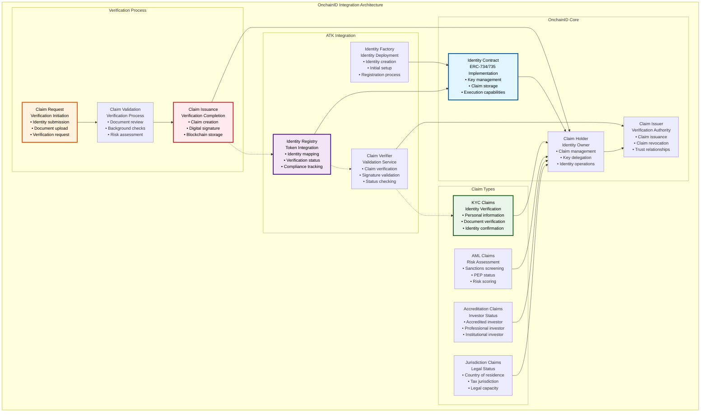
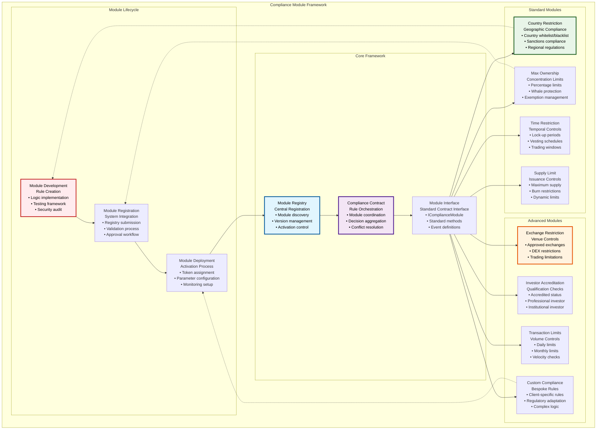

# ⚖️ Identity & Compliance System

## Executive Summary

The Identity & Compliance System forms the regulatory backbone of the Asset Tokenization Kit, implementing comprehensive KYC/AML workflows, decentralized identity management through OnchainID integration, and modular compliance frameworks. This system ensures that all tokenized assets maintain full regulatory compliance across multiple jurisdictions while providing flexible, extensible compliance rules that can adapt to evolving regulatory requirements.

Built on the ERC-3643 security token standard, the system provides real-time compliance validation, automated regulatory reporting, and sophisticated identity verification mechanisms. The modular architecture enables organizations to implement jurisdiction-specific compliance requirements while maintaining a unified identity and compliance infrastructure across all tokenized assets.

## Table of Contents

- [Executive Summary](#executive-summary)
- [Compliance Architecture](#compliance-architecture)
- [OnchainID Integration](#onchainid-integration)
- [KYC/AML Workflow System](#kycaml-workflow-system)
- [Compliance Module Framework](#compliance-module-framework)
- [Identity Registry System](#identity-registry-system)
- [Claim Management](#claim-management)
- [Transfer Validation Engine](#transfer-validation-engine)
- [Regulatory Reporting](#regulatory-reporting)
- [Jurisdiction-Specific Rules](#jurisdiction-specific-rules)
- [Audit Trail and Monitoring](#audit-trail-and-monitoring)
- [Privacy and Data Protection](#privacy-and-data-protection)
- [Integration Patterns](#integration-patterns)
- [Related Resources](#related-resources)

## Compliance Architecture

The Identity & Compliance System implements a layered architecture that separates identity management, compliance rule enforcement, and regulatory reporting:

```mermaid
graph TB
    subgraph "Identity & Compliance Architecture"
        subgraph "Identity Layer"
            OnchainID[OnchainID Protocol<br/>Decentralized Identity<br/>• Identity creation<br/>• Key management<br/>• Claim storage]
            
            IdentityRegistry[Identity Registry<br/>Token-Specific Registry<br/>• Identity registration<br/>• Verification status<br/>• Claim requirements]
            
            ClaimIssuers[Trusted Claim Issuers<br/>Verification Authorities<br/>• KYC providers<br/>• AML services<br/>• Regulatory bodies]
        end
        
        subgraph "Compliance Layer"
            ComplianceContract[Compliance Contract<br/>Rule Engine<br/>• Transfer validation<br/>• Rule enforcement<br/>• Compliance reporting]
            
            ComplianceModules[Compliance Modules<br/>Pluggable Rules<br/>• Country restrictions<br/>• Investor limits<br/>• Time-based rules]
            
            ModuleRegistry[Module Registry<br/>Module Management<br/>• Module registration<br/>• Version control<br/>• Activation status]
        end
        
        subgraph "Validation Layer"
            TransferValidator[Transfer Validator<br/>Pre-Transfer Checks<br/>• Identity verification<br/>• Compliance rules<br/>• Business logic]
            
            ClaimValidator[Claim Validator<br/>Claim Verification<br/>• Claim authenticity<br/>• Expiration checking<br/>• Revocation status]
            
            RuleEngine[Rule Engine<br/>Decision Making<br/>• Rule evaluation<br/>• Conflict resolution<br/>• Decision logging]
        end
        
        subgraph "Reporting Layer"
            AuditTrail[Audit Trail<br/>Immutable Records<br/>• Transaction logs<br/>• Access records<br/>• Compliance events]
            
            RegulatoryReports[Regulatory Reports<br/>Automated Reporting<br/>• Transaction reports<br/>• Holdings reports<br/>• Violation reports]
            
            MonitoringSystem[Monitoring System<br/>Real-Time Oversight<br/>• Suspicious activity<br/>• Pattern detection<br/>• Alert generation]
        end
    end
    
    %% Identity flow
    OnchainID --> IdentityRegistry
    IdentityRegistry --> ClaimIssuers
    ClaimIssuers --> ComplianceContract
    
    %% Compliance flow
    ComplianceContract --> ComplianceModules
    ComplianceModules --> ModuleRegistry
    ModuleRegistry --> TransferValidator
    
    %% Validation flow
    TransferValidator --> ClaimValidator
    ClaimValidator --> RuleEngine
    RuleEngine --> AuditTrail
    
    %% Reporting flow
    AuditTrail --> RegulatoryReports
    RegulatoryReports --> MonitoringSystem
    
    %% Cross-references
    IdentityRegistry -.-> ClaimValidator
    ComplianceModules -.-> RuleEngine
    TransferValidator -.-> AuditTrail
    
    %% Styling
    style OnchainID fill:#e1f5fe,stroke:#01579b,color:#000000,stroke-width:3px
    style ComplianceContract fill:#f3e5f5,stroke:#4a148c,color:#000000,stroke-width:3px
    style TransferValidator fill:#e8f5e8,stroke:#1b5e20,color:#000000,stroke-width:3px
    style AuditTrail fill:#fff3e0,stroke:#e65100,color:#000000,stroke-width:3px
    style MonitoringSystem fill:#ffebee,stroke:#c62828,color:#000000,stroke-width:3px
```

The architecture provides clear separation between identity verification, compliance rule enforcement, and regulatory reporting while maintaining tight integration for real-time compliance validation.

## OnchainID Integration

The system integrates deeply with the OnchainID protocol for decentralized identity management and claim-based verification:

### OnchainID Implementation Specifications

| Component | Implementation | Purpose | Standards Compliance | Integration Points |
|-----------|----------------|---------|---------------------|-------------------|
| **Identity Contract** | ERC-734/735 compatible | Key and claim management | ERC-734, ERC-735 | Identity registry, claim verification |
| **Claim Issuance** | Digital signature-based | Attestation creation | ERC-735 claims | KYC providers, regulatory bodies |
| **Claim Verification** | Cryptographic validation | Claim authenticity | Digital signature standards | Transfer validation, compliance checks |
| **Identity Registry** | Token-specific mapping | Identity-token association | ERC-3643 requirements | Token contracts, compliance modules |

### Claim Topic Registry

| Claim Topic | Topic ID | Claim Type | Issuer Requirements | Validity Period |
|-------------|----------|------------|-------------------|-----------------|
| **KYC Verification** | 1 | Identity verification | Licensed KYC provider | 12 months |
| **AML Screening** | 2 | Risk assessment | AML service provider | 6 months |
| **Accredited Investor** | 3 | Investment qualification | Financial institution | 24 months |
| **Country of Residence** | 4 | Jurisdiction verification | Government agency | 12 months |
| **Professional Investor** | 5 | Professional status | Regulatory authority | 36 months |
| **Sanctions Screening** | 6 | Sanctions check | Sanctions database provider | 3 months |
| **Tax Status** | 7 | Tax classification | Tax authority | 12 months |
| **Corporate Status** | 8 | Entity verification | Corporate registry | 12 months |

### Identity Lifecycle Management

| Phase | Duration | Process | Stakeholders | Automation Level |
|-------|----------|---------|--------------|------------------|
| **Identity Creation** | Immediate | OnchainID deployment | User, system | Fully automated |
| **Initial Verification** | 1-5 days | KYC/AML process | User, KYC provider | Semi-automated |
| **Claim Issuance** | 1-2 days | Claim creation and signing | KYC provider, system | Automated |
| **Ongoing Monitoring** | Continuous | Claim validity monitoring | System, claim issuers | Fully automated |
| **Claim Renewal** | Pre-expiration | Re-verification process | User, KYC provider | Semi-automated |
| **Claim Revocation** | As needed | Claim invalidation | Claim issuer, system | Automated |

## KYC/AML Workflow System

The system implements comprehensive KYC/AML workflows that integrate with traditional compliance providers while maintaining blockchain transparency:

```mermaid
graph TB
    subgraph "KYC/AML Workflow System"
        subgraph "User Onboarding"
            RegistrationForm[Registration Form<br/>Initial Data Collection<br/>• Personal information<br/>• Contact details<br/>• Identity documents]
            
            DocumentUpload[Document Upload<br/>Identity Verification<br/>• Government ID<br/>• Proof of address<br/>• Additional documents]
            
            BiometricCapture[Biometric Capture<br/>Liveness Verification<br/>• Facial recognition<br/>• Liveness detection<br/>• Document matching]
        end
        
        subgraph "Verification Process"
            AutomatedChecks[Automated Checks<br/>Initial Validation<br/>• Document authenticity<br/>• Data consistency<br/>• Watchlist screening]
            
            ManualReview[Manual Review<br/>Human Verification<br/>• Complex cases<br/>• Edge cases<br/>• Final approval]
            
            RiskAssessment[Risk Assessment<br/>AML Evaluation<br/>• Risk scoring<br/>• PEP screening<br/>• Sanctions check]
        end
        
        subgraph "Decision Engine"
            RiskScoring[Risk Scoring<br/>Automated Assessment<br/>• Risk calculation<br/>• Threshold evaluation<br/>• Decision recommendation]
            
            ComplianceDecision[Compliance Decision<br/>Final Determination<br/>• Approval/rejection<br/>• Risk classification<br/>• Monitoring level]
            
            ClaimGeneration[Claim Generation<br/>Attestation Creation<br/>• KYC claim creation<br/>• AML claim creation<br/>• Digital signing]
        end
        
        subgraph "Ongoing Monitoring"
            TransactionMonitoring[Transaction Monitoring<br/>Continuous Oversight<br/>• Pattern analysis<br/>• Anomaly detection<br/>• Suspicious activity]
            
            PeriodicReview[Periodic Review<br/>Regular Assessment<br/>• Claim renewal<br/>• Risk reassessment<br/>• Profile updates]
            
            AlertManagement[Alert Management<br/>Issue Handling<br/>• Alert investigation<br/>• Case management<br/>• Regulatory reporting]
        end
    end
    
    %% Onboarding flow
    RegistrationForm --> DocumentUpload
    DocumentUpload --> BiometricCapture
    
    %% Verification flow
    BiometricCapture --> AutomatedChecks
    AutomatedChecks --> ManualReview
    ManualReview --> RiskAssessment
    
    %% Decision flow
    RiskAssessment --> RiskScoring
    RiskScoring --> ComplianceDecision
    ComplianceDecision --> ClaimGeneration
    
    %% Monitoring flow
    ClaimGeneration --> TransactionMonitoring
    TransactionMonitoring --> PeriodicReview
    PeriodicReview --> AlertManagement
    
    %% Feedback loops
    AlertManagement -.-> RiskAssessment
    PeriodicReview -.-> ComplianceDecision
    TransactionMonitoring -.-> AlertManagement
    
    %% Styling
    style RegistrationForm fill:#e1f5fe,stroke:#01579b,color:#000000,stroke-width:3px
    style AutomatedChecks fill:#f3e5f5,stroke:#4a148c,color:#000000,stroke-width:3px
    style RiskScoring fill:#e8f5e8,stroke:#1b5e20,color:#000000,stroke-width:3px
    style TransactionMonitoring fill:#fff3e0,stroke:#e65100,color:#000000,stroke-width:3px
    style AlertManagement fill:#ffebee,stroke:#c62828,color:#000000,stroke-width:3px
```

### KYC/AML Process Specifications

| Process Stage | Duration | Automation Level | Success Rate | Escalation Triggers |
|---------------|----------|------------------|--------------|-------------------|
| **Document Collection** | 5-15 minutes | Fully automated | 95% | Missing documents, quality issues |
| **Automated Verification** | 2-5 minutes | Fully automated | 85% | Document inconsistencies, watchlist hits |
| **Manual Review** | 2-24 hours | Human-driven | 98% | Complex cases, regulatory requirements |
| **Risk Assessment** | 1-10 minutes | Automated + manual | 92% | High-risk indicators, PEP status |
| **Final Decision** | Immediate | Rule-based | 99% | Edge cases, regulatory approval needed |
| **Claim Issuance** | 1-5 minutes | Fully automated | 99.9% | Technical errors, signature failures |

### Risk Assessment Framework

| Risk Category | Risk Factors | Scoring Method | Weight | Threshold Actions |
|---------------|--------------|----------------|--------|-------------------|
| **Geographic Risk** | Country of residence, sanctions | Jurisdiction-based scoring | 25% | Country restrictions, enhanced monitoring |
| **Identity Risk** | Document quality, verification | Document analysis scoring | 20% | Additional verification, manual review |
| **Financial Risk** | Transaction patterns, amounts | Behavioral analysis | 25% | Transaction limits, monitoring |
| **Regulatory Risk** | PEP status, sanctions | Binary classification | 30% | Enhanced due diligence, approval required |

### Compliance Provider Integration

| Provider Type | Integration Method | Data Exchange | Security | Compliance Standards |
|---------------|-------------------|---------------|----------|-------------------|
| **KYC Providers** | API integration | Encrypted data transfer | OAuth 2.0, TLS 1.3 | ISO 27001, SOC 2 |
| **AML Services** | Real-time API | Structured data queries | API keys, rate limiting | FATF recommendations |
| **Sanctions Databases** | Batch and real-time | Watchlist screening | Secure file transfer | OFAC, EU sanctions |
| **Document Verification** | OCR and AI services | Document image analysis | End-to-end encryption | GDPR, privacy regulations |

## Compliance Module Framework

The system implements a modular compliance framework that allows for flexible, pluggable compliance rules:

### Module Interface Specifications

| Method | Purpose | Parameters | Return Value | Gas Cost |
|--------|---------|------------|--------------|----------|
| **canCompute()** | Pre-validation check | from, to, value, compliance | bool canTransfer | ~8,000 gas |
| **moduleTransferAction()** | Post-transfer action | from, to, value | none (state update) | ~15,000 gas |
| **moduleMintAction()** | Post-mint action | to, value | none (state update) | ~10,000 gas |
| **moduleBurnAction()** | Post-burn action | from, value | none (state update) | ~8,000 gas |
| **isPlugAndPlay()** | Module compatibility | none | bool compatibility | ~2,000 gas |
| **name()** | Module identification | none | string name | ~3,000 gas |

### Standard Module Configurations

| Module Type | Configuration Parameters | Default Values | Update Permissions | Validation Rules |
|-------------|--------------------------|----------------|-------------------|------------------|
| **Country Restriction** | Allowed countries, blocked countries | All allowed | COMPLIANCE_ADMIN | Valid country codes |
| **Max Ownership** | Maximum percentage, exempted addresses | 10% | COMPLIANCE_ADMIN | 0-100%, valid addresses |
| **Time Restriction** | Lock periods, release schedules | No restrictions | COMPLIANCE_ADMIN | Future timestamps |
| **Supply Limit** | Maximum supply, burn permissions | Unlimited | TOKEN_ADMIN | Positive values |
| **Exchange Restriction** | Approved exchanges, DEX whitelist | All allowed | COMPLIANCE_ADMIN | Valid addresses |
| **Investor Accreditation** | Required accreditation levels | None required | COMPLIANCE_ADMIN | Valid claim topics |

### Module Development Guidelines

| Development Phase | Requirements | Validation | Testing | Security |
|------------------|--------------|------------|---------|----------|
| **Design Phase** | Business requirements, regulatory analysis | Legal review | N/A | Threat modeling |
| **Implementation** | Solidity development, interface compliance | Code review | Unit tests | Static analysis |
| **Integration** | Module registration, parameter configuration | Integration testing | System tests | Dynamic analysis |
| **Deployment** | Production deployment, monitoring setup | Operational review | End-to-end tests | Security audit |

## Identity Registry System

The Identity Registry System manages the relationship between blockchain addresses and OnchainID identities:

### Registry Architecture

| Registry Component | Purpose | Data Structure | Access Control | Integration Points |
|-------------------|---------|----------------|----------------|-------------------|
| **Identity Registry** | Address-identity mapping | Mapping(address => Identity) | REGISTRY_ADMIN_ROLE | Token contracts, compliance modules |
| **Claim Topics Registry** | Required claim definitions | Mapping(uint256 => ClaimTopic) | CLAIM_ADMIN_ROLE | Identity verification, compliance |
| **Trusted Issuers Registry** | Authorized claim issuers | Mapping(uint256 => Issuer[]) | ISSUER_ADMIN_ROLE | Claim verification, trust management |
| **Identity Storage** | Identity metadata | Struct IdentityInfo | IDENTITY_ADMIN_ROLE | User management, reporting |

### Registry Operations

| Operation | Function | Parameters | Access Control | Gas Cost |
|-----------|----------|------------|----------------|----------|
| **Register Identity** | `registerIdentity()` | userAddress, identity, country | REGISTRY_ADMIN | ~45,000 gas |
| **Update Identity** | `updateIdentity()` | userAddress, identity | REGISTRY_ADMIN | ~25,000 gas |
| **Update Country** | `updateCountry()` | userAddress, country | REGISTRY_ADMIN | ~15,000 gas |
| **Delete Identity** | `deleteIdentity()` | userAddress | REGISTRY_ADMIN | ~20,000 gas |
| **Batch Register** | `batchRegisterIdentity()` | addresses[], identities[] | REGISTRY_ADMIN | ~35,000 gas per identity |
| **Is Verified** | `isVerified()` | userAddress | Public | ~8,000 gas |

### Identity Verification Status

| Verification Level | Requirements | Capabilities | Monitoring | Renewal Period |
|-------------------|--------------|--------------|------------|----------------|
| **Unverified** | None | No token operations | Basic logging | N/A |
| **Basic KYC** | Identity verification | Limited operations | Standard monitoring | 12 months |
| **Enhanced KYC** | Identity + AML screening | Standard operations | Enhanced monitoring | 12 months |
| **Accredited** | Accreditation verification | All operations | Premium monitoring | 24 months |
| **Institutional** | Corporate verification | Bulk operations | Institutional monitoring | 12 months |

## Claim Management

The system provides comprehensive claim management capabilities for maintaining and validating identity attestations:

### Claim Lifecycle Management

| Phase | Duration | Process | Stakeholders | Automation |
|-------|----------|---------|--------------|------------|
| **Claim Request** | Immediate | User initiates verification | User, system | Automated |
| **Verification Process** | 1-5 days | KYC/AML verification | User, KYC provider | Semi-automated |
| **Claim Issuance** | 1-2 hours | Claim creation and signing | KYC provider, system | Automated |
| **Claim Validation** | Continuous | Ongoing claim verification | System, validators | Automated |
| **Claim Renewal** | 30 days before expiry | Re-verification process | User, KYC provider | Semi-automated |
| **Claim Revocation** | As needed | Claim invalidation | Issuer, system | Automated |

### Claim Validation Framework

| Validation Type | Method | Frequency | Failure Action | Recovery Process |
|-----------------|--------|-----------|----------------|------------------|
| **Signature Validation** | Cryptographic verification | Every access | Reject transaction | Re-issue claim |
| **Expiration Check** | Timestamp comparison | Every access | Require renewal | Renewal process |
| **Revocation Check** | Issuer query | Periodic | Invalidate claim | New verification |
| **Issuer Trust** | Trust registry lookup | Every access | Reject claim | Trusted issuer verification |

### Claim Storage and Privacy

| Data Category | Storage Method | Encryption | Access Control | Retention Policy |
|---------------|----------------|------------|----------------|------------------|
| **Claim Hashes** | On-chain storage | SHA-256 hash | Public readable | Permanent |
| **Claim Data** | Off-chain storage | AES-256 encryption | Permissioned access | Regulatory retention |
| **Personal Information** | Encrypted IPFS | End-to-end encryption | User-controlled | User-defined |
| **Verification Results** | On-chain events | No encryption | Public events | Permanent |

## Transfer Validation Engine

The Transfer Validation Engine performs real-time compliance checks for all token transfers:

```mermaid
graph TB
    subgraph "Transfer Validation Engine"
        subgraph "Pre-Transfer Validation"
            IdentityCheck[Identity Verification<br/>Sender & Receiver<br/>• Identity existence<br/>• Verification status<br/>• Claim validity]
            
            ComplianceRules[Compliance Rules<br/>Module Execution<br/>• Country restrictions<br/>• Ownership limits<br/>• Time restrictions]
            
            BusinessLogic[Business Logic<br/>Token-Specific Rules<br/>• Transfer limits<br/>• Approval requirements<br/>• Custom restrictions]
        end
        
        subgraph "Validation Process"
            RuleAggregation[Rule Aggregation<br/>Decision Synthesis<br/>• Multiple module results<br/>• Conflict resolution<br/>• Final decision]
            
            ValidationCache[Validation Cache<br/>Performance Optimization<br/>• Result caching<br/>• Cache invalidation<br/>• Performance tuning]
            
            DecisionLogging[Decision Logging<br/>Audit Trail<br/>• Validation results<br/>• Rule execution<br/>• Decision rationale]
        end
        
        subgraph "Transfer Execution"
            TransferApproval[Transfer Approval<br/>Execution Authorization<br/>• Validation passed<br/>• Transfer execution<br/>• State updates]
            
            TransferRejection[Transfer Rejection<br/>Execution Denial<br/>• Validation failed<br/>• Error reporting<br/>• User notification]
            
            PostTransferActions[Post-Transfer Actions<br/>Compliance Updates<br/>• Module notifications<br/>• State synchronization<br/>• Event emission]
        end
        
        subgraph "Monitoring & Reporting"
            TransactionMonitoring[Transaction Monitoring<br/>Pattern Analysis<br/>• Suspicious patterns<br/>• Anomaly detection<br/>• Risk scoring]
            
            ComplianceReporting[Compliance Reporting<br/>Regulatory Reports<br/>• Transaction reports<br/>• Violation reports<br/>• Statistical analysis]
            
            AlertGeneration[Alert Generation<br/>Issue Detection<br/>• Compliance violations<br/>• Suspicious activity<br/>• System alerts]
        end
    end
    
    %% Pre-transfer validation flow
    IdentityCheck --> ComplianceRules
    ComplianceRules --> BusinessLogic
    
    %% Validation process
    BusinessLogic --> RuleAggregation
    RuleAggregation --> ValidationCache
    ValidationCache --> DecisionLogging
    
    %% Transfer execution
    DecisionLogging --> TransferApproval
    DecisionLogging --> TransferRejection
    TransferApproval --> PostTransferActions
    TransferRejection --> PostTransferActions
    
    %% Monitoring and reporting
    PostTransferActions --> TransactionMonitoring
    TransactionMonitoring --> ComplianceReporting
    ComplianceReporting --> AlertGeneration
    
    %% Feedback loops
    AlertGeneration -.-> IdentityCheck
    TransactionMonitoring -.-> ComplianceRules
    ComplianceReporting -.-> RuleAggregation
    
    %% Styling
    style IdentityCheck fill:#e1f5fe,stroke:#01579b,color:#000000,stroke-width:3px
    style ComplianceRules fill:#f3e5f5,stroke:#4a148c,color:#000000,stroke-width:3px
    style RuleAggregation fill:#e8f5e8,stroke:#1b5e20,color:#000000,stroke-width:3px
    style TransferApproval fill:#fff3e0,stroke:#e65100,color:#000000,stroke-width:3px
    style TransactionMonitoring fill:#ffebee,stroke:#c62828,color:#000000,stroke-width:3px
```

### Validation Performance Specifications

| Validation Step | Target Time | Current Performance | Optimization | Scaling Strategy |
|-----------------|-------------|-------------------|--------------|------------------|
| **Identity Verification** | <100ms | ~75ms | Claim caching | Distributed cache |
| **Compliance Rules** | <200ms | ~150ms | Module optimization | Parallel execution |
| **Rule Aggregation** | <50ms | ~35ms | Decision caching | Result memoization |
| **Decision Logging** | <25ms | ~20ms | Batch logging | Async processing |
| **Total Validation** | <500ms | ~350ms | End-to-end optimization | Microservice architecture |

### Error Handling and Recovery

| Error Type | Detection Method | Error Response | Recovery Action | User Communication |
|------------|------------------|----------------|-----------------|-------------------|
| **Identity Not Found** | Registry lookup | Transaction rejection | Identity registration | Clear error message |
| **Expired Claims** | Timestamp validation | Transaction rejection | Claim renewal | Renewal instructions |
| **Compliance Violation** | Rule evaluation | Transaction rejection | Compliance resolution | Violation explanation |
| **System Error** | Exception handling | Transaction rejection | System recovery | Technical support |
| **Network Issues** | Timeout detection | Retry mechanism | Automatic retry | Status updates |

## Regulatory Reporting

The system provides comprehensive regulatory reporting capabilities for compliance and audit requirements:

### Reporting Framework

| Report Type | Frequency | Recipients | Content | Delivery Method |
|-------------|-----------|------------|---------|-----------------|
| **Transaction Reports** | Daily | Regulators | All token transfers | Secure file transfer |
| **Holdings Reports** | Monthly | Regulators | Token holder positions | Encrypted email |
| **Compliance Reports** | Quarterly | Regulators | Compliance metrics | Regulatory portal |
| **Violation Reports** | As needed | Regulators | Compliance violations | Immediate notification |
| **Statistical Reports** | Monthly | Internal | System statistics | Internal dashboard |
| **Audit Reports** | Annually | Auditors | Complete audit trail | Secure data room |

### Report Generation Process

| Phase | Duration | Process | Automation | Quality Control |
|-------|----------|---------|------------|-----------------|
| **Data Collection** | 1-2 hours | Blockchain data extraction | Fully automated | Data validation |
| **Data Processing** | 30-60 minutes | Report compilation | Fully automated | Format validation |
| **Quality Assurance** | 15-30 minutes | Report verification | Semi-automated | Manual review |
| **Report Distribution** | 5-10 minutes | Secure delivery | Fully automated | Delivery confirmation |
| **Archive Storage** | Immediate | Long-term storage | Fully automated | Integrity verification |

### Compliance Metrics Tracking

| Metric Category | Key Metrics | Calculation Method | Reporting Frequency | Benchmark Targets |
|-----------------|-------------|-------------------|-------------------|-------------------|
| **Transaction Compliance** | Compliance rate, violation count | Automated calculation | Real-time | >99.9% compliance |
| **Identity Verification** | Verification rate, pending verifications | Database queries | Daily | >95% verified |
| **Claim Validity** | Valid claims, expired claims | Claim validation | Daily | >98% valid claims |
| **System Performance** | Response time, availability | System monitoring | Real-time | <500ms, >99.9% uptime |
| **Regulatory Coverage** | Jurisdiction coverage, rule coverage | Configuration analysis | Monthly | 100% coverage |

## Jurisdiction-Specific Rules

The system supports jurisdiction-specific compliance rules to meet local regulatory requirements:

### Jurisdiction Configuration Matrix

| Jurisdiction | Regulatory Framework | KYC Requirements | AML Requirements | Specific Rules |
|-------------|---------------------|------------------|------------------|----------------|
| **United States** | SEC, FINRA, BSA | Enhanced KYC | PATRIOT Act compliance | Accredited investor rules |
| **European Union** | MiCA, GDPR, AML5 | Standard KYC | Enhanced AML | Data protection, right to be forgotten |
| **United Kingdom** | FCA, MLR 2017 | Standard KYC | Standard AML | Professional investor classification |
| **Singapore** | MAS, PSAA | Enhanced KYC | Standard AML | Qualified investor requirements |
| **Japan** | FIEA, JVCEA | Standard KYC | Enhanced AML | Crypto asset regulations |
| **Canada** | CSA, FINTRAC | Standard KYC | Standard AML | Provincial securities laws |

### Rule Implementation Framework

| Rule Category | Implementation Method | Configuration | Update Frequency | Compliance Validation |
|---------------|----------------------|---------------|------------------|---------------------|
| **Geographic Restrictions** | Country-based modules | Country whitelist/blacklist | Quarterly | Sanctions list updates |
| **Investor Classifications** | Claim-based verification | Accreditation requirements | Annually | Regulatory updates |
| **Transaction Limits** | Amount-based restrictions | Jurisdiction-specific limits | As needed | Regulatory changes |
| **Reporting Requirements** | Automated report generation | Report templates | Quarterly | Regulatory feedback |
| **Data Protection** | Privacy-preserving design | Data handling rules | As needed | Privacy audits |

### Multi-Jurisdiction Compliance

| Scenario | Compliance Approach | Conflict Resolution | Implementation | Monitoring |
|----------|-------------------|-------------------|----------------|------------|
| **Cross-Border Transfers** | Most restrictive rule | Jurisdiction priority | Rule hierarchy | Real-time validation |
| **Regulatory Conflicts** | Legal precedence | Regulatory consultation | Manual review | Legal monitoring |
| **Data Residency** | Geographic data storage | Data localization | Technical implementation | Compliance audits |
| **Reporting Obligations** | Multiple reports | Report aggregation | Automated generation | Regulatory feedback |

## Audit Trail and Monitoring

The system maintains comprehensive audit trails and monitoring capabilities for regulatory compliance and security:

### Audit Trail Architecture

| Event Category | Data Captured | Storage Method | Retention Period | Access Control |
|----------------|---------------|----------------|------------------|----------------|
| **Identity Events** | Registration, updates, deletions | Immutable logs | 7 years | Audit access only |
| **Compliance Events** | Validation results, violations | Blockchain events | Permanent | Regulatory access |
| **Transfer Events** | All token transfers | Blockchain transactions | Permanent | Public access |
| **Administrative Events** | System configuration changes | Secure logs | 7 years | Admin access only |
| **Security Events** | Access attempts, failures | Security logs | 7 years | Security team access |

### Monitoring Capabilities

| Monitoring Type | Scope | Frequency | Alert Thresholds | Response Actions |
|-----------------|-------|-----------|------------------|------------------|
| **Real-time Monitoring** | All transactions | Continuous | Immediate violations | Automatic alerts |
| **Pattern Analysis** | Transaction patterns | Daily | Suspicious patterns | Investigation alerts |
| **Performance Monitoring** | System performance | Continuous | Performance degradation | Operational alerts |
| **Compliance Monitoring** | Regulatory compliance | Continuous | Compliance violations | Regulatory alerts |
| **Security Monitoring** | Security events | Continuous | Security incidents | Security response |

### Investigative Tools

| Tool Type | Capabilities | Access Level | Use Cases | Data Sources |
|-----------|--------------|--------------|-----------|-------------|
| **Transaction Tracer** | End-to-end transaction tracking | Compliance officers | Suspicious activity investigation | Blockchain data |
| **Pattern Analyzer** | Behavioral pattern analysis | Risk analysts | AML investigations | Transaction history |
| **Compliance Dashboard** | Real-time compliance metrics | Management | Oversight and reporting | System-wide data |
| **Audit Exporter** | Comprehensive data export | Auditors | Regulatory audits | Complete audit trail |

## Privacy and Data Protection

The system implements privacy-preserving technologies while maintaining regulatory compliance:

### Privacy Framework

| Privacy Principle | Implementation | Technology | Compliance | User Control |
|------------------|----------------|------------|------------|--------------|
| **Data Minimization** | Collect only necessary data | Selective disclosure | GDPR compliance | User consent |
| **Purpose Limitation** | Use data only for stated purpose | Access controls | Privacy regulations | Purpose specification |
| **Storage Limitation** | Retain data only as needed | Automated deletion | Retention policies | Data deletion requests |
| **Transparency** | Clear data usage policies | Privacy notices | Transparency requirements | Privacy dashboard |
| **User Control** | User data management | Self-sovereign identity | Data subject rights | User portal |

### Zero-Knowledge Compliance

| Use Case | ZK Implementation | Privacy Benefit | Compliance Maintained | Technical Complexity |
|----------|-------------------|-----------------|----------------------|---------------------|
| **Age Verification** | ZK age proofs | Hide exact age | Age requirement compliance | Medium |
| **Income Verification** | ZK income proofs | Hide exact income | Accreditation compliance | High |
| **Jurisdiction Proof** | ZK residency proofs | Hide exact location | Geographic compliance | Medium |
| **Identity Verification** | ZK identity proofs | Hide personal details | KYC compliance | High |

### Data Protection Controls

| Control Type | Implementation | Scope | Effectiveness | Compliance Standards |
|--------------|----------------|-------|---------------|-------------------|
| **Encryption at Rest** | AES-256 encryption | All stored data | High | GDPR, CCPA |
| **Encryption in Transit** | TLS 1.3 | All data transmission | High | Industry standards |
| **Access Controls** | RBAC + MFA | All system access | High | ISO 27001 |
| **Data Anonymization** | K-anonymity | Analytics data | Medium | Privacy regulations |
| **Right to Erasure** | Cryptographic deletion | Personal data | High | GDPR compliance |

## Integration Patterns

The Identity & Compliance System supports various integration patterns for different deployment scenarios:

### Integration Scenarios

| Scenario | Implementation | Requirements | Considerations | Examples |
|----------|----------------|--------------|----------------|----------|
| **Standalone Deployment** | Independent system | Complete infrastructure | Full responsibility | Private tokenization |
| **Third-Party KYC** | External KYC integration | API integration | Data privacy | Enterprise KYC providers |
| **Regulatory Sandbox** | Sandbox-specific rules | Regulatory approval | Limited scope | Regulatory testing |
| **Cross-Chain** | Multi-chain identity | Bridge contracts | Consistency | Multi-network tokens |
| **Legacy Integration** | Traditional system bridge | Data transformation | Migration strategy | Existing compliance systems |

### API Integration Points

| Integration Point | Interface | Data Format | Security | Rate Limits |
|------------------|-----------|-------------|----------|-------------|
| **Identity Management** | REST API | JSON | OAuth 2.0 | 1000 req/hour |
| **Compliance Validation** | Smart contract calls | ABI encoded | Transaction signing | Gas limits |
| **Reporting Interface** | GraphQL API | Structured queries | API keys | 100 queries/hour |
| **Webhook Notifications** | HTTP callbacks | JSON payloads | HMAC signatures | Event-driven |
| **Bulk Operations** | Batch API | CSV/JSON | Service accounts | Bulk limits |

### Third-Party Integrations

| Integration Type | Partners | Data Exchange | Standards | Certification |
|-----------------|----------|---------------|-----------|---------------|
| **KYC Providers** | Jumio, Onfido, Veriff | Identity verification data | OpenID Connect | SOC 2 Type II |
| **AML Services** | Chainalysis, Elliptic | Transaction analysis | FATF standards | Regulatory approval |
| **Identity Providers** | Civic, SelfKey | Decentralized identity | W3C DID | Privacy certification |
| **Compliance Platforms** | ComplyAdvantage, Thomson Reuters | Regulatory data | Industry standards | Regulatory recognition |

## Related Resources

### Core Implementation Files

- **Identity Contracts**: [`kit/contracts/contracts/onchainid/`](../../contracts/contracts/onchainid/) - Complete OnchainID integration
- **Compliance System**: [`kit/contracts/contracts/smart/compliance/`](../../contracts/contracts/smart/compliance/) - Compliance framework
- **Identity Registry**: [`kit/contracts/contracts/onchainid/registry/`](../../contracts/contracts/onchainid/registry/) - Registry implementation

### Compliance Modules

- **Compliance Modules**: [`kit/contracts/contracts/smart/compliance/modules/`](../../contracts/contracts/smart/compliance/modules/) - Standard compliance modules
- **Module Registry**: [`kit/contracts/contracts/smart/compliance/registry/`](../../contracts/contracts/smart/compliance/registry/) - Module management

### Frontend Integration

- **KYC Components**: [`kit/dapp/src/components/kyc/`](../../dapp/src/components/kyc/) - KYC form components
- **Identity Components**: [`kit/dapp/src/components/identity/`](../../dapp/src/components/identity/) - Identity management UI
- **Compliance Components**: [`kit/dapp/src/components/compliance/`](../../dapp/src/components/compliance/) - Compliance interface

### API Integration

- **Compliance APIs**: [`kit/dapp/src/orpc/routes/compliance/`](../../dapp/src/orpc/routes/compliance/) - Compliance API procedures
- **User APIs**: [`kit/dapp/src/orpc/routes/user/`](../../dapp/src/orpc/routes/user/) - User management APIs
- **Identity Services**: [`kit/dapp/src/lib/identity/`](../../dapp/src/lib/identity/) - Identity service integration

### Testing and Validation

- **Compliance Tests**: [`kit/contracts/test/smart/compliance/`](../../contracts/test/smart/compliance/) - Compliance testing
- **Identity Tests**: [`kit/contracts/test/onchainid/`](../../contracts/test/onchainid/) - Identity system testing
- **Integration Tests**: [`kit/e2e/ui-tests/`](../../e2e/ui-tests/) - End-to-end compliance testing

### Documentation Navigation

- **Previous**: [06 - Asset Token Contracts](./06-asset-token-contracts.md) - Asset implementations
- **Next**: [08 - Addon System Architecture](./08-addon-system-architecture.md) - System addons
- **Related**: [02 - SMART Protocol Foundation](./02-smart-protocol-foundation.md) - Protocol foundation
- **Related**: [28 - Regulatory Reporting Compliance Architecture](./28-regulatory-reporting-compliance-architecture.md) - Regulatory reporting

### External Standards and References

- **ERC-3643 Standard**: [https://eips.ethereum.org/EIPS/eip-3643](https://eips.ethereum.org/EIPS/eip-3643) - Security token standard
- **ERC-734 Identity**: [https://eips.ethereum.org/EIPS/eip-734](https://eips.ethereum.org/EIPS/eip-734) - Key management standard
- **ERC-735 Claims**: [https://eips.ethereum.org/EIPS/eip-735](https://eips.ethereum.org/EIPS/eip-735) - Claim holder standard
- **OnchainID Documentation**: [https://onchainid.com](https://onchainid.com) - Decentralized identity protocol
