# 🔧 Addon System Architecture

## Executive Summary

The Addon System Architecture provides modular, extensible functionality that enhances the core Asset Tokenization Kit with specialized operational tools. These addons include sophisticated token distribution mechanisms (Airdrops), multi-signature treasury management (Vaults), atomic cross-value proposition settlements (XvP), automated yield scheduling, and token sale mechanisms. Each addon is designed as an independent, reusable component that integrates seamlessly with the ATK System infrastructure.

The addon architecture follows enterprise-grade design patterns with factory-based deployment, proxy-based upgradeability, and comprehensive access controls. This modular approach enables organizations to selectively deploy only the functionality they need while maintaining the ability to add new capabilities as their tokenization requirements evolve.

## Table of Contents

- [Executive Summary](#executive-summary)
- [Addon Architecture Overview](#addon-architecture-overview)
- [Airdrop System](#airdrop-system)
- [Vault System](#vault-system)
- [Cross-Value Proposition (XvP) Settlement](#cross-value-proposition-xvp-settlement)
- [Yield Management System](#yield-management-system)
- [Token Sale System](#token-sale-system)
- [Factory Pattern Implementation](#factory-pattern-implementation)
- [Integration Framework](#integration-framework)
- [Security Architecture](#security-architecture)
- [Performance Optimization](#performance-optimization)
- [Upgrade Management](#upgrade-management)
- [Monitoring and Analytics](#monitoring-and-analytics)
- [Related Resources](#related-resources)

## Addon Architecture Overview

The Addon System follows a modular architecture that enables independent deployment and operation while maintaining integration with the core ATK System:

```mermaid
graph TB
    subgraph "Addon System Architecture"
        subgraph "Core Integration Layer"
            ATKSystem[ATK System<br/>Core Infrastructure<br/>• System coordination<br/>• Access management<br/>• Registry services]
            
            AddonRegistry[Addon Registry<br/>Addon Discovery<br/>• Addon registration<br/>• Capability mapping<br/>• Version tracking]
            
            IntegrationAPI[Integration API<br/>Standardized Interface<br/>• Common interfaces<br/>• Event coordination<br/>• State synchronization]
        end
        
        subgraph "Distribution Addons"
            AirdropSystem[Airdrop System<br/>Token Distribution<br/>• Merkle proof airdrops<br/>• Vesting schedules<br/>• Claim tracking]
            
            TokenSaleSystem[Token Sale System<br/>Fundraising Mechanisms<br/>• Public sales<br/>• Private sales<br/>• Auction mechanisms]
        end
        
        subgraph "Treasury Addons"
            VaultSystem[Vault System<br/>Multi-Signature Treasury<br/>• Multi-sig wallets<br/>• Proposal system<br/>• Emergency controls]
            
            YieldSystem[Yield System<br/>Automated Distributions<br/>• Yield scheduling<br/>• Payment automation<br/>• Performance tracking]
        end
        
        subgraph "Settlement Addons"
            XvPSystem[XvP Settlement<br/>Atomic Exchanges<br/>• Delivery vs Payment<br/>• Cross-asset swaps<br/>• Settlement finality]
            
            PaymentRails[Payment Rails<br/>External Integrations<br/>• Banking integration<br/>• Payment processing<br/>• Settlement networks]
        end
        
        subgraph "Infrastructure Services"
            ProxyManager[Proxy Manager<br/>Upgrade Coordination<br/>• Proxy deployment<br/>• Upgrade management<br/>• Version control]
            
            SecurityFramework[Security Framework<br/>Access Control<br/>• Role management<br/>• Permission enforcement<br/>• Audit trails]
            
            EventSystem[Event System<br/>Inter-Addon Communication<br/>• Event emission<br/>• Event listening<br/>• State coordination]
        end
    end
    
    %% Core integration
    ATKSystem --> AddonRegistry
    AddonRegistry --> IntegrationAPI
    IntegrationAPI --> AirdropSystem
    IntegrationAPI --> TokenSaleSystem
    IntegrationAPI --> VaultSystem
    IntegrationAPI --> YieldSystem
    IntegrationAPI --> XvPSystem
    IntegrationAPI --> PaymentRails
    
    %% Infrastructure connections
    ProxyManager --> AirdropSystem
    ProxyManager --> VaultSystem
    ProxyManager --> XvPSystem
    
    SecurityFramework --> ATKSystem
    SecurityFramework --> AddonRegistry
    
    EventSystem --> AirdropSystem
    EventSystem --> VaultSystem
    EventSystem --> YieldSystem
    
    %% Cross-addon integration
    VaultSystem -.-> YieldSystem
    AirdropSystem -.-> TokenSaleSystem
    XvPSystem -.-> PaymentRails
    
    %% Styling
    style ATKSystem fill:#e1f5fe,stroke:#01579b,color:#000000,stroke-width:3px
    style AirdropSystem fill:#f3e5f5,stroke:#4a148c,color:#000000,stroke-width:3px
    style VaultSystem fill:#e8f5e8,stroke:#1b5e20,color:#000000,stroke-width:3px
    style XvPSystem fill:#fff3e0,stroke:#e65100,color:#000000,stroke-width:3px
    style ProxyManager fill:#ffebee,stroke:#c62828,color:#000000,stroke-width:3px
```

The architecture demonstrates clear separation between different addon categories while maintaining unified integration patterns and shared infrastructure services.

## Airdrop System

The Airdrop System provides sophisticated token distribution mechanisms with multiple distribution strategies and comprehensive claim tracking:

### Airdrop Implementation Specifications

| Airdrop Type | Use Case | Claim Method | Gas Efficiency | Scalability |
|--------------|----------|--------------|----------------|-------------|
| **Push Airdrop** | Immediate distribution to known recipients | Admin-initiated batch transfer | High (batch operations) | Up to 1000 recipients per batch |
| **Time-Bound Airdrop** | Community rewards with expiration | User-initiated claims within timeframe | Medium (individual claims) | Unlimited recipients |
| **Vesting Airdrop** | Team/investor allocations with vesting | Progressive claims based on schedule | Medium (vesting calculations) | Unlimited recipients |

### Merkle Proof Configuration

| Configuration Parameter | Value Range | Default | Use Case | Security Consideration |
|------------------------|-------------|---------|----------|----------------------|
| **Tree Depth** | 10-30 levels | 20 levels | Up to 1M recipients | Proof size vs verification cost |
| **Leaf Hash Function** | SHA-256, Keccak256 | Keccak256 | Ethereum compatibility | Cryptographic security |
| **Proof Generation** | Client-side | Off-chain | Privacy preservation | Proof integrity |
| **Batch Size** | 100-10000 | 1000 | Gas optimization | Transaction limits |

### Claim Tracking Performance

| Tracker Type | Storage Efficiency | Claim Gas Cost | Query Cost | Best Use Case |
|--------------|-------------------|----------------|------------|---------------|
| **Bitmap Tracker** | 1 bit per recipient | ~30,000 gas | ~3,000 gas | Large airdrops, binary claims |
| **Amount Tracker** | 256 bits per recipient | ~45,000 gas | ~5,000 gas | Partial claims, flexible amounts |

### Vesting Schedule Examples

| Vesting Type | Schedule | Cliff Period | Vesting Duration | Release Pattern |
|--------------|----------|--------------|------------------|-----------------|
| **Linear Vesting** | 25% per quarter | 12 months | 48 months | Constant rate |
| **Cliff Vesting** | 25% at cliff, then linear | 12 months | 36 months | Delayed start |
| **Milestone Vesting** | Performance-based | Variable | Variable | Achievement-based |
| **Custom Schedule** | Defined periods | Optional | Variable | Flexible timeline |

## Vault System

The Vault System provides enterprise-grade multi-signature treasury management with sophisticated proposal and approval mechanisms:

```mermaid
graph TB
    subgraph "Vault System Architecture"
        subgraph "Multi-Signature Core"
            MultiSigWallet[Multi-Signature Wallet<br/>Secure Treasury<br/>• Multiple signers<br/>• Threshold requirements<br/>• Transaction validation]
            
            SignerManagement[Signer Management<br/>Authority Control<br/>• Signer addition/removal<br/>• Threshold updates<br/>• Role assignments]
            
            TransactionQueue[Transaction Queue<br/>Pending Operations<br/>• Transaction proposals<br/>• Approval tracking<br/>• Execution scheduling]
        end
        
        subgraph "Proposal System"
            ProposalCreation[Proposal Creation<br/>Transaction Initiation<br/>• Proposal submission<br/>• Parameter validation<br/>• Proposal metadata]
            
            ApprovalProcess[Approval Process<br/>Consensus Building<br/>• Signature collection<br/>• Approval tracking<br/>• Threshold validation]
            
            ExecutionEngine[Execution Engine<br/>Transaction Execution<br/>• Threshold validation<br/>• Transaction execution<br/>• Result confirmation]
        end
        
        subgraph "Asset Management"
            TokenManagement[Token Management<br/>Multi-Asset Support<br/>• ERC-20 tokens<br/>• Native assets<br/>• NFT support]
            
            BalanceTracking[Balance Tracking<br/>Treasury Monitoring<br/>• Real-time balances<br/>• Historical tracking<br/>• Asset allocation]
            
            TransferControls[Transfer Controls<br/>Movement Restrictions<br/>• Daily limits<br/>• Approval requirements<br/>• Emergency controls]
        end
        
        subgraph "Governance Integration"
            VotingIntegration[Voting Integration<br/>Governance Participation<br/>• Proposal voting<br/>• Delegation support<br/>• Vote execution]
            
            PolicyManagement[Policy Management<br/>Treasury Policies<br/>• Investment policies<br/>• Risk management<br/>• Compliance rules]
            
            ReportingSystem[Reporting System<br/>Treasury Reporting<br/>• Transaction reports<br/>• Balance reports<br/>• Performance analytics]
        end
        
        subgraph "Security Features"
            EmergencyControls[Emergency Controls<br/>Crisis Management<br/>• Emergency pause<br/>• Recovery procedures<br/>• Guardian access]
            
            AuditTrail[Audit Trail<br/>Complete History<br/>• Transaction logs<br/>• Approval history<br/>• Signer activity]
            
            AccessControl[Access Control<br/>Permission Management<br/>• Role-based access<br/>• Time-locked operations<br/>• Multi-factor auth]
        end
    end
    
    %% Multi-signature core
    MultiSigWallet --> SignerManagement
    SignerManagement --> TransactionQueue
    
    %% Proposal system
    ProposalCreation --> ApprovalProcess
    ApprovalProcess --> ExecutionEngine
    ExecutionEngine --> MultiSigWallet
    
    %% Asset management
    TokenManagement --> BalanceTracking
    BalanceTracking --> TransferControls
    TransferControls --> MultiSigWallet
    
    %% Governance integration
    VotingIntegration --> PolicyManagement
    PolicyManagement --> ReportingSystem
    ReportingSystem --> MultiSigWallet
    
    %% Security features
    EmergencyControls --> AccessControl
    AccessControl --> AuditTrail
    AuditTrail --> MultiSigWallet
    
    %% Cross-connections
    ProposalCreation -.-> TokenManagement
    ApprovalProcess -.-> VotingIntegration
    ExecutionEngine -.-> EmergencyControls
    
    %% Styling
    style MultiSigWallet fill:#e1f5fe,stroke:#01579b,color:#000000,stroke-width:3px
    style ProposalCreation fill:#f3e5f5,stroke:#4a148c,color:#000000,stroke-width:3px
    style TokenManagement fill:#e8f5e8,stroke:#1b5e20,color:#000000,stroke-width:3px
    style VotingIntegration fill:#fff3e0,stroke:#e65100,color:#000000,stroke-width:3px
    style EmergencyControls fill:#ffebee,stroke:#c62828,color:#000000,stroke-width:3px
```

### Vault Configuration Specifications

| Configuration Parameter | Value Range | Default | Security Impact | Use Case |
|------------------------|-------------|---------|-----------------|----------|
| **Signature Threshold** | 1 to total signers | 51% of signers | High | Consensus requirement |
| **Maximum Signers** | 1-50 | 10 | Medium | Operational complexity |
| **Proposal Timeout** | 1 hour - 30 days | 7 days | Medium | Decision timeframe |
| **Daily Transfer Limit** | 0 - unlimited | 1% of treasury | High | Risk management |
| **Emergency Threshold** | 1 to total signers | 67% of signers | Critical | Emergency response |

### Multi-Signature Operations

| Operation Type | Required Signatures | Execution Time | Gas Cost | Security Level |
|----------------|-------------------|----------------|----------|----------------|
| **Standard Transfer** | Threshold | Immediate after approval | ~80,000 gas | Standard |
| **Signer Addition** | Threshold + 1 | 24-hour timelock | ~60,000 gas | High |
| **Threshold Change** | Unanimous | 48-hour timelock | ~40,000 gas | Critical |
| **Emergency Action** | Emergency threshold | Immediate | ~100,000 gas | Emergency |
| **Policy Update** | Threshold | 24-hour timelock | ~50,000 gas | High |

### Treasury Management Features

| Feature | Implementation | Benefits | Limitations | Best Practices |
|---------|----------------|----------|-------------|----------------|
| **Asset Diversification** | Multi-token support | Risk reduction | Gas costs | Regular rebalancing |
| **Yield Generation** | DeFi integration | Revenue generation | Smart contract risk | Conservative strategies |
| **Governance Participation** | Voting delegation | Influence maximization | Complexity | Active participation |
| **Risk Management** | Automated limits | Loss prevention | Flexibility reduction | Regular review |

## Cross-Value Proposition (XvP) Settlement

The XvP Settlement System enables atomic delivery-versus-payment transactions with guaranteed settlement finality:

```mermaid
graph TB
    subgraph "XvP Settlement Architecture"
        subgraph "Settlement Core"
            AtomicSwap[Atomic Swap Engine<br/>All-or-Nothing Execution<br/>• Atomic execution<br/>• Settlement finality<br/>• Rollback protection]
            
            EscrowSystem[Escrow System<br/>Asset Custody<br/>• Temporary custody<br/>• Release conditions<br/>• Security guarantees]
            
            SettlementValidator[Settlement Validator<br/>Pre-Settlement Validation<br/>• Asset verification<br/>• Approval checking<br/>• Condition validation]
        end
        
        subgraph "Order Management"
            OrderBook[Order Book<br/>Trade Matching<br/>• Order creation<br/>• Price discovery<br/>• Match execution]
            
            OrderMatching[Order Matching<br/>Trade Execution<br/>• Price/time priority<br/>• Partial fills<br/>• Settlement initiation]
            
            OrderCancellation[Order Cancellation<br/>Order Management<br/>• Cancel requests<br/>• Refund processing<br/>• State cleanup]
        end
        
        subgraph "Settlement Types"
            DVPSettlement[Delivery vs Payment<br/>Asset-Cash Exchange<br/>• Token for fiat<br/>• Simultaneous exchange<br/>• Payment confirmation]
            
            TokenSwap[Token-to-Token Swap<br/>Asset Exchange<br/>• Token for token<br/>• Cross-asset trading<br/>• Liquidity provision]
            
            ComplexSettlement[Complex Settlement<br/>Multi-Party Transactions<br/>• Multiple assets<br/>• Multiple parties<br/>• Conditional execution]
        end
        
        subgraph "Integration Layer"
            PaymentGateway[Payment Gateway<br/>Fiat Integration<br/>• Banking APIs<br/>• Payment processing<br/>• Settlement confirmation]
            
            OracleIntegration[Oracle Integration<br/>Price Feeds<br/>• Real-time pricing<br/>• Exchange rates<br/>• Market data]
            
            LiquidityProviders[Liquidity Providers<br/>Market Making<br/>• Liquidity pools<br/>• Automated market making<br/>• Price stabilization]
        end
        
        subgraph "Risk Management"
            CollateralManagement[Collateral Management<br/>Risk Mitigation<br/>• Margin requirements<br/>• Collateral posting<br/>• Risk assessment]
            
            SettlementRisk[Settlement Risk<br/>Counterparty Risk<br/>• Credit assessment<br/>• Exposure limits<br/>• Default handling]
            
            LiquidityRisk[Liquidity Risk<br/>Market Risk<br/>• Liquidity monitoring<br/>• Market impact<br/>• Slippage control]
        end
    end
    
    %% Settlement core flow
    AtomicSwap --> EscrowSystem
    EscrowSystem --> SettlementValidator
    SettlementValidator --> AtomicSwap
    
    %% Order management flow
    OrderBook --> OrderMatching
    OrderMatching --> OrderCancellation
    OrderCancellation --> OrderBook
    
    %% Settlement types
    DVPSettlement --> AtomicSwap
    TokenSwap --> AtomicSwap
    ComplexSettlement --> AtomicSwap
    
    %% Integration connections
    PaymentGateway --> DVPSettlement
    OracleIntegration --> OrderMatching
    LiquidityProviders --> TokenSwap
    
    %% Risk management
    CollateralManagement --> EscrowSystem
    SettlementRisk --> SettlementValidator
    LiquidityRisk --> OrderMatching
    
    %% Cross-connections
    OrderMatching -.-> DVPSettlement
    PaymentGateway -.-> CollateralManagement
    OracleIntegration -.-> SettlementRisk
    
    %% Styling
    style AtomicSwap fill:#e1f5fe,stroke:#01579b,color:#000000,stroke-width:3px
    style OrderBook fill:#f3e5f5,stroke:#4a148c,color:#000000,stroke-width:3px
    style DVPSettlement fill:#e8f5e8,stroke:#1b5e20,color:#000000,stroke-width:3px
    style PaymentGateway fill:#fff3e0,stroke:#e65100,color:#000000,stroke-width:3px
    style CollateralManagement fill:#ffebee,stroke:#c62828,color:#000000,stroke-width:3px
```

### XvP Settlement Specifications

| Settlement Type | Assets Involved | Settlement Time | Finality Guarantee | Use Cases |
|-----------------|-----------------|-----------------|-------------------|-----------|
| **Delivery vs Payment (DvP)** | Token + Fiat | Real-time to T+2 | Atomic settlement | Security token trading |
| **Token-to-Token Swap** | Multiple tokens | Immediate | Blockchain finality | Cross-asset arbitrage |
| **Complex Settlement** | Multiple assets, multiple parties | Variable | Conditional finality | Corporate actions, M&A |

### Settlement Risk Management

| Risk Type | Mitigation Strategy | Monitoring | Limits | Recovery Procedures |
|-----------|-------------------|------------|--------|-------------------|
| **Counterparty Risk** | Credit assessment, collateral | Real-time monitoring | Exposure limits | Default procedures |
| **Settlement Risk** | Atomic execution | Transaction monitoring | Settlement windows | Rollback mechanisms |
| **Liquidity Risk** | Liquidity pools, market making | Liquidity monitoring | Slippage limits | Emergency liquidity |
| **Operational Risk** | Redundant systems | System monitoring | Operational limits | Disaster recovery |

### Settlement Performance Metrics

| Metric | Target | Current Performance | Optimization Strategy | Monitoring Method |
|--------|--------|-------------------|----------------------|-------------------|
| **Settlement Time** | <10 seconds | ~7 seconds | Parallel processing | Real-time tracking |
| **Settlement Success Rate** | >99.9% | 99.95% | Error handling | Success monitoring |
| **Gas Cost per Settlement** | <200,000 gas | ~150,000 gas | Batch operations | Gas usage tracking |
| **Throughput** | 1000 settlements/hour | ~800 settlements/hour | Scaling optimization | Performance monitoring |

### Payment Gateway Integration

| Payment Method | Integration Type | Settlement Time | Fees | Supported Currencies |
|----------------|------------------|-----------------|------|-------------------|
| **SWIFT Wire** | Banking API | T+1 to T+3 | 0.1-0.5% | Major fiat currencies |
| **ACH Transfer** | Banking API | T+1 to T+2 | 0.05-0.2% | USD, EUR |
| **Real-time Payments** | Payment rails API | Real-time | 0.01-0.1% | Local currencies |
| **Stablecoin Settlement** | Blockchain | Immediate | Gas fees only | USD, EUR stablecoins |

## Yield Management System

The Yield Management System provides automated yield distribution with flexible scheduling and performance tracking:

### Yield Distribution Specifications

| Distribution Type | Calculation Method | Frequency Options | Gas Efficiency | Scalability |
|------------------|-------------------|------------------|----------------|-------------|
| **Pro-Rata Distribution** | Holdings-based proportional | Daily, Weekly, Monthly, Quarterly | High (batch processing) | Up to 10,000 recipients |
| **Tiered Distribution** | Tier-based rates | Monthly, Quarterly | Medium (tier calculations) | Up to 5,000 recipients |
| **Conditional Distribution** | Rule-based allocation | Event-driven | Low (condition checking) | Up to 1,000 recipients |

### Yield Source Integration

| Yield Source | Integration Method | Revenue Type | Automation Level | Risk Assessment |
|--------------|-------------------|--------------|------------------|-----------------|
| **Asset Income** | Direct integration | Dividends, interest | Fully automated | Low risk |
| **Trading Fees** | Fee collection | Transaction fees | Fully automated | Low risk |
| **DeFi Protocols** | Smart contract integration | Staking, lending | Semi-automated | Medium risk |
| **Traditional Investments** | Oracle integration | Investment returns | Manual input | High risk |

### Performance Metrics Tracking

| Metric Category | Key Metrics | Calculation Method | Reporting Frequency | Stakeholder Access |
|-----------------|-------------|-------------------|-------------------|-------------------|
| **Yield Performance** | APY, total yield, yield per token | Automated calculation | Real-time | All stakeholders |
| **Distribution Efficiency** | Distribution success rate, gas costs | System monitoring | Daily | Operations team |
| **Tax Compliance** | Tax withholding, reporting accuracy | Tax calculation | Monthly/Quarterly | Finance team |
| **Regulatory Compliance** | Distribution compliance, audit trails | Compliance monitoring | Continuous | Compliance team |

## Token Sale System

The Token Sale System provides comprehensive fundraising mechanisms with multiple sale types and investor management:

### Token Sale Architecture

| Sale Type | Mechanism | Price Discovery | Access Control | Settlement |
|-----------|-----------|-----------------|----------------|------------|
| **Public Sale** | First-come-first-served | Fixed price | Open access | Immediate |
| **Private Sale** | Allocation-based | Negotiated price | Whitelist | Immediate or vested |
| **Dutch Auction** | Descending price | Market-driven | Open or restricted | End of auction |
| **Bonding Curve** | Algorithmic pricing | Continuous | Open access | Continuous |

### Sale Configuration Parameters

| Parameter | Value Range | Default | Impact | Validation Rules |
|-----------|-------------|---------|--------|------------------|
| **Sale Duration** | 1 hour - 90 days | 30 days | Fundraising window | Start < End time |
| **Minimum Purchase** | 0.01 - 10000 tokens | 100 tokens | Accessibility | > 0, < Maximum |
| **Maximum Purchase** | 100 - 1M tokens | 10,000 tokens | Concentration limits | > Minimum |
| **Total Supply** | 1K - 1B tokens | 1M tokens | Fundraising target | > 0 |
| **Vesting Period** | 0 - 4 years | 1 year | Token distribution | >= 0 |

### Investor Management Features

| Feature | Implementation | Purpose | Compliance | User Experience |
|---------|----------------|---------|------------|-----------------|
| **KYC Integration** | Identity verification | Regulatory compliance | Automated verification | Streamlined onboarding |
| **Whitelist Management** | Address-based access | Exclusive sales | Manual/automated | Clear access status |
| **Allocation Tracking** | Purchase history | Fair distribution | Real-time monitoring | Transparent allocation |
| **Vesting Management** | Time-locked release | Long-term alignment | Automated unlocking | Clear vesting schedule |

## Factory Pattern Implementation

All addons follow a standardized factory pattern for consistent deployment and management:

### Factory Architecture Specifications

| Factory Component | Purpose | Implementation | Security | Scalability |
|------------------|---------|----------------|----------|-------------|
| **Factory Contract** | Addon deployment | Proxy + implementation pattern | Role-based access | Unlimited deployments |
| **Implementation Registry** | Version management | Implementation tracking | Version validation | Multiple versions |
| **Configuration Validator** | Parameter validation | Input sanitization | Range checking | Performance optimization |
| **Deployment Tracker** | Instance management | Deployment history | Event logging | Query optimization |

### Factory Deployment Process

| Step | Process | Validation | Gas Cost | Success Criteria |
|------|---------|------------|----------|------------------|
| **1. Parameter Validation** | Input checking | Business rule validation | ~10,000 gas | All parameters valid |
| **2. Proxy Deployment** | ERC1967 proxy creation | Implementation verification | ~80,000 gas | Proxy deployed |
| **3. Implementation Setup** | Addon initialization | Configuration validation | ~60,000 gas | Addon configured |
| **4. Registry Registration** | System integration | Registration validation | ~25,000 gas | Addon registered |
| **5. Access Control Setup** | Permission configuration | Role assignment | ~35,000 gas | Permissions set |

### Factory Security Controls

| Control Type | Implementation | Validation | Monitoring | Response |
|--------------|----------------|------------|------------|----------|
| **Access Control** | Role-based deployment | Role verification | Access monitoring | Permission revocation |
| **Parameter Validation** | Input sanitization | Range/format checking | Invalid input tracking | Input rejection |
| **Implementation Verification** | Code hash validation | Signature verification | Implementation monitoring | Deployment blocking |
| **Resource Management** | Gas and size limits | Limit enforcement | Resource monitoring | Rate limiting |

## Integration Framework

The addon system provides a standardized integration framework for seamless interoperability:

### Integration Standards

| Integration Type | Standard Interface | Data Format | Security | Performance |
|------------------|-------------------|-------------|----------|-------------|
| **Event Integration** | Standardized events | Structured event data | Event authentication | Optimized emission |
| **State Synchronization** | State update hooks | Consistent data format | State validation | Efficient updates |
| **Cross-Addon Communication** | Message passing | Structured messages | Message authentication | Async processing |
| **External API Integration** | REST/GraphQL APIs | JSON data format | API authentication | Rate limiting |

### Integration Patterns

| Pattern | Use Case | Implementation | Benefits | Considerations |
|---------|----------|----------------|----------|----------------|
| **Event-Driven** | Loose coupling | Event emission/listening | Scalability, flexibility | Event ordering |
| **Direct Integration** | Tight coupling | Direct function calls | Performance, simplicity | Dependency management |
| **Message Queue** | Async processing | Queue-based messaging | Reliability, scalability | Complexity |
| **API Gateway** | External integration | Centralized API management | Consistency, monitoring | Single point of failure |

## Security Architecture

The addon system implements comprehensive security measures across all components:

### Security Framework

| Security Layer | Controls | Implementation | Monitoring | Response |
|----------------|----------|----------------|------------|----------|
| **Access Control** | Role-based permissions | OpenZeppelin AccessControl | Access monitoring | Permission management |
| **Input Validation** | Parameter sanitization | Custom validators | Input monitoring | Validation errors |
| **State Management** | Consistent state updates | State machines | State monitoring | State recovery |
| **External Calls** | Reentrancy protection | ReentrancyGuard | Call monitoring | Attack prevention |
| **Upgrade Safety** | Controlled upgrades | Proxy patterns | Upgrade monitoring | Rollback procedures |

### Threat Model

| Threat Category | Specific Threats | Likelihood | Impact | Mitigation |
|-----------------|-----------------|------------|--------|------------|
| **Economic Attacks** | Yield manipulation, airdrop gaming | Medium | High | Rate limiting, validation |
| **Governance Attacks** | Vault takeover, proposal manipulation | Low | Critical | Multi-signature, timelock |
| **Technical Attacks** | Reentrancy, overflow | Low | High | Security patterns, audits |
| **Social Engineering** | Admin compromise | Medium | High | Multi-signature, role separation |
| **Integration Attacks** | Cross-addon exploits | Low | Medium | Interface validation, isolation |

## Performance Optimization

The addon system implements various performance optimization strategies:

### Optimization Techniques

| Technique | Implementation | Performance Gain | Complexity | Maintenance |
|-----------|----------------|------------------|------------|-------------|
| **Batch Operations** | Multi-operation functions | 30-50% gas savings | High | Medium |
| **State Caching** | Frequently accessed data | 20-40% faster reads | Medium | High |
| **Event Optimization** | Efficient event emission | 10-20% gas savings | Low | Low |
| **Storage Optimization** | Packed structs | 15-25% storage savings | Medium | Medium |
| **Computation Optimization** | Efficient algorithms | 10-30% gas savings | High | Low |

### Performance Benchmarks

| Operation | Baseline Cost | Optimized Cost | Improvement | Optimization Applied |
|-----------|---------------|----------------|-------------|---------------------|
| **Airdrop Claim** | 85,000 gas | 65,000 gas | 24% | Merkle optimization, storage packing |
| **Vault Transaction** | 120,000 gas | 95,000 gas | 21% | Signature optimization, batch operations |
| **XvP Settlement** | 200,000 gas | 150,000 gas | 25% | Atomic optimization, state caching |
| **Yield Distribution** | 75,000 gas | 55,000 gas | 27% | Batch processing, calculation optimization |

## Upgrade Management

The addon system provides sophisticated upgrade management capabilities:

### Upgrade Strategy

| Upgrade Type | Method | Scope | Downtime | Rollback |
|--------------|--------|-------|----------|----------|
| **Implementation Upgrade** | Proxy pattern | Single addon | None | Immediate |
| **Interface Upgrade** | Versioned interfaces | System-wide | Minimal | Complex |
| **Security Patch** | Emergency upgrade | Affected components | None | Immediate |
| **Feature Addition** | Modular deployment | New functionality | None | N/A |

### Upgrade Process

| Phase | Duration | Stakeholders | Validation | Approval |
|-------|----------|--------------|------------|----------|
| **Planning** | 1-2 weeks | Development team | Requirements review | Technical approval |
| **Development** | 2-8 weeks | Developers | Code review | Security audit |
| **Testing** | 1-2 weeks | QA team | Comprehensive testing | QA approval |
| **Deployment** | 1-2 days | Operations team | Deployment validation | Operations approval |
| **Monitoring** | 1-2 weeks | All teams | Performance monitoring | Success confirmation |

## Monitoring and Analytics

The addon system provides comprehensive monitoring and analytics capabilities:

### Monitoring Framework

| Monitoring Type | Scope | Frequency | Metrics | Alerting |
|-----------------|-------|-----------|---------|----------|
| **Performance Monitoring** | All addons | Real-time | Response time, throughput | Performance degradation |
| **Security Monitoring** | Security events | Continuous | Failed attempts, anomalies | Security incidents |
| **Business Monitoring** | Business metrics | Daily | Usage, revenue, adoption | Business thresholds |
| **System Monitoring** | Infrastructure | Real-time | CPU, memory, network | Resource exhaustion |

### Analytics Capabilities

| Analytics Type | Data Sources | Analysis Method | Reporting | Stakeholders |
|----------------|--------------|----------------|-----------|--------------|
| **Usage Analytics** | Event logs | Statistical analysis | Dashboard | Product team |
| **Performance Analytics** | System metrics | Trend analysis | Reports | Engineering team |
| **Financial Analytics** | Transaction data | Financial modeling | Statements | Finance team |
| **Security Analytics** | Security logs | Anomaly detection | Alerts | Security team |

## Related Resources

### Core Implementation Files

- **Addon Contracts**: [`kit/contracts/contracts/addons/`](../../contracts/contracts/addons/) - Complete addon implementations
- **Airdrop System**: [`kit/contracts/contracts/addons/airdrop/`](../../contracts/contracts/addons/airdrop/) - Airdrop implementations
- **Vault System**: [`kit/contracts/contracts/addons/vault/`](../../contracts/contracts/addons/vault/) - Multi-signature vault
- **XvP Settlement**: [`kit/contracts/contracts/addons/xvp/`](../../contracts/contracts/addons/xvp/) - Settlement system
- **Yield System**: [`kit/contracts/contracts/addons/yield/`](../../contracts/contracts/addons/yield/) - Yield management

### Factory Implementations

- **Airdrop Factories**: [`kit/contracts/contracts/addons/airdrop/`](../../contracts/contracts/addons/airdrop/) - Airdrop factory contracts
- **Vault Factory**: [`kit/contracts/contracts/addons/vault/ATKVaultFactoryImplementation.sol`](../../contracts/contracts/addons/vault/ATKVaultFactoryImplementation.sol)
- **XvP Factory**: [`kit/contracts/contracts/addons/xvp/ATKXvPSettlementFactoryImplementation.sol`](../../contracts/contracts/addons/xvp/ATKXvPSettlementFactoryImplementation.sol)

### Frontend Integration

- **Addon Components**: [`kit/dapp/src/components/addon/`](../../dapp/src/components/addon/) - Addon management UI
- **Airdrop Interface**: [`kit/dapp/src/components/airdrop/`](../../dapp/src/components/airdrop/) - Airdrop user interface
- **Vault Interface**: [`kit/dapp/src/components/vault/`](../../dapp/src/components/vault/) - Vault management UI

### Testing and Validation

- **Addon Tests**: [`kit/contracts/test/addons/`](../../contracts/test/addons/) - Comprehensive addon testing
- **Integration Tests**: [`kit/e2e/ui-tests/`](../../e2e/ui-tests/) - End-to-end addon testing
- **Security Tests**: [`kit/contracts/test/security/`](../../contracts/test/security/) - Security validation

### Documentation Navigation

- **Previous**: [07 - Identity Compliance System](./07-identity-compliance-system.md) - Identity and compliance
- **Next**: [09 - Factory Proxy Patterns](./09-factory-proxy-patterns.md) - Factory and proxy patterns
- **Related**: [03 - ATK System Contracts](./03-atk-system-contracts.md) - System infrastructure
- **Related**: [06 - Asset Token Contracts](./06-asset-token-contracts.md) - Asset implementations

### External References

- **ERC-1967 Proxy**: [https://eips.ethereum.org/EIPS/eip-1967](https://eips.ethereum.org/EIPS/eip-1967) - Proxy standard
- **OpenZeppelin Contracts**: [https://docs.openzeppelin.com/contracts](https://docs.openzeppelin.com/contracts) - Security framework
- **Merkle Proofs**: [https://en.wikipedia.org/wiki/Merkle_tree](https://en.wikipedia.org/wiki/Merkle_tree) - Cryptographic proofs
- **Multi-Signature Wallets**: [https://github.com/gnosis/safe-contracts](https://github.com/gnosis/safe-contracts) - Multi-sig reference
