# 🏭 Factory & Proxy Patterns

## Executive Summary

The Factory & Proxy Patterns form the architectural foundation for scalable, upgradeable smart contract deployment within the Asset Tokenization Kit. These patterns enable standardized contract deployment, efficient resource utilization, and seamless upgrade capabilities while maintaining security and operational consistency. The implementation combines the Factory pattern for standardized deployment with ERC-1967 proxy patterns for upgradeability, creating a robust infrastructure for enterprise-grade tokenization platforms.

The system provides factory contracts for each asset type and addon, implementing consistent deployment procedures, parameter validation, and post-deployment configuration. The proxy architecture enables contract upgrades without losing state or requiring token redeployment, essential for long-term platform maintenance and feature evolution.

## Table of Contents

- [Executive Summary](#executive-summary)
- [Pattern Architecture Overview](#pattern-architecture-overview)
- [Factory Pattern Implementation](#factory-pattern-implementation)
- [Proxy Pattern Architecture](#proxy-pattern-architecture)
- [Asset Factory Implementations](#asset-factory-implementations)
- [Addon Factory System](#addon-factory-system)
- [Upgrade Management](#upgrade-management)
- [Security Considerations](#security-considerations)
- [Gas Optimization](#gas-optimization)
- [Storage Layout Management](#storage-layout-management)
- [Factory Registry System](#factory-registry-system)
- [Deployment Automation](#deployment-automation)
- [Testing Framework](#testing-framework)
- [Related Resources](#related-resources)

## Pattern Architecture Overview

The Factory & Proxy patterns work together to provide a comprehensive deployment and upgrade infrastructure:

```mermaid
graph TB
    subgraph "Factory & Proxy Architecture"
        subgraph "Factory Layer"
            SystemFactory[System Factory<br/>ATK System Deployment<br/>• System instance creation<br/>• Configuration management<br/>• Multi-tenant support]
            
            AssetFactories[Asset Factories<br/>Token Deployment<br/>• Bond factory<br/>• Equity factory<br/>• Fund factory<br/>• StableCoin factory<br/>• Deposit factory]
            
            AddonFactories[Addon Factories<br/>Addon Deployment<br/>• Airdrop factory<br/>• Vault factory<br/>• XvP factory<br/>• Yield factory]
        end
        
        subgraph "Proxy Layer"
            SystemProxy[System Proxy<br/>ERC-1967 Implementation<br/>• System contract proxy<br/>• Upgrade coordination<br/>• State preservation]
            
            AssetProxies[Asset Proxies<br/>Token Contract Proxies<br/>• Individual token proxies<br/>• Independent upgrades<br/>• State isolation]
            
            AddonProxies[Addon Proxies<br/>Addon Contract Proxies<br/>• Addon-specific proxies<br/>• Feature upgrades<br/>• Modular architecture]
        end
        
        subgraph "Implementation Layer"
            SystemImpl[System Implementation<br/>Business Logic<br/>• Core system functionality<br/>• Factory coordination<br/>• Registry management]
            
            AssetImpl[Asset Implementations<br/>Token Logic<br/>• Asset-specific logic<br/>• Extension composition<br/>• Compliance integration]
            
            AddonImpl[Addon Implementations<br/>Addon Logic<br/>• Feature-specific logic<br/>• Integration patterns<br/>• Operational tools]
        end
        
        subgraph "Management Layer"
            ProxyAdmin[Proxy Admin<br/>Upgrade Controller<br/>• Implementation management<br/>• Upgrade coordination<br/>• Access control]
            
            FactoryRegistry[Factory Registry<br/>Factory Management<br/>• Factory discovery<br/>• Version tracking<br/>• Capability mapping]
            
            UpgradeCoordinator[Upgrade Coordinator<br/>System-Wide Upgrades<br/>• Coordinated upgrades<br/>• Dependency management<br/>• Rollback support]
        end
    end
    
    %% Factory relationships
    SystemFactory --> SystemProxy
    AssetFactories --> AssetProxies
    AddonFactories --> AddonProxies
    
    %% Proxy relationships
    SystemProxy --> SystemImpl
    AssetProxies --> AssetImpl
    AddonProxies --> AddonImpl
    
    %% Management relationships
    ProxyAdmin --> SystemProxy
    ProxyAdmin --> AssetProxies
    ProxyAdmin --> AddonProxies
    
    FactoryRegistry --> SystemFactory
    FactoryRegistry --> AssetFactories
    FactoryRegistry --> AddonFactories
    
    UpgradeCoordinator --> ProxyAdmin
    UpgradeCoordinator --> FactoryRegistry
    
    %% Cross-layer integration
    SystemFactory -.-> FactoryRegistry
    AssetFactories -.-> ProxyAdmin
    AddonFactories -.-> UpgradeCoordinator
    
    %% Styling
    style SystemFactory fill:#e1f5fe,stroke:#01579b,color:#000000,stroke-width:3px
    style AssetFactories fill:#f3e5f5,stroke:#4a148c,color:#000000,stroke-width:3px
    style SystemProxy fill:#e8f5e8,stroke:#1b5e20,color:#000000,stroke-width:3px
    style ProxyAdmin fill:#fff3e0,stroke:#e65100,color:#000000,stroke-width:3px
    style FactoryRegistry fill:#ffebee,stroke:#c62828,color:#000000,stroke-width:3px
```

The architecture demonstrates how factories create proxies that delegate to implementations, with management layers coordinating upgrades and maintaining system integrity.

## Factory Pattern Implementation

The Factory pattern provides standardized, secure deployment mechanisms for all contract types within the ATK ecosystem:

```mermaid
graph TB
    subgraph "Factory Pattern Implementation"
        subgraph "Abstract Factory Framework"
            BaseFactory[Base Factory Contract<br/>Common Functionality<br/>• Deployment logic<br/>• Access control<br/>• Event emission<br/>• Parameter validation]
            
            FactoryInterface[Factory Interface<br/>Standard Interface<br/>• IFactory interface<br/>• Deployment methods<br/>• Configuration functions<br/>• Query capabilities]
            
            DeploymentFramework[Deployment Framework<br/>Standardized Process<br/>• Pre-deployment validation<br/>• Proxy creation<br/>• Implementation linking<br/>• Post-deployment setup]
        end
        
        subgraph "Concrete Factory Types"
            AssetFactory[Asset Factory<br/>Token Deployment<br/>• Asset-specific validation<br/>• Extension configuration<br/>• Compliance setup<br/>• Registry registration]
            
            AddonFactory[Addon Factory<br/>Addon Deployment<br/>• Feature-specific setup<br/>• Integration configuration<br/>• Dependency management<br/>• Capability registration]
            
            SystemFactory[System Factory<br/>System Deployment<br/>• System configuration<br/>• Factory coordination<br/>• Access management<br/>• Multi-tenant setup]
        end
        
        subgraph "Deployment Pipeline"
            ParameterValidation[Parameter Validation<br/>Input Sanitization<br/>• Type validation<br/>• Range checking<br/>• Business rule validation<br/>• Security validation]
            
            ProxyDeployment[Proxy Deployment<br/>Contract Creation<br/>• ERC-1967 proxy creation<br/>• Implementation linking<br/>• Initialization coordination<br/>• State setup]
            
            PostDeployment[Post-Deployment Setup<br/>Configuration Finalization<br/>• Registry registration<br/>• Permission configuration<br/>• Integration setup<br/>• Validation testing]
        end
        
        subgraph "Quality Assurance"
            DeploymentValidation[Deployment Validation<br/>Success Verification<br/>• Contract verification<br/>• Functionality testing<br/>• Integration validation<br/>• Performance testing]
            
            RollbackMechanism[Rollback Mechanism<br/>Failure Recovery<br/>• Deployment failure detection<br/>• State cleanup<br/>• Resource recovery<br/>• Error reporting]
            
            AuditTrail[Audit Trail<br/>Deployment History<br/>• Deployment logs<br/>• Parameter tracking<br/>• Success/failure records<br/>• Performance metrics]
        end
    end
    
    %% Framework relationships
    BaseFactory --> FactoryInterface
    FactoryInterface --> DeploymentFramework
    
    %% Factory type inheritance
    DeploymentFramework --> AssetFactory
    DeploymentFramework --> AddonFactory
    DeploymentFramework --> SystemFactory
    
    %% Deployment pipeline
    ParameterValidation --> ProxyDeployment
    ProxyDeployment --> PostDeployment
    PostDeployment --> DeploymentValidation
    
    %% Quality assurance
    DeploymentValidation --> RollbackMechanism
    RollbackMechanism --> AuditTrail
    
    %% Cross-connections
    AssetFactory -.-> ParameterValidation
    AddonFactory -.-> ProxyDeployment
    SystemFactory -.-> PostDeployment
    
    %% Styling
    style BaseFactory fill:#e1f5fe,stroke:#01579b,color:#000000,stroke-width:3px
    style AssetFactory fill:#f3e5f5,stroke:#4a148c,color:#000000,stroke-width:3px
    style ParameterValidation fill:#e8f5e8,stroke:#1b5e20,color:#000000,stroke-width:3px
    style DeploymentValidation fill:#fff3e0,stroke:#e65100,color:#000000,stroke-width:3px
    style AuditTrail fill:#ffebee,stroke:#c62828,color:#000000,stroke-width:3px
```

### Factory Implementation Standards

| Standard | Requirement | Implementation | Validation | Benefits |
|----------|-------------|----------------|------------|----------|
| **Interface Compliance** | All factories implement IFactory | Standard method signatures | Interface validation | Consistency, interoperability |
| **Access Control** | Role-based deployment permissions | OpenZeppelin AccessControl | Permission verification | Security, governance |
| **Parameter Validation** | Comprehensive input validation | Custom validators | Range and type checking | Reliability, security |
| **Event Emission** | Standardized event logging | Structured event data | Event validation | Transparency, monitoring |
| **Error Handling** | Consistent error reporting | Custom error types | Error classification | Debugging, user experience |

### Factory Deployment Process

| Step | Process | Validation | Gas Cost | Success Criteria |
|------|---------|------------|----------|------------------|
| **1. Access Validation** | Verify deployment permissions | Role checking | ~5,000 gas | Valid deployer role |
| **2. Parameter Validation** | Validate all input parameters | Business rule validation | ~15,000 gas | All parameters valid |
| **3. Proxy Creation** | Deploy ERC-1967 proxy | Implementation verification | ~100,000 gas | Proxy deployed successfully |
| **4. Implementation Linking** | Connect proxy to implementation | Compatibility checking | ~25,000 gas | Implementation linked |
| **5. Contract Initialization** | Initialize contract state | Parameter validation | ~75,000 gas | Contract initialized |
| **6. Registry Registration** | Register with system registries | Registration validation | ~30,000 gas | Successfully registered |
| **7. Post-Deployment Validation** | Verify deployment success | Functionality testing | ~20,000 gas | All validations pass |

### Factory Gas Optimization

| Optimization Technique | Gas Savings | Implementation Complexity | Maintenance Overhead |
|-----------------------|-------------|--------------------------|---------------------|
| **Batch Deployment** | 20-30% per additional contract | High | Medium |
| **Parameter Packing** | 15-20% storage costs | Medium | Low |
| **Event Optimization** | 5-10% event costs | Low | Low |
| **Validation Caching** | 10-15% validation costs | Medium | Medium |
| **Proxy Optimization** | 5-15% deployment costs | High | High |

## Proxy Pattern Architecture

The proxy pattern implementation provides upgradeable contracts while preserving state and maintaining security:

```mermaid
graph TB
    subgraph "Proxy Pattern Architecture"
        subgraph "Proxy Types"
            ERC1967Proxy[ERC-1967 Proxy<br/>Standard Proxy<br/>• Transparent proxy<br/>• Admin separation<br/>• Standard storage slots]
            
            BeaconProxy[Beacon Proxy<br/>Shared Implementation<br/>• Multiple proxies<br/>• Single beacon<br/>• Coordinated upgrades]
            
            UUPSProxy[UUPS Proxy<br/>Universal Upgradeable<br/>• Self-upgrading<br/>• Gas efficient<br/>• Implementation control]
        end
        
        subgraph "Implementation Management"
            ImplementationRegistry[Implementation Registry<br/>Version Management<br/>• Implementation tracking<br/>• Version control<br/>• Compatibility matrix]
            
            UpgradeValidator[Upgrade Validator<br/>Safety Checks<br/>• Storage compatibility<br/>• Function preservation<br/>• Security validation]
            
            MigrationManager[Migration Manager<br/>State Migration<br/>• Data migration<br/>• State consistency<br/>• Rollback support]
        end
        
        subgraph "Storage Management"
            StorageLayout[Storage Layout<br/>Layout Validation<br/>• Slot allocation<br/>• Collision detection<br/>• Compatibility checking]
            
            StatePreservation[State Preservation<br/>Data Integrity<br/>• State backup<br/>• Consistency validation<br/>• Recovery procedures]
            
            UpgradeableStorage[Upgradeable Storage<br/>Future-Proof Design<br/>• Storage gaps<br/>• Extensible structures<br/>• Version compatibility]
        end
        
        subgraph "Admin Controls"
            ProxyAdmin[Proxy Admin<br/>Upgrade Authority<br/>• Admin functions<br/>• Upgrade execution<br/>• Access control]
            
            TimelockController[Timelock Controller<br/>Delayed Execution<br/>• Upgrade delays<br/>• Cancellation support<br/>• Emergency override]
            
            MultiSigController[Multi-Sig Controller<br/>Distributed Control<br/>• Multi-signature approval<br/>• Consensus requirement<br/>• Security enhancement]
        end
        
        subgraph "Safety Mechanisms"
            UpgradeGuard[Upgrade Guard<br/>Safety Validation<br/>• Pre-upgrade checks<br/>• Compatibility validation<br/>• Risk assessment]
            
            RollbackSystem[Rollback System<br/>Recovery Capability<br/>• Version rollback<br/>• State recovery<br/>• Emergency procedures]
            
            MonitoringSystem[Monitoring System<br/>Upgrade Monitoring<br/>• Upgrade tracking<br/>• Performance monitoring<br/>• Issue detection]
        end
    end
    
    %% Proxy type relationships
    ERC1967Proxy --> ImplementationRegistry
    BeaconProxy --> ImplementationRegistry
    UUPSProxy --> ImplementationRegistry
    
    %% Implementation management
    ImplementationRegistry --> UpgradeValidator
    UpgradeValidator --> MigrationManager
    
    %% Storage management
    StorageLayout --> StatePreservation
    StatePreservation --> UpgradeableStorage
    UpgradeableStorage --> UpgradeValidator
    
    %% Admin controls
    ProxyAdmin --> TimelockController
    TimelockController --> MultiSigController
    MultiSigController --> UpgradeValidator
    
    %% Safety mechanisms
    UpgradeGuard --> RollbackSystem
    RollbackSystem --> MonitoringSystem
    MonitoringSystem --> ProxyAdmin
    
    %% Cross-connections
    UpgradeValidator -.-> UpgradeGuard
    MigrationManager -.-> RollbackSystem
    ProxyAdmin -.-> UpgradeGuard
    
    %% Styling
    style ERC1967Proxy fill:#e1f5fe,stroke:#01579b,color:#000000,stroke-width:3px
    style ImplementationRegistry fill:#f3e5f5,stroke:#4a148c,color:#000000,stroke-width:3px
    style StorageLayout fill:#e8f5e8,stroke:#1b5e20,color:#000000,stroke-width:3px
    style ProxyAdmin fill:#fff3e0,stroke:#e65100,color:#000000,stroke-width:3px
    style UpgradeGuard fill:#ffebee,stroke:#c62828,color:#000000,stroke-width:3px
```

### Proxy Implementation Specifications

| Proxy Type | Use Case | Upgrade Control | Gas Overhead | Security Model |
|------------|----------|-----------------|--------------|----------------|
| **ERC-1967 Proxy** | Standard deployments | Admin-controlled | +2,000 gas per call | Admin separation |
| **Beacon Proxy** | Coordinated upgrades | Beacon-controlled | +3,000 gas per call | Shared beacon |
| **UUPS Proxy** | Self-upgrading contracts | Implementation-controlled | +1,500 gas per call | Implementation control |

### Storage Layout Management

| Storage Concern | Solution | Implementation | Validation | Risk Mitigation |
|-----------------|----------|----------------|------------|-----------------|
| **Storage Collisions** | Namespaced storage | EIP-1967 standard slots | Automated checking | Collision prevention |
| **Layout Changes** | Storage gaps | Reserved storage slots | Layout comparison | Breaking change prevention |
| **State Migration** | Migration scripts | Custom migration logic | State validation | Data integrity |
| **Version Compatibility** | Compatibility matrix | Version tracking | Compatibility testing | Upgrade safety |

### Upgrade Safety Checklist

| Safety Check | Validation Method | Automation Level | Failure Action | Recovery Process |
|--------------|------------------|------------------|----------------|------------------|
| **Storage Compatibility** | Layout analysis | Fully automated | Block upgrade | Manual review |
| **Function Signature Preservation** | ABI comparison | Fully automated | Block upgrade | Interface restoration |
| **Access Control Preservation** | Permission audit | Semi-automated | Block upgrade | Permission restoration |
| **State Consistency** | State validation | Automated + manual | Block upgrade | State recovery |
| **Integration Compatibility** | Integration testing | Semi-automated | Block upgrade | Integration fix |

## Asset Factory Implementations

Each asset type has a specialized factory implementation optimized for its specific requirements:

### Asset Factory Specifications

| Asset Factory | Specific Validations | Extension Configuration | Compliance Setup | Registry Integration |
|---------------|---------------------|------------------------|------------------|---------------------|
| **Bond Factory** | Maturity date, face value, yield parameters | Yield, redeemable, historical, capped | Maturity-based rules | Bond registry |
| **Equity Factory** | Voting parameters, governance setup | Voting, custodian controls | Shareholder rules | Equity registry |
| **Fund Factory** | Management fees, performance metrics | Voting, fee collection | Fund regulations | Fund registry |
| **StableCoin Factory** | Collateral requirements, peg parameters | Collateral, redeemable | Stability rules | StableCoin registry |
| **Deposit Factory** | Banking integration, collateral backing | Collateral, time-locks | Banking regulations | Deposit registry |

### Bond Factory Implementation

```mermaid
graph TB
    subgraph "Bond Factory Implementation"
        subgraph "Bond-Specific Validation"
            MaturityValidation[Maturity Validation<br/>Date & Value Checks<br/>• Future maturity date<br/>• Valid face value<br/>• Reasonable duration]
            
            YieldValidation[Yield Validation<br/>Yield Parameter Checks<br/>• Yield rate validation<br/>• Payment frequency<br/>• Yield token verification]
            
            CollateralValidation[Collateral Validation<br/>Backing Asset Checks<br/>• Asset verification<br/>• Backing ratio<br/>• Reserve requirements]
        end
        
        subgraph "Extension Configuration"
            YieldExtension[Yield Extension Setup<br/>Distribution Configuration<br/>• Yield rate configuration<br/>• Payment schedule<br/>• Distribution mechanism]
            
            RedeemableExtension[Redeemable Extension<br/>Redemption Configuration<br/>• Redemption conditions<br/>• Maturity requirements<br/>• Asset recovery]
            
            CappedExtension[Capped Extension<br/>Supply Limitation<br/>• Maximum supply<br/>• Issuance controls<br/>• Cap enforcement]
        end
        
        subgraph "Compliance Integration"
            MaturityCompliance[Maturity Compliance<br/>Time-Based Rules<br/>• Transfer restrictions<br/>• Maturity enforcement<br/>• Redemption controls]
            
            InvestorCompliance[Investor Compliance<br/>Eligibility Rules<br/>• Accreditation requirements<br/>• Investment limits<br/>• Geographic restrictions]
            
            RegulatoryCompliance[Regulatory Compliance<br/>Bond Regulations<br/>• Securities regulations<br/>• Disclosure requirements<br/>• Reporting obligations]
        end
        
        subgraph "Lifecycle Management"
            IssuanceProcess[Issuance Process<br/>Bond Launch<br/>• Initial configuration<br/>• Investor onboarding<br/>• Market launch]
            
            ActiveManagement[Active Management<br/>Operational Phase<br/>• Yield distributions<br/>• Compliance monitoring<br/>• Investor services]
            
            MaturationProcess[Maturation Process<br/>Bond Maturity<br/>• Maturity validation<br/>• Redemption enabling<br/>• Final settlement]
        end
    end
    
    %% Validation flow
    MaturityValidation --> YieldValidation
    YieldValidation --> CollateralValidation
    
    %% Extension configuration
    YieldExtension --> RedeemableExtension
    RedeemableExtension --> CappedExtension
    
    %% Compliance integration
    MaturityCompliance --> InvestorCompliance
    InvestorCompliance --> RegulatoryCompliance
    
    %% Lifecycle management
    IssuanceProcess --> ActiveManagement
    ActiveManagement --> MaturationProcess
    
    %% Cross-connections
    CollateralValidation -.-> YieldExtension
    CappedExtension -.-> MaturityCompliance
    RegulatoryCompliance -.-> IssuanceProcess
    
    %% Styling
    style MaturityValidation fill:#e1f5fe,stroke:#01579b,color:#000000,stroke-width:3px
    style YieldExtension fill:#f3e5f5,stroke:#4a148c,color:#000000,stroke-width:3px
    style MaturityCompliance fill:#e8f5e8,stroke:#1b5e20,color:#000000,stroke-width:3px
    style IssuanceProcess fill:#fff3e0,stroke:#e65100,color:#000000,stroke-width:3px
```

### Equity Factory Implementation

| Component | Implementation | Parameters | Validation | Integration |
|-----------|----------------|------------|------------|-------------|
| **Voting Setup** | ERC20Votes configuration | Voting delay, period, quorum | Governance parameter validation | Governance framework |
| **Shareholder Registry** | Identity integration | Shareholder information | KYC/AML verification | Identity system |
| **Dividend Configuration** | Payment mechanism setup | Distribution parameters | Payment validation | Payment system |
| **Governance Integration** | DAO framework connection | Governance parameters | Framework compatibility | Governance contracts |

### Fund Factory Implementation

| Component | Implementation | Parameters | Validation | Integration |
|-----------|----------------|------------|------------|-------------|
| **Fee Structure** | Management/performance fees | Fee rates, calculation methods | Fee validation | Fee collection system |
| **NAV Calculation** | Asset valuation system | Valuation parameters | Pricing validation | Valuation service |
| **Share Classes** | Multiple share types | Class-specific parameters | Class validation | Share management |
| **Regulatory Compliance** | Fund regulations | Compliance parameters | Regulatory validation | Compliance system |

## Addon Factory System

Addon factories provide standardized deployment for system extensions and operational tools:

### Addon Factory Architecture

| Addon Factory | Purpose | Configuration | Dependencies | Integration Points |
|---------------|---------|---------------|--------------|-------------------|
| **Airdrop Factory** | Token distribution deployment | Merkle trees, vesting schedules | Claim trackers, vesting strategies | Token contracts, user management |
| **Vault Factory** | Multi-signature treasury deployment | Signer configuration, approval thresholds | Multi-sig logic, proposal system | Asset management, governance |
| **XvP Factory** | Settlement system deployment | Settlement parameters, asset pairs | Oracle integration, payment rails | Trading systems, payment networks |
| **Yield Factory** | Yield distribution deployment | Distribution schedules, yield sources | Calculation engines, payment systems | Token contracts, treasury management |

### Airdrop Factory Implementation

```mermaid
graph TB
    subgraph "Airdrop Factory Implementation"
        subgraph "Airdrop Type Selection"
            PushAirdropConfig[Push Airdrop Config<br/>Immediate Distribution<br/>• Recipient list<br/>• Distribution amounts<br/>• Execution timing]
            
            TimeBoundConfig[Time-Bound Config<br/>Time-Limited Claims<br/>• Start/end timestamps<br/>• Claim windows<br/>• Expiration handling]
            
            VestingConfig[Vesting Config<br/>Scheduled Release<br/>• Vesting schedules<br/>• Cliff periods<br/>• Release mechanisms]
        end
        
        subgraph "Merkle Tree Setup"
            TreeGeneration[Tree Generation<br/>Proof System Setup<br/>• Merkle tree creation<br/>• Leaf generation<br/>• Root calculation]
            
            ProofValidation[Proof Validation<br/>Verification System<br/>• Proof verification<br/>• Eligibility checking<br/>• Security validation]
            
            ClaimTracking[Claim Tracking<br/>Status Management<br/>• Claim status tracking<br/>• Partial claims<br/>• Completion monitoring]
        end
        
        subgraph "Distribution Strategy"
            BitmapTracker[Bitmap Tracker<br/>Binary Claims<br/>• Gas-efficient storage<br/>• Binary claim status<br/>• Large-scale optimization]
            
            AmountTracker[Amount Tracker<br/>Partial Claims<br/>• Claimed amounts<br/>• Remaining balances<br/>• Flexible claiming]
            
            VestingStrategy[Vesting Strategy<br/>Release Schedules<br/>• Linear vesting<br/>• Custom schedules<br/>• Milestone-based]
        end
        
        subgraph "Integration Setup"
            TokenIntegration[Token Integration<br/>Asset Connection<br/>• Token contract linking<br/>• Transfer permissions<br/>• Balance management]
            
            UserInterface[User Interface<br/>Claim Portal<br/>• Claim submission<br/>• Status checking<br/>• Proof generation]
            
            AdminInterface[Admin Interface<br/>Management Tools<br/>• Distribution monitoring<br/>• Emergency controls<br/>• Analytics dashboard]
        end
    end
    
    %% Airdrop type configuration
    PushAirdropConfig --> TreeGeneration
    TimeBoundConfig --> TreeGeneration
    VestingConfig --> TreeGeneration
    
    %% Merkle tree setup
    TreeGeneration --> ProofValidation
    ProofValidation --> ClaimTracking
    
    %% Distribution strategy
    BitmapTracker --> ClaimTracking
    AmountTracker --> ClaimTracking
    VestingStrategy --> VestingConfig
    
    %% Integration setup
    TokenIntegration --> UserInterface
    UserInterface --> AdminInterface
    
    %% Cross-connections
    ClaimTracking -.-> TokenIntegration
    VestingStrategy -.-> AmountTracker
    AdminInterface -.-> TreeGeneration
    
    %% Styling
    style PushAirdropConfig fill:#e1f5fe,stroke:#01579b,color:#000000,stroke-width:3px
    style TreeGeneration fill:#f3e5f5,stroke:#4a148c,color:#000000,stroke-width:3px
    style BitmapTracker fill:#e8f5e8,stroke:#1b5e20,color:#000000,stroke-width:3px
    style TokenIntegration fill:#fff3e0,stroke:#e65100,color:#000000,stroke-width:3px
```

### Vault Factory Configuration

| Configuration Parameter | Value Range | Default | Security Impact | Validation Rules |
|------------------------|-------------|---------|------------------|------------------|
| **Required Signatures** | 1 to total signers | 51% of signers | Critical | Must be > 50% for security |
| **Maximum Signers** | 2-20 signers | 5 signers | Medium | Practical operational limit |
| **Proposal Timeout** | 1 hour - 30 days | 7 days | Medium | Reasonable decision timeframe |
| **Daily Transfer Limit** | 0 - unlimited | 5% of treasury | High | Risk management control |
| **Emergency Threshold** | 1 to total signers | 67% of signers | Critical | Higher threshold for emergencies |

### XvP Factory Parameters

| Settlement Parameter | Configuration | Validation | Integration | Risk Management |
|---------------------|---------------|------------|-------------|-----------------|
| **Settlement Assets** | Asset pair configuration | Asset validation | Oracle integration | Liquidity verification |
| **Settlement Windows** | Time-based windows | Time validation | Market hours | Timeout handling |
| **Collateral Requirements** | Margin configuration | Collateral validation | Risk assessment | Default procedures |
| **Oracle Configuration** | Price feed setup | Oracle validation | External oracles | Price manipulation protection |

## Upgrade Management

The system provides comprehensive upgrade management capabilities across all deployed contracts:

### Upgrade Coordination Framework

```mermaid
graph TB
    subgraph "Upgrade Management System"
        subgraph "Upgrade Planning"
            UpgradePlanner[Upgrade Planner<br/>Strategic Planning<br/>• Upgrade scheduling<br/>• Dependency analysis<br/>• Risk assessment]
            
            CompatibilityAnalyzer[Compatibility Analyzer<br/>Impact Assessment<br/>• Breaking change detection<br/>• Migration requirements<br/>• Rollback planning]
            
            UpgradeCoordinator[Upgrade Coordinator<br/>Execution Coordination<br/>• Multi-contract coordination<br/>• Sequencing management<br/>• State synchronization]
        end
        
        subgraph "Safety Validation"
            StorageValidator[Storage Validator<br/>Layout Compatibility<br/>• Storage slot analysis<br/>• Collision detection<br/>• Migration validation]
            
            FunctionValidator[Function Validator<br/>Interface Preservation<br/>• ABI compatibility<br/>• Signature preservation<br/>• Behavior validation]
            
            SecurityValidator[Security Validator<br/>Security Assessment<br/>• Access control preservation<br/>• Permission validation<br/>• Vulnerability assessment]
        end
        
        subgraph "Execution Management"
            UpgradeExecutor[Upgrade Executor<br/>Deployment Execution<br/>• Implementation deployment<br/>• Proxy updates<br/>• State migration]
            
            RollbackManager[Rollback Manager<br/>Recovery Management<br/>• Rollback triggers<br/>• State recovery<br/>• Emergency procedures]
            
            ValidationTester[Validation Tester<br/>Post-Upgrade Testing<br/>• Functionality testing<br/>• Integration validation<br/>• Performance testing]
        end
        
        subgraph "Monitoring & Control"
            UpgradeMonitor[Upgrade Monitor<br/>Progress Tracking<br/>• Upgrade status<br/>• Performance monitoring<br/>• Issue detection]
            
            GovernanceIntegration[Governance Integration<br/>Approval Process<br/>• Proposal creation<br/>• Voting process<br/>• Execution authorization]
            
            AuditLogger[Audit Logger<br/>Upgrade Audit Trail<br/>• Upgrade history<br/>• Decision records<br/>• Performance metrics]
        end
    end
    
    %% Planning flow
    UpgradePlanner --> CompatibilityAnalyzer
    CompatibilityAnalyzer --> UpgradeCoordinator
    
    %% Validation flow
    StorageValidator --> FunctionValidator
    FunctionValidator --> SecurityValidator
    SecurityValidator --> UpgradeExecutor
    
    %% Execution flow
    UpgradeExecutor --> RollbackManager
    RollbackManager --> ValidationTester
    ValidationTester --> UpgradeMonitor
    
    %% Control flow
    GovernanceIntegration --> UpgradeExecutor
    UpgradeMonitor --> AuditLogger
    
    %% Cross-connections
    UpgradeCoordinator -.-> StorageValidator
    SecurityValidator -.-> GovernanceIntegration
    ValidationTester -.-> UpgradeMonitor
    
    %% Styling
    style UpgradePlanner fill:#e1f5fe,stroke:#01579b,color:#000000,stroke-width:3px
    style StorageValidator fill:#f3e5f5,stroke:#4a148c,color:#000000,stroke-width:3px
    style UpgradeExecutor fill:#e8f5e8,stroke:#1b5e20,color:#000000,stroke-width:3px
    style UpgradeMonitor fill:#fff3e0,stroke:#e65100,color:#000000,stroke-width:3px
    style GovernanceIntegration fill:#ffebee,stroke:#c62828,color:#000000,stroke-width:3px
```

### Upgrade Process Workflow

| Phase | Duration | Stakeholders | Validation | Approval Required |
|-------|----------|--------------|------------|-------------------|
| **Planning** | 1-2 weeks | Engineering team | Technical review | Architecture approval |
| **Development** | 2-8 weeks | Developers | Code review, testing | Security audit |
| **Validation** | 1-2 weeks | QA team | Comprehensive testing | QA sign-off |
| **Governance** | 3-7 days | Token holders | Community review | Governance vote |
| **Execution** | 1-2 hours | Operations team | Real-time monitoring | Operations approval |
| **Validation** | 1-7 days | All stakeholders | Performance monitoring | Success confirmation |

### Upgrade Safety Mechanisms

| Safety Mechanism | Implementation | Trigger Conditions | Response Actions | Recovery Time |
|------------------|----------------|-------------------|------------------|---------------|
| **Automatic Rollback** | Monitoring-based | Performance degradation, errors | Automatic revert | 5-15 minutes |
| **Manual Rollback** | Admin-initiated | Critical issues discovered | Manual revert | 15-30 minutes |
| **Circuit Breaker** | Emergency pause | Severe system issues | System pause | Immediate |
| **Gradual Rollout** | Phased deployment | Risk mitigation | Staged deployment | Variable |

### Upgrade Governance

| Governance Level | Upgrade Type | Approval Threshold | Timelock Period | Emergency Override |
|------------------|--------------|-------------------|-----------------|-------------------|
| **Technical** | Bug fixes, optimizations | Technical team | 24 hours | Yes |
| **Feature** | New features, enhancements | Product team + community | 48 hours | Limited |
| **Security** | Security patches | Security team | 12 hours | Yes |
| **Protocol** | Protocol changes | Governance vote | 7 days | No |
| **Emergency** | Critical fixes | Emergency multisig | Immediate | Yes |

## Security Considerations

The Factory & Proxy patterns implement comprehensive security measures to protect against various attack vectors:

### Security Framework

| Security Domain | Threats | Mitigation Strategies | Implementation | Monitoring |
|-----------------|---------|----------------------|----------------|------------|
| **Factory Security** | Unauthorized deployment, parameter manipulation | Access control, validation | Role-based permissions | Deployment monitoring |
| **Proxy Security** | Implementation hijacking, admin takeover | Admin separation, timelock | Proxy admin controls | Admin activity monitoring |
| **Upgrade Security** | Malicious upgrades, state corruption | Multi-signature, validation | Governance process | Upgrade monitoring |
| **Storage Security** | Storage collisions, data corruption | Namespaced storage | EIP-1967 compliance | Storage monitoring |
| **Access Security** | Permission escalation, unauthorized access | Role hierarchy | Least privilege principle | Access monitoring |

### Attack Vector Analysis

| Attack Vector | Likelihood | Impact | Mitigation | Detection |
|---------------|------------|--------|------------|-----------|
| **Factory Takeover** | Low | Critical | Multi-signature admin | Admin monitoring |
| **Proxy Hijacking** | Low | Critical | Transparent proxy pattern | Implementation monitoring |
| **Upgrade Manipulation** | Medium | High | Governance approval | Governance monitoring |
| **Storage Collision** | Low | High | Storage layout validation | Layout monitoring |
| **Reentrancy** | Medium | Medium | ReentrancyGuard | Transaction monitoring |
| **Front-running** | High | Low | Commit-reveal schemes | MEV monitoring |

### Security Validation Checklist

| Validation Area | Checks Performed | Automation Level | Failure Response | Recovery Process |
|-----------------|------------------|------------------|------------------|------------------|
| **Access Control** | Role verification, permission validation | Fully automated | Access denial | Role review |
| **Parameter Validation** | Type, range, business rule checking | Fully automated | Transaction revert | Parameter correction |
| **Storage Safety** | Layout compatibility, collision detection | Fully automated | Upgrade blocking | Layout correction |
| **Implementation Verification** | Code hash validation | Fully automated | Deployment failure | Implementation review |
| **Integration Testing** | Cross-contract functionality | Semi-automated | Deployment blocking | Integration fix |

## Gas Optimization

The Factory & Proxy patterns implement various gas optimization strategies:

### Optimization Strategies

| Strategy | Implementation | Gas Savings | Complexity | Trade-offs |
|----------|----------------|-------------|------------|------------|
| **Batch Deployment** | Multiple contracts per transaction | 20-30% per additional contract | High | Transaction size limits |
| **CREATE2 Deployment** | Deterministic addresses | 10-15% address calculation | Medium | Address predictability |
| **Proxy Optimization** | Minimal proxy pattern | 5-10% deployment cost | Low | Limited functionality |
| **Storage Packing** | Efficient storage layout | 15-25% storage costs | Medium | Code complexity |
| **Function Optimization** | Gas-efficient implementations | 5-15% execution costs | High | Code maintainability |

### Gas Cost Analysis

| Operation | Base Cost | Optimized Cost | Savings | Optimization Applied |
|-----------|-----------|----------------|---------|---------------------|
| **Asset Factory Deployment** | 2,500,000 gas | 2,100,000 gas | 16% | CREATE2, batch operations |
| **Proxy Creation** | 150,000 gas | 120,000 gas | 20% | Minimal proxy pattern |
| **Implementation Upgrade** | 100,000 gas | 85,000 gas | 15% | Optimized validation |
| **Batch Token Deployment** | 400,000 gas per token | 320,000 gas per token | 20% | Batch processing |

### Performance Benchmarks

| Metric | Target | Current Performance | Optimization Strategy | Monitoring Method |
|--------|--------|-------------------|----------------------|-------------------|
| **Factory Deployment Time** | <30 seconds | ~25 seconds | Parallel processing | Deployment timing |
| **Proxy Creation Time** | <10 seconds | ~8 seconds | Gas optimization | Creation monitoring |
| **Upgrade Execution Time** | <60 seconds | ~45 seconds | Batch upgrades | Upgrade timing |
| **Validation Time** | <15 seconds | ~12 seconds | Validation optimization | Validation monitoring |

## Storage Layout Management

Proper storage layout management is critical for safe upgrades and long-term maintainability:

### Storage Layout Standards

| Standard | Requirement | Implementation | Validation | Benefits |
|----------|-------------|----------------|------------|----------|
| **EIP-1967 Compliance** | Standard storage slots | Namespaced storage | Slot validation | Collision prevention |
| **Storage Gaps** | Reserved slots for future use | Gap allocation | Gap verification | Upgrade flexibility |
| **Struct Packing** | Efficient storage usage | Optimized layouts | Packing validation | Gas optimization |
| **Version Compatibility** | Backward compatibility | Layout versioning | Compatibility checking | Smooth upgrades |

### Storage Collision Prevention

| Prevention Method | Implementation | Effectiveness | Overhead | Use Case |
|------------------|----------------|---------------|----------|----------|
| **Namespaced Storage** | EIP-1967 standard slots | High | Low | Standard implementation |
| **Storage Gaps** | Reserved storage slots | High | Medium | Future expansion |
| **Struct Versioning** | Version-specific structs | Medium | High | Complex data structures |
| **Diamond Storage** | Facet-specific storage | High | High | Diamond proxy pattern |

### Storage Migration Strategies

| Migration Type | Strategy | Complexity | Risk Level | Validation Method |
|----------------|----------|------------|------------|------------------|
| **Additive Changes** | Append new storage | Low | Low | Layout comparison |
| **Structural Changes** | Migration scripts | High | High | Data validation |
| **Type Changes** | Data transformation | Medium | Medium | Type validation |
| **Removal Changes** | Deprecation process | Medium | Medium | Usage validation |

## Factory Registry System

The Factory Registry provides centralized discovery and management of all factory contracts:

### Registry Architecture

| Registry Component | Purpose | Implementation | Access Control | Integration |
|-------------------|---------|----------------|----------------|-------------|
| **Factory Registry** | Factory discovery | Mapping-based storage | REGISTRY_ADMIN | System integration |
| **Version Manager** | Version tracking | Version metadata | VERSION_ADMIN | Upgrade coordination |
| **Capability Tracker** | Feature mapping | Capability metadata | READ_ONLY | Feature discovery |
| **Deployment History** | Audit trail | Event-based logging | PUBLIC | Transparency |

### Registry Operations

| Operation | Function | Parameters | Access Control | Gas Cost |
|-----------|----------|------------|----------------|----------|
| **Register Factory** | `registerFactory()` | factory, version, capabilities | REGISTRY_ADMIN | ~35,000 gas |
| **Update Factory** | `updateFactory()` | factory, newVersion | REGISTRY_ADMIN | ~25,000 gas |
| **Deprecate Factory** | `deprecateFactory()` | factory | REGISTRY_ADMIN | ~20,000 gas |
| **Get Factory Info** | `getFactoryInfo()` | factory | Public | ~5,000 gas |
| **List Factories** | `listFactories()` | capability | Public | ~8,000 gas |

### Registry Integration

| Integration Point | Purpose | Data Exchange | Update Frequency | Stakeholders |
|------------------|---------|---------------|------------------|--------------|
| **System Factory** | System deployment | Factory metadata | On deployment | System administrators |
| **Asset Factories** | Token deployment | Asset capabilities | On registration | Asset issuers |
| **Addon Factories** | Feature deployment | Addon capabilities | On registration | Feature deployers |
| **Frontend Interface** | User interface | Factory discovery | Real-time | End users |

## Deployment Automation

The system provides comprehensive deployment automation for consistent, reliable deployments:

### Automation Framework

| Automation Level | Scope | Implementation | Validation | Monitoring |
|------------------|-------|----------------|------------|------------|
| **Script Automation** | Individual deployments | Deployment scripts | Script validation | Deployment logs |
| **Pipeline Automation** | Multi-step deployments | CI/CD integration | Pipeline validation | Pipeline monitoring |
| **Orchestration** | System-wide deployments | Orchestration engine | System validation | System monitoring |
| **Self-Healing** | Error recovery | Automated recovery | Recovery validation | Recovery monitoring |

### Deployment Pipeline

| Stage | Process | Validation | Automation | Rollback |
|-------|---------|------------|------------|----------|
| **Pre-deployment** | Environment validation | System checks | Fully automated | N/A |
| **Deployment** | Contract deployment | Deployment validation | Fully automated | Automatic |
| **Configuration** | System configuration | Configuration validation | Fully automated | Configuration rollback |
| **Integration** | System integration | Integration testing | Semi-automated | Integration rollback |
| **Validation** | End-to-end testing | Functionality validation | Automated | Full rollback |
| **Monitoring** | Performance monitoring | Performance validation | Fully automated | Performance rollback |

### Automation Benefits

| Benefit Category | Specific Benefits | Measurement | Impact | ROI |
|------------------|-------------------|-------------|--------|-----|
| **Reliability** | Consistent deployments, reduced errors | Error rate reduction | 90% fewer deployment issues | High |
| **Speed** | Faster deployments, parallel execution | Time reduction | 70% faster deployments | High |
| **Quality** | Comprehensive validation, testing | Quality metrics | 95% deployment success rate | Medium |
| **Cost** | Reduced manual effort, automation | Cost reduction | 60% lower deployment costs | High |

## Testing Framework

The Factory & Proxy patterns include comprehensive testing frameworks for validation and quality assurance:

### Testing Strategy

| Test Category | Scope | Implementation | Automation | Coverage Target |
|---------------|-------|----------------|------------|-----------------|
| **Unit Tests** | Individual contracts | Foundry tests | Fully automated | >95% line coverage |
| **Integration Tests** | Cross-contract functionality | Hardhat tests | Fully automated | >90% integration coverage |
| **Upgrade Tests** | Upgrade scenarios | Custom test framework | Semi-automated | 100% upgrade paths |
| **Security Tests** | Security vulnerabilities | Security test suite | Automated + manual | Security checklist |
| **Performance Tests** | Gas optimization | Gas reporting | Fully automated | Gas benchmarks |

### Test Implementation

| Test Type | Framework | Test Cases | Validation | Reporting |
|-----------|-----------|------------|------------|-----------|
| **Factory Tests** | Foundry | Deployment scenarios | Success/failure validation | Gas reports |
| **Proxy Tests** | Foundry | Upgrade scenarios | State preservation | Upgrade reports |
| **Integration Tests** | Hardhat | End-to-end flows | Functionality validation | Integration reports |
| **Security Tests** | Custom | Attack scenarios | Security validation | Security reports |

### Testing Automation

| Automation Level | Implementation | Triggers | Validation | Reporting |
|------------------|----------------|----------|------------|-----------|
| **Continuous Testing** | CI/CD integration | Code changes | Automated validation | Real-time reports |
| **Regression Testing** | Automated test suite | Scheduled runs | Regression validation | Trend reports |
| **Performance Testing** | Benchmark suite | Performance changes | Performance validation | Performance reports |
| **Security Testing** | Security scanner | Security changes | Security validation | Security reports |

## Related Resources

### Core Implementation Files

- **Factory Contracts**: [`kit/contracts/contracts/system/token-factory/`](../../contracts/contracts/system/token-factory/) - Factory implementations
- **Proxy Contracts**: [`kit/contracts/contracts/system/proxy/`](../../contracts/contracts/system/proxy/) - Proxy implementations
- **Asset Factories**: [`kit/contracts/contracts/assets/`](../../contracts/contracts/assets/) - Asset-specific factories
- **Addon Factories**: [`kit/contracts/contracts/addons/`](../../contracts/contracts/addons/) - Addon factory implementations

### Upgrade Management

- **Proxy Admin**: [`kit/contracts/contracts/system/access-manager/`](../../contracts/contracts/system/access-manager/) - Upgrade control
- **Implementation Registry**: [`kit/contracts/contracts/system/registries/`](../../contracts/contracts/system/registries/) - Version management
- **Upgrade Scripts**: [`kit/contracts/scripts/hardhat/`](../../contracts/scripts/hardhat/) - Deployment and upgrade scripts

### Testing Framework

- **Factory Tests**: [`kit/contracts/test/system/`](../../contracts/test/system/) - Factory testing
- **Proxy Tests**: [`kit/contracts/test/upgrades/`](../../contracts/test/upgrades/) - Upgrade testing
- **Integration Tests**: [`kit/contracts/test/integration/`](../../contracts/test/integration/) - Cross-contract testing

### Documentation Navigation

- **Previous**: [08 - Addon System Architecture](./08-addon-system-architecture.md) - System addons
- **Next**: [10 - Smart Contract Testing](./10-smart-contract-testing.md) - Testing strategies
- **Related**: [03 - ATK System Contracts](./03-atk-system-contracts.md) - System infrastructure
- **Related**: [06 - Asset Token Contracts](./06-asset-token-contracts.md) - Asset implementations

### External Standards and References

- **ERC-1967 Proxy Standard**: [https://eips.ethereum.org/EIPS/eip-1967](https://eips.ethereum.org/EIPS/eip-1967) - Proxy implementation standard
- **OpenZeppelin Upgrades**: [https://docs.openzeppelin.com/upgrades-plugins](https://docs.openzeppelin.com/upgrades-plugins) - Upgrade framework
- **Factory Pattern**: [https://en.wikipedia.org/wiki/Factory_method_pattern](https://en.wikipedia.org/wiki/Factory_method_pattern) - Design pattern reference
- **Proxy Pattern**: [https://en.wikipedia.org/wiki/Proxy_pattern](https://en.wikipedia.org/wiki/Proxy_pattern) - Proxy pattern reference
