# 🧪 Smart Contract Testing

## Executive Summary

The Smart Contract Testing framework for the Asset Tokenization Kit provides comprehensive validation and quality assurance across all contract components, utilizing Foundry for high-performance Solidity testing and Hardhat for deployment and integration testing. This multi-layered testing approach ensures contract security, functionality, and performance while maintaining regulatory compliance and operational reliability.

The testing framework emphasizes security-first validation with extensive coverage of attack vectors, edge cases, and integration scenarios. Combined with automated testing pipelines, gas optimization validation, and comprehensive reporting, this system provides confidence in contract behavior across all deployment environments from development to production.

## Table of Contents

- [Executive Summary](#executive-summary)
- [Testing Architecture](#testing-architecture)
- [Foundry Testing Framework](#foundry-testing-framework)
- [Hardhat Integration Testing](#hardhat-integration-testing)
- [Security Testing](#security-testing)
- [Performance Testing](#performance-testing)
- [Compliance Testing](#compliance-testing)
- [Integration Testing](#integration-testing)
- [Upgrade Testing](#upgrade-testing)
- [Gas Analysis and Optimization](#gas-analysis-and-optimization)
- [Test Automation](#test-automation)
- [Coverage Analysis](#coverage-analysis)
- [Testing Best Practices](#testing-best-practices)
- [Related Resources](#related-resources)

## Testing Architecture

The Smart Contract Testing architecture implements a multi-layered approach covering unit tests, integration tests, security validation, and performance benchmarking:

```mermaid
graph TB
    subgraph "Smart Contract Testing Architecture"
        subgraph "Unit Testing Layer"
            FoundryTests[Foundry Test Suite<br/>Solidity Unit Tests<br/>• Function-level testing<br/>• State validation<br/>• Edge case coverage]
            
            MockContracts[Mock Contracts<br/>Test Doubles<br/>• Dependency mocking<br/>• Behavior simulation<br/>• Isolation testing]
            
            TestUtilities[Test Utilities<br/>Helper Functions<br/>• Common test patterns<br/>• Assertion helpers<br/>• Setup utilities]
        end
        
        subgraph "Integration Testing Layer"
            HardhatTests[Hardhat Integration<br/>Deployment Testing<br/>• Multi-contract testing<br/>• Network simulation<br/>• Real environment testing]
            
            CrossContractTests[Cross-Contract Tests<br/>System Integration<br/>• Contract interaction<br/>• Workflow validation<br/>• System behavior]
            
            EndToEndTests[End-to-End Tests<br/>Complete Workflows<br/>• User journey testing<br/>• Business process validation<br/>• Real-world scenarios]
        end
        
        subgraph "Security Testing Layer"
            VulnerabilityTests[Vulnerability Tests<br/>Security Validation<br/>• Attack vector testing<br/>• Exploit prevention<br/>• Security regression]
            
            FuzzTesting[Fuzz Testing<br/>Property-Based Testing<br/>• Random input testing<br/>• Invariant validation<br/>• Edge case discovery]
            
            StaticAnalysis[Static Analysis<br/>Code Analysis<br/>• Vulnerability scanning<br/>• Code quality<br/>• Best practice validation]
        end
        
        subgraph "Performance Testing Layer"
            GasAnalysis[Gas Analysis<br/>Cost Optimization<br/>• Gas consumption tracking<br/>• Optimization validation<br/>• Cost benchmarking]
            
            LoadTesting[Load Testing<br/>Scalability Validation<br/>• High-volume testing<br/>• Performance limits<br/>• Bottleneck identification]
            
            BenchmarkSuite[Benchmark Suite<br/>Performance Metrics<br/>• Performance comparison<br/>• Regression detection<br/>• Optimization tracking]
        end
        
        subgraph "Compliance Testing Layer"
            ComplianceValidation[Compliance Validation<br/>Regulatory Testing<br/>• Rule enforcement<br/>• Compliance scenarios<br/>• Violation detection]
            
            IdentityTesting[Identity Testing<br/>Identity System Validation<br/>• KYC/AML workflows<br/>• Claim verification<br/>• Identity scenarios]
            
            RegulatoryScenarios[Regulatory Scenarios<br/>Jurisdiction Testing<br/>• Multi-jurisdiction rules<br/>• Regulatory compliance<br/>• Cross-border scenarios]
        end
    end
    
    %% Testing layer relationships
    FoundryTests --> MockContracts
    MockContracts --> TestUtilities
    
    HardhatTests --> CrossContractTests
    CrossContractTests --> EndToEndTests
    
    VulnerabilityTests --> FuzzTesting
    FuzzTesting --> StaticAnalysis
    
    GasAnalysis --> LoadTesting
    LoadTesting --> BenchmarkSuite
    
    ComplianceValidation --> IdentityTesting
    IdentityTesting --> RegulatoryScenarios
    
    %% Cross-layer integration
    FoundryTests -.-> VulnerabilityTests
    HardhatTests -.-> GasAnalysis
    EndToEndTests -.-> ComplianceValidation
    
    %% Styling
    style FoundryTests fill:#e1f5fe,stroke:#01579b,color:#000000,stroke-width:3px
    style HardhatTests fill:#f3e5f5,stroke:#4a148c,color:#000000,stroke-width:3px
    style VulnerabilityTests fill:#e8f5e8,stroke:#1b5e20,color:#000000,stroke-width:3px
    style GasAnalysis fill:#fff3e0,stroke:#e65100,color:#000000,stroke-width:3px
    style ComplianceValidation fill:#ffebee,stroke:#c62828,color:#000000,stroke-width:3px
```

The architecture demonstrates comprehensive testing coverage across all aspects of smart contract functionality, from individual function testing to complete system validation.

## Foundry Testing Framework

Foundry provides the primary testing framework for fast, comprehensive Solidity testing with advanced features:

```mermaid
graph TB
    subgraph "Foundry Testing Framework"
        subgraph "Test Organization"
            TestStructure[Test Structure<br/>Organized Test Suites<br/>• Contract-specific tests<br/>• Feature-based grouping<br/>• Hierarchical organization]
            
            TestNaming[Test Naming<br/>Consistent Conventions<br/>• Descriptive names<br/>• Scenario identification<br/>• Result expectations]
            
            TestDocumentation[Test Documentation<br/>Test Specifications<br/>• Test purpose<br/>• Expected behavior<br/>• Edge cases]
        end
        
        subgraph "Test Execution"
            UnitTests[Unit Tests<br/>Function-Level Testing<br/>• Individual function testing<br/>• State validation<br/>• Return value checking]
            
            PropertyTests[Property Tests<br/>Invariant Testing<br/>• System invariants<br/>• Property preservation<br/>• Constraint validation]
            
            FuzzTests[Fuzz Tests<br/>Random Input Testing<br/>• Input space exploration<br/>• Edge case discovery<br/>• Robustness validation]
        end
        
        subgraph "Test Infrastructure"
            TestHelpers[Test Helpers<br/>Utility Functions<br/>• Common test patterns<br/>• Assertion helpers<br/>• Setup functions]
            
            MockFramework[Mock Framework<br/>Test Doubles<br/>• Contract mocking<br/>• Behavior simulation<br/>• Dependency isolation]
            
            FixtureManager[Fixture Manager<br/>Test Data Management<br/>• Test data setup<br/>• State preparation<br/>• Cleanup procedures]
        end
        
        subgraph "Reporting & Analysis"
            CoverageReporting[Coverage Reporting<br/>Test Coverage Analysis<br/>• Line coverage<br/>• Branch coverage<br/>• Function coverage]
            
            GasReporting[Gas Reporting<br/>Performance Analysis<br/>• Gas consumption<br/>• Optimization opportunities<br/>• Cost analysis]
            
            TestReporting[Test Reporting<br/>Result Analysis<br/>• Test results<br/>• Failure analysis<br/>• Performance metrics]
        end
    end
    
    %% Test organization flow
    TestStructure --> TestNaming
    TestNaming --> TestDocumentation
    
    %% Test execution flow
    UnitTests --> PropertyTests
    PropertyTests --> FuzzTests
    
    %% Infrastructure flow
    TestHelpers --> MockFramework
    MockFramework --> FixtureManager
    
    %% Reporting flow
    CoverageReporting --> GasReporting
    GasReporting --> TestReporting
    
    %% Cross-connections
    TestDocumentation -.-> UnitTests
    FixtureManager -.-> PropertyTests
    TestReporting -.-> TestStructure
    
    %% Styling
    style TestStructure fill:#e1f5fe,stroke:#01579b,color:#000000,stroke-width:3px
    style UnitTests fill:#f3e5f5,stroke:#4a148c,color:#000000,stroke-width:3px
    style TestHelpers fill:#e8f5e8,stroke:#1b5e20,color:#000000,stroke-width:3px
    style CoverageReporting fill:#fff3e0,stroke:#e65100,color:#000000,stroke-width:3px
```

### Foundry Test Specifications

| Test Category | Test Count | Coverage Target | Execution Time | Automation Level |
|---------------|------------|-----------------|----------------|------------------|
| **Asset Contract Tests** | 150+ tests | >95% line coverage | <2 minutes | Fully automated |
| **System Contract Tests** | 100+ tests | >98% line coverage | <90 seconds | Fully automated |
| **Addon Contract Tests** | 75+ tests | >90% line coverage | <60 seconds | Fully automated |
| **Compliance Tests** | 50+ tests | 100% compliance coverage | <45 seconds | Fully automated |
| **Security Tests** | 25+ tests | Security checklist | <30 seconds | Fully automated |

### Test Implementation Patterns

| Pattern | Use Case | Implementation | Benefits | Considerations |
|---------|----------|----------------|----------|----------------|
| **Setup-Execute-Assert** | Standard test structure | Consistent test format | Readability, maintainability | Test length |
| **Given-When-Then** | Behavior-driven testing | BDD-style tests | Business alignment | Learning curve |
| **Property-Based Testing** | Invariant validation | Foundry invariants | Comprehensive coverage | Complexity |
| **Scenario Testing** | User workflow testing | Multi-step scenarios | Real-world validation | Test complexity |
| **Regression Testing** | Bug prevention | Historical test cases | Quality assurance | Test maintenance |

### Foundry Features Utilization

| Feature | Purpose | Implementation | Benefits | Usage Frequency |
|---------|---------|----------------|----------|-----------------|
| **Forge Test** | Unit testing | `forge test` command | Fast execution | Continuous |
| **Forge Coverage** | Coverage analysis | `forge coverage` command | Quality metrics | Daily |
| **Forge Snapshot** | Gas benchmarking | `forge snapshot` command | Performance tracking | Per commit |
| **Forge Fuzz** | Fuzz testing | `forge test --fuzz-runs` | Edge case discovery | Continuous |
| **Forge Script** | Deployment testing | `forge script` command | Deployment validation | Per deployment |

## Hardhat Integration Testing

Hardhat provides comprehensive integration testing capabilities for multi-contract scenarios and deployment validation:

### Hardhat Testing Framework

| Testing Capability | Implementation | Purpose | Integration Points | Automation |
|-------------------|----------------|---------|-------------------|------------|
| **Deployment Testing** | Ignition modules | Deployment validation | All contracts | Fully automated |
| **Network Testing** | Multiple networks | Cross-network validation | Testnet/mainnet | Semi-automated |
| **Integration Scenarios** | Multi-contract tests | System behavior validation | Contract interactions | Fully automated |
| **Upgrade Testing** | Proxy upgrade scenarios | Upgrade validation | Proxy contracts | Automated |

### Integration Test Scenarios

| Scenario Category | Test Cases | Validation Focus | Stakeholders | Success Criteria |
|------------------|------------|------------------|--------------|------------------|
| **Token Lifecycle** | Complete token operations | End-to-end functionality | All users | All operations successful |
| **Compliance Workflows** | KYC/AML integration | Regulatory compliance | Compliance officers | Compliance maintained |
| **Cross-Asset Operations** | Multi-asset interactions | System integration | Asset managers | Seamless integration |
| **Addon Integration** | Addon functionality | Feature integration | Feature users | Features operational |
| **Upgrade Scenarios** | Contract upgrades | Upgrade safety | Administrators | Safe upgrades |

### Network Testing Configuration

| Network | Purpose | Configuration | Test Scope | Validation |
|---------|---------|---------------|------------|------------|
| **Local (Anvil)** | Development testing | Fast execution, debug features | Full test suite | Functionality validation |
| **Testnet (Sepolia)** | Integration testing | Real network conditions | Critical paths | Network integration |
| **Mainnet Fork** | Production simulation | Mainnet state fork | Production scenarios | Production readiness |
| **Custom Network** | Specific testing | Custom configuration | Specialized tests | Custom validation |

### Integration Test Performance

| Test Category | Execution Time | Test Count | Coverage | Automation |
|---------------|----------------|------------|----------|------------|
| **Deployment Tests** | 5-10 minutes | 25+ tests | Deployment scenarios | Fully automated |
| **Workflow Tests** | 10-15 minutes | 40+ tests | User workflows | Fully automated |
| **Cross-Contract Tests** | 8-12 minutes | 30+ tests | Contract interactions | Fully automated |
| **Upgrade Tests** | 15-20 minutes | 20+ tests | Upgrade scenarios | Semi-automated |

## Security Testing

Security testing provides comprehensive validation against known attack vectors and security vulnerabilities:

```mermaid
graph TB
    subgraph "Security Testing Framework"
        subgraph "Vulnerability Testing"
            ReentrancyTests[Reentrancy Tests<br/>Reentrancy Attack Prevention<br/>• Single function reentrancy<br/>• Cross-function reentrancy<br/>• Cross-contract reentrancy]
            
            OverflowTests[Overflow Tests<br/>Arithmetic Safety<br/>• Integer overflow<br/>• Integer underflow<br/>• Safe math validation]
            
            AccessControlTests[Access Control Tests<br/>Permission Validation<br/>• Unauthorized access<br/>• Privilege escalation<br/>• Role bypass attempts]
        end
        
        subgraph "Economic Attack Testing"
            FlashLoanTests[Flash Loan Tests<br/>Economic Manipulation<br/>• Flash loan attacks<br/>• Price manipulation<br/>• Arbitrage exploitation]
            
            GovernanceTests[Governance Tests<br/>Governance Attack Prevention<br/>• Vote buying<br/>• Proposal manipulation<br/>• Execution bypass]
            
            FrontRunningTests[Front-Running Tests<br/>MEV Protection<br/>• Transaction ordering<br/>• Sandwich attacks<br/>• MEV exploitation]
        end
        
        subgraph "Protocol-Specific Security"
            ComplianceBypass[Compliance Bypass Tests<br/>Regulatory Evasion<br/>• Rule circumvention<br/>• Identity spoofing<br/>• Transfer manipulation]
            
            IdentitySpoofing[Identity Spoofing Tests<br/>Identity Attack Prevention<br/>• False identity creation<br/>• Claim manipulation<br/>• Verification bypass]
            
            UpgradeSecurity[Upgrade Security Tests<br/>Upgrade Attack Prevention<br/>• Malicious upgrades<br/>• State corruption<br/>• Admin takeover]
        end
        
        subgraph "Automated Security Tools"
            StaticAnalysis[Static Analysis<br/>Code Scanning<br/>• Slither analysis<br/>• Mythril scanning<br/>• Custom rule checking]
            
            DynamicAnalysis[Dynamic Analysis<br/>Runtime Testing<br/>• Execution monitoring<br/>• State analysis<br/>• Behavior validation]
            
            FormalVerification[Formal Verification<br/>Mathematical Proofs<br/>• Property verification<br/>• Invariant checking<br/>• Correctness proofs]
        end
    end
    
    %% Vulnerability testing flow
    ReentrancyTests --> OverflowTests
    OverflowTests --> AccessControlTests
    
    %% Economic attack testing flow
    FlashLoanTests --> GovernanceTests
    GovernanceTests --> FrontRunningTests
    
    %% Protocol-specific flow
    ComplianceBypass --> IdentitySpoofing
    IdentitySpoofing --> UpgradeSecurity
    
    %% Automated tools flow
    StaticAnalysis --> DynamicAnalysis
    DynamicAnalysis --> FormalVerification
    
    %% Cross-category integration
    AccessControlTests -.-> ComplianceBypass
    GovernanceTests -.-> UpgradeSecurity
    FormalVerification -.-> ReentrancyTests
    
    %% Styling
    style ReentrancyTests fill:#e1f5fe,stroke:#01579b,color:#000000,stroke-width:3px
    style FlashLoanTests fill:#f3e5f5,stroke:#4a148c,color:#000000,stroke-width:3px
    style ComplianceBypass fill:#e8f5e8,stroke:#1b5e20,color:#000000,stroke-width:3px
    style StaticAnalysis fill:#fff3e0,stroke:#e65100,color:#000000,stroke-width:3px
```

### Security Test Categories

| Test Category | Attack Vectors Tested | Test Methods | Coverage Target | Automation Level |
|---------------|----------------------|--------------|-----------------|------------------|
| **Access Control** | Unauthorized access, privilege escalation | Role-based testing | 100% functions | Fully automated |
| **Reentrancy** | Single/cross-function/contract reentrancy | State manipulation | All external calls | Fully automated |
| **Economic Attacks** | Flash loans, price manipulation | Economic scenarios | Critical functions | Semi-automated |
| **Governance Attacks** | Vote buying, proposal manipulation | Governance scenarios | Governance functions | Fully automated |
| **Upgrade Attacks** | Malicious upgrades, state corruption | Upgrade scenarios | Upgrade functions | Semi-automated |
| **Compliance Bypass** | Rule circumvention, identity spoofing | Compliance scenarios | Compliance rules | Fully automated |

### Security Testing Tools

| Tool | Purpose | Integration | Automation | Output Format |
|------|---------|-------------|------------|---------------|
| **Slither** | Static analysis | CI/CD pipeline | Fully automated | JSON reports |
| **Mythril** | Symbolic execution | Development workflow | Semi-automated | Vulnerability reports |
| **Echidna** | Property-based testing | Test suite | Automated | Property validation |
| **Manticore** | Symbolic execution | Security review | Manual | Detailed analysis |
| **Custom Security Tests** | ATK-specific scenarios | Foundry integration | Fully automated | Test reports |

### Vulnerability Assessment Matrix

| Vulnerability Type | Risk Level | Test Coverage | Detection Method | Mitigation Strategy |
|-------------------|------------|---------------|------------------|-------------------|
| **Reentrancy** | High | 100% | Automated testing | ReentrancyGuard |
| **Integer Overflow** | Medium | 100% | Static analysis | SafeMath/Solidity 0.8+ |
| **Access Control** | High | 100% | Automated testing | OpenZeppelin AccessControl |
| **Front-running** | Medium | 80% | Manual testing | Commit-reveal schemes |
| **Flash Loan Attacks** | Medium | 90% | Scenario testing | Economic barriers |
| **Governance Attacks** | High | 95% | Automated testing | Multi-signature, timelock |

## Performance Testing

Performance testing validates gas efficiency, scalability, and optimization effectiveness:

### Gas Analysis Framework

| Analysis Type | Measurement | Benchmarking | Optimization | Monitoring |
|---------------|-------------|--------------|--------------|------------|
| **Function Gas Costs** | Per-function measurement | Historical comparison | Function optimization | Continuous tracking |
| **Transaction Complexity** | Multi-operation costs | Complexity analysis | Batch optimization | Performance alerts |
| **Storage Efficiency** | Storage slot usage | Layout optimization | Storage packing | Storage monitoring |
| **Event Efficiency** | Event emission costs | Event optimization | Parameter optimization | Event tracking |

### Performance Benchmarks

| Contract Type | Deployment Cost | Average Operation Cost | Optimization Target | Current Performance |
|---------------|-----------------|----------------------|-------------------|-------------------|
| **Bond Contract** | 2,800,000 gas | 95,000 gas | <90,000 gas | 15% above target |
| **Equity Contract** | 2,200,000 gas | 75,000 gas | <70,000 gas | 7% above target |
| **Fund Contract** | 2,400,000 gas | 85,000 gas | <80,000 gas | 6% above target |
| **StableCoin Contract** | 2,600,000 gas | 90,000 gas | <85,000 gas | 6% above target |
| **Deposit Contract** | 2,300,000 gas | 80,000 gas | <75,000 gas | 7% above target |

### Load Testing Scenarios

| Scenario | Test Parameters | Performance Metrics | Success Criteria | Scaling Validation |
|----------|-----------------|-------------------|------------------|-------------------|
| **High-Volume Transfers** | 1000+ transfers/block | TPS, gas usage | No performance degradation | Linear scaling |
| **Mass Airdrops** | 10,000+ recipients | Claim processing time | <10 minutes total | Batch optimization |
| **Concurrent Governance** | 100+ proposals | Voting processing | No vote conflicts | Concurrent voting |
| **Multi-Asset Operations** | 50+ assets | Cross-asset performance | Consistent performance | Asset independence |

### Performance Optimization Validation

| Optimization | Measurement Method | Validation Criteria | Performance Gain | Regression Prevention |
|--------------|-------------------|-------------------|------------------|---------------------|
| **Storage Packing** | Gas snapshot comparison | 15-20% storage reduction | Achieved | Automated testing |
| **Batch Operations** | Batch vs individual costs | 25-40% cost reduction | Achieved | Performance tests |
| **Event Optimization** | Event gas analysis | 5-10% event cost reduction | Achieved | Event monitoring |
| **Calculation Optimization** | Computation analysis | 10-20% calculation reduction | In progress | Benchmark tests |

## Compliance Testing

Compliance testing ensures regulatory adherence and validates compliance rule enforcement:

### Compliance Test Framework

| Compliance Area | Test Scenarios | Validation Method | Regulatory Standards | Automation |
|-----------------|----------------|------------------|-------------------|------------|
| **KYC/AML Compliance** | Identity verification workflows | Process validation | FATF, local AML laws | Fully automated |
| **Transfer Restrictions** | Geographic and investor limits | Rule enforcement | Securities regulations | Fully automated |
| **Reporting Requirements** | Automated report generation | Data accuracy | Regulatory reporting | Semi-automated |
| **Audit Trail** | Complete transaction history | Data integrity | Audit standards | Fully automated |

### Regulatory Scenario Testing

| Jurisdiction | Regulatory Framework | Test Scenarios | Compliance Validation | Coverage |
|-------------|---------------------|----------------|----------------------|----------|
| **United States** | SEC, FINRA | Accredited investor rules | Automated validation | 100% |
| **European Union** | MiCA, GDPR | Data protection, transfer rules | Automated + manual | 95% |
| **United Kingdom** | FCA | Professional investor rules | Automated validation | 90% |
| **Singapore** | MAS | Qualified investor rules | Semi-automated | 85% |
| **Japan** | FIEA | Crypto asset regulations | Manual validation | 80% |

### Compliance Rule Testing

| Rule Type | Test Cases | Validation | Expected Behavior | Failure Handling |
|-----------|------------|------------|-------------------|------------------|
| **Country Restrictions** | Geographic transfer attempts | Country validation | Block restricted transfers | Clear error messages |
| **Investor Limits** | Ownership concentration | Percentage calculation | Enforce ownership limits | Proportional transfers |
| **Time Restrictions** | Lock-up period violations | Time validation | Enforce time limits | Time-based errors |
| **Supply Limits** | Maximum supply violations | Supply checking | Enforce supply caps | Supply limit errors |

### Compliance Testing Automation

| Test Type | Automation Level | Execution Frequency | Validation Method | Reporting |
|-----------|------------------|-------------------|------------------|-----------|
| **Rule Enforcement** | Fully automated | Continuous | Automated validation | Real-time alerts |
| **Scenario Testing** | Semi-automated | Daily | Manual validation | Daily reports |
| **Regulatory Updates** | Manual | As needed | Legal review | Compliance reports |
| **Cross-Jurisdiction** | Semi-automated | Weekly | Multi-rule validation | Weekly summaries |

## Integration Testing

Integration testing validates cross-contract functionality and system-wide behavior:

### Integration Test Architecture

```mermaid
graph TB
    subgraph "Integration Testing Architecture"
        subgraph "System Integration"
            SystemIntegration[System Integration<br/>ATK System Testing<br/>• Factory coordination<br/>• Registry management<br/>• Access control integration]
            
            AssetIntegration[Asset Integration<br/>Asset-System Integration<br/>• Asset deployment<br/>• Registry registration<br/>• Compliance integration]
            
            AddonIntegration[Addon Integration<br/>Addon-System Integration<br/>• Addon deployment<br/>• Feature integration<br/>• Cross-addon communication]
        end
        
        subgraph "Cross-Contract Testing"
            ContractInteraction[Contract Interaction<br/>Inter-Contract Communication<br/>• Function calls<br/>• Event coordination<br/>• State synchronization]
            
            WorkflowTesting[Workflow Testing<br/>Business Process Validation<br/>• Complete workflows<br/>• Multi-step processes<br/>• User journeys]
            
            DataConsistency[Data Consistency<br/>State Synchronization<br/>• Cross-contract state<br/>• Event consistency<br/>• Data integrity]
        end
        
        subgraph "External Integration"
            OracleIntegration[Oracle Integration<br/>External Data Sources<br/>• Price feeds<br/>• Data validation<br/>• Oracle reliability]
            
            IdentityIntegration[Identity Integration<br/>OnchainID Testing<br/>• Identity verification<br/>• Claim validation<br/>• KYC/AML workflows]
            
            PaymentIntegration[Payment Integration<br/>Payment System Testing<br/>• Payment processing<br/>• Settlement validation<br/>• Banking integration]
        end
        
        subgraph "Performance Integration"
            ScalabilityTesting[Scalability Testing<br/>System Limits<br/>• Load testing<br/>• Stress testing<br/>• Performance limits]
            
            ConcurrencyTesting[Concurrency Testing<br/>Parallel Operations<br/>• Concurrent transactions<br/>• Race conditions<br/>• State consistency]
            
            NetworkTesting[Network Testing<br/>Network Conditions<br/>• Network latency<br/>• Connection failures<br/>• Recovery testing]
        end
    end
    
    %% System integration flow
    SystemIntegration --> AssetIntegration
    AssetIntegration --> AddonIntegration
    
    %% Cross-contract testing flow
    ContractInteraction --> WorkflowTesting
    WorkflowTesting --> DataConsistency
    
    %% External integration flow
    OracleIntegration --> IdentityIntegration
    IdentityIntegration --> PaymentIntegration
    
    %% Performance integration flow
    ScalabilityTesting --> ConcurrencyTesting
    ConcurrencyTesting --> NetworkTesting
    
    %% Cross-connections
    AssetIntegration -.-> ContractInteraction
    AddonIntegration -.-> WorkflowTesting
    PaymentIntegration -.-> ScalabilityTesting
    
    %% Styling
    style SystemIntegration fill:#e1f5fe,stroke:#01579b,color:#000000,stroke-width:3px
    style ContractInteraction fill:#f3e5f5,stroke:#4a148c,color:#000000,stroke-width:3px
    style OracleIntegration fill:#e8f5e8,stroke:#1b5e20,color:#000000,stroke-width:3px
    style ScalabilityTesting fill:#fff3e0,stroke:#e65100,color:#000000,stroke-width:3px
```

### Integration Test Specifications

| Integration Type | Test Focus | Validation Criteria | Success Metrics | Failure Handling |
|------------------|------------|-------------------|-----------------|------------------|
| **Asset-System** | Asset registration, factory coordination | Successful registration | 100% registration success | Automatic retry |
| **Compliance-Identity** | Identity verification, rule enforcement | Compliance maintained | >99.9% compliance rate | Violation alerts |
| **Addon-Asset** | Feature integration, cross-functionality | Feature availability | All features operational | Feature isolation |
| **Oracle-Contract** | External data integration | Data accuracy | <1% data variance | Oracle failover |

### Workflow Testing Scenarios

| Workflow | Steps | Validation Points | Performance Target | Success Rate |
|----------|-------|-------------------|-------------------|--------------|
| **Token Issuance** | Factory deployment → Configuration → Minting | Each step validation | <5 minutes | >99% |
| **Compliance Onboarding** | Identity creation → KYC → Verification | Compliance checkpoints | <24 hours | >95% |
| **Asset Transfer** | Compliance check → Transfer → Audit | Transfer validation | <30 seconds | >99.9% |
| **Governance Voting** | Proposal → Voting → Execution | Vote validation | <7 days | >90% |
| **Emergency Response** | Issue detection → Pause → Recovery | Response validation | <15 minutes | >99% |

## Upgrade Testing

Upgrade testing validates safe contract evolution and state preservation:

### Upgrade Test Framework

| Test Category | Focus Area | Validation | Risk Assessment | Recovery Testing |
|---------------|------------|------------|-----------------|------------------|
| **Storage Compatibility** | Storage layout preservation | Layout comparison | High risk | State restoration |
| **Function Preservation** | Interface compatibility | ABI validation | Medium risk | Interface rollback |
| **State Migration** | Data consistency | State validation | High risk | Migration rollback |
| **Performance Impact** | Gas cost changes | Performance comparison | Low risk | Performance rollback |

### Upgrade Scenarios

| Scenario | Description | Complexity | Risk Level | Test Coverage |
|----------|-------------|------------|------------|---------------|
| **Minor Bug Fix** | Simple logic correction | Low | Low | Automated testing |
| **Feature Addition** | New functionality | Medium | Medium | Comprehensive testing |
| **Security Patch** | Security vulnerability fix | High | High | Security-focused testing |
| **Protocol Upgrade** | Major protocol changes | Very High | Very High | Extensive manual testing |

### Upgrade Validation Process

| Validation Step | Method | Automation | Success Criteria | Failure Response |
|-----------------|--------|------------|------------------|------------------|
| **Pre-Upgrade Validation** | Automated checks | Fully automated | All checks pass | Block upgrade |
| **Upgrade Execution** | Controlled deployment | Semi-automated | Successful deployment | Automatic rollback |
| **Post-Upgrade Validation** | Functionality testing | Automated | All tests pass | Immediate rollback |
| **Performance Validation** | Performance testing | Automated | Performance maintained | Performance rollback |
| **User Acceptance** | User testing | Manual | User approval | User-driven rollback |

## Gas Analysis and Optimization

Comprehensive gas analysis ensures cost efficiency and optimization validation:

### Gas Analysis Tools

| Tool | Purpose | Metrics | Reporting | Integration |
|------|---------|---------|-----------|-------------|
| **Forge Gas Report** | Function-level analysis | Gas per function | Detailed reports | CI/CD pipeline |
| **Gas Snapshot** | Historical tracking | Gas changes over time | Snapshot files | Version control |
| **Coverage Gas** | Coverage-weighted analysis | Gas per covered line | Coverage reports | Quality metrics |
| **Optimization Validator** | Optimization verification | Before/after comparison | Optimization reports | Performance validation |

### Gas Optimization Targets

| Contract Category | Current Gas Usage | Optimization Target | Achieved Savings | Remaining Potential |
|------------------|-------------------|-------------------|------------------|-------------------|
| **Asset Contracts** | 95,000 gas average | <85,000 gas | 12% reduction | 8% additional |
| **System Contracts** | 120,000 gas average | <100,000 gas | 15% reduction | 5% additional |
| **Addon Contracts** | 75,000 gas average | <65,000 gas | 10% reduction | 3% additional |
| **Factory Contracts** | 250,000 gas average | <200,000 gas | 18% reduction | 2% additional |

### Optimization Validation

| Optimization Type | Validation Method | Performance Impact | Regression Prevention | Monitoring |
|------------------|------------------|-------------------|----------------------|------------|
| **Storage Optimization** | Gas snapshot comparison | 15-25% storage savings | Automated regression tests | Storage monitoring |
| **Computation Optimization** | Benchmark comparison | 10-20% computation savings | Performance tests | Computation monitoring |
| **Event Optimization** | Event cost analysis | 5-10% event savings | Event tests | Event monitoring |
| **Access Optimization** | Access pattern analysis | 8-15% access savings | Access tests | Access monitoring |

## Test Automation

Comprehensive test automation ensures consistent quality and rapid feedback:

### Automation Pipeline

| Pipeline Stage | Tools | Triggers | Validation | Reporting |
|----------------|-------|----------|------------|-----------|
| **Pre-commit** | Foundry tests | Git hooks | Fast test suite | Terminal output |
| **Pull Request** | Full test suite | PR creation | Complete validation | GitHub checks |
| **Integration** | Integration tests | Merge to main | System validation | CI reports |
| **Deployment** | Deployment tests | Release process | Deployment validation | Deployment reports |

### Continuous Integration

| CI Component | Implementation | Frequency | Coverage | Success Rate |
|--------------|----------------|-----------|----------|--------------|
| **Unit Tests** | Foundry in GitHub Actions | Every commit | >95% line coverage | >99% |
| **Integration Tests** | Hardhat in CI | Every PR | >90% integration coverage | >95% |
| **Security Tests** | Security tools in CI | Every commit | Security checklist | >98% |
| **Performance Tests** | Gas analysis in CI | Every commit | Gas benchmarks | >99% |

### Test Quality Metrics

| Quality Metric | Target | Current | Measurement Method | Improvement Strategy |
|----------------|--------|---------|-------------------|----------------------|
| **Test Coverage** | >95% | 97% | Coverage tools | Additional test cases |
| **Test Reliability** | >99% | 98.5% | Test success rate | Flaky test elimination |
| **Test Performance** | <5 minutes | 3.5 minutes | Execution time | Parallel execution |
| **Test Maintainability** | High | Good | Code quality metrics | Refactoring |

## Coverage Analysis

Comprehensive coverage analysis ensures thorough testing across all contract functionality:

### Coverage Metrics

| Coverage Type | Target | Current | Gap Analysis | Improvement Plan |
|---------------|--------|---------|--------------|------------------|
| **Line Coverage** | >95% | 97.2% | 2.8% uncovered | Additional unit tests |
| **Branch Coverage** | >90% | 92.5% | 7.5% uncovered | Edge case testing |
| **Function Coverage** | >98% | 99.1% | 0.9% uncovered | Complete function testing |
| **Statement Coverage** | >95% | 96.8% | 3.2% uncovered | Statement-level testing |

### Coverage Validation

| Validation Area | Method | Frequency | Threshold | Action on Failure |
|-----------------|--------|-----------|-----------|-------------------|
| **Minimum Coverage** | Automated checking | Every commit | 90% | Block merge |
| **Coverage Regression** | Historical comparison | Every commit | No decrease | Investigation required |
| **Critical Path Coverage** | Manual review | Weekly | 100% | Additional tests |
| **Security Coverage** | Security checklist | Every release | 100% | Security review |

### Coverage Reporting

| Report Type | Audience | Frequency | Content | Delivery Method |
|-------------|----------|-----------|---------|-----------------|
| **Developer Reports** | Development team | Real-time | Detailed coverage | IDE integration |
| **Management Reports** | Engineering management | Weekly | Summary metrics | Dashboard |
| **Quality Reports** | QA team | Daily | Quality metrics | Automated reports |
| **Compliance Reports** | Compliance team | Monthly | Compliance coverage | Formal reports |

## Testing Best Practices

The testing framework follows established best practices for maintainable, effective testing:

### Test Design Principles

| Principle | Implementation | Benefits | Challenges | Mitigation |
|-----------|----------------|----------|------------|------------|
| **Test Isolation** | Independent test cases | Reliable results | Setup complexity | Test utilities |
| **Deterministic Testing** | Predictable outcomes | Consistent results | State management | Proper setup/teardown |
| **Comprehensive Coverage** | All code paths tested | Quality assurance | Test maintenance | Automated generation |
| **Performance Focus** | Gas-efficient tests | Cost optimization | Test complexity | Performance utilities |

### Test Maintenance

| Maintenance Area | Strategy | Frequency | Automation | Quality Control |
|------------------|----------|-----------|------------|-----------------|
| **Test Updates** | Keep tests current | Continuous | Automated detection | Code review |
| **Test Refactoring** | Improve test quality | Monthly | Manual process | Quality metrics |
| **Test Documentation** | Document test purpose | As needed | Semi-automated | Documentation review |
| **Test Performance** | Optimize test execution | Quarterly | Performance analysis | Performance monitoring |

### Quality Assurance

| QA Process | Implementation | Validation | Metrics | Improvement |
|------------|----------------|------------|---------|-------------|
| **Test Review** | Peer review process | Code review | Review coverage | Review training |
| **Test Validation** | Test correctness | Validation testing | Validation rate | Validation improvement |
| **Test Performance** | Execution optimization | Performance testing | Execution time | Performance optimization |
| **Test Maintenance** | Regular updates | Maintenance schedule | Maintenance metrics | Process improvement |

## Related Resources

### Core Testing Files

- **Foundry Tests**: [`kit/contracts/test/`](../../contracts/test/) - Complete Foundry test suite
- **Asset Tests**: [`kit/contracts/test/assets/`](../../contracts/test/assets/) - Asset contract testing
- **System Tests**: [`kit/contracts/test/system/`](../../contracts/test/system/) - System contract testing
- **Addon Tests**: [`kit/contracts/test/addons/`](../../contracts/test/addons/) - Addon contract testing

### Testing Infrastructure

- **Test Utilities**: [`kit/contracts/test/utils/`](../../contracts/test/utils/) - Testing utility contracts
- **Mock Contracts**: [`kit/contracts/test/mocks/`](../../contracts/test/mocks/) - Mock implementations
- **Test Constants**: [`kit/contracts/test/Constants.sol`](../../contracts/test/Constants.sol) - Testing constants

### Hardhat Integration

- **Hardhat Config**: [`kit/contracts/hardhat.config.ts`](../../contracts/hardhat.config.ts) - Hardhat configuration
- **Deployment Scripts**: [`kit/contracts/scripts/hardhat/`](../../contracts/scripts/hardhat/) - Deployment testing
- **Ignition Modules**: [`kit/contracts/ignition/modules/`](../../contracts/ignition/modules/) - Deployment modules

### Testing Tools

- **Foundry Config**: [`kit/contracts/foundry.toml`](../../contracts/foundry.toml) - Foundry configuration
- **Test Scripts**: [`kit/contracts/package.json`](../../contracts/package.json) - Testing scripts
- **Coverage Tools**: CI/CD pipeline integration - Coverage reporting

### Documentation Navigation

- **Previous**: [09 - Factory Proxy Patterns](./09-factory-proxy-patterns.md) - Factory and proxy patterns
- **Next**: [11 - Next.js dApp Architecture](./11-nextjs-dapp-architecture.md) - Frontend architecture
- **Related**: [06 - Asset Token Contracts](./06-asset-token-contracts.md) - Asset implementations
- **Related**: [20 - Testing Quality Assurance](./20-testing-quality-assurance.md) - Comprehensive testing

### External Testing Resources

- **Foundry Documentation**: [https://book.getfoundry.sh](https://book.getfoundry.sh) - Foundry testing framework
- **Hardhat Documentation**: [https://hardhat.org/docs](https://hardhat.org/docs) - Hardhat development environment
- **OpenZeppelin Test Helpers**: [https://docs.openzeppelin.com/test-helpers](https://docs.openzeppelin.com/test-helpers) - Testing utilities
- **Solidity Testing Best Practices**: [https://consensys.github.io/smart-contract-best-practices](https://consensys.github.io/smart-contract-best-practices) - Security testing guidelines
