# 📱 Next.js dApp Architecture

## Executive Summary

The Next.js dApp Architecture provides a modern, scalable frontend application built on Next.js with App Router, React, and the TanStack ecosystem for state management, routing, and form handling. This architecture delivers a comprehensive user interface for asset tokenization, featuring sophisticated onboarding workflows, asset management interfaces, compliance dashboards, and administrative tools, all optimized for performance, accessibility, and user experience.

The application leverages cutting-edge web technologies including Server Components, streaming, and advanced caching strategies to deliver exceptional performance while maintaining type safety and developer experience. The modular component architecture enables rapid feature development and customization while ensuring consistency and maintainability across the entire application.

## Table of Contents

- [Executive Summary](#executive-summary)
- [Application Architecture](#application-architecture)
- [Next.js App Router](#nextjs-app-router)
- [TanStack Router Integration](#tanstack-router-integration)
- [Authentication System](#authentication-system)
- [Onboarding Flow Architecture](#onboarding-flow-architecture)
- [Asset Management Interface](#asset-management-interface)
- [State Management Strategy](#state-management-strategy)
- [Component Architecture](#component-architecture)
- [Performance Optimization](#performance-optimization)
- [Internationalization](#internationalization)
- [Progressive Web App Features](#progressive-web-app-features)
- [Development Experience](#development-experience)
- [Related Resources](#related-resources)

## Application Architecture

The Next.js dApp follows a modern, scalable architecture that separates concerns while maintaining tight integration between components:

```mermaid
graph TB
    subgraph "Next.js dApp Architecture"
        subgraph "Presentation Layer"
            AppRouter[App Router<br/>Next.js Routing<br/>• File-based routing<br/>• Server Components<br/>• Streaming support]
            
            PageComponents[Page Components<br/>Route Components<br/>• Layout components<br/>• Page-specific logic<br/>• Data fetching]
            
            UIComponents[UI Components<br/>Reusable Components<br/>• Design system<br/>• Radix UI primitives<br/>• Custom components]
        end
        
        subgraph "State Management Layer"
            TanStackQuery[TanStack Query<br/>Server State<br/>• Data fetching<br/>• Caching strategies<br/>• Background updates]
            
            TanStackForm[TanStack Form<br/>Form State<br/>• Form validation<br/>• Type safety<br/>• Error handling]
            
            TanStackRouter[TanStack Router<br/>Client Routing<br/>• Type-safe routing<br/>• Route parameters<br/>• Navigation state]
        end
        
        subgraph "Business Logic Layer"
            ORPCClient[ORPC Client<br/>API Communication<br/>• Type-safe procedures<br/>• Request/response<br/>• Error handling]
            
            Web3Integration[Web3 Integration<br/>Blockchain Interaction<br/>• Wallet connection<br/>• Transaction handling<br/>• Contract calls]
            
            AuthenticationLogic[Authentication Logic<br/>User Management<br/>• Session management<br/>• Role-based access<br/>• Security controls]
        end
        
        subgraph "Data Layer"
            LocalStorage[Local Storage<br/>Client Persistence<br/>• User preferences<br/>• Cache storage<br/>• Offline support]
            
            SessionStorage[Session Storage<br/>Temporary Data<br/>• Form state<br/>• Navigation state<br/>• Temporary cache]
            
            IndexedDB[IndexedDB<br/>Structured Storage<br/>• Large data sets<br/>• Query capabilities<br/>• Offline data]
        end
        
        subgraph "Integration Layer"
            APIIntegration[API Integration<br/>Backend Communication<br/>• ORPC procedures<br/>• GraphQL queries<br/>• REST endpoints]
            
            BlockchainIntegration[Blockchain Integration<br/>Web3 Communication<br/>• Smart contract calls<br/>• Transaction monitoring<br/>• Event listening]
            
            ExternalServices[External Services<br/>Third-Party Integration<br/>• KYC providers<br/>• Payment services<br/>• Analytics platforms]
        end
    end
    
    %% Presentation layer flow
    AppRouter --> PageComponents
    PageComponents --> UIComponents
    
    %% State management integration
    TanStackQuery --> ORPCClient
    TanStackForm --> UIComponents
    TanStackRouter --> AppRouter
    
    %% Business logic integration
    ORPCClient --> APIIntegration
    Web3Integration --> BlockchainIntegration
    AuthenticationLogic --> APIIntegration
    
    %% Data layer integration
    LocalStorage --> TanStackQuery
    SessionStorage --> TanStackForm
    IndexedDB --> TanStackQuery
    
    %% Integration layer
    APIIntegration --> ORPCClient
    BlockchainIntegration --> Web3Integration
    ExternalServices --> AuthenticationLogic
    
    %% Cross-layer connections
    PageComponents -.-> TanStackQuery
    UIComponents -.-> TanStackForm
    AuthenticationLogic -.-> LocalStorage
    
    %% Styling
    style AppRouter fill:#e1f5fe,stroke:#01579b,color:#000000,stroke-width:3px
    style TanStackQuery fill:#f3e5f5,stroke:#4a148c,color:#000000,stroke-width:3px
    style ORPCClient fill:#e8f5e8,stroke:#1b5e20,color:#000000,stroke-width:3px
    style LocalStorage fill:#fff3e0,stroke:#e65100,color:#000000,stroke-width:3px
    style APIIntegration fill:#ffebee,stroke:#c62828,color:#000000,stroke-width:3px
```

The architecture demonstrates clear separation of concerns with unidirectional data flow and well-defined integration points between layers.

## Next.js App Router

The application leverages Next.js App Router for modern, performant routing with Server Components and streaming capabilities:

### App Router Features

| Feature | Implementation | Benefits | Use Cases | Performance Impact |
|---------|----------------|----------|-----------|-------------------|
| **Server Components** | React Server Components | Reduced bundle size, SEO | Data fetching, static content | 30-50% smaller bundles |
| **Client Components** | 'use client' directive | Interactivity, state management | Forms, real-time updates | Selective hydration |
| **Streaming** | Suspense boundaries | Progressive loading | Large data sets, slow queries | Improved perceived performance |
| **Route Groups** | Folder organization | Clean URL structure | Feature organization | No performance impact |
| **Parallel Routes** | Simultaneous rendering | Improved UX | Modals, sidebars | Parallel data fetching |
| **Intercepting Routes** | Route interception | Smooth navigation | Modal overlays | Enhanced navigation |

### Route Configuration

| Route Pattern | Purpose | Access Control | Data Fetching | Caching Strategy |
|---------------|---------|----------------|---------------|------------------|
| **`/auth/*`** | Authentication flows | Public access | Client-side | No caching |
| **`/_private/*`** | Protected routes | Authentication required | Server + client | User-specific caching |
| **`/_private/_onboarded/*`** | Main application | Onboarding completed | Mixed | Aggressive caching |
| **`/_private/onboarding/*`** | Onboarding flow | Authentication required | Client-side | Session caching |
| **`/_private/_onboarded/_sidebar/*`** | Main app with sidebar | Full access | Server + client | Full caching |

### Layout Hierarchy

| Layout Level | Responsibility | Providers | Styling | Data Dependencies |
|--------------|---------------|-----------|---------|-------------------|
| **Root Layout** | Global setup | Query client, theme, i18n | Global styles | None |
| **Auth Layout** | Authentication context | Auth provider | Auth-specific styles | User session |
| **Private Layout** | Protected route logic | User context | Protected styles | User data |
| **Onboarded Layout** | Full app context | App providers | Main app styles | System data |
| **Sidebar Layout** | Navigation context | Navigation state | Sidebar styles | Navigation data |

## TanStack Router Integration

The application integrates TanStack Router for type-safe, performant client-side routing:

### Router Configuration

```mermaid
graph TB
    subgraph "TanStack Router Integration"
        subgraph "Route Definition"
            RouteTree[Route Tree<br/>Type-Safe Routes<br/>• Route definitions<br/>• Parameter types<br/>• Search params]
            
            RouteGeneration[Route Generation<br/>Code Generation<br/>• Type generation<br/>• Route tree building<br/>• Navigation helpers]
            
            RouteValidation[Route Validation<br/>Runtime Validation<br/>• Parameter validation<br/>• Search validation<br/>• Type checking]
        end
        
        subgraph "Navigation Management"
            NavigationState[Navigation State<br/>Router State<br/>• Current route<br/>• Navigation history<br/>• Pending navigation]
            
            LinkComponents[Link Components<br/>Navigation Components<br/>• Type-safe links<br/>• Preloading<br/>• Active states]
            
            NavigationHooks[Navigation Hooks<br/>Navigation Utilities<br/>• useNavigate<br/>• useParams<br/>• useSearch]
        end
        
        subgraph "Data Loading"
            RouteLoaders[Route Loaders<br/>Data Fetching<br/>• Route-level loading<br/>• Parallel loading<br/>• Error handling]
            
            SearchParams[Search Parameters<br/>URL State<br/>• Type-safe search<br/>• State persistence<br/>• URL synchronization]
            
            RouteContext[Route Context<br/>Route Data<br/>• Route-specific data<br/>• Context sharing<br/>• Type safety]
        end
        
        subgraph "Performance Features"
            CodeSplitting[Code Splitting<br/>Bundle Optimization<br/>• Route-based splitting<br/>• Lazy loading<br/>• Dynamic imports]
            
            Preloading[Route Preloading<br/>Performance Optimization<br/>• Link preloading<br/>• Route prefetching<br/>• Data preloading]
            
            Caching[Route Caching<br/>Cache Management<br/>• Route data caching<br/>• Cache invalidation<br/>• Background updates]
        end
    end
    
    %% Route definition flow
    RouteTree --> RouteGeneration
    RouteGeneration --> RouteValidation
    
    %% Navigation management
    NavigationState --> LinkComponents
    LinkComponents --> NavigationHooks
    
    %% Data loading flow
    RouteLoaders --> SearchParams
    SearchParams --> RouteContext
    
    %% Performance features
    CodeSplitting --> Preloading
    Preloading --> Caching
    
    %% Cross-connections
    RouteValidation -.-> NavigationState
    NavigationHooks -.-> RouteLoaders
    RouteContext -.-> CodeSplitting
    
    %% Styling
    style RouteTree fill:#e1f5fe,stroke:#01579b,color:#000000,stroke-width:3px
    style NavigationState fill:#f3e5f5,stroke:#4a148c,color:#000000,stroke-width:3px
    style RouteLoaders fill:#e8f5e8,stroke:#1b5e20,color:#000000,stroke-width:3px
    style CodeSplitting fill:#fff3e0,stroke:#e65100,color:#000000,stroke-width:3px
```

### Router Configuration Specifications

| Configuration | Implementation | Type Safety | Performance | Developer Experience |
|---------------|----------------|-------------|-------------|-------------------|
| **Route Definitions** | File-based + type generation | Full type safety | Route-based splitting | Auto-completion |
| **Parameter Validation** | Zod schema validation | Runtime validation | Validation caching | Clear error messages |
| **Search State** | URL synchronization | Type-safe search | URL-based state | Shareable URLs |
| **Navigation** | Programmatic navigation | Type-safe navigation | Preloading support | Navigation helpers |

### Route Performance Metrics

| Metric | Target | Current Performance | Optimization Strategy | Monitoring |
|--------|--------|-------------------|----------------------|------------|
| **Route Load Time** | <200ms | ~150ms | Code splitting, preloading | Performance monitoring |
| **Navigation Time** | <100ms | ~75ms | Route caching, prefetching | Navigation tracking |
| **Bundle Size** | <50KB per route | ~35KB average | Dynamic imports | Bundle analysis |
| **Type Generation** | <5 seconds | ~3 seconds | Incremental generation | Build monitoring |

### Navigation Patterns

| Pattern | Implementation | Use Case | Benefits | Considerations |
|---------|----------------|----------|----------|----------------|
| **Programmatic Navigation** | `useNavigate()` hook | Form submissions, actions | Type safety, validation | Navigation state |
| **Declarative Navigation** | `<Link>` components | User navigation | Preloading, accessibility | Link management |
| **Conditional Navigation** | Route guards | Access control | Security, UX | Performance impact |
| **Nested Navigation** | Nested routes | Complex layouts | Modularity | State management |

## Authentication System

The authentication system provides secure, user-friendly authentication with multiple authentication methods:

```mermaid
graph TB
    subgraph "Authentication System Architecture"
        subgraph "Authentication Methods"
            WalletAuth[Wallet Authentication<br/>Web3 Wallet Integration<br/>• MetaMask connection<br/>• WalletConnect support<br/>• Hardware wallet support]
            
            EmailAuth[Email Authentication<br/>Traditional Auth<br/>• Email/password<br/>• Email verification<br/>• Password recovery]
            
            SocialAuth[Social Authentication<br/>OAuth Integration<br/>• Google OAuth<br/>• GitHub OAuth<br/>• Enterprise SSO]
        end
        
        subgraph "Session Management"
            SessionProvider[Session Provider<br/>Better Auth Integration<br/>• Session creation<br/>• Session validation<br/>• Session renewal]
            
            SessionStorage[Session Storage<br/>Secure Storage<br/>• HTTP-only cookies<br/>• Session encryption<br/>• CSRF protection]
            
            SessionValidation[Session Validation<br/>Security Validation<br/>• Token validation<br/>• Expiration checking<br/>• Security headers]
        end
        
        subgraph "User Context"
            UserProvider[User Provider<br/>User State Management<br/>• User data<br/>• Permissions<br/>• Profile information]
            
            RoleManagement[Role Management<br/>Permission System<br/>• Role-based access<br/>• Permission checking<br/>• Dynamic permissions]
            
            OnboardingState[Onboarding State<br/>Progress Tracking<br/>• Onboarding progress<br/>• Step completion<br/>• State persistence]
        end
        
        subgraph "Security Features"
            MFA[Multi-Factor Authentication<br/>Enhanced Security<br/>• TOTP support<br/>• SMS verification<br/>• Backup codes]
            
            SecurityHeaders[Security Headers<br/>Web Security<br/>• CSP headers<br/>• HSTS<br/>• Security policies]
            
            RateLimiting[Rate Limiting<br/>Abuse Prevention<br/>• Login rate limiting<br/>• API rate limiting<br/>• IP-based limits]
        end
        
        subgraph "Integration Points"
            AuthMiddleware[Auth Middleware<br/>Request Processing<br/>• Authentication checking<br/>• Session validation<br/>• Route protection]
            
            AuthGuards[Auth Guards<br/>Component Protection<br/>• Component-level auth<br/>• Conditional rendering<br/>• Access control]
            
            AuthHooks[Auth Hooks<br/>Authentication Utilities<br/>• useAuth hook<br/>• useUser hook<br/>• usePermissions hook]
        end
    end
    
    %% Authentication method flow
    WalletAuth --> SessionProvider
    EmailAuth --> SessionProvider
    SocialAuth --> SessionProvider
    
    %% Session management flow
    SessionProvider --> SessionStorage
    SessionStorage --> SessionValidation
    
    %% User context flow
    SessionValidation --> UserProvider
    UserProvider --> RoleManagement
    RoleManagement --> OnboardingState
    
    %% Security features
    MFA --> SessionProvider
    SecurityHeaders --> SessionValidation
    RateLimiting --> SessionProvider
    
    %% Integration points
    AuthMiddleware --> UserProvider
    AuthGuards --> RoleManagement
    AuthHooks --> OnboardingState
    
    %% Cross-connections
    WalletAuth -.-> MFA
    UserProvider -.-> AuthMiddleware
    OnboardingState -.-> AuthGuards
    
    %% Styling
    style WalletAuth fill:#e1f5fe,stroke:#01579b,color:#000000,stroke-width:3px
    style SessionProvider fill:#f3e5f5,stroke:#4a148c,color:#000000,stroke-width:3px
    style UserProvider fill:#e8f5e8,stroke:#1b5e20,color:#000000,stroke-width:3px
    style MFA fill:#fff3e0,stroke:#e65100,color:#000000,stroke-width:3px
    style AuthMiddleware fill:#ffebee,stroke:#c62828,color:#000000,stroke-width:3px
```

### Authentication Method Specifications

| Auth Method | Implementation | Security Level | User Experience | Integration Complexity |
|-------------|----------------|----------------|-----------------|----------------------|
| **Wallet Authentication** | Web3 wallet signature | High | Seamless for crypto users | Medium |
| **Email Authentication** | Email/password + verification | Medium | Familiar for traditional users | Low |
| **Social Authentication** | OAuth 2.0 providers | Medium | One-click authentication | Medium |
| **Multi-Factor Authentication** | TOTP + backup codes | Very High | Additional security step | High |

### Session Management Configuration

| Configuration | Value | Security Impact | Performance Impact | User Experience |
|---------------|-------|-----------------|-------------------|------------------|
| **Session Duration** | 24 hours | Medium | Low | Good |
| **Renewal Window** | 1 hour before expiry | Low | Low | Seamless |
| **Cookie Security** | HTTP-only, Secure, SameSite | High | None | Transparent |
| **CSRF Protection** | Token-based | High | Low | Transparent |
| **Session Encryption** | AES-256 | High | Low | Transparent |

### Authentication Flow Performance

| Flow Type | Steps | Duration | Success Rate | Error Handling |
|-----------|-------|----------|--------------|----------------|
| **Wallet Connection** | 3 steps | <10 seconds | >95% | Clear error messages |
| **Email Registration** | 5 steps | <2 minutes | >90% | Validation feedback |
| **Social Login** | 2 steps | <5 seconds | >98% | OAuth error handling |
| **MFA Setup** | 4 steps | <3 minutes | >85% | Step-by-step guidance |

## Onboarding Flow Architecture

The onboarding system guides users through a comprehensive setup process with wallet connection, system deployment, and identity verification:

```mermaid
graph TB
    subgraph "Onboarding Flow Architecture"
        subgraph "Wallet Setup"
            WalletConnection[Wallet Connection<br/>Web3 Setup<br/>• Wallet selection<br/>• Connection establishment<br/>• Account verification]
            
            WalletSecurity[Wallet Security<br/>Security Configuration<br/>• Security review<br/>• Best practices<br/>• Risk assessment]
            
            RecoveryCodes[Recovery Codes<br/>Backup Setup<br/>• Seed phrase backup<br/>• Recovery validation<br/>• Security confirmation]
        end
        
        subgraph "System Setup"
            SystemDeploy[System Deploy<br/>Infrastructure Setup<br/>• System contract deployment<br/>• Factory registration<br/>• Initial configuration]
            
            SystemSettings[System Settings<br/>Configuration<br/>• System parameters<br/>• Compliance settings<br/>• Feature configuration]
            
            SystemAssets[System Assets<br/>Asset Configuration<br/>• Asset type selection<br/>• Default parameters<br/>• Compliance modules]
            
            SystemAddons[System Addons<br/>Feature Selection<br/>• Addon selection<br/>• Feature configuration<br/>• Integration setup]
        end
        
        subgraph "Identity Setup"
            IdentitySetup[Identity Setup<br/>Identity Creation<br/>• OnchainID creation<br/>• Identity configuration<br/>• Initial claims]
            
            IdentityVerification[Identity Verification<br/>KYC/AML Process<br/>• Document upload<br/>• Verification process<br/>• Claim issuance]
        end
        
        subgraph "Progress Management"
            StepTracker[Step Tracker<br/>Progress Monitoring<br/>• Step completion<br/>• Progress persistence<br/>• Resume capability]
            
            StateManager[State Manager<br/>State Persistence<br/>• Onboarding state<br/>• Step data<br/>• Error recovery]
            
            ValidationEngine[Validation Engine<br/>Step Validation<br/>• Prerequisites checking<br/>• Completion validation<br/>• Error handling]
        end
        
        subgraph "User Experience"
            ProgressIndicator[Progress Indicator<br/>Visual Progress<br/>• Step visualization<br/>• Completion status<br/>• Navigation support]
            
            HelpSystem[Help System<br/>User Assistance<br/>• Contextual help<br/>• Documentation links<br/>• Support contact]
            
            ErrorHandling[Error Handling<br/>Error Management<br/>• Error recovery<br/>• User guidance<br/>• Support escalation]
        end
    end
    
    %% Wallet setup flow
    WalletConnection --> WalletSecurity
    WalletSecurity --> RecoveryCodes
    
    %% System setup flow
    RecoveryCodes --> SystemDeploy
    SystemDeploy --> SystemSettings
    SystemSettings --> SystemAssets
    SystemAssets --> SystemAddons
    
    %% Identity setup flow
    SystemAddons --> IdentitySetup
    IdentitySetup --> IdentityVerification
    
    %% Progress management
    StepTracker --> StateManager
    StateManager --> ValidationEngine
    
    %% User experience
    ProgressIndicator --> HelpSystem
    HelpSystem --> ErrorHandling
    
    %% Cross-connections
    ValidationEngine -.-> WalletConnection
    StateManager -.-> SystemDeploy
    ErrorHandling -.-> IdentitySetup
    
    %% Styling
    style WalletConnection fill:#e1f5fe,stroke:#01579b,color:#000000,stroke-width:3px
    style SystemDeploy fill:#f3e5f5,stroke:#4a148c,color:#000000,stroke-width:3px
    style IdentitySetup fill:#e8f5e8,stroke:#1b5e20,color:#000000,stroke-width:3px
    style StepTracker fill:#fff3e0,stroke:#e65100,color:#000000,stroke-width:3px
    style ProgressIndicator fill:#ffebee,stroke:#c62828,color:#000000,stroke-width:3px
```

### Onboarding Step Specifications

| Step Category | Steps | Duration | Completion Rate | Error Recovery |
|---------------|-------|----------|-----------------|----------------|
| **Wallet Setup** | 3 steps | 5-10 minutes | >95% | Wallet reconnection |
| **System Setup** | 4 steps | 15-30 minutes | >85% | Step retry |
| **Identity Setup** | 2 steps | 1-24 hours | >90% | Manual intervention |

### Onboarding State Management

| State Component | Storage Method | Persistence | Synchronization | Recovery |
|-----------------|---------------|-------------|-----------------|----------|
| **Step Progress** | Local storage | Browser session | Real-time | Automatic resume |
| **User Data** | Database | Permanent | Server sync | Data recovery |
| **Configuration** | Session storage | Session | Manual sync | Configuration reload |
| **Error States** | Memory | Temporary | None | Error reset |

### User Experience Optimization

| UX Feature | Implementation | Benefits | Metrics | Success Criteria |
|------------|----------------|----------|---------|------------------|
| **Progress Visualization** | Step indicators | Clear progress | Completion rate | >90% completion |
| **Contextual Help** | Inline guidance | Reduced confusion | Support requests | <5% help usage |
| **Error Recovery** | Intelligent retry | Reduced frustration | Error recovery rate | >95% recovery |
| **State Persistence** | Automatic saving | Resume capability | Resume rate | >80% resume |

## Asset Management Interface

The asset management interface provides comprehensive tools for creating, managing, and monitoring tokenized assets:

### Asset Designer Architecture

| Component | Purpose | Implementation | User Flow | Validation |
|-----------|---------|----------------|-----------|------------|
| **Asset Class Selection** | Choose asset type | Multi-step wizard | Guided selection | Business rule validation |
| **Asset Type Configuration** | Specific asset setup | Type-specific forms | Parameter configuration | Parameter validation |
| **Basic Information** | Asset metadata | Form inputs | Information collection | Data validation |
| **Specific Details** | Asset-specific config | Dynamic forms | Detailed configuration | Complex validation |
| **Compliance Modules** | Regulatory setup | Module selection | Compliance configuration | Compliance validation |
| **Summary & Deploy** | Review and deploy | Confirmation interface | Final review | Deployment validation |

### Asset Management Features

| Feature Category | Capabilities | Implementation | Access Control | Performance |
|-----------------|--------------|----------------|----------------|-------------|
| **Asset Creation** | Multi-step wizard | TanStack Form | Role-based | Optimized forms |
| **Asset Monitoring** | Real-time dashboards | TanStack Query | Permission-based | Real-time updates |
| **Asset Operations** | Management actions | Action components | Operation-specific | Efficient operations |
| **Asset Analytics** | Performance metrics | Chart components | Data-driven | Cached analytics |

### Management Interface Components

| Interface Component | Purpose | Technology | Data Source | Update Frequency |
|-------------------|---------|------------|-------------|------------------|
| **Asset Dashboard** | Overview and metrics | React + Recharts | Subgraph + API | Real-time |
| **Asset List** | Asset portfolio | TanStack Table | Database + blockchain | Every 30 seconds |
| **Asset Details** | Individual asset view | Dynamic components | Multiple sources | Real-time |
| **Operation Forms** | Asset operations | TanStack Form | API validation | On-demand |

## State Management Strategy

The application implements a sophisticated state management strategy using the TanStack ecosystem:

### State Architecture

```mermaid
graph TB
    subgraph "State Management Architecture"
        subgraph "Server State"
            TanStackQuery[TanStack Query<br/>Server State Management<br/>• Data fetching<br/>• Caching strategies<br/>• Background updates]
            
            QueryCache[Query Cache<br/>Intelligent Caching<br/>• Memory caching<br/>• Persistence layer<br/>• Cache invalidation]
            
            MutationQueue[Mutation Queue<br/>Optimistic Updates<br/>• Optimistic UI<br/>• Rollback support<br/>• Conflict resolution]
        end
        
        subgraph "Client State"
            TanStackForm[TanStack Form<br/>Form State Management<br/>• Form validation<br/>• Field state<br/>• Submission handling]
            
            LocalState[Local Component State<br/>Component-Specific State<br/>• UI state<br/>• Temporary data<br/>• Interaction state]
            
            GlobalState[Global Client State<br/>Application State<br/>• Theme state<br/>• UI preferences<br/>• Temporary flags]
        end
        
        subgraph "Persistent State"
            LocalStorage[Local Storage<br/>Browser Persistence<br/>• User preferences<br/>• Cache persistence<br/>• Offline data]
            
            SessionStorage[Session Storage<br/>Session Persistence<br/>• Form state<br/>• Navigation state<br/>• Temporary cache]
            
            IndexedDB[IndexedDB<br/>Structured Storage<br/>• Large datasets<br/>• Query capabilities<br/>• Offline support]
        end
        
        subgraph "State Synchronization"
            StateSyncer[State Synchronizer<br/>Cross-Tab Sync<br/>• Tab synchronization<br/>• State broadcasting<br/>• Conflict resolution]
            
            OfflineSync[Offline Sync<br/>Offline Support<br/>• Offline detection<br/>• Queue management<br/>• Sync on reconnect]
            
            RealtimeSync[Realtime Sync<br/>Live Updates<br/>• WebSocket updates<br/>• Server-sent events<br/>• Real-time data]
        end
    end
    
    %% Server state flow
    TanStackQuery --> QueryCache
    QueryCache --> MutationQueue
    
    %% Client state flow
    TanStackForm --> LocalState
    LocalState --> GlobalState
    
    %% Persistent state flow
    LocalStorage --> SessionStorage
    SessionStorage --> IndexedDB
    
    %% Synchronization flow
    StateSyncer --> OfflineSync
    OfflineSync --> RealtimeSync
    
    %% Cross-state connections
    TanStackQuery -.-> LocalStorage
    TanStackForm -.-> SessionStorage
    GlobalState -.-> StateSyncer
    
    %% Styling
    style TanStackQuery fill:#e1f5fe,stroke:#01579b,color:#000000,stroke-width:3px
    style TanStackForm fill:#f3e5f5,stroke:#4a148c,color:#000000,stroke-width:3px
    style LocalStorage fill:#e8f5e8,stroke:#1b5e20,color:#000000,stroke-width:3px
    style StateSyncer fill:#fff3e0,stroke:#e65100,color:#000000,stroke-width:3px
```

### State Management Specifications

| State Type | Management Strategy | Persistence | Synchronization | Performance |
|------------|-------------------|-------------|-----------------|-------------|
| **Server Data** | TanStack Query | Cache + persistence | Background sync | Optimized queries |
| **Form Data** | TanStack Form | Session storage | Real-time validation | Efficient validation |
| **UI State** | React state | Memory only | Component-local | Minimal overhead |
| **User Preferences** | Local storage | Browser persistence | Cross-tab sync | Fast access |
| **Application Config** | Context providers | Memory + cache | Server sync | Cached access |

### Caching Strategy

| Data Type | Cache Duration | Invalidation Strategy | Background Updates | Offline Support |
|-----------|----------------|----------------------|-------------------|-----------------|
| **User Data** | 5 minutes | User action-based | Every 30 seconds | Limited |
| **Asset Data** | 1 minute | Real-time events | Every 10 seconds | Read-only |
| **System Config** | 1 hour | Admin updates | Every 5 minutes | Full support |
| **Static Data** | 24 hours | Version-based | Daily | Full support |

### State Performance Metrics

| Metric | Target | Current | Optimization | Monitoring |
|--------|--------|---------|--------------|------------|
| **State Update Time** | <50ms | ~35ms | Efficient reducers | Performance monitoring |
| **Cache Hit Rate** | >90% | 92% | Cache optimization | Cache monitoring |
| **Memory Usage** | <100MB | ~75MB | Memory optimization | Memory monitoring |
| **Sync Performance** | <200ms | ~150ms | Sync optimization | Sync monitoring |

## Component Architecture

The component architecture follows modern React patterns with reusable, composable components:

### Component Hierarchy

| Component Level | Purpose | Technology | Reusability | Complexity |
|-----------------|---------|------------|-------------|------------|
| **Page Components** | Route-level components | Next.js pages | Low | High |
| **Layout Components** | Layout and structure | React components | Medium | Medium |
| **Feature Components** | Feature-specific | React + hooks | Medium | High |
| **UI Components** | Design system | Radix UI + custom | High | Low |
| **Utility Components** | Helper components | React utilities | High | Low |

### Component Design Patterns

| Pattern | Use Case | Implementation | Benefits | Trade-offs |
|---------|----------|----------------|----------|------------|
| **Compound Components** | Complex UI components | Component composition | Flexibility, reusability | Learning curve |
| **Render Props** | Logic sharing | Function as children | Logic reuse | Performance overhead |
| **Custom Hooks** | State logic sharing | React hooks | Logic separation | Testing complexity |
| **Higher-Order Components** | Cross-cutting concerns | Component wrapping | Functionality injection | Props complexity |

### Component Performance

| Performance Aspect | Implementation | Measurement | Optimization | Target |
|-------------------|----------------|-------------|--------------|--------|
| **Rendering Performance** | React.memo, useMemo | Render profiling | Selective re-rendering | <16ms renders |
| **Bundle Size** | Code splitting | Bundle analysis | Lazy loading | <50KB per route |
| **Memory Usage** | Efficient state | Memory profiling | State optimization | <50MB total |
| **Load Time** | Component optimization | Performance monitoring | Progressive loading | <2s initial load |

## Performance Optimization

The application implements comprehensive performance optimization strategies:

### Performance Strategy

| Optimization Category | Techniques | Implementation | Benefits | Monitoring |
|----------------------|------------|----------------|----------|------------|
| **Bundle Optimization** | Code splitting, tree shaking | Vite + Next.js | Smaller bundles | Bundle analysis |
| **Rendering Optimization** | React optimization | Memoization, virtualization | Faster renders | Performance profiler |
| **Network Optimization** | Caching, compression | HTTP caching, gzip | Faster loading | Network monitoring |
| **State Optimization** | Efficient state management | Optimized selectors | Better UX | State monitoring |

### Performance Metrics

| Metric | Target | Current | Optimization Applied | Monitoring Method |
|--------|--------|---------|---------------------|-------------------|
| **First Contentful Paint** | <1.5s | ~1.2s | Code splitting, SSR | Web Vitals |
| **Largest Contentful Paint** | <2.5s | ~2.1s | Image optimization, CDN | Web Vitals |
| **Cumulative Layout Shift** | <0.1 | ~0.05 | Layout stability | Web Vitals |
| **First Input Delay** | <100ms | ~75ms | JavaScript optimization | Web Vitals |
| **Time to Interactive** | <3.5s | ~2.8s | Progressive enhancement | Lighthouse |

### Optimization Techniques

| Technique | Implementation | Performance Gain | Complexity | Maintenance |
|-----------|----------------|------------------|------------|-------------|
| **Server Components** | Next.js App Router | 30-50% bundle reduction | Low | Low |
| **Code Splitting** | Dynamic imports | 20-40% faster loads | Medium | Medium |
| **Image Optimization** | Next.js Image | 50-70% faster images | Low | Low |
| **Font Optimization** | Font loading strategies | 10-20% faster text | Low | Low |
| **Caching Strategies** | Multi-layer caching | 40-60% faster data | High | High |

## Internationalization

The application supports multiple languages with comprehensive internationalization features:

### i18n Architecture

| Component | Implementation | Languages Supported | Update Method | Fallback Strategy |
|-----------|----------------|-------------------|---------------|-------------------|
| **Translation System** | i18next + react-i18next | 4 languages | JSON files | English fallback |
| **Language Detection** | Browser + user preference | Auto-detection | User selection | Browser language |
| **Namespace Organization** | Feature-based namespaces | Modular translations | File-based | Namespace fallback |
| **Dynamic Loading** | Lazy loading | On-demand loading | Code splitting | Cached loading |

### Supported Languages

| Language | Locale Code | Completion | Maintenance | Regional Variants |
|----------|-------------|------------|-------------|-------------------|
| **English** | en-US | 100% | Primary | US English |
| **German** | de-DE | 95% | Active | German |
| **Japanese** | ja-JP | 90% | Active | Japanese |
| **Arabic** | ar-SA | 85% | Active | Saudi Arabic |

### Translation Management

| Management Aspect | Implementation | Automation | Quality Control | Update Process |
|------------------|----------------|------------|-----------------|----------------|
| **Translation Keys** | Namespace organization | Key extraction | Key validation | Automated updates |
| **Translation Updates** | JSON file management | Translation services | Review process | Version control |
| **Quality Assurance** | Translation validation | Automated checking | Manual review | Quality metrics |
| **Localization Testing** | Multi-language testing | Automated testing | Visual validation | Test automation |

## Progressive Web App Features

The application includes PWA capabilities for enhanced user experience:

### PWA Implementation

| PWA Feature | Implementation | Benefits | Support Level | User Experience |
|-------------|----------------|----------|---------------|-----------------|
| **Service Worker** | Workbox integration | Offline support, caching | Full | Seamless offline |
| **App Manifest** | Web app manifest | Install prompts | Full | Native-like experience |
| **Offline Support** | Cache-first strategy | Offline functionality | Partial | Limited offline features |
| **Push Notifications** | Notification API | Real-time alerts | Full | Timely notifications |
| **Background Sync** | Background sync API | Data synchronization | Partial | Automatic sync |

### PWA Performance

| Performance Metric | Target | Implementation | Measurement | Optimization |
|-------------------|--------|----------------|-------------|--------------|
| **Cache Hit Rate** | >80% | Service worker caching | Cache monitoring | Cache optimization |
| **Offline Functionality** | 70% features | Offline-first design | Feature testing | Offline enhancement |
| **Install Rate** | >20% | Install prompts | Install tracking | UX optimization |
| **Notification Engagement** | >15% | Targeted notifications | Engagement tracking | Content optimization |

## Development Experience

The application prioritizes developer experience with modern tooling and development practices:

### Developer Tools

| Tool Category | Tools | Purpose | Integration | Benefits |
|---------------|-------|---------|-------------|----------|
| **Development Server** | Vite dev server | Fast development | Hot reloading | Instant feedback |
| **Type Checking** | TypeScript | Type safety | IDE integration | Error prevention |
| **Code Quality** | ESLint, Prettier | Code consistency | Pre-commit hooks | Quality assurance |
| **Testing Tools** | Vitest, Testing Library | Quality validation | CI/CD integration | Confidence |
| **Debugging Tools** | React DevTools | Development debugging | Browser integration | Efficient debugging |

### Development Workflow

| Workflow Stage | Tools | Automation | Validation | Feedback |
|----------------|-------|------------|------------|----------|
| **Code Writing** | IDE, TypeScript | Auto-completion | Type checking | Immediate |
| **Code Review** | Git, GitHub | PR automation | Automated checks | Review feedback |
| **Testing** | Vitest, Playwright | Automated testing | Test validation | Test results |
| **Building** | Vite, Next.js | Build automation | Build validation | Build reports |
| **Deployment** | CI/CD pipeline | Automated deployment | Deployment validation | Deployment status |

### Developer Experience Metrics

| Metric | Target | Current | Improvement Strategy | Measurement |
|--------|--------|---------|---------------------|-------------|
| **Hot Reload Time** | <2s | ~1s | Vite optimization | Development monitoring |
| **Build Time** | <30s | ~20s | Build optimization | Build monitoring |
| **Type Check Time** | <10s | ~7s | Incremental checking | Type monitoring |
| **Test Execution** | <2 minutes | ~90s | Parallel testing | Test monitoring |

## Related Resources

### Core Implementation Files

- **Next.js Application**: [`kit/dapp/src/`](../../dapp/src/) - Complete frontend implementation
- **App Router**: [`kit/dapp/src/routes/`](../../dapp/src/routes/) - Route definitions and layouts
- **Components**: [`kit/dapp/src/components/`](../../dapp/src/components/) - Component library

### Configuration Files

- **Next.js Config**: [`kit/dapp/next.config.js`](../../dapp/next.config.js) - Next.js configuration
- **Vite Config**: [`kit/dapp/vite.config.ts`](../../dapp/vite.config.ts) - Vite build configuration
- **TanStack Router**: [`kit/dapp/src/router.tsx`](../../dapp/src/router.tsx) - Router configuration

### Authentication and State

- **Authentication**: [`kit/dapp/src/lib/auth/`](../../dapp/src/lib/auth/) - Authentication implementation
- **Providers**: [`kit/dapp/src/providers/`](../../dapp/src/providers/) - React context providers
- **Hooks**: [`kit/dapp/src/hooks/`](../../dapp/src/hooks/) - Custom React hooks

### Testing and Quality

- **Frontend Tests**: [`kit/dapp/test/`](../../dapp/test/) - Frontend testing framework
- **E2E Tests**: [`kit/e2e/ui-tests/`](../../e2e/ui-tests/) - End-to-end UI testing
- **Test Configuration**: [`kit/dapp/vitest.config.ts`](../../dapp/vitest.config.ts) - Test configuration

### Documentation Navigation

- **Previous**: [10 - Smart Contract Testing](./10-smart-contract-testing.md) - Contract testing
- **Next**: [12 - UI Component System](./12-ui-component-system.md) - Component system
- **Related**: [13 - Asset Management Interface](./13-asset-management-interface.md) - Asset management
- **Related**: [15 - Web3 Wallet Integration](./15-web3-wallet-integration.md) - Wallet integration

### External Framework References

- **Next.js Documentation**: [https://nextjs.org/docs](https://nextjs.org/docs) - Next.js framework
- **TanStack Query**: [https://tanstack.com/query](https://tanstack.com/query) - Server state management
- **TanStack Router**: [https://tanstack.com/router](https://tanstack.com/router) - Type-safe routing
- **TanStack Form**: [https://tanstack.com/form](https://tanstack.com/form) - Form management
