# 🎯 Asset Management Interface

## Executive Summary

The Asset Management Interface provides a comprehensive, user-friendly platform for creating, configuring, and managing tokenized assets within the Asset Tokenization Kit. Centered around the sophisticated Asset Designer wizard, this interface guides users through complex asset creation workflows while providing powerful management tools for ongoing asset operations, compliance monitoring, and performance analytics.

The interface combines intuitive user experience design with powerful functionality, supporting everything from simple asset creation to complex multi-asset portfolio management. Built with accessibility and performance in mind, the system accommodates users ranging from individual asset creators to institutional asset managers with varying levels of technical expertise.

## Table of Contents

- [Executive Summary](#executive-summary)
- [Interface Architecture](#interface-architecture)
- [Asset Designer Wizard](#asset-designer-wizard)
- [Asset Portfolio Management](#asset-portfolio-management)
- [Token Operations Interface](#token-operations-interface)
- [Compliance Configuration](#compliance-configuration)
- [Administrative Panels](#administrative-panels)
- [Performance Analytics](#performance-analytics)
- [User Experience Design](#user-experience-design)
- [Responsive Interface Design](#responsive-interface-design)
- [Real-time Data Integration](#real-time-data-integration)
- [Error Handling and Recovery](#error-handling-and-recovery)
- [Accessibility Features](#accessibility-features)
- [Related Resources](#related-resources)

## Interface Architecture

The Asset Management Interface follows a modular architecture that separates asset creation, management, and monitoring into distinct but integrated components:

```mermaid
graph TB
    subgraph "Asset Management Interface Architecture"
        subgraph "Asset Creation Layer"
            AssetDesigner[Asset Designer Wizard<br/>Multi-Step Creation<br/>• Asset class selection<br/>• Configuration wizard<br/>• Compliance setup<br/>• Deployment process]
            
            TemplateSystem[Template System<br/>Pre-configured Assets<br/>• Asset templates<br/>• Quick deployment<br/>• Best practices<br/>• Customization options]
            
            ValidationEngine[Validation Engine<br/>Real-time Validation<br/>• Parameter validation<br/>• Business rule checking<br/>• Compliance verification<br/>• Error prevention]
        end
        
        subgraph "Asset Management Layer"
            PortfolioView[Portfolio View<br/>Asset Overview<br/>• Asset listing<br/>• Performance metrics<br/>• Quick actions<br/>• Filtering/sorting]
            
            AssetDetails[Asset Details<br/>Individual Asset View<br/>• Detailed information<br/>• Operation history<br/>• Performance analytics<br/>• Management actions]
            
            BulkOperations[Bulk Operations<br/>Multi-Asset Management<br/>• Batch operations<br/>• Mass updates<br/>• Bulk compliance<br/>• Efficiency tools]
        end
        
        subgraph "Operations Layer"
            TokenOperations[Token Operations<br/>Asset Operations<br/>• Minting/burning<br/>• Transfer management<br/>• Compliance actions<br/>• Emergency controls]
            
            ComplianceManagement[Compliance Management<br/>Regulatory Operations<br/>• KYC/AML management<br/>• Rule configuration<br/>• Violation handling<br/>• Reporting tools]
            
            AddonManagement[Addon Management<br/>Feature Management<br/>• Addon configuration<br/>• Feature enablement<br/>• Integration setup<br/>• Monitoring tools]
        end
        
        subgraph "Analytics Layer"
            PerformanceAnalytics[Performance Analytics<br/>Asset Performance<br/>• Return calculations<br/>• Risk metrics<br/>• Benchmark comparison<br/>• Trend analysis]
            
            ComplianceAnalytics[Compliance Analytics<br/>Regulatory Metrics<br/>• Compliance rates<br/>• Violation tracking<br/>• Audit preparation<br/>• Risk assessment]
            
            OperationalAnalytics[Operational Analytics<br/>System Metrics<br/>• Usage statistics<br/>• Performance metrics<br/>• Cost analysis<br/>• Efficiency tracking]
        end
        
        subgraph "Integration Layer"
            DataIntegration[Data Integration<br/>Real-time Data<br/>• Blockchain data<br/>• Market data<br/>• Compliance data<br/>• System metrics]
            
            APIIntegration[API Integration<br/>Backend Communication<br/>• ORPC procedures<br/>• GraphQL queries<br/>• WebSocket updates<br/>• Error handling]
            
            ExternalIntegration[External Integration<br/>Third-Party Services<br/>• KYC providers<br/>• Market data<br/>• Analytics services<br/>• Reporting tools]
        end
    end
    
    %% Creation layer flow
    AssetDesigner --> TemplateSystem
    TemplateSystem --> ValidationEngine
    
    %% Management layer flow
    PortfolioView --> AssetDetails
    AssetDetails --> BulkOperations
    
    %% Operations layer flow
    TokenOperations --> ComplianceManagement
    ComplianceManagement --> AddonManagement
    
    %% Analytics layer flow
    PerformanceAnalytics --> ComplianceAnalytics
    ComplianceAnalytics --> OperationalAnalytics
    
    %% Integration layer flow
    DataIntegration --> APIIntegration
    APIIntegration --> ExternalIntegration
    
    %% Cross-layer integration
    AssetDesigner -.-> TokenOperations
    PortfolioView -.-> PerformanceAnalytics
    BulkOperations -.-> DataIntegration
    ValidationEngine -.-> ComplianceManagement
    
    %% Styling
    style AssetDesigner fill:#e1f5fe,stroke:#01579b,color:#000000,stroke-width:3px
    style PortfolioView fill:#f3e5f5,stroke:#4a148c,color:#000000,stroke-width:3px
    style TokenOperations fill:#e8f5e8,stroke:#1b5e20,color:#000000,stroke-width:3px
    style PerformanceAnalytics fill:#fff3e0,stroke:#e65100,color:#000000,stroke-width:3px
    style DataIntegration fill:#ffebee,stroke:#c62828,color:#000000,stroke-width:3px
```

The architecture provides clear separation between asset creation, management, operations, and analytics while maintaining seamless integration and data flow between all components.

## Asset Designer Wizard

The Asset Designer Wizard provides a sophisticated, multi-step interface for creating tokenized assets with comprehensive configuration options:

```mermaid
graph TB
    subgraph "Asset Designer Wizard Flow"
        subgraph "Asset Class Selection"
            ClassSelection[Asset Class Selection<br/>Primary Asset Type<br/>• Bond selection<br/>• Equity selection<br/>• Fund selection<br/>• StableCoin selection<br/>• Deposit selection]
            
            ClassDescription[Class Description<br/>Educational Content<br/>• Asset type explanation<br/>• Use case examples<br/>• Regulatory considerations<br/>• Feature comparison]
            
            ClassValidation[Class Validation<br/>Eligibility Checking<br/>• User permissions<br/>• Regulatory compliance<br/>• Technical requirements<br/>• Prerequisites validation]
        end
        
        subgraph "Asset Type Configuration"
            TypeSelection[Asset Type Selection<br/>Specific Asset Variant<br/>• Sub-type selection<br/>• Feature configuration<br/>• Extension selection<br/>• Template options]
            
            FeatureConfiguration[Feature Configuration<br/>Asset Features<br/>• Extension enablement<br/>• Feature parameters<br/>• Integration options<br/>• Performance settings]
            
            TemplateApplication[Template Application<br/>Pre-configured Settings<br/>• Template selection<br/>• Parameter pre-filling<br/>• Customization options<br/>• Validation assistance]
        end
        
        subgraph "Basic Information"
            AssetMetadata[Asset Metadata<br/>Basic Information<br/>• Asset name<br/>• Symbol<br/>• Description<br/>• Documentation]
            
            FinancialParameters[Financial Parameters<br/>Economic Settings<br/>• Initial supply<br/>• Pricing information<br/>• Fee structures<br/>• Economic models]
            
            LegalInformation[Legal Information<br/>Legal Framework<br/>• Jurisdiction<br/>• Legal structure<br/>• Regulatory compliance<br/>• Documentation requirements]
        end
        
        subgraph "Asset-Specific Details"
            BondConfiguration[Bond Configuration<br/>Bond-Specific Settings<br/>• Maturity date<br/>• Face value<br/>• Yield parameters<br/>• Redemption terms]
            
            EquityConfiguration[Equity Configuration<br/>Equity-Specific Settings<br/>• Voting rights<br/>• Dividend policy<br/>• Governance parameters<br/>• Shareholder rights]
            
            FundConfiguration[Fund Configuration<br/>Fund-Specific Settings<br/>• Management fees<br/>• Performance fees<br/>• Investment strategy<br/>• Benchmark selection]
            
            StableCoinConfiguration[StableCoin Configuration<br/>StableCoin-Specific Settings<br/>• Peg currency<br/>• Collateral requirements<br/>• Stability mechanisms<br/>• Reserve management]
            
            DepositConfiguration[Deposit Configuration<br/>Deposit-Specific Settings<br/>• Backing assets<br/>• Time-lock periods<br/>• Interest rates<br/>• Banking integration]
        end
        
        subgraph "Compliance Modules"
            ModuleSelection[Module Selection<br/>Compliance Rule Selection<br/>• Available modules<br/>• Jurisdiction requirements<br/>• Custom rules<br/>• Module compatibility]
            
            ModuleConfiguration[Module Configuration<br/>Rule Parameters<br/>• Parameter settings<br/>• Threshold configuration<br/>• Exception handling<br/>• Integration setup]
            
            ComplianceValidation[Compliance Validation<br/>Regulatory Verification<br/>• Rule validation<br/>• Jurisdiction compliance<br/>• Conflict resolution<br/>• Approval workflows]
        end
        
        subgraph "Summary and Deployment"
            ConfigurationSummary[Configuration Summary<br/>Review Interface<br/>• Parameter review<br/>• Cost estimation<br/>• Risk assessment<br/>• Final validation]
            
            DeploymentProcess[Deployment Process<br/>Asset Creation<br/>• Transaction preparation<br/>• Deployment execution<br/>• Status monitoring<br/>• Success confirmation]
            
            PostDeploymentSetup[Post-Deployment Setup<br/>Initial Configuration<br/>• Registry registration<br/>• Permission setup<br/>• Initial operations<br/>• Validation testing]
        end
    end
    
    %% Wizard flow progression
    ClassSelection --> TypeSelection
    TypeSelection --> AssetMetadata
    AssetMetadata --> BondConfiguration
    AssetMetadata --> EquityConfiguration
    AssetMetadata --> FundConfiguration
    AssetMetadata --> StableCoinConfiguration
    AssetMetadata --> DepositConfiguration
    
    BondConfiguration --> ModuleSelection
    EquityConfiguration --> ModuleSelection
    FundConfiguration --> ModuleSelection
    StableCoinConfiguration --> ModuleSelection
    DepositConfiguration --> ModuleSelection
    
    ModuleSelection --> ConfigurationSummary
    ConfigurationSummary --> DeploymentProcess
    DeploymentProcess --> PostDeploymentSetup
    
    %% Supporting flows
    ClassDescription --> ClassValidation
    FeatureConfiguration --> TemplateApplication
    FinancialParameters --> LegalInformation
    ModuleConfiguration --> ComplianceValidation
    
    %% Cross-step validation
    ClassValidation -.-> TypeSelection
    TemplateApplication -.-> AssetMetadata
    LegalInformation -.-> ModuleSelection
    ComplianceValidation -.-> ConfigurationSummary
    
    %% Styling
    style ClassSelection fill:#e1f5fe,stroke:#01579b,color:#000000,stroke-width:3px
    style TypeSelection fill:#f3e5f5,stroke:#4a148c,color:#000000,stroke-width:3px
    style AssetMetadata fill:#e8f5e8,stroke:#1b5e20,color:#000000,stroke-width:3px
    style ModuleSelection fill:#fff3e0,stroke:#e65100,color:#000000,stroke-width:3px
    style DeploymentProcess fill:#ffebee,stroke:#c62828,color:#000000,stroke-width:3px
```

### Wizard Step Specifications

| Step | Purpose | Duration | Completion Rate | Error Recovery |
|------|---------|----------|-----------------|----------------|
| **Asset Class Selection** | Choose fundamental asset type | 1-2 minutes | >98% | Step restart |
| **Asset Type Configuration** | Configure specific variant | 3-5 minutes | >95% | Parameter reset |
| **Basic Information** | Enter asset metadata | 5-10 minutes | >90% | Field validation |
| **Asset-Specific Details** | Configure specialized parameters | 10-20 minutes | >85% | Section retry |
| **Compliance Modules** | Setup regulatory compliance | 5-15 minutes | >88% | Module reset |
| **Summary & Deployment** | Review and deploy | 2-5 minutes | >92% | Full wizard restart |

### Wizard User Experience Features

| UX Feature | Implementation | User Benefit | Performance Impact | Accessibility |
|------------|----------------|--------------|-------------------|---------------|
| **Progress Indication** | Visual progress bar | Clear progress tracking | Minimal | Screen reader announcements |
| **Step Validation** | Real-time validation | Immediate feedback | Low | Error announcements |
| **Auto-Save** | Automatic state saving | Data preservation | Low | Transparent operation |
| **Help System** | Contextual help | User guidance | Minimal | Help text accessibility |
| **Error Recovery** | Intelligent error handling | Reduced frustration | Low | Clear error messages |

### Asset Template System

| Template Type | Pre-configured Settings | Customization Level | Use Case | Deployment Time |
|---------------|------------------------|-------------------|----------|-----------------|
| **Corporate Bond** | Standard bond parameters | Medium | Corporate debt issuance | 5-10 minutes |
| **Equity Shares** | Voting and dividend setup | High | Company equity tokenization | 10-15 minutes |
| **Investment Fund** | Fee structure and governance | High | Fund management | 15-20 minutes |
| **USD StableCoin** | USD peg configuration | Low | Digital dollar creation | 5-8 minutes |
| **Bank Deposit** | Banking integration setup | Medium | Deposit tokenization | 8-12 minutes |

### Configuration Validation Framework

| Validation Type | Scope | Method | Timing | User Feedback |
|-----------------|-------|--------|--------|---------------|
| **Parameter Validation** | Individual fields | Schema validation | Real-time | Inline errors |
| **Business Rule Validation** | Cross-field logic | Custom validators | On field blur | Contextual messages |
| **Compliance Validation** | Regulatory requirements | Compliance engine | Step completion | Compliance status |
| **Technical Validation** | System constraints | System validation | Pre-deployment | Technical warnings |
| **Final Validation** | Complete configuration | Comprehensive check | Before deployment | Summary validation |

## Asset Portfolio Management

The portfolio management interface provides comprehensive tools for monitoring and managing multiple tokenized assets:

### Portfolio Interface Features

| Feature Category | Capabilities | Implementation | Performance | User Experience |
|-----------------|--------------|----------------|-------------|-----------------|
| **Asset Discovery** | Search, filter, sort | TanStack Table | Virtualized lists | Instant search |
| **Bulk Operations** | Multi-asset actions | Batch processing | Optimized requests | Progress indication |
| **Performance Tracking** | Real-time metrics | Chart integration | Cached calculations | Live updates |
| **Compliance Monitoring** | Status tracking | Real-time validation | Efficient queries | Visual indicators |

### Portfolio Data Management

| Data Type | Source | Update Frequency | Caching Strategy | Performance Target |
|-----------|--------|------------------|------------------|-------------------|
| **Asset Metadata** | Database | Real-time | 5-minute cache | <100ms load |
| **Performance Data** | Subgraph + calculations | Every 30 seconds | 1-minute cache | <200ms update |
| **Compliance Status** | Compliance engine | Real-time | No cache | <500ms validation |
| **Market Data** | External APIs | Every 60 seconds | 5-minute cache | <300ms refresh |

### Portfolio Analytics

| Analytic Type | Calculation Method | Update Frequency | Visualization | Export Options |
|---------------|-------------------|------------------|---------------|----------------|
| **Total Portfolio Value** | Sum of asset values | Real-time | Dashboard widget | CSV, PDF |
| **Asset Allocation** | Percentage breakdown | Daily | Pie chart | Excel, PDF |
| **Performance Returns** | Time-weighted returns | Daily | Line chart | PDF report |
| **Risk Metrics** | Volatility, VaR | Daily | Risk dashboard | Risk report |
| **Compliance Score** | Weighted compliance metrics | Real-time | Score indicator | Compliance report |

## Token Operations Interface

The token operations interface provides comprehensive tools for managing token lifecycle operations:

### Operations Interface Architecture

| Operation Category | Interface Components | User Roles | Validation | Audit Trail |
|-------------------|---------------------|------------|------------|-------------|
| **Minting Operations** | Mint form, batch mint | Token admin, issuer | Amount validation, compliance | Complete logging |
| **Burning Operations** | Burn form, emergency burn | Token admin, custodian | Balance validation, permissions | Complete logging |
| **Transfer Operations** | Transfer form, bulk transfer | Token admin, operator | Compliance validation | Complete logging |
| **Compliance Operations** | Freeze/unfreeze, forced transfer | Compliance officer | Regulatory validation | Complete logging |
| **Emergency Operations** | Pause/unpause, emergency controls | Emergency admin | Emergency validation | Priority logging |

### Operation Form Design

### Operation Interface Specifications

| Operation Type | Form Fields | Validation Rules | Execution Time | Success Rate |
|----------------|-------------|------------------|----------------|--------------|
| **Token Minting** | Recipient, amount, metadata | Balance limits, compliance | 30-60 seconds | >98% |
| **Token Burning** | Amount, reason | Balance validation | 30-45 seconds | >99% |
| **Token Transfer** | Recipient, amount | Compliance validation | 15-30 seconds | >97% |
| **Account Freeze** | Account, reason, duration | Compliance authority | 15-30 seconds | >99% |
| **Emergency Pause** | Reason, scope | Emergency authority | 10-20 seconds | >99% |

### Batch Operation Support

| Batch Operation | Input Method | Processing | Progress Tracking | Error Handling |
|-----------------|--------------|------------|-------------------|----------------|
| **Bulk Minting** | CSV upload | Sequential processing | Real-time progress | Individual error tracking |
| **Bulk Transfer** | Recipient list | Batch transaction | Progress bar | Failed transaction retry |
| **Bulk Compliance** | Address list | Parallel processing | Completion percentage | Error aggregation |
| **Bulk Reporting** | Filter criteria | Background processing | Status updates | Report generation errors |

## Compliance Configuration

The compliance configuration interface provides sophisticated tools for setting up and managing regulatory compliance:

### Compliance Interface Design

| Interface Component | Purpose | Complexity | User Type | Integration |
|-------------------|---------|------------|-----------|-------------|
| **Compliance Dashboard** | Overview and status | Medium | Compliance officers | Real-time data |
| **Module Configuration** | Rule setup and management | High | Compliance administrators | Compliance engine |
| **Violation Management** | Issue tracking and resolution | High | Compliance officers | Violation system |
| **Reporting Interface** | Report generation and export | Medium | Compliance teams | Reporting system |

### Compliance Module Interface

```mermaid
graph TB
    subgraph "Compliance Configuration Interface"
        subgraph "Module Management"
            ModuleLibrary[Module Library<br/>Available Modules<br/>• Standard modules<br/>• Custom modules<br/>• Third-party modules<br/>• Module descriptions]
            
            ModuleConfiguration[Module Configuration<br/>Parameter Setup<br/>• Rule parameters<br/>• Threshold settings<br/>• Exception handling<br/>• Integration options]
            
            ModuleActivation[Module Activation<br/>Deployment Control<br/>• Module enablement<br/>• Priority ordering<br/>• Conflict resolution<br/>• Testing validation]
        end
        
        subgraph "Rule Configuration"
            RuleBuilder[Rule Builder<br/>Custom Rule Creation<br/>• Visual rule builder<br/>• Logic composition<br/>• Condition setup<br/>• Action definition]
            
            RuleValidation[Rule Validation<br/>Rule Testing<br/>• Logic validation<br/>• Scenario testing<br/>• Performance testing<br/>• Conflict detection]
            
            RuleDeployment[Rule Deployment<br/>Rule Activation<br/>• Rule publishing<br/>• Version management<br/>• Rollback support<br/>• Monitoring setup]
        end
        
        subgraph "Compliance Monitoring"
            ViolationDashboard[Violation Dashboard<br/>Issue Tracking<br/>• Active violations<br/>• Violation history<br/>• Resolution status<br/>• Risk assessment]
            
            ComplianceMetrics[Compliance Metrics<br/>Performance Tracking<br/>• Compliance rates<br/>• Rule effectiveness<br/>• System performance<br/>• Trend analysis]
            
            AlertSystem[Alert System<br/>Notification Management<br/>• Real-time alerts<br/>• Alert routing<br/>• Escalation procedures<br/>• Response tracking]
        end
        
        subgraph "Reporting Interface"
            ReportBuilder[Report Builder<br/>Custom Reports<br/>• Report templates<br/>• Data selection<br/>• Format options<br/>• Scheduling setup]
            
            StandardReports[Standard Reports<br/>Regulatory Reports<br/>• Compliance reports<br/>• Audit reports<br/>• Performance reports<br/>• Violation reports]
            
            ExportSystem[Export System<br/>Data Export<br/>• Multiple formats<br/>• Secure delivery<br/>• Access control<br/>• Audit logging]
        end
    end
    
    %% Module management flow
    ModuleLibrary --> ModuleConfiguration
    ModuleConfiguration --> ModuleActivation
    
    %% Rule configuration flow
    RuleBuilder --> RuleValidation
    RuleValidation --> RuleDeployment
    
    %% Monitoring flow
    ViolationDashboard --> ComplianceMetrics
    ComplianceMetrics --> AlertSystem
    
    %% Reporting flow
    ReportBuilder --> StandardReports
    StandardReports --> ExportSystem
    
    %% Cross-connections
    ModuleActivation -.-> ViolationDashboard
    RuleDeployment -.-> ComplianceMetrics
    AlertSystem -.-> ReportBuilder
    
    %% Styling
    style ModuleLibrary fill:#e1f5fe,stroke:#01579b,color:#000000,stroke-width:3px
    style RuleBuilder fill:#f3e5f5,stroke:#4a148c,color:#000000,stroke-width:3px
    style ViolationDashboard fill:#e8f5e8,stroke:#1b5e20,color:#000000,stroke-width:3px
    style ReportBuilder fill:#fff3e0,stroke:#e65100,color:#000000,stroke-width:3px
```

### Compliance Interface Features

| Feature | Implementation | User Benefit | Complexity | Maintenance |
|---------|----------------|--------------|------------|-------------|
| **Visual Rule Builder** | Drag-and-drop interface | No-code rule creation | High | Medium |
| **Real-time Validation** | Live compliance checking | Immediate feedback | Medium | Low |
| **Automated Reporting** | Scheduled report generation | Reduced manual work | Medium | Low |
| **Violation Tracking** | Comprehensive violation management | Risk management | High | Medium |

### Compliance Configuration Parameters

| Parameter Category | Configuration Options | Validation Rules | Update Frequency | Impact Assessment |
|-------------------|----------------------|------------------|------------------|-------------------|
| **Geographic Rules** | Country whitelist/blacklist | Valid country codes | Monthly | Geographic compliance |
| **Investor Limits** | Ownership percentages | 0-100% range | As needed | Concentration risk |
| **Time Restrictions** | Lock-up periods | Valid time periods | Per asset | Liquidity impact |
| **Transaction Limits** | Volume and frequency | Positive values | Daily | Operational impact |

## Administrative Panels

The administrative interface provides comprehensive system management capabilities for different administrative roles:

### Admin Interface Architecture

| Admin Panel | Target Users | Capabilities | Access Level | Integration |
|-------------|--------------|--------------|--------------|-------------|
| **System Administration** | System administrators | System configuration, user management | Full system access | All system components |
| **Asset Administration** | Asset managers | Asset oversight, operational controls | Asset-specific access | Asset management system |
| **Compliance Administration** | Compliance officers | Compliance management, reporting | Compliance-focused access | Compliance system |
| **User Administration** | User managers | User lifecycle, permissions | User management access | User management system |

### System Admin Dashboard

```mermaid
graph TB
    subgraph "System Administration Interface"
        subgraph "System Overview"
            SystemHealth[System Health<br/>Infrastructure Monitoring<br/>• Service status<br/>• Performance metrics<br/>• Error tracking<br/>• Capacity monitoring]
            
            SystemConfiguration[System Configuration<br/>Global Settings<br/>• System parameters<br/>• Feature flags<br/>• Integration settings<br/>• Security configuration]
            
            SystemMetrics[System Metrics<br/>Usage Analytics<br/>• User activity<br/>• Transaction volume<br/>• Performance trends<br/>• Resource utilization]
        end
        
        subgraph "User Management"
            UserDirectory[User Directory<br/>User Administration<br/>• User listing<br/>• Profile management<br/>• Role assignment<br/>• Access control]
            
            RoleManagement[Role Management<br/>Permission System<br/>• Role definitions<br/>• Permission assignment<br/>• Role hierarchy<br/>• Access audit]
            
            SessionManagement[Session Management<br/>Active Sessions<br/>• Session monitoring<br/>• Session termination<br/>• Security tracking<br/>• Anomaly detection]
        end
        
        subgraph "Asset Oversight"
            AssetRegistry[Asset Registry<br/>Asset Management<br/>• All system assets<br/>• Asset status<br/>• Operational controls<br/>• Bulk operations]
            
            FactoryManagement[Factory Management<br/>Factory Oversight<br/>• Factory status<br/>• Deployment monitoring<br/>• Version management<br/>• Capability tracking]
            
            ComplianceOversight[Compliance Oversight<br/>System-Wide Compliance<br/>• Compliance status<br/>• Violation monitoring<br/>• Rule management<br/>• Audit preparation]
        end
        
        subgraph "System Operations"
            MaintenanceTools[Maintenance Tools<br/>System Maintenance<br/>• Database maintenance<br/>• Cache management<br/>• Log management<br/>• Backup operations]
            
            SecurityControls[Security Controls<br/>Security Management<br/>• Security monitoring<br/>• Incident response<br/>• Access controls<br/>• Threat detection]
            
            IntegrationManagement[Integration Management<br/>External Integrations<br/>• API management<br/>• Service monitoring<br/>• Configuration management<br/>• Error handling]
        end
    end
    
    %% System overview flow
    SystemHealth --> SystemConfiguration
    SystemConfiguration --> SystemMetrics
    
    %% User management flow
    UserDirectory --> RoleManagement
    RoleManagement --> SessionManagement
    
    %% Asset oversight flow
    AssetRegistry --> FactoryManagement
    FactoryManagement --> ComplianceOversight
    
    %% System operations flow
    MaintenanceTools --> SecurityControls
    SecurityControls --> IntegrationManagement
    
    %% Cross-connections
    SystemMetrics -.-> UserDirectory
    SessionManagement -.-> AssetRegistry
    ComplianceOversight -.-> MaintenanceTools
    IntegrationManagement -.-> SystemHealth
    
    %% Styling
    style SystemHealth fill:#e1f5fe,stroke:#01579b,color:#000000,stroke-width:3px
    style UserDirectory fill:#f3e5f5,stroke:#4a148c,color:#000000,stroke-width:3px
    style AssetRegistry fill:#e8f5e8,stroke:#1b5e20,color:#000000,stroke-width:3px
    style MaintenanceTools fill:#fff3e0,stroke:#e65100,color:#000000,stroke-width:3px
```

### Admin Panel Features

| Feature Category | Capabilities | Implementation | Security | Performance |
|-----------------|--------------|----------------|----------|-------------|
| **System Monitoring** | Real-time system health | Dashboard widgets | Read-only access | Optimized queries |
| **User Management** | Complete user lifecycle | CRUD operations | Role-based access | Efficient pagination |
| **Asset Oversight** | System-wide asset management | Bulk operations | Granular permissions | Batch processing |
| **Security Management** | Security controls and monitoring | Security dashboard | High-privilege access | Real-time monitoring |

### Administrative Operation Matrix

| Operation | Required Role | Approval Process | Execution Time | Audit Level |
|-----------|---------------|------------------|----------------|-------------|
| **System Configuration** | SYSTEM_ADMIN | Multi-signature | Immediate | Complete |
| **User Role Assignment** | USER_ADMIN | Admin approval | Immediate | Complete |
| **Asset Emergency Controls** | EMERGENCY_ADMIN | Emergency process | Immediate | Priority |
| **Compliance Rule Updates** | COMPLIANCE_ADMIN | Compliance approval | 24-48 hours | Complete |
| **Factory Management** | FACTORY_ADMIN | Technical approval | Variable | Complete |

## Performance Analytics

The performance analytics interface provides comprehensive insights into asset and system performance:

### Analytics Dashboard Architecture

| Analytics Category | Metrics Tracked | Visualization | Update Frequency | Export Options |
|-------------------|-----------------|---------------|------------------|----------------|
| **Asset Performance** | Returns, volatility, correlations | Interactive charts | Real-time | PDF, Excel, CSV |
| **System Performance** | Response times, throughput | Performance dashboards | Real-time | Technical reports |
| **User Analytics** | User engagement, feature usage | Usage dashboards | Daily | Usage reports |
| **Compliance Analytics** | Compliance rates, violations | Compliance dashboards | Real-time | Compliance reports |

### Performance Metrics

| Metric Category | Key Metrics | Calculation Method | Benchmarking | Alerting |
|-----------------|-------------|-------------------|--------------|----------|
| **Financial Performance** | ROI, IRR, Sharpe ratio | Time-weighted calculations | Industry benchmarks | Performance alerts |
| **Operational Performance** | Transaction success, processing time | System monitoring | Historical baselines | Operational alerts |
| **Compliance Performance** | Compliance rate, violation frequency | Compliance tracking | Regulatory standards | Compliance alerts |
| **User Experience** | Page load times, error rates | User monitoring | Performance targets | UX alerts |

### Analytics Integration

| Data Source | Integration Method | Data Quality | Latency | Reliability |
|-------------|-------------------|--------------|---------|-------------|
| **Blockchain Data** | Subgraph queries | High | 5-10 seconds | 99.9% |
| **Application Data** | Database queries | High | <1 second | 99.95% |
| **Market Data** | External APIs | Medium | 30-60 seconds | 99% |
| **User Behavior** | Analytics tracking | High | Real-time | 99.5% |

## User Experience Design

The interface prioritizes user experience with intuitive design, clear information architecture, and efficient workflows:

### UX Design Principles

| Principle | Implementation | User Benefit | Measurement | Validation |
|-----------|----------------|--------------|-------------|------------|
| **Simplicity** | Clean, uncluttered interfaces | Reduced cognitive load | Task completion time | User testing |
| **Consistency** | Design system adherence | Predictable interactions | Learning curve | Design review |
| **Feedback** | Clear system responses | User confidence | Error recovery rate | Usability testing |
| **Accessibility** | Universal design | Inclusive access | Accessibility compliance | A11y testing |

### Information Architecture

| Information Category | Organization | Navigation | Search | Filtering |
|---------------------|--------------|------------|--------|-----------|
| **Asset Information** | Hierarchical structure | Breadcrumb navigation | Full-text search | Multi-criteria filtering |
| **User Information** | Role-based organization | Tab navigation | User search | Role-based filtering |
| **Compliance Information** | Rule-based categorization | Sidebar navigation | Rule search | Status filtering |
| **System Information** | Feature-based grouping | Menu navigation | Feature search | Category filtering |

### Workflow Optimization

| Workflow | Optimization Strategy | Time Savings | Error Reduction | User Satisfaction |
|----------|----------------------|---------------|-----------------|-------------------|
| **Asset Creation** | Wizard simplification | 40% faster | 60% fewer errors | 85% satisfaction |
| **Portfolio Management** | Dashboard consolidation | 30% faster | 50% fewer errors | 90% satisfaction |
| **Compliance Setup** | Template-based setup | 50% faster | 70% fewer errors | 80% satisfaction |
| **Reporting** | Automated generation | 80% faster | 90% fewer errors | 95% satisfaction |

## Real-time Data Integration

The interface integrates real-time data from multiple sources for up-to-date information:

### Data Integration Architecture

| Data Source | Integration Method | Update Frequency | Caching Strategy | Error Handling |
|-------------|-------------------|------------------|------------------|----------------|
| **Blockchain Events** | WebSocket subscriptions | Real-time | Event-based cache | Automatic retry |
| **API Data** | TanStack Query | Configurable polling | Time-based cache | Fallback data |
| **User Actions** | Optimistic updates | Immediate | Optimistic cache | Rollback on error |
| **External Services** | Polling + webhooks | Variable | Service-specific | Graceful degradation |

### Real-time Features

| Feature | Implementation | Latency | Reliability | User Experience |
|---------|----------------|---------|-------------|-----------------|
| **Live Asset Prices** | WebSocket + polling | <5 seconds | 99% | Real-time updates |
| **Transaction Status** | Event monitoring | <10 seconds | 99.5% | Progress indication |
| **Compliance Alerts** | Real-time validation | <2 seconds | 99.9% | Immediate feedback |
| **System Notifications** | Push notifications | <1 second | 99.8% | Instant alerts |

## Error Handling and Recovery

The interface implements comprehensive error handling and recovery mechanisms:

### Error Handling Strategy

| Error Type | Detection Method | User Communication | Recovery Action | Prevention |
|------------|------------------|-------------------|-----------------|------------|
| **Validation Errors** | Form validation | Inline error messages | Field correction | Real-time validation |
| **Network Errors** | Request monitoring | Toast notifications | Automatic retry | Connection monitoring |
| **Transaction Errors** | Blockchain monitoring | Detailed error explanation | Manual retry | Transaction validation |
| **System Errors** | Error boundaries | Fallback UI | Page refresh | Error monitoring |

### Recovery Mechanisms

| Recovery Type | Implementation | Automation Level | User Involvement | Success Rate |
|---------------|----------------|------------------|------------------|--------------|
| **Automatic Retry** | Exponential backoff | Fully automated | None | 85% |
| **Manual Retry** | User-initiated | User-triggered | Button click | 95% |
| **State Recovery** | State restoration | Semi-automated | Confirmation required | 90% |
| **Full Reset** | Complete state reset | Manual | User decision | 100% |

## Accessibility Features

The interface implements comprehensive accessibility features for inclusive user experiences:

### Accessibility Implementation

| Accessibility Feature | Implementation | Standards Compliance | Testing Method | User Benefit |
|----------------------|----------------|-------------------|----------------|--------------|
| **Keyboard Navigation** | Complete keyboard support | WCAG 2.1 AA | Automated testing | Keyboard-only users |
| **Screen Reader Support** | Full ARIA implementation | WCAG 2.1 AA | Screen reader testing | Visually impaired users |
| **Color Accessibility** | High contrast, color-blind support | WCAG 2.1 AAA | Automated testing | Color vision deficiencies |
| **Motion Accessibility** | Reduced motion support | WCAG 2.1 AA | User preference testing | Motion sensitivity |

### Accessibility Testing

| Test Type | Method | Frequency | Tools | Coverage |
|-----------|--------|-----------|-------|----------|
| **Automated Testing** | axe-core integration | Continuous | Jest + axe | Component level |
| **Manual Testing** | Screen reader testing | Weekly | NVDA, JAWS | User journey |
| **Keyboard Testing** | Keyboard navigation | Daily | Manual testing | Full interface |
| **Contrast Testing** | Color contrast validation | Continuous | Automated tools | All color combinations |

## Related Resources

### Core Implementation Files

- **Asset Designer**: [`kit/dapp/src/components/asset-designer/`](../../dapp/src/components/asset-designer/) - Asset creation wizard
- **Portfolio Components**: [`kit/dapp/src/components/portfolio/`](../../dapp/src/components/portfolio/) - Portfolio management
- **Management Components**: [`kit/dapp/src/components/manage-dropdown/`](../../dapp/src/components/manage-dropdown/) - Asset operations

### Interface Components

- **Form Components**: [`kit/dapp/src/components/form/`](../../dapp/src/components/form/) - Form system
- **Data Table**: [`kit/dapp/src/components/data-table/`](../../dapp/src/components/data-table/) - Data display
- **Charts**: [`kit/dapp/src/components/charts/`](../../dapp/src/components/charts/) - Data visualization

### Administrative Interfaces

- **Admin Components**: [`kit/dapp/src/routes/_private/_onboarded/_sidebar/admin/`](../../dapp/src/routes/_private/_onboarded/_sidebar/admin/) - Admin interfaces
- **Compliance Components**: [`kit/dapp/src/components/compliance/`](../../dapp/src/components/compliance/) - Compliance management
- **User Management**: [`kit/dapp/src/components/user/`](../../dapp/src/components/user/) - User administration

### Documentation Navigation

- **Previous**: [12 - UI Component System](./12-ui-component-system.md) - Component system
- **Next**: [14 - Form State Management](./14-form-state-management.md) - Form management
- **Related**: [11 - TanStack Start dApp Architecture](./11-tanstack-start-dapp-architecture.md) - Frontend architecture
- **Related**: [21-25 - Asset Workflows](./21-bond-workflows-user-stories.md) - Asset-specific workflows

### External UX Resources

- **Material Design**: [https://material.io/design](https://material.io/design) - Design principles
- **WCAG Guidelines**: [https://www.w3.org/WAI/WCAG21/quickref/](https://www.w3.org/WAI/WCAG21/quickref/) - Accessibility guidelines
- **Nielsen Norman Group**: [https://www.nngroup.com](https://www.nngroup.com) - UX research and principles
- **Inclusive Design**: [https://inclusive.microsoft.design](https://inclusive.microsoft.design) - Inclusive design principles
