# 🔌 Web3 & Wallet Integration

## Executive Summary

The Web3 & Wallet Integration system provides comprehensive blockchain connectivity and wallet management for the Asset Tokenization Kit frontend application. Built on Viem for type-safe Ethereum interactions and supporting multiple wallet providers, this system delivers seamless blockchain integration with advanced features including transaction management, contract interaction, event monitoring, and multi-network support.

The integration emphasizes user experience with intuitive wallet connection flows, clear transaction feedback, and robust error handling while maintaining security through proper transaction validation and secure key management. The system supports both individual users and institutional clients with varying security and operational requirements.

## Table of Contents

- [Executive Summary](#executive-summary)
- [Web3 Integration Architecture](#web3-integration-architecture)
- [Wallet Connection System](#wallet-connection-system)
- [Transaction Management](#transaction-management)
- [Contract Interaction Framework](#contract-interaction-framework)
- [Event Monitoring System](#event-monitoring-system)
- [Multi-Network Support](#multi-network-support)
- [Security Framework](#security-framework)
- [Error Handling and Recovery](#error-handling-and-recovery)
- [Performance Optimization](#performance-optimization)
- [User Experience Design](#user-experience-design)
- [Testing and Validation](#testing-and-validation)
- [Integration Patterns](#integration-patterns)
- [Related Resources](#related-resources)

## Web3 Integration Architecture

The Web3 integration system provides a comprehensive framework for blockchain interaction with multiple layers of abstraction:

```mermaid
graph TB
    subgraph "Web3 Integration Architecture"
        subgraph "User Interface Layer"
            WalletConnector[Wallet Connector<br/>Connection Interface<br/>• Wallet selection<br/>• Connection flow<br/>• Status display<br/>• Error handling]
            
            TransactionUI[Transaction UI<br/>Transaction Interface<br/>• Transaction forms<br/>• Progress tracking<br/>• Result display<br/>• Error feedback]
            
            NetworkSelector[Network Selector<br/>Network Management<br/>• Network switching<br/>• Network status<br/>• Chain validation<br/>• Configuration]
        end
        
        subgraph "Wallet Abstraction Layer"
            WalletProvider[Wallet Provider<br/>Wallet Management<br/>• Multiple wallet support<br/>• Unified interface<br/>• State management<br/>• Event handling]
            
            AccountManager[Account Manager<br/>Account Handling<br/>• Account switching<br/>• Balance tracking<br/>• Permission management<br/>• Session handling]
            
            SigningManager[Signing Manager<br/>Transaction Signing<br/>• Message signing<br/>• Transaction signing<br/>• Typed data signing<br/>• Security validation]
        end
        
        subgraph "Blockchain Interaction Layer"
            ViemClient[Viem Client<br/>Ethereum Client<br/>• Type-safe calls<br/>• Contract interaction<br/>• Event monitoring<br/>• Chain abstraction]
            
            ContractManager[Contract Manager<br/>Contract Interface<br/>• ABI management<br/>• Type generation<br/>• Call optimization<br/>• Error handling]
            
            TransactionManager[Transaction Manager<br/>Transaction Lifecycle<br/>• Transaction preparation<br/>• Gas estimation<br/>• Status tracking<br/>• Receipt handling]
        end
        
        subgraph "Event System"
            EventListener[Event Listener<br/>Blockchain Events<br/>• Contract events<br/>• Block events<br/>• Transaction events<br/>• Real-time updates]
            
            EventProcessor[Event Processor<br/>Event Handling<br/>• Event filtering<br/>• Event transformation<br/>• State updates<br/>• UI notifications]
            
            EventCache[Event Cache<br/>Event Storage<br/>• Event history<br/>• Query optimization<br/>• Performance improvement<br/>• Offline support]
        end
        
        subgraph "Network Layer"
            NetworkManager[Network Manager<br/>Network Handling<br/>• Multi-chain support<br/>• Network switching<br/>• Chain validation<br/>• RPC management]
            
            RPCProvider[RPC Provider<br/>Blockchain Connectivity<br/>• RPC endpoint management<br/>• Load balancing<br/>• Failover support<br/>• Performance monitoring]
            
            ChainConfig[Chain Configuration<br/>Network Configuration<br/>• Chain parameters<br/>• Contract addresses<br/>• Network settings<br/>• Validation rules]
        end
    end
    
    %% UI layer connections
    WalletConnector --> WalletProvider
    TransactionUI --> TransactionManager
    NetworkSelector --> NetworkManager
    
    %% Wallet abstraction
    WalletProvider --> AccountManager
    AccountManager --> SigningManager
    SigningManager --> ViemClient
    
    %% Blockchain interaction
    ViemClient --> ContractManager
    ContractManager --> TransactionManager
    TransactionManager --> EventListener
    
    %% Event system
    EventListener --> EventProcessor
    EventProcessor --> EventCache
    
    %% Network layer
    NetworkManager --> RPCProvider
    RPCProvider --> ChainConfig
    ChainConfig --> ViemClient
    
    %% Cross-layer integration
    TransactionUI -.-> EventProcessor
    AccountManager -.-> EventCache
    ContractManager -.-> NetworkManager
    
    %% Styling
    style WalletConnector fill:#e1f5fe,stroke:#01579b,color:#000000,stroke-width:3px
    style WalletProvider fill:#f3e5f5,stroke:#4a148c,color:#000000,stroke-width:3px
    style ViemClient fill:#e8f5e8,stroke:#1b5e20,color:#000000,stroke-width:3px
    style EventListener fill:#fff3e0,stroke:#e65100,color:#000000,stroke-width:3px
    style NetworkManager fill:#ffebee,stroke:#c62828,color:#000000,stroke-width:3px
```

The architecture provides clear separation between user interface, wallet management, blockchain interaction, and network handling while maintaining efficient data flow and error propagation.

## Wallet Connection System

The wallet connection system supports multiple wallet providers with a unified, user-friendly interface:

### Wallet Provider Specifications

| Wallet Provider | Connection Method | Security Level | User Experience | Integration Complexity |
|-----------------|-------------------|----------------|-----------------|----------------------|
| **MetaMask** | Browser extension API | High | Familiar interface | Low |
| **WalletConnect** | QR code + deep linking | High | Mobile-friendly | Medium |
| **Coinbase Wallet** | Native integration | High | Coinbase ecosystem | Low |
| **Hardware Wallets** | USB/Bluetooth | Very High | Security-focused | High |
| **Gnosis Safe** | Multi-signature | Very High | Enterprise-grade | High |

### Connection Flow Performance

| Connection Type | Connection Time | Success Rate | Error Recovery | User Experience |
|-----------------|-----------------|--------------|----------------|-----------------|
| **MetaMask** | <5 seconds | >95% | Automatic retry | Seamless |
| **WalletConnect** | <10 seconds | >90% | QR code refresh | Mobile-optimized |
| **Hardware Wallet** | <15 seconds | >85% | Device reconnection | Security-focused |
| **Mobile Wallet** | <8 seconds | >92% | Deep link retry | App switching |

### Wallet State Management

| State Component | Scope | Persistence | Synchronization | Performance |
|-----------------|-------|-------------|-----------------|-------------|
| **Connection Status** | Global | Session storage | Real-time | Minimal overhead |
| **Account Information** | Global | Local storage | Background sync | Low overhead |
| **Network Information** | Global | Session storage | Real-time | Minimal overhead |
| **Transaction State** | Component | Memory | Event-driven | Medium overhead |

## Transaction Management

The transaction management system provides comprehensive transaction lifecycle management with user-friendly interfaces:

```mermaid
graph TB
    subgraph "Transaction Management System"
        subgraph "Transaction Preparation"
            TransactionBuilder[Transaction Builder<br/>Transaction Construction<br/>• Parameter validation<br/>• ABI encoding<br/>• Gas estimation<br/>• Security checks]
            
            GasEstimation[Gas Estimation<br/>Cost Calculation<br/>• Gas price fetching<br/>• Gas limit estimation<br/>• Cost calculation<br/>• Fee optimization]
            
            TransactionValidation[Transaction Validation<br/>Pre-Transaction Checks<br/>• Parameter validation<br/>• Balance verification<br/>• Permission checking<br/>• Security validation]
        end
        
        subgraph "Transaction Execution"
            TransactionSubmission[Transaction Submission<br/>Blockchain Submission<br/>• Wallet integration<br/>• Transaction signing<br/>• Network submission<br/>• Hash generation]
            
            TransactionMonitoring[Transaction Monitoring<br/>Status Tracking<br/>• Confirmation tracking<br/>• Block monitoring<br/>• Receipt generation<br/>• Event processing]
            
            TransactionFinalization[Transaction Finalization<br/>Completion Handling<br/>• Success confirmation<br/>• State updates<br/>• Cache invalidation<br/>• User notification]
        end
        
        subgraph "User Experience"
            ProgressIndicators[Progress Indicators<br/>Visual Feedback<br/>• Loading states<br/>• Progress bars<br/>• Step indicators<br/>• Time estimates]
            
            UserFeedback[User Feedback<br/>Communication<br/>• Status messages<br/>• Error explanations<br/>• Success confirmations<br/>• Next actions]
            
            TransactionHistory[Transaction History<br/>Historical Tracking<br/>• Transaction log<br/>• Status history<br/>• Receipt storage<br/>• Analytics data]
        end
        
        subgraph "Error Handling"
            ErrorDetection[Error Detection<br/>Failure Identification<br/>• Network errors<br/>• Validation errors<br/>• Wallet errors<br/>• Contract errors]
            
            ErrorRecovery[Error Recovery<br/>Recovery Mechanisms<br/>• Automatic retry<br/>• Manual retry<br/>• Alternative flows<br/>• Fallback options]
            
            ErrorCommunication[Error Communication<br/>User Guidance<br/>• Clear error messages<br/>• Recovery instructions<br/>• Support options<br/>• Documentation links]
        end
    end
    
    %% Transaction preparation flow
    TransactionBuilder --> GasEstimation
    GasEstimation --> TransactionValidation
    
    %% Transaction execution flow
    TransactionSubmission --> TransactionMonitoring
    TransactionMonitoring --> TransactionFinalization
    
    %% User experience flow
    ProgressIndicators --> UserFeedback
    UserFeedback --> TransactionHistory
    
    %% Error handling flow
    ErrorDetection --> ErrorRecovery
    ErrorRecovery --> ErrorCommunication
    
    %% Cross-system integration
    TransactionValidation -.-> TransactionSubmission
    TransactionFinalization -.-> ProgressIndicators
    TransactionHistory -.-> ErrorDetection
    ErrorCommunication -.-> TransactionBuilder
    
    %% Styling
    style TransactionBuilder fill:#e1f5fe,stroke:#01579b,color:#000000,stroke-width:3px
    style TransactionSubmission fill:#f3e5f5,stroke:#4a148c,color:#000000,stroke-width:3px
    style ProgressIndicators fill:#e8f5e8,stroke:#1b5e20,color:#000000,stroke-width:3px
    style ErrorDetection fill:#fff3e0,stroke:#e65100,color:#000000,stroke-width:3px
```

### Transaction Lifecycle Management

| Phase | Duration | User Interaction | System Actions | Success Criteria |
|-------|----------|------------------|----------------|------------------|
| **Preparation** | 1-5 seconds | Parameter input | Validation, gas estimation | Valid transaction |
| **Signing** | 5-30 seconds | Wallet interaction | Transaction signing | Signed transaction |
| **Submission** | 1-3 seconds | None | Network submission | Transaction hash |
| **Confirmation** | 15-300 seconds | None | Block confirmation | Receipt generation |
| **Finalization** | 1-2 seconds | None | State updates | Updated application state |

### Transaction Types

| Transaction Type | Complexity | Gas Estimation | User Guidance | Error Handling |
|------------------|------------|----------------|---------------|----------------|
| **Token Transfer** | Low | Accurate | Simple instructions | Standard errors |
| **Asset Creation** | High | Complex estimation | Step-by-step guidance | Detailed error handling |
| **Compliance Operations** | Medium | Moderate estimation | Compliance explanation | Regulatory error handling |
| **Governance Actions** | Medium | Accurate | Voting guidance | Governance error handling |
| **Emergency Operations** | High | Priority estimation | Emergency instructions | Critical error handling |

### Gas Management

| Gas Component | Implementation | Optimization | User Control | Performance |
|---------------|----------------|--------------|--------------|-------------|
| **Gas Estimation** | Viem gas estimation | Accurate estimation | Gas limit adjustment | Fast estimation |
| **Gas Price** | Dynamic gas pricing | Real-time pricing | Speed selection | Price optimization |
| **Gas Optimization** | Transaction optimization | Batch operations | Efficiency options | Cost reduction |
| **Gas Monitoring** | Real-time monitoring | Usage tracking | Cost awareness | Performance tracking |

## Contract Interaction Framework

The contract interaction framework provides type-safe, efficient smart contract communication:

### Contract Integration Architecture

| Integration Component | Purpose | Implementation | Type Safety | Performance |
|----------------------|---------|----------------|-------------|-------------|
| **ABI Management** | Contract interface definitions | Generated types | Full type safety | Compile-time optimization |
| **Contract Factory** | Contract instance creation | Viem contract factory | Type-safe instances | Instance caching |
| **Call Optimization** | Efficient contract calls | Multicall integration | Batch operations | Reduced RPC calls |
| **Event Handling** | Contract event processing | Event listeners | Type-safe events | Efficient filtering |

### Contract Call Patterns

```mermaid
graph TB
    subgraph "Contract Interaction Patterns"
        subgraph "Read Operations"
            ViewCalls[View Calls<br/>Read-Only Operations<br/>• State queries<br/>• Balance checks<br/>• Configuration reads<br/>• Status validation]
            
            MulticallBatching[Multicall Batching<br/>Batch Read Operations<br/>• Multiple calls<br/>• Single request<br/>• Performance optimization<br/>• Atomic results]
            
            CacheIntegration[Cache Integration<br/>Result Caching<br/>• Query caching<br/>• Background updates<br/>• Stale data handling<br/>• Cache invalidation]
        end
        
        subgraph "Write Operations"
            TransactionCalls[Transaction Calls<br/>State-Changing Operations<br/>• Contract mutations<br/>• Parameter encoding<br/>• Gas estimation<br/>• Transaction submission]
            
            OptimisticUpdates[Optimistic Updates<br/>Immediate UI Updates<br/>• State prediction<br/>• Instant feedback<br/>• Rollback support<br/>• Conflict resolution]
            
            TransactionTracking[Transaction Tracking<br/>Status Monitoring<br/>• Transaction status<br/>• Confirmation tracking<br/>• Receipt processing<br/>• Event correlation]
        end
        
        subgraph "Event Processing"
            EventSubscription[Event Subscription<br/>Real-Time Events<br/>• Event filtering<br/>• Real-time updates<br/>• State synchronization<br/>• UI notifications]
            
            EventAggregation[Event Aggregation<br/>Event Processing<br/>• Event batching<br/>• State reconstruction<br/>• Historical analysis<br/>• Performance optimization]
            
            EventPersistence[Event Persistence<br/>Event Storage<br/>• Local storage<br/>• Query optimization<br/>• Offline support<br/>• Historical access]
        end
        
        subgraph "Error Handling"
            CallErrorHandling[Call Error Handling<br/>Read Error Management<br/>• Network errors<br/>• Contract errors<br/>• Validation errors<br/>• Retry mechanisms]
            
            TransactionErrorHandling[Transaction Error Handling<br/>Write Error Management<br/>• Gas errors<br/>• Revert errors<br/>• Network errors<br/>• Recovery options]
            
            EventErrorHandling[Event Error Handling<br/>Event Error Management<br/>• Subscription errors<br/>• Processing errors<br/>• Connection errors<br/>• Reconnection logic]
        end
    end
    
    %% Read operations flow
    ViewCalls --> MulticallBatching
    MulticallBatching --> CacheIntegration
    
    %% Write operations flow
    TransactionCalls --> OptimisticUpdates
    OptimisticUpdates --> TransactionTracking
    
    %% Event processing flow
    EventSubscription --> EventAggregation
    EventAggregation --> EventPersistence
    
    %% Error handling flow
    CallErrorHandling --> TransactionErrorHandling
    TransactionErrorHandling --> EventErrorHandling
    
    %% Cross-pattern integration
    CacheIntegration -.-> OptimisticUpdates
    TransactionTracking -.-> EventSubscription
    EventPersistence -.-> CallErrorHandling
    
    %% Styling
    style ViewCalls fill:#e1f5fe,stroke:#01579b,color:#000000,stroke-width:3px
    style TransactionCalls fill:#f3e5f5,stroke:#4a148c,color:#000000,stroke-width:3px
    style EventSubscription fill:#e8f5e8,stroke:#1b5e20,color:#000000,stroke-width:3px
    style CallErrorHandling fill:#fff3e0,stroke:#e65100,color:#000000,stroke-width:3px
```

### Contract Call Performance

| Call Type | Response Time | Caching Strategy | Error Rate | Optimization |
|-----------|---------------|------------------|------------|--------------|
| **View Calls** | <500ms | 1-minute cache | <1% | Multicall batching |
| **Transaction Calls** | 15-300 seconds | No cache | <5% | Gas optimization |
| **Event Queries** | <1 second | 30-second cache | <2% | Event filtering |
| **Batch Calls** | <2 seconds | Batch caching | <3% | Parallel processing |

### Type Safety Implementation

| Type Safety Feature | Implementation | Benefits | Development Experience | Runtime Safety |
|-------------------|----------------|----------|----------------------|-----------------|
| **Generated Types** | ABI-based type generation | Compile-time validation | Auto-completion | Type checking |
| **Contract Instances** | Typed contract instances | Method validation | IntelliSense support | Runtime validation |
| **Event Types** | Event type generation | Event safety | Type-safe event handling | Event validation |
| **Parameter Types** | Function parameter types | Parameter validation | Parameter assistance | Input validation |

### Contract Integration Patterns

| Pattern | Use Case | Implementation | Benefits | Considerations |
|---------|----------|----------------|----------|----------------|
| **Direct Calls** | Simple operations | Direct contract calls | Simplicity | Gas cost visibility |
| **Batch Operations** | Multiple operations | Multicall integration | Efficiency | Complexity |
| **Proxy Calls** | Upgradeable contracts | Proxy-aware calls | Upgradeability | Indirection |
| **Meta-Transactions** | Gasless operations | Relayer integration | User experience | Complexity |

## Event Monitoring System

The event monitoring system provides real-time blockchain event processing and state synchronization:

### Event Processing Architecture

| Event Component | Purpose | Implementation | Performance | Reliability |
|-----------------|---------|----------------|-------------|-------------|
| **Event Listeners** | Real-time event monitoring | WebSocket subscriptions | Real-time updates | 99.5% uptime |
| **Event Filters** | Selective event processing | Topic-based filtering | Efficient processing | Accurate filtering |
| **Event Processors** | Event data transformation | Type-safe processing | Fast processing | Reliable transformation |
| **Event Cache** | Event storage and retrieval | Indexed storage | Fast queries | Persistent storage |

### Event Monitoring Performance

| Metric | Target | Current Performance | Optimization | Monitoring |
|--------|--------|-------------------|--------------|------------|
| **Event Latency** | <5 seconds | ~3 seconds | Optimized filters | Real-time monitoring |
| **Processing Time** | <100ms | ~75ms | Efficient processors | Processing monitoring |
| **Memory Usage** | <50MB | ~35MB | Event cleanup | Memory monitoring |
| **Error Rate** | <1% | ~0.5% | Robust error handling | Error monitoring |

### Event Types

| Event Category | Event Types | Processing Priority | Storage Duration | UI Updates |
|----------------|-------------|-------------------|------------------|------------|
| **Asset Events** | Transfer, mint, burn | High | Permanent | Real-time |
| **Compliance Events** | Violations, approvals | Critical | Permanent | Immediate |
| **System Events** | Configuration, upgrades | Medium | Permanent | Background |
| **User Events** | Actions, preferences | Low | 30 days | As needed |

## Multi-Network Support

The system supports multiple blockchain networks with seamless switching and configuration:

### Network Configuration

| Network | Chain ID | RPC Endpoints | Native Currency | Explorer |
|---------|----------|---------------|-----------------|----------|
| **Ethereum Mainnet** | 1 | Multiple providers | ETH | Etherscan |
| **Polygon** | 137 | Polygon RPC | MATIC | PolygonScan |
| **BSC** | 56 | BSC RPC | BNB | BscScan |
| **Arbitrum** | 42161 | Arbitrum RPC | ETH | Arbiscan |
| **Local Development** | 1337 | Local Anvil | ETH | Local Blockscout |

### Network Switching

| Switching Aspect | Implementation | User Experience | Validation | Performance |
|------------------|----------------|-----------------|------------|-------------|
| **Automatic Detection** | Wallet network detection | Transparent switching | Network validation | Fast detection |
| **Manual Selection** | Network selector UI | User control | Chain validation | Immediate switching |
| **Contract Adaptation** | Address mapping | Seamless operation | Address validation | Cached addresses |
| **State Synchronization** | Cross-network state | Consistent experience | State validation | Efficient sync |

### Multi-Network Performance

| Performance Aspect | Implementation | Target | Current | Optimization |
|-------------------|----------------|--------|---------|--------------|
| **Network Detection** | Provider queries | <1 second | ~500ms | Cached detection |
| **Network Switching** | Provider switching | <3 seconds | ~2 seconds | Optimized switching |
| **Cross-Network Queries** | Parallel queries | <5 seconds | ~3.5 seconds | Query optimization |
| **State Synchronization** | Efficient updates | <2 seconds | ~1.5 seconds | State optimization |

## Security Framework

The Web3 integration implements comprehensive security measures for safe blockchain interaction:

### Security Implementation

| Security Layer | Controls | Implementation | Threat Mitigation | Monitoring |
|----------------|----------|----------------|------------------|------------|
| **Wallet Security** | Secure wallet integration | Standard protocols | Wallet compromise | Connection monitoring |
| **Transaction Security** | Transaction validation | Pre-flight checks | Malicious transactions | Transaction monitoring |
| **Network Security** | RPC endpoint validation | Trusted providers | Network attacks | Network monitoring |
| **Data Security** | Sensitive data protection | Encryption | Data exposure | Data monitoring |

### Security Validation

| Validation Type | Implementation | Scope | Automation | User Impact |
|-----------------|----------------|-------|------------|-------------|
| **Address Validation** | Checksum validation | All addresses | Fully automated | Error prevention |
| **Transaction Validation** | Parameter checking | All transactions | Fully automated | Security assurance |
| **Network Validation** | Chain ID verification | Network operations | Fully automated | Network security |
| **Signature Validation** | Cryptographic verification | All signatures | Fully automated | Authentication security |

### Threat Model

| Threat Category | Specific Threats | Likelihood | Impact | Mitigation |
|-----------------|-----------------|------------|--------|------------|
| **Wallet Attacks** | Private key theft, phishing | Medium | Critical | User education, validation |
| **Transaction Attacks** | Front-running, MEV | High | Medium | MEV protection, timing |
| **Network Attacks** | RPC manipulation, MITM | Low | High | Trusted endpoints, encryption |
| **Application Attacks** | XSS, injection | Low | Medium | Input validation, CSP |

## Error Handling and Recovery

The system provides comprehensive error handling with intelligent recovery mechanisms:

### Error Classification

| Error Category | Error Types | Detection Method | Recovery Strategy | User Communication |
|----------------|-------------|------------------|------------------|-------------------|
| **Network Errors** | Connection timeout, RPC errors | Request monitoring | Automatic retry | Connection status |
| **Wallet Errors** | Rejection, insufficient funds | Wallet response | User guidance | Clear instructions |
| **Contract Errors** | Revert, out of gas | Transaction monitoring | Parameter adjustment | Error explanation |
| **Validation Errors** | Invalid input, business rules | Form validation | Input correction | Validation messages |

### Recovery Mechanisms

```mermaid
graph TB
    subgraph "Error Recovery System"
        subgraph "Error Detection"
            ErrorMonitoring[Error Monitoring<br/>Continuous Monitoring<br/>• Request monitoring<br/>• Response validation<br/>• State consistency<br/>• Performance tracking]
            
            ErrorClassification[Error Classification<br/>Error Categorization<br/>• Error type identification<br/>• Severity assessment<br/>• Recovery feasibility<br/>• User impact analysis]
            
            ErrorLogging[Error Logging<br/>Error Documentation<br/>• Error details<br/>• Context information<br/>• Stack traces<br/>• User actions]
        end
        
        subgraph "Recovery Strategies"
            AutomaticRecovery[Automatic Recovery<br/>System Recovery<br/>• Retry mechanisms<br/>• Fallback options<br/>• State restoration<br/>• Background recovery]
            
            UserGuidedRecovery[User-Guided Recovery<br/>Interactive Recovery<br/>• Recovery options<br/>• User choices<br/>• Step-by-step guidance<br/>• Progress tracking]
            
            ManualRecovery[Manual Recovery<br/>Manual Intervention<br/>• Support escalation<br/>• Manual procedures<br/>• Expert assistance<br/>• Documentation access]
        end
        
        subgraph "User Communication"
            ErrorNotification[Error Notification<br/>Immediate Feedback<br/>• Error alerts<br/>• Status updates<br/>• Progress indication<br/>• Action requirements]
            
            RecoveryGuidance[Recovery Guidance<br/>User Assistance<br/>• Recovery instructions<br/>• Alternative options<br/>• Help resources<br/>• Support contact]
            
            ProgressFeedback[Progress Feedback<br/>Recovery Progress<br/>• Recovery status<br/>• Time estimates<br/>• Success indicators<br/>• Completion confirmation]
        end
    end
    
    %% Error detection flow
    ErrorMonitoring --> ErrorClassification
    ErrorClassification --> ErrorLogging
    
    %% Recovery strategies flow
    AutomaticRecovery --> UserGuidedRecovery
    UserGuidedRecovery --> ManualRecovery
    
    %% User communication flow
    ErrorNotification --> RecoveryGuidance
    RecoveryGuidance --> ProgressFeedback
    
    %% Cross-system integration
    ErrorLogging -.-> AutomaticRecovery
    ManualRecovery -.-> ErrorNotification
    ProgressFeedback -.-> ErrorMonitoring
    
    %% Styling
    style ErrorMonitoring fill:#e1f5fe,stroke:#01579b,color:#000000,stroke-width:3px
    style AutomaticRecovery fill:#f3e5f5,stroke:#4a148c,color:#000000,stroke-width:3px
    style ErrorNotification fill:#e8f5e8,stroke:#1b5e20,color:#000000,stroke-width:3px
```

### Error Recovery Performance

| Recovery Type | Success Rate | Recovery Time | User Involvement | Automation Level |
|---------------|--------------|---------------|------------------|------------------|
| **Automatic Retry** | 85% | <5 seconds | None | Fully automated |
| **User-Guided Recovery** | 95% | 30-120 seconds | Minimal | Semi-automated |
| **Manual Recovery** | 99% | 5-30 minutes | High | Manual process |
| **Support Escalation** | 100% | 1-24 hours | High | Manual process |

### Error Prevention

| Prevention Strategy | Implementation | Effectiveness | User Impact | Maintenance |
|-------------------|----------------|---------------|-------------|-------------|
| **Input Validation** | Real-time validation | 90% error prevention | Immediate feedback | Low |
| **Type Safety** | TypeScript + Zod | 85% error prevention | Better DX | Low |
| **Network Resilience** | Connection monitoring | 80% error recovery | Transparent | Medium |
| **User Education** | Contextual help | 70% error prevention | Better understanding | High |

## Performance Optimization

The Web3 integration implements various performance optimization strategies:

### Optimization Techniques

| Technique | Implementation | Performance Gain | Use Case | Trade-offs |
|-----------|----------------|------------------|----------|------------|
| **Connection Pooling** | RPC connection reuse | 30-50% faster calls | Frequent calls | Connection management |
| **Request Batching** | Multicall integration | 60-80% fewer requests | Multiple reads | Batch complexity |
| **Response Caching** | Intelligent caching | 40-70% faster responses | Repeated queries | Cache management |
| **Lazy Loading** | On-demand loading | 50-70% faster initial load | Large contracts | Loading states |

### Performance Benchmarks

| Operation | Target Performance | Current Performance | Optimization Applied | Monitoring |
|-----------|-------------------|-------------------|---------------------|------------|
| **Wallet Connection** | <5 seconds | ~3 seconds | Connection optimization | Connection monitoring |
| **Contract Calls** | <2 seconds | ~1.5 seconds | Call optimization | Call monitoring |
| **Event Processing** | <100ms | ~75ms | Processing optimization | Event monitoring |
| **State Updates** | <50ms | ~35ms | Update optimization | State monitoring |

### Resource Management

| Resource | Management Strategy | Optimization | Monitoring | Limits |
|----------|-------------------|--------------|------------|--------|
| **Memory Usage** | Efficient data structures | Memory optimization | Memory monitoring | 100MB limit |
| **Network Bandwidth** | Request optimization | Batch operations | Bandwidth monitoring | Reasonable usage |
| **CPU Usage** | Efficient algorithms | Algorithm optimization | CPU monitoring | <10% average |
| **Storage Usage** | Cleanup strategies | Storage optimization | Storage monitoring | 50MB limit |

## User Experience Design

The Web3 integration prioritizes user experience with intuitive interfaces and clear feedback:

### UX Design Principles

| Principle | Implementation | User Benefit | Measurement | Validation |
|-----------|----------------|--------------|-------------|------------|
| **Simplicity** | Streamlined workflows | Reduced complexity | Task completion time | User testing |
| **Transparency** | Clear status indication | User confidence | Error recovery rate | Usability testing |
| **Responsiveness** | Fast interactions | Better experience | Response time | Performance monitoring |
| **Reliability** | Robust error handling | User trust | Success rate | Reliability testing |

### Wallet UX Features

| UX Feature | Implementation | User Benefit | Accessibility | Performance |
|------------|----------------|--------------|---------------|-------------|
| **Connection Status** | Visual indicators | Clear status | Status announcements | Minimal overhead |
| **Transaction Progress** | Progress bars | Progress awareness | Progress announcements | Low overhead |
| **Error Explanation** | User-friendly messages | Understanding | Error descriptions | Minimal impact |
| **Recovery Options** | Multiple recovery paths | User empowerment | Option announcements | Variable impact |

### Mobile Experience

| Mobile Feature | Implementation | User Benefit | Performance | Accessibility |
|----------------|----------------|--------------|-------------|---------------|
| **Touch Optimization** | Touch-friendly interfaces | Better mobile UX | Optimized interactions | Touch accessibility |
| **Responsive Design** | Mobile-first design | Consistent experience | Adaptive performance | Mobile accessibility |
| **Wallet Integration** | Mobile wallet support | Native experience | Native performance | Mobile screen readers |
| **Offline Support** | Progressive enhancement | Offline capability | Cached performance | Offline accessibility |

## Testing and Validation

The Web3 integration includes comprehensive testing strategies for reliability and security:

### Testing Framework

| Test Category | Implementation | Coverage Target | Automation | Tools |
|---------------|----------------|-----------------|------------|-------|
| **Unit Tests** | Component testing | >90% | Fully automated | Vitest + Testing Library |
| **Integration Tests** | Wallet integration | >80% | Semi-automated | Playwright |
| **Contract Tests** | Contract interaction | >95% | Fully automated | Viem + Foundry |
| **Performance Tests** | Performance validation | Key metrics | Automated | Custom tools |

### Test Implementation

| Test Type | Test Count | Execution Time | Maintenance | Coverage |
|-----------|------------|----------------|-------------|----------|
| **Wallet Connection Tests** | 25+ tests | <30 seconds | Low | Connection flows |
| **Transaction Tests** | 50+ tests | <1 minute | Medium | Transaction types |
| **Event Processing Tests** | 30+ tests | <45 seconds | Low | Event handling |
| **Error Handling Tests** | 40+ tests | <1 minute | Medium | Error scenarios |

### Security Testing

| Security Test | Implementation | Frequency | Coverage | Validation |
|---------------|----------------|-----------|----------|------------|
| **Transaction Validation** | Automated testing | Continuous | All transactions | Security validation |
| **Signature Verification** | Cryptographic testing | Continuous | All signatures | Signature validation |
| **Network Security** | Network testing | Daily | Network operations | Security monitoring |
| **Input Sanitization** | Input testing | Continuous | All inputs | Input validation |

## Integration Patterns

The Web3 system supports various integration patterns for different use cases:

### Integration Scenarios

| Scenario | Implementation | Requirements | Considerations | Examples |
|----------|----------------|--------------|----------------|----------|
| **DeFi Integration** | Standard interfaces | Protocol compatibility | Liquidity, slippage | AMM trading |
| **Institutional Integration** | Enterprise features | Compliance, security | Regulatory requirements | Institutional custody |
| **Mobile Integration** | Mobile wallet support | Mobile optimization | Touch interface | Mobile apps |
| **Cross-Chain Integration** | Bridge protocols | Multi-chain support | Consistency, security | Cross-chain transfers |

### API Integration Points

| Integration Point | Interface | Data Format | Security | Rate Limits |
|------------------|-----------|-------------|----------|-------------|
| **Wallet APIs** | Standard wallet APIs | JSON-RPC | Wallet security | Provider limits |
| **Blockchain APIs** | Ethereum JSON-RPC | Standard format | HTTPS, authentication | RPC limits |
| **Contract APIs** | ABI-based calls | ABI encoding | Transaction signing | Gas limits |
| **Event APIs** | WebSocket/polling | Event objects | Connection security | Subscription limits |

### Third-Party Integrations

| Integration Type | Providers | Data Exchange | Standards | Reliability |
|------------------|-----------|---------------|-----------|-------------|
| **Wallet Providers** | MetaMask, WalletConnect | Standard protocols | EIP standards | 99%+ uptime |
| **RPC Providers** | Infura, Alchemy, QuickNode | JSON-RPC | Ethereum standards | 99.9% uptime |
| **Analytics Providers** | Custom analytics | Event data | Privacy standards | 99% uptime |
| **Security Providers** | Security services | Transaction data | Security standards | 99.5% uptime |

## Related Resources

### Core Implementation Files

- **Web3 Components**: [`kit/dapp/src/components/web3/`](../../dapp/src/components/web3/) - Web3 integration components
- **Wallet Integration**: [`kit/dapp/src/lib/web3/`](../../dapp/src/lib/web3/) - Wallet integration utilities
- **Contract Integration**: [`kit/dapp/src/lib/contracts/`](../../dapp/src/lib/contracts/) - Contract interaction utilities

### Configuration Files

- **Viem Configuration**: [`kit/dapp/src/lib/web3/config.ts`](../../dapp/src/lib/web3/config.ts) - Viem client configuration
- **Wallet Configuration**: [`kit/dapp/src/lib/web3/wallets.ts`](../../dapp/src/lib/web3/wallets.ts) - Wallet provider configuration
- **Network Configuration**: [`kit/dapp/src/lib/web3/networks.ts`](../../dapp/src/lib/web3/networks.ts) - Network configuration

### State Management

- **Web3 Hooks**: [`kit/dapp/src/hooks/web3/`](../../dapp/src/hooks/web3/) - Web3-specific React hooks
- **Wallet Providers**: [`kit/dapp/src/providers/wallet.tsx`](../../dapp/src/providers/wallet.tsx) - Wallet context providers
- **Transaction Hooks**: [`kit/dapp/src/hooks/transactions/`](../../dapp/src/hooks/transactions/) - Transaction management hooks

### Testing Framework

- **Web3 Tests**: [`kit/dapp/test/web3/`](../../dapp/test/web3/) - Web3 integration tests
- **Wallet Tests**: [`kit/dapp/test/wallet/`](../../dapp/test/wallet/) - Wallet connection tests
- **Contract Tests**: [`kit/dapp/test/contracts/`](../../dapp/test/contracts/) - Contract interaction tests

### Documentation Navigation

- **Previous**: [14 - Form State Management](./14-form-state-management.md) - Form and state management
- **Next**: [16 - ORPC API Architecture](./16-orpc-api-architecture.md) - API architecture
- **Related**: [11 - TanStack Start dApp Architecture](./11-tanstack-start-dapp-architecture.md) - Frontend architecture
- **Related**: [06 - Asset Token Contracts](./06-asset-token-contracts.md) - Smart contract integration

### External Web3 Resources

- **Viem Documentation**: [https://viem.sh](https://viem.sh) - TypeScript Ethereum library
- **WalletConnect**: [https://walletconnect.com](https://walletconnect.com) - Wallet connection protocol
- **MetaMask Documentation**: [https://docs.metamask.io](https://docs.metamask.io) - MetaMask integration
- **Ethereum JSON-RPC**: [https://ethereum.org/en/developers/docs/apis/json-rpc/](https://ethereum.org/en/developers/docs/apis/json-rpc/) - Ethereum API specification
