# 🌐 External Service Integrations

## Executive Summary

The External Service Integrations provide comprehensive connectivity to essential third-party services that enhance the Asset Tokenization Kit's capabilities. These integrations include MinIO for S3-compatible object storage, Redis for high-performance caching and session management, Hasura for GraphQL database access, and SettleMint Portal APIs for blockchain gateway services. Each integration is designed for enterprise-grade reliability, security, and performance.

The integration architecture emphasizes modularity, fault tolerance, and performance optimization while maintaining clear separation of concerns and comprehensive error handling. These services provide critical infrastructure for file storage, data caching, real-time capabilities, and blockchain connectivity that enable the platform's advanced features and scalability.

## Table of Contents

- [Executive Summary](#executive-summary)
- [Integration Architecture](#integration-architecture)
- [MinIO Object Storage](#minio-object-storage)
- [Redis Caching System](#redis-caching-system)
- [Hasura GraphQL Engine](#hasura-graphql-engine)
- [SettleMint Portal APIs](#settlemint-portal-apis)
- [Service Discovery and Health Monitoring](#service-discovery-and-health-monitoring)
- [Error Handling and Resilience](#error-handling-and-resilience)
- [Performance Optimization](#performance-optimization)
- [Security Framework](#security-framework)
- [Configuration Management](#configuration-management)
- [Monitoring and Observability](#monitoring-and-observability)
- [Testing Strategy](#testing-strategy)
- [Related Resources](#related-resources)

## Integration Architecture

The external service integrations follow a layered architecture with clear separation between service interfaces, business logic, and error handling:

```mermaid
graph TB
    subgraph "External Service Integration Architecture"
        subgraph "Service Interface Layer"
            ServiceClients[Service Clients<br/>Service Connectivity<br/>• MinIO client<br/>• Redis client<br/>• Hasura client<br/>• Portal client]
            
            ServiceAdapters[Service Adapters<br/>Interface Abstraction<br/>• Unified interfaces<br/>• Service abstraction<br/>• Protocol translation<br/>• Error normalization]
            
            ServiceRegistry[Service Registry<br/>Service Discovery<br/>• Service registration<br/>• Health monitoring<br/>• Load balancing<br/>• Failover management]
        end
        
        subgraph "Business Logic Layer"
            StorageService[Storage Service<br/>File Management<br/>• Document storage<br/>• Media management<br/>• Backup operations<br/>• Access control]
            
            CacheService[Cache Service<br/>Data Caching<br/>• Query caching<br/>• Session storage<br/>• Real-time data<br/>• Performance optimization]
            
            DatabaseService[Database Service<br/>GraphQL Operations<br/>• Real-time queries<br/>• Subscription management<br/>• Data synchronization<br/>• Permission enforcement]
            
            BlockchainService[Blockchain Service<br/>Blockchain Gateway<br/>• Transaction relay<br/>• Contract interaction<br/>• Event monitoring<br/>• Network abstraction]
        end
        
        subgraph "Integration Layer"
            ServiceOrchestrator[Service Orchestrator<br/>Service Coordination<br/>• Service coordination<br/>• Workflow management<br/>• Transaction management<br/>• State consistency]
            
            DataSynchronizer[Data Synchronizer<br/>Data Consistency<br/>• Cross-service sync<br/>• Conflict resolution<br/>• Consistency validation<br/>• Recovery procedures]
            
            EventCoordinator[Event Coordinator<br/>Event Management<br/>• Event routing<br/>• Event aggregation<br/>• Event correlation<br/>• Notification management]
        end
        
        subgraph "Resilience Layer"
            CircuitBreaker[Circuit Breaker<br/>Fault Tolerance<br/>• Failure detection<br/>• Service isolation<br/>• Automatic recovery<br/>• Fallback mechanisms]
            
            RetryMechanism[Retry Mechanism<br/>Error Recovery<br/>• Exponential backoff<br/>• Retry policies<br/>• Dead letter queues<br/>• Manual intervention]
            
            HealthMonitoring[Health Monitoring<br/>Service Health<br/>• Health checks<br/>• Performance monitoring<br/>• Alert generation<br/>• Status reporting]
        end
    end
    
    %% Service interface flow
    ServiceClients --> ServiceAdapters
    ServiceAdapters --> ServiceRegistry
    
    %% Business logic flow
    StorageService --> CacheService
    CacheService --> DatabaseService
    DatabaseService --> BlockchainService
    
    %% Integration flow
    ServiceOrchestrator --> DataSynchronizer
    DataSynchronizer --> EventCoordinator
    
    %% Resilience flow
    CircuitBreaker --> RetryMechanism
    RetryMechanism --> HealthMonitoring
    
    %% Cross-layer integration
    ServiceRegistry -.-> StorageService
    BlockchainService -.-> ServiceOrchestrator
    EventCoordinator -.-> CircuitBreaker
    HealthMonitoring -.-> ServiceClients
    
    %% Styling
    style ServiceClients fill:#e1f5fe,stroke:#01579b,color:#000000,stroke-width:3px
    style StorageService fill:#f3e5f5,stroke:#4a148c,color:#000000,stroke-width:3px
    style ServiceOrchestrator fill:#e8f5e8,stroke:#1b5e20,color:#000000,stroke-width:3px
    style CircuitBreaker fill:#fff3e0,stroke:#e65100,color:#000000,stroke-width:3px
```

The architecture demonstrates clear separation between service connectivity, business logic, integration coordination, and resilience mechanisms while maintaining efficient data flow and error propagation.

## MinIO Object Storage

MinIO provides S3-compatible object storage for documents, media files, and backup data with enterprise-grade security and performance:

```mermaid
graph TB
    subgraph "MinIO Object Storage Integration"
        subgraph "Storage Management"
            BucketManagement[Bucket Management<br/>Storage Organization<br/>• Bucket creation<br/>• Access policies<br/>• Lifecycle management<br/>• Version control]
            
            ObjectOperations[Object Operations<br/>File Operations<br/>• Upload operations<br/>• Download operations<br/>• Delete operations<br/>• Copy operations]
            
            MetadataManagement[Metadata Management<br/>Object Metadata<br/>• Custom metadata<br/>• Content types<br/>• Tagging system<br/>• Search indexing]
        end
        
        subgraph "Access Control"
            IAMPolicies[IAM Policies<br/>Access Management<br/>• User policies<br/>• Bucket policies<br/>• Resource policies<br/>• Temporary access]
            
            PresignedURLs[Presigned URLs<br/>Secure Access<br/>• Time-limited access<br/>• Secure downloads<br/>• Direct uploads<br/>• Access control]
            
            AccessLogging[Access Logging<br/>Audit Trail<br/>• Access logs<br/>• Operation logs<br/>• Security monitoring<br/>• Compliance tracking]
        end
        
        subgraph "Performance Features"
            MultipartUploads[Multipart Uploads<br/>Large File Handling<br/>• Parallel uploads<br/>• Resume capability<br/>• Performance optimization<br/>• Error recovery]
            
            ContentDelivery[Content Delivery<br/>Optimized Delivery<br/>• CDN integration<br/>• Edge caching<br/>• Compression<br/>• Performance optimization]
            
            StorageOptimization[Storage Optimization<br/>Efficiency<br/>• Compression<br/>• Deduplication<br/>• Lifecycle policies<br/>• Cost optimization]
        end
        
        subgraph "Integration Points"
            DocumentStorage[Document Storage<br/>Document Management<br/>• KYC documents<br/>• Legal documents<br/>• Compliance files<br/>• Asset documentation]
            
            MediaStorage[Media Storage<br/>Media Management<br/>• Images<br/>• Videos<br/>• Audio files<br/>• Rich media]
            
            BackupStorage[Backup Storage<br/>Data Protection<br/>• Database backups<br/>• Configuration backups<br/>• Application backups<br/>• Disaster recovery]
        end
    end
    
    %% Storage management flow
    BucketManagement --> ObjectOperations
    ObjectOperations --> MetadataManagement
    
    %% Access control flow
    IAMPolicies --> PresignedURLs
    PresignedURLs --> AccessLogging
    
    %% Performance features flow
    MultipartUploads --> ContentDelivery
    ContentDelivery --> StorageOptimization
    
    %% Integration points flow
    DocumentStorage --> MediaStorage
    MediaStorage --> BackupStorage
    
    %% Cross-system integration
    MetadataManagement -.-> IAMPolicies
    AccessLogging -.-> MultipartUploads
    StorageOptimization -.-> DocumentStorage
    BackupStorage -.-> BucketManagement
    
    %% Styling
    style BucketManagement fill:#e1f5fe,stroke:#01579b,color:#000000,stroke-width:3px
    style IAMPolicies fill:#f3e5f5,stroke:#4a148c,color:#000000,stroke-width:3px
    style MultipartUploads fill:#e8f5e8,stroke:#1b5e20,color:#000000,stroke-width:3px
    style DocumentStorage fill:#fff3e0,stroke:#e65100,color:#000000,stroke-width:3px
```

### MinIO Configuration Specifications

| Configuration Category | Settings | Security Level | Performance Impact | Compliance |
|------------------------|----------|----------------|-------------------|------------|
| **Bucket Policies** | Access control rules | High | Low | GDPR, SOC 2 |
| **Encryption** | Server-side encryption | Very High | Medium | Encryption standards |
| **Lifecycle Management** | Automated transitions | Medium | High | Data retention policies |
| **Access Logging** | Comprehensive logging | High | Low | Audit requirements |

### Storage Use Cases

| Use Case | Storage Type | Access Pattern | Performance Requirements | Security Requirements |
|----------|--------------|----------------|------------------------|---------------------|
| **KYC Documents** | Encrypted storage | Infrequent access | Standard | High encryption, access control |
| **Asset Documentation** | Standard storage | Regular access | Fast retrieval | Standard encryption |
| **Media Files** | Optimized storage | Frequent access | CDN integration | Standard security |
| **Backup Data** | Archive storage | Rare access | Cost-optimized | High security |

### MinIO Performance Metrics

| Performance Metric | Target | Current Performance | Optimization | Monitoring |
|-------------------|--------|-------------------|--------------|------------|
| **Upload Throughput** | >100MB/s | ~120MB/s | Multipart uploads | Throughput monitoring |
| **Download Speed** | >200MB/s | ~180MB/s | CDN integration | Speed monitoring |
| **API Response Time** | <100ms | ~75ms | Connection pooling | Response monitoring |
| **Availability** | >99.9% | 99.95% | High availability setup | Availability monitoring |

### Storage Security

| Security Feature | Implementation | Compliance | Monitoring | Validation |
|------------------|----------------|------------|------------|------------|
| **Encryption at Rest** | AES-256 encryption | GDPR, HIPAA | Encryption monitoring | Encryption validation |
| **Access Control** | IAM policies | SOC 2 | Access monitoring | Access validation |
| **Audit Logging** | Comprehensive logs | Audit standards | Log monitoring | Log validation |
| **Secure Transfer** | TLS encryption | Security standards | Transfer monitoring | Transfer validation |

## Redis Caching System

Redis provides high-performance caching, session storage, and real-time data management:

```mermaid
graph TB
    subgraph "Redis Caching System"
        subgraph "Cache Management"
            QueryCache[Query Cache<br/>Database Query Caching<br/>• Query result caching<br/>• TTL management<br/>• Cache invalidation<br/>• Performance optimization]
            
            SessionCache[Session Cache<br/>Session Storage<br/>• User sessions<br/>• Authentication data<br/>• Temporary state<br/>• Security management]
            
            ApplicationCache[Application Cache<br/>Application Data<br/>• Configuration cache<br/>• Static data cache<br/>• Computed results<br/>• Performance cache]
        end
        
        subgraph "Real-time Features"
            PubSubSystem[Pub/Sub System<br/>Message Broadcasting<br/>• Real-time notifications<br/>• Event broadcasting<br/>• Channel management<br/>• Subscription handling]
            
            StreamProcessing[Stream Processing<br/>Data Streaming<br/>• Event streams<br/>• Data pipelines<br/>• Real-time processing<br/>• Stream analytics]
            
            RealtimeData[Realtime Data<br/>Live Data Management<br/>• Live updates<br/>• State synchronization<br/>• Conflict resolution<br/>• Data consistency]
        end
        
        subgraph "Performance Optimization"
            CacheStrategies[Cache Strategies<br/>Caching Policies<br/>• Cache-aside<br/>• Write-through<br/>• Write-behind<br/>• Refresh-ahead]
            
            MemoryManagement[Memory Management<br/>Resource Optimization<br/>• Memory optimization<br/>• Eviction policies<br/>• Memory monitoring<br/>• Performance tuning]
            
            ConnectionPooling[Connection Pooling<br/>Connection Management<br/>• Connection reuse<br/>• Pool optimization<br/>• Load balancing<br/>• Performance enhancement]
        end
        
        subgraph "Data Structures"
            KeyValueStore[Key-Value Store<br/>Simple Storage<br/>• String storage<br/>• Binary data<br/>• Expiration handling<br/>• Atomic operations]
            
            DataStructures[Advanced Data Structures<br/>Complex Storage<br/>• Lists<br/>• Sets<br/>• Sorted sets<br/>• Hashes<br/>• Streams]
            
            LuaScripting[Lua Scripting<br/>Atomic Operations<br/>• Complex operations<br/>• Atomic execution<br/>• Performance optimization<br/>• Custom logic]
        end
    end
    
    %% Cache management flow
    QueryCache --> SessionCache
    SessionCache --> ApplicationCache
    
    %% Real-time features flow
    PubSubSystem --> StreamProcessing
    StreamProcessing --> RealtimeData
    
    %% Performance optimization flow
    CacheStrategies --> MemoryManagement
    MemoryManagement --> ConnectionPooling
    
    %% Data structures flow
    KeyValueStore --> DataStructures
    DataStructures --> LuaScripting
    
    %% Cross-system integration
    ApplicationCache -.-> PubSubSystem
    RealtimeData -.-> CacheStrategies
    ConnectionPooling -.-> KeyValueStore
    LuaScripting -.-> QueryCache
    
    %% Styling
    style QueryCache fill:#e1f5fe,stroke:#01579b,color:#000000,stroke-width:3px
    style PubSubSystem fill:#f3e5f5,stroke:#4a148c,color:#000000,stroke-width:3px
    style CacheStrategies fill:#e8f5e8,stroke:#1b5e20,color:#000000,stroke-width:3px
    style KeyValueStore fill:#fff3e0,stroke:#e65100,color:#000000,stroke-width:3px
```

### Redis Integration Specifications

| Integration Type | Purpose | Performance | Reliability | Scalability |
|------------------|---------|-------------|-------------|-------------|
| **Session Storage** | User session management | <1ms access | 99.9% availability | Horizontal scaling |
| **Query Caching** | Database query optimization | <5ms retrieval | 99.5% hit rate | Memory-based scaling |
| **Real-time Data** | Live data management | <10ms updates | 99.8% delivery | Connection-based scaling |
| **Application Cache** | Application optimization | <2ms access | 99.9% availability | Cluster scaling |

### Cache Configuration

| Cache Type | TTL | Eviction Policy | Memory Allocation | Use Case |
|------------|-----|-----------------|-------------------|----------|
| **Session Cache** | 24 hours | LRU | 25% | User sessions |
| **Query Cache** | 5 minutes | LFU | 40% | Database queries |
| **Application Cache** | 1 hour | LRU | 20% | Configuration data |
| **Real-time Cache** | 30 seconds | TTL | 15% | Live data |

### Redis Performance Metrics

| Performance Metric | Target | Current Performance | Optimization | Monitoring |
|-------------------|--------|-------------------|--------------|------------|
| **Cache Hit Rate** | >90% | 92% | Cache optimization | Hit rate monitoring |
| **Response Time** | <5ms | ~3ms | Connection optimization | Response monitoring |
| **Throughput** | 100K ops/sec | ~80K ops/sec | Pipeline optimization | Throughput monitoring |
| **Memory Efficiency** | >80% | 85% | Memory optimization | Memory monitoring |

### Redis Clustering

| Cluster Feature | Implementation | Benefits | Complexity | Maintenance |
|-----------------|----------------|----------|------------|-------------|
| **High Availability** | Master-replica setup | 99.9% uptime | Medium | Medium |
| **Horizontal Scaling** | Cluster mode | Linear scaling | High | High |
| **Data Partitioning** | Hash slot distribution | Performance | High | Medium |
| **Automatic Failover** | Sentinel integration | Automatic recovery | High | Low |

## Hasura GraphQL Engine

Hasura provides real-time GraphQL APIs over PostgreSQL with sophisticated permission systems:

### Hasura Integration Architecture

| Integration Component | Purpose | Implementation | Performance | Security |
|----------------------|---------|----------------|-------------|----------|
| **GraphQL API** | Database API layer | Auto-generated API | High performance | Role-based security |
| **Real-time Subscriptions** | Live data updates | WebSocket subscriptions | Real-time | Subscription security |
| **Permission System** | Data access control | Row/column level security | Optimized checks | Comprehensive security |
| **Event Triggers** | Database event handling | Webhook integration | Async processing | Secure webhooks |

### Hasura Configuration

```mermaid
graph TB
    subgraph "Hasura GraphQL Engine"
        subgraph "Schema Management"
            DatabaseSchema[Database Schema<br/>Schema Introspection<br/>• Table tracking<br/>• Relationship detection<br/>• Type generation<br/>• Schema validation]
            
            GraphQLSchema[GraphQL Schema<br/>API Schema<br/>• Query types<br/>• Mutation types<br/>• Subscription types<br/>• Custom scalars]
            
            SchemaStitching[Schema Stitching<br/>Schema Composition<br/>• Remote schemas<br/>• Schema merging<br/>• Type composition<br/>• Resolver delegation]
        end
        
        subgraph "Permission System"
            RoleBasedAccess[Role-Based Access<br/>Access Control<br/>• Role definitions<br/>• Permission rules<br/>• Row-level security<br/>• Column-level security]
            
            SessionVariables[Session Variables<br/>Context Management<br/>• User context<br/>• Role context<br/>• Custom variables<br/>• Dynamic permissions]
            
            PermissionCaching[Permission Caching<br/>Performance Optimization<br/>• Permission caching<br/>• Rule caching<br/>• Context caching<br/>• Cache invalidation]
        end
        
        subgraph "Real-time Features"
            SubscriptionEngine[Subscription Engine<br/>Live Queries<br/>• Real-time queries<br/>• Change detection<br/>• Update delivery<br/>• Connection management]
            
            EventSystem[Event System<br/>Database Events<br/>• Insert events<br/>• Update events<br/>• Delete events<br/>• Custom events]
            
            WebhookSystem[Webhook System<br/>Event Delivery<br/>• Webhook triggers<br/>• Event delivery<br/>• Retry mechanisms<br/>• Error handling]
        end
        
        subgraph "Performance Features"
            QueryOptimization[Query Optimization<br/>Performance Enhancement<br/>• Query planning<br/>• Index utilization<br/>• Join optimization<br/>• Caching strategies]
            
            ConnectionPooling[Connection Pooling<br/>Database Connections<br/>• Connection reuse<br/>• Pool management<br/>• Load balancing<br/>• Performance optimization]
            
            ResponseCaching[Response Caching<br/>Result Caching<br/>• Query result caching<br/>• TTL management<br/>• Cache invalidation<br/>• Performance improvement]
        end
    end
    
    %% Schema management flow
    DatabaseSchema --> GraphQLSchema
    GraphQLSchema --> SchemaStitching
    
    %% Permission system flow
    RoleBasedAccess --> SessionVariables
    SessionVariables --> PermissionCaching
    
    %% Real-time features flow
    SubscriptionEngine --> EventSystem
    EventSystem --> WebhookSystem
    
    %% Performance features flow
    QueryOptimization --> ConnectionPooling
    ConnectionPooling --> ResponseCaching
    
    %% Cross-system integration
    SchemaStitching -.-> RoleBasedAccess
    PermissionCaching -.-> SubscriptionEngine
    WebhookSystem -.-> QueryOptimization
    ResponseCaching -.-> DatabaseSchema
    
    %% Styling
    style DatabaseSchema fill:#e1f5fe,stroke:#01579b,color:#000000,stroke-width:3px
    style RoleBasedAccess fill:#f3e5f5,stroke:#4a148c,color:#000000,stroke-width:3px
    style SubscriptionEngine fill:#e8f5e8,stroke:#1b5e20,color:#000000,stroke-width:3px
    style QueryOptimization fill:#fff3e0,stroke:#e65100,color:#000000,stroke-width:3px
```

### Hasura Performance Specifications

| Performance Metric | Target | Current Performance | Optimization Strategy | Monitoring |
|-------------------|--------|-------------------|----------------------|------------|
| **Query Response Time** | <200ms | ~150ms | Query optimization | Query monitoring |
| **Subscription Latency** | <100ms | ~75ms | Subscription optimization | Latency monitoring |
| **Throughput** | 10K queries/min | ~8K queries/min | Connection optimization | Throughput monitoring |
| **Connection Efficiency** | >95% | 97% | Pool optimization | Connection monitoring |

### Permission Configuration

| Permission Level | Scope | Implementation | Performance | Security |
|------------------|-------|----------------|-------------|----------|
| **Table Level** | Complete table access | Role-based rules | High | Coarse-grained |
| **Row Level** | Individual row access | Dynamic rules | Medium | Fine-grained |
| **Column Level** | Specific column access | Column rules | Medium | Very fine-grained |
| **Function Level** | Custom function access | Function permissions | Low | Custom security |

### Real-time Subscription Performance

| Subscription Type | Latency | Throughput | Connection Limit | Use Case |
|------------------|---------|------------|------------------|----------|
| **Simple Subscriptions** | <50ms | 1000 concurrent | 10K connections | Live data |
| **Complex Subscriptions** | <200ms | 500 concurrent | 5K connections | Analytics |
| **Aggregation Subscriptions** | <500ms | 100 concurrent | 1K connections | Dashboards |
| **Custom Subscriptions** | Variable | Variable | Variable | Specialized |

## SettleMint Portal APIs

SettleMint Portal provides blockchain gateway services with contract management and transaction relay:

### Portal Integration Features

| Feature Category | Capabilities | Implementation | Performance | Security |
|-----------------|--------------|----------------|-------------|----------|
| **Contract Management** | ABI management, deployment tracking | Portal API integration | Fast contract access | Secure contract storage |
| **Transaction Relay** | Transaction broadcasting | RPC proxy | Optimized relay | Secure transmission |
| **Event Monitoring** | Real-time event streaming | WebSocket integration | Real-time updates | Authenticated streams |
| **Network Abstraction** | Multi-network support | Network switching | Seamless switching | Network security |

### Portal API Specifications

| API Category | Endpoints | Authentication | Rate Limits | Performance |
|--------------|-----------|----------------|-------------|-------------|
| **Contract APIs** | 15+ endpoints | API key + JWT | 1000 req/hour | <200ms response |
| **Transaction APIs** | 10+ endpoints | API key + JWT | 500 req/hour | <500ms response |
| **Event APIs** | 5+ endpoints | API key + JWT | Unlimited | Real-time |
| **Network APIs** | 8+ endpoints | API key + JWT | 100 req/hour | <100ms response |

### Portal Performance

| Performance Metric | Target | Current Performance | Optimization | Monitoring |
|-------------------|--------|-------------------|--------------|------------|
| **API Response Time** | <300ms | ~200ms | API optimization | Response monitoring |
| **Transaction Relay** | <2 seconds | ~1.5 seconds | Relay optimization | Relay monitoring |
| **Event Delivery** | <1 second | ~600ms | Delivery optimization | Delivery monitoring |
| **Network Switching** | <5 seconds | ~3 seconds | Switch optimization | Switch monitoring |

### Portal Integration Patterns

| Integration Pattern | Use Case | Implementation | Benefits | Considerations |
|-------------------|----------|----------------|----------|----------------|
| **Direct API Calls** | Simple operations | HTTP requests | Simplicity | Error handling |
| **Webhook Integration** | Event-driven updates | Webhook endpoints | Real-time updates | Security |
| **Batch Operations** | Bulk operations | Batch API calls | Efficiency | Complexity |
| **Stream Integration** | Real-time data | WebSocket streams | Live data | Connection management |

## Service Discovery and Health Monitoring

The system implements comprehensive service discovery and health monitoring for reliable operations:

### Service Discovery Framework

| Discovery Component | Purpose | Implementation | Performance | Reliability |
|-------------------|---------|----------------|-------------|-------------|
| **Service Registry** | Service registration | Consul/etcd integration | Fast lookups | High availability |
| **Health Checks** | Service health monitoring | HTTP/TCP checks | Real-time | Comprehensive |
| **Load Balancing** | Traffic distribution | Round-robin/weighted | Optimized distribution | Failover support |
| **Circuit Breaker** | Fault isolation | Circuit breaker pattern | Automatic recovery | Failure isolation |

### Health Monitoring

```mermaid
graph TB
    subgraph "Health Monitoring System"
        subgraph "Health Checks"
            ServiceHealth[Service Health<br/>Service Status<br/>• Health endpoints<br/>• Status validation<br/>• Performance metrics<br/>• Availability tracking]
            
            DependencyHealth[Dependency Health<br/>Dependency Monitoring<br/>• Service dependencies<br/>• Health propagation<br/>• Cascade monitoring<br/>• Impact assessment]
            
            SystemHealth[System Health<br/>Overall Status<br/>• System-wide health<br/>• Aggregate metrics<br/>• Health scoring<br/>• Status reporting]
        end
        
        subgraph "Performance Monitoring"
            ResponseTimeMonitoring[Response Time Monitoring<br/>Performance Tracking<br/>• Request latency<br/>• Response times<br/>• Performance trends<br/>• SLA monitoring]
            
            ThroughputMonitoring[Throughput Monitoring<br/>Capacity Tracking<br/>• Request rates<br/>• Processing capacity<br/>• Bottleneck detection<br/>• Scaling triggers]
            
            ErrorRateMonitoring[Error Rate Monitoring<br/>Quality Tracking<br/>• Error frequencies<br/>• Error patterns<br/>• Quality metrics<br/>• Reliability indicators]
        end
        
        subgraph "Alerting System"
            AlertGeneration[Alert Generation<br/>Issue Detection<br/>• Threshold monitoring<br/>• Anomaly detection<br/>• Pattern recognition<br/>• Alert triggering]
            
            AlertRouting[Alert Routing<br/>Notification Management<br/>• Alert prioritization<br/>• Escalation rules<br/>• Notification channels<br/>• Response tracking]
            
            IncidentManagement[Incident Management<br/>Issue Resolution<br/>• Incident creation<br/>• Response coordination<br/>• Resolution tracking<br/>• Post-mortem analysis]
        end
    end
    
    %% Health check flow
    ServiceHealth --> DependencyHealth
    DependencyHealth --> SystemHealth
    
    %% Performance monitoring flow
    ResponseTimeMonitoring --> ThroughputMonitoring
    ThroughputMonitoring --> ErrorRateMonitoring
    
    %% Alerting flow
    AlertGeneration --> AlertRouting
    AlertRouting --> IncidentManagement
    
    %% Cross-system integration
    SystemHealth -.-> ResponseTimeMonitoring
    ErrorRateMonitoring -.-> AlertGeneration
    IncidentManagement -.-> ServiceHealth
    
    %% Styling
    style ServiceHealth fill:#e1f5fe,stroke:#01579b,color:#000000,stroke-width:3px
    style ResponseTimeMonitoring fill:#f3e5f5,stroke:#4a148c,color:#000000,stroke-width:3px
    style AlertGeneration fill:#e8f5e8,stroke:#1b5e20,color:#000000,stroke-width:3px
```

### Health Check Configuration

| Service | Health Check Type | Check Frequency | Timeout | Failure Threshold |
|---------|------------------|-----------------|---------|-------------------|
| **MinIO** | HTTP endpoint | 30 seconds | 5 seconds | 3 consecutive failures |
| **Redis** | PING command | 15 seconds | 2 seconds | 3 consecutive failures |
| **Hasura** | GraphQL query | 30 seconds | 10 seconds | 2 consecutive failures |
| **Portal** | API endpoint | 60 seconds | 15 seconds | 2 consecutive failures |

### Monitoring Metrics

| Metric Category | Key Metrics | Collection Method | Alert Thresholds | Response Actions |
|-----------------|-------------|------------------|------------------|------------------|
| **Availability** | Uptime percentage | Health checks | <99% | Incident response |
| **Performance** | Response times | Request monitoring | >500ms p95 | Performance investigation |
| **Errors** | Error rates | Error tracking | >5% error rate | Error investigation |
| **Capacity** | Resource utilization | Resource monitoring | >80% utilization | Capacity planning |

## Error Handling and Resilience

The integration system implements comprehensive error handling and resilience patterns:

### Resilience Patterns

| Pattern | Implementation | Use Case | Benefits | Complexity |
|---------|----------------|----------|----------|------------|
| **Circuit Breaker** | Automatic failure detection | Service failures | Fault isolation | Medium |
| **Retry with Backoff** | Exponential backoff | Transient failures | Automatic recovery | Low |
| **Bulkhead** | Resource isolation | Resource exhaustion | Failure containment | High |
| **Timeout** | Request timeouts | Slow responses | Resource protection | Low |

### Error Recovery

| Error Type | Detection Method | Recovery Strategy | Recovery Time | Success Rate |
|------------|------------------|------------------|---------------|--------------|
| **Network Errors** | Connection monitoring | Automatic retry | <30 seconds | 90% |
| **Service Errors** | Response monitoring | Circuit breaker | <2 minutes | 85% |
| **Data Errors** | Validation checking | Data correction | <5 minutes | 95% |
| **System Errors** | Health monitoring | Service restart | <10 minutes | 98% |

### Fallback Mechanisms

| Service | Primary | Fallback | Degraded Mode | Recovery |
|---------|---------|----------|---------------|----------|
| **MinIO** | Primary storage | Local storage | Limited uploads | Automatic sync |
| **Redis** | Primary cache | Memory cache | Reduced performance | Cache rebuild |
| **Hasura** | GraphQL API | Direct database | Limited real-time | Service restart |
| **Portal** | Portal API | Direct RPC | Reduced features | Service recovery |

## Performance Optimization

The integration system implements various performance optimization strategies:

### Optimization Strategies

| Strategy | Implementation | Performance Gain | Complexity | Maintenance |
|----------|----------------|------------------|------------|-------------|
| **Connection Pooling** | Reusable connections | 30-50% improvement | Medium | Medium |
| **Request Batching** | Batch operations | 40-70% improvement | High | High |
| **Response Caching** | Intelligent caching | 50-90% improvement | Medium | Medium |
| **Async Processing** | Non-blocking operations | 20-40% improvement | High | High |

### Performance Benchmarks

| Integration | Target Performance | Current Performance | Optimization Applied | Monitoring |
|-------------|-------------------|-------------------|---------------------|------------|
| **MinIO Operations** | <500ms | ~350ms | Connection pooling | MinIO monitoring |
| **Redis Operations** | <10ms | ~7ms | Pipeline optimization | Redis monitoring |
| **Hasura Queries** | <300ms | ~200ms | Query optimization | Hasura monitoring |
| **Portal API Calls** | <1 second | ~750ms | Request optimization | Portal monitoring |

### Resource Optimization

| Resource | Optimization Strategy | Current Usage | Target Usage | Monitoring |
|----------|----------------------|---------------|--------------|------------|
| **Memory** | Efficient data structures | 75% | <80% | Memory monitoring |
| **CPU** | Async processing | 60% | <70% | CPU monitoring |
| **Network** | Request optimization | 40% | <60% | Network monitoring |
| **Storage** | Compression + cleanup | 65% | <70% | Storage monitoring |

## Security Framework

The external service integrations implement comprehensive security measures:

### Security Implementation

| Security Layer | Controls | Implementation | Compliance | Monitoring |
|----------------|----------|----------------|------------|------------|
| **Authentication** | API keys, JWT tokens | Standard protocols | OAuth 2.0 | Auth monitoring |
| **Authorization** | Role-based access | Permission systems | RBAC standards | Access monitoring |
| **Encryption** | Data encryption | TLS + at-rest encryption | Encryption standards | Encryption monitoring |
| **Network Security** | Secure communications | VPN, firewall rules | Network standards | Network monitoring |

### Security Configuration

| Service | Authentication | Encryption | Access Control | Audit Logging |
|---------|----------------|------------|----------------|---------------|
| **MinIO** | Access/secret keys | Server-side encryption | IAM policies | Access logs |
| **Redis** | Password auth | TLS encryption | ACL rules | Command logs |
| **Hasura** | JWT tokens | TLS encryption | Role-based permissions | Query logs |
| **Portal** | API keys | TLS encryption | API permissions | Request logs |

### Security Monitoring

| Security Metric | Monitoring Method | Alert Threshold | Response Action | Validation |
|-----------------|------------------|-----------------|-----------------|------------|
| **Failed Authentications** | Auth monitoring | >10 failures/hour | Investigation | Auth validation |
| **Unauthorized Access** | Access monitoring | Any occurrence | Immediate response | Access validation |
| **Data Breaches** | Anomaly detection | Any indication | Emergency response | Security validation |
| **Service Abuse** | Rate monitoring | >150% normal rate | Rate limiting | Usage validation |

## Configuration Management

The system provides sophisticated configuration management for all external services:

### Configuration Strategy

| Configuration Type | Management Method | Environment Support | Security | Validation |
|-------------------|------------------|-------------------|----------|------------|
| **Service Endpoints** | Environment variables | Multi-environment | Secure storage | Endpoint validation |
| **Authentication** | Secret management | Encrypted storage | High security | Auth validation |
| **Performance Settings** | Configuration files | Environment-specific | Standard security | Performance validation |
| **Feature Flags** | Dynamic configuration | Runtime changes | Access control | Feature validation |

### Environment Configuration

| Environment | Configuration Source | Security Level | Update Method | Validation |
|-------------|---------------------|----------------|---------------|------------|
| **Development** | Local files | Basic | Manual | Basic validation |
| **Staging** | Environment variables | Medium | Automated | Standard validation |
| **Production** | Secret management | High | Controlled | Comprehensive validation |
| **Testing** | Test configuration | Basic | Automated | Test validation |

### Configuration Performance

| Configuration Operation | Target Time | Current Performance | Optimization | Monitoring |
|------------------------|-------------|-------------------|--------------|------------|
| **Configuration Loading** | <1 second | ~600ms | Loading optimization | Config monitoring |
| **Configuration Updates** | <5 seconds | ~3 seconds | Update optimization | Update monitoring |
| **Validation** | <500ms | ~300ms | Validation optimization | Validation monitoring |
| **Propagation** | <10 seconds | ~7 seconds | Propagation optimization | Propagation monitoring |

## Monitoring and Observability

The integration system provides comprehensive monitoring and observability:

### Observability Framework

| Observability Component | Implementation | Data Collection | Analysis | Alerting |
|------------------------|----------------|-----------------|----------|----------|
| **Metrics Collection** | Prometheus integration | Time-series metrics | Trend analysis | Threshold alerts |
| **Log Aggregation** | Centralized logging | Structured logs | Log analysis | Pattern alerts |
| **Trace Collection** | Distributed tracing | Request tracing | Performance analysis | Latency alerts |
| **Health Monitoring** | Health dashboards | Health metrics | Health analysis | Health alerts |

### Monitoring Dashboards

| Dashboard | Purpose | Metrics | Update Frequency | Stakeholders |
|-----------|---------|---------|------------------|--------------|
| **Service Health** | Service status overview | Health, performance, errors | Real-time | Operations team |
| **Performance** | Performance monitoring | Latency, throughput, errors | Real-time | Engineering team |
| **Security** | Security monitoring | Auth, access, threats | Real-time | Security team |
| **Business** | Business metrics | Usage, adoption, revenue | Daily | Business team |

### Alert Configuration

| Alert Type | Severity | Notification Channel | Response Time | Escalation |
|------------|----------|---------------------|---------------|------------|
| **Service Down** | Critical | PagerDuty + Phone | Immediate | On-call engineer |
| **Performance Degradation** | High | Slack + Email | 5 minutes | Team notification |
| **Security Incidents** | Critical | Security team + Management | Immediate | Security response |
| **Capacity Issues** | Medium | Email | 15 minutes | Capacity planning |

## Testing Strategy

The external service integrations include comprehensive testing strategies:

### Testing Framework

| Test Category | Implementation | Coverage Target | Automation | Tools |
|---------------|----------------|-----------------|------------|-------|
| **Integration Tests** | Service integration testing | >90% | Fully automated | Custom framework |
| **Performance Tests** | Load and stress testing | Key metrics | Automated | Load testing tools |
| **Security Tests** | Security validation | Security checklist | Semi-automated | Security tools |
| **Resilience Tests** | Chaos engineering | Failure scenarios | Semi-automated | Chaos tools |

### Test Implementation

| Test Type | Test Count | Execution Time | Maintenance | Coverage |
|-----------|------------|----------------|-------------|----------|
| **Service Integration** | 50+ tests | <5 minutes | Medium | Service functionality |
| **Performance Tests** | 20+ tests | <15 minutes | Medium | Performance metrics |
| **Security Tests** | 30+ tests | <10 minutes | Low | Security features |
| **Resilience Tests** | 15+ tests | <20 minutes | High | Failure scenarios |

### Testing Performance

| Testing Metric | Target | Current | Optimization | Monitoring |
|----------------|--------|---------|--------------|------------|
| **Test Execution Time** | <30 minutes | ~22 minutes | Test optimization | Test monitoring |
| **Test Coverage** | >90% | 92% | Additional tests | Coverage monitoring |
| **Test Reliability** | >95% | 97% | Test stabilization | Reliability monitoring |
| **Test Maintenance** | <4 hours/week | ~3 hours/week | Test automation | Maintenance monitoring |

## Related Resources

### Core Implementation Files

- **Service Middleware**: [`kit/dapp/src/orpc/middlewares/services/`](../../dapp/src/orpc/middlewares/services/) - Service integration middleware
- **Service Utilities**: [`kit/dapp/src/lib/services/`](../../dapp/src/lib/services/) - Service utility functions
- **Integration APIs**: [`kit/dapp/src/orpc/routes/`](../../dapp/src/orpc/routes/) - Service-integrated API routes

### Service Configurations

- **MinIO Configuration**: [`docker-compose.yml`](../../../docker-compose.yml) - MinIO service configuration
- **Redis Configuration**: [`docker-compose.yml`](../../../docker-compose.yml) - Redis service configuration
- **Hasura Configuration**: [`docker-compose.yml`](../../../docker-compose.yml) - Hasura service configuration

### Integration Libraries

- **MinIO SDK**: [`@settlemint/sdk-minio`](https://www.npmjs.com/package/@settlemint/sdk-minio) - MinIO integration
- **Redis Integration**: Redis client libraries - Redis connectivity
- **Hasura SDK**: [`@settlemint/sdk-hasura`](https://www.npmjs.com/package/@settlemint/sdk-hasura) - Hasura integration
- **Portal SDK**: [`@settlemint/sdk-portal`](https://www.npmjs.com/package/@settlemint/sdk-portal) - Portal integration

### Testing Framework

- **Integration Tests**: [`kit/dapp/test/integrations/`](../../dapp/test/integrations/) - Service integration tests
- **E2E Tests**: [`kit/e2e/api-tests/`](../../e2e/api-tests/) - End-to-end service testing
- **Performance Tests**: Service performance testing - Load and stress testing

### Documentation Navigation

- **Previous**: [18 - Subgraph Indexing System](./18-subgraph-indexing-system.md) - Blockchain indexing
- **Next**: [20 - Testing Quality Assurance](./20-testing-quality-assurance.md) - Testing strategies
- **Related**: [16 - ORPC API Architecture](./16-orpc-api-architecture.md) - API architecture
- **Related**: [17 - Database Schema Design](./17-database-schema-design.md) - Database design

### External Service Documentation

- **MinIO Documentation**: [https://min.io/docs](https://min.io/docs) - Object storage documentation
- **Redis Documentation**: [https://redis.io/documentation](https://redis.io/documentation) - Redis caching documentation
- **Hasura Documentation**: [https://hasura.io/docs](https://hasura.io/docs) - GraphQL engine documentation
- **SettleMint Portal**: [https://docs.settlemint.com](https://docs.settlemint.com) - Portal API documentation
