# 🧪 Testing & Quality Assurance

## Executive Summary

The Testing & Quality Assurance framework provides comprehensive validation and quality control across the entire Asset Tokenization Kit ecosystem, implementing multi-layered testing strategies that include unit testing with Vitest, end-to-end testing with Playwright, smart contract testing with Foundry, and comprehensive integration testing. This framework ensures system reliability, security, and performance while maintaining regulatory compliance and operational excellence.

The testing architecture emphasizes automation, comprehensive coverage, and continuous quality monitoring with sophisticated CI/CD integration, performance benchmarking, and security validation. Built with enterprise requirements in mind, the framework supports complex testing scenarios, regulatory validation, and comprehensive quality metrics across all system components.

## Table of Contents

- [Executive Summary](#executive-summary)
- [Testing Architecture](#testing-architecture)
- [Unit Testing Framework](#unit-testing-framework)
- [End-to-End Testing](#end-to-end-testing)
- [Smart Contract Testing](#smart-contract-testing)
- [Integration Testing](#integration-testing)
- [Performance Testing](#performance-testing)
- [Security Testing](#security-testing)
- [Compliance Testing](#compliance-testing)
- [Test Automation](#test-automation)
- [Quality Metrics](#quality-metrics)
- [CI/CD Integration](#cicd-integration)
- [Test Data Management](#test-data-management)
- [Related Resources](#related-resources)

## Testing Architecture

The testing framework implements a comprehensive, multi-layered approach that validates functionality, performance, security, and compliance across all system components:

```mermaid
graph TB
    subgraph "Testing Architecture"
        subgraph "Frontend Testing"
            UnitTests[Unit Tests<br/>Component Testing<br/>• React components<br/>• Custom hooks<br/>• Utility functions<br/>• Business logic]
            
            IntegrationTests[Integration Tests<br/>Feature Testing<br/>• User workflows<br/>• API integration<br/>• State management<br/>• Form validation]
            
            E2ETests[E2E Tests<br/>End-to-End Testing<br/>• Complete user journeys<br/>• Cross-browser testing<br/>• Visual regression<br/>• Performance testing]
        end
        
        subgraph "Backend Testing"
            APITests[API Tests<br/>Backend Testing<br/>• ORPC procedures<br/>• Database operations<br/>• Authentication<br/>• Business logic]
            
            ServiceTests[Service Tests<br/>Service Integration<br/>• External services<br/>• Third-party APIs<br/>• Service mocking<br/>• Error scenarios]
            
            DatabaseTests[Database Tests<br/>Data Layer Testing<br/>• Schema validation<br/>• Migration testing<br/>• Query performance<br/>• Data integrity]
        end
        
        subgraph "Smart Contract Testing"
            ContractUnitTests[Contract Unit Tests<br/>Solidity Testing<br/>• Function testing<br/>• State validation<br/>• Gas optimization<br/>• Security testing]
            
            ContractIntegrationTests[Contract Integration<br/>System Testing<br/>• Multi-contract testing<br/>• Workflow validation<br/>• Upgrade testing<br/>• Compliance testing]
            
            SecurityTests[Security Tests<br/>Vulnerability Testing<br/>• Attack vector testing<br/>• Exploit prevention<br/>• Access control<br/>• Economic security]
        end
        
        subgraph "System Testing"
            PerformanceTests[Performance Tests<br/>Performance Validation<br/>• Load testing<br/>• Stress testing<br/>• Scalability testing<br/>• Benchmark validation]
            
            ComplianceTests[Compliance Tests<br/>Regulatory Validation<br/>• KYC/AML workflows<br/>• Regulatory rules<br/>• Audit requirements<br/>• Cross-jurisdiction]
            
            SecurityValidation[Security Validation<br/>Security Testing<br/>• Penetration testing<br/>• Vulnerability scanning<br/>• Security protocols<br/>• Threat modeling]
        end
        
        subgraph "Quality Assurance"
            CodeQuality[Code Quality<br/>Quality Metrics<br/>• Code coverage<br/>• Code complexity<br/>• Code standards<br/>• Best practices]
            
            TestReporting[Test Reporting<br/>Quality Reporting<br/>• Test results<br/>• Coverage reports<br/>• Performance reports<br/>• Quality metrics]
            
            ContinuousMonitoring[Continuous Monitoring<br/>Quality Monitoring<br/>• Quality trends<br/>• Regression detection<br/>• Performance monitoring<br/>• Security monitoring]
        end
    end
    
    %% Frontend testing flow
    UnitTests --> IntegrationTests
    IntegrationTests --> E2ETests
    
    %% Backend testing flow
    APITests --> ServiceTests
    ServiceTests --> DatabaseTests
    
    %% Contract testing flow
    ContractUnitTests --> ContractIntegrationTests
    ContractIntegrationTests --> SecurityTests
    
    %% System testing flow
    PerformanceTests --> ComplianceTests
    ComplianceTests --> SecurityValidation
    
    %% Quality assurance flow
    CodeQuality --> TestReporting
    TestReporting --> ContinuousMonitoring
    
    %% Cross-layer integration
    E2ETests -.-> APITests
    DatabaseTests -.-> ContractUnitTests
    SecurityValidation -.-> CodeQuality
    ContinuousMonitoring -.-> UnitTests
    
    %% Styling
    style UnitTests fill:#e1f5fe,stroke:#01579b,color:#000000,stroke-width:3px
    style APITests fill:#f3e5f5,stroke:#4a148c,color:#000000,stroke-width:3px
    style ContractUnitTests fill:#e8f5e8,stroke:#1b5e20,color:#000000,stroke-width:3px
    style PerformanceTests fill:#fff3e0,stroke:#e65100,color:#000000,stroke-width:3px
    style CodeQuality fill:#ffebee,stroke:#c62828,color:#000000,stroke-width:3px
```

The architecture demonstrates comprehensive testing coverage across all system layers with clear integration points and quality assurance processes.

## Unit Testing Framework

The unit testing framework provides fast, reliable testing for individual components and functions:

```mermaid
graph TB
    subgraph "Unit Testing Framework"
        subgraph "Frontend Unit Tests"
            ComponentTests[Component Tests<br/>React Component Testing<br/>• Component rendering<br/>• Props validation<br/>• Event handling<br/>• State management]
            
            HookTests[Hook Tests<br/>Custom Hook Testing<br/>• Hook behavior<br/>• State updates<br/>• Side effects<br/>• Error handling]
            
            UtilityTests[Utility Tests<br/>Function Testing<br/>• Pure functions<br/>• Business logic<br/>• Data transformation<br/>• Validation functions]
        end
        
        subgraph "Backend Unit Tests"
            ProcedureTests[Procedure Tests<br/>API Procedure Testing<br/>• Input validation<br/>• Business logic<br/>• Output validation<br/>• Error handling]
            
            MiddlewareTests[Middleware Tests<br/>Middleware Testing<br/>• Request processing<br/>• Context enhancement<br/>• Error handling<br/>• Performance validation]
            
            ServiceTests[Service Tests<br/>Service Layer Testing<br/>• Service functions<br/>• Data operations<br/>• External integrations<br/>• Error scenarios]
        end
        
        subgraph "Contract Unit Tests"
            FunctionTests[Function Tests<br/>Contract Function Testing<br/>• Function behavior<br/>• State changes<br/>• Event emission<br/>• Gas optimization]
            
            ModifierTests[Modifier Tests<br/>Access Control Testing<br/>• Permission validation<br/>• Role checking<br/>• Condition validation<br/>• Security enforcement]
            
            ExtensionTests[Extension Tests<br/>Extension Testing<br/>• Extension behavior<br/>• Integration testing<br/>• Compatibility testing<br/>• Performance testing]
        end
        
        subgraph "Test Infrastructure"
            TestUtilities[Test Utilities<br/>Testing Helpers<br/>• Test setup<br/>• Mock functions<br/>• Test data<br/>• Assertion helpers]
            
            MockFramework[Mock Framework<br/>Test Doubles<br/>• Service mocking<br/>• API mocking<br/>• Contract mocking<br/>• Data mocking]
            
            TestFixtures[Test Fixtures<br/>Test Data<br/>• Sample data<br/>• Test scenarios<br/>• Edge cases<br/>• Error conditions]
        end
    end
    
    %% Frontend unit test flow
    ComponentTests --> HookTests
    HookTests --> UtilityTests
    
    %% Backend unit test flow
    ProcedureTests --> MiddlewareTests
    MiddlewareTests --> ServiceTests
    
    %% Contract unit test flow
    FunctionTests --> ModifierTests
    ModifierTests --> ExtensionTests
    
    %% Test infrastructure flow
    TestUtilities --> MockFramework
    MockFramework --> TestFixtures
    
    %% Cross-testing integration
    UtilityTests -.-> ProcedureTests
    ServiceTests -.-> FunctionTests
    ExtensionTests -.-> TestUtilities
    TestFixtures -.-> ComponentTests
    
    %% Styling
    style ComponentTests fill:#e1f5fe,stroke:#01579b,color:#000000,stroke-width:3px
    style ProcedureTests fill:#f3e5f5,stroke:#4a148c,color:#000000,stroke-width:3px
    style FunctionTests fill:#e8f5e8,stroke:#1b5e20,color:#000000,stroke-width:3px
    style TestUtilities fill:#fff3e0,stroke:#e65100,color:#000000,stroke-width:3px
```

### Unit Test Specifications

| Test Category | Test Count | Coverage Target | Execution Time | Automation Level |
|---------------|------------|-----------------|----------------|------------------|
| **React Components** | 200+ tests | >90% line coverage | <30 seconds | Fully automated |
| **Custom Hooks** | 75+ tests | >95% line coverage | <15 seconds | Fully automated |
| **API Procedures** | 150+ tests | >95% line coverage | <45 seconds | Fully automated |
| **Smart Contract Functions** | 300+ tests | >98% line coverage | <2 minutes | Fully automated |
| **Utility Functions** | 100+ tests | >95% line coverage | <20 seconds | Fully automated |

### Unit Test Performance

| Performance Metric | Target | Current Performance | Optimization | Monitoring |
|-------------------|--------|-------------------|--------------|------------|
| **Test Execution Speed** | <5 minutes total | ~3.5 minutes | Parallel execution | Test monitoring |
| **Test Reliability** | >99% | 98.8% | Flaky test elimination | Reliability monitoring |
| **Coverage Accuracy** | 100% | 99.5% | Coverage validation | Coverage monitoring |
| **Test Maintenance** | <2 hours/week | ~1.5 hours/week | Test automation | Maintenance monitoring |

### Testing Tools and Frameworks

| Tool | Purpose | Integration | Performance | Maintenance |
|------|---------|-------------|-------------|-------------|
| **Vitest** | Frontend unit testing | Native Vite integration | Very fast | Low |
| **Testing Library** | Component testing | React integration | Fast | Low |
| **Foundry** | Smart contract testing | Native Solidity | Very fast | Low |
| **Matchstick** | Subgraph testing | AssemblyScript | Fast | Medium |

## End-to-End Testing

End-to-end testing validates complete user workflows and system integration using Playwright:

### E2E Testing Framework

| Test Category | Scope | Implementation | Duration | Automation |
|---------------|-------|----------------|----------|------------|
| **User Journey Tests** | Complete workflows | Playwright automation | 5-15 minutes | Fully automated |
| **Cross-Browser Tests** | Browser compatibility | Multi-browser execution | 10-30 minutes | Fully automated |
| **Visual Regression Tests** | UI consistency | Screenshot comparison | 5-10 minutes | Fully automated |
| **Performance Tests** | User experience metrics | Performance monitoring | 5-15 minutes | Fully automated |

### E2E Test Scenarios

```mermaid
graph TB
    subgraph "End-to-End Testing Scenarios"
        subgraph "User Onboarding"
            WalletConnection[Wallet Connection<br/>Web3 Integration<br/>• Wallet selection<br/>• Connection flow<br/>• Account validation<br/>• Error handling]
            
            OnboardingFlow[Onboarding Flow<br/>User Setup<br/>• Step progression<br/>• Data validation<br/>• Progress tracking<br/>• Completion validation]
            
            IdentityVerification[Identity Verification<br/>KYC/AML Process<br/>• Document upload<br/>• Verification flow<br/>• Status tracking<br/>• Completion confirmation]
        end
        
        subgraph "Asset Management"
            AssetCreation[Asset Creation<br/>Asset Designer Wizard<br/>• Asset type selection<br/>• Configuration setup<br/>• Compliance configuration<br/>• Deployment process]
            
            AssetOperations[Asset Operations<br/>Token Management<br/>• Minting operations<br/>• Transfer operations<br/>• Compliance operations<br/>• Emergency operations]
            
            PortfolioManagement[Portfolio Management<br/>Asset Portfolio<br/>• Portfolio viewing<br/>• Performance tracking<br/>• Asset management<br/>• Reporting features]
        end
        
        subgraph "Compliance Workflows"
            ComplianceSetup[Compliance Setup<br/>Regulatory Configuration<br/>• Module selection<br/>• Rule configuration<br/>• Validation setup<br/>• Activation process]
            
            ComplianceMonitoring[Compliance Monitoring<br/>Ongoing Compliance<br/>• Violation detection<br/>• Alert handling<br/>• Resolution process<br/>• Reporting workflow]
            
            AuditPreparation[Audit Preparation<br/>Audit Readiness<br/>• Data collection<br/>• Report generation<br/>• Documentation<br/>• Compliance validation]
        end
        
        subgraph "Administrative Functions"
            SystemAdministration[System Administration<br/>System Management<br/>• User management<br/>• System configuration<br/>• Monitoring dashboard<br/>• Emergency controls]
            
            AssetAdministration[Asset Administration<br/>Asset Oversight<br/>• Asset monitoring<br/>• Operational controls<br/>• Performance tracking<br/>• Issue resolution]
            
            ComplianceAdministration[Compliance Administration<br/>Compliance Management<br/>• Rule management<br/>• Violation handling<br/>• Reporting oversight<br/>• Regulatory coordination]
        end
    end
    
    %% User onboarding flow
    WalletConnection --> OnboardingFlow
    OnboardingFlow --> IdentityVerification
    
    %% Asset management flow
    AssetCreation --> AssetOperations
    AssetOperations --> PortfolioManagement
    
    %% Compliance workflow flow
    ComplianceSetup --> ComplianceMonitoring
    ComplianceMonitoring --> AuditPreparation
    
    %% Administrative function flow
    SystemAdministration --> AssetAdministration
    AssetAdministration --> ComplianceAdministration
    
    %% Cross-workflow integration
    IdentityVerification -.-> AssetCreation
    PortfolioManagement -.-> ComplianceSetup
    AuditPreparation -.-> SystemAdministration
    ComplianceAdministration -.-> WalletConnection
    
    %% Styling
    style WalletConnection fill:#e1f5fe,stroke:#01579b,color:#000000,stroke-width:3px
    style AssetCreation fill:#f3e5f5,stroke:#4a148c,color:#000000,stroke-width:3px
    style ComplianceSetup fill:#e8f5e8,stroke:#1b5e20,color:#000000,stroke-width:3px
    style SystemAdministration fill:#fff3e0,stroke:#e65100,color:#000000,stroke-width:3px
```

### E2E Test Specifications

| Test Category | Test Count | Execution Time | Success Rate | Maintenance Overhead |
|---------------|------------|----------------|--------------|---------------------|
| **Critical User Journeys** | 25+ tests | 10-20 minutes | >95% | Medium |
| **Asset Management Flows** | 40+ tests | 15-30 minutes | >90% | High |
| **Compliance Workflows** | 20+ tests | 10-15 minutes | >92% | High |
| **Administrative Functions** | 15+ tests | 8-12 minutes | >95% | Medium |
| **Error Scenarios** | 30+ tests | 12-18 minutes | >88% | High |

### Cross-Browser Testing

| Browser | Support Level | Test Coverage | Performance Target | Compatibility Issues |
|---------|---------------|---------------|-------------------|-------------------|
| **Chrome** | Full support | 100% | Baseline performance | None |
| **Firefox** | Full support | 100% | 95% of Chrome performance | Minor CSS differences |
| **Safari** | Full support | 95% | 90% of Chrome performance | WebKit-specific issues |
| **Edge** | Full support | 100% | 98% of Chrome performance | None |
| **Mobile Safari** | Core features | 80% | 85% of desktop performance | Touch-specific adaptations |
| **Mobile Chrome** | Core features | 80% | 90% of desktop performance | Mobile-specific optimizations |

### Visual Regression Testing

| Visual Test Type | Coverage | Update Frequency | Threshold | Maintenance |
|------------------|----------|------------------|-----------|-------------|
| **Component Screenshots** | All UI components | Every commit | 0.1% difference | Automated updates |
| **Page Screenshots** | Key pages | Every release | 0.5% difference | Manual review |
| **Responsive Screenshots** | Multiple breakpoints | Every UI change | 1% difference | Responsive validation |
| **Theme Screenshots** | Light/dark themes | Theme changes | 0.2% difference | Theme validation |

## Smart Contract Testing

Smart contract testing provides comprehensive validation of blockchain logic and security:

### Contract Testing Framework

| Testing Framework | Purpose | Language | Performance | Coverage |
|------------------|---------|----------|-------------|----------|
| **Foundry** | Primary contract testing | Solidity | Very fast | >95% line coverage |
| **Hardhat** | Integration testing | TypeScript | Fast | >90% integration coverage |
| **Matchstick** | Subgraph testing | AssemblyScript | Fast | >85% handler coverage |
| **Custom Security** | Security validation | Mixed | Variable | Security checklist |

### Contract Test Categories

```mermaid
graph TB
    subgraph "Smart Contract Testing"
        subgraph "Functional Testing"
            FunctionTests[Function Tests<br/>Individual Functions<br/>• Input validation<br/>• Output verification<br/>• State changes<br/>• Event emission]
            
            WorkflowTests[Workflow Tests<br/>Multi-Function Flows<br/>• Complete workflows<br/>• State transitions<br/>• Cross-function logic<br/>• Business processes]
            
            IntegrationTests[Integration Tests<br/>Contract Integration<br/>• Multi-contract interaction<br/>• System integration<br/>• External dependencies<br/>• End-to-end flows]
        end
        
        subgraph "Security Testing"
            VulnerabilityTests[Vulnerability Tests<br/>Security Validation<br/>• Reentrancy attacks<br/>• Access control bypass<br/>• Economic exploits<br/>• Logic vulnerabilities]
            
            FuzzTests[Fuzz Tests<br/>Property Testing<br/>• Random input testing<br/>• Invariant validation<br/>• Edge case discovery<br/>• Robustness testing]
            
            AccessControlTests[Access Control Tests<br/>Permission Testing<br/>• Role validation<br/>• Permission enforcement<br/>• Privilege escalation<br/>• Authorization bypass]
        end
        
        subgraph "Performance Testing"
            GasTests[Gas Tests<br/>Gas Optimization<br/>• Gas consumption<br/>• Optimization validation<br/>• Cost analysis<br/>• Efficiency testing]
            
            LoadTests[Load Tests<br/>Scalability Testing<br/>• High-volume testing<br/>• Stress testing<br/>• Performance limits<br/>• Bottleneck identification]
            
            BenchmarkTests[Benchmark Tests<br/>Performance Benchmarking<br/>• Performance comparison<br/>• Regression detection<br/>• Optimization tracking<br/>• Baseline establishment]
        end
        
        subgraph "Compliance Testing"
            RegulatoryTests[Regulatory Tests<br/>Compliance Validation<br/>• Rule enforcement<br/>• Compliance scenarios<br/>• Violation detection<br/>• Regulatory requirements]
            
            IdentityTests[Identity Tests<br/>Identity System Testing<br/>• KYC/AML workflows<br/>• Identity verification<br/>• Claim validation<br/>• Privacy protection]
            
            AuditTests[Audit Tests<br/>Audit Preparation<br/>• Audit trail validation<br/>• Data integrity<br/>• Compliance reporting<br/>• Regulatory readiness]
        end
    end
    
    %% Functional testing flow
    FunctionTests --> WorkflowTests
    WorkflowTests --> IntegrationTests
    
    %% Security testing flow
    VulnerabilityTests --> FuzzTests
    FuzzTests --> AccessControlTests
    
    %% Performance testing flow
    GasTests --> LoadTests
    LoadTests --> BenchmarkTests
    
    %% Compliance testing flow
    RegulatoryTests --> IdentityTests
    IdentityTests --> AuditTests
    
    %% Cross-category integration
    IntegrationTests -.-> VulnerabilityTests
    AccessControlTests -.-> GasTests
    BenchmarkTests -.-> RegulatoryTests
    AuditTests -.-> FunctionTests
    
    %% Styling
    style FunctionTests fill:#e1f5fe,stroke:#01579b,color:#000000,stroke-width:3px
    style VulnerabilityTests fill:#f3e5f5,stroke:#4a148c,color:#000000,stroke-width:3px
    style GasTests fill:#e8f5e8,stroke:#1b5e20,color:#000000,stroke-width:3px
    style RegulatoryTests fill:#fff3e0,stroke:#e65100,color:#000000,stroke-width:3px
```

### Contract Testing Performance

| Test Category | Execution Time | Test Count | Coverage | Automation |
|---------------|----------------|------------|----------|------------|
| **Function Tests** | <2 minutes | 300+ tests | >98% line coverage | Fully automated |
| **Security Tests** | <1 minute | 50+ tests | Security checklist | Fully automated |
| **Performance Tests** | <3 minutes | 75+ tests | Gas benchmarks | Fully automated |
| **Compliance Tests** | <2 minutes | 100+ tests | Compliance rules | Fully automated |

### Security Test Implementation

| Security Test | Attack Vector | Detection Method | Prevention Validation | Recovery Testing |
|---------------|---------------|------------------|----------------------|------------------|
| **Reentrancy** | Reentrancy attacks | State manipulation | ReentrancyGuard validation | State recovery |
| **Access Control** | Unauthorized access | Permission bypass | Role validation | Access restoration |
| **Economic Attacks** | Flash loan exploits | Economic manipulation | Economic barrier validation | Economic recovery |
| **Governance Attacks** | Vote manipulation | Governance exploit | Governance protection | Governance recovery |

### Fuzz Testing Configuration

| Fuzz Test Type | Input Strategy | Property Validation | Execution Runs | Success Criteria |
|----------------|----------------|-------------------|----------------|------------------|
| **Transfer Fuzz** | Random amounts/addresses | Balance invariants | 10,000 runs | No invariant violations |
| **Compliance Fuzz** | Random compliance scenarios | Rule enforcement | 5,000 runs | 100% rule compliance |
| **Governance Fuzz** | Random voting scenarios | Voting integrity | 3,000 runs | Vote accuracy |
| **Economic Fuzz** | Random economic inputs | Economic stability | 8,000 runs | Economic invariants |

## Integration Testing

Integration testing validates cross-component functionality and system-wide behavior:

### Integration Test Architecture

| Integration Level | Test Scope | Implementation | Duration | Complexity |
|------------------|------------|----------------|----------|------------|
| **Component Integration** | Related components | React Testing Library | 2-5 minutes | Medium |
| **Service Integration** | API + database | Custom framework | 5-10 minutes | High |
| **System Integration** | Full system | Playwright + custom | 15-30 minutes | Very High |
| **External Integration** | Third-party services | Service testing | 10-20 minutes | High |

### Integration Test Scenarios

| Test Scenario | Components | Validation Points | Success Criteria | Error Handling |
|---------------|------------|-------------------|------------------|----------------|
| **Asset Creation Flow** | Frontend + API + Contracts | Each step validation | Complete asset creation | Step-by-step error recovery |
| **Compliance Workflow** | Identity + Compliance + Audit | Compliance checkpoints | Compliance maintained | Compliance error handling |
| **Transaction Processing** | Frontend + API + Blockchain | Transaction stages | Successful completion | Transaction error recovery |
| **Real-time Updates** | Subgraph + API + Frontend | Data consistency | Real-time synchronization | Sync error recovery |

### Integration Performance

| Integration Type | Target Performance | Current Performance | Optimization | Monitoring |
|------------------|-------------------|-------------------|--------------|------------|
| **API Integration** | <500ms | ~350ms | API optimization | Integration monitoring |
| **Database Integration** | <200ms | ~150ms | Query optimization | Database monitoring |
| **Blockchain Integration** | <5 seconds | ~3.5 seconds | Blockchain optimization | Blockchain monitoring |
| **Service Integration** | <1 second | ~750ms | Service optimization | Service monitoring |

### Integration Test Data

| Data Category | Data Source | Update Frequency | Consistency | Cleanup |
|---------------|-------------|------------------|-------------|---------|
| **Test Users** | Generated data | Per test run | Isolated | Automatic |
| **Test Assets** | Template data | Per test suite | Consistent | Manual |
| **Test Transactions** | Mock data | Per test | Isolated | Automatic |
| **Test Compliance** | Regulatory data | Monthly | Validated | Manual |

## Performance Testing

Performance testing validates system performance, scalability, and resource utilization:

### Performance Test Framework

| Test Type | Implementation | Metrics | Duration | Automation |
|-----------|----------------|---------|----------|------------|
| **Load Testing** | Gradual load increase | Response time, throughput | 30-60 minutes | Automated |
| **Stress Testing** | Peak load testing | Breaking points | 15-30 minutes | Automated |
| **Spike Testing** | Sudden load spikes | Recovery time | 10-20 minutes | Automated |
| **Volume Testing** | Large data sets | Data handling | 45-90 minutes | Semi-automated |

### Performance Benchmarks

```mermaid
graph TB
    subgraph "Performance Testing Framework"
        subgraph "Load Testing"
            GradualLoad[Gradual Load<br/>Progressive Testing<br/>• Incremental load<br/>• Performance monitoring<br/>• Bottleneck identification<br/>• Capacity planning]
            
            SustainedLoad[Sustained Load<br/>Endurance Testing<br/>• Continuous load<br/>• Stability validation<br/>• Memory leak detection<br/>• Resource monitoring]
            
            PeakLoad[Peak Load<br/>Maximum Capacity<br/>• Maximum load<br/>• Breaking point<br/>• Recovery testing<br/>• Failure analysis]
        end
        
        subgraph "Performance Metrics"
            ResponseTimeMetrics[Response Time Metrics<br/>Latency Measurement<br/>• Average response time<br/>• 95th percentile<br/>• 99th percentile<br/>• Maximum response time]
            
            ThroughputMetrics[Throughput Metrics<br/>Capacity Measurement<br/>• Requests per second<br/>• Transactions per minute<br/>• Data throughput<br/>• Processing capacity]
            
            ResourceMetrics[Resource Metrics<br/>Resource Utilization<br/>• CPU usage<br/>• Memory consumption<br/>• Network I/O<br/>• Disk I/O]
        end
        
        subgraph "Scalability Testing"
            HorizontalScaling[Horizontal Scaling<br/>Scale-Out Testing<br/>• Multi-instance testing<br/>• Load distribution<br/>• Scaling efficiency<br/>• Coordination testing]
            
            VerticalScaling[Vertical Scaling<br/>Scale-Up Testing<br/>• Resource scaling<br/>• Performance scaling<br/>• Efficiency testing<br/>• Limit identification]
            
            AutoScaling[Auto Scaling<br/>Dynamic Scaling<br/>• Scaling triggers<br/>• Scaling speed<br/>• Scaling accuracy<br/>• Cost efficiency]
        end
        
        subgraph "Performance Analysis"
            BottleneckAnalysis[Bottleneck Analysis<br/>Performance Investigation<br/>• Bottleneck identification<br/>• Root cause analysis<br/>• Optimization recommendations<br/>• Performance profiling]
            
            TrendAnalysis[Trend Analysis<br/>Performance Trends<br/>• Performance trends<br/>• Regression detection<br/>• Capacity forecasting<br/>• Optimization tracking]
            
            BenchmarkComparison[Benchmark Comparison<br/>Performance Comparison<br/>• Historical comparison<br/>• Target comparison<br/>• Competitive analysis<br/>• Industry benchmarks]
        end
    end
    
    %% Load testing flow
    GradualLoad --> SustainedLoad
    SustainedLoad --> PeakLoad
    
    %% Metrics flow
    ResponseTimeMetrics --> ThroughputMetrics
    ThroughputMetrics --> ResourceMetrics
    
    %% Scalability testing flow
    HorizontalScaling --> VerticalScaling
    VerticalScaling --> AutoScaling
    
    %% Analysis flow
    BottleneckAnalysis --> TrendAnalysis
    TrendAnalysis --> BenchmarkComparison
    
    %% Cross-testing integration
    PeakLoad -.-> ResponseTimeMetrics
    ResourceMetrics -.-> HorizontalScaling
    AutoScaling -.-> BottleneckAnalysis
    BenchmarkComparison -.-> GradualLoad
    
    %% Styling
    style GradualLoad fill:#e1f5fe,stroke:#01579b,color:#000000,stroke-width:3px
    style ResponseTimeMetrics fill:#f3e5f5,stroke:#4a148c,color:#000000,stroke-width:3px
    style HorizontalScaling fill:#e8f5e8,stroke:#1b5e20,color:#000000,stroke-width:3px
    style BottleneckAnalysis fill:#fff3e0,stroke:#e65100,color:#000000,stroke-width:3px
```

### Performance Test Specifications

| Performance Test | Load Profile | Duration | Success Criteria | Performance Targets |
|------------------|--------------|----------|------------------|-------------------|
| **API Load Test** | 100-1000 concurrent users | 30 minutes | <500ms p95 response | 1000 req/min |
| **Database Load Test** | 50-500 concurrent queries | 20 minutes | <200ms p95 query time | 500 queries/sec |
| **Blockchain Load Test** | 10-100 concurrent transactions | 45 minutes | <30 seconds confirmation | 50 tx/min |
| **Frontend Load Test** | 500-5000 concurrent users | 15 minutes | <3 seconds page load | 5000 concurrent |

### Performance Monitoring

| Monitoring Category | Metrics | Collection Method | Alert Thresholds | Response Actions |
|-------------------|---------|------------------|------------------|------------------|
| **Response Time** | Latency percentiles | Real-time monitoring | >500ms p95 | Performance investigation |
| **Throughput** | Requests per second | Request counting | <80% of capacity | Scaling triggers |
| **Error Rate** | Error percentage | Error tracking | >5% error rate | Error investigation |
| **Resource Usage** | CPU, memory, disk | System monitoring | >80% utilization | Resource scaling |

### Performance Optimization Validation

| Optimization | Measurement Method | Performance Gain | Validation | Regression Prevention |
|--------------|-------------------|------------------|------------|----------------------|
| **Database Optimization** | Query performance testing | 30-50% improvement | Query benchmarks | Performance regression tests |
| **API Optimization** | Load testing | 20-40% improvement | API benchmarks | API regression tests |
| **Frontend Optimization** | User experience testing | 40-60% improvement | UX benchmarks | UX regression tests |
| **Caching Optimization** | Cache performance testing | 50-80% improvement | Cache benchmarks | Cache regression tests |

## Security Testing

Security testing provides comprehensive validation against security threats and vulnerabilities:

### Security Test Framework

| Security Test Category | Implementation | Coverage | Automation | Tools |
|------------------------|----------------|----------|------------|-------|
| **Static Analysis** | Code scanning | All code | Fully automated | Slither, ESLint |
| **Dynamic Analysis** | Runtime testing | Critical paths | Semi-automated | Custom tools |
| **Penetration Testing** | Simulated attacks | Attack vectors | Manual | Professional tools |
| **Vulnerability Scanning** | Automated scanning | Dependencies | Fully automated | Snyk, npm audit |

### Security Test Implementation

```mermaid
graph TB
    subgraph "Security Testing Implementation"
        subgraph "Automated Security Testing"
            StaticAnalysis[Static Analysis<br/>Code Scanning<br/>• Vulnerability detection<br/>• Code quality<br/>• Security patterns<br/>• Best practices]
            
            DependencyScanning[Dependency Scanning<br/>Vulnerability Scanning<br/>• Known vulnerabilities<br/>• Outdated packages<br/>• Security advisories<br/>• Update recommendations]
            
            SecurityLinting[Security Linting<br/>Security Rules<br/>• Security anti-patterns<br/>• Insecure code<br/>• Configuration issues<br/>• Compliance violations]
        end
        
        subgraph "Dynamic Security Testing"
            PenetrationTesting[Penetration Testing<br/>Simulated Attacks<br/>• Attack simulation<br/>• Vulnerability exploitation<br/>• Security validation<br/>• Defense testing]
            
            SecurityFuzzing[Security Fuzzing<br/>Input Fuzzing<br/>• Malicious input testing<br/>• Boundary testing<br/>• Crash testing<br/>• Exploit discovery]
            
            RuntimeAnalysis[Runtime Analysis<br/>Execution Monitoring<br/>• Runtime behavior<br/>• Security violations<br/>• Anomaly detection<br/>• Threat identification]
        end
        
        subgraph "Compliance Security"
            AccessControlTesting[Access Control Testing<br/>Permission Validation<br/>• Role testing<br/>• Permission enforcement<br/>• Privilege escalation<br/>• Authorization bypass]
            
            DataProtectionTesting[Data Protection Testing<br/>Privacy Validation<br/>• Data encryption<br/>• Privacy compliance<br/>• Data handling<br/>• Access control]
            
            AuditSecurityTesting[Audit Security Testing<br/>Audit Trail Validation<br/>• Audit completeness<br/>• Tamper resistance<br/>• Data integrity<br/>• Compliance validation]
        end
    end
    
    %% Automated testing flow
    StaticAnalysis --> DependencyScanning
    DependencyScanning --> SecurityLinting
    
    %% Dynamic testing flow
    PenetrationTesting --> SecurityFuzzing
    SecurityFuzzing --> RuntimeAnalysis
    
    %% Compliance security flow
    AccessControlTesting --> DataProtectionTesting
    DataProtectionTesting --> AuditSecurityTesting
    
    %% Cross-testing integration
    SecurityLinting -.-> PenetrationTesting
    RuntimeAnalysis -.-> AccessControlTesting
    AuditSecurityTesting -.-> StaticAnalysis
    
    %% Styling
    style StaticAnalysis fill:#e1f5fe,stroke:#01579b,color:#000000,stroke-width:3px
    style PenetrationTesting fill:#f3e5f5,stroke:#4a148c,color:#000000,stroke-width:3px
    style AccessControlTesting fill:#e8f5e8,stroke:#1b5e20,color:#000000,stroke-width:3px
```

### Security Testing Metrics

| Security Metric | Target | Current Performance | Testing Method | Validation |
|-----------------|--------|-------------------|----------------|------------|
| **Vulnerability Count** | 0 critical, <5 medium | 0 critical, 2 medium | Automated scanning | Security validation |
| **Penetration Test Results** | 0 successful exploits | 0 successful exploits | Manual testing | Security assessment |
| **Access Control Coverage** | 100% | 98% | Automated testing | Access validation |
| **Audit Trail Completeness** | 100% | 99.8% | Automated validation | Audit validation |

### Security Test Automation

| Test Type | Automation Level | Execution Frequency | Tool Integration | Reporting |
|-----------|------------------|-------------------|------------------|-----------|
| **Static Analysis** | Fully automated | Every commit | CI/CD pipeline | Automated reports |
| **Dependency Scanning** | Fully automated | Daily | CI/CD pipeline | Security reports |
| **Access Control Testing** | Fully automated | Every commit | Test framework | Access reports |
| **Penetration Testing** | Manual | Quarterly | Professional tools | Security assessment |

## Compliance Testing

Compliance testing ensures regulatory adherence and validates compliance workflows:

### Compliance Test Framework

| Compliance Area | Test Implementation | Regulatory Standards | Automation | Validation |
|-----------------|-------------------|-------------------|------------|------------|
| **KYC/AML Compliance** | Workflow testing | FATF, local regulations | Semi-automated | Compliance validation |
| **Data Protection** | Privacy testing | GDPR, CCPA | Automated | Privacy validation |
| **Financial Regulations** | Securities testing | SEC, MiCA | Manual + automated | Regulatory validation |
| **Audit Requirements** | Audit testing | SOX, audit standards | Automated | Audit validation |

### Compliance Test Scenarios

| Test Scenario | Regulatory Requirement | Test Method | Success Criteria | Documentation |
|---------------|------------------------|-------------|------------------|---------------|
| **KYC Verification** | Identity verification | Automated workflow | 100% verification success | KYC documentation |
| **AML Screening** | Anti-money laundering | Automated screening | 0 false negatives | AML documentation |
| **Transfer Restrictions** | Geographic compliance | Rule testing | 100% rule enforcement | Compliance documentation |
| **Audit Trail** | Audit requirements | Data validation | 100% data integrity | Audit documentation |

### Compliance Testing Performance

| Compliance Test | Execution Time | Coverage | Automation | Maintenance |
|-----------------|----------------|----------|------------|-------------|
| **KYC Workflow Tests** | 10-15 minutes | Complete workflow | Semi-automated | Medium |
| **Compliance Rule Tests** | 5-10 minutes | All rules | Fully automated | Low |
| **Audit Trail Tests** | 15-20 minutes | Complete audit | Fully automated | Low |
| **Regulatory Scenario Tests** | 20-30 minutes | Key scenarios | Manual | High |

### Regulatory Validation

| Jurisdiction | Regulatory Framework | Test Coverage | Validation Method | Compliance Status |
|-------------|---------------------|---------------|------------------|-------------------|
| **United States** | SEC, FINRA | 95% | Automated + manual | Compliant |
| **European Union** | MiCA, GDPR | 90% | Automated + manual | Compliant |
| **United Kingdom** | FCA | 85% | Manual | In progress |
| **Singapore** | MAS | 80% | Manual | In progress |

## Test Automation

The testing framework implements comprehensive automation for efficient, reliable testing:

### Automation Pipeline

| Pipeline Stage | Tests Executed | Duration | Triggers | Success Criteria |
|----------------|----------------|----------|----------|------------------|
| **Pre-commit** | Unit tests, linting | 2-3 minutes | Git hooks | All tests pass |
| **Pull Request** | Unit + integration tests | 10-15 minutes | PR creation | All tests pass |
| **Merge** | Full test suite | 30-45 minutes | Merge to main | All tests pass |
| **Release** | E2E + performance tests | 60-90 minutes | Release process | All tests pass |

### Test Automation Benefits

| Benefit | Implementation | Impact | Measurement | ROI |
|---------|----------------|--------|-------------|-----|
| **Quality Assurance** | Automated validation | 95% bug prevention | Bug rate reduction | High |
| **Development Speed** | Fast feedback | 50% faster development | Development velocity | Very High |
| **Regression Prevention** | Continuous testing | 90% regression prevention | Regression rate | High |
| **Deployment Confidence** | Comprehensive validation | 99% deployment success | Deployment success rate | High |

### Automation Tools

| Tool Category | Tools | Purpose | Integration | Maintenance |
|---------------|-------|---------|-------------|-------------|
| **Test Runners** | Vitest, Foundry, Playwright | Test execution | CI/CD integration | Low |
| **Coverage Tools** | Istanbul, lcov | Coverage analysis | Automated reporting | Low |
| **Quality Tools** | ESLint, Prettier, SonarQube | Code quality | Pre-commit hooks | Low |
| **Performance Tools** | Lighthouse, custom tools | Performance validation | Automated benchmarking | Medium |

## Quality Metrics

The testing framework provides comprehensive quality metrics and reporting:

### Quality Metrics Framework

| Metric Category | Key Metrics | Target Values | Current Performance | Trend |
|-----------------|-------------|---------------|-------------------|-------|
| **Test Coverage** | Line, branch, function coverage | >90% | 94% | Stable |
| **Test Reliability** | Test success rate | >99% | 98.5% | Improving |
| **Performance** | Response times, throughput | SLA targets | Within targets | Stable |
| **Security** | Vulnerability count, security score | 0 critical | 0 critical | Stable |
| **Compliance** | Compliance rate, audit readiness | 100% | 99.2% | Improving |

### Quality Reporting

| Report Type | Frequency | Audience | Content | Delivery Method |
|-------------|-----------|----------|---------|-----------------|
| **Daily Quality Report** | Daily | Development team | Test results, coverage | Automated dashboard |
| **Weekly Quality Summary** | Weekly | Engineering management | Quality trends | Email report |
| **Monthly Quality Review** | Monthly | Leadership | Quality metrics, improvements | Executive dashboard |
| **Release Quality Report** | Per release | All stakeholders | Release quality | Release documentation |

### Quality Improvement

| Improvement Area | Strategy | Implementation | Measurement | Timeline |
|------------------|----------|----------------|-------------|----------|
| **Test Coverage** | Additional test cases | Automated generation | Coverage metrics | Ongoing |
| **Test Reliability** | Flaky test elimination | Test stabilization | Success rate | 3 months |
| **Performance** | Optimization implementation | Performance tuning | Performance metrics | 6 months |
| **Security** | Enhanced security testing | Security automation | Security metrics | Ongoing |

## CI/CD Integration

The testing framework integrates comprehensively with CI/CD pipelines for continuous quality assurance:

### CI/CD Pipeline Integration

| Pipeline Stage | Tests | Quality Gates | Automation | Failure Response |
|----------------|-------|---------------|------------|------------------|
| **Commit** | Unit tests | Coverage threshold | Fully automated | Block commit |
| **Pull Request** | Integration tests | Quality metrics | Fully automated | Block merge |
| **Staging** | E2E tests | Performance benchmarks | Fully automated | Block deployment |
| **Production** | Smoke tests | Health checks | Fully automated | Rollback deployment |

### Quality Gates

| Quality Gate | Threshold | Measurement | Enforcement | Override |
|--------------|-----------|-------------|-------------|----------|
| **Test Coverage** | >90% | Automated coverage | Hard gate | Engineering manager |
| **Test Success Rate** | >95% | Test results | Hard gate | Quality team |
| **Performance Benchmarks** | Within 10% of baseline | Performance testing | Soft gate | Performance team |
| **Security Scan** | 0 critical vulnerabilities | Security scanning | Hard gate | Security team |

### Pipeline Performance

| Pipeline Metric | Target | Current Performance | Optimization | Monitoring |
|-----------------|--------|-------------------|--------------|------------|
| **Pipeline Duration** | <45 minutes | ~35 minutes | Pipeline optimization | Pipeline monitoring |
| **Test Execution Speed** | <30 minutes | ~22 minutes | Parallel execution | Test monitoring |
| **Quality Gate Processing** | <5 minutes | ~3 minutes | Gate optimization | Gate monitoring |
| **Deployment Speed** | <10 minutes | ~7 minutes | Deployment optimization | Deployment monitoring |

## Test Data Management

The testing framework implements sophisticated test data management for reliable, consistent testing:

### Test Data Strategy

| Data Category | Management Strategy | Generation Method | Consistency | Cleanup |
|---------------|-------------------|------------------|-------------|---------|
| **Static Test Data** | Version-controlled fixtures | Manual creation | High | Manual |
| **Generated Test Data** | Automated generation | Faker libraries | Medium | Automatic |
| **Dynamic Test Data** | Runtime generation | Test-specific | Variable | Automatic |
| **Production-like Data** | Anonymized production data | Data anonymization | High | Controlled |

### Test Environment Management

| Environment | Data Strategy | Isolation | Reset Frequency | Performance |
|-------------|---------------|-----------|-----------------|-------------|
| **Unit Test Environment** | Mocked data | Complete | Per test | Fast |
| **Integration Test Environment** | Shared test data | Partial | Per test suite | Medium |
| **E2E Test Environment** | Realistic data | Environment-level | Daily | Realistic |
| **Performance Test Environment** | Production-like data | Environment-level | Per test run | Production-like |

### Data Privacy and Security

| Privacy Aspect | Implementation | Compliance | Validation | Monitoring |
|----------------|----------------|------------|------------|------------|
| **Data Anonymization** | PII removal/masking | GDPR compliance | Data validation | Privacy monitoring |
| **Access Control** | Role-based access | Security standards | Access validation | Access monitoring |
| **Data Retention** | Automated cleanup | Retention policies | Retention validation | Retention monitoring |
| **Secure Storage** | Encrypted storage | Security standards | Security validation | Security monitoring |

## Related Resources

### Core Testing Files

- **Frontend Tests**: [`kit/dapp/test/`](../../dapp/test/) - Complete frontend testing framework
- **Contract Tests**: [`kit/contracts/test/`](../../contracts/test/) - Smart contract testing suite
- **E2E Tests**: [`kit/e2e/`](../../e2e/) - End-to-end testing framework
- **Subgraph Tests**: [`kit/subgraph/test/`](../../subgraph/test/) - Subgraph testing

### Testing Configuration

- **Vitest Config**: [`kit/dapp/vitest.config.ts`](../../dapp/vitest.config.ts) - Frontend test configuration
- **Playwright Config**: [`kit/e2e/playwright.ui.config.ts`](../../e2e/playwright.ui.config.ts) - E2E test configuration
- **Foundry Config**: [`kit/contracts/foundry.toml`](../../contracts/foundry.toml) - Contract test configuration

### Test Utilities and Helpers

- **Test Helpers**: [`kit/dapp/test/helpers/`](../../dapp/test/helpers/) - Testing utility functions
- **Test Fixtures**: [`kit/dapp/test/fixtures/`](../../dapp/test/fixtures/) - Test data fixtures
- **Test Mocks**: [`kit/dapp/test/mocks/`](../../dapp/test/mocks/) - Mock implementations

### CI/CD Integration

- **GitHub Actions**: [`.github/workflows/`](../../../.github/workflows/) - CI/CD pipeline configuration
- **Quality Gates**: CI/CD quality gate configuration - Automated quality enforcement
- **Test Reporting**: Automated test reporting - Comprehensive test result reporting

### Documentation Navigation

- **Previous**: [19 - External Service Integrations](./19-external-service-integrations.md) - Service integrations
- **Next**: [21 - Bond Workflows User Stories](./21-bond-workflows-user-stories.md) - Asset workflows
- **Related**: [10 - Smart Contract Testing](./10-smart-contract-testing.md) - Contract testing details
- **Related**: [04 - Development Environment](./04-development-environment.md) - Development setup

### External Testing Resources

- **Vitest Documentation**: [https://vitest.dev](https://vitest.dev) - Frontend testing framework
- **Playwright Documentation**: [https://playwright.dev](https://playwright.dev) - E2E testing framework
- **Foundry Testing**: [https://book.getfoundry.sh/forge/tests](https://book.getfoundry.sh/forge/tests) - Smart contract testing
- **Testing Best Practices**: [https://testingjavascript.com](https://testingjavascript.com) - Testing methodology
